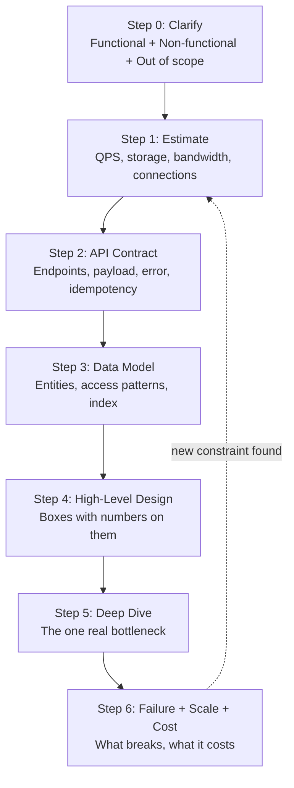
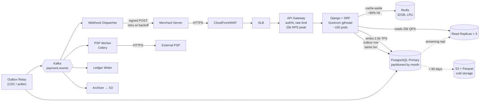
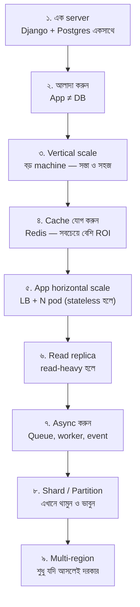

# Module 031 — System Design Methodology

> **Phase A** | পূর্বশর্ত: Django CRUD, DRF basics, SQL basics
> পরের module: M02 (Networking Deep Dive)

---

## ১. দুইটা ইন্টারভিউ, একই প্রশ্ন

দুইজন candidate. একই প্রশ্ন: *"Design a notification system."*

**Candidate A** সাথে সাথে whiteboard-এ আঁকা শুরু করল — Load Balancer, তিনটা service, Kafka, Redis, PostgreSQL, একটা Elasticsearch. পাঁচ মিনিটে সুন্দর ডায়াগ্রাম। Interviewer জিজ্ঞেস করল, "Kafka কেন?" উত্তর এল, "Kafka scalable, decoupling দেয়।" — "কত throughput লাগবে?" — "অনেক বেশি হবে।" — "Kafka না নিলে কী হতো?" — নীরবতা।

**Candidate B** প্রথম আট মিনিট **একটাও বাক্স আঁকেনি**। শুধু প্রশ্ন করেছে:

- Notification মানে কী — push, SMS, email, in-app, নাকি সব?
- কতজন user? দিনে কতগুলো notification?
- Latency requirement কী? OTP আর marketing email কি একই path-এ যাবে?
- Delivery guarantee — at-least-once নাকি exactly-once? Duplicate SMS গেলে কি সমস্যা?
- User কি notification preference/quiet hours সেট করতে পারবে?
- Fan-out আছে? একটা event থেকে ১ লক্ষ user-কে পাঠাতে হবে?

তারপর সে বোর্ডে লিখল:

```
Write:  50M notifications/day  →  ~600/sec avg, ~3000/sec peak
Read:   in-app inbox, 20M DAU × 5 opens = 100M reads/day → ~1200/sec
p95 latency: OTP < 3s (critical), marketing < 5 min (batch)
Delivery: at-least-once + idempotent consumer
```

এরপর সে আঁকা শুরু করল — এবং প্রতিটা বাক্সের পাশে **সংখ্যা** ছিল।

Candidate B পেল offer. পার্থক্যটা knowledge-এ ছিল না। দুইজনই Kafka জানত। পার্থক্য ছিল **ক্রমে** — B জানত যে system design একটা **decision-making process**, একটা **drawing exercise** না।

এই module-টা সেই process শেখানোর জন্য।

---

## ২. System Design আসলে কী (এবং কী না)

### যা **না**

| ভুল ধারণা | বাস্তবতা |
|---|---|
| "সঠিক architecture" খুঁজে বের করা | কোনো সঠিক উত্তর নেই। আছে **defensible tradeoff**। |
| যত বেশি component, তত ভালো | প্রতিটা extra component = extra failure mode + extra on-call page। |
| Diagram আঁকা | Diagram হলো **output**। আসল কাজ হলো constraint বোঝা। |
| Buzzword ব্যবহার | "Kafka লাগবে" — কেন? সংখ্যা দেখান। |
| সবচেয়ে scalable design | ১০ হাজার user-এর জন্য Netflix-এর architecture বানানো = incompetence-এর প্রমাণ। |

### যা **হ্যাঁ**

System design হলো: **অস্পষ্ট business requirement-কে constraint-এ রূপান্তর করা, তারপর সেই constraint-এর ভিত্তিতে technical tradeoff নেওয়া, এবং সেই tradeoff অন্যদের কাছে defend করতে পারা।**

লক্ষ করুন তিনটা ক্রিয়া: **রূপান্তর → সিদ্ধান্ত → ব্যাখ্যা**। Interview-এ এবং বাস্তব চাকরিতে — দুই জায়গাতেই তিনটাই লাগে।

> **Senior Tip:** Interview-এ আপনার লক্ষ্য "সঠিক design" দেওয়া না। আপনার লক্ষ্য হলো interviewer-কে দেখানো যে **আপনার সাথে কাজ করা নিরাপদ** — অর্থাৎ আপনি অজানা জিনিসকে অজানা বলবেন, requirement না বুঝে code লিখবেন না, এবং যেকোনো সিদ্ধান্তের খরচ জানেন।

---

## ৩. ছয় ধাপের Framework

এই framework-টা মুখস্থ করুন। প্রতিটা design প্রশ্নে — interview হোক বা অফিসের design doc — একই ক্রমে যাবেন।



সময় বণ্টন (৪৫ মিনিটের interview):

| Step | সময় | কেন এত |
|---|---|---|
| 0. Clarify | ৫–৮ মিনিট | এখানে কার্পণ্য করলে বাকি ৪০ মিনিট ভুল দিকে যাবে |
| 1. Estimate | ৩–৫ মিনিট | এই সংখ্যাগুলোই পরে প্রতিটা সিদ্ধান্ত justify করবে |
| 2. API | ৩ মিনিট | Contract স্পষ্ট হলে data model আপনাআপনি বেরোয় |
| 3. Data Model | ৫ মিনিট | **সবচেয়ে বেশি undervalued step** |
| 4. High-Level | ৮–১০ মিনিট | এখানেই বেশিরভাগ লোক শুরু করে — ভুল |
| 5. Deep Dive | ১০–১২ মিনিট | Staff level এখানেই আলাদা হয় |
| 6. Failure/Scale | ৫ মিনিট | না করলে "junior" ছাপ পড়ে |

---

### Step 0 — Clarify: প্রশ্ন করাটাই প্রথম দক্ষতা

তিন ধরনের জিনিস বের করতে হবে।

#### (ক) Functional Requirements — system কী করবে

সংক্ষিপ্ত রাখুন। ৩–৫টা core feature। বাকিগুলো explicitly **out of scope** ঘোষণা করুন।

```
IN SCOPE:
  1. Merchant একটা payment initiate করতে পারবে
  2. System PSP-তে পাঠাবে এবং status track করবে
  3. Merchant webhook-এ result পাবে
  4. Merchant transaction history দেখতে পারবে

OUT OF SCOPE (interviewer-কে বলে নিন):
  - Refund/chargeback flow
  - Multi-currency FX
  - Fraud scoring
  - Merchant onboarding/KYC
```

> **Senior Tip:** "Out of scope" জোরে বলা একটা **শক্তির চিহ্ন**। এটা দেখায় আপনি scope control করতে জানেন। Junior-রা সব feature ধরার চেষ্টা করে এবং কিছুই গভীরে যায় না।

#### (খ) Non-Functional Requirements — এখানেই আসল design লুকিয়ে

এই ছয়টা মাত্রা **সবসময়** জিজ্ঞেস করবেন:

| মাত্রা | প্রশ্ন | কেন গুরুত্বপূর্ণ |
|---|---|---|
| **Latency** | p50/p95/p99 কত? | Sync নাকি async architecture — এটাই ঠিক করে |
| **Throughput** | Peak QPS? Read:Write ratio? | Cache/shard/queue লাগবে কি না |
| **Availability** | 99.9% নাকি 99.99%? | Multi-AZ নাকি multi-region |
| **Consistency** | Strong নাকi eventual? | Single-primary DB নাকি distributed |
| **Durability** | Data হারানো কি গ্রহণযোগ্য? | Replication factor, WAL, backup |
| **Cost** | বাজেট আছে? | Staff+ প্রশ্ন — বেশিরভাগ candidate ভুলে যায় |

Availability-র বাস্তব অর্থ (মুখস্থ রাখুন):

| SLA | বছরে downtime | মাসে | কীভাবে অর্জন |
|---|---|---|---|
| 99% | ৩.৬৫ দিন | ৭.৩ ঘণ্টা | একটা server, ম্যানুয়াল restart |
| 99.9% | ৮.৭৬ ঘণ্টা | ৪৩ মিনিট | Multi-AZ, auto-restart, health check |
| 99.95% | ৪.৩৮ ঘণ্টা | ২২ মিনিট | + automated failover, canary deploy |
| 99.99% | ৫২.৬ মিনিট | ৪.৩ মিনিট | + multi-region, ধ্রুব on-call, chaos testing |
| 99.999% | ৫.২৬ মিনিট | ২৬ সেকেন্ড | বাস্তবে প্রায় অসম্ভব; খরচ exponential |

> **Senior Tip:** কেউ "99.999% চাই" বললে জিজ্ঞেস করুন — "আপনার dependency-গুলোর SLA কত?" যদি আপনি AWS RDS (99.95%) ব্যবহার করেন, আপনার system কখনোই 99.999% হতে পারে না। এটা বলতে পারলে আপনি অন্য লেভেলে চলে যান।

#### (গ) Scale — সংখ্যা চান

```
- কতজন total user? DAU কত?
- User প্রতি দিনে কতবার action?
- Read:Write ratio? (100:1? 1:1? 1:10?)
- Data কত দিন রাখতে হবে?
- Growth rate — ১ বছরে কত গুণ?
- Traffic কি সমান, নাকি spike আছে? (Flash sale, match time, মাস শেষ)
```

Interviewer সংখ্যা না দিলে **আপনি ধরে নিন এবং জোরে বলুন**: "আমি ধরে নিচ্ছি ১০ মিলিয়ন DAU, প্রতিজন দিনে ২০টা request। ঠিক আছে?" — এটাই সঠিক আচরণ।

---

### Step 1 — Back-of-Envelope Estimation

#### যে সংখ্যাগুলো মুখস্থ থাকতেই হবে

**সময়ের রূপান্তর:**
```
১ দিন = 86,400 সেকেন্ড ≈ 10^5 সেকেন্ড   ← এই approximation-টাই সব
১ মাস ≈ 2.5 × 10^6 সেকেন্ড
১ বছর ≈ 3 × 10^7 সেকেন্ড
```

সবচেয়ে দরকারি shortcut:
```
প্রতিদিন 1M request  ≈  12 QPS
প্রতিদিন 1B request  ≈  12,000 QPS
```

**Latency numbers (একই datacenter-এ, ২০২৬ সালের বাস্তবতা):**

| অপারেশন | সময় | মনে রাখার কৌশল |
|---|---|---|
| L1 cache reference | ~1 ns | — |
| Main memory (RAM) reference | ~100 ns | RAM = 100× L1 |
| Redis GET (same DC, network সহ) | 0.3–1 ms | **Sub-millisecond** |
| Same-DC network round trip | ~0.5 ms | |
| PostgreSQL indexed lookup | 1–5 ms | index থাকলে |
| PostgreSQL query with join, warm cache | 5–30 ms | |
| SSD random read | 50–150 µs | |
| PostgreSQL seq scan on 10M rows | 1–10 s | ☠️ এটাই আপনার outage |
| S3 GET (first byte) | 20–100 ms | |
| HTTPS handshake (new connection) | 50–200 ms | keep-alive কেন গুরুত্বপূর্ণ |
| Cross-region (Singapore ↔ Virginia) | 200–250 ms | **আলোর গতি — বদলানো যায় না** |
| Cross-region (US-East ↔ US-West) | 60–80 ms | |

> এই টেবিলের সবচেয়ে গুরুত্বপূর্ণ লাইনটা শেষেরগুলো। **Cross-region latency আপনি কোনো optimization দিয়ে কমাতে পারবেন না** — এটা পদার্থবিজ্ঞান। তাই multi-region design মানেই হয় data locality, নয়তো eventual consistency। এই একটা কথা বললে interviewer বুঝে যায় আপনি distributed system বোঝেন।

**Throughput ceiling (rule of thumb — hardware-নির্ভর, কিন্তু আলোচনার ভিত্তি):**

| Component | নিরাপদ ধারণা |
|---|---|
| Nginx (reverse proxy) | 30k–50k RPS প্রতি instance |
| **Django + Gunicorn sync worker** | **এক worker = একসাথে একটা request** |
| Django container (4 worker × 50ms response) | ~80 RPS |
| Django container (4 worker × 4 gthread × 50ms) | ~250–300 RPS |
| PostgreSQL — simple indexed read | 5k–20k QPS (single primary) |
| PostgreSQL — write with fsync | 1k–5k TPS |
| PostgreSQL — max useful connections | 100–300 (এর বেশি হলে PgBouncer) |
| Redis (single instance, single thread) | 80k–150k ops/sec |
| Kafka broker | 100k+ msg/sec (batch করলে অনেক বেশি) |
| একটা modern server-এর RAM | 64–512 GB |

#### সম্পূর্ণ worked example

**প্রশ্ন:** একটা fintech-এর payment API. ১০ লক্ষ merchant, গড়ে প্রতি merchant দিনে ৫০টা transaction. প্রতিটা transaction row ~২ KB. ৭ বছর retention (regulatory).

**QPS:**
```
দৈনিক transaction = 1,000,000 × 50 = 50,000,000 = 5 × 10^7
গড় write QPS      = 5 × 10^7 / 10^5 = 500 QPS
Peak (৫ গুণ ধরি)   = 2,500 QPS         ← মাস শেষে salary disbursement
Read (status check, dashboard) — ধরি 10:1
গড় read QPS       = 5,000 QPS
Peak read          = 25,000 QPS
```

**সিদ্ধান্ত যা এখান থেকেই বেরিয়ে আসে:**
- Write 2,500 QPS → একটা well-tuned PostgreSQL primary **পারবে** (কষ্টে)। Sharding **এখনই লাগবে না**, কিন্তু shard key আগে থেকে ভেবে রাখতে হবে।
- Read 25,000 QPS → single primary পারবে না। **Read replica + Redis cache লাগবে।**
- Read:Write = 10:1 → cache hit rate ভালো হবে। Cache-aside যথেষ্ট।

**Storage:**
```
বার্ষিক row = 5 × 10^7 × 365 ≈ 1.8 × 10^10 রো
৭ বছরে      ≈ 1.3 × 10^11 রো  ☠️
Raw data     = 1.3 × 10^11 × 2 KB ≈ 260 TB
+ index (~40%)  ≈ 364 TB
```

**সিদ্ধান্ত:** ১৩০ বিলিয়ন row এক টেবিলে রাখা অসম্ভব।
- **Partitioning বাধ্যতামূলক** (month-wise range partition)
- **Tiered storage:** সাম্প্রতিক ৯০ দিন hot (PostgreSQL SSD), পুরনো data cold (S3 + Parquet, Athena দিয়ে query)
- এই একটা estimation-ই পুরো data architecture ঠিক করে দিল

**Bandwidth:**
```
Write: 500 QPS × 2 KB = 1 MB/s  → নগণ্য
Read (peak): 25,000 × 2 KB = 50 MB/s = 400 Mbps → ঠিক আছে, কিন্তু cache না থাকলে DB-র network saturate হবে
```

**Memory (cache sizing):**
```
Hot data ধরি গত ২৪ ঘণ্টার transaction = 5 × 10^7 × 2 KB = 100 GB
পুরোটা cache করা যাবে না। 
Pareto: ২০% transaction ৮০% read পায় → 20 GB Redis যথেষ্ট
→ Redis: 32 GB instance, maxmemory-policy allkeys-lru
```

> **Senior Tip:** Estimation-এর উদ্দেশ্য নিখুঁত সংখ্যা না। উদ্দেশ্য হলো **order of magnitude** — এটা কি ১০০ QPS নাকি ১০০,০০০ QPS? এই দুইটার architecture সম্পূর্ণ আলাদা। ২,৫০০ আর ৩,১০০-র মধ্যে পার্থক্যে কিছু যায় আসে না। জোরে বলুন: "আমি round number ব্যবহার করছি, order of magnitude-টাই এখানে গুরুত্বপূর্ণ।"

---

### Step 2 — API Contract

Design করার আগে **interface** ঠিক করুন। এটা দুইটা কারণে গুরুত্বপূর্ণ:

1. Contract ঠিক হলে data model আপনাআপনি বেরিয়ে আসে
2. Interviewer বুঝতে পারে আপনি product-এর দিক থেকে ভাবছেন

DRF দিয়ে fintech payment API-র contract:

```python
# POST /api/v1/payments/
# Header: Idempotency-Key: <uuid>   ← FinTech-এ এটা optional না
{
    "amount": "1500.00",           # string! float কখনো না
    "currency": "BDT",
    "customer_reference": "ORD-8891",
    "method": "card",
    "callback_url": "https://merchant.com/hooks/payment"
}

# 202 Accepted  ← 200 না, কারণ কাজ এখনো শেষ হয়নি
{
    "id": "pay_01HQ3X8K2M",
    "status": "processing",        # processing | succeeded | failed
    "amount": "1500.00",
    "currency": "BDT",
    "created_at": "2026-07-23T10:15:00Z",
    "_links": {"self": "/api/v1/payments/pay_01HQ3X8K2M"}
}

# GET /api/v1/payments/?created_after=...&cursor=...&limit=50
# → cursor pagination, offset না (কেন — M06-এ)

# Error contract — সব endpoint-এ একই আকার
# 409 Conflict
{
    "error": {
        "code": "idempotency_key_reused",
        "message": "This key was used with a different request body.",
        "request_id": "req_01HQ3X8K2M"      # support-এর জন্য অপরিহার্য
    }
}
```

এই ছোট্ট contract-এ যে সিদ্ধান্তগুলো লুকিয়ে আছে — **প্রতিটা interview-এ বলবেন**:

| সিদ্ধান্ত | কেন |
|---|---|
| `amount` string, float না | IEEE-754 float টাকা ধরে রাখতে পারে না। `0.1 + 0.2 != 0.3` |
| `Idempotency-Key` header | Network timeout-এ merchant retry করবে। Double charge = আইনি সমস্যা |
| `202 Accepted`, `200 OK` না | Payment async — PSP-র উত্তর আসতে ২–৩০ সেকেন্ড লাগে |
| Opaque ID (`pay_01H...`), auto-increment না | Sequential ID দিয়ে প্রতিযোগী আপনার volume গুনতে পারে; enumeration attack-ও হয় |
| `request_id` error-এ | Production-এ support ticket debug করার একমাত্র উপায় |
| Cursor pagination | Offset ১০ লক্ষ row-এ মরে যায় |
| URL-এ `/v1/` | Breaking change-এর জন্য পথ খোলা রাখা |

> **Senior Tip:** Interview-এ API লেখার সময় **error response**-টাও লিখুন। ৯০% candidate শুধু happy path লেখে। Error contract লিখলে আপনি সাথে সাথে আলাদা হয়ে যান।

---

### Step 3 — Data Model (সবচেয়ে অবহেলিত ধাপ)

বেশিরভাগ system-এর আসল সীমাবদ্ধতা database-এ। তবুও candidate-রা এখানে ৩০ সেকেন্ড দেয়।

নিয়ম: **entity আগে না। Access pattern আগে।**

```
প্রশ্ন করুন:
  1. কোন query-গুলো সবচেয়ে বেশি চলবে?  (এগুলোর জন্য index)
  2. কোনটা সবচেয়ে বেশি data ছোঁবে?     (এগুলো optimize/precompute)
  3. কী দিয়ে খোঁজা হবে?                (এটাই primary access path)
  4. Shard করলে কী দিয়ে করব?            (এখনই ভাবুন, পরে বদলানো নরক)
```

Payment system-এর জন্য:

```python
# models.py — production-grade, Django
from django.db import models
from django.contrib.postgres.indexes import BrinIndex
import uuid

class Payment(models.Model):
    class Status(models.TextChoices):
        PROCESSING = "processing"
        SUCCEEDED  = "succeeded"
        FAILED     = "failed"

    id = models.UUIDField(primary_key=True, default=uuid.uuid7 
                          if hasattr(uuid, "uuid7") else uuid.uuid4)
    merchant    = models.ForeignKey("Merchant", on_delete=models.PROTECT,
                                    db_index=False)   # নিচে composite index
    # টাকা: minor unit-এ integer. NUMERIC-ও চলে, float কখনো না।
    amount_minor = models.BigIntegerField()           # 1500.00 BDT → 150000
    currency     = models.CharField(max_length=3)
    status       = models.CharField(max_length=16, choices=Status.choices)
    idempotency_key = models.CharField(max_length=64)
    request_fingerprint = models.CharField(max_length=64)  # body-র hash
    psp_reference   = models.CharField(max_length=64, null=True)
    created_at   = models.DateTimeField(auto_now_add=True)

    class Meta:
        constraints = [
            # একই merchant একই key দুইবার ব্যবহার করতে পারবে না
            models.UniqueConstraint(
                fields=["merchant", "idempotency_key"],
                name="uniq_merchant_idempotency",
            ),
            models.CheckConstraint(
                check=models.Q(amount_minor__gt=0),
                name="amount_positive",
            ),
        ]
        indexes = [
            # প্রধান access path: "আমার merchant-এর সাম্প্রতিক payment"
            models.Index(fields=["merchant", "-created_at"],
                         name="idx_merchant_recent"),
            # Reconciliation job: "গত ঘণ্টার সব processing payment"
            models.Index(fields=["status", "created_at"],
                         condition=models.Q(status="processing"),
                         name="idx_stuck_payments"),   # partial index
        ]
```

তিনটা সিদ্ধান্ত যা interview-এ ব্যাখ্যা করবেন:

**১. UUIDv7, UUIDv4 না।** UUIDv4 random — B-Tree index-এ প্রতিটা insert এলোমেলো page-এ যায়, index bloat আর random I/O হয়। UUIDv7 time-ordered, তাই insert index-এর ডান প্রান্তে হয় — auto-increment-এর মতো দ্রুত, কিন্তু enumerable না। (বিস্তারিত M07-এ।)

**২. `amount_minor` BigInteger।** ১৫০০.০০ টাকা → ১৫০০০০ পয়সা। কখনো float না। `NUMERIC(20,4)`-ও সঠিক, কিন্তু integer-এ arithmetic দ্রুত এবং rounding bug অসম্ভব।

**৩. Partial index।** `idx_stuck_payments` শুধু `processing` row-গুলোতে। ১৩০ বিলিয়ন row-এর মধ্যে হয়তো ১০ হাজার processing — তাই index-টা কয়েক MB, পুরো টেবিলের index হলে হতো TB.

**Shard key:** `merchant_id`. কারণ — প্রায় প্রতিটা query merchant-scoped, তাই cross-shard query প্রায় লাগবে না। ঝুঁকি: একটা বিশাল merchant একটা shard-কে hot করে দিতে পারে (**hot partition problem**) — সেক্ষেত্রে ওই merchant-কে আলাদা shard-এ সরাতে হবে।

> **Senior Tip:** "আমি এখন shard করছি না, কিন্তু shard key হিসেবে `merchant_id` ধরে schema বানাচ্ছি, যাতে ভবিষ্যতে দরকার হলে migration সহজ হয়" — এই বাক্যটা Staff-level চিন্তা। Junior হয় shard করে ফেলে (over-engineering), নয়তো একেবারেই ভাবে না (future pain)।

---

### Step 4 — High-Level Design

এখন — এবং **কেবল এখন** — বাক্স আঁকুন। প্রতিটা বাক্সের পাশে সংখ্যা লিখুন।



আঁকার সময় যা বলবেন (এটাই আসল পরীক্ষা):

- **"API layer stateless"** — তাই horizontal scale করা যায়, session Redis-এ।
- **"Write primary-তে, read replica-তে"** — কিন্তু **replication lag** আছে। Payment create করে সাথে সাথে GET করলে ৪০৪ পেতে পারে। সমাধান: create-এর পর ওই merchant-এর read কিছুক্ষণ primary-তে পাঠানো (read-your-writes), অথবা response থেকেই object ফেরত দেওয়া।
- **"Outbox pattern"** — Payment row আর Kafka event **একই transaction-এ** লেখা যায় না (dual-write problem)। তাই একই DB transaction-এ `payment` আর `outbox` row লিখি, আলাদা relay process Kafka-তে পাঠায়। এতে "DB-তে লেখা হলো কিন্তু event গেল না" — এই bug অসম্ভব হয়ে যায়। (বিস্তারিত M14-এ।)
- **"PSP call কখনোই request path-এ না"** — বাইরের service ৩০ সেকেন্ড ঝুলে থাকতে পারে। ঝুললে আপনার Gunicorn worker আটকে যাবে, তারপর pool শেষ, তারপর পুরো API down। তাই async।

> **Senior Tip:** এই শেষ পয়েন্টটা — "external call কখনো synchronous request path-এ না" — সবচেয়ে বেশি production outage-এর কারণ যা আমি দেখেছি। Django/Gunicorn sync worker-এ একটা slow third-party API পুরো site নামিয়ে দিতে পারে। এটা বললে interviewer বুঝে যায় আপনি প্রকৃত production দেখেছেন।

---

### Step 5 — Deep Dive: আসল bottleneck খুঁজুন

Interviewer এখন বলবে, "X নিয়ে আরেকটু বলুন।" অথবা বলবে না — তখন **আপনি নিজেই** সবচেয়ে ঝুঁকিপূর্ণ জায়গা বেছে নেবেন।

কীভাবে bottleneck চিনবেন — এই টেবিলটা মুখস্থ রাখুন:

| উপসর্গ | সাধারণ কারণ | মানক সমাধান |
|---|---|---|
| Read QPS >> DB capacity | সব read DB-তে যাচ্ছে | Cache → read replica → denormalize |
| Write QPS >> DB capacity | Single primary | Batch → queue/async → shard → LSM store |
| একটা entity-তে সব traffic | Hot key / celebrity problem | Local cache, request coalescing, key splitting |
| Fan-out বিশাল (১ → ১০ লক্ষ) | Write-time fan-out | Hybrid: সাধারণ user push, celebrity pull |
| p99 খারাপ কিন্তু p50 ভালো | Tail latency, GC, lock contention | Hedged request, timeout, connection pool tuning |
| Storage বিশাল | Retention policy নেই | Partition + tiered storage + compression |
| External dependency slow | Sync call | Async + circuit breaker + timeout budget |
| Cross-region latency | ভূগোল | Data locality, edge cache, eventual consistency |

আমাদের payment system-এ আসল bottleneck **কোনটাই না** — আসল ঝুঁকি হলো **correctness**। এটাই deep dive করব:

#### Idempotency — FinTech-এর ১ নম্বর জিনিস

Merchant একটা request পাঠাল। Network timeout হলো। Merchant জানে না — টাকা কাটল কি কাটল না? সে retry করবে। **Double charge হলে আপনার কোম্পানি লাইসেন্স হারাতে পারে।**

```python
# services/payments.py
from django.db import transaction, IntegrityError
import hashlib, json

class IdempotencyConflict(Exception):
    pass

def _fingerprint(payload: dict) -> str:
    canonical = json.dumps(payload, sort_keys=True, separators=(",", ":"))
    return hashlib.sha256(canonical.encode()).hexdigest()

def create_payment(*, merchant, payload: dict, idempotency_key: str) -> Payment:
    fp = _fingerprint(payload)

    # ধাপ ১: আগে থেকে আছে কি না
    existing = Payment.objects.filter(
        merchant=merchant, idempotency_key=idempotency_key
    ).first()
    if existing:
        # একই key, ভিন্ন body → merchant-এর bug. জানিয়ে দিন।
        if existing.request_fingerprint != fp:
            raise IdempotencyConflict()
        return existing          # একই key, একই body → আগের ফলাফল ফেরত

    # ধাপ ২: তৈরি করার চেষ্টা. Race থাকলে DB constraint ধরবে।
    try:
        with transaction.atomic():
            payment = Payment.objects.create(
                merchant=merchant,
                amount_minor=payload["amount_minor"],
                currency=payload["currency"],
                status=Payment.Status.PROCESSING,
                idempotency_key=idempotency_key,
                request_fingerprint=fp,
            )
            # একই transaction-এ outbox — এখানেই dual-write সমস্যার সমাধান
            OutboxEvent.objects.create(
                topic="payment.created",
                aggregate_id=str(payment.id),
                payload={"payment_id": str(payment.id),
                         "amount_minor": payment.amount_minor},
            )
    except IntegrityError:
        # দুইটা concurrent request একসাথে ঢুকেছিল. অন্যজন জিতেছে।
        payment = Payment.objects.get(
            merchant=merchant, idempotency_key=idempotency_key
        )
        if payment.request_fingerprint != fp:
            raise IdempotencyConflict()
    return payment
```

এই ২৫ লাইনে যা যা আছে — **প্রতিটা interview-এ বলার মতো**:

1. **Check-then-create-এ race আছে** — তাই আমরা শুধু check-এর উপর ভরসা করিনি। আসল guarantee দেয় **database unique constraint**, application logic না। এটাই সঠিক চিন্তা: *correctness DB-তে enforce করুন, code-এ না।*
2. **`IntegrityError` catch করে recover** — race হারলেও সঠিক উত্তর দিই, error না।
3. **Fingerprint check** — একই key দিয়ে ভিন্ন amount পাঠালে সেটা merchant-এর bug, চুপচাপ পুরনো result দিলে আরও বড় সমস্যা হবে। তাই 409।
4. **Outbox একই `atomic()` block-এ** — Payment রইল কিন্তু event গেল না, এই অবস্থা অসম্ভব।
5. **Canonical JSON** — key ordering আলাদা হলে যেন fingerprint বদলে না যায়।

> **Common Mistake:** অনেকে idempotency Redis-এ করে (`SETNX key`). এটা কাজ করে, কিন্তু Redis হারালে (eviction, restart, failover) guarantee হারিয়ে যায়। **টাকার ক্ষেত্রে idempotency সবসময় durable store-এ** — PostgreSQL. Redis শুধু fast path হিসেবে সামনে রাখতে পারেন, source of truth হিসেবে না।

---

### Step 6 — Failure Modes, Scaling, Cost

কেউ না জিজ্ঞেস করলেও এই তিনটা নিজে থেকে বলবেন। এটাই "junior" আর "senior" ছাপের সীমানা।

#### (ক) কী কী ভাঙবে

প্রতিটা component ধরে বলুন: *এটা মরলে কী হয়?*

| যা মরে | কী হয় | Mitigation |
|---|---|---|
| একটা API pod | কিছু না | LB health check, N+2 replica |
| Redis পুরো | DB-তে load ১০× — DB মরতে পারে | Circuit breaker, cache miss-এ rate limit, degraded mode |
| PostgreSQL primary | Write বন্ধ | Patroni auto-failover, ~30s downtime. Write buffer করা যায় কি? |
| Read replica | Read latency বাড়ে | Primary-তে fallback, কিন্তু primary-কে বাঁচাতে rate limit |
| Kafka | Event জমতে থাকে | Outbox row DB-তেই থাকে → recover হলে replay. **Data হারায় না** |
| External PSP | Payment আটকে যায় | Circuit breaker, queue-তে জমা, status = `pending_psp`, merchant-কে জানানো |
| পুরো AZ | ক্ষমতা অর্ধেক | Multi-AZ, ৫০% headroom রাখা |
| পুরো region | সব বন্ধ | Multi-region — কিন্তু খরচ ২×. **এটা কি আসলেই দরকার?** |

শেষ লাইনটাই senior চিন্তা। "Multi-region করব" বলা সহজ। "Multi-region-এ খরচ দ্বিগুণ হবে, ledger-এ cross-region consistency নরক, এবং আমাদের SLA 99.95% — তাই multi-AZ যথেষ্ট, multi-region শুধু DR-এর জন্য warm standby" — এইটা staff-level।

#### (খ) ১০× হলে কী বদলাবে

```
বর্তমান: 2.5k write QPS, 25k read QPS, 364 TB
১০×:     25k write QPS, 250k read QPS, 3.6 PB

কী ভাঙবে:
  ✗ Single PostgreSQL primary — 25k write TPS অসম্ভব
  ✗ Redis 32GB — hot set বেড়ে যাবে
  ✓ API layer — শুধু pod বাড়ালেই হবে (stateless)
  ✓ Kafka — partition বাড়ালেই হবে

কী করব:
  1. merchant_id দিয়ে shard (schema-তে আগেই ধরা ছিল ✓)
  2. Redis Cluster
  3. Read-heavy dashboard আলাদা read model-এ (CQRS)
  4. ৩০ দিনের পর cold storage-এ পাঠানো
```

#### (গ) খরচ (Staff+ differentiator)

মোটামুটি হিসাব দিন — নিখুঁত না হলেও চলবে:

```
100 API pods (2 vCPU, 4GB)        ≈  $3,500/mo
PostgreSQL primary (r6g.4xlarge)  ≈  $1,000/mo
3 read replica                    ≈  $3,000/mo
Redis (cache.r6g.xlarge)          ≈    $400/mo
Kafka (MSK, 3 broker)             ≈    $800/mo
S3 (364 TB, tiered to Glacier)    ≈  $1,500/mo
Data transfer + LB                ≈  $1,200/mo
                                    ───────────
                                    ~$11,400/mo  ≈ $137k/year

Transaction প্রতি খরচ = $11,400 / 1.5 বিলিয়ন = $0.0000076
```

> **Senior Tip:** শেষ লাইনটা — **unit economics** — খুব কম candidate বলে। "প্রতি transaction-এ আমাদের infra খরচ ০.০০০৮ সেন্ট, আর আমরা ২০ সেন্ট নিই — তাই infra মোট খরচের নগণ্য অংশ, এবং engineering time-ই আসল খরচ" — এই বাক্যে আপনি engineer থেকে **business partner** হয়ে যান। Principal-level promotion এখানেই আটকায় বা খোলে।

---

## ৪. Scaling Ladder — সবসময় নিচ থেকে উপরে

Junior-রা সরাসরি ধাপ ৮-এ ঝাঁপ দেয়। Senior-রা ধাপে ধাপে ওঠে এবং **প্রতিটা ধাপে থামার কারণ** জানে।



| ধাপ | কখন পরেরটায় যাবেন | সাবধানতা |
|---|---|---|
| ১–২ | সাথে সাথে | — |
| ৩ Vertical | CPU/RAM ৭০% ছুঁলে | **অবমূল্যায়িত।** ২০২৬-এ একটা machine-এ ১২৮ vCPU / ২ TB RAM পাওয়া যায়। বেশিরভাগ startup কখনো এর সীমা ছোঁয় না। |
| ৪ Cache | Read latency খারাপ, একই data বারবার | Invalidation = কঠিনতম সমস্যা। Stampede-এর জন্য প্রস্তুত থাকুন (M10) |
| ৫ Horizontal | Traffic একটা app server-এর বেশি | App **সত্যিই** stateless তো? Local file, in-memory cache, sticky session? |
| ৬ Replica | Read >> Write | **Replication lag** — read-after-write ভাঙবে |
| ৭ Async | কাজ ৫০০ms-এর বেশি লাগে | Eventual consistency এসে গেল। UI কীভাবে দেখাবে? |
| ৮ Shard | একটা primary write নিতে পারছে না | **শেষ অস্ত্র।** Cross-shard join, transaction, rebalancing — সব কঠিন |
| ৯ Multi-region | Regulatory বা global latency | খরচ ২×, complexity ৫× |

> **Senior Tip:** Interview-এ কেউ বললে "কীভাবে scale করবেন?" — এই ladder ধরে হাঁটুন, লাফ দেবেন না। এবং শুরুতেই বলুন: **"আগে জানতে চাই আমরা এখন কোন ধাপে আছি এবং কোথায় ব্যথা হচ্ছে।"**

---

## ৫. Django-নির্দিষ্ট বাস্তবতা

আপনার stack Django/DRF, তাই এই অংশটা সরাসরি প্রাসঙ্গিক।

### Django কোথায় পুরোপুরি ঠিক আছে

Instagram Django-তে চলে। কয়েকশো মিলিয়ন user নিয়ে। তাই "Django scale করে না" — এটা মিথ্যা। যা সত্য: **Django-তে ভুল করা সহজ, এবং ভুলগুলো scale-এ ভয়ংকর হয়ে ওঠে।**

Django দিয়ে আরামে করা যায়:
- Request/response API (হাজার হাজার RPS, ঠিকমতো করলে)
- Complex business logic, admin, permission
- OLTP workload

### Django কোথায় ভাঙে

| সমস্যা | কারণ | কী করবেন |
|---|---|---|
| Long-lived connection (WebSocket) | Sync worker per-connection আটকে থাকে | Channels + ASGI, বা আলাদা Go/Node service (M27) |
| CPU-bound কাজ (image, ML) | GIL | Celery worker, বা আলাদা service |
| Sub-millisecond latency (matching engine) | Python + ORM overhead | এটা Django-র কাজই না। Rust/C++/Java (M32-6) |
| Slow external API call | Sync worker আটকে যায় | **সবসময় async/Celery-তে সরান** |
| N+1 query | ORM-এর lazy loading | `select_related`/`prefetch_related`, `nplusone` detector (M05) |
| DB connection বিস্ফোরণ | pod × worker × `CONN_MAX_AGE` | PgBouncer (M07) |

### যে হিসাবটা প্রতিটা Django engineer-এর জানা উচিত

```
Django container-এ concurrent capacity:

  sync worker:     capacity = workers
  gthread worker:  capacity = workers × threads

  RPS = capacity / avg_response_time_sec

উদাহরণ: 4 worker × 4 thread = 16 concurrent
        গড় response 50ms
        → RPS = 16 / 0.05 = 320 RPS প্রতি container

25,000 peak RPS দরকার হলে:
        25,000 / 320 ≈ 78 container (+ headroom) → ~100 pod
```

**এখন ভয়ংকর অংশটা:** ধরুন একটা third-party API ঝুলে গেল, response time 50ms থেকে 5s হলো।

```
RPS = 16 / 5 = 3.2 RPS প্রতি container
100 container × 3.2 = 320 RPS মোট capacity

কিন্তু traffic আসছে 25,000 RPS।
→ Queue ভরে যাবে, timeout, cascading failure, পুরো API down।
```

**একটা slow dependency পুরো system নামিয়ে দিল।** এই কারণেই timeout, circuit breaker, bulkhead — এগুলো optional না (M16)। Interview-এ এই হিসাবটা বোর্ডে করে দেখালে আপনি অন্য লেভেলে চলে যান।

```python
# সবসময়। প্রতিটা external call-এ।
import requests
from requests.adapters import HTTPAdapter, Retry

session = requests.Session()
session.mount("https://", HTTPAdapter(
    pool_connections=20, pool_maxsize=50,
    max_retries=Retry(total=2, backoff_factor=0.3,
                      status_forcelist=[502, 503, 504],
                      allowed_methods=["GET"]),  # POST retry করবেন না!
))

resp = session.post(url, json=payload,
                    timeout=(3.05, 10))   # (connect, read) — কখনো খালি রাখবেন না
```

`timeout=` না দিলে `requests` **অসীম কাল** অপেক্ষা করে। এটাই সবচেয়ে সাধারণ production outage-এর বীজ।

---

## ৬. Tradeoff-এর ভাষা: senior-এর মতো কথা বলা

Interviewer আসলে যা মাপছে তা হলো — আপনি **দুই পাশ দেখতে পান কি না**।

### দুর্বল বনাম শক্তিশালী বাক্য

| ❌ দুর্বল | ✅ শক্তিশালী |
|---|---|
| "Kafka ব্যবহার করব, এটা scalable" | "2.5k events/sec আর replay দরকার, তাই Kafka. RabbitMQ-ও পারত, কিন্তু replay নেই। খরচ: operational complexity — একটা Kafka cluster maintain করার লোক লাগবে।" |
| "Cache যোগ করব" | "Read:Write 10:1, তাই cache-aside দিলে DB load ~৯০% কমবে. খরচ: stale data 30s পর্যন্ত। Balance-এর জন্য গ্রহণযোগ্য না, তাই ওটা cache করব না — শুধু transaction history করব।" |
| "Microservices ব্যবহার করব" | "এখন ৮ জনের টিম — modular monolith রাখব, ভেতরে পরিষ্কার boundary সহ। টিম ৩০+ হলে বা deployment coupling ব্যথা দিলে split করব।" |
| "NoSQL scale করে" | "আমাদের access pattern merchant-scoped এবং আমাদের ACID transaction লাগে ledger-এর জন্য। PostgreSQL + partitioning যথেষ্ট। Cassandra নিলে transaction হারাতাম, যেটা FinTech-এ অগ্রহণযোগ্য।" |

### টেমপ্লেট

> **"আমি X বেছে নিচ্ছি, কারণ [সংখ্যাসহ constraint]।
> বিকল্প ছিল Y, যেটা [সুবিধা] দিত কিন্তু [খরচ] আনত।
> X-এর দুর্বলতা হলো [সৎ স্বীকারোক্তি], যেটা আমি [mitigation] দিয়ে সামলাব।
> [শর্ত] হলে আমি সিদ্ধান্ত পুনর্বিবেচনা করব।"**

শেষ লাইনটা — *"কখন আমি মত বদলাব"* — সবচেয়ে বেশি সংখ্যক interviewer-এর নোটে "strong hire" লেখায়।

---

## ৭. Senior vs Staff vs Principal — একই প্রশ্ন, ভিন্ন প্রত্যাশা

একই প্রশ্ন: *"Design a payment system."*

| | Senior | Staff | Principal |
|---|---|---|---|
| **ফোকাস** | সঠিক component, কাজ করা design | Failure mode, migration path, organizational fit | Business tradeoff, ৩ বছরের দিক, build vs buy |
| **Estimation** | QPS ও storage করে | + খরচ ও unit economics | + খরচকে business decision-এ যুক্ত করে |
| **Tradeoff** | কয়েকটা বলে | প্রতিটা সিদ্ধান্তে দুই পাশ | কোন tradeoff **গুরুত্বপূর্ণ না** সেটাও বলে |
| **Failure** | জিজ্ঞেস করলে বলে | নিজে থেকে বলে | Blast radius ও degraded mode design করে |
| **টিম** | উল্লেখ করে না | টিমের আকার ও দক্ষতা ধরে design করে | Conway's law, hiring, ownership boundary |
| **Migration** | Greenfield ধরে নেয় | বিদ্যমান system থেকে পথ আঁকে | Incremental delivery ও risk staging |
| **সেরা বাক্য** | "এভাবে করব" | "এভাবে করব, আর এই কারণে অন্যভাবে করব না" | "প্রথম প্রশ্ন — আমরা কি আদৌ এটা বানাব, নাকি Stripe ব্যবহার করব?" |

> Principal-level-এর একটা আসল উত্তর: *"এই design-টা ৬ মাস আর ৪ জন engineer নেবে। Stripe Connect আমাদের ৯০% চাহিদা মেটায়, খরচ ২.৯% + ৩০¢. আমাদের volume-এ সেটা বছরে $২ মিলিয়ন. তাই break-even ৮ মাসে — কিন্তু আমরা licensing risk আর PCI scope নিজেদের কাঁধে নেব। আমি বলব প্রথম বছর Stripe দিয়ে যাই, আর ledger-টা নিজেরা বানাই যাতে পরে migrate করা যায়।"* — এটা আর engineering answer না, এটা business answer। আর এটাই Principal।

---

## ৮. সবচেয়ে সাধারণ ভুল

| ভুল | কেন খারাপ | পরিবর্তে |
|---|---|---|
| সাথে সাথে আঁকা শুরু | Requirement না বুঝে design | ৫–৮ মিনিট প্রশ্ন করুন |
| Estimation বাদ দেওয়া | সব সিদ্ধান্ত ভিত্তিহীন হয় | সংখ্যা লিখুন, তারপর design |
| Buzzword ছেটানো | "কেন?" এ ধরা পড়বেন | প্রতিটা component-এর পাশে সংখ্যা |
| Over-engineering | ১০ হাজার user-এ Kafka+K8s+service mesh | Scaling ladder-এ নিচ থেকে উঠুন |
| Data model ৩০ সেকেন্ডে | আসল সীমাবদ্ধতা এখানেই | Access pattern আগে, entity পরে |
| Failure mode না বলা | "কখনো prod handle করেনি" ছাপ | Step 6 নিজে থেকে করুন |
| চুপ করে ভাবা | Interviewer কিছুই দেখতে পায় না | জোরে ভাবুন: "আমি ভাবছি X নাকি Y..." |
| ভুল ধরা পড়লে defend করা | Rigidity = red flag | "ভালো ধরেছেন, তাহলে আমার Z বদলাতে হবে" |
| Consistency নিয়ে না ভাবা | Distributed system-এর মূল প্রশ্ন | প্রতিটা data flow-এ জিজ্ঞেস করুন |
| ৪৫ মিনিটে ১টা topic-এ ২০ মিনিট | Breadth দেখানো হলো না | ঘড়ি দেখুন, নিজে নিজে এগিয়ে যান |

---

## ৯. Interview Section

### প্রশ্ন ১ (Senior) — "Estimate the QPS for a system with 100M DAU, each user making 20 requests per day."

**❌ Wrong Answer**
> "অনেক বেশি হবে, তাই আমরা Kafka আর Kubernetes ব্যবহার করব।"

*কেন খারাপ:* সংখ্যা চাওয়া হয়েছে, সংখ্যা দেননি। এবং solution লাফ দিয়েছেন।

**✅ Ideal Answer**
> "মোট request = 100M × 20 = 2 বিলিয়ন/দিন. দিনে ~10^5 সেকেন্ড, তাই গড় = 2×10^9 / 10^5 = 20,000 QPS. Traffic সমান না — সাধারণত peak গড়ের ৩–৫ গুণ, ধরি ৪× = **80,000 QPS peak**."

**🌟 Senior/Staff Answer**
> উপরেরটা, তারপর:
> "এখন এই সংখ্যাটা কী বলছে সেটা দেখি। 80k QPS মানে একটা DB primary-তে সরাসরি যাবে না। প্রশ্ন হলো read:write ratio কত? যদি 100:1 হয়, তাহলে write মাত্র 800 QPS — একটা PostgreSQL primary সেটা সামলাবে, আর read cache + replica-তে যাবে। যদি 1:1 হয়, তাহলে 40k write QPS — তখন sharding বা LSM-based store লাগবে, সম্পূর্ণ আলাদা architecture.
> আরেকটা প্রশ্ন — এই peak কি predictable? যদি প্রতিদিন রাত ৮টায় হয়, তাহলে scheduled scaling. যদি অপ্রত্যাশিত spike হয় (viral event), তাহলে queue + load shedding লাগবে, কারণ autoscaling-এর warm-up time-ই ২–৩ মিনিট।"

**⚠️ Common Mistakes:** peak factor ভুলে যাওয়া; 86,400-কে 10^5 না ধরে ক্যালকুলেটর খোঁজা; সংখ্যা বের করে সেটা দিয়ে কিছু না করা।

---

### প্রশ্ন ২ (Senior) — "আপনার API-র p50 latency 40ms, কিন্তু p99 3.5 সেকেন্ড। কী হচ্ছে?"

**❌ Wrong Answer**
> "Server slow, বড় instance নিতে হবে।"

**✅ Ideal Answer**
> "p50 ভালো মানে সাধারণ path ঠিক আছে — এটা resource shortage না, এটা **variance**. সম্ভাব্য কারণ:
> ১. কিছু request-এ N+1 query বা missing index (data-dependent)
> ২. DB connection pool exhaustion — কিছু request pool-এর জন্য অপেক্ষা করছে
> ৩. Lock contention — কিছু row-তে concurrent write
> ৪. External API call কিছু path-এ
> ৫. GC pause বা container CPU throttling (cgroup limit)
> আমি APM-এ p99 request-গুলোর trace দেখব — সেখানেই উত্তর থাকবে।"

**🌟 Senior/Staff Answer**
> উপরেরটা, তারপর:
> "আরও দুইটা জিনিস দেখব। প্রথমত, p99 কি নির্দিষ্ট endpoint-এ নাকি ছড়ানো? নির্দিষ্ট হলে সেই query. ছড়ানো হলে infrastructure-level — pool, CPU throttle, বা noisy neighbor.
> দ্বিতীয়ত, **p99-টা কি আসলেই সমস্যা?** যদি এটা analytics dashboard হয়, ৩.৫ সেকেন্ড হয়তো গ্রহণযোগ্য। যদি payment হয়, তাহলে critical. SLO ছাড়া 'p99 খারাপ' বলার কোনো মানে নেই — আগে SLO ঠিক করব, তারপর error budget-এর ভিত্তিতে ঠিক করব এটা এখন ফিক্স করব নাকি backlog-এ যাবে।
> আর একটা কথা — **tail latency amplification**. যদি একটা page ১০টা backend call করে আর প্রতিটার p99 1%, তাহলে page-এর ~১০% request slow হবে। তাই microservice-এ p99 আরও বেশি গুরুত্বপূর্ণ।"

**⚠️ Common Mistakes:** average latency দেখা; "scale up" বলা; SLO context ছাড়া উত্তর।

---

### প্রশ্ন ৩ (Staff / Architecture Decision) — "আমরা কি এই নতুন feature-এর জন্য আলাদা microservice বানাব?"

**❌ Wrong Answer**
> "হ্যাঁ, microservice ভালো, independently deploy আর scale করা যায়।"

**✅ Ideal Answer**
> "নির্ভর করে। আমি জিজ্ঞেস করব: টিম কত বড়? এই feature কি আলাদা scaling profile-এর? এর data কি আলাদা? Deployment coupling কি এখন ব্যথা দিচ্ছে? যদি এগুলোর উত্তর 'না' হয়, তাহলে modular monolith-এ পরিষ্কার boundary রাখা ভালো।"

**🌟 Senior/Staff Answer**
> "আমি একটা decision framework ব্যবহার করি। Split করা তখনই সঠিক যখন অন্তত দুইটা সত্য:
> ১. **টিম boundary** — আলাদা টিম এটার মালিক হবে, আর deployment coordination এখন ব্যথা দিচ্ছে
> ২. **আলাদা scaling profile** — যেমন এটা CPU-heavy আর বাকি system I/O-heavy
> ৩. **আলাদা availability requirement** — এটা down হলে core flow যেন বাঁচে
> ৪. **আলাদা technology দরকার** — Python-এ করা যাচ্ছে না
>
> যদি এগুলো না থাকে, split করার খরচ হবে: network call (যেটা আগে function call ছিল), distributed transaction, আলাদা deployment pipeline, আলাদা on-call, debugging-এ distributed tracing লাগবে। এবং সবচেয়ে বড় ঝুঁকি — **distributed monolith**: দুইটা service কিন্তু একসাথে deploy করতে হয়। এটা দুই জগতের খারাপ দিক।
>
> আমার সুপারিশ: **modular monolith** দিয়ে শুরু করুন — আলাদা Django app, পরিষ্কার internal API, আলাদা DB schema, cross-module direct ORM query নিষিদ্ধ (linter দিয়ে enforce)। এতে boundary-টা পাওয়া যায়, খরচ ছাড়া। পরে দরকার হলে extract করা তুলনামূলক সহজ, কারণ seam আগে থেকেই আঁকা।
>
> আর সৎভাবে — বেশিরভাগ কোম্পানি microservice করে organizational কারণে, technical কারণে না। সেটা বৈধ কারণ, কিন্তু সেটাই বলা উচিত।"

**⚠️ Common Mistakes:** কোনো shared context ছাড়া "হ্যাঁ" বলা; Conway's law না জানা; migration path না বলা।

---

### প্রশ্ন ৪ (Scenario / Production Incident) — "Deploy-এর পর API-র p99 latency ২০০ms থেকে ৮ সেকেন্ড হয়ে গেছে। Error rate স্বাভাবিক। কী করবেন?"

**❌ Wrong Answer**
> "Log দেখব আর কোড debug করব।"

*কেন খারাপ:* Production incident-এ প্রথম কাজ **debug করা না, bleeding থামানো**।

**✅ Ideal Answer**
> "প্রথমে **rollback**. Root cause পরে খুঁজব। Deploy-এর সাথে correlation স্পষ্ট, তাই আগের version-এ ফিরে যাব, latency স্বাভাবিক হলো কি না দেখব। তারপর staging-এ reproduce করে কারণ খুঁজব — সম্ভবত নতুন query বা N+1."

**🌟 Senior/Staff Answer**
> "ধাপে ধাপে:
>
> **০–২ মিনিট — Stabilize.** Rollback শুরু করি। এটাই ডিফল্ট। 'আগে বুঝে নিই' করতে গিয়ে ১৫ মিনিট user ভোগে।
>
> **সমান্তরালে — Confirm.** Rollback হতে হতে দেখি: (ক) সব endpoint নাকি নির্দিষ্ট? (খ) DB-র CPU/connection/lock কেমন? (গ) Cache hit rate পড়েছে কি? (ঘ) Deploy-এর সাথে timestamp মিলছে?
>
> **Error rate স্বাভাবিক — এটা একটা গুরুত্বপূর্ণ সূত্র।** মানে code exception ছুঁড়ছে না, শুধু ধীর। এটা প্রায় সবসময় তিনটার একটা: (১) নতুন/বদলানো DB query যেটা index ব্যবহার করছে না, (২) N+1 — নতুন serializer field যোগ হয়েছে, (৩) connection pool exhaustion — নতুন code বেশি connection ধরছে।
>
> **Rollback-এ কাজ না হলে** — তখন এটা deploy-জনিত না। দেখব: DB-তে কি autovacuum চলছে? Query planner কি হঠাৎ plan বদলেছে (statistics stale)? কোনো একটা merchant কি হঠাৎ ১০× traffic পাঠাচ্ছে? Third-party dependency slow?
>
> **Incident-এর পরে:** blameless postmortem। কিন্তু আসল প্রশ্ন হবে — **এটা staging-এ কেন ধরা পড়েনি?** সম্ভবত staging-এ ১০০০ row আর prod-এ ১০ কোটি। Action item হবে: (ক) CI-তে query count assertion, (খ) production-scale data দিয়ে load test, (গ) canary deploy যাতে ৫% traffic-এ ধরা পড়ে, (ঘ) latency-র উপর automated rollback trigger।
>
> শেষ পয়েন্টটাই আসল ফল — একটা incident-এর মূল্য হলো এমন system বানানো যাতে ওই শ্রেণির incident আর না হয়।"

**⚠️ Common Mistakes:** rollback-এর আগে debug করা; error rate-এর সূত্রটা মিস করা; postmortem/prevention না বলা।

---

### প্রশ্ন ৫ (Coding) — "Concurrent-safe idempotent create লিখুন।"

উপরের Step 5-এর কোডটাই উত্তর। যা বলতে হবে:

**❌ Wrong Answer**
```python
if Payment.objects.filter(key=key).exists():
    return Payment.objects.get(key=key)
return Payment.objects.create(...)
```
*কেন খারাপ:* **TOCTOU race**। দুইটা request একসাথে `exists()` চালালে দুইটাই `False` পাবে, দুইটাই create করবে। Double charge.

**🌟 Senior Answer**
> "Application-level check যথেষ্ট না — correctness-এর guarantee **database constraint** থেকে আসতে হবে। `UniqueConstraint(merchant, idempotency_key)` দিই, তারপর `IntegrityError` catch করে winner-এর row ফেরত দিই। Check-টা রাখি শুধু fast path হিসেবে, guarantee হিসেবে না।
> সাথে request body-র fingerprint রাখি — একই key ভিন্ন body হলে 409, চুপচাপ ভুল result না।
> আর outbox row একই `transaction.atomic()` block-এ, যাতে event publish আর DB write আলাদা হয়ে না যায়।
> **নিয়ম:** যদি কোনো invariant-এর উপর টাকা নির্ভর করে, সেটা database-এ enforce করুন — application code-এ না।"

---

### প্রশ্ন ৬ (System Design, open-ended) — "Design a URL shortener." *(ক্লাসিক warm-up)*

সময় কম থাকলে যে কাঠামোয় উত্তর দেবেন:

> **Clarify (২ মিনিট):** কতগুলো URL/দিন? Custom alias? Expiry? Analytics? Read:Write ratio?
> ধরি: 100M new URL/দিন, read:write = 100:1, ৫ বছর retention.
>
> **Estimate (২ মিনিট):** Write = 10^8/10^5 = **1,000 QPS**. Read = **100,000 QPS**. Storage = 5 বছর × 3.65×10^10 URL × 500 bytes ≈ **18 TB**.
>
> **মূল অন্তর্দৃষ্টি:** এটা একটা **read-heavy, immutable key-value** problem। Immutable মানে **cache invalidation নেই** — তাই cache hit rate ৯৫%+ হবে। এই একটা পর্যবেক্ষণ পুরো design সহজ করে দেয়।
>
> **Key generation:** counter + base62 (predictable, কিন্তু sequential — enumerable), নাকি random 7-char (3.5×10^12 combination, collision চেক লাগে)? আমি **pre-generated key pool** নেব — একটা offline service key বানিয়ে রাখে, API শুধু pool থেকে তুলে নেয়। এতে write path-এ collision retry নেই।
>
> **Storage:** এটা relational data না। Key → URL. Cassandra/DynamoDB ভালো fit — কিন্তু 18 TB PostgreSQL + partitioning-ও পারে। টিম Postgres জানলে Postgres-ই নেব।
>
> **Read path:** CDN → Redis → DB. 100k QPS-এর ৯৫% Redis-এ, ৫% = 5k QPS DB-তে — সহজ।
>
> **Failure:** Redis গেলে DB-তে 100k QPS যাবে → মরবে। তাই Redis Cluster + DB-র সামনে rate limit + local in-process cache।

---

### প্রশ্ন ৭ (Staff, ছদ্মবেশী) — "আপনার design-এর সবচেয়ে দুর্বল দিক কোনটা?"

**❌ Wrong Answer**
> "আমার মনে হয় design-টা বেশ solid."

*কেন খারাপ:* এটা confidence না, এটা blindness. প্রতিটা design-এর দুর্বলতা আছে।

**🌟 Senior/Staff Answer**
> "তিনটা জায়গা আমাকে অস্বস্তি দিচ্ছে:
> ১. **Outbox relay একটা single point of complexity.** এটা পিছিয়ে গেলে event delay হবে, কিন্তু কেউ টের পাবে না যতক্ষণ না merchant অভিযোগ করে। আমার outbox lag-এর উপর alert লাগবে, শুধু error rate না।
> ২. **PSP dependency-র উপর আমার কোনো নিয়ন্ত্রণ নেই.** Circuit breaker দিয়েছি, কিন্তু PSP ৩ ঘণ্টা down থাকলে আমার design বলছে queue-তে জমবে — কিন্তু merchant-এর user সামনে বসে আছে। এটা আসলে product decision: আমরা কি pending দেখাব নাকি fail করব? আমি product-এর সাথে কথা না বলে এটার উত্তর দিতে পারব না।
> ৩. **Reconciliation আমি হালকা করে গেছি.** বাস্তবে PSP-র সাথে দৈনিক reconciliation-ই সবচেয়ে বেশি engineering time খায় — mismatch, timing difference, partial capture। আমার architecture-এ সেটার জায়গা আছে, কিন্তু আমি detail-এ যাইনি।"

> এই উত্তরটা interview-এ **সবচেয়ে বেশি সংকেত দেয়**। যে নিজের design-এর দুর্বলতা জানে, সে ওটা production-এ যাওয়ার আগেই ধরবে।

---

## ১০. হাতে-কলমে অনুশীলন

এই module-টা পড়ে ফেলা যথেষ্ট না। এই তিনটা করুন:

**অনুশীলন ১ — নিজের system-টা estimate করুন (৩০ মিনিট)**
আপনি এখন যে project-এ কাজ করছেন, তার জন্য Step 1 পুরোটা করুন। DAU, QPS, storage, cost. তারপর production metrics-এর সাথে মিলিয়ে দেখুন — কতটা কাছে ছিলেন? যেখানে ভুল হয়েছে, কেন?

**অনুশীলন ২ — Django capacity math (২০ মিনিট)**
আপনার বর্তমান Gunicorn config দেখুন। Worker × thread × গড় response time দিয়ে theoretical RPS বের করুন। তারপর `locust` বা `k6` দিয়ে load test করে বাস্তব RPS মাপুন। পার্থক্যটা কোথায় গেল?

**অনুশীলন ৩ — Timeout audit (১৫ মিনিট)**
আপনার codebase-এ `requests.` বা `httpx.` grep করুন। কতগুলোতে `timeout=` নেই? প্রতিটাই একটা সম্ভাব্য outage. আজই ঠিক করুন।

**অনুশীলন ৪ — এক পাতার design doc**
একটা ছোট feature নিন, ছয় ধাপে design doc লিখুন। এক পাতার বেশি না। এটাই RFC লেখার অভ্যাসের শুরু (M33)।

---

## ১১. এই Module থেকে যা মনে রাখতে হবে

1. **প্রশ্ন আগে, বাক্স পরে।** ৫–৮ মিনিট clarify না করলে বাকিটা অর্থহীন।
2. **সংখ্যা ছাড়া কোনো সিদ্ধান্ত না।** প্রতিটা component-এর পাশে QPS লিখুন।
3. **`১ দিন ≈ 10^5 সেকেন্ড`** — এই একটা shortcut ৮০% estimation করে দেয়।
4. **Cross-region latency পদার্থবিজ্ঞান** — optimize করা যায় না, design করতে হয়।
5. **Scaling ladder-এ লাফ দেবেন না।** Vertical scaling ২০২৬-এও অসম্ভব রকম কার্যকর।
6. **Correctness DB-তে enforce করুন**, application code-এ না।
7. **External call কখনো sync request path-এ না** — এটাই সবচেয়ে বেশি Django outage-এর কারণ।
8. **নিজের design-এর দুর্বলতা নিজে বলুন** — এটাই সবচেয়ে শক্তিশালী সংকেত।
9. **"কখন আমি মত বদলাব"** — এই বাক্যটা senior-দের আলাদা করে।
10. **Cost জানা Staff+ requirement।** Unit economics বলতে শিখুন।

---

## পরের Module

**M02 — Networking Deep Dive.** এই module-এ যে latency number আর timeout-এর কথা বললাম, সেগুলো আসলে কোথা থেকে আসে — TCP handshake, `TIME_WAIT` কেন জমে, HTTP/2 multiplexing, TLS-এর খরচ, keep-alive কেন আপনার p99 অর্ধেক করে দিতে পারে। এবং কেন আপনার Django app-এর সামনে Nginx থাকা দরকার।

তারপর M04–M06 — Python ও Django-র ভেতরের কারিগরি, যেখানে আজকের `select_related` আর connection pool-এর কথাগুলো SQL এবং bytecode লেভেলে ভাঙা হবে।
