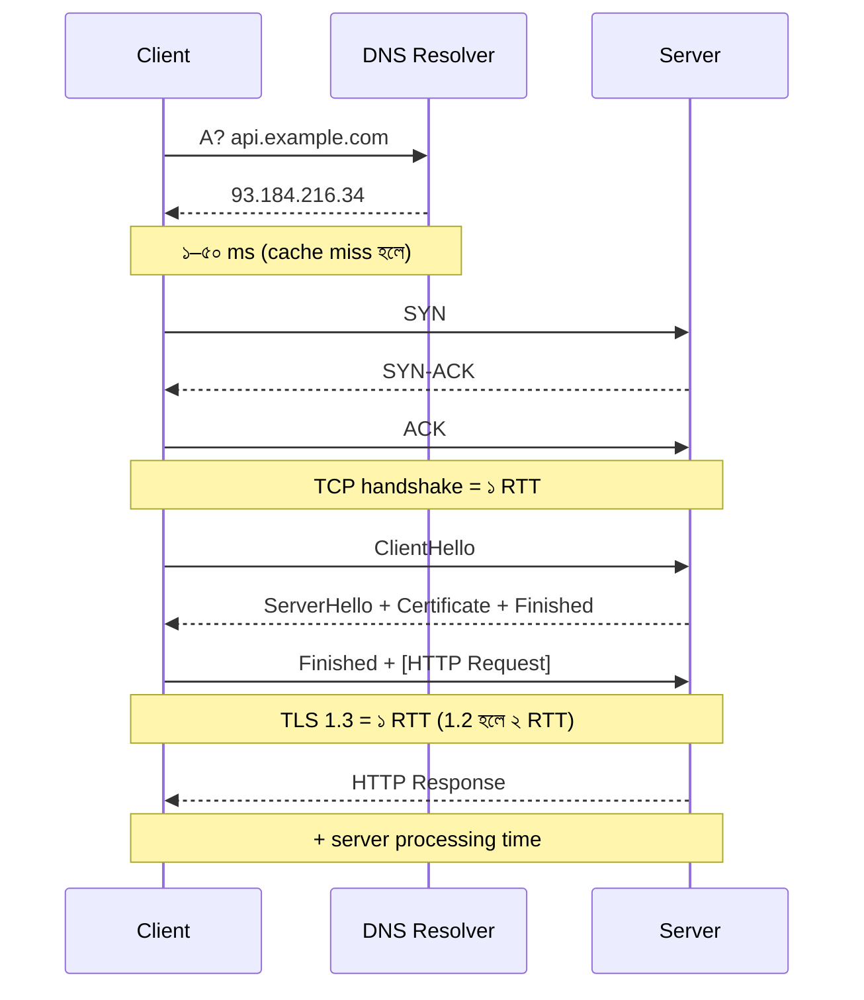
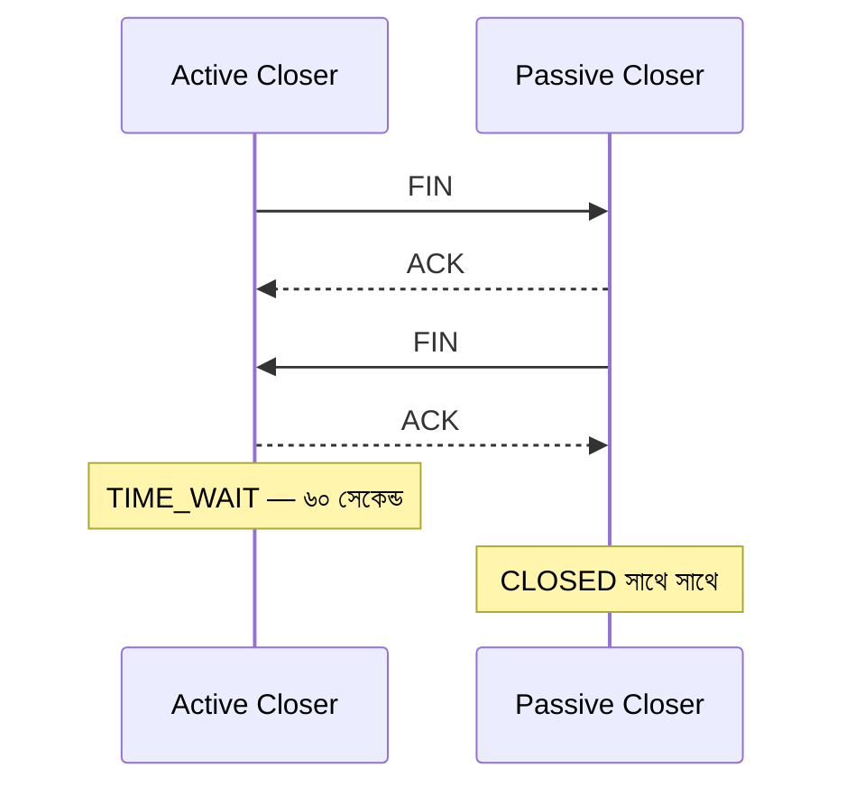
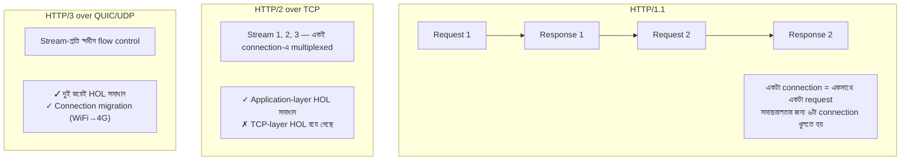
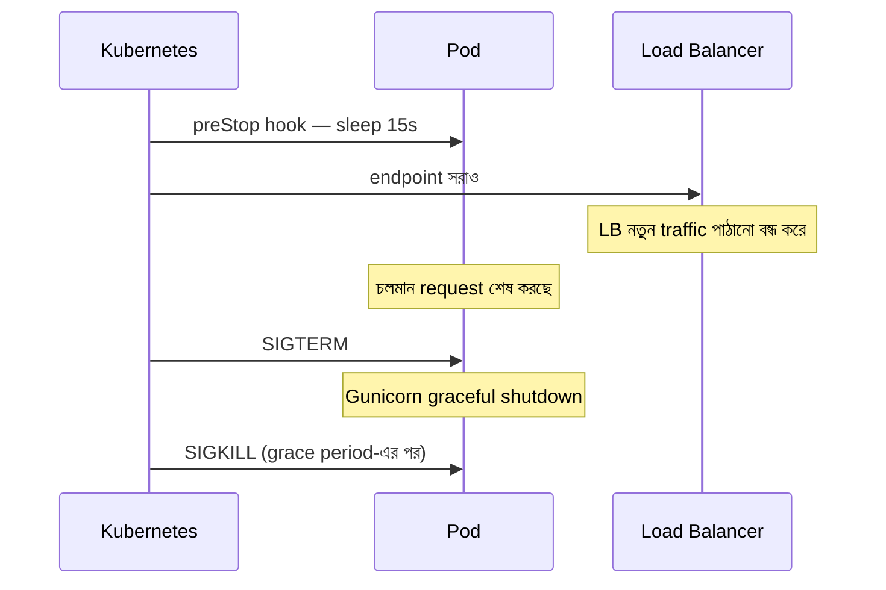

# Module 02 — Networking Deep Dive

> **Phase B** | পূর্বশর্ত: M31 (System Design Methodology)
> পরের module: M04 (Advanced Python Internals)

---

## ১. যে outage-টা কেউ বুঝতে পারছিল না

একটা payment API. স্বাভাবিক দিনে ৮০০ RPS, p99 ১৮০ms। সব ঠিক।

মাস শেষের salary disbursement-এ traffic গেল ৩,০০০ RPS-এ। এবং তখন অদ্ভুত জিনিস ঘটল:

- CPU ৩৫% — কম
- Memory ৪০% — কম
- Database CPU ২০% — কম
- কিন্তু API থেকে আসছে: `ConnectionError`, `Cannot assign requested address`
- p99 লাফিয়ে ৯ সেকেন্ড

টিম pod সংখ্যা দ্বিগুণ করল। **আরও খারাপ হলো।**

আসল কারণ: প্রতিটা payment-এ PSP-কে একটা HTTPS call যাচ্ছিল, এবং কোডে ছিল —

```python
import requests
resp = requests.post(PSP_URL, json=payload)   # প্রতিবার নতুন connection
```

`requests.post()` প্রতিবার **নতুন TCP connection** খোলে, কাজ শেষে বন্ধ করে। বন্ধ করা connection সাথে সাথে মুছে যায় না — Linux-এ সেটা **৬০ সেকেন্ড `TIME_WAIT` অবস্থায়** থাকে, আর ততক্ষণ ওই ephemeral port আটকে থাকে।

Linux-এ ephemeral port range default `32768–60999` — অর্থাৎ **~২৮,০০০ পোর্ট**।

```
টেকসই সর্বোচ্চ connection rate = 28,000 পোর্ট / 60 সেকেন্ড ≈ 470 conn/sec
```

৩,০০০ RPS মানে ৩,০০০ connection/sec। পোর্ট শেষ। `Cannot assign requested address`.

আর pod বাড়ানোয় খারাপ হয়েছিল কারণ প্রতিটা নতুন pod PSP-র দিকে আরও connection খুলছিল, আর PSP-র firewall তখন rate limit শুরু করল।

**সমাধান ছিল দুই লাইন:**

```python
session = requests.Session()          # module level, একবার
adapter = HTTPAdapter(pool_connections=20, pool_maxsize=100)
session.mount("https://", adapter)
resp = session.post(PSP_URL, json=payload, timeout=(3.05, 10))
```

Connection reuse চালু হলো। ৩,০০০ RPS-এ মোট connection লাগল ~১০০টা। p99 নামল ৪০ms-এ — **আগের স্বাভাবিক অবস্থার চেয়েও ভালো**, কারণ প্রতিটা request থেকে TCP handshake + TLS handshake বাদ গেল।

এই module-টা এই ধরনের জিনিস চেনার জন্য। Networking backend engineer-এর "optional" বিষয় না — **আপনার p99-এর অর্ধেক নেটওয়ার্কে থাকে, কোডে না।**

---

## ২. একটা HTTP Request আসলে কী কী করে

একটা `https://api.example.com/payments` call-এর পুরো যাত্রা:



**খরচের হিসাব — একই datacenter (RTT ≈ 0.5ms):**

| ধাপ | সময় |
|---|---|
| DNS (cached) | ~0 ms |
| TCP handshake (1 RTT) | 0.5 ms |
| TLS 1.3 (1 RTT) | 0.5 ms + CPU |
| **মোট overhead** | **~১–২ ms** |

**একই হিসাব — cross-region, Dhaka → Virginia (RTT ≈ 250ms):**

| ধাপ | সময় |
|---|---|
| DNS (cache miss) | 50 ms |
| TCP handshake | 250 ms |
| TLS 1.3 | 250 ms |
| **মোট overhead** | **~৫৫০ ms — server কিছু করার আগেই** |

> এই টেবিল দুইটার পার্থক্যই বুঝিয়ে দেয় কেন **connection reuse** (keep-alive) সবচেয়ে বেশি ROI দেওয়া optimization। আপনি এক লাইন কোড বদলে ৫৫০ms বাঁচাচ্ছেন — কোনো algorithm optimization এত দেয় না।

---

## ৩. TCP — যেটুকু আসলেই কাজে লাগে

OSI-র সাত স্তর মুখস্থ করার কোনো মানে নেই। যা কাজে লাগে তা হলো নিচের পাঁচটা জিনিস।

### ৩.১ Handshake ও Teardown



**সবচেয়ে গুরুত্বপূর্ণ নিয়ম:** `TIME_WAIT` **যে পক্ষ আগে close করে** তার উপর জমে।

এর মানে:

| কে আগে close করে | কোথায় TIME_WAIT জমে | পরিণতি |
|---|---|---|
| আপনার Django app (outbound call) | **আপনার server-এ** | ephemeral port exhaustion ☠️ |
| Client (browser) | Client-এ | আপনার সমস্যা না |
| আপনার server response দিয়ে close করে | **আপনার server-এ** | socket table ভরে যায় |

`TIME_WAIT` কেন আছে? দুইটা কারণ: (১) নেটওয়ার্কে ঘুরতে থাকা পুরনো packet যেন নতুন connection-এ ঢুকে না পড়ে, (২) শেষ ACK হারালে peer যেন FIN retransmit করতে পারে। এটা bug না, এটা correctness।

**নির্ণয়:**

```bash
ss -s                              # সারসংক্ষেপ
ss -tan state time-wait | wc -l    # TIME_WAIT গণনা
ss -tan state established | wc -l
cat /proc/sys/net/ipv4/ip_local_port_range   # 32768 60999
dmesg | grep -i "port range exhausted"
```

**সমাধান — অগ্রাধিকার অনুসারে:**

```bash
# ১. সবচেয়ে ভালো: connection reuse করুন (কোডে). নিচের কোনোটাই এর বিকল্প না।

# ২. Outbound connection-এর জন্য TIME_WAIT socket পুনর্ব্যবহার (নিরাপদ)
sysctl -w net.ipv4.tcp_tw_reuse=1

# ৩. Port range বাড়ান
sysctl -w net.ipv4.ip_local_port_range="10240 65535"   # ~55k পোর্ট

# ❌ tcp_tw_recycle — কখনো না। NAT-এর পেছনের client-দের connection ভাঙে।
#    Linux 4.12-এ kernel থেকে সরিয়েই ফেলা হয়েছে।
```

> **Common Mistake:** `tcp_tw_recycle=1` — StackOverflow-এর পুরনো উত্তরে এটা আছে। এটা NAT-এর পেছনে থাকা user-দের এলোমেলোভাবে connection reject করে, এবং debug করা প্রায় অসম্ভব। ব্যবহার করবেন না।

### ৩.২ Backlog — যেখানে connection চুপচাপ মরে

Kernel দুইটা queue রাখে:

```
SYN queue      → handshake চলছে       (net.ipv4.tcp_max_syn_backlog)
Accept queue   → handshake শেষ, app-এর accept() এর অপেক্ষায়   (somaxconn / listen backlog)
```

Accept queue ভরে গেলে kernel নতুন connection **চুপচাপ ফেলে দেয়** (বা RST পাঠায়)। Client দেখে timeout। আপনার application log-এ **কিচ্ছু নেই** — কারণ request কখনো application পর্যন্ত পৌঁছায়নি।

```bash
# Accept queue overflow দেখুন — এই সংখ্যাটা বাড়তে থাকলে সমস্যা
netstat -s | grep -i "listen queue"
nstat -az TcpExtListenOverflows TcpExtListenDrops

# বর্তমান queue depth (Recv-Q = ব্যবহৃত, Send-Q = সর্বোচ্চ)
ss -ltn
```

```bash
# Tuning
sysctl -w net.core.somaxconn=8192
sysctl -w net.ipv4.tcp_max_syn_backlog=8192
```

```python
# gunicorn.conf.py
backlog = 4096   # ডিফল্ট 2048. somaxconn-এর চেয়ে বেশি দিলে kernel কেটে দেবে।
```

> **Senior Tip:** "Request timeout হচ্ছে কিন্তু application log-এ কোনো entry নেই" — এই উপসর্গটা দেখলে সাথে সাথে accept queue overflow সন্দেহ করুন। এটা এত বেশি লোককে ধোঁকা দেয় যে interview-এ এটা বললে সাথে সাথে নজরে পড়বেন।

### ৩.৩ Slow Start — কেন প্রথম response ধীর

TCP শুরুতে জানে না নেটওয়ার্ক কত ধারণ করতে পারে। তাই ছোট থেকে শুরু করে।

```
Initial congestion window (Linux) = 10 MSS ≈ 14.6 KB
```

মানে **নতুন connection-এ প্রথম RTT-তে সর্বোচ্চ ~১৪ KB** পাঠানো যায়। এর বেশি হলে আরেক RTT লাগবে।

| Response size | RTT 0.5ms (same DC) | RTT 250ms (cross-region) |
|---|---|---|
| 10 KB | 1 RTT = 0.5 ms | 1 RTT = 250 ms |
| 50 KB | 3 RTT = 1.5 ms | 3 RTT = **750 ms** |
| 500 KB | 6 RTT = 3 ms | 6 RTT = **1.5 s** |

**দুইটা বাস্তব শিক্ষা:**

1. **API response ছোট রাখুন।** DRF-এ `depth=2` দিয়ে nested serializer বানিয়ে ৩০০ KB JSON পাঠানো — এটা শুধু serialization cost না, এটা নেটওয়ার্ক round trip-ও। Field selection (`?fields=id,amount,status`) দিন।
2. **Keep-alive connection-এ slow start শেষ হয়ে যায়।** পুনর্ব্যবহৃত connection-এ window ইতিমধ্যে বড়। আরেকটা কারণ connection reuse কেন এত গুরুত্বপূর্ণ।

### ৩.৪ Nagle + Delayed ACK — সেই রহস্যময় ৪০ms

দুইটা optimization আলাদাভাবে ভালো, একসাথে বিপর্যয়:

- **Nagle's algorithm:** ছোট packet জমিয়ে একসাথে পাঠাও (আগের data-র ACK না আসা পর্যন্ত অপেক্ষা করো)
- **Delayed ACK:** ACK সাথে সাথে পাঠিও না, ~৪০ms অপেক্ষা করো — হয়তো data-র সাথে piggyback করা যাবে

একজন অপেক্ষা করছে ACK-এর জন্য, আরেকজন অপেক্ষা করছে data-র জন্য। **ফল: ঠিক ৪০ms-এর deadlock।**

উপসর্গ: latency histogram-এ ৪০ms বা ২০০ms-এ অদ্ভুত স্পাইক, যদিও server দ্রুত।

```python
# সমাধান: TCP_NODELAY (Nagle বন্ধ)
# ভালো খবর — বেশিরভাগ modern stack এটা ডিফল্টে করে:
#   - Gunicorn: হ্যাঁ
#   - Nginx: tcp_nodelay on (ডিফল্ট)
#   - Python requests/urllib3: হ্যাঁ
#   - psycopg: হ্যাঁ
# কিন্তু raw socket লিখলে নিজে দিতে হবে:
sock.setsockopt(socket.IPPROTO_TCP, socket.TCP_NODELAY, 1)
```

> এটা এখন বিরল, কিন্তু jargon হিসেবে জানা থাকলে interview-এ "latency-র অদ্ভুত ৪০ms স্পাইক" প্রশ্নে আপনি একমাত্র লোক হবেন যে সঠিক উত্তর দেয়।

### ৩.৫ Congestion Control — CUBIC vs BBR

| Algorithm | কীভাবে কাজ করে | কখন ভালো |
|---|---|---|
| **CUBIC** (Linux ডিফল্ট) | Packet loss = congestion signal | স্থিতিশীল, কম-loss নেটওয়ার্ক (datacenter) |
| **BBR** (Google) | Bandwidth ও RTT মেপে model বানায় | Lossy বা high-latency link (mobile, cross-region, satellite) |

```bash
sysctl net.ipv4.tcp_congestion_control        # বর্তমান
sysctl -w net.ipv4.tcp_congestion_control=bbr # পরিবর্তন
```

**কখন BBR-এ যাবেন:** যদি আপনার user global হয় এবং mobile network-এ থাকে, বা আপনি cross-region data transfer করেন। CDN/edge-এ BBR সাধারণত ২০–৩০% throughput উন্নতি দেয়। **কখন যাবেন না:** সব traffic একই datacenter-এ হলে পার্থক্য নগণ্য — অকারণে বদলাবেন না।

---

## ৪. TLS — নিরাপত্তার খরচ কত

### ৪.১ Handshake

| সংস্করণ | Round trip | মন্তব্য |
|---|---|---|
| TLS 1.2 | **2 RTT** | এখনো অনেক জায়গায় |
| TLS 1.3 | **1 RTT** | ডিফল্ট হওয়া উচিত |
| TLS 1.3 resumption | **1 RTT** (session ticket) | |
| TLS 1.3 **0-RTT** | **0 RTT** | ⚠️ replay attack সম্ভব — **শুধু idempotent GET-এ** |

> **0-RTT নিয়ে সাবধান:** 0-RTT data replay করা যায়। POST /payments 0-RTT-তে গেলে আক্রমণকারী সেটা পুনরায় পাঠিয়ে double charge করাতে পারে। **FinTech-এ 0-RTT শুধু safe method-এ, বা একেবারেই না।**

### ৪.২ CPU খরচ

TLS handshake-এ asymmetric cryptography লাগে — এটাই দামি অংশ। Symmetric encryption (AES-GCM, হার্ডওয়্যার accelerated) প্রায় বিনামূল্যে।

```
RSA-2048 handshake (server side)  ≈ 1–2 ms CPU
ECDSA P-256 handshake             ≈ 0.1–0.3 ms CPU   ← ~৫–১০× দ্রুত
AES-256-GCM data encryption       ≈ ২–৫ Gbps প্রতি core (AES-NI সহ)
```

**অর্থ:** ১০,০০০ নতুন connection/sec × 1.5ms = ১৫ CPU-second প্রতি সেকেন্ড — মানে ১৫টা core শুধু handshake-এ। কিন্তু connection reuse করলে এটা প্রায় শূন্য।

**তিনটা কাজ:**
1. **ECDSA certificate ব্যবহার করুন** (RSA-র বদলে বা পাশাপাশি)
2. **Session resumption চালু রাখুন** — Nginx-এ `ssl_session_cache`
3. **TLS termination LB/Nginx-এ**, Django-তে না

```nginx
# nginx.conf — TLS অংশ
ssl_protocols TLSv1.2 TLSv1.3;
ssl_prefer_server_ciphers off;          # TLS 1.3-এ client preference ঠিক আছে
ssl_session_cache shared:SSL:50m;       # ~200,000 session
ssl_session_timeout 1d;
ssl_session_tickets on;
ssl_stapling on;                        # OCSP — client-এর extra round trip বাঁচায়
ssl_stapling_verify on;
```

> **Production Pitfall — OCSP:** `ssl_stapling` না থাকলে কিছু client certificate revocation চেক করতে CA-র সার্ভারে আলাদা call করে। CA slow থাকলে **আপনার site slow দেখায়, আপনার কোনো দোষ ছাড়াই।** এটা বাস্তবে ঘটেছে (২০২১-এ একাধিক বড় site)।

### ৪.৩ mTLS — service-to-service auth

Internal microservice-এ client-ও certificate দেখায়:


**কখন:** internal service-to-service, zero-trust network, PCI/regulatory পরিবেশ।
**কখন না:** public API (client-দের cert দেওয়া অসম্ভব — সেখানে OAuth2/API key)।
**খরচ:** certificate rotation-এর ঝামেলা। এই কারণেই service mesh (Istio/Linkerd) জনপ্রিয় — ওরা cert rotation স্বয়ংক্রিয় করে। কিন্তু service mesh-এর নিজের operational খরচ বিশাল (M17)।

---

## ৫. HTTP/1.1 vs HTTP/2 vs HTTP/3

### ৫.১ মূল পার্থক্য



**Head-of-Line blocking বোঝা** (interview-এ প্রায় নিশ্চিত প্রশ্ন):

| স্তর | সমস্যা | কে সমাধান করে |
|---|---|---|
| **Application HOL** (HTTP/1.1) | একটা ধীর response পুরো connection আটকে রাখে | HTTP/2 multiplexing |
| **Transport HOL** (TCP) | একটা packet হারালে TCP সব stream-এর data আটকে রাখে, যদিও অন্য stream-এর packet পৌঁছে গেছে | HTTP/3 (QUIC — UDP-র উপর নিজস্ব per-stream ordering) |

তাই **lossy network-এ HTTP/2 কখনো কখনো HTTP/1.1-এর চেয়ে খারাপ** — কারণ ৬টা আলাদা connection-এ একটা packet loss শুধু একটা connection-কে আটকাত, কিন্তু একটা multiplexed connection-এ সব stream আটকে যায়। এই পর্যবেক্ষণটা বললে interviewer বুঝে যায় আপনি buzzword মুখস্থ করেননি।

### ৫.২ কোথায় কোনটা ব্যবহার করবেন

| পথ | সুপারিশ | কারণ |
|---|---|---|
| Browser → CDN/LB | **HTTP/2 বা HTTP/3** | Multiplexing, header compression |
| CDN → Origin | HTTP/1.1 বা HTTP/2 | সাধারণত পার্থক্য কম |
| **LB → Django** | **HTTP/1.1 + keep-alive** | Django/Gunicorn HTTP/2 করে না, দরকারও নেই |
| Service → Service (internal) | **gRPC (HTTP/2)** | Binary, multiplexed, streaming (M17) |
| Mobile app → API | **HTTP/3** যদি সম্ভব | Connection migration, lossy network |

> **Common Mistake:** "আমরা HTTP/2 ব্যবহার করব তাই দ্রুত হবে" — Django-র সামনে HTTP/2 দিয়ে প্রায় কিছুই বদলায় না, কারণ API request সাধারণত একটা করে আসে, ১০০টা asset একসাথে না। HTTP/2-র মূল লাভ browser-এ অনেক resource load করার সময়।

### ৫.৩ HTTP/2 + L4 Load Balancer — লুকানো ফাঁদ

HTTP/2 connection দীর্ঘজীবী। L4 load balancer connection-level-এ balance করে। ফলে:

```
Client একটা connection খুলল → shard A-তে গেল
সেই connection-এ পরের ১০,০০০ request-ও shard A-তেই যাবে
নতুন pod যোগ করলে সে কোনো traffic পাবে না ☠️
```

**সমাধান:** L7 load balancer (request-level balancing), অথবা server-side `max_connection_age` সেট করে periodic reconnect force করা। gRPC-তে এটা খুব সাধারণ সমস্যা।

---

## ৬. DNS — সবচেয়ে অবমূল্যায়িত failure point

### ৬.১ Kubernetes-এর `ndots:5` ফাঁদ

K8s pod-এ ডিফল্ট `/etc/resolv.conf`:

```
search myns.svc.cluster.local svc.cluster.local cluster.local
nameserver 10.96.0.10
options ndots:5
```

`ndots:5` মানে — **যদি hostname-এ ৫টার কম dot থাকে, তাহলে আগে search domain-গুলো চেষ্টা করো।**

`api.stripe.com`-এ dot আছে ২টা। তাই lookup হবে:

```
1. api.stripe.com.myns.svc.cluster.local     → NXDOMAIN
2. api.stripe.com.svc.cluster.local          → NXDOMAIN
3. api.stripe.com.cluster.local              → NXDOMAIN
4. api.stripe.com                            → ✓ অবশেষে
```

**একটা lookup-এর বদলে ৪টা** (IPv4+IPv6 হলে ৮টা)। প্রতিটাতে network round trip। CoreDNS-এ চাপ ৪×।

**সমাধান — trailing dot (FQDN):**

```python
# settings.py
PSP_URL = "https://api.stripe.com./v1/charges"   # শেষে dot লক্ষ করুন
#                                ^
# অথবা deployment.yaml-এ:
```

```yaml
spec:
  dnsConfig:
    options:
      - name: ndots
        value: "2"
```

> **Senior Tip:** Kubernetes-এ "মাঝে মাঝে ৫ সেকেন্ডের latency spike" — এর সবচেয়ে সাধারণ কারণ DNS. পুরনো kernel-এ conntrack race condition-এর জন্য UDP DNS packet হারায়, আর resolver ঠিক ৫ সেকেন্ড পর retry করে। NodeLocal DNSCache এটার মানক সমাধান।

### ৬.২ DNS-নির্ভর failover ও stale connection

RDS failover হলে DNS record নতুন IP-তে পয়েন্ট করে। কিন্তু —

**আপনার connection pool-এ পুরনো IP-র connection বসে আছে।** DNS বদলালেও ওই connection বদলায় না। আপনার app মৃত primary-তে লিখতে চেষ্টা করবে।

```python
# settings.py — Django DB config
DATABASES = {
    "default": {
        "ENGINE": "django.db.backends.postgresql",
        "HOST": "prod-db.cluster-xyz.rds.amazonaws.com",
        "CONN_MAX_AGE": 300,        # ⚠️ অসীম না. Failover-এ recycle হবে।
        "CONN_HEALTH_CHECKS": True, # Django 4.1+ — reuse করার আগে ping করে
        "OPTIONS": {
            "connect_timeout": 5,           # ⚠️ ডিফল্টে নেই — অসীম অপেক্ষা
            "keepalives": 1,
            "keepalives_idle": 30,
            "keepalives_interval": 10,
            "keepalives_count": 3,          # ৬০s-এ মৃত connection ধরা পড়বে
        },
    }
}
```

`CONN_MAX_AGE=None` (অসীম) কখনো দেবেন না। `connect_timeout` না দিলে DB unreachable হলে আপনার Gunicorn worker **চিরকাল** ঝুলে থাকবে।

### ৬.৩ Connection pool math — যেটা DB মেরে ফেলে

```
মোট DB connection = pods × gunicorn_workers × (1 যদি sync)

উদাহরণ:  50 pod × 8 worker = 400 connection
PostgreSQL max_connections ডিফল্ট = 100  ☠️
```

PostgreSQL-এ প্রতিটা connection একটা আলাদা OS process, প্রতিটার ~৫–১০ MB overhead। ৪০০ connection = কয়েক GB RAM শুধু connection ধরে রাখতে, আর context switching-এ CPU নষ্ট।

**সমাধান: PgBouncer** (M07-এ বিস্তারিত)

```
50 pod × 8 worker = 400 client connection
        ↓ PgBouncer (transaction pooling)
              25 actual PostgreSQL connection
```

> **Senior Tip:** এই গুণটা — `pods × workers` — interview-এ নিজে থেকে করে দেখান। "আমরা autoscale করব ১০০ pod পর্যন্ত, প্রতিটায় ৮ worker, তাই ৮০০ connection — PostgreSQL এটা নেবে না, তাই PgBouncer লাগবে transaction mode-এ।" এই একটা বাক্যে আপনি production-এ Django চালানোর অভিজ্ঞতা প্রমাণ করলেন।

---

## ৭. Load Balancer — L4 vs L7

| | **L4 (Transport)** | **L7 (Application)** |
|---|---|---|
| উদাহরণ | AWS NLB, HAProxy TCP mode | AWS ALB, Nginx, Envoy |
| কী দেখে | IP + port | HTTP header, path, method, cookie |
| Latency | ~সামান্য (µs) | বেশি (~1ms) |
| TLS termination | না (pass-through) | হ্যাঁ |
| Path-based routing | না | হ্যাঁ |
| Retry / circuit break | না | হ্যাঁ |
| Balance করে | **Connection-এ** | **Request-এ** |
| Throughput | অতি উচ্চ | কম |
| Source IP | সংরক্ষিত | `X-Forwarded-For`-এ |

**কখন L4:** অতি উচ্চ throughput, non-HTTP protocol (database, WebSocket, gRPC pass-through), TLS নিজে terminate করতে চান।
**কখন L7 (সাধারণত এটাই):** HTTP API, path routing, WAF, header-based routing, canary।

### Django-তে proxy-র পেছনে থাকার নিয়ম

```python
# settings.py — proxy-র পেছনে থাকলে এগুলো বাধ্যতামূলক
SECURE_PROXY_SSL_HEADER = ("HTTP_X_FORWARDED_PROTO", "https")
USE_X_FORWARDED_HOST = True
ALLOWED_HOSTS = ["api.example.com"]
```

⚠️ **নিরাপত্তা সতর্কতা:** `SECURE_PROXY_SSL_HEADER` তখনই নিরাপদ যখন আপনি **নিশ্চিত** যে proxy সবসময় এই header টা নিজে সেট করে (client-এর পাঠানো মান মুছে দিয়ে)। না হলে attacker `X-Forwarded-Proto: https` পাঠিয়ে আপনার HTTPS redirect বাইপাস করবে।

```python
# ❌ কখনো এটা করবেন না — DRF throttle বা rate limit-এ
ip = request.META["HTTP_X_FORWARDED_FOR"].split(",")[0]
# X-Forwarded-For client নিজেই জাল করতে পারে!
# আপনার trusted proxy-র সংখ্যা জেনে ডান দিক থেকে গুনতে হবে।

# ✅ django-ipware বা proxy-র সংখ্যা জেনে:
def get_client_ip(request, num_trusted_proxies=1):
    xff = request.META.get("HTTP_X_FORWARDED_FOR", "")
    parts = [p.strip() for p in xff.split(",") if p.strip()]
    if len(parts) >= num_trusted_proxies:
        return parts[-num_trusted_proxies]
    return request.META.get("REMOTE_ADDR")
```

### Connection Draining — deploy-এ 502 না দেওয়া

Deploy-এর সময় 502 আসে কারণ **LB এখনো traffic পাঠাচ্ছে, কিন্তু pod মরে গেছে।** সঠিক ক্রম:



```yaml
spec:
  terminationGracePeriodSeconds: 60
  containers:
  - name: api
    lifecycle:
      preStop:
        exec:
          # LB-কে endpoint সরানোর সময় দিন — এটাই মূল কৌশল
          command: ["sh", "-c", "sleep 15"]
```

```python
# gunicorn.conf.py
graceful_timeout = 30   # SIGTERM-এর পর চলমান request শেষ করার সময়
timeout = 30            # worker কতক্ষণ ঝুলে থাকলে মারা হবে
keepalive = 65          # ⚠️ ALB idle timeout (60s) এর চেয়ে বেশি হতে হবে
```

> **Production Pitfall — এলোমেলো 502:** `keepalive` যদি ALB-র idle timeout-এর **কম** হয়, তাহলে এমন হয় — Gunicorn connection বন্ধ করছে ঠিক যখন ALB ওটাতে request পাঠাচ্ছে। Race। ফল: দিনে কয়েকটা অব্যাখ্যাত 502, যেগুলো reproduce করা যায় না। **নিয়ম: upstream-এর keep-alive সবসময় downstream-এর idle timeout-এর চেয়ে বেশি।**

---

## ৮. Nginx সামনে কেন — Gunicorn একাই কেন যথেষ্ট না


Gunicorn sync worker **একটা request-এ একটা worker আটকে রাখে**। যদি worker সরাসরি ধীর client-এর সাথে কথা বলে:

```
16 worker, প্রতিটা client 10 সেকেন্ড ধরে request পাঠাচ্ছে
→ 16 concurrent slow client = পুরো API down
→ এটাই Slowloris attack
```

Nginx event-driven — ১০,০০০ ধীর connection ধরে রাখা তার কাছে সমস্যা না। সে সম্পূর্ণ request buffer করে, তারপর Gunicorn-কে একবারে দেয়। Gunicorn worker তখন শুধু **আসল প্রসেসিং সময়টুকু** ব্যস্ত থাকে।

```nginx
upstream django {
    server 127.0.0.1:8000;
    keepalive 64;                      # upstream keep-alive — অপরিহার্য
    keepalive_requests 1000;
    keepalive_timeout 75s;
}

server {
    listen 443 ssl http2;

    client_body_timeout 10s;
    client_header_timeout 10s;
    client_max_body_size 20m;

    proxy_buffering on;                # ← slowloris সুরক্ষা. ডিফল্টে on.
    proxy_request_buffering on;

    location / {
        proxy_pass http://django;
        proxy_http_version 1.1;        # ← keep-alive-এর জন্য বাধ্যতামূলক
        proxy_set_header Connection "";# ← "close" header মুছুন, নাহলে keepalive কাজ করবে না
        proxy_set_header Host $host;
        proxy_set_header X-Real-IP $remote_addr;
        proxy_set_header X-Forwarded-For $proxy_add_x_forwarded_for;
        proxy_set_header X-Forwarded-Proto $scheme;

        proxy_connect_timeout 5s;
        proxy_read_timeout 30s;
        proxy_send_timeout 30s;
    }

    # Streaming/SSE endpoint-এ buffering বন্ধ করতেই হবে
    location /api/v1/stream/ {
        proxy_pass http://django;
        proxy_http_version 1.1;
        proxy_buffering off;           # ← না দিলে SSE কাজ করবে না
        proxy_read_timeout 3600s;
        chunked_transfer_encoding on;
    }
}
```

> **Common Mistake:** `proxy_http_version 1.1` আর `proxy_set_header Connection ""` — এই দুইটা না দিলে Nginx প্রতিটা upstream request-এ **নতুন connection** খোলে। আপনি Nginx বসিয়েও keep-alive-এর লাভ পাচ্ছেন না। এটা অসম্ভব রকম সাধারণ ভুল।

> **Common Mistake ২:** SSE বা streaming response-এ `proxy_buffering off` না দিলে Nginx পুরো response জমা করে তারপর পাঠায় — অর্থাৎ streaming আর streaming থাকে না। ঘণ্টার পর ঘণ্টা debug করে লোকে এটা খুঁজে পায়।

---

## ৯. Client-এর দিক: Python-এ সঠিকভাবে HTTP call

```python
# infra/http.py — একবার লিখুন, সব জায়গায় ব্যবহার করুন
import requests
from requests.adapters import HTTPAdapter
from urllib3.util.retry import Retry

def build_session(
    *,
    pool_connections: int = 20,   # কতগুলো ভিন্ন host
    pool_maxsize: int = 100,      # প্রতি host-এ কতগুলো connection
    total_retries: int = 2,
) -> requests.Session:
    session = requests.Session()
    retry = Retry(
        total=total_retries,
        backoff_factor=0.3,                    # 0.3s, 0.6s, 1.2s
        status_forcelist=[429, 502, 503, 504],
        allowed_methods=["GET", "HEAD", "OPTIONS"],  # ⚠️ POST নেই!
        respect_retry_after_header=True,
        raise_on_status=False,
    )
    adapter = HTTPAdapter(
        pool_connections=pool_connections,
        pool_maxsize=pool_maxsize,
        max_retries=retry,
        pool_block=True,   # ⚠️ গুরুত্বপূর্ণ — নিচে দেখুন
    )
    session.mount("https://", adapter)
    session.mount("http://", adapter)
    return session

# module level — প্রতি request-এ নতুন Session বানাবেন না
psp_session = build_session(pool_maxsize=200)
```

চারটা সিদ্ধান্ত যা ব্যাখ্যা করতে হবে:

**১. `allowed_methods`-এ POST নেই।** POST idempotent না। Retry করলে double charge। যদি POST retry করতেই হয়, আগে **idempotency key** নিশ্চিত করুন (M31), তারপর সচেতনভাবে যোগ করুন।

**২. `pool_block=True`।** ডিফল্ট `False` মানে — pool ভরে গেলে urllib3 নতুন connection বানায়, ব্যবহার করে, **ফেলে দেয়**। এতে সেই `Connection pool is full, discarding connection` warning আসে, আর গোপনে TIME_WAIT জমতে থাকে। `True` দিলে caller অপেক্ষা করে — যেটা সৎ backpressure।

**৩. `backoff_factor` আছে, কিন্তু jitter নেই।** urllib3-এর নিজস্ব jitter সীমিত। ১০০টা pod একসাথে retry করলে **retry storm** হবে (M16)। গুরুত্বপূর্ণ path-এ নিজে jitter দিন।

**৪. Timeout সবসময় call-এ।**

```python
# (connect_timeout, read_timeout)
resp = psp_session.post(url, json=payload, timeout=(3.05, 10))
```

`3.05` কেন? Linux-এর TCP retransmission window ৩ সেকেন্ডের গুণিতকে — সামান্য বেশি দিলে একটা retransmit-এর সুযোগ থাকে।

**Timeout budget** — সবচেয়ে গুরুত্বপূর্ণ ধারণা:

```
Client timeout                    30s
  └─ ALB idle timeout             60s   (client-এর চেয়ে বেশি)
     └─ Nginx proxy_read_timeout  30s
        └─ Gunicorn timeout       30s
           └─ Django view budget  25s
              ├─ DB query         5s   (statement_timeout)
              └─ PSP call         10s
                 └─ retry ×2 সহ   ~21s worst case  ⚠️ budget ছাড়িয়ে যাচ্ছে!
```

শেষ লাইনটা লক্ষ করুন। Retry ধরলে বাজেট ভেঙে যায়। **প্রতিটা layer-এর timeout তার নিচের layer-এর মোট (retry সহ) থেকে বেশি হতে হবে** — না হলে outer timeout আগে ফায়ার করবে, inner কাজ বৃথা যাবে, আর error message বিভ্রান্তিকর হবে।

```python
# PostgreSQL-এ statement timeout — একটা runaway query যেন worker না মারে
DATABASES["default"]["OPTIONS"]["options"] = "-c statement_timeout=5000"
```

---

## ১০. Debugging Toolkit

```bash
# ── কী চলছে ─────────────────────────────────────
ss -tanp | head -50                    # সব TCP socket + process
ss -s                                  # সারসংক্ষেপ
ss -tan state time-wait | wc -l        # TIME_WAIT গণনা
ss -ltn                                # listening + accept queue depth
nstat -az | grep -i -E "retrans|overflow|drop"

# ── DNS ─────────────────────────────────────────
dig +short api.stripe.com
dig +trace api.stripe.com              # পুরো resolution chain
time dig api.stripe.com                # কত সময় লাগছে
cat /etc/resolv.conf                   # ndots দেখুন (k8s!)

# ── TLS ─────────────────────────────────────────
openssl s_client -connect api.stripe.com:443 -servername api.stripe.com </dev/null
echo | openssl s_client -connect host:443 2>/dev/null \
  | openssl x509 -noout -dates          # certificate কবে expire করবে
openssl s_client -connect host:443 -tls1_3   # TLS 1.3 সমর্থন আছে?

# ── Latency কোথায় যাচ্ছে ────────────────────────
curl -w "@curl-format.txt" -o /dev/null -s https://api.example.com/health

# curl-format.txt:
#   dns:        %{time_namelookup}s
#   tcp:        %{time_connect}s
#   tls:        %{time_appconnect}s
#   ttfb:       %{time_starttransfer}s     ← server processing এখানে
#   total:      %{time_total}s

# ── Packet level (শেষ অস্ত্র) ───────────────────
tcpdump -i any -nn 'host 10.0.1.5 and port 5432' -c 100 -w /tmp/db.pcap
tcpdump -i any -nn 'tcp[tcpflags] & (tcp-rst) != 0'   # শুধু RST — কে connection ভাঙছে

# ── পথে কোথায় সমস্যা ────────────────────────────
mtr -rwzbc 100 api.stripe.com          # traceroute + ping একসাথে
```

`curl -w`-এর output পড়ার নিয়ম — এটাই সবচেয়ে দ্রুত triage:

| কোন ধাপ বড় | সমস্যা কোথায় |
|---|---|
| `time_namelookup` | DNS — ndots, resolver, TTL |
| `time_connect - namelookup` | নেটওয়ার্ক পথ, LB backlog, firewall |
| `time_appconnect - connect` | TLS — RSA cert, OCSP, handshake |
| `time_starttransfer - appconnect` | **আপনার application** — এখানেই আসল কোড |
| `time_total - starttransfer` | Response size বড়, bandwidth, slow start |

---

## ১১. Production Pitfalls — দ্রুত রেফারেন্স

| উপসর্গ | সম্ভাব্য কারণ | পরীক্ষা |
|---|---|---|
| `Cannot assign requested address` | Ephemeral port exhaustion | `ss -tan state time-wait \| wc -l` |
| Timeout কিন্তু app log-এ কিছু নেই | Accept queue overflow | `nstat \| grep ListenOverflow` |
| দিনে কয়েকটা এলোমেলো 502 | keep-alive timeout race | Gunicorn `keepalive` > LB idle timeout? |
| K8s-এ ৫ সেকেন্ডের spike | DNS conntrack race | NodeLocal DNSCache |
| Latency-তে ৪০ms স্পাইক | Nagle + delayed ACK | `TCP_NODELAY` |
| Deploy-এ 502 | Connection draining নেই | `preStop: sleep 15` |
| SSE/streaming কাজ করে না | Nginx buffering | `proxy_buffering off` |
| `Connection pool is full` warning | `pool_maxsize` কম, `pool_block=False` | Session config |
| DB failover-এর পর app মৃত | Stale pooled connection | `CONN_MAX_AGE`, `CONN_HEALTH_CHECKS` |
| Cross-region slow, optimize কাজ করে না | আলোর গতি | Data locality বা edge cache |
| একটা pod-এ সব traffic | L4 LB + HTTP/2/gRPC | L7 LB বা `max_connection_age` |
| HTTPS-এ CPU বেশি | RSA cert, session resumption নেই | ECDSA, `ssl_session_cache` |

---

## ১২. Interview Section

### প্রশ্ন ১ (Senior) — "আপনার API-র p99 হঠাৎ খারাপ হলো, CPU/memory/DB সব স্বাভাবিক। কী দেখবেন?"

**❌ Wrong Answer**
> "Code profile করব, কোন function slow দেখব।"

*কেন খারাপ:* সব resource metric স্বাভাবিক — এটাই বলে দিচ্ছে সমস্যা compute-এ না, **connection বা queueing-এ**।

**✅ Ideal Answer**
> "Resource স্বাভাবিক মানে bottleneck compute না। আমি দেখব:
> ১. Connection pool exhaustion — DB pool বা HTTP pool
> ২. Accept queue overflow — `nstat` দিয়ে ListenOverflow
> ৩. TIME_WAIT জমা / ephemeral port exhaustion
> ৪. External dependency slow (DB না, কিন্তু PSP/cache)
> ৫. DNS resolution slow
> `curl -w` দিয়ে একটা request-এর timing breakdown নেব — কোন ধাপে সময় যাচ্ছে সেটাই সবচেয়ে দ্রুত বলে দেবে।"

**🌟 Senior/Staff Answer**
> উপরেরটা, তারপর:
> "একটা গুরুত্বপূর্ণ পার্থক্য করব — এটা কি **saturation** নাকি **queueing**? সব resource ৪০%-এ থাকা সত্ত্বেও latency খারাপ হওয়ার ক্লাসিক কারণ হলো একটা সীমিত resource যেটা আমরা মাপছি না — সাধারণত connection pool বা worker slot। Little's Law মনে রাখি: `L = λ × W`. Concurrency যদি ফিক্সড থাকে (worker count) আর service time বাড়ে, throughput পড়বেই।
> Django-তে এটার সবচেয়ে সাধারণ রূপ: একটা external call ২০০ms থেকে ২s হলো। Worker occupancy ১০× বাড়ল। CPU কিছুই দেখাবে না — worker গুলো **অপেক্ষা** করছে, কাজ করছে না। তাই আমি CPU-র বদলে **worker busy ratio / pool utilization** monitor করি। Gunicorn-এ `statsd` দিয়ে বা `gunicorn_worker_busy` metric দিয়ে।
> আর প্রতিরোধের দিকে — এই ধরনের incident-এর মূল কারণ প্রায় সবসময় একটাই: sync request path-এ external dependency। দীর্ঘমেয়াদে সমাধান architecture-এ, timeout tuning-এ না।"

**⚠️ Common Mistakes:** শুধু CPU/memory দেখা; connection pool-কে resource হিসেবে না ভাবা; `curl -w` না জানা।

---

### প্রশ্ন ২ (Senior) — "HTTP/2 HTTP/1.1-এর চেয়ে সবসময় দ্রুত?"

**❌ Wrong Answer**
> "হ্যাঁ, multiplexing আছে তাই দ্রুত।"

**✅ Ideal Answer**
> "না। HTTP/2 application-layer head-of-line blocking সমাধান করে, কিন্তু **TCP-layer HOL রয়ে যায়**। একটা packet হারালে TCP সব stream-এর data আটকে রাখে। HTTP/1.1-এ ৬টা আলাদা connection থাকায় একটা loss শুধু একটা connection-কে আটকাত। তাই **lossy network-এ HTTP/2 খারাপ হতে পারে**। HTTP/3 এটা সমাধান করে QUIC দিয়ে — UDP-র উপর per-stream ordering।"

**🌟 Senior/Staff Answer**
> উপরেরটা, তারপর:
> "আর প্রসঙ্গটাও গুরুত্বপূর্ণ। HTTP/2-র মূল লাভ **অনেক ছোট resource একসাথে** load করার সময় — browser-এ CSS/JS/image. একটা JSON API যেখানে client একটা করে request পাঠায়, সেখানে multiplexing-এর কোনো লাভ নেই। আমার Django API-র সামনে HTTP/2 দিয়ে measurable পার্থক্য পাব না।
> যেখানে সত্যিই লাগে সেটা হলো **gRPC** — internal service-to-service, যেখানে একটা connection-এ হাজারটা concurrent RPC চলে। কিন্তু তখন আরেকটা ফাঁদ আসে: HTTP/2 connection দীর্ঘজীবী, তাই L4 load balancer-এ balancing ভেঙে যায় — নতুন pod কোনো traffic পায় না। সমাধান L7 LB বা server-side `max_connection_age`.
> সংক্ষেপে: HTTP/2 একটা tool, upgrade না। কোন সমস্যাটা সমাধান করছি সেটা আগে জানতে হবে।"

---

### প্রশ্ন ৩ (Scenario / Production Incident) — "Deploy-এর সময় প্রতিবার কিছু 502 আসে। ঠিক করুন।"

**🌟 Senior/Staff Answer**
> "502 মানে LB upstream-এ পৌঁছাতে পারেনি বা invalid response পেয়েছে। Deploy-এর সময় হলে প্রায় নিশ্চিতভাবে দুইটার একটা:
>
> **কারণ ১ — Connection draining নেই.** Pod SIGTERM পেল আর সাথে সাথে মরল, কিন্তু LB-র endpoint list এখনো আপডেট হয়নি (kube-proxy/ALB target group-এ কয়েক সেকেন্ড লাগে)। LB মৃত pod-এ traffic পাঠাচ্ছে।
> **সমাধান:** `preStop: sleep 15` — pod টা SIGTERM-এর আগে ১৫ সেকেন্ড বেঁচে থাকবে, ততক্ষণে LB endpoint সরিয়ে ফেলবে। সাথে `terminationGracePeriodSeconds: 60` আর Gunicorn-এ `graceful_timeout=30`.
>
> **কারণ ২ — Keep-alive race.** Gunicorn-এর `keepalive` যদি ALB-র idle timeout-এর কম হয়, Gunicorn connection বন্ধ করছে ঠিক যখন ALB request পাঠাচ্ছে। **নিয়ম: upstream keep-alive > downstream idle timeout.** ALB 60s হলে Gunicorn 65s.
>
> **যাচাই করব কীভাবে:** 502-গুলো কি deploy-এর সময়েই clustered, নাকি ছড়ানো? Clustered হলে draining. ছড়ানো হলে keep-alive race. ALB access log-এ `target_status_code` আর `elb_status_code` আলাদা করে দেখলে পরিষ্কার হবে।
>
> **প্রতিরোধ:** deploy-এর সময় 502 rate-এর উপর alert, আর canary deployment যাতে ৫% traffic-এ ধরা পড়ে। আর সৎভাবে — এটা ঠিক না করা মানে প্রতিটা deploy-এ কিছু user-এর payment fail হচ্ছে। FinTech-এ এটা গ্রহণযোগ্য না।"

---

### প্রশ্ন ৪ (Staff / Architecture) — "আমাদের service-গুলো একে অপরকে REST-এ ডাকে। gRPC-তে যাওয়া উচিত?"

**🌟 Senior/Staff Answer**
> "নির্ভর করে ব্যথাটা কোথায়। gRPC তিনটা জিনিস দেয়:
> ১. **Binary serialization (Protobuf)** — JSON-এর চেয়ে ছোট ও দ্রুত parse
> ২. **HTTP/2 multiplexing** — একটা connection-এ অনেক concurrent call
> ৩. **Schema-first contract** — `.proto` থেকে code generate, compile-time নিরাপত্তা
>
> কিন্তু খরচও আছে:
> - Debugging কঠিন (`curl` দিয়ে দেখা যায় না, `grpcurl` লাগে)
> - Browser থেকে সরাসরি কল করা যায় না (gRPC-Web/proxy লাগে)
> - L4 LB-তে load balancing ভেঙে যায়
> - Python-এ gRPC ecosystem Django-র সাথে সহজে বসে না
>
> **আমার প্রশ্ন হবে:** আমরা কি আসলে serialization-এ CPU খরচ করছি? Profile করে দেখেছি? বেশিরভাগ Django service-এ latency-র ৯০% DB query-তে যায়, JSON parsing-এ ২%. তাহলে gRPC-তে গিয়ে আমরা ২% বাঁচাব আর অনেক complexity কিনব।
>
> **তবে ৩ নম্বর কারণটা — schema contract — আসলে সবচেয়ে মূল্যবান, এবং সেটার জন্য gRPC লাগে না।** OpenAPI spec + generated client + CI-তে contract test দিয়ে একই নিরাপত্তা পাওয়া যায়, বিদ্যমান tooling ভাঙা ছাড়া।
>
> **আমার সুপারিশ:** যদি ব্যথাটা 'contract drift' হয় → OpenAPI + contract testing (M23). যদি ব্যথাটা সত্যিই throughput/latency হয় এবং measure করা → তাহলে সবচেয়ে hot path-টা gRPC-তে নিন, সব না। Big-bang migration-এর কোনো যুক্তি নেই।"

---

### প্রশ্ন ৫ (Coding / Debugging) — "এই কোডটার সমস্যা কী?"

```python
def notify_merchant(webhook_url, payload):
    response = requests.post(webhook_url, json=payload)
    return response.status_code == 200
```

**🌟 Senior Answer**
> "ছয়টা সমস্যা, গুরুত্ব অনুসারে:
>
> ১. **`timeout` নেই** — `requests` ডিফল্টে অসীম অপেক্ষা করে। Merchant-এর server ঝুলে গেলে আমার Gunicorn worker চিরকাল আটকে থাকবে। যথেষ্ট merchant ঝুললে পুরো API down। **এটাই সবচেয়ে বিপজ্জনক।**
>
> ২. **Session নেই** — প্রতি call-এ নতুন TCP + TLS handshake, আর TIME_WAIT জমা। উচ্চ volume-এ ephemeral port exhaustion।
>
> ৩. **SSRF ঝুঁকি** — `webhook_url` merchant-এর দেওয়া। সে `http://169.254.169.254/latest/meta-data/` দিতে পারে (AWS metadata, IAM credential!) বা `http://localhost:6379` (আমার Redis)। **URL validate করতেই হবে** — scheme whitelist, DNS resolve করে private IP range block, redirect follow বন্ধ (M26)।
>
> ৪. **Signature নেই** — merchant যাচাই করতে পারবে না এটা আমার কাছ থেকে এসেছে। HMAC-SHA256 signature + timestamp দিতে হবে (M28)।
>
> ৫. **Retry নেই, আর সেটা এখানে করাও উচিত না** — webhook delivery request path-এ থাকা উচিতই না। এটা Celery task বা Kafka consumer-এ হওয়া উচিত, exponential backoff আর DLQ সহ।
>
> ৬. **`== 200` খুব কড়া** — merchant 201 বা 204 ফেরত দিতে পারে। `2xx` গ্রহণ করা উচিত।
>
> সংশোধিত রূপ:"

```python
# tasks.py — request path-এ না, Celery-তে
@shared_task(bind=True, max_retries=8,
             autoretry_for=(requests.RequestException,),
             retry_backoff=True, retry_backoff_max=3600, retry_jitter=True)
def deliver_webhook(self, merchant_id: int, event_id: str):
    event = OutboxEvent.objects.get(id=event_id)
    merchant = Merchant.objects.get(id=merchant_id)

    url = validate_webhook_url(merchant.webhook_url)   # SSRF গার্ড
    body = json.dumps(event.payload, separators=(",", ":")).encode()
    ts = str(int(time.time()))
    sig = hmac.new(merchant.webhook_secret.encode(),
                   f"{ts}.".encode() + body, hashlib.sha256).hexdigest()

    resp = webhook_session.post(
        url, data=body,
        headers={
            "Content-Type": "application/json",
            "X-Signature": f"t={ts},v1={sig}",
            "X-Event-Id": str(event.id),      # merchant-এর idempotency-র জন্য
        },
        timeout=(3.05, 10),
        allow_redirects=False,                 # SSRF গার্ড
    )
    if not (200 <= resp.status_code < 300):
        raise requests.RequestException(f"status={resp.status_code}")
    event.mark_delivered()
```

---

## ১৩. হাতে-কলমে অনুশীলন

**১ — TIME_WAIT audit (১৫ মিনিট)**
Production pod-এ `ss -tan state time-wait | wc -l` চালান। ১,০০০-এর বেশি হলে খুঁজুন কোন কোড Session ছাড়া HTTP call করছে। `grep -rn "requests\.\(get\|post\)" --include="*.py"`.

**২ — Timeout audit (২০ মিনিট)**
প্রতিটা external call-এ `timeout=` আছে? প্রতিটা `DATABASES` config-এ `connect_timeout`? Gunicorn-এর `keepalive` কি আপনার LB idle timeout-এর চেয়ে বেশি?

**৩ — Timing breakdown (১৫ মিনিট)**
`curl -w` দিয়ে আপনার নিজের API-র একটা endpoint মাপুন — একবার cold, একবার keep-alive সহ (`curl` একই invocation-এ দুইবার call করে)। পার্থক্যটাই আপনার handshake overhead।

**৪ — DNS audit (K8s ব্যবহার করলে, ১০ মিনিট)**
Pod-এ `cat /etc/resolv.conf` — `ndots` কত? External hostname-গুলোতে trailing dot দিন, তারপর CoreDNS-এর query rate metric দেখুন।

**৫ — Draining test (৩০ মিনিট)**
`k6` দিয়ে ধ্রুব load চালান, তার মধ্যে deploy করুন। 502 আসছে? `preStop: sleep 15` যোগ করে আবার দেখুন।

---

## ১৪. মূল কথা

1. **Connection reuse সবচেয়ে বেশি ROI দেওয়া optimization।** `requests.Session()`, Nginx `keepalive`, `CONN_MAX_AGE` — তিনটাই।
2. **`TIME_WAIT` যে আগে close করে তার উপর জমে।** ২৮,০০০ ephemeral port ÷ ৬০ সেকেন্ড = ~৪৭০ conn/sec ceiling।
3. **Timeout ছাড়া কোনো external call না।** `requests` ডিফল্টে অসীম অপেক্ষা করে — এটাই সবচেয়ে বেশি Django outage-এর বীজ।
4. **Timeout budget উপর থেকে নিচে সঙ্গতিপূর্ণ হতে হবে**, retry-সহ হিসাব করে।
5. **Upstream keep-alive > downstream idle timeout** — না হলে ব্যাখ্যাতীত 502।
6. **`preStop: sleep 15`** — deploy-এ 502 বন্ধ করার এক লাইনের সমাধান।
7. **HTTP/2 সবসময় দ্রুত না** — TCP-layer HOL রয়ে যায়, lossy network-এ খারাপ হতে পারে।
8. **K8s-এ `ndots:5`** প্রতিটা external call-কে ৪–৮টা DNS query বানায়। Trailing dot দিন।
9. **`pods × workers` = DB connection** — এই গুণটা করুন, PgBouncer লাগবে কি না বুঝে যাবেন।
10. **`curl -w` দিয়ে timing breakdown** — latency triage-এর দ্রুততম টুল।
11. **Cross-region latency পদার্থবিজ্ঞান** — architecture দিয়ে সামলান, tuning দিয়ে না।

---

## পরের Module

**M04 — Advanced Python Internals.** এই module-এ বারবার এসেছে "Gunicorn sync worker একটা request-এ আটকে থাকে" — কেন? GIL, thread, async event loop আসলে কীভাবে কাজ করে, কখন `gthread` worker যথেষ্ট আর কখন async দরকার, এবং Python-এ memory leak কীভাবে খুঁজবেন। তারপর M05-এ Django ORM-এর ভেতর ঢুকব, যেখানে আজকের `CONN_MAX_AGE` আর connection pool-এর কথাগুলো সম্পূর্ণ হবে।
