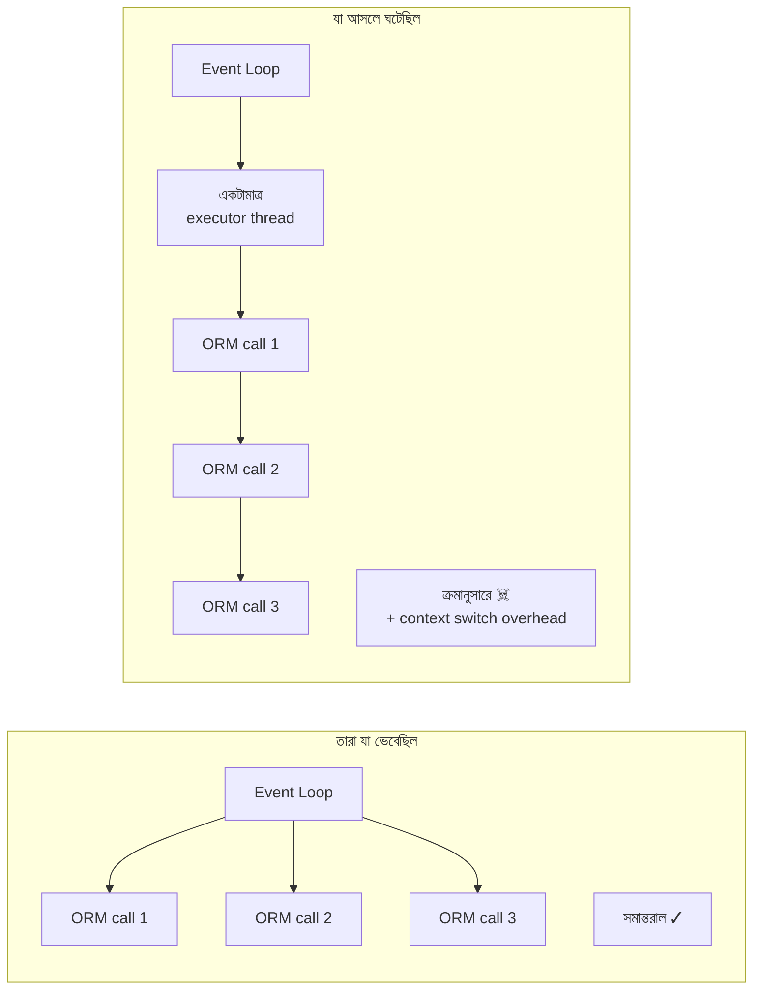
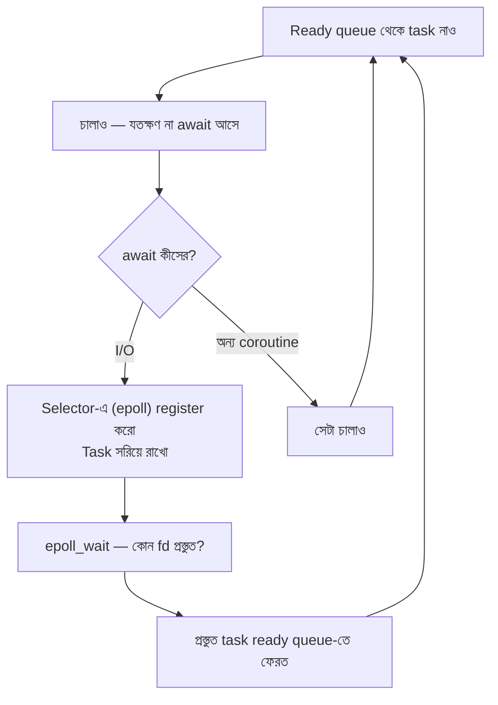

# Module 04 — Advanced Python Internals

> **Phase B** | পূর্বশর্ত: M02 (Networking Deep Dive)
> পরের module: M05 (Django Internals)

---

## ১. যে টিম async-এ গিয়ে ৩ গুণ ধীর হয়ে গেল

একটা টিম সিদ্ধান্ত নিল — "Django 4.2-এ async view আছে, আমরা async-এ যাব, API দ্রুত হবে।"

তারা সব view-কে `async def` বানাল:

```python
# "নতুন, দ্রুত" version
async def payment_detail(request, pk):
    payment = await Payment.objects.aget(pk=pk)
    merchant = await Merchant.objects.aget(pk=payment.merchant_id)
    recent   = [p async for p in Payment.objects.filter(merchant_id=payment.merchant_id)[:10]]
    return JsonResponse(serialize(payment, merchant, recent))
```

Gunicorn-এর worker class বদলে `UvicornWorker` দিল। Deploy করল।

**Throughput ৩ গুণ কমে গেল।** p99 ২০০ms থেকে ১.৪ সেকেন্ড।

কারণটা বোঝার জন্য দুইটা জিনিস জানতে হয়:

**১.** Django-র ORM এখনো **প্রকৃত async না**। `aget()` ভেতরে ভেতরে `sync_to_async()` দিয়ে সাধারণ sync query-টাই চালায়।

**২.** `sync_to_async`-এর ডিফল্ট `thread_sensitive=True`। এর মানে — Django-র thread-local state (DB connection, transaction, `request` context) রক্ষা করার জন্য সব sync কাজ **একটাই shared executor thread**-এ চালানো হয়।



আগে ১৬টা Gunicorn thread সমান্তরালে ১৬টা DB query চালাত। এখন সব query একটা thread-এ সারিবদ্ধ, উপরন্তু event loop ↔ thread context switch-এর খরচ যোগ হলো।

**সমাধান ছিল async ফেলে দেওয়া নয়** — সমাধান ছিল বোঝা যে **async তখনই লাভজনক যখন পুরো I/O chain async**। Django ORM-এর জন্য সেটা এখনো সত্য না। তারা `gthread` worker-এ ফিরে গেল, আর শুধু যেসব view বাইরের HTTP API-তে অনেকগুলো concurrent call করে সেগুলো async রাখল — সেখানে `httpx.AsyncClient` সত্যিই async, তাই লাভ হলো।

এই module-টা এই ধরনের সিদ্ধান্ত সঠিকভাবে নেওয়ার জন্য।

---

## ২. CPython Object Model — সব কিছু একটা pointer

Python-এ **কোনো primitive নেই**। `x = 5` মানে stack-এ ৫ রাখা না — মানে heap-এ একটা `PyObject` তৈরি (বা reuse) করে তার pointer রাখা।

```c
// CPython-এর ভেতরে, সরলীকৃত
typedef struct _object {
    Py_ssize_t ob_refcnt;        // ৮ বাইট — কতজন এটাকে ধরে আছে
    PyTypeObject *ob_type;       // ৮ বাইট — এটার type কী
} PyObject;
```

তাই প্রতিটা object-এর **অন্তত ১৬ বাইট overhead**, আসল data-র আগেই।

```python
import sys
sys.getsizeof(0)          # 28 বাইট  ← একটা int!
sys.getsizeof(1_000_000)  # 28
sys.getsizeof(10**100)    # 72       ← arbitrary precision
sys.getsizeof([])         # 56
sys.getsizeof({})         # 64
sys.getsizeof("")         # 49
```

**বাস্তব প্রভাব:**

```python
# ১০ লক্ষ integer-এর list
data = list(range(1_000_000))
# list-এর pointer array:  1M × 8 বাইট  = 8 MB
# int object গুলো:        1M × 28 বাইট = 28 MB   (256-এর উপরে হলে)
# মোট ≈ 36 MB

import array
data = array.array("q", range(1_000_000))   # 8 MB — ৪.৫× কম
import numpy as np
data = np.arange(1_000_000, dtype=np.int64)  # 8 MB + দ্রুত operation
```

> **Senior Tip:** Django-তে `Payment.objects.all()` দিয়ে ১০ লক্ষ row আনলে শুধু data-র memory না — প্রতিটা model instance-এর `__dict__`, প্রতিটা field-এর object wrapper, সব মিলে সহজেই কয়েক GB হয়ে যায়। এই কারণেই `.iterator()` আর `.values_list()` গুরুত্বপূর্ণ (নিচে §৭)।

### ছোট object cache

```python
a = 256; b = 256; a is b        # True  — CPython -5..256 cache করে রাখে
a = 257; b = 257; a is b        # False — আলাদা object
```

এই কারণেই `==` ব্যবহার করবেন, `is` না। `is` শুধু `None`, `True`, `False`-এর জন্য।

---

## ৩. Memory Management — দুইটা আলাদা ব্যবস্থা

Python-এ memory reclaim হয় **দুইভাবে**, এবং এই দুইটা আলাদা জিনিস।

### ৩.১ Reference Counting (প্রধান ব্যবস্থা)

```python
import sys
x = [1, 2, 3]
sys.getrefcount(x)     # 2 — একটা x থেকে, একটা getrefcount-এর argument থেকে
y = x
sys.getrefcount(x)     # 3
del y
sys.getrefcount(x)     # 2
del x                  # refcount 0 → সাথে সাথে memory মুক্ত
```

Refcount শূন্য হলে **তাৎক্ষণিকভাবে** free হয়। এটা deterministic — এটাই Python-এর সুবিধা (Java-র মতো GC pause নেই)।

কিন্তু refcount-এর একটা অন্ধ জায়গা আছে: **cycle**।

```python
class Node: pass
a, b = Node(), Node()
a.other = b
b.other = a
del a, b       # refcount ০ হলো না — একে অপরকে ধরে আছে. Leak!
```

### ৩.২ Generational Garbage Collector (cycle-এর জন্য)

```python
import gc
gc.get_threshold()   # (700, 10, 10)
```

**অর্থ:**
- Gen 0: (allocation − deallocation) ৭০০ ছাড়ালে gen-0 scan হয়
- Gen 1: ১০ বার gen-0 collection হলে gen-1 scan হয়
- Gen 2: ১০ বার gen-1 collection হলে **পুরো heap scan** হয় ☠️

**অনুমান:** যে object দীর্ঘদিন বেঁচে আছে, সে আরও বাঁচবে। তাই পুরনো object কম scan করো।

**সমস্যা:** Django app-এ startup-এ লক্ষ লক্ষ object তৈরি হয় (model class, URL pattern, serializer, migration state) যা **কখনো মরবে না**। এগুলো gen-2-এ চলে যায়। তারপর প্রতিটা gen-2 collection-এ ওই সবগুলো scan হয় — সম্পূর্ণ বৃথা।

### ৩.৩ `gc.freeze()` — Instagram-এর বিখ্যাত optimization

Gunicorn `preload_app=True` দিয়ে master process-এ Django load করে, তারপর `fork()` করে worker বানায়। Linux-এ fork **copy-on-write** — parent-এর memory page শুরুতে share হয়, কেউ লিখলে তখন copy হয়।

কিন্তু GC যখন object scan করে, সে প্রতিটা object-এর GC header-এ লেখে। **লেখা মানেই copy-on-write ট্রিগার।** ফলে fork-এর কয়েক মিনিটের মধ্যে শত শত MB shared memory আলাদা হয়ে যায় — কোনো কারণ ছাড়াই।

```python
# gunicorn.conf.py
import gc

preload_app = True

def post_fork(server, worker):
    # startup object গুলোকে "permanent" generation-এ সরাও —
    # GC আর কখনো এগুলো scan করবে না
    gc.freeze()
```

Instagram এতে **প্রতি worker-এ ~৩০% memory** বাঁচিয়েছিল। বড় Django app-এ ৫০–২০০ MB প্রতি worker। ৫০ pod × ৮ worker হলে এটা কয়েক GB।

```python
# আরও আক্রমণাত্মক (মেপে নিন, cycle leak-এর ঝুঁকি আছে)
def post_fork(server, worker):
    gc.freeze()
    gc.set_threshold(50_000, 50, 50)   # gen-0 কম ঘন ঘন
```

> **Senior Tip:** `gc.disable()` পুরোপুরি বন্ধ করবেন না যদি না আপনি নিশ্চিত থাকেন কোথাও cycle তৈরি হচ্ছে না। Django-তে cycle হয় (exception traceback, form, cached property)। তার চেয়ে `gc.freeze()` + `max_requests` দিয়ে periodic worker recycle নিরাপদ।

### ৩.৪ কেন memory OS-কে ফেরত যায় না

CPython ছোট object-এর জন্য নিজস্ব allocator (`pymalloc`) ব্যবহার করে:

```
Arena  (256 KB, mmap দিয়ে OS থেকে)
  └─ Pool (4 KB, একটা নির্দিষ্ট size class)
       └─ Block (8, 16, 24, ... 512 বাইট)
```

একটা arena **তখনই** OS-কে ফেরত যায় যখন তার **প্রতিটা** block খালি। বাস্তবে একটা arena-তে ১০০০টা object-এর ৯৯৯টা মুক্ত হলেও, বাকি ১টার জন্য পুরো ২৫৬ KB ধরে থাকে।

**এটাই fragmentation।** উপসর্গ:

```
RSS ধীরে ধীরে বাড়ছে, কিন্তু কোনো leak নেই।
tracemalloc কিছু দেখাচ্ছে না।
Restart করলে memory স্বাভাবিক হয়ে যায়।
```

**সমাধান — worker recycling:**

```python
# gunicorn.conf.py
max_requests = 2000
max_requests_jitter = 200   # ⚠️ jitter না দিলে সব worker একসাথে restart করবে
```

`jitter` না দিলে ২০০০তম request-এ সব worker একসাথে মরবে → মুহূর্তের জন্য শূন্য capacity → 502।

> এটা "hack" না, এটা industry standard। Instagram, Pinterest, Disqus — সবাই করে। Python-এ long-running process-এ fragmentation অনিবার্য।

---

## ৪. GIL — যা আসলে ঘটে

### ৪.১ GIL কী রক্ষা করে

Global Interpreter Lock একটা mutex যা নিশ্চিত করে **একসাথে একটাই thread Python bytecode চালাবে**। কারণ: refcount আপডেট atomic না। দুইটা thread একসাথে `ob_refcnt++` করলে count ভুল হবে → হয় leak, নয় use-after-free crash।

### ৪.২ GIL কখন ছাড়া হয় — এটাই মূল কথা

| অবস্থা | GIL ছাড়ে? | মানে |
|---|---|---|
| CPU-bound Python loop | প্রতি ~৫ms (`sys.setswitchinterval`) | Thread দিয়ে **কোনো লাভ নেই** |
| **File/socket I/O** | ✅ হ্যাঁ | Thread দিয়ে **সম্পূর্ণ লাভ** |
| **DB query চলাকালীন** | ✅ হ্যাঁ (psycopg C code) | Thread দিয়ে **সম্পূর্ণ লাভ** |
| **HTTP request-এর অপেক্ষা** | ✅ হ্যাঁ | Thread দিয়ে **সম্পূর্ণ লাভ** |
| `time.sleep()` | ✅ হ্যাঁ | |
| NumPy/Pillow-এর ভারী কাজ | ✅ হ্যাঁ (C extension ছাড়ে) | Thread কাজ করে |
| JSON serialize (বড় payload) | ❌ না | GIL ধরে রাখে |
| Password hash (bcrypt/argon2) | ❌ না (pure Python অংশে) | Worker আটকে যায় |

**এই টেবিলটাই পুরো concurrency সিদ্ধান্তের ভিত্তি।**

একটা সাধারণ Django request-এ সময় কোথায় যায়?

```
DB query-র অপেক্ষা          60%   ← GIL ছাড়া
External API-র অপেক্ষা      20%   ← GIL ছাড়া
Cache/Redis-এর অপেক্ষা       5%   ← GIL ছাড়া
Python কোড (serialize, logic) 15%  ← GIL ধরা
─────────────────────────────────
মোট                        100%
```

**৮৫% সময় GIL ছাড়া থাকে।** এই কারণেই Django-তে thread কাজ করে, "GIL আছে তাই thread অকেজো" — এই কথাটা Django-র ক্ষেত্রে **ভুল**।

### ৪.৩ Free-threaded Python (PEP 703) — বাস্তবতা

Python 3.13-এ GIL ছাড়া build (`python3.13t`) experimental হিসেবে এল, 3.14-এ আরও পরিণত হয়েছে।

**যা সত্য:**
- CPU-bound multithreading সত্যিই সমান্তরাল হয়
- Single-thread performance-এ কিছুটা penalty আছে (প্রাথমিক build-এ বেশি ছিল, ক্রমে কমছে)
- প্রতিটা C extension-কে আলাদাভাবে free-threading-safe হতে হয়

**যা আপনার আজকের সিদ্ধান্তে প্রভাব ফেলবে:** প্রায় কিছুই না। Production Django stack-এ (psycopg, Pillow, lxml, cryptography, celery) সব dependency-র free-threaded support পরিপক্ব না হওয়া পর্যন্ত এটা অপেক্ষার বিষয়।

> **Interview-এ সঠিক উত্তর:** "Free-threading আসছে এবং CPU-bound Python-এর জন্য বড় পরিবর্তন। কিন্তু Django-র bottleneck CPU না, I/O — তাই আমাদের জন্য এটা তেমন কিছু বদলাবে না। যাদের জন্য বদলাবে তারা হলো data processing আর ML inference-এর লোকেরা। আর ecosystem readiness ছাড়া production-এ নেওয়ার প্রশ্নই ওঠে না।" — এই উত্তর দিলে আপনি hype থেকে আলাদা।

---

## ৫. Concurrency Model — কোনটা কখন

এই টেবিলটা মুখস্থ রাখুন। এটাই M02-এর "worker আটকে থাকে" সমস্যার উত্তর।

| Model | Concurrency | ভালো কীসে | খারাপ কীসে | Django-তে |
|---|---|---|---|---|
| **sync worker** | `workers` | সরলতা, CPU-bound view | I/O-বহুল, slow client | ডিফল্ট, কিন্তু কদাচিৎ সেরা |
| **gthread** | `workers × threads` | **সাধারণ Django API** | CPU-bound, বেশি thread = context switch | ✅ **ডিফল্ট পছন্দ হওয়া উচিত** |
| **gevent** | হাজার হাজার | বহু concurrent I/O | monkey-patch, C extension ভাঙে, debug কঠিন | সতর্কতার সাথে |
| **multiprocessing / Celery** | `processes` | CPU-bound কাজ | Memory, IPC খরচ | ভারী কাজ Celery-তে |
| **asyncio (Uvicorn)** | হাজার হাজার | WebSocket, বহু outbound HTTP | ORM এখনো sync, একটা blocking call সব মারে | নির্বাচিত view-এ |

### ৫.১ Gunicorn config — বাস্তব সুপারিশ

```python
# gunicorn.conf.py — সাধারণ Django/DRF API-র জন্য
import multiprocessing, gc

bind = "0.0.0.0:8000"

# gthread: I/O-বহুল Django-র জন্য সেরা ভারসাম্য
worker_class = "gthread"
workers = multiprocessing.cpu_count()      # container-এর CPU limit!
threads = 4                                 # প্রতি worker
# → concurrency = cpu_count × 4

worker_connections = 1000
backlog = 4096                              # M02 দেখুন

timeout = 30                                # worker কতক্ষণ ঝুললে মারা হবে
graceful_timeout = 30
keepalive = 65                              # ⚠️ LB idle timeout-এর চেয়ে বেশি

max_requests = 2000                         # fragmentation প্রতিরোধ
max_requests_jitter = 200                   # ⚠️ jitter অপরিহার্য

preload_app = True                          # copy-on-write সাশ্রয়

def post_fork(server, worker):
    gc.freeze()                             # §৩.৩

# JSON logging, stdout-এ (k8s)
accesslog = "-"
errorlog = "-"
```

### ৫.২ Worker সংখ্যা — সূত্র নয়, হিসাব

প্রচলিত `(2 × CPU) + 1` সূত্রটা **sync worker-এর জন্য**, এবং এটা মোটামুটি ধারণা মাত্র। সঠিক হিসাব:

```
প্রয়োজনীয় concurrency = target_RPS × avg_response_time_sec

উদাহরণ: 300 RPS, 80ms response
       = 300 × 0.08 = 24 concurrent

gthread-এ:  workers × threads ≥ 24
            4 worker × 8 thread = 32  ✓ (headroom সহ)
```

**কিন্তু সীমাবদ্ধতা যাচাই করুন:**

```
DB connection = pods × workers × threads?
  ❌ না — gthread-এ Django প্রতি thread-এ একটা connection রাখে (thread-local)
  তাই: 50 pod × 4 worker × 8 thread = 1,600 connection ☠️
  → PgBouncer বাধ্যতামূলক (M02 §৬.৩, M07)

Memory = workers × (base + per-request peak)
  Django app base ~200 MB, তাই 4 worker ≈ 800 MB + overhead
  Container limit 1 GB হলে OOMKilled হবে
```

> **Common Mistake:** Container-এ `multiprocessing.cpu_count()` **node-এর** CPU দেখায়, container limit না। ৬৪-core node-এ ০.৫ CPU limit থাকা pod ৬৪টা worker বানাবে → সাথে সাথে OOMKilled। সমাধান: `WEB_CONCURRENCY` env var দিয়ে explicit সংখ্যা দিন, অথবা cgroup limit পড়ুন।

```python
import os
def _cpu_limit():
    # cgroup v2
    try:
        with open("/sys/fs/cgroup/cpu.max") as f:
            quota, period = f.read().split()
            if quota != "max":
                return max(1, int(int(quota) / int(period)))
    except FileNotFoundError:
        pass
    return multiprocessing.cpu_count()

workers = int(os.getenv("WEB_CONCURRENCY", _cpu_limit()))
```

---

## ৬. asyncio — ভেতরে কী হয়

### ৬.১ Event loop-এর মূল ধারণা



মূল কথা: **`await` মানে "আমি অপেক্ষা করব, এই সময়টা তুমি অন্য কাজ করো"** — event loop-কে নিয়ন্ত্রণ ফেরত দেওয়া।

```python
import asyncio, time

async def fetch(name, delay):
    print(f"{name} শুরু")
    await asyncio.sleep(delay)      # ← এখানে loop অন্য task চালায়
    print(f"{name} শেষ")
    return name

async def main():
    t = time.perf_counter()
    # ❌ ভুল — ক্রমানুসারে চলবে, ৩ সেকেন্ড
    await fetch("a", 1); await fetch("b", 1); await fetch("c", 1)
    print(f"ক্রমিক: {time.perf_counter()-t:.1f}s")

    t = time.perf_counter()
    # ✅ সঠিক — সমান্তরাল, ১ সেকেন্ড
    await asyncio.gather(fetch("a", 1), fetch("b", 1), fetch("c", 1))
    print(f"সমান্তরাল: {time.perf_counter()-t:.1f}s")

asyncio.run(main())
```

> **Common Mistake:** `async def` লিখে প্রতিটা call-এ `await` করা মানে concurrency **না**। Concurrency আসে `gather`, `TaskGroup`, বা `create_task` থেকে। শুধু `await` করলে আপনি sync কোডই লিখছেন, শুধু বেশি overhead সহ।

### ৬.২ একটা blocking call পুরো loop মারে

Event loop **single-threaded**। কোনো coroutine যদি `await` না করে ২ সেকেন্ড CPU খায় বা blocking I/O করে, তাহলে **সব task ২ সেকেন্ড আটকে থাকে**।

```python
# ☠️ বিপর্যয় — একটা request পুরো server আটকে দেয়
async def bad_view(request):
    data = requests.get(url).json()        # blocking! loop আটকে গেল
    time.sleep(1)                          # blocking!
    hashlib.pbkdf2_hmac(...)               # CPU-bound, loop আটকে গেল
    return JsonResponse(data)

# ✅ সঠিক
async def good_view(request):
    async with httpx.AsyncClient() as client:      # সত্যিকারের async
        r = await client.get(url, timeout=10)
    await asyncio.sleep(1)                          # async sleep
    # CPU-bound কাজ thread/process pool-এ পাঠান
    loop = asyncio.get_running_loop()
    digest = await loop.run_in_executor(None, expensive_hash, password)
    return JsonResponse(r.json())
```

**Debug করার উপায় — development-এ সবসময় চালু রাখুন:**

```python
import asyncio, logging
loop = asyncio.get_event_loop()
loop.set_debug(True)
loop.slow_callback_duration = 0.1   # 100ms-এর বেশি ব্লক করলে warning
```

### ৬.৩ Django-তে async-এর প্রকৃত অবস্থা (এবং `thread_sensitive` ফাঁদ)

```python
from asgiref.sync import sync_to_async, async_to_sync

# ডিফল্ট — thread_sensitive=True
# সব call একটাই shared executor thread-এ চলে
# কারণ: Django-র DB connection ও transaction thread-local
@sync_to_async                          # thread_sensitive=True (ডিফল্ট)
def get_payment(pk):
    return Payment.objects.get(pk=pk)

# thread_sensitive=False — নতুন thread pool-এ চলে, সমান্তরাল
# ⚠️ কিন্তু তখন DB connection আলাদা, transaction share হবে না
@sync_to_async(thread_sensitive=False)
def call_external_api(url):
    return requests.get(url).json()     # DB-হীন কাজ — নিরাপদ
```

**নিয়ম:**

| কাজ | `thread_sensitive` | কারণ |
|---|---|---|
| ORM query, transaction | `True` (ডিফল্ট) | Connection ও atomic block thread-local |
| DB ছোঁয় না এমন blocking কাজ | `False` | সমান্তরাল হবে |

### ৬.৪ কখন Django-তে async ব্যবহার করবেন

| পরিস্থিতি | সিদ্ধান্ত |
|---|---|
| সাধারণ CRUD API (ORM-নির্ভর) | ❌ **sync + gthread**. Async-এ ধীর হবে। |
| একটা view-তে ৫–২০টা external HTTP call | ✅ **async** — `httpx.AsyncClient` + `gather`। বড় লাভ। |
| WebSocket / SSE / long-lived connection | ✅ **async বাধ্যতামূলক** (M27) |
| LLM streaming proxy | ✅ **async** — দীর্ঘ, I/O-bound |
| CPU-bound (image, PDF, hashing) | ❌ **Celery** |
| ১০,০০০ idle connection ধরে রাখা | ✅ **async** |

**Async-এর আসল হিসাব:**

```python
# একটা dashboard view যা ৫টা microservice ডাকে, প্রতিটা 200ms
# sync:  5 × 200ms = 1000ms
# async: max(200ms) ≈ 220ms      ← ৪.৫× দ্রুত

async def dashboard(request):
    async with httpx.AsyncClient(timeout=5) as c:
        results = await asyncio.gather(
            c.get(f"{BILLING}/summary"),
            c.get(f"{RISK}/score"),
            c.get(f"{LEDGER}/balance"),
            c.get(f"{KYC}/status"),
            c.get(f"{NOTIF}/unread"),
            return_exceptions=True,        # ⚠️ একটা fail করলে বাকিগুলো যেন বাঁচে
        )
    payload = {}
    for name, r in zip(NAMES, results):
        if isinstance(r, Exception):
            payload[name] = None           # graceful degradation (M16)
        else:
            payload[name] = r.json()
    return JsonResponse(payload)
```

`return_exceptions=True` ছাড়া একটা service-এর failure পুরো dashboard মেরে দেবে। এটা resilience-এর মূল ধারণা (M16)।

---

## ৭. Generator — memory-র সবচেয়ে সহজ জয়

```python
# ❌ ১০ লক্ষ row — কয়েক GB RAM
payments = list(Payment.objects.all())
for p in payments: process(p)

# ✅ Generator — একবারে chunk_size রো
for p in Payment.objects.all().iterator(chunk_size=2000):
    process(p)
```

`.iterator()` PostgreSQL-এ **server-side cursor** ব্যবহার করে — পুরো result set client-এ আসে না, database ধরে রাখে আর chunk করে দেয়।

**সাবধানতা:**

| ব্যাপার | বিস্তারিত |
|---|---|
| `prefetch_related` | Django 4.1-এর আগে `.iterator()`-এ কাজ করত না। এখন `chunk_size` দিলে কাজ করে। |
| QuerySet cache | `.iterator()` cache করে না — দুইবার iterate করলে দুইবার query হবে |
| Transaction | Server-side cursor-এর জন্য connection ধরে থাকতে হয়। দীর্ঘ loop-এ transaction দীর্ঘ হয় → VACUUM আটকায় (M07) |
| PgBouncer transaction mode | Server-side cursor ভেঙে যায়! `DISABLE_SERVER_SIDE_CURSORS = True` লাগবে |

শেষ পয়েন্টটা একটা ক্লাসিক production ফাঁদ:

```python
# settings.py — PgBouncer transaction pooling ব্যবহার করলে
DATABASES["default"]["DISABLE_SERVER_SIDE_CURSORS"] = True
# এখন .iterator() client-side chunking করবে — memory সাশ্রয় কম, কিন্তু কাজ করবে
```

**আরও হালকা — model instance-ই বানাবেন না:**

```python
# model instance তৈরির খরচ এড়ান
for pk, amount in Payment.objects.values_list("id", "amount_minor").iterator():
    ...
# ~১০× কম memory, ~৩× দ্রুত
```

**নিজের generator pipeline:**

```python
def read_rows(qs):
    yield from qs.iterator(chunk_size=2000)

def to_ledger_lines(rows):
    for r in rows:
        yield {"account": r.merchant_id, "debit": r.amount_minor}

def batched(it, n=1000):
    batch = []
    for item in it:
        batch.append(item)
        if len(batch) >= n:
            yield batch; batch = []
    if batch: yield batch

# পুরো pipeline lazy — memory ধ্রুব, data যত বড়ই হোক
for chunk in batched(to_ledger_lines(read_rows(Payment.objects.all()))):
    LedgerLine.objects.bulk_create([LedgerLine(**d) for d in chunk])
```

Python 3.12+ এ `itertools.batched` built-in আছে।

---

## ৮. Descriptor — Django ORM-এর আসল রহস্য

Descriptor হলো এমন object যার `__get__`, `__set__`, বা `__delete__` আছে। Class attribute হিসেবে বসলে attribute access-কে **intercept** করে।

**কেন এটা গুরুত্বপূর্ণ:** এটা জানলে আপনি বুঝবেন N+1 query আসলে কোথা থেকে আসে।

```python
class Payment(models.Model):
    merchant = models.ForeignKey(Merchant, ...)
    amount_minor = models.BigIntegerField()

p = Payment.objects.get(pk=1)
p.merchant          # ← এখানে একটা SQL query হয়!
```

কেন? কারণ `Payment.merchant` আসলে একটা attribute না — এটা `ForwardManyToOneDescriptor` নামের একটা descriptor। `p.merchant` লিখলে তার `__get__` চলে, যা মোটামুটি এই কাজ করে:

```python
# django/db/models/fields/related_descriptors.py — সরলীকৃত
class ForwardManyToOneDescriptor:
    def __get__(self, instance, cls=None):
        try:
            return instance._state.fields_cache[self.field.name]   # cached?
        except KeyError:
            pass
        # cache-এ নেই → DATABASE QUERY
        rel_obj = self.get_object(instance)
        instance._state.fields_cache[self.field.name] = rel_obj
        return rel_obj
```

**এখন N+1 স্ফটিক-স্বচ্ছ:**

```python
for p in Payment.objects.all()[:100]:   # ১টা query
    print(p.merchant.name)              # ১০০টা query — প্রতিটা descriptor __get__
# মোট ১০১টা query
```

`select_related` কী করে? সে JOIN দিয়ে merchant-এর data একই query-তে আনে এবং **আগে থেকেই `fields_cache` ভরে দেয়** — তাই descriptor-এর `__get__` cache hit পায়, query হয় না।

```python
for p in Payment.objects.select_related("merchant")[:100]:  # ১টা query
    print(p.merchant.name)                                   # ০টা query
```

সাধারণ field-ও descriptor (`DeferredAttribute`) — এই কারণেই `.only()` / `.defer()` কাজ করে:

```python
p = Payment.objects.only("id", "amount_minor").get(pk=1)
p.status      # ← এখানে আরেকটা query! DeferredAttribute.__get__ ট্রিগার
```

> **Senior Tip:** Interview-এ "N+1 কী?" জিজ্ঞেস করলে বেশিরভাগ লোক বলে "loop-এ query হয়"। আপনি বলুন **কেন** — "Django-র relation attribute আসলে descriptor, তার `__get__`-এ lazy fetch হয়। `select_related` JOIN করে `fields_cache` prefill করে, তাই descriptor cache hit পায়। `prefetch_related` আলাদা query করে Python-এ join করে।" এই উত্তরটা আপনাকে সরাসরি আলাদা করে দেবে।

**নিজের descriptor — বাস্তব ব্যবহার:**

```python
class MoneyField:
    """DB-তে integer minor unit, Python-এ Decimal।"""
    def __init__(self, attr): self.attr = attr
    def __set_name__(self, owner, name): self.name = name

    def __get__(self, obj, objtype=None):
        if obj is None: return self
        minor = getattr(obj, self.attr)
        return Decimal(minor) / 100 if minor is not None else None

    def __set__(self, obj, value):
        setattr(obj, self.attr, int(Decimal(str(value)) * 100))

class Payment(models.Model):
    amount_minor = models.BigIntegerField()
    amount = MoneyField("amount_minor")     # p.amount → Decimal("1500.00")
```

---

## ৯. Decorator — production-grade

```python
import functools, time, logging
from django.db import transaction

logger = logging.getLogger(__name__)

def timed(threshold_ms: float = 0):
    def decorator(func):
        @functools.wraps(func)             # ⚠️ ছাড়া __name__, docstring, signature হারায়
        def wrapper(*args, **kwargs):
            start = time.perf_counter()
            try:
                return func(*args, **kwargs)
            finally:
                elapsed = (time.perf_counter() - start) * 1000
                if elapsed >= threshold_ms:
                    logger.warning("slow_call", extra={
                        "func": func.__qualname__, "ms": round(elapsed, 1),
                    })
        return wrapper
    return decorator

@timed(threshold_ms=500)
def settle_batch(batch_id): ...
```

`functools.wraps` না দিলে যা ভাঙে: Django-র URL reverse, DRF-এর introspection, `inspect.signature`, Sphinx doc, pytest fixture — সব।

**সবচেয়ে সাধারণ decorator bug — mutable default:**

```python
# ❌ cache dict সব call-এ শেয়ার হয়, কখনো খালি হয় না → memory leak
def cached(func, _cache={}):
    ...

# ✅
from functools import lru_cache

@lru_cache(maxsize=1024)     # সীমাবদ্ধ, তাই leak না
def get_fx_rate(pair: str) -> Decimal: ...
```

⚠️ `lru_cache` **instance method-এ** ব্যবহার করবেন না — `self` cache-এ ধরা পড়ে যায়, object কখনো garbage collect হয় না। এটা একটা ক্লাসিক leak। `functools.cached_property` ব্যবহার করুন।

---

## ১০. Context Manager — `transaction.atomic` কীভাবে কাজ করে

```python
class atomic:                          # সরলীকৃত
    def __enter__(self):
        conn = get_connection()
        if conn.in_atomic_block:
            conn.savepoint_ids.append(conn.savepoint())  # nested → SAVEPOINT
        else:
            conn.set_autocommit(False)                    # বাইরের → BEGIN
            conn.in_atomic_block = True

    def __exit__(self, exc_type, exc_value, tb):
        if exc_type is None:
            conn.commit()  বা  RELEASE SAVEPOINT
        else:
            conn.rollback()  বা  ROLLBACK TO SAVEPOINT
        return False       # ⚠️ False = exception চাপা দিও না
```

**গুরুত্বপূর্ণ:** `__exit__` `True` ফেরত দিলে exception **গিলে ফেলা** হয়। `transaction.atomic` `False` ফেরত দেয় — rollback করে, কিন্তু exception উপরে যেতে দেয়। এটাই সঠিক আচরণ।

```python
from contextlib import contextmanager
from django.db import transaction, connection

@contextmanager
def advisory_lock(key: int, timeout_ms: int = 5000):
    """PostgreSQL advisory lock — distributed lock ছাড়াই cross-process mutex."""
    with connection.cursor() as cur:
        cur.execute("SET LOCAL lock_timeout = %s", [f"{timeout_ms}ms"])
        cur.execute("SELECT pg_advisory_xact_lock(%s)", [key])
        yield
    # transaction শেষে lock স্বয়ংক্রিয়ভাবে ছাড়া পায় (xact = transaction-scoped)

# ব্যবহার — একই merchant-এর settlement দুইবার যেন না চলে
with transaction.atomic(), advisory_lock(merchant.id):
    run_settlement(merchant)
```

`pg_advisory_xact_lock` **transaction-scoped** — তাই crash হলেও lock আটকে থাকে না। `pg_advisory_lock` (xact ছাড়া) session-scoped, আর connection pool-এ সেটা বিপজ্জনক (M07)।

---

## ১১. Metaclass — Django কীভাবে model খুঁজে পায়

```python
class Payment(models.Model):
    amount = models.BigIntegerField()
```

এই class definition চলার সময় `ModelBase` metaclass-এর `__new__` চলে, যা:

1. `amount` (একটা `Field` instance) ধরে ফেলে, class body থেকে সরিয়ে `_meta.fields`-এ রাখে
2. তার জায়গায় `DeferredAttribute` descriptor বসায় (§৮)
3. `Meta` inner class পড়ে `Options` object বানায়
4. `objects = Manager()` না থাকলে নিজে যোগ করে
5. **App registry-তে model টা register করে** — এই কারণেই `makemigrations` model খুঁজে পায়

DRF-এও একই কৌশল — `SerializerMetaclass` declared field সংগ্রহ করে `_declared_fields`-এ রাখে।

**কখন নিজে metaclass লিখবেন:** প্রায় কখনোই না।

| চাহিদা | সঠিক টুল |
|---|---|
| Subclass তৈরিতে হুক | `__init_subclass__` (Python 3.6+) |
| Attribute-এর নাম জানা | `__set_name__` |
| Class decorate করা | class decorator |
| Field সংগ্রহ করে DSL বানানো | metaclass (এটাই একমাত্র বৈধ কারণ) |

```python
# ৯৫% ক্ষেত্রে metaclass-এর বদলে এটাই যথেষ্ট
class BaseHandler:
    registry = {}
    def __init_subclass__(cls, *, event: str, **kw):
        super().__init_subclass__(**kw)
        BaseHandler.registry[event] = cls

class PaymentCreatedHandler(BaseHandler, event="payment.created"):
    def handle(self, payload): ...
```

> **Senior Tip:** Interview-এ "metaclass কী?" জিজ্ঞেস করলে সংজ্ঞা দিয়ে থামবেন না। বলুন: "Django-র `ModelBase` এটা ব্যবহার করে field সংগ্রহ ও registry-তে register করতে। কিন্তু application code-এ আমি প্রায় কখনো লিখি না — `__init_subclass__` বা class decorator পড়তে সহজ। Metaclass debug করা কঠিন এবং multiple inheritance-এ conflict করে।" — **কখন ব্যবহার করবেন না** সেটা বলাই senior signal।

---

## ১২. Memory Optimization — `__slots__` ও সঙ্গীরা

```python
class Point:
    def __init__(self, x, y): self.x, self.y = x, y

class SlotPoint:
    __slots__ = ("x", "y")               # __dict__ নেই
    def __init__(self, x, y): self.x, self.y = x, y

# ১০ লক্ষ instance:
#   Point      ≈ 152 MB
#   SlotPoint  ≈  56 MB     (~৩× কম, ও attribute access দ্রুত)
```

`__slots__` কাজ করে না যদি: dynamic attribute দরকার, multiple inheritance জটিল, বা Django Model (ORM `__dict__` ব্যবহার করে)। **কিন্তু DTO, event object, value object-এ চমৎকার।**

```python
from dataclasses import dataclass

@dataclass(frozen=True, slots=True)      # Python 3.10+
class PaymentEvent:
    payment_id: str
    amount_minor: int
    currency: str
```

`frozen=True` → immutable, hashable, thread-safe। Event object-এ ঠিক এটাই চান।

**Pydantic vs dataclass কখন:**

| | ব্যবহার |
|---|---|
| `dataclass(slots=True)` | Internal DTO, event — validation লাগে না, দ্রুত ও হালকা |
| Pydantic | বাইরের data (API input, config) — validation ও coercion দরকার |
| DRF Serializer | Django ORM-এর সাথে সংযুক্ত API layer |

Pydantic-এর validation খরচ আছে (v2-তে Rust-এ, তাই অনেক দ্রুত)। Internal event-এ prevalidated data আবার validate করা অপচয়।

---

## ১৩. Profiling — dev-এ কী, production-এ কী

| টুল | Overhead | Production-এ? | কী দেখায় |
|---|---|---|---|
| `cProfile` | ~৩০% | ❌ | Function-wise call ও সময় |
| **`py-spy`** | **~০%** | ✅ **হ্যাঁ** | Sampling profile, চলমান process-এ attach |
| `memray` | মাঝারি | সতর্কতার সাথে | Allocation-wise memory |
| `tracemalloc` | উচ্চ | ❌ | কোন লাইনে কত allocate |
| `django-silk` | উচ্চ | ❌ | Per-request SQL ও timing |
| `django-debug-toolbar` | উচ্চ | ❌ | Dev-এ N+1 ধরার সেরা |
| OpenTelemetry | কম | ✅ | Distributed trace (M24) |

### py-spy — production debugging-এর একক সেরা টুল

```bash
# চলমান production pod-এ — কোড বদলানো লাগে না, restart লাগে না
kubectl exec -it api-7f8-xyz -- py-spy top --pid 1

# Flame graph — "কেন CPU ১০০%?"
py-spy record -o /tmp/profile.svg --pid 1 --duration 60

# ⚠️ সবচেয়ে দরকারি: "worker আটকে আছে, কোথায়?"
py-spy dump --pid 1
# প্রতিটা thread-এর বর্তমান stack trace দেখাবে —
# তখনই বোঝা যায় সবাই কি DB-র অপেক্ষায়, নাকি একটা lock-এ
```

```yaml
# py-spy-র জন্য pod-এ এই capability লাগে
securityContext:
  capabilities:
    add: ["SYS_PTRACE"]
```

> **Senior Tip:** "Production-এ API ঝুলে গেছে, কী করবেন?" — এই প্রশ্নে `py-spy dump` বলাটা প্রায় সবসময় interviewer-কে চমকে দেয়, কারণ বেশিরভাগ লোক শুধু log আর metric-এর কথা বলে। `py-spy dump` আপনাকে সরাসরি দেখায় প্রতিটা worker ঠিক কোন লাইনে দাঁড়িয়ে আছে।

### Memory leak খোঁজার ক্রম

```python
# ১. এটা কি আসলেই leak, নাকি fragmentation?
#    RSS বাড়ে কিন্তু restart-এ ঠিক → সম্ভবত fragmentation (§৩.৪)
#    RSS একটানা বাড়তেই থাকে → আসল leak

# ২. Object সংখ্যা গোনা
import gc, collections
counts = collections.Counter(type(o).__name__ for o in gc.get_objects())
print(counts.most_common(20))
# কোন type-টা বাড়ছে? পরপর দুইবার নিয়ে তুলনা করুন।

# ৩. কে ধরে রেখেছে
import objgraph
objgraph.show_backrefs(
    objgraph.by_type("Payment")[:3], max_depth=5, filename="/tmp/refs.png"
)

# ৪. অমীমাংসিত cycle
gc.set_debug(gc.DEBUG_SAVEALL)
gc.collect()
print(len(gc.garbage))   # collect করা যায়নি এমন object
```

**Django-তে সবচেয়ে সাধারণ leak-এর উৎস:**

| উৎস | কেন | সমাধান |
|---|---|---|
| `DEBUG=True` production-এ | Django প্রতিটা SQL query memory-তে জমায় | `DEBUG=False` (এবং এটা চেক করুন!) |
| Module-level unbounded dict/list cache | কখনো খালি হয় না | `lru_cache(maxsize=N)` বা Redis |
| `lru_cache` instance method-এ | `self` cache-এ ধরা পড়ে | `cached_property` |
| Logger-এ object পাঠানো | Handler reference ধরে রাখে | `str()` করে পাঠান |
| Celery `result_backend` unbounded | Result জমতে থাকে | `result_expires` সেট করুন |
| Long-lived `Signal` receiver closure | Closure বড় object ধরে | `weak=True` (ডিফল্ট) নিশ্চিত করুন |

---

## ১৪. Performance — কোথায় সময় দিলে আসলে লাভ

**অগ্রাধিকারের ক্রম** (উপরেরটা নিচেরটার চেয়ে ১০০× বেশি প্রভাব ফেলে):

```
১. Query সংখ্যা কমান        — N+1 ঠিক করা: ১০০ query → ১     (১০০× লাভ)
২. Index যোগ করুন           — seq scan → index scan            (১০০০× লাভ)
৩. Cache করুন               — 5ms → 0.5ms                      (১০× লাভ)
৪. Payload ছোট করুন         — কম serialize, কম নেটওয়ার্ক        (২–৫× লাভ)
৫. Algorithm ঠিক করুন       — O(n²) → O(n log n)               (data বড় হলে)
─────────────────── এই লাইনের নিচে সাধারণত সময় নষ্ট ───────────────────
৬. Micro-optimization       — list comp vs loop                 (১.২× লাভ)
৭. PyPy / Cython / Rust     — বড় প্রচেষ্টা, সংকীর্ণ প্রয়োগ
```

> **Senior Tip:** কেউ যদি বলে "Python ধীর তাই Go-তে যাব" — জিজ্ঞেস করুন profile কোথায়। বেশিরভাগ Django API-তে ৮০%+ সময় DB-র অপেক্ষায় যায়। Go-তে গেলে ওই ২০% Python সময়ের ৮০% বাঁচবে — মানে মোট ১৬%। কিন্তু N+1 ঠিক করলে ৯০% বাঁচবে। **ভাষা বদলানোর আগে query বদলান।**

**যেখানে Python সত্যিই বাধা:** টাইট numeric loop, বড় JSON parsing, image/PDF প্রক্রিয়াকরণ, cryptographic hashing। সমাধান ভাষা বদলানো না — ওই অংশটা C-backed library বা আলাদা service-এ সরানো।

```python
# JSON — যদি সত্যিই bottleneck হয় (আগে profile করুন)
import orjson                            # C-backed, stdlib json-এর ~৫× দ্রুত

class ORJSONRenderer(BaseRenderer):
    media_type = "application/json"
    format = "json"
    def render(self, data, accepted_media_type=None, renderer_context=None):
        return orjson.dumps(data, option=orjson.OPT_NON_STR_KEYS)

# settings.py
REST_FRAMEWORK = {"DEFAULT_RENDERER_CLASSES": ["myapp.renderers.ORJSONRenderer"]}
```

---

## ১৫. Interview Section

### প্রশ্ন ১ (Senior) — "GIL থাকা সত্ত্বেও Django-তে thread ব্যবহার করা কি অর্থপূর্ণ?"

**❌ Wrong Answer**
> "না, GIL-এর জন্য Python-এ thread কাজ করে না। Multiprocessing ব্যবহার করতে হবে।"

*কেন খারাপ:* এটা সবচেয়ে বেশি প্রচারিত ভুল ধারণা, এবং Django-র ক্ষেত্রে সম্পূর্ণ ভুল।

**✅ Ideal Answer**
> "হ্যাঁ, অবশ্যই। GIL শুধু Python **bytecode চালানোর** সময় ধরা থাকে। I/O-র অপেক্ষায় থাকলে GIL ছেড়ে দেওয়া হয় — socket read, DB query, HTTP call, file I/O — সবগুলোতে। সাধারণ Django request-এ ৮০–৯০% সময় I/O-র অপেক্ষায় যায়, তাই thread দিয়ে প্রায় linear scaling পাওয়া যায়। এই কারণেই Gunicorn-এর `gthread` worker সাধারণ Django API-র জন্য সাধারণত সেরা।"

**🌟 Senior/Staff Answer**
> উপরেরটা, তারপর:
> "তবে thread বাড়ানোর সীমা আছে, এবং সীমাটা GIL না — **downstream resource**। Django-তে প্রতিটা thread নিজের DB connection ধরে (thread-local)। তাই `50 pod × 4 worker × 8 thread = 1,600` connection। PostgreSQL-এর ডিফল্ট `max_connections` ১০০, আর প্রতিটা connection একটা আলাদা OS process যার ৫–১০ MB overhead। তাই thread বাড়ানোর আসল সীমা PgBouncer বা DB capacity।
> আর একটা সূক্ষ্মতা — যেসব কাজে GIL ছাড়া হয় না, সেগুলো thread-এ contention তৈরি করে: বড় JSON serialization, bcrypt/argon2 hashing, template rendering। এগুলো বেশি থাকলে thread বাড়িয়ে লাভ কমতে থাকে। আমি profile দেখে সিদ্ধান্ত নেব, সূত্র দিয়ে না — `py-spy` দিয়ে দেখব thread গুলো কোথায় সময় কাটাচ্ছে।
> Free-threaded Python (3.13+) এই ছবিটা বদলাবে CPU-bound কাজের জন্য, কিন্তু Django-র bottleneck CPU না, তাই আমাদের জন্য তেমন কিছু বদলাবে না।"

**⚠️ Common Mistakes:** "GIL = thread অকেজো" বলা; DB connection-এর সীমাটা মিস করা।

---

### প্রশ্ন ২ (Senior / Debugging) — "আমাদের Django worker-এর memory ধীরে ধীরে বাড়ছে, দিনে ~২০০ MB। Leak?"

**❌ Wrong Answer**
> "`gc.collect()` ডাকব।"

**✅ Ideal Answer**
> "আগে আলাদা করব — এটা কি leak নাকি fragmentation?
> **Fragmentation:** RSS বাড়ে কিন্তু object সংখ্যা বাড়ে না। CPython-এর pymalloc arena তখনই OS-কে ফেরত যায় যখন পুরো arena খালি — একটা বেঁচে থাকা object পুরো ২৫৬ KB আটকে রাখে। এটা Python-এ স্বাভাবিক।
> **Leak:** object সংখ্যা একটানা বাড়ছে।
> নির্ণয়: `gc.get_objects()`-এর type histogram দুই সময়ে নিয়ে তুলনা করব। কোনো type বাড়ছে কি না।
> Fragmentation হলে সমাধান `max_requests=2000, max_requests_jitter=200` দিয়ে worker recycle।"

**🌟 Senior/Staff Answer**
> উপরেরটা, তারপর:
> "Django-নির্দিষ্ট সন্দেহ প্রথমে দেখব — এগুলোই ৮০% ক্ষেত্রে কারণ:
> ১. **`DEBUG=True` production-এ.** Django তখন প্রতিটা SQL query `connection.queries`-এ জমায়, unbounded. Long-running worker-এ এটা GB-তে যায়। আশ্চর্যজনকভাবে সাধারণ ভুল।
> ২. **Module-level cache dict** যা কখনো evict হয় না।
> ৩. **`lru_cache` instance method-এ** — `self` cache-এ ধরা পড়ে, object কখনো মুক্ত হয় না।
> ৪. **Celery `result_expires` সেট করা নেই।**
>
> Production-এ diagnose করব `py-spy dump` আর `memray` দিয়ে — কোড বদলানো ছাড়া। `tracemalloc` overhead বেশি, ওটা staging-এ reproduce করে।
>
> কিন্তু গুরুত্বপূর্ণ কথা — **`max_requests` দিয়ে recycle করা "workaround" না, এটা সঠিক production practice।** Python-এ দীর্ঘজীবী process-এ fragmentation অনিবার্য। আমি recycle টা রাখব **এবং** সমান্তরালে root cause খুঁজব। Bleeding থামিয়ে তারপর তদন্ত — M31-এর incident নীতি।"

---

### প্রশ্ন ৩ (Staff / Architecture) — "আমাদের Django app async-এ migrate করা উচিত?"

**❌ Wrong Answer**
> "হ্যাঁ, async দ্রুত এবং modern।"

**🌟 Senior/Staff Answer**
> "আমার উত্তর: **বেশিরভাগ অংশে না, নির্দিষ্ট কিছু অংশে হ্যাঁ।**
>
> **কেন সাধারণ CRUD-এ না:** Django-র ORM এখনো প্রকৃত async না। `aget()`/`afilter()` ভেতরে `sync_to_async(thread_sensitive=True)` দিয়ে sync query চালায়, এবং `thread_sensitive=True` মানে সব ORM call **একটামাত্র shared executor thread**-এ সারিবদ্ধ হয় — কারণ Django-র DB connection ও transaction state thread-local। ফলে যে view আগে ১৬ thread-এ সমান্তরালে চলত, সেটা এখন একটা thread-এ ক্রমানুসারে চলে, উপরন্তু event loop ↔ thread hop-এর overhead সহ। **আমি এমন migration দেখেছি যেখানে throughput ৩ গুণ কমে গেছে।**
>
> **কোথায় async সত্যিই জেতে:**
> ১. একটা view যেখানে ৫–২০টা external HTTP call — `httpx.AsyncClient` + `asyncio.gather` দিয়ে ১০০০ms → ২২০ms
> ২. WebSocket/SSE — এখানে async ছাড়া উপায়ই নেই, sync worker per-connection আটকে থাকবে
> ৩. LLM streaming proxy — দীর্ঘ, সম্পূর্ণ I/O-bound
>
> **আমার সুপারিশ:** ASGI server-এ চলুন (Uvicorn/Hypercorn) কিন্তু **view গুলো sync রাখুন** — Django এগুলো threadpool-এ চালাবে, আর যেখানে সত্যিই লাভ সেখানে আলাদাভাবে `async def` করুন। ASGI-তে থাকার আরেকটা কারণ — Channels দিয়ে WebSocket যোগ করা তখন সহজ।
>
> **ঝুঁকি যা বলতেই হবে:** async কোডে একটা blocking call পুরো event loop আটকে দেয়। Sync worker-এ একটা slow request একটা worker আটকায়; async-এ একটা blocking call **সব** request আটকায়। Blast radius অনেক বড়। টিমের সবাই এটা না বুঝলে async production-এ বিপজ্জনক।"

---

### প্রশ্ন ৪ (Coding) — "এই কোডে কী ভুল?"

```python
class ReportGenerator:
    def __init__(self, merchant):
        self.merchant = merchant

    @lru_cache(maxsize=None)
    def get_daily_total(self, date):
        return Payment.objects.filter(
            merchant=self.merchant, created_at__date=date
        ).aggregate(Sum("amount_minor"))["amount_minor__sum"]

def generate_all():
    for m in Merchant.objects.all():
        gen = ReportGenerator(m)
        for d in last_30_days():
            print(gen.get_daily_total(d))
```

**🌟 Senior Answer**
> "চারটা সমস্যা:
>
> **১. `lru_cache` instance method-এ — memory leak।** Cache key-তে `self` থাকে, তাই cache প্রতিটা `ReportGenerator` instance-এর reference ধরে রাখে। `maxsize=None` মানে **কখনো evict হবে না**। ১০ লক্ষ merchant-এ ১০ লক্ষ instance + তাদের Merchant object চিরকাল memory-তে। এটা classic unbounded leak।
> সমাধান: `functools.cached_property`, বা cache-কে module-level করে key-তে `merchant_id` (object না) দেওয়া, বা Redis।
>
> **২. Cache-টা আসলে কাজই করছে না।** প্রতিটা loop iteration-এ **নতুন** `ReportGenerator` তৈরি হচ্ছে, তাই `self` আলাদা, তাই প্রতিটা key নতুন। আমরা memory leak-এর সব খরচ দিচ্ছি, কোনো cache hit ছাড়াই। **সবচেয়ে খারাপ সম্ভাব্য সমন্বয়।**
>
> **৩. N+1-এর চেয়েও খারাপ — N×30 query।** ১০,০০০ merchant × ৩০ দিন = ৩ লক্ষ query। এটা `GROUP BY` দিয়ে **একটা** query হওয়া উচিত:
>
> ```python
> from django.db.models import Sum
> from django.db.models.functions import TruncDate
>
> totals = (Payment.objects
>     .filter(created_at__date__gte=start)
>     .annotate(day=TruncDate("created_at"))
>     .values("merchant_id", "day")
>     .annotate(total=Sum("amount_minor"))
>     .order_by())          # ⚠️ ডিফল্ট ordering GROUP BY ভাঙে
> ```
>
> **৪. `Merchant.objects.all()` iterator ছাড়া** — সব merchant একবারে memory-তে। `.iterator(chunk_size=2000)` লাগবে।
>
> সংশোধিত version-এ ৩ লক্ষ query একটায় নামে এবং memory ধ্রুব থাকে।"

*(শেষ `.order_by()` টা একটা সূক্ষ্ম কিন্তু বাস্তব ফাঁদ — Model-এর `Meta.ordering` থাকলে Django সেটা `GROUP BY`-এ যোগ করে দেয়, ফলে grouping ভুল হয়। M05-এ বিস্তারিত।)*

---

### প্রশ্ন ৫ (Production Incident) — "Production-এ API সব request-এ timeout দিচ্ছে। CPU ৫%। কী করবেন?"

**🌟 Senior/Staff Answer**
> "CPU ৫% কিন্তু সব timeout — মানে worker গুলো **কাজ করছে না, অপেক্ষা করছে**। সব worker কোনো একটা জিনিসে আটকে আছে।
>
> **প্রথম কমান্ড:**
> ```bash
> kubectl exec -it <pod> -- py-spy dump --pid 1
> ```
> এটা প্রতিটা thread-এর stack trace দেখাবে। ৯০% ক্ষেত্রে সব stack একই লাইনে দাঁড়িয়ে থাকবে — আর সেটাই উত্তর।
>
> **সাধারণত যা পাওয়া যায়:**
> - সব `psycopg` socket read-এ → DB আটকে আছে (lock contention, long transaction, বা DB down)
> - সব `requests`/`socket.recv`-এ → external dependency ঝুলে আছে, **আর সেই call-এ timeout নেই** (M02)
> - সব একটা `threading.Lock`-এ → application-level lock contention
> - সব একটা Redis call-এ → Redis unreachable বা `SETNX` deadlock
>
> **সমান্তরালে:**
> ```sql
> -- DB-তে কী চলছে
> SELECT pid, now()-query_start AS dur, state, wait_event_type, left(query,80)
> FROM pg_stat_activity WHERE state != 'idle' ORDER BY dur DESC LIMIT 20;
> ```
> `idle in transaction` অনেক দেখলে — কোথাও transaction খোলা রেখে external call করা হচ্ছে। এটা একটা ক্লাসিক anti-pattern: `transaction.atomic()`-এর ভেতরে HTTP call। PSP slow হলে transaction ধরে থাকে, lock ধরে থাকে, সব আটকে যায়।
>
> **তাৎক্ষণিক প্রশমন:** সন্দেহভাজন dependency-তে circuit breaker/feature flag দিয়ে বন্ধ করা, তারপর restart।
>
> **স্থায়ী সমাধান:** (ক) প্রতিটা external call-এ timeout, (খ) `transaction.atomic()`-এর ভেতরে কখনো network call না, (গ) `statement_timeout` DB-তে, (ঘ) worker saturation-এর উপর alert — শুধু CPU-র উপর না। CPU metric এই incident-টা কখনোই ধরত না, আর এটাই আসল শিক্ষা: **আমরা ভুল জিনিস monitor করছিলাম।**"

---

## ১৬. হাতে-কলমে অনুশীলন

**১ — `gc.freeze()` মাপুন (৩০ মিনিট)**
`preload_app=True` দিয়ে চালান, ১০ মিনিট load দিয়ে প্রতি worker-এর RSS নোট করুন। এখন `post_fork`-এ `gc.freeze()` যোগ করে আবার করুন। পার্থক্যটাই আপনার সাশ্রয়।

**২ — GIL পরীক্ষা (২০ মিনিট)**
দুইটা ফাংশন লিখুন — একটা CPU-bound (`sum(i*i for i in range(10**7))`), একটা I/O-bound (`time.sleep(1)`)। প্রতিটা ১, ৪, ৮ thread-এ চালিয়ে সময় মাপুন। CPU-bound-এ scaling নেই কেন, I/O-bound-এ আছে কেন — নিজের চোখে দেখুন।

**৩ — Descriptor দিয়ে N+1 (২০ মিনিট)**
`django-debug-toolbar` চালু করে একটা list view খুলুন। Query সংখ্যা নোট করুন। `select_related` যোগ করে আবার দেখুন। তারপর `Payment.merchant.__class__` প্রিন্ট করে descriptor টা নিজের চোখে দেখুন।

**৪ — py-spy অনুশীলন (২০ মিনিট)**
Local-এ Django চালিয়ে একটা view-তে `time.sleep(30)` দিন, request পাঠান, তারপর অন্য terminal থেকে `py-spy dump --pid <gunicorn-pid>`. Stack-এ ঠিক ওই লাইনটা দেখতে পাবেন। এই মুহূর্তটা মনে রাখুন — production incident-এ এটাই আপনার প্রথম কমান্ড হবে।

**৫ — Memory profile (৩০ মিনিট)**
১ লক্ষ row তিনভাবে আনুন: `list(qs)`, `qs.iterator()`, `qs.values_list().iterator()`. প্রতিটার peak RSS মাপুন (`memray` বা `resource.getrusage`)।

---

## ১৭. মূল কথা

1. **Python-এ সব কিছু heap object** — ১৬+ বাইট overhead প্রতিটায়। বড় dataset-এ `array`/`numpy`/`values_list`।
2. **Refcount + generational GC দুইটা আলাদা ব্যবস্থা।** GC শুধু cycle-এর জন্য।
3. **`gc.freeze()` + `preload_app`** — Gunicorn-এ প্রতি worker ~৩০% memory সাশ্রয়।
4. **RSS বাড়া মানেই leak না** — pymalloc arena fragmentation। `max_requests` + `jitter`।
5. **GIL I/O-তে ছাড়া হয়** — তাই Django-তে thread কাজ করে। `gthread` সাধারণত সেরা।
6. **Thread-এর আসল সীমা DB connection**, GIL না। `pods × workers × threads` গুণুন।
7. **Django ORM এখনো প্রকৃত async না** — `thread_sensitive=True` সব ORM call serialize করে।
8. **Async তখনই জেতে যখন পুরো chain async** — বহু external HTTP call, WebSocket, streaming।
9. **Async-এ একটা blocking call সব request মারে** — sync-এ শুধু একটা worker। Blast radius অনেক বড়।
10. **Django-র relation attribute descriptor** — এটাই N+1-এর যান্ত্রিক কারণ।
11. **`lru_cache` instance method-এ = leak।** `cached_property` ব্যবহার করুন।
12. **`py-spy dump` production debugging-এর একক সেরা টুল** — "worker কোথায় আটকে আছে" এক কমান্ডে।
13. **ভাষা বদলানোর আগে query বদলান** — N+1 ঠিক করলে ৯০%, Go-তে গেলে ১৬%।

---

## পরের Module

**M05 — Django Internals.** আজ আমরা descriptor দিয়ে দেখলাম N+1 **কেন** হয়। পরের module-এ পুরো request lifecycle ধরে হাঁটব — socket থেকে response পর্যন্ত: middleware chain কীভাবে গঠিত হয়, URL resolver কী করে, QuerySet কীভাবে lazily SQL compile করে, `select_related` vs `prefetch_related` vs `Subquery` ঠিক কোন SQL বানায়, signal কেন production-এ বিপজ্জনক, আর `transaction.atomic` + `select_for_update`-এর সঠিক ব্যবহার।

তারপর M06-এ DRF layer, এবং সেখান থেকে সরাসরি Phase C — PostgreSQL-এর ভেতরে।
