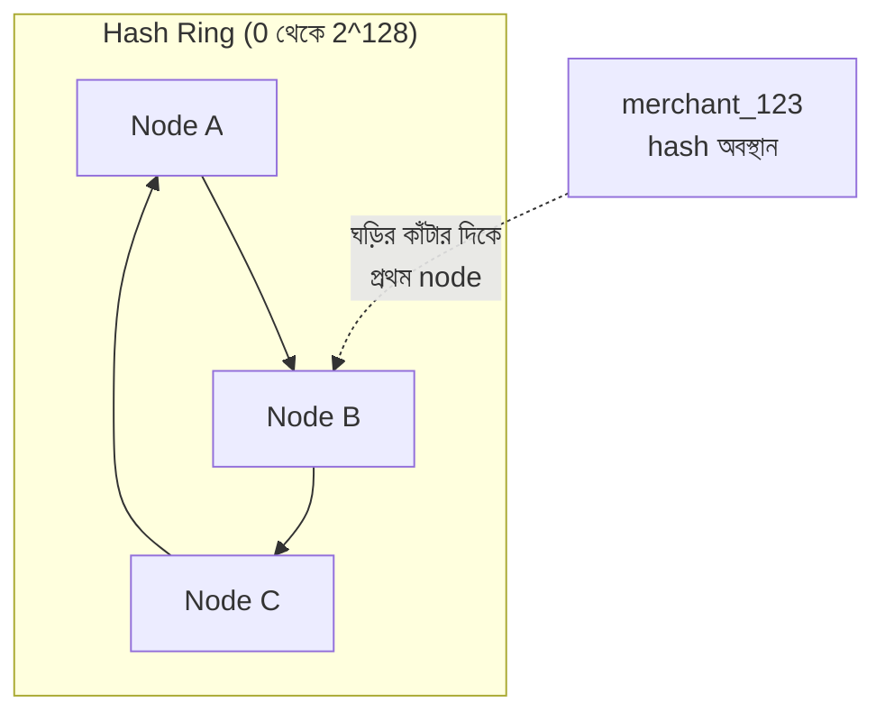

# Module 03 — DSA ও Complexity for Backend

> **Phase 0 — CS Foundation** | M10, M12, M29, M32-এ ব্যবহৃত কিন্তু কখনো
> from-scratch derive না করা data structure-গুলোর এখানে সম্পূর্ণ ভিত্তি।
> পরের module: M04 (Advanced Python Internals)

---

## ১. যে "consistent hashing" শব্দটা M08-M12-এ বারবার এসেছে, কিন্তু কখনো ব্যাখ্যা হয়নি

M02 §৭-এ আমরা "consistent hashing" উল্লেখ করেছিলাম L4 load balancer-এর প্রেক্ষাপটে। M08 §৫.২-এ, sharding আলোচনায়, আমরা hash-based partition key নিয়ে কথা বলেছিলাম। M12 §৭.২-এ, Kafka-র hot partition সমস্যায়, আবার এই ধারণা ফিরে এসেছিল। প্রতিবার আমরা concept-টা ব্যবহার করেছি — "hash দিয়ে data distribute করা" — কিন্তু কখনো ব্যাখ্যা করিনি **কেন** সাধারণ `hash(key) % N` যথেষ্ট না, এবং "consistent" শব্দটা আসলে কী সমস্যা সমাধান করে।

একটা concrete দৃশ্যকল্প দিয়ে বোঝা যাক। M08-এর payment platform ৪টা shard-এ ডেটা বিভক্ত করেছে, `shard = hash(merchant_id) % 4` দিয়ে। একদিন, traffic বৃদ্ধির কারণে, টিম ৫ম shard যোগ করল — এখন `shard = hash(merchant_id) % 5`। **প্রতিটা merchant-এর জন্য এই সূত্রের ফলাফল সম্পূর্ণ বদলে গেল** (`% 4` আর `% 5` প্রায় সবসময় ভিন্ন উত্তর দেয়, এমনকি একই hash value-তেও) — মানে প্রায় **সব** merchant-এর ডেটা ভুল shard-এ "আছে" নতুন সূত্র অনুযায়ী, যদিও তারা কোথাও সরেনি। একটা single node যোগ করায় প্রায় ১০০% ডেটা রি-শাফল করতে হলো।

এই সমস্যাটার নাম **rehashing catastrophe**, এবং এটাই সেই কারণ যা "consistent hashing" ধারণাটাকে জন্ম দিয়েছে — একটা hashing scheme যেখানে node যোগ/অপসারণে **শুধু একটা ছোট fraction** ডেটা রিলোকেট করতে হয়, প্রায় সবকিছু না। এই module-এ আমরা এটা from scratch build করব, সাথে M10-এর Bloom filter, LRU cache, আর M29-এর Merkle tree-ও — যেগুলো আমরা এতদিন ব্যবহার করেছি, কিন্তু ভেতরে কীভাবে কাজ করে তা কখনো দেখিনি।

---

## ২. Hash Map Internals — M07-এর Index আলোচনার একটা Complementary Data Structure

### ২.১ কীভাবে কাজ করে

```python
# Python dict-এর সরলীকৃত mental model
class SimpleHashMap:
    def __init__(self, size=16):
        self.buckets = [[] for _ in range(size)]   # প্রতিটা bucket একটা list (chaining)
        self.size = size

    def put(self, key, value):
        idx = hash(key) % self.size
        bucket = self.buckets[idx]
        for i, (k, v) in enumerate(bucket):
            if k == key:
                bucket[i] = (key, value)   # আপডেট
                return
        bucket.append((key, value))   # নতুন

    def get(self, key):
        idx = hash(key) % self.size
        for k, v in self.buckets[idx]:
            if k == key:
                return v
        raise KeyError(key)
```

**গড় complexity O(1), কিন্তু worst case O(n):** যদি hash function খারাপ হয় (অনেক key একই bucket-এ পড়ে, "collision"), lookup একটা linked list scan-এ পরিণত হয় — O(n)। এটাই M07 §৬.৩-এর "estimate vs actual rows"-এর একটা data-structure-level সমান্তরাল — theoretical complexity বনাম বাস্তব performance data distribution-এর উপর নির্ভর করে।

### ২.২ Collision Handling — দুইটা কৌশল

```
Chaining (উপরের উদাহরণ): প্রতিটা bucket একটা list/tree — M07-এর
  B-Tree-তে duplicate key handling-এর ধারণাগত সমতুল্য

Open addressing: collision হলে পরের খালি slot খোঁজা (linear probing,
  double hashing) — memory-efficient কিন্তু delete জটিল
```

**M07 §৪.১-এর index bloat-এর একটা hash-table সমান্তরাল:** hash table-এ load factor (কতটা ভরা) বেশি হলে collision বাড়ে, performance ক্রমশ O(1) থেকে সরে যায় — এই কারণেই Python dict (এবং বেশিরভাগ hash table implementation) load factor একটা threshold (~২/৩) ছাড়ালে **resize** করে (M07-এর VACUUM-এর ধারণাগত সমান্তরাল, periodic maintenance)।

> **Senior Tip:** "কখন dict-এর বদলে একটা database index ব্যবহার করবেন?" — "M09-এর polyglot persistence নীতির data-structure সংস্করণ — dict/hash map in-memory, single-process, এবং কোনো persistence/query-flexibility নেই (শুধু exact key match, M07-এর range query/`ORDER BY` অসম্ভব)। যখনই persistence, multi-process access, বা range query প্রয়োজন, M07-এর B-Tree index-ই সঠিক টুল — hash map শুধু in-memory, single-process caching-এ (M10-এর local cache) উপযুক্ত।"

---

## ৩. Heap ও Priority Queue — M11-এর Task Priority-র প্রকৃত ভিত্তি

### ৩.১ Binary Heap — একটা Array-Backed Tree

```python
import heapq

# M11 §৯.৩-এর "priority queue" ধারণার প্রকৃত ভিত্তি — M13-এর RabbitMQ
# priority queue বা M11-এর task priority-র নিচে এই একই structure
tasks = []
heapq.heappush(tasks, (1, "send_otp"))       # priority 1 (উচ্চ)
heapq.heappush(tasks, (9, "send_marketing"))  # priority 9 (নিম্ন)
heapq.heappush(tasks, (1, "charge_payment"))

priority, task = heapq.heappop(tasks)   # সবচেয়ে কম priority number আগে —
                                          # O(log n), শুধু min খুঁজতে
```

**Complexity:** insert O(log n), min-extract O(log n), peek-min O(1) — M07-এর B-Tree-র মতোই একটা logarithmic-height structure, কিন্তু শুধু "সবচেয়ে ছোট/বড়" দ্রুত বের করার জন্য optimized, arbitrary key lookup-এর জন্য না (সেটার জন্য §২-এর hash map)।

**M13-এর RabbitMQ priority queue-র প্রকৃত ভিত্তি:** M13 §৯-এ যে message priority দেখেছিলাম, ভেতরে-ভেতরে RabbitMQ broker একটা priority queue (heap-based বা সাদৃশ্যপূর্ণ structure) ব্যবহার করে নিশ্চিত করতে উচ্চ-priority message নিম্ন-priority-র আগে deliver হয়, insertion order নির্বিশেষে।

---

## ৪. Trie — M06-এর Autocomplete/Prefix Matching-এর ভিত্তি

```python
class TrieNode:
    def __init__(self):
        self.children = {}
        self.is_end = False

class Trie:
    """M07 §৫.১-এর leftmost-prefix index নীতির একটা in-memory,
    string-নির্দিষ্ট সমতুল্য — 'merch' দিয়ে শুরু হওয়া সব merchant name
    দ্রুত খোঁজা"""
    def __init__(self):
        self.root = TrieNode()

    def insert(self, word):
        node = self.root
        for char in word:
            node = node.children.setdefault(char, TrieNode())
        node.is_end = True

    def starts_with(self, prefix) -> bool:
        node = self.root
        for char in prefix:
            if char not in node.children:
                return False
            node = node.children[char]
        return True   # O(len(prefix)), string-এর length-এর উপর নির্ভর,
                       # dataset-এর আকারের উপর না — এটাই trie-র মূল সুবিধা
```

**M07-এর B-Tree leftmost-prefix নীতির (M07 §৫.১) একটা in-memory বিশেষায়িত সংস্করণ:** trie prefix-matching-এ B-Tree-র চেয়েও efficient হতে পারে কারণ lookup সময় **query string-এর length**-এর উপর নির্ভর করে, dataset-এর আকারের উপর না — একটা autocomplete feature-এ (M31-এর merchant search-এর মতো) এটা M07-এর GIN index-এর একটা বিকল্প, ছোট-স্কেল, in-memory ব্যবহারে।

---

## ৫. Skip List — M10-এর Redis Sorted Set-এর প্রকৃত ভিত্তি

```
Sorted linked list-এ search O(n) — প্রতিটা node চেক করতে হয়।
Skip list একাধিক "level"-এর linked list রাখে — উপরের level-গুলো
node "স্কিপ" করে দ্রুত এগোয়, তারপর নিচের level-এ নেমে সূক্ষ্মভাবে খোঁজে

    Level 2: 1 -----------> 9 --------> 21
    Level 1: 1 ----> 5 ---> 9 ---> 15 -> 21
    Level 0: 1 -> 3 -> 5 -> 7 -> 9 -> 15 -> 18 -> 21

Average complexity: O(log n) — B-Tree-র সমতুল্য, কিন্তু implementation
                      অনেক সরল (M07-এর B-Tree-র rebalancing জটিলতা ছাড়াই)
```

**M10-এর Redis Sorted Set (`ZADD`, leaderboard, M10 §১১-এর Streams-এর ordering)-এর প্রকৃত ভিত্তি:** Redis-এর `ZSET` internally একটা skip list (ছোট set-এ listpack, M10 §২.২-এর encoding নীতি) ব্যবহার করে score-অনুযায়ী sorted রাখতে এবং O(log n)-এ insert/range-query করতে — এটাই M10-এ আমরা যে leaderboard/M27-এর chat message ordering pattern উল্লেখ করেছিলাম তার প্রকৃত data-structure ভিত্তি।

---

## ৬. Bloom Filter — M10 §৯-এর সম্পূর্ণ From-Scratch Derivation

M10 §৯-এ আমরা Bloom filter ব্যবহার করেছিলাম (`redis_client.bf().add()`) কিন্তু কখনো এর ভেতরের algorithm দেখাইনি। এখন সেটা সম্পূর্ণ করা যাক।

```python
import hashlib

class BloomFilter:
    """M10 §৯-এর 'false positive সম্ভব, false negative কখনো না' দাবির
    প্রকৃত গাণিতিক ভিত্তি"""

    def __init__(self, size=10000, num_hashes=3):
        self.size = size
        self.num_hashes = num_hashes
        self.bit_array = [0] * size   # ⚠️ শুধু bit, actual data কখনো store হয় না —
                                        # এটাই extreme memory efficiency-র উৎস

    def _hashes(self, item):
        # ⚠️ একটা item-কে num_hashes সংখ্যক ভিন্ন bit position-এ ম্যাপ করা
        for i in range(self.num_hashes):
            digest = hashlib.sha256(f"{item}{i}".encode()).hexdigest()
            yield int(digest, 16) % self.size

    def add(self, item):
        for pos in self._hashes(item):
            self.bit_array[pos] = 1

    def might_contain(self, item) -> bool:
        # ⚠️ যদি ANY bit position 0 থাকে, item নিশ্চিতভাবে যোগ হয়নি
        #    (false negative অসম্ভব)
        # যদি সব bit 1 থাকে, item সম্ভবত যোগ হয়েছে — কিন্তু অন্য item-দের
        #    hash collision-এর কারণে সব bit 1 হয়ে গেছে হতে পারে
        #    (false positive সম্ভব)
        return all(self.bit_array[pos] for pos in self._hashes(item))
```

**M10 §৯-এর দাবির গাণিতিক ব্যাখ্যা:**

```
যখন add() কল হয়, num_hashes সংখ্যক bit position 1 করা হয়।
যখন might_contain() কল হয়, একই position-গুলো check করা হয়।

যদি item সত্যিই add হয়ে থাকে: সব position অবশ্যই 1 হবে (আমরা নিজেরাই
  set করেছিলাম) → always true → false negative কখনো সম্ভব না

যদি item add হয়নি: position-গুলো হয়তো অন্য item-দের কারণে 1 হয়ে
  গেছে (hash collision, বিশেষত bit array ভরে গেলে) → হয়তো ভুলভাবে
  true বলবে → false positive সম্ভব, যত বেশি item add হয় (bit array
  যত বেশি ভরে) false positive rate তত বাড়ে
```

**M09 §২.২-এর LSM Tree আলোচনার সম্পূর্ণ প্রেক্ষাপট:** M09-এ আমরা বলেছিলাম LSM Tree-based সিস্টেম (Cassandra) Bloom filter দিয়ে "এই SSTable-এ key নেই" দ্রুত নিশ্চিত করে disk I/O এড়াতে — এখন আমরা জানি **কেন এটা নিরাপদ**: Bloom filter কখনো false negative দেয় না (উপরের প্রমাণ), তাই "নেই" উত্তর সবসময় বিশ্বাসযোগ্য, disk-এ গিয়ে verify করার প্রয়োজন নেই। শুধু "আছে" উত্তরে (M31-এর idempotency check-এর মতো) actual verification প্রয়োজন, কারণ সেটা false positive হতে পারে।

---

## ৭. Consistent Hashing — §১-এর ঘটনার সম্পূর্ণ সমাধান

### ৭.১ Hash Ring — মূল ধারণা

```python
import bisect, hashlib

class ConsistentHashRing:
    """M08 §৫-এর sharding, M12 §৭-এর partition key সমস্যার সমাধান —
    node যোগ/অপসারণে শুধু ছোট একটা fraction data রিলোকেট করতে হয়"""

    def __init__(self, nodes=None, virtual_nodes=150):
        self.virtual_nodes = virtual_nodes   # নিচে §৭.৩-এ ব্যাখ্যা
        self.ring = {}          # hash position → node
        self.sorted_positions = []
        for node in (nodes or []):
            self.add_node(node)

    def _hash(self, key):
        return int(hashlib.md5(key.encode()).hexdigest(), 16)

    def add_node(self, node):
        for i in range(self.virtual_nodes):
            position = self._hash(f"{node}:{i}")
            self.ring[position] = node
            bisect.insort(self.sorted_positions, position)

    def remove_node(self, node):
        for i in range(self.virtual_nodes):
            position = self._hash(f"{node}:{i}")
            del self.ring[position]
            self.sorted_positions.remove(position)

    def get_node(self, key):
        if not self.ring:
            return None
        position = self._hash(key)
        # ⚠️ key-র position থেকে ring-এ ঘড়ির কাঁটার দিকে প্রথম node খোঁজা
        idx = bisect.bisect(self.sorted_positions, position) % len(self.sorted_positions)
        return self.ring[self.sorted_positions[idx]]
```

### ৭.২ কেন এটা §১-এর সমস্যা সমাধান করে



**মূল অন্তর্দৃষ্টি:** সাধারণ `hash(key) % N`-এ, `N` বদলালে (node যোগ/বাদ) **প্রায় প্রতিটা key**-র ফলাফল বদলে যায় (§১-এর ঘটনা)। Consistent hashing-এ, node-রা নিজেই ring-এর একটা position-এ বসে (§৭.১-এর `add_node`), আর একটা key তার hash position থেকে **ঘড়ির কাঁটার দিকে প্রথম node**-এ যায়। একটা নতুন node যোগ হলে, শুধু সেই **নতুন node আর তার ঠিক পূর্ববর্তী node-এর মাঝের** key-গুলো প্রভাবিত হয় — বাকি সব key অপরিবর্তিত থাকে, কারণ তাদের "ঘড়ির কাঁটার দিকে প্রথম node" বদলায়নি।

```
গাণিতিক ফলাফল: N নোডের একটা ring-এ, একটা নোড যোগ/অপসারণে গড়ে
                শুধু 1/N অংশ key রিলোকেট হয় — ৫টা shard-এ নতুন একটা
                যোগ করলে ~২০% key সরবে, ১০০% না (§১-এর ঘটনার বিপরীত)
```

### ৭.৩ Virtual Node — Load Distribution সমস্যার সমাধান

```
সমস্যা: শুধু কয়েকটা physical node সরাসরি ring-এ বসালে, তাদের মধ্যে
        distance অসম হতে পারে (একটা node দৈবক্রমে অনেক বড় একটা
        "arc" পেয়ে যেতে পারে, M12 §৭.২-এর hot partition সমস্যার
        ধারণাগত সমতুল্য)

সমাধান: প্রতিটা physical node-কে অনেকগুলো (M03-এর কোডে ১৫০টা)
         "virtual node" হিসেবে ring-এ ছড়িয়ে দেওয়া — এতে load
         পরিসংখ্যানগতভাবে সমানভাবে বিতরণ হয় (law of large numbers-এর
         ধারণাগত প্রয়োগ), কোনো একটা physical node অসমভাবে বেশি
         key না পায়
```

> **Senior Tip:** "M08-এর sharding-এ কীভাবে node যোগ করবেন downtime ছাড়া?" — "M03 §৭-এর consistent hashing ব্যবহার করলে, নতুন node যোগ করার পর শুধু সেই node-এর 'দায়িত্বে থাকা' key-গুলো migrate করতে হয় (M08-এর expand-contract-এর মতো একটা incremental প্রক্রিয়া) — পুরনো node-গুলো তাদের বেশিরভাগ key-তে অপরিবর্তিত থাকে, তাই migration-এর সময় read/write সেই key-গুলোর জন্য স্বাভাবিকভাবে চলতে পারে। এটাই M12-এর Kafka partition বৃদ্ধির চেয়ে ভিন্ন এবং আরও graceful একটা rebalancing কৌশল, যদিও উভয়ই একই মূল সমস্যা (partition key বদলালে ordering/data-location সমস্যা) সমাধান করে।"

---

## ৮. LRU ও LFU Cache — M10-এর Eviction Policy-র সম্পূর্ণ Implementation

### ৮.১ LRU — Hash Map + Doubly Linked List

```python
class LRUCache:
    """M10 §২.৩-এর 'allkeys-lru' eviction policy-র প্রকৃত implementation —
    O(1) get এবং put, hash map (§২) + doubly linked list-এর সমন্বয়ে"""

    class Node:
        def __init__(self, key, value):
            self.key, self.value = key, value
            self.prev = self.next = None

    def __init__(self, capacity):
        self.capacity = capacity
        self.cache = {}   # key → Node, O(1) lookup (§২-এর hash map)
        self.head = self.Node(0, 0)   # dummy head (most recently used দিকে)
        self.tail = self.Node(0, 0)   # dummy tail (least recently used দিকে)
        self.head.next = self.tail
        self.tail.prev = self.head

    def _remove(self, node):
        node.prev.next, node.next.prev = node.next, node.prev

    def _add_to_front(self, node):   # most-recently-used position
        node.next, node.prev = self.head.next, self.head
        self.head.next.prev = node
        self.head.next = node

    def get(self, key):
        if key not in self.cache:
            return -1
        node = self.cache[key]
        self._remove(node)
        self._add_to_front(node)   # ⚠️ access করা মানে "সাম্প্রতিক" হয়ে যাওয়া
        return node.value

    def put(self, key, value):
        if key in self.cache:
            self._remove(self.cache[key])
        node = self.Node(key, value)
        self.cache[key] = node
        self._add_to_front(node)
        if len(self.cache) > self.capacity:
            lru = self.tail.prev   # ⚠️ list-এর শেষে least-recently-used
            self._remove(lru)
            del self.cache[lru.key]
```

**M10 §২.৩-এর "allkeys-lru" নীতির সম্পূর্ণ প্রকৃত মেকানিজম:** hash map O(1) lookup দেয় (§২), doubly linked list O(1) reordering দেয় (M03-এর array-based structure-এর বিপরীতে, যেখানে middle-এ insert/delete O(n) হতো)। এই দুইটার সমন্বয়ই Redis-এর LRU eviction-কে O(1)-এ রাখে, প্রতিটা access-এ পুরো cache স্ক্যান না করে।

### ৮.২ LFU বনাম LRU — কখন কোনটা

```
LRU: "সাম্প্রতিক ব্যবহার" গুরুত্বপূর্ণ — M10-এর সাধারণ cache-এ ডিফল্ট
LFU: "কতবার ব্যবহার" গুরুত্বপূর্ণ — M10 §২.৩-এ উল্লেখিত "access pattern-এ
     hot/cold স্পষ্ট পার্থক্য থাকলে LRU-র চেয়ে ভালো"

উদাহরণ: একটা item যা ১০০০ বার access হয়েছে কিন্তু শেষ access ৫ মিনিট
আগে, বনাম একটা item যা মাত্র ১ বার access হয়েছে ১ সেকেন্ড আগে — LRU
দ্বিতীয়টা রাখবে (সাম্প্রতিক), LFU প্রথমটা রাখবে (বেশি ব্যবহৃত)। M31-এর
payment platform-এ merchant configuration data (কম কিন্তু নিয়মিত
access) LFU-তে ভালো থাকতে পারে, session data (recency-critical) LRU-তে
```

---

## ৯. Merkle Tree — M29-এর Blockchain আলোচনার সম্পূর্ণ ভিত্তি

```python
import hashlib

def merkle_root(items: list[str]) -> str:
    """M29-এ blockchain-এর transaction verification-এ ব্যবহৃত হয়,
    কিন্তু কখনো ব্যাখ্যা করা হয়নি কীভাবে কাজ করে"""
    if len(items) == 1:
        return hashlib.sha256(items[0].encode()).hexdigest()

    hashes = [hashlib.sha256(item.encode()).hexdigest() for item in items]
    while len(hashes) > 1:
        if len(hashes) % 2 == 1:
            hashes.append(hashes[-1])   # বিজোড় হলে শেষটা ডুপ্লিকেট
        hashes = [
            hashlib.sha256((hashes[i] + hashes[i+1]).encode()).hexdigest()
            for i in range(0, len(hashes), 2)
        ]
    return hashes[0]
```

**M29-এর blockchain block verification-এর প্রকৃত মেকানিজম:** একটা block-এর হাজার হাজার transaction-এর প্রতিটা আলাদাভাবে store/verify না করে, তাদের সব hash-কে একটা single "root hash"-এ কম্প্রেস করা হয় (pairwise hashing, log(n) level-এ)। **মূল সুবিধা** — যদি একটা single transaction পাল্টানো হয়, root hash সম্পূর্ণ ভিন্ন হয়ে যাবে (M28-এর "correctness enforce করুন যেখানে বাইপাস অসম্ভব" নীতির cryptographic সংস্করণ) — এবং একটা নির্দিষ্ট transaction "block-এ আছে" প্রমাণ করতে **পুরো block ডাউনলোড না করে**, শুধু একটা O(log n) "Merkle proof" (path-এর হ্যাশগুলো) যথেষ্ট।

**M07-এর index-এর সাথে একটা সাদৃশ্য এবং পার্থক্য:** M07-এর B-Tree index দ্রুত **lookup** দেয় (কোথায় খুঁজব)। Merkle tree দ্রুত **verification** দেয় (এই data অপরিবর্তিত আছে কি না) — সম্পূর্ণ ভিন্ন সমস্যা, কিন্তু একই "tree of hashes, logarithmic height" কৌশল প্রয়োগ করে।

---

## ১০. Geohash ও Quadtree — M32-এর Geo-Dispatch Archetype-এর সম্পূর্ণ ভিত্তি

M32-এর Archetype ৪-এ আমরা geohash উল্লেখ করেছিলাম "M07-এর leftmost-prefix index-এর geospatial সংস্করণ" হিসেবে। এখন সেটা derive করা যাক:

```python
def geohash_encode(lat, lon, precision=6):
    """M32-এর geo-dispatch archetype-এর মূল ভিত্তি — lat/lon-কে একটা
    string-এ রূপান্তর করা যেখানে কাছাকাছি অবস্থান একই prefix পায়"""
    lat_range, lon_range = [-90, 90], [-180, 180]
    geohash, bits, bit, ch = [], 0, 0, 0
    even = True
    base32 = "0123456789bcdefghjkmnpqrstuvwxyz"

    while len(geohash) < precision:
        if even:   # পালাক্রমে longitude/latitude bisect করা
            mid = sum(lon_range) / 2
            if lon > mid: ch |= (1 << (4 - bits)); lon_range[0] = mid
            else: lon_range[1] = mid
        else:
            mid = sum(lat_range) / 2
            if lat > mid: ch |= (1 << (4 - bits)); lat_range[0] = mid
            else: lat_range[1] = mid
        even = not even
        if bits < 4:
            bits += 1
        else:
            geohash.append(base32[ch])
            bits, ch = 0, 0
    return "".join(geohash)

# geohash_encode(23.8103, 90.4125) → "wh0r5n" (ঢাকার কাছাকাছি অবস্থান)
# geohash_encode(23.8105, 90.4128) → "wh0r5n" (একই prefix — কাছাকাছি!)
```

**M32-এর Archetype ৪-এর দাবির সম্পূর্ণ প্রমাণ:** geohash প্রতিটা bisection-এ lat/lon range-কে অর্ধেক করে (M07-এর B-Tree-র binary search-এর ধারণাগত সমতুল্য), আর একটা string-এ encode করে যেখানে **prefix মিল মানে ভৌগোলিক নৈকট্য** — M07 §৫.১-এর "leftmost prefix" index নীতি সরাসরি এই string-এ প্রযোজ্য হয়ে যায়, একটা normal B-Tree index দিয়েই efficient "কাছাকাছি driver খোঁজা" সম্ভব হয়, PostGIS-এর dedicated geospatial index ছাড়াও (ছোট স্কেলে)।

**Quadtree — বিকল্প পদ্ধতি:** ২D space-কে recursively চার ভাগে ভাগ করা (M03-এর trie-র ধারণাগত সমতুল্য, কিন্তু ২-dimensional) — geohash string-based, quadtree tree-based, উভয়ই একই সমস্যা (spatial locality) সমাধান করে ভিন্ন data structure দিয়ে।

---

## ১১. Big-O কখন মিথ্যা বলে — M07-এর Query Planner আলোচনার সম্পূর্ণ Complement

```
১. Cache locality: O(n) array scan প্রায়ই O(log n) linked-structure
   traversal-এর চেয়ে দ্রুত বাস্তবে, কারণ array-তে memory contiguous
   (CPU cache-friendly, M01-এর page/cache আলোচনার সরাসরি প্রয়োগ),
   linked structure-এ প্রতিটা node আলাদা memory location (cache miss)

২. Constant factor: দুইটা O(n log n) algorithm-এর মধ্যে ১০× পার্থক্য
   থাকতে পারে বাস্তব execution time-এ, constant factor-এর কারণে —
   M07-এর "cost estimate বনাম actual time" পার্থক্যের একটা algorithm-
   level সমতুল্য

৩. I/O-bound বনাম CPU-bound: M07-এর index scan "O(log n)" কিন্তু
   প্রতিটা ধাপ disk I/O হলে (M01 §৩.৩-এর major page fault), সেটা
   একটা in-memory O(n) scan-এর চেয়ে ধীর হতে পারে ছোট n-এ
```

> **Senior Tip:** "একটা O(n²) algorithm কি সবসময় O(n log n)-এর চেয়ে খারাপ?" — "না, ছোট n-এ প্রায়ই না — এটাই M31-এর 'order of magnitude, নিখুঁত সংখ্যা না' নীতির algorithm-level সংস্করণ। Insertion sort (O(n²)) ছোট array-তে (n < ~২০) প্রায়ই quicksort/mergesort (O(n log n))-এর চেয়ে দ্রুত, কারণ constant factor ছোট এবং cache locality ভালো (§১১-এর প্রথম পয়েন্ট) — এই কারণেই বেশিরভাগ production sorting library (Python-এর Timsort সহ) ছোট sub-array-তে insertion sort-এ switch করে। Big-O asymptotic behavior বলে (n অসীমের দিকে গেলে কী হয়), বাস্তব performance-এর সম্পূর্ণ ছবি না।"

---

## ১২. Interview Section

### প্রশ্ন ১ (Senior) — "Consistent hashing কী সমস্যা সমাধান করে, সাধারণ `hash % N` কেন যথেষ্ট না?"

**🌟 Senior/Staff Answer**
> "সাধারণ `hash(key) % N`-এ, `N` (node/shard সংখ্যা) বদলালে প্রায় প্রতিটা key-র জন্য ফলাফল বদলে যায় — `% 4` আর `% 5` প্রায় কখনো একই উত্তর দেয় না, এমনকি একই hash value-তেও। এর মানে একটা single node যোগ/অপসারণে প্রায় ১০০% ডেটা রি-শাফল করতে হয়, যেটা M08-এর একটা production sharding-এ ঘটলে বিপর্যয়কর (পুরো ডেটাসেট migrate করতে হবে, downtime বা massive resource ব্যবহার সহ)।
>
> Consistent hashing (M03 §৭) node-দের নিজেরাই একটা hash ring-এর position-এ রাখে, key-গুলো তাদের নিজস্ব hash position থেকে 'ঘড়ির কাঁটার দিকে প্রথম node'-এ যায়। একটা নতুন node যোগ হলে, শুধু সেই নতুন node আর তার পূর্ববর্তী node-এর মাঝের key-গুলো প্রভাবিত হয় — গড়ে `1/N` অংশ, `100%` না। Virtual node (একটা physical node-কে ring-এ অনেকগুলো position-এ প্রতিনিধিত্ব করা) load distribution আরও সমান করে।
>
> এটা M08-এর database sharding, M12-এর Kafka partition assignment, আর M02-এর load balancer routing — এই সবগুলোতে একই মূল সমস্যা (node সংখ্যা বদলালে minimal disruption) সমাধান করে।"

---

### প্রশ্ন ২ (Staff / Architecture) — "Bloom filter-এ false positive সম্ভব কিন্তু false negative না কেন? এই asymmetry কোথায় ব্যবহারিকভাবে গুরুত্বপূর্ণ?"

**🌟 Senior/Staff Answer**
> "Bloom filter একটা item-কে একাধিক bit position-এ ম্যাপ করে (M03 §৬-এর `_hashes` মেথড)। যখন আমরা `add()` করি, আমরা নিজেরাই সেই position-গুলো 1 করি — তাই যদি item সত্যিই add হয়ে থাকে, তার সব position **অবশ্যই** 1 থাকবে, এটা গ্যারান্টিড। কিন্তু যদি item add না হয়ে থাকে, তার position-গুলো **অন্য item-দের কারণে** ইতিমধ্যে 1 হয়ে যেতে পারে (hash collision) — তাই 'সব 1' দেখেও item সত্যিই add হয়েছে তা নিশ্চিত না, শুধু সম্ভাব্য।
>
> এই asymmetry-টা ব্যবহারিকভাবে অত্যন্ত মূল্যবান একটা নির্দিষ্ট প্যাটার্নে — যখন 'না' উত্তর নিয়ে কোনো সন্দেহ থাকা যাবে না, কিন্তু 'হ্যাঁ' উত্তরে আরেকবার (ব্যয়বহুল) verification করা গ্রহণযোগ্য। M09-এর LSM Tree-তে এটা সরাসরি প্রযোজ্য — 'এই SSTable-এ key নেই' বলাটা নিরাপদ (disk I/O এড়ানো যায়), কিন্তু 'আছে' বললে তবুও disk-এ গিয়ে actual data verify করতে হয়। M28-এর duplicate transaction detection-এও একই প্যাটার্ন — Bloom filter দিয়ে দ্রুত 'নিশ্চিতভাবে নতুন' case-গুলো ফিল্টার করা যায় (বেশিরভাগ ক্ষেত্রে), শুধু 'সম্ভাব্য duplicate' case-এ database-এ গিয়ে চূড়ান্ত সত্য যাচাই করতে হয় — চূড়ান্ত correctness guarantee সবসময় database constraint-এ থাকে (M07/M31-এর মূল নীতি), Bloom filter শুধু একটা fast-path optimization।"

---

### প্রশ্ন ৩ (Coding) — "একটা LRU cache implement করুন যেখানে get এবং put উভয়ই O(1)। কেন শুধু hash map বা শুধু linked list যথেষ্ট না?"

**🌟 Senior Answer**
> "শুধু hash map ব্যবহার করলে, 'least recently used কোনটা' জানতে (eviction-এর সময়) পুরো map iterate করতে হবে অথবা প্রতিটা access-এর timestamp আলাদাভাবে ট্র্যাক করতে হবে এবং eviction-এর সময় sort করতে হবে — উভয়ই O(n) বা তার বেশি, O(1) না।
>
> শুধু linked list ব্যবহার করলে (একটা key কোথায় আছে ট্র্যাক না করে), একটা নির্দিষ্ট key access করার সময় সেটা খুঁজে বের করতে (তারপর 'most recently used' অবস্থানে সরাতে) list scan করতে হবে — O(n)।
>
> সমাধান হলো দুইটা একসাথে ব্যবহার করা (M03 §৮.১-এর `LRUCache` implementation): hash map (`key → Node` reference) O(1) lookup দেয়, doubly linked list O(1) reordering দেয় (কারণ একটা node-এর `prev`/`next` reference থাকলে, সেটাকে list-এর যেকোনো জায়গা থেকে সরিয়ে সামনে আনা constant time-এ সম্ভব, list-এর বাকি অংশ না ছুঁয়ে)। এই সমন্বয়টাই Redis-এর LRU eviction policy-র (M10 §২.৩) প্রকৃত ভিত্তি, আর এটা একটা ক্লাসিক উদাহরণ কেন 'সঠিক data structure বাছাই' প্রায়ই একটামাত্র structure না, দুইটার সঠিক সমন্বয়।"

---

### প্রশ্ন ৪ (Architecture Decision) — "আমাদের M31-এর payment platform-এ merchant search feature-এ, একটা in-memory trie ব্যবহার করব নাকি M07-এর PostgreSQL GIN index?"

**🌟 Senior/Staff Answer**
> "এটা M09-এর polyglot persistence checklist-এর একটা data-structure-level প্রয়োগ, এবং আমার সিদ্ধান্ত নির্ভর করবে স্কেল আর persistence প্রয়োজনের উপর।
>
> Trie (M03 §৪) দ্রুত (query length-এর উপর নির্ভর, dataset আকারের উপর না), কিন্তু এটা **in-memory** — প্রতিটা application restart-এ পুনর্নির্মাণ করতে হবে (M07-এর persistent index-এর তুলনায় একটা বড় খরচ), আর multi-process/multi-pod environment-এ (M20-এর সাধারণ deployment) প্রতিটা pod-এর নিজস্ব আলাদা trie থাকবে, sync করা জটিল (M06 §৬-এর `LocMemCache` সমস্যার সমতুল্য একটা নতুন প্রকাশ)।
>
> M07-এর PostgreSQL GIN index persistent, multi-pod-consistent (M07-এর single source of truth), এবং M08-এর সব transaction/backup infrastructure দিয়ে সুরক্ষিত — কিন্তু trie-র চেয়ে সামান্য ধীর raw prefix-matching-এ (network round trip + query overhead, M02-এর latency table)।
>
> **আমার সুপারিশ:** M31-এর payment platform-এর স্কেলে (merchant সংখ্যা সাধারণত লক্ষাধিক না, কোটি না), M07-এর GIN index-ই যথেষ্ট এবং operationally অনেক সরল — M09-এর checklist অনুযায়ী নতুন in-memory data structure maintain করার (multi-pod sync সহ) জটিলতা এখানে justified না। Trie বিবেচনা করব শুধু যদি autocomplete latency measurably (M31-এর estimation নীতি) একটা critical UX বাধা হয়ে দাঁড়ায় GIN index দিয়ে, এবং তখনও, প্রথমে একটা dedicated caching layer (M10-এর Redis-এ precomputed suggestion, trie-র বদলে) বিবেচনা করব — সেটা M09-এর 'বিদ্যমান infrastructure দিয়ে সমাধান হয় কি না আগে দেখা' নীতির সাথে বেশি সাযুজ্যপূর্ণ।"

---

## ১৩. হাতে-কলমে অনুশীলন

**১ — Consistent hashing-এর rebalancing পরিমাপ করুন (৩০ মিনিট)**
M03 §৭.১-এর `ConsistentHashRing` ব্যবহার করে ১০,০০০টা key ৪টা node-এ বিতরণ করুন। একটা ৫ম node যোগ করে, কতগুলো key node বদলেছে গণনা করুন। তারপর সাধারণ `hash(key) % N` দিয়ে একই পরীক্ষা করে পার্থক্য দেখুন।

**২ — Bloom filter false positive rate পরিমাপ করুন (২৫ মিনিট)**
M03 §৬-এর `BloomFilter` ব্যবহার করে ১,০০০টা item add করুন একটা ১০,০০০-bit array-তে। ১,০০০টা ভিন্ন (add না করা) item দিয়ে `might_contain()` চেক করে false positive rate গণনা করুন। `bit_array` size কমিয়ে/বাড়িয়ে rate-এর পরিবর্তন দেখুন।

**৩ — LRU cache টেস্ট করুন (২৫ মিনিট)**
M03 §৮.১-এর `LRUCache` ব্যবহার করে capacity=৩ দিয়ে একটা sequence of get/put চালান, প্রতিটা ধাপে eviction কোনটা হচ্ছে ম্যানুয়ালি ট্রেস করে verify করুন।

**৪ — Geohash prefix matching verify করুন (২০ মিনিট)**
M03 §১০-এর `geohash_encode` দিয়ে ৫টা কাছাকাছি অবস্থান (একই শহরের ভিন্ন এলাকা) আর ২টা দূরবর্তী অবস্থান encode করুন। Prefix মিল pattern verify করুন।

---

## ১৪. মূল কথা

1. **Hash map গড়ে O(1), কিন্তু collision-এ O(n)** — M07-এর "estimate বনাম actual" নীতির একটা data-structure সমতুল্য।
2. **Heap O(log n) insert/extract-min দেয়** — M11/M13-এর priority queue-র প্রকৃত ভিত্তি।
3. **Trie query-length-নির্ভর lookup দেয়**, dataset-size-নির্ভর না — prefix matching-এ বিশেষভাবে efficient, কিন্তু in-memory এবং multi-pod sync জটিল।
4. **Skip list M10-এর Redis Sorted Set-এর প্রকৃত ভিত্তি** — B-Tree-র সরল বিকল্প, একই O(log n) guarantee।
5. **Bloom filter false negative কখনো না দেয়, false positive সম্ভব** — এই asymmetry-ই "fast-path 'না' filter" প্যাটার্নের গাণিতিক ভিত্তি (M09, M28)।
6. **Consistent hashing rehashing catastrophe সমাধান করে** — node যোগ/অপসারণে `1/N` fraction key move, `100%` না। Virtual node দিয়ে load সমান করা।
7. **LRU cache O(1) get/put পায় hash map + doubly linked list-এর সমন্বয়ে** — একটা একা যথেষ্ট না।
8. **Merkle tree O(log n) verification দেয়**, পুরো dataset compare না করে — M29-এর blockchain-এর প্রকৃত ভিত্তি।
9. **Geohash prefix-similarity = geographic proximity** — M07-এর B-Tree leftmost-prefix নীতি geospatial domain-এ প্রয়োগযোগ্য করে তোলে।
10. **Big-O asymptotic, বাস্তব performance না** — cache locality, constant factor, I/O-bound বনাম CPU-bound সবসময় বিবেচনা করতে হবে, M07-এর query planner আলোচনার মতোই।

---

## পরের Module

M01 এবং M03 দিয়ে Phase 0 (CS Foundation) সম্পূর্ণ হলো — M02-এর Networking-এর সাথে একসাথে এখন পুরো ভিত্তি প্রস্তুত। **M04 — Advanced Python Internals**-এ ফিরে গেলে, এখন M01-এর process/thread/context-switch জ্ঞান এবং M03-এর data structure জ্ঞান নিয়ে GIL, memory management, আর asyncio আলোচনাগুলো আরও গভীরভাবে অর্থবহ হবে — বিশেষত M01 §৪-এর epoll আলোচনা M04-এর event loop-কে সম্পূর্ণ করে তোলে, যা প্রথমবার পড়ার সময় একটা "black box" হিসেবে গ্রহণ করতে হয়েছিল।
