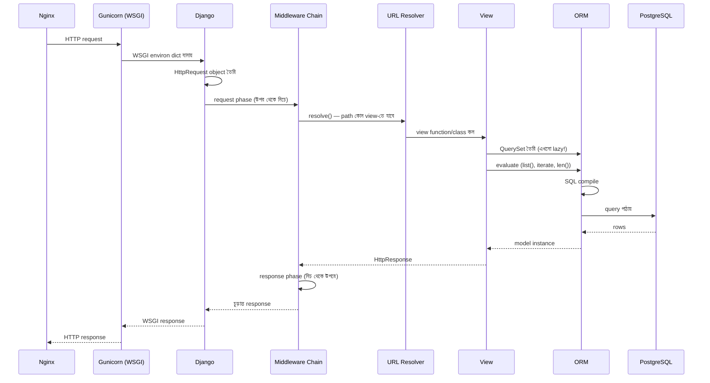
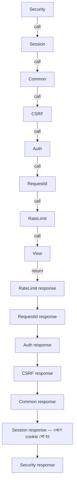

# Module 05 — Django Internals

> **Phase B** | পূর্বশর্ত: M04 (Advanced Python Internals)
> পরের module: M06 (DRF at Scale)

---

## ১. যে bug-টা `Meta.ordering`-এ লুকিয়ে ছিল

M04-এর শেষে একটা লাইনে সতর্ক করেছিলাম: `.order_by()` ছাড়া aggregate query-তে `Meta.ordering` চুপচাপ ফলাফল ভেঙে দিতে পারে। এখানে পুরো ঘটনাটা।

```python
class Payment(models.Model):
    merchant = models.ForeignKey(Merchant, on_delete=models.PROTECT)
    amount_minor = models.BigIntegerField()
    created_at = models.DateTimeField(auto_now_add=True)

    class Meta:
        ordering = ["-created_at"]     # নিরীহ দেখতে, admin-এ সুন্দর দেখানোর জন্য
```

একজন engineer merchant-প্রতি দৈনিক total বের করার query লিখল:

```python
from django.db.models import Sum
from django.db.models.functions import TruncDate

totals = (Payment.objects
    .values("merchant_id")
    .annotate(day=TruncDate("created_at"))
    .annotate(total=Sum("amount_minor")))
```

Staging-এ ঠিকঠাক কাজ করল — ২০টা merchant, ফলাফল যা আশা করা তাই। Production-এ deploy করার পর dashboard-এ merchant-প্রতি total ভুল, আর row সংখ্যা প্রত্যাশার চেয়ে **অনেক বেশি**।

কারণ: `Meta.ordering = ["-created_at"]` থাকলে Django স্বয়ংক্রিয়ভাবে `GROUP BY`-তে `created_at`**-ও যোগ করে দেয়** (কারণ `ORDER BY`-র column `SELECT`-এ থাকতে হয়, আর PostgreSQL-এ `GROUP BY`-র সাথে সঙ্গতিপূর্ণ হতে হয়)। ফলে group হচ্ছিল `(merchant_id, day, created_at)` দিয়ে — প্রতিটা আলাদা timestamp আলাদা group! Aggregate কার্যত কোনো কাজই করছিল না।

**সমাধান:**

```python
totals = (Payment.objects
    .values("merchant_id")
    .annotate(day=TruncDate("created_at"))
    .annotate(total=Sum("amount_minor"))
    .order_by())            # ← model-এর Meta.ordering বাতিল করে
```

এই একটা bug — যেটা staging-এ ধরা পড়েনি কারণ ডেটা কম ছিল — বুঝিয়ে দেয় কেন **"Django ORM জানি" আর "Django ORM কীভাবে SQL বানায় তা জানি" সম্পূর্ণ আলাদা দক্ষতা।** এই module-টা দ্বিতীয়টার জন্য।

---

## ২. পূর্ণ Request Lifecycle



### WSGI বনাম ASGI — মূল পার্থক্য

```python
# WSGI — synchronous, একটা callable
def application(environ, start_response):
    start_response("200 OK", [("Content-Type", "text/plain")])
    return [b"Hello"]

# ASGI — asynchronous, তিনটা callable (connect/receive/send)
async def application(scope, receive, send):
    await send({"type": "http.response.start", "status": 200, ...})
    await send({"type": "http.response.body", "body": b"Hello"})
```

Gunicorn `sync`/`gthread` worker WSGI বোঝে। `UvicornWorker` ASGI বোঝে। Django 3.0+ থেকে `asgi.py` স্বয়ংক্রিয় জেনারেট হয়, কিন্তু **sync view চালালে Django নিজেই thread pool-এ পাঠিয়ে ASGI-কে WSGI-এর মতো ব্যবহার করে** — M04-এর `sync_to_async` যেভাবে কাজ করে, প্রায় সেভাবে।

---

## ৩. Middleware — একটা পেঁয়াজের মতো Chain

```python
MIDDLEWARE = [
    "django.middleware.security.SecurityMiddleware",
    "django.contrib.sessions.middleware.SessionMiddleware",
    "django.middleware.common.CommonMiddleware",
    "django.middleware.csrf.CsrfViewMiddleware",
    "django.contrib.auth.middleware.AuthenticationMiddleware",
    "myapp.middleware.RequestIdMiddleware",       # ← আমাদের নিজের
    "myapp.middleware.RateLimitMiddleware",
]
```

Django স্টার্টআপে পুরো chain-টাকে **একটাই nested function** হিসেবে compile করে — request-প্রতি loop চলে না, কারণ chain টা closures দিয়ে আগেই বানানো।



**নিয়ম: request phase উপর থেকে নিচে, response phase নিচ থেকে উপরে।** এই কারণেই `SessionMiddleware` তালিকার শুরুর দিকে — request-এ সবার আগে session লোড করতে হয়, কিন্তু response-এ **সবার শেষে** cookie সেট করতে হয় (যাতে পরের middleware-গুলো session data পরিবর্তন করার সুযোগ পায়)।

### Production-grade custom middleware

```python
# middleware.py
import time, uuid, logging
from django.db import connection

logger = logging.getLogger("request")

class RequestIdMiddleware:
    def __init__(self, get_response):
        self.get_response = get_response      # চেইনের পরের অংশ

    def __call__(self, request):
        request.id = request.headers.get("X-Request-Id", str(uuid.uuid4()))
        start = time.perf_counter()

        response = self.get_response(request)  # ← পুরো বাকি chain + view এখানে চলে

        elapsed_ms = (time.perf_counter() - start) * 1000
        response["X-Request-Id"] = request.id
        logger.info("request_completed", extra={
            "request_id": request.id,
            "path": request.path,
            "status": response.status_code,
            "duration_ms": round(elapsed_ms, 1),
            "query_count": len(connection.queries) if settings.DEBUG else None,
        })
        return response

    # ব্যতিক্রম হুক — শুধু view-তে uncaught exception হলে চলে
    def process_exception(self, request, exception):
        logger.error("unhandled_exception", extra={
            "request_id": getattr(request, "id", None),
        }, exc_info=exception)
        return None   # None মানে — Django-র ডিফল্ট handler-কে চলতে দাও
```

**তিনটা জিনিস যা interview-এ বলার মতো:**

1. `__init__` **একবার**, app startup-এ চলে। এখানে ভারী initialization রাখলে সেটা প্রতি worker-এ একবারই হয় — request-প্রতি না।
2. `self.get_response(request)`-এর **আগের কোড** request phase, **পরের কোড** response phase। এই একটা function-এর মধ্যেই দুই phase লেখা যায় — Django ১.১০-এর আগে `process_request`/`process_response` আলাদা মেথড লাগত।
3. `process_exception` **শুধু view-তে exception হলে** চলে, middleware-এর নিজের exception-এ না। এটা একটা সাধারণ ভুল বোঝাবুঝি।

### Order যেখানে ভুল করলে security bug হয়

```python
# ❌ ভুল ক্রম — RateLimit-এর আগে Auth নেই
MIDDLEWARE = [
    "myapp.middleware.RateLimitMiddleware",   # user কে, তা জানার আগেই rate limit
    "django.contrib.auth.middleware.AuthenticationMiddleware",
]
# ফল: authenticated user আর anonymous — সবাই একই bucket-এ, IP-ভিত্তিক rate limit
# একজন premium user শেয়ার্ড office IP-তে অন্য সবার quota খেয়ে ফেলবে
```

> **Common Mistake:** `GZipMiddleware` তালিকার শুরুর দিকে রাখা। এটা **BREACH attack**-এর জন্য ঝুঁকিপূর্ণ যদি response-এ secret (CSRF token) আর user-controlled input একসাথে compress হয়। Django doc নিজেই সতর্ক করে — `SessionMiddleware`-এর আগে না রাখতে।

---

## ৪. URL Resolver — কীভাবে path একটা view খুঁজে পায়

```python
urlpatterns = [
    path("api/v1/payments/<uuid:pk>/", PaymentDetailView.as_view()),
]
```

Django `urlpatterns`-কে একটা **regex tree**-তে compile করে (`<uuid:pk>` আসলে `(?P<pk>[0-9a-f]{8}-...)`)। প্রতিটা request-এ **linear scan** হয় — উপর থেকে নিচে প্রথম match।

```
১০,০০০ URL pattern থাকলে, সবচেয়ে শেষেরটার জন্য গড়ে ৫,০০০টা regex চেষ্টা হবে।
```

**বাস্তব প্রভাব:** URL count বড় (মাইক্রোসার্ভিস-না-হওয়া মনোলিথ, বহু app) হলে routing নিজেই কয়েক ms নিতে পারে। সমাধান: সবচেয়ে বেশি hit হওয়া pattern উপরে রাখা, `include()` দিয়ে namespace ভাগ করা (prefix মিলে গেলে বাকি sub-tree স্কিপ করা যায়)।

```python
# include() দিয়ে prefix-based short-circuit
urlpatterns = [
    path("api/v1/payments/", include("payments.urls")),  # prefix না মিললে ভেতরে যাবে না
    path("api/v1/merchants/", include("merchants.urls")),
]
```

---

## ৫. ORM Internals — QuerySet থেকে SQL পর্যন্ত

### ৫.১ Lazy Evaluation — মূল ধারণা

```python
qs = Payment.objects.filter(status="succeeded")   # ← কোনো query হয়নি
qs = qs.filter(amount_minor__gt=100000)            # ← এখনো না
qs = qs.order_by("-created_at")                    # ← এখনো না

for p in qs:                                        # ← এখন! Query চলে
    print(p.amount_minor)
```

QuerySet একটা **builder**। প্রতিটা `.filter()`/`.exclude()`/`.order_by()` নতুন QuerySet ফেরত দেয় (immutable — মূলটা বদলায় না), যেটা একটা `Query` object-এ শর্ত জমা করে। শুধু এই সাতটা মুহূর্তে আসল query চলে:

```
iterate (for), list(), len(), bool(), repr(), .exists(), .count()
নির্দিষ্ট index/slice access, pickle
```

### ৫.২ QuerySet Cache — সবচেয়ে বেশি ভুল বোঝা জায়গা

```python
qs = Payment.objects.filter(status="succeeded")
list(qs)     # query #1 — ফলাফল qs._result_cache-এ জমা হয়
list(qs)     # cache থেকে — কোনো নতুন query না
qs[5]        # cache থেকে, কারণ পুরো result_cache আছে

qs2 = Payment.objects.filter(status="succeeded")
qs2[5]       # ⚠️ নতুন QuerySet, cache নেই — LIMIT/OFFSET query চলে
list(qs2)    # ⚠️ আবার সম্পূর্ণ query চলে! Slice cache invalidate করে না
```

> **Common Mistake:** একই QuerySet variable দুইবার ব্যবহার না করে বারবার নতুন filter chain লেখা — প্রতিবার নতুন query। Template-এ `` তারপর `` — দুইটাই আলাদা evaluation যদি `payments` একটা fresh QuerySet হয় প্রতিবার (view-তে সাবধান থাকুন, cache করা variable pass করুন)।

### ৫.৩ ORM → SQL: `select_related` বনাম `prefetch_related`

**উদাহরণ ১ — `select_related` (ForeignKey/OneToOne, JOIN)**

```python
payments = Payment.objects.select_related("merchant").filter(status="succeeded")[:10]
```

**জেনারেটেড SQL:**
```sql
SELECT
    payment.id, payment.amount_minor, payment.status, payment.merchant_id,
    merchant.id, merchant.name, merchant.tier
FROM payment
INNER JOIN merchant ON payment.merchant_id = merchant.id
WHERE payment.status = 'succeeded'
LIMIT 10;
```

**কেন দ্রুত:** একটা query, একটা round trip। Index থাকলে (`merchant.id` PK, `payment.merchant_id`-তে FK index) এটা efficient nested loop join।

**Execution plan (`EXPLAIN ANALYZE`):**
```
Limit (cost=0.85..12.34 rows=10)
  -> Nested Loop
       -> Index Scan using idx_payment_status on payment
       -> Index Scan using merchant_pkey on merchant
            Index Cond: (id = payment.merchant_id)
```

**উদাহরণ ২ — `prefetch_related` (reverse FK/M2M, আলাদা query + Python join)**

```python
merchants = Merchant.objects.prefetch_related("payments")[:10]
```

**জেনারেটেড SQL (দুইটা আলাদা query):**
```sql
-- Query 1
SELECT id, name, tier FROM merchant LIMIT 10;

-- Query 2 — WHERE IN, Python-এ প্রথম query-র ফলাফল থেকে id সংগ্রহ করে
SELECT id, amount_minor, merchant_id FROM payment
WHERE merchant_id IN (101, 102, 103, ..., 110);
```

Django তারপর **Python-এ** দ্বিতীয় query-র row গুলোকে `merchant_id` দিয়ে group করে প্রথম query-র প্রতিটা merchant object-এ বসিয়ে দেয় (`_prefetched_objects_cache`)।

**কখন `select_related`, কখন `prefetch_related`:**

| | `select_related` | `prefetch_related` |
|---|---|---|
| সম্পর্ক | ForeignKey, OneToOne (একমুখী, "one") | ManyToMany, reverse FK ("many") |
| Query সংখ্যা | ১ (JOIN) | ২+ (WHERE IN) |
| কখন ভালো | Related object ছোট, ১:১ | Related object অনেক, ১:বহু |
| ঝুঁকি | JOIN বড় হলে ডুপ্লিকেট row বেশি ডেটা টানে | Python-এ memory জমে |

**একসাথে ব্যবহার — বাস্তব উদাহরণ:**

```python
merchants = (Merchant.objects
    .select_related("owner")                                    # 1:1, JOIN
    .prefetch_related(
        Prefetch(
            "payments",
            queryset=Payment.objects.filter(status="succeeded").select_related("psp"),
            to_attr="recent_succeeded",                          # cache-এ list attr হিসেবে
        )
    ))
```

এটা **৩টা query** চালায় (merchant+owner JOIN, তারপর payment+psp JOIN — WHERE IN দিয়ে), কিন্তু হাজার হাজার merchant-এর জন্য N+1 এড়ায়।

### ৫.৪ `Subquery` ও `OuterRef` — যখন JOIN কাজ করে না

**সমস্যা:** প্রতিটা merchant-এর **সর্বশেষ** payment চাই (শুধু কিছু field, পুরো object না)।

```python
# ❌ prefetch_related দিয়ে করলে প্রতিটা merchant-এর সব payment আনতে হবে,
#    তারপর Python-এ [0] নিতে হবে — অপচয়

# ✅ Subquery
from django.db.models import OuterRef, Subquery

latest_payment = Payment.objects.filter(
    merchant=OuterRef("pk")
).order_by("-created_at")

merchants = Merchant.objects.annotate(
    latest_amount=Subquery(latest_payment.values("amount_minor")[:1]),
    latest_status=Subquery(latest_payment.values("status")[:1]),
)
```

**জেনারেটেড SQL:**
```sql
SELECT
    merchant.id, merchant.name,
    (SELECT U0.amount_minor FROM payment U0
     WHERE U0.merchant_id = merchant.id
     ORDER BY U0.created_at DESC LIMIT 1) AS latest_amount,
    (SELECT U0.status FROM payment U0
     WHERE U0.merchant_id = merchant.id
     ORDER BY U0.created_at DESC LIMIT 1) AS latest_status
FROM merchant;
```

**এখানে সবচেয়ে বড় ফাঁদ:** এই query-তে **প্রতিটা merchant row-এর জন্য correlated subquery চলে** — `N+1` না (এটা এক query-ই), কিন্তু **execution ভেতরে ভেতরে N বার** হতে পারে যদি planner smart না হয়। `payment(merchant_id, created_at DESC)` composite index না থাকলে এটা ১০,০০০ merchant-এ বিপর্যয়কর ধীর।

```sql
CREATE INDEX idx_payment_merchant_created
ON payment (merchant_id, created_at DESC);
```

Index থাকলে প্রতিটা subquery একটা **index-only backward scan, LIMIT 1** — প্রায় বিনামূল্যে।

**Window function বিকল্প (প্রায়ই দ্রুত, একটা query, একটা scan):**

```python
from django.db.models import Window, F
from django.db.models.functions import FirstValue

merchants_with_latest = Payment.objects.annotate(
    latest_amount=Window(
        expression=FirstValue("amount_minor"),
        partition_by=[F("merchant_id")],
        order_by=F("created_at").desc(),
    )
).order_by("merchant_id", "-created_at").distinct("merchant_id")
```

```sql
SELECT DISTINCT ON (merchant_id)
    merchant_id,
    FIRST_VALUE(amount_minor) OVER (
        PARTITION BY merchant_id ORDER BY created_at DESC
    ) AS latest_amount
FROM payment
ORDER BY merchant_id, created_at DESC;
```

`DISTINCT ON` **PostgreSQL-নির্দিষ্ট** (MySQL-এ নেই)। এক scan-এই কাজ হয়, correlated subquery-র "প্রতি row আলাদা query" overhead নেই।

> **Senior Tip:** Interview-এ "N+1 কীভাবে ঠিক করবেন" শুনলে সরাসরি `select_related` বলবেন না — জিজ্ঞেস করুন সম্পর্কটা কী ধরনের (one-to-one/many), related data কত বড়, আর শুধু কিছু field দরকার কি না। এই প্রশ্নগুলোই `select_related` vs `prefetch_related` vs `Subquery` vs `Window` — সঠিক টুল বেছে দেয়।

### ৫.৫ `annotate` vs `aggregate`

```python
# aggregate() — একটা সংখ্যা, পুরো queryset-এর উপর
Payment.objects.filter(status="succeeded").aggregate(total=Sum("amount_minor"))
# → {"total": 15000000}

# annotate() — প্রতিটা row-এর সাথে একটা মান জুড়ে দেয়
Merchant.objects.annotate(payment_count=Count("payments"))
# → প্রতিটা Merchant object-এ .payment_count attribute
```

**`Count` + multiple `annotate` — cartesian product ফাঁদ:**

```python
# ❌ ভুল — দুইটা M2M/reverse-FK annotate একসাথে করলে JOIN গুণ হয়ে যায়
Merchant.objects.annotate(
    payment_count=Count("payments"),
    refund_count=Count("refunds"),
)
# SQL-এ payment আর refund দুইটা LEFT JOIN হয়, তাদের cartesian product-এ COUNT ভুল আসে
# (payment_count আসলে payment_rows × refund_rows হয়ে যায়!)
```

```python
# ✅ সমাধান — distinct=True, অথবা আলাদা Subquery
Merchant.objects.annotate(
    payment_count=Count("payments", distinct=True),
    refund_count=Count("refunds", distinct=True),
)
```

> **Common Mistake:** এই cartesian product bug অত্যন্ত সাধারণ এবং silent — কোনো error দেয় না, শুধু ভুল সংখ্যা। প্রতিটা multi-relation annotate-এ `distinct=True` অভ্যাসে পরিণত করুন, অথবা Subquery ব্যবহার করুন।

---

## ৬. Manager ও Custom QuerySet — সঠিকভাবে গঠন করা

```python
class PaymentQuerySet(models.QuerySet):
    def succeeded(self):
        return self.filter(status=Payment.Status.SUCCEEDED)

    def for_merchant(self, merchant):
        return self.filter(merchant=merchant)

    def with_merchant(self):
        return self.select_related("merchant")

class PaymentManager(models.Manager):
    def get_queryset(self):
        return PaymentQuerySet(self.model, using=self._db)

    # Manager-level shortcut — chain-এর শুরুতে
    def succeeded(self):
        return self.get_queryset().succeeded()

class Payment(models.Model):
    objects = PaymentManager.from_queryset(PaymentQuerySet)()
    # ↑ এই এক লাইনে Manager আর QuerySet-এর সব মেথড chainable হয়ে যায়

# ব্যবহার — যেকোনো ক্রমে chain করা যায়
Payment.objects.succeeded().for_merchant(m).with_merchant()
Payment.objects.filter(currency="BDT").succeeded()
```

### `_base_manager` বনাম `_default_manager` — একটা লুকানো বাগ-উৎস

```python
class Payment(models.Model):
    objects = PaymentManager()          # শুধু active payment দেখায়, ডিফল্ট filter সহ
    all_objects = models.Manager()      # সব — soft-deleted সহ

    class Meta:
        base_manager_name = "all_objects"
```

`on_delete=CASCADE`-এর মতো internal অপারেশন `_base_manager` ব্যবহার করে — `base_manager_name` না দিলে Django ডিফল্ট (first-defined) manager ব্যবহার করবে, যেটা যদি filtered হয়, তাহলে cascade delete **filtered-out row মিস করবে**। এটা soft-delete pattern-এ বিপজ্জনক ফাঁদ (M08-এ বিস্তারিত)।

---

## ৭. Signal — কেন Production-এ বিপজ্জনক

```python
from django.db.models.signals import post_save
from django.dispatch import receiver

@receiver(post_save, sender=Payment)
def send_notification(sender, instance, created, **kwargs):
    if created:
        notify_merchant(instance)      # এটা কি sync HTTP call?
```

**সমস্যাগুলো, ক্রম অনুযায়ী গুরুত্বপূর্ণ:**

**১. Signal handler ব্যর্থ হলে পুরো transaction rollback হয় — অস্পষ্টভাবে।**

```python
with transaction.atomic():
    payment = Payment.objects.create(...)   # ← এখানেই signal ফায়ার হয়!
    # signal handler-এ exception হলে পুরো block rollback, কিন্তু stack trace
    # দেখাবে signal-এর ভেতরের লাইন, developer বিভ্রান্ত হবে "payment create-এ ভুল কী?"
```

`post_save` সেভের **সাথে সাথে** ফায়ার করে, `transaction.atomic()` block-এর ভেতরেই — commit হওয়ার আগে। যদি `notify_merchant` একটা sync HTTP call হয় আর সেটা ব্যর্থ হয়, পুরো payment creation rollback হয়ে যায়। **যেটা আসলে "just a notification" ছিল, সেটা এখন payment-এর সাথে coupled।**

**সমাধান — `transaction.on_commit`:**

```python
@receiver(post_save, sender=Payment)
def send_notification(sender, instance, created, **kwargs):
    if created:
        transaction.on_commit(
            lambda: notify_task.delay(instance.id)     # commit হওয়ার পরই চলবে
        )
```

`on_commit` callback commit **সফল হওয়ার পরে** চলে — rollback হলে callback-ই ট্রিগার হয় না। এবং `.delay()` দিয়ে Celery-তে পাঠানো মানে notification failure পুরো payment flow-কে প্রভাবিত করে না।

**২. Signal execution order অনির্দিষ্ট এবং invisible।**

একই sender-এ একাধিক app যদি `post_save` receiver যোগ করে, তাদের চলার ক্রম **নির্দিষ্ট না** (register হওয়ার ক্রমে, যেটা import order-নির্ভর — fragile)। ছয় মাস পর কেউ নতুন receiver যোগ করলে সে জানেই না অন্য পাঁচটা আছে।

**৩. Signal "action at a distance" তৈরি করে — debugging দুঃস্বপ্ন।**

```python
payment.save()   # এই এক লাইনে আসলে কী কী ঘটে?
# — audit log তৈরি হয় (signal)
# — cache invalidate হয় (signal)
# — webhook queue হয় (signal)
# — ledger entry তৈরি হয় (signal)
# — merchant.total_volume আপডেট হয় (signal)
# কোড পড়ে এসবের কিছুই বোঝা যায় না — grep করে সব receiver খুঁজতে হয়
```

**৪. `bulk_create`/`bulk_update`/`QuerySet.update()` signal ফায়ার করে না।**

```python
Payment.objects.filter(status="pending").update(status="expired")
# post_save signal চলবে না! merchant.total_volume আপডেট হবে না,
# audit log তৈরি হবে না — silent inconsistency
```

এটা একটা ভয়ংকর ফাঁদ কারণ **কোনো error আসে না** — শুধু downstream data ভুল হতে থাকে, ধীরে ধীরে।

**সিদ্ধান্ত framework — signal কখন ব্যবহার করবেন:**

| পরিস্থিতি | সিদ্ধান্ত |
|---|---|
| একই app-এর মধ্যে সরল, দ্রুত, DB-only side effect | Signal ঠিক আছে (যেমন denormalized field আপডেট) |
| Cross-app business logic | ❌ Signal না — service function, explicit call |
| External call (HTTP, email, SMS) | ❌ Signal-এ সরাসরি না — `on_commit` + Celery task |
| Audit trail / event sourcing | ❌ Signal না — Outbox pattern (M14), কারণ `bulk_update` মিস করবে |
| Third-party app-এর model-এ hook | Signal ঠিক আছে (`models.py` এডিট করতে পারবেন না বলে) |

> **Senior Tip:** "Signal ব্যবহার করব না" বলাটা senior-এর চিহ্ন না — **কখন ব্যবহার করবেন আর কখন explicit function call ভালো**, সেই বিচার senior-এর চিহ্ন। Interview-এ বলুন: "Signal decouple করে, কিন্তু debuggability আর `bulk_update` compatibility-র খরচে। Cross-cutting concern-এ আমি explicit service function পছন্দ করি — `grep`-এ খুঁজে পাওয়া যায়, IDE-তে 'find usages' কাজ করে।"

---

## ৮. Transaction ও Locking

### ৮.১ `select_for_update` — race condition আটকানো

**সমস্যা:** merchant balance থেকে টাকা কাটার সময় দুইটা concurrent request একই balance পড়ে ফেলতে পারে।

```python
# ❌ Race condition
def deduct(merchant_id, amount):
    m = Merchant.objects.get(pk=merchant_id)
    if m.balance >= amount:
        m.balance -= amount           # দুইটা request একই পুরনো balance দেখে
        m.save()                      # দুইটাই সফল — double-spend!
```

```python
# ✅ select_for_update — row lock
def deduct(merchant_id, amount):
    with transaction.atomic():
        m = Merchant.objects.select_for_update().get(pk=merchant_id)
        # ↑ SELECT ... FOR UPDATE — অন্য transaction এই row-তে আটকে যাবে
        if m.balance < amount:
            raise InsufficientBalance()
        m.balance -= amount
        m.save()
```

**জেনারেটেড SQL:**
```sql
BEGIN;
SELECT id, balance FROM merchant WHERE id = 42 FOR UPDATE;
-- অন্য transaction একই row-তে FOR UPDATE করলে এখানে ব্লক হয়ে থাকবে
UPDATE merchant SET balance = balance - 5000 WHERE id = 42;
COMMIT;   -- ← lock এখানে ছাড়া পায়
```

**গুরুত্বপূর্ণ variant:**

```python
# nowait — lock থাকলে সাথে সাথে error (অপেক্ষা না করে)
Merchant.objects.select_for_update(nowait=True).get(pk=42)
# → DatabaseError যদি lock আগে থেকেই ধরা থাকে

# skip_locked — batch job-এ, locked row বাদ দিয়ে পরেরটায় যাও
pending = Payment.objects.select_for_update(skip_locked=True).filter(status="pending")[:100]
# একাধিক worker সমান্তরালে চললে একই row দুইবার প্রসেস হবে না
```

`skip_locked` **queue-এর মতো ব্যবহার** করার সবচেয়ে সাধারণ প্যাটার্ন — একাধিক Celery worker একই টেবিল থেকে কাজ তুলছে, কেউ কারো কাজে হাত দিচ্ছে না, অপেক্ষাও করছে না।

### ৮.২ Deadlock — কীভাবে হয়, কীভাবে এড়াবেন

```python
# Transaction A                    Transaction B
# lock merchant(1)                 lock merchant(2)
# ... তারপর lock merchant(2)       ... তারপর lock merchant(1)
#     ↑ B-র জন্য অপেক্ষা                ↑ A-র জন্য অপেক্ষা — DEADLOCK
```

PostgreSQL deadlock detector একটাকে **মেরে ফেলবে** (`deadlock detected` error), অন্যটা এগিয়ে যাবে। কিন্তু এটা নির্ভর করা ঠিক না — **নিয়ম: সবসময় একই ক্রমে lock নিন।**

```python
def transfer(from_id, to_id, amount):
    # ⚠️ যদি from_id > to_id হয় সবসময়, ক্রম মেনে চলুন — ছোট id আগে
    first_id, second_id = sorted([from_id, to_id])
    with transaction.atomic():
        first = Merchant.objects.select_for_update().get(pk=first_id)
        second = Merchant.objects.select_for_update().get(pk=second_id)
        # ... এখন উভয় দিক থেকে transfer একই ক্রমে lock নেবে, deadlock অসম্ভব
```

### ৮.৩ Isolation Level — কী দেখা যায়, কী যায় না

Django ডিফল্ট **Read Committed** (PostgreSQL-এর ডিফল্ট)।

| Isolation Level | কী রোধ করে | কী রোধ করে না |
|---|---|---|
| Read Uncommitted | কিছুই না (PostgreSQL-এ আসলে Read Committed-এর মতোই আচরণ করে) | সব anomaly |
| **Read Committed** (ডিফল্ট) | Dirty read | Non-repeatable read, phantom read |
| Repeatable Read | + Non-repeatable read | Phantom read (PostgreSQL-এ আসলে এটাও রোধ করে!) |
| Serializable | সব anomaly | — (কিন্তু serialization failure হতে পারে, retry লাগে) |

```python
from django.db import transaction

with transaction.atomic():
    connection.cursor().execute(
        "SET TRANSACTION ISOLATION LEVEL SERIALIZABLE"
    )
    # ledger-এর মতো জায়গায়, যেখানে সামান্যতম anomaly অগ্রহণযোগ্য
```

**Serializable ব্যবহার করলে retry logic বাধ্যতামূলক:**

```python
from django.db import OperationalError
import time

def run_with_serializable_retry(func, max_retries=3):
    for attempt in range(max_retries):
        try:
            with transaction.atomic():
                return func()
        except OperationalError as e:
            if "could not serialize access" in str(e) and attempt < max_retries - 1:
                time.sleep(0.05 * (2 ** attempt))
                continue
            raise
```

> **Senior Tip:** "Balance/ledger-এ কোন isolation level?" — junior উত্তর দেয় "Serializable, সবচেয়ে নিরাপদ"। Senior উত্তর: "বেশিরভাগ ledger অপারেশন `select_for_update` দিয়ে Read Committed-এই নিরাপদ, কারণ row lock explicit conflict prevention দেয়। Serializable পুরো transaction-এর read set track করে, বেশি overhead, আর random retry লাগে। আমি Serializable রাখি শুধু multi-row invariant-এর ক্ষেত্রে যেখানে row-level lock যথেষ্ট না — যেমন 'মোট balance কখনো ঋণাত্মক না হওয়া' গোটা account সেটের উপর।"

### ৮.৪ Transaction-এর ভেতরে External Call — কখনো না

```python
# ❌ ভয়ংকর — M04-এর প্রোডাকশন incident-এর মূল কারণ
with transaction.atomic():
    payment = Payment.objects.create(...)
    response = requests.post(PSP_URL, json=payload)   # ৩০ সেকেন্ড ঝুলতে পারে
    # ↑ এই পুরো সময় merchant row-এর lock ধরে থাকবে (যদি select_for_update থাকে)
    # অথবা অন্তত transaction খোলা থাকবে, connection আটকে থাকবে
    payment.psp_reference = response.json()["id"]
    payment.save()
```

```python
# ✅ সঠিক — outbox pattern (M14 বিস্তারিত)
with transaction.atomic():
    payment = Payment.objects.create(status="processing", ...)
    OutboxEvent.objects.create(topic="payment.created", payload={...})
# transaction commit হয়ে গেল, lock ছাড়া পেল
# আলাদা worker outbox event পড়ে PSP-কে ডাকবে, async
```

**নিয়ম মুখস্থ রাখুন:** `transaction.atomic()`-এর ভেতরে যা থাকা উচিত তা হলো **শুধু ডেটাবেস অপারেশন**। Network call, file I/O, `time.sleep()` — কিছুই না।

---

## ৯. Caching Framework

```python
# settings.py
CACHES = {
    "default": {
        "BACKEND": "django_redis.cache.RedisCache",
        "LOCATION": "redis://redis:6379/1",
        "OPTIONS": {
            "CLIENT_CLASS": "django_redis.client.DefaultClient",
            "CONNECTION_POOL_KWARGS": {"max_connections": 50},
        },
        "TIMEOUT": 300,
    }
}
```

```python
from django.core.cache import cache

def get_merchant_dashboard(merchant_id):
    key = f"dashboard:v2:{merchant_id}"     # ⚠️ ভার্শন প্রেফিক্স — schema বদলালে সহজে invalidate
    data = cache.get(key)
    if data is None:
        data = compute_dashboard(merchant_id)   # ভারী aggregation
        cache.set(key, data, timeout=300)
    return data
```

**Cache key-তে ভার্শন প্রেফিক্স কেন:** dashboard-এর structure বদলালে (নতুন field যোগ), পুরনো cached data নতুন কোডে ভুলভাবে deserialize হতে পারে। `v2` বদলে দিলে পুরনো key স্বয়ংক্রিয়ভাবে অপ্রাসঙ্গিক হয়ে যায় (নতুন key মিস করবে, আবার generate হবে) — manual flush লাগে না।

Cache stampede, invalidation strategy, distributed lock — এই টপিকগুলো **M10 (Redis Deep)-এ পুরোপুরি কাভার হবে**, এখানে শুধু Django integration layer।

---

## ১০. Authentication ও Session Internals

### ৯.১ Session কীভাবে কাজ করে

```mermaid
sequenceDiagram
    participant C as Client
    participant D as Django
    participant S as Session Store (DB/Redis)

    C->>D: POST /login (username, password)
    D->>D: authenticate() — password hash যাচাই
    D->>S: session data সেভ (user_id সহ)
    S-->>D: session_key (random 32-char)
    D-->>C: Set-Cookie: sessionid=<key>; HttpOnly; Secure

    C->>D: পরের request + Cookie: sessionid=<key>
    D->>S: session_key দিয়ে data লোড
    S-->>D: {"_auth_user_id": 42, ...}
    D->>D: request.user = User.objects.get(pk=42)
```

**গুরুত্বপূর্ণ:** session cookie-তে **শুধু random key** থাকে, actual data client-এ যায় না (JWT-র বিপরীত)। তাই session **যেকোনো সময় server-side invalidate করা যায়** — logout, password change, admin ban — সাথে সাথে কার্যকর। এটা JWT-র উপর session-এর মূল সুবিধা (M26-এ বিস্তারিত তুলনা)।

```python
# settings.py — production session hardening
SESSION_ENGINE = "django.contrib.sessions.backends.cache"  # Redis — DB hit এড়ায়
SESSION_COOKIE_HTTPONLY = True     # JS থেকে অগম্য — XSS প্রতিরোধ
SESSION_COOKIE_SECURE = True       # শুধু HTTPS-এ পাঠানো হবে
SESSION_COOKIE_SAMESITE = "Lax"    # CSRF-এর একটা স্তর
SESSION_COOKIE_AGE = 1209600       # ২ সপ্তাহ
SESSION_SAVE_EVERY_REQUEST = False # ⚠️ True দিলে প্রতি request-এ write — খরচ বেশি
```

### ৯.২ `AuthenticationMiddleware` — `request.user` কীভাবে আসে

`request.user` একটা **lazy object** (`SimpleLazyObject`) — middleware সরাসরি DB query করে না, বরং একটা wrapper বসায় যা **প্রথমবার access হলে** query চালায়।

```python
class AuthenticationMiddleware:
    def __call__(self, request):
        request.user = SimpleLazyObject(lambda: get_user(request))
        return self.get_response(request)
```

**কেন গুরুত্বপূর্ণ:** যদি কোনো view `request.user` কখনো না ছোঁয় (যেমন public endpoint), **কোনো query হয় না**। কিন্তু এটাই এক ধরনের ফাঁদও তৈরি করে —

```python
# middleware বা log-এ
logger.info(f"request from {request.user}")
# ↑ এখানেই lazy object resolve হবে, DB query trigger হবে —
# এমনকি যেসব endpoint-এ user দরকারই ছিল না
```

> **Senior Tip:** "Public, unauthenticated endpoint-এও DB query কেন হচ্ছে?" — এই প্রশ্নের একটা সাধারণ উত্তর হলো কোনো logging/middleware `request.user` কে string-এ convert করছে, যেটা lazy object resolve করে দিচ্ছে। `django-debug-toolbar`-এ query-র traceback দেখলেই ধরা পড়ে।

### ৯.৩ Custom Authentication — DRF-এর জন্য প্রস্তুতি

```python
# M06-এ DRF authentication class-এ পূর্ণ হবে, এখানে ভিত্তিটা
from django.contrib.auth.backends import BaseBackend

class APIKeyBackend(BaseBackend):
    def authenticate(self, request, api_key=None):
        if not api_key:
            return None
        try:
            key_obj = APIKey.objects.select_related("merchant").get(
                key_hash=hash_api_key(api_key), is_active=True,
            )
        except APIKey.DoesNotExist:
            return None
        return key_obj.merchant   # কোনো user object ফেরত দিতে হবে

    def get_user(self, user_id):
        return Merchant.objects.filter(pk=user_id).first()
```

⚠️ API key **hash করে** স্টোর করুন (`sha256`), plaintext না। Password-এর মতোই আচরণ করুন — কারণ leak হলে সরাসরি account takeover।

---

## ১১. Model Lifecycle Hook — সঠিক জায়গায় সঠিক কাজ

```python
class Payment(models.Model):
    def save(self, *args, **kwargs):
        is_new = self._state.adding
        if not is_new:
            # ⚠️ status transition validation — business rule এখানে ভালো ফিট করে
            old = Payment.objects.get(pk=self.pk)
            if old.status == "succeeded" and self.status != "succeeded":
                raise ValueError("Succeeded payment-এর status বদলানো যাবে না")
        super().save(*args, **kwargs)

    def clean(self):
        # ⚠️ validation — ModelForm/DRF serializer-এর full_clean() পথে চলে,
        # কিন্তু .save() নিজে থেকে clean() ডাকে না!
        if self.amount_minor <= 0:
            raise ValidationError("Amount অবশ্যই ধনাত্মক হতে হবে")
```

**সবচেয়ে বড় ভুল বোঝাবুঝি:** `Model.save()` স্বয়ংক্রিয়ভাবে `full_clean()`/`clean()` চালায় **না**। DRF serializer আলাদাভাবে validate করে, Django Admin/ModelForm করে, কিন্তু raw `.save()` না। যদি আপনি shell-এ বা migration script-এ সরাসরি `Payment.objects.create(...)` করেন, `clean()` কখনো চলবে না — শুধু database-level constraint (`CheckConstraint`) রক্ষা করবে।

> **Senior Tip:** এই কারণেই M31-এর idempotency উদাহরণে আমরা `CheckConstraint(amount_minor__gt=0)` দিয়েছিলাম, শুধু `clean()` না — **database constraint-ই একমাত্র জিনিস যা কোনো code path বাইপাস করতে পারে না।**

---

## ১২. Django-তে Async View — বাস্তবতা (M04-এর ধারাবাহিকতা)

```python
# ✅ যেখানে async সত্যিই লাভ দেয় — বহু external HTTP call
import httpx
from django.http import JsonResponse

async def merchant_risk_dashboard(request, merchant_id):
    async with httpx.AsyncClient(timeout=5.0) as client:
        risk, kyc, sanctions = await asyncio.gather(
            client.get(f"{RISK_SVC}/score/{merchant_id}"),
            client.get(f"{KYC_SVC}/status/{merchant_id}"),
            client.get(f"{SANCTIONS_SVC}/check/{merchant_id}"),
            return_exceptions=True,
        )
    # ORM অংশ — sync_to_async দিয়ে, thread_sensitive=True (M04 §৬.৩)
    merchant = await Merchant.objects.select_related("owner").aget(pk=merchant_id)
    return JsonResponse({...})
```

ORM অংশটা এখনো serialize হবে (M04-এ ব্যাখ্যা করা হয়েছে), কিন্তু তিনটা external call **সত্যিই সমান্তরাল**। যেহেতু ORM call একটাই এখানে, ক্ষতি নগণ্য কিন্তু external call-এর লাভ বাস্তব।

---

## ১৩. Interview Section

### প্রশ্ন ১ (Senior) — "`select_related` আর `prefetch_related`-এর পার্থক্য কী, এবং কীভাবে বাছবেন?"

**❌ Wrong Answer**
> "`select_related` ForeignKey-তে ব্যবহার হয়, `prefetch_related` ManyToMany-তে।"

*কেন অসম্পূর্ণ:* টেকনিক্যালি সঠিক দিক আছে, কিন্তু **কেন** সেটা ব্যাখ্যা করে না, আর reverse FK-এর কথা বাদ পড়ে গেছে।

**🌟 Senior/Staff Answer**
> "পার্থক্যটা query count আর mechanism-এ। `select_related` একটা SQL JOIN দিয়ে related data একই query-তে আনে — কাজ করে শুধু 'one' দিকের সম্পর্কে (ForeignKey, OneToOne), কারণ JOIN row-প্রতি একটাই related row দিতে পারে। `prefetch_related` আলাদা query চালায় (`WHERE IN`), তারপর Python-এ merge করে — এটা লাগে 'many' দিকের সম্পর্কে (ManyToMany, reverse FK), কারণ JOIN দিয়ে করলে parent row ডুপ্লিকেট হয়ে যেত।
>
> নির্বাচন নির্ভর করে তিনটা জিনিসের উপর: সম্পর্কের দিক (one/many), related data-র আকার, আর কতগুলো field দরকার। Related object ছোট আর one-to-one হলে `select_related` — এক round trip। Related object অনেক বা বড় হলে `prefetch_related`, প্রয়োজনে `Prefetch(queryset=...)` দিয়ে নিজে ফিল্টার করে শুধু দরকারি data আনা।
>
> আর তৃতীয় বিকল্প আছে যেটা প্রায়ই ভুলে যাওয়া হয় — `Subquery`/`Window` যখন শুধু একটা aggregated বা single value দরকার (যেমন সর্বশেষ payment-এর amount), পুরো related object না। তখন কোনোটাই সবচেয়ে efficient না — correlated subquery এক scan-এই কাজ সারে।"

**⚠️ Common Mistakes:** শুধু "FK বনাম M2M" বলে থামা; কেন mechanism ভিন্ন সেটা না জানা; `Prefetch(queryset=)` দিয়ে filter করা যায় সেটা না জানা।

---

### প্রশ্ন ২ (Staff / Production Incident) — "একটা query staging-এ ঠিক আছে, production-এ ৪০ সেকেন্ড লাগছে। একই কোড। কেন?"

**🌟 Senior/Staff Answer**
> "কোড একই হলে পার্থক্যটা data বা environment-এ। যা চেক করব:
>
> ১. **Data volume ও distribution।** Staging-এ ১০ হাজার row, production-এ ১০ কোটি — সেটাই সবচেয়ে সাধারণ কারণ। এমনকি একই row count হলেও data skew থাকতে পারে (একটা merchant-এর ৯০% payment)।
>
> ২. **`EXPLAIN ANALYZE` দুই environment-এ তুলনা।** প্রথম প্রশ্ন — planner কি একই plan বাছছে? PostgreSQL statistics (`pg_stats`) data distribution-এর উপর নির্ভর করে plan বাছে। Staging-এ ছোট টেবিলে seq scan-ই দ্রুত, production-এ একই query index scan দরকার কিন্তু **stale statistics**-এর কারণে planner ভুল plan বাছতে পারে (`ANALYZE` না চালানো — autovacuum-এর কনফিগারেশন সমস্যা, M07)।
>
> ৩. **Missing index শুধু production-scale-এ ধরা পড়ে।** Foreign key-তে auto-index হয় না always — `select_related`/filter-এ ব্যবহৃত column-এ index না থাকলে ছোট টেবিলে পার্থক্য অনুভূত হয় না (seq scan-ও দ্রুত), বড় টেবিলে বিপর্যয়কর।
>
> ৪. **Connection pool contention।** Staging-এ একজন developer একটা request পাঠায়। Production-এ শত শত concurrent request — DB CPU বা lock-এর জন্য অপেক্ষা করছে, query নিজে ধীর না, **queueing** ধীর।
>
> ৫. **`Meta.ordering` + `GROUP BY` interaction** (আজকের module-এর উদাহরণ) — ছোট dataset-এ ভুল ফলাফল হয়তো চোখে পড়ে না, কিন্তু বড় dataset-এ query কার্যত অনেক বেশি group তৈরি করে, যা ধীরতার একটা সাধারণ silent কারণ।
>
> আমার প্রথম কাজ হবে production-এ (read replica-তে, primary-তে না) `EXPLAIN (ANALYZE, BUFFERS)` চালানো এবং staging-এর সাথে plan তুলনা করা। যদি plan আলাদা হয়, statistics/index-এর দিকে যাব। যদি plan একই কিন্তু ধীর, তাহলে volume/contention-এর দিকে।"

**⚠️ Common Mistakes:** "code তো একই, তাই bug কোডে না থাকতে পারে" ধরে নিয়ে অন্য কিছু খোঁজা; production primary-তে সরাসরি `EXPLAIN ANALYZE` চালানো (এটা আসলেই execute করে!)।

---

### প্রশ্ন ৩ (Scenario) — "একটা signal handler payment save-এর পর Redis cache invalidate করে, কিন্তু মাঝেমধ্যে stale data দেখা যাচ্ছে। কেন?"

**🌟 Senior/Staff Answer**
> "সবচেয়ে সম্ভাব্য কারণ — signal `transaction.atomic()` block-এর **ভেতরে** ফায়ার করছে, commit হওয়ার **আগেই**। ঘটনাক্রম:
>
> ```
> ১. transaction.atomic() শুরু
> ২. payment.save() → post_save signal ফায়ার → cache.delete(key)
> ৩. transaction এখনো COMMIT হয়নি
> ৪. অন্য একটা request cache miss পেয়ে DB থেকে read করে — কিন্তু এই read
>    যদি অন্য connection-এ হয় (সাধারণত হয়), সে এখনো uncommitted data দেখবে না,
>    বরং পুরনো committed data দেখবে (Read Committed isolation)
> ৫. সেই request পুরনো data cache-এ পুনরায় বসিয়ে দেয়
> ৬. মূল transaction COMMIT হয় — কিন্তু cache-এ এখন stale data আটকে গেছে
> ```
>
> এটা একটা race window — cache invalidation আর transaction commit-এর মাঝের সময়ে অন্য request cache পুনরায় populate করে ফেলে।
>
> **সমাধান — `transaction.on_commit()`-এ invalidation সরানো:**
> ```python
> @receiver(post_save, sender=Payment)
> def invalidate_cache(sender, instance, **kwargs):
>     transaction.on_commit(
>         lambda: cache.delete(f"dashboard:v2:{instance.merchant_id}")
>     )
> ```
> এখন invalidation commit **সফল হওয়ার পরেই** চলে, তাই race window বন্ধ। এটা এখনো পুরোপুরি bulletproof না — commit আর invalidation-এর মধ্যে এখনো ন্যানোসেকেন্ডের window থাকে — কিন্তু ব্যবহারিক ক্ষেত্রে যথেষ্ট। পুরোপুরি নিশ্চিত করতে cache-aside-এর বদলে short TTL + write-through pattern বিবেচনা করা যায় (M10)।"

---

### প্রশ্ন ৪ (Coding) — "এই কোডে race condition খুঁজে বের করুন এবং ঠিক করুন।"

```python
def process_refund(payment_id, amount):
    payment = Payment.objects.get(pk=payment_id)
    if payment.refunded_amount + amount > payment.amount_minor:
        raise ValueError("Over-refund")
    payment.refunded_amount += amount
    if payment.refunded_amount == payment.amount_minor:
        payment.status = "refunded"
    payment.save()
```

**🌟 Senior Answer**
> "Classic read-modify-write race। দুইটা concurrent refund request একই `payment.refunded_amount` পড়তে পারে, দুইটাই validation পাস করতে পারে, দুইটাই save করলে **একটার আপডেট হারিয়ে যায়** (last write wins), আর মোট refund `amount_minor` ছাড়িয়ে যেতে পারে — যেটা `ValueError`-এ আটকানোর কথা ছিল।
>
> সমাধান — `select_for_update` দিয়ে row lock:
>
> ```python
> def process_refund(payment_id, amount):
>     with transaction.atomic():
>         payment = Payment.objects.select_for_update().get(pk=payment_id)
>         if payment.refunded_amount + amount > payment.amount_minor:
>             raise ValueError("Over-refund")
>         payment.refunded_amount += amount
>         if payment.refunded_amount == payment.amount_minor:
>             payment.status = "refunded"
>         payment.save()
> ```
>
> `select_for_update()` দ্বিতীয় concurrent request-কে **প্রথম transaction commit না হওয়া পর্যন্ত ব্লক** করে রাখে — তাই দ্বিতীয়টা আপডেটেড `refunded_amount` দেখবে, ভুল ভ্যালিডেশন পাস করবে না।
>
> বিকল্প — atomic `F()` expression দিয়ে lock এড়ানো:
> ```python
> updated = Payment.objects.filter(
>     pk=payment_id,
>     refunded_amount__lte=F("amount_minor") - amount,   # DB-level ভ্যালিডেশন
> ).update(refunded_amount=F("refunded_amount") + amount)
> if updated == 0:
>     raise ValueError("Over-refund or not found")
> ```
> এটা lock ছাড়াই atomic — `UPDATE`-এর নিজস্ব row-level lock যথেষ্ট, আর higher throughput দেয় কারণ transaction ছোট। তবে `status = 'refunded'` সেট করার জন্য এখনো একটা দ্বিতীয় ধাপ লাগবে, অথবা `CASE` expression দিয়ে একই query-তে।
>
> **কোনটা বাছব:** high-contention হলে (একই payment-এ বহু concurrent refund সম্ভাবনা কম, তাই এখানে) `select_for_update` যথেষ্ট পরিষ্কার। খুব high-contention row হলে (যেমন global counter) `F()` expression ভালো, কারণ lock ধরে রাখার সময় কম।"

---

### প্রশ্ন ৫ (Architecture Decision) — "আমরা কি বিজনেস লজিকের জন্য signal নাকি explicit service function ব্যবহার করব?"

**🌟 Senior/Staff Answer**
> "আমার ডিফল্ট **explicit service function**, signal না — যদি না নির্দিষ্ট কারণ থাকে।
>
> Signal-এর সমস্যা তিনটা: (১) `bulk_create`/`bulk_update`/`QuerySet.update()`-এ ফায়ার করে না, তাই silent inconsistency তৈরি হতে পারে যা মাসের পর মাস কেউ খেয়াল করে না। (২) Execution order অনির্দিষ্ট এবং import-order-নির্ভর, fragile। (৩) 'action at a distance' — `payment.save()` পড়ে বোঝা যায় না আসলে ৫টা জিনিস ঘটছে; `grep`/IDE 'find usages' কাজ করে না।
>
> আমি service function pattern পছন্দ করি:
> ```python
> def create_payment(*, merchant, amount_minor, ...):
>     with transaction.atomic():
>         payment = Payment.objects.create(...)
>         OutboxEvent.objects.create(topic='payment.created', ...)
>     return payment
> ```
> এখানে সব side effect explicit, code পড়েই বোঝা যায়, test করা সহজ (mock লাগে না, শুধু function call), আর `bulk_create` ব্যবহার করলে সেটা সচেতনভাবে আলাদা path — surprise নেই।
>
> **Signal কখন গ্রহণযোগ্য:** যখন coupling সত্যিই আমার হাতে নেই — যেমন third-party app-এর model-এ hook করা (`django.contrib.auth.User`-এর `post_save`-এ profile তৈরি), যেখানে `models.py` এডিট করার সুযোগ নেই। এবং যখন side effect সত্যিই ট্রিভিয়াল ও একই app-এর মধ্যে — denormalized counter আপডেট।
>
> Cross-app বা external-call-সহ যেকোনো কিছুতে signal আমি এড়িয়ে চলি, আর audit trail-এর মতো critical জিনিসে তো signal ব্যবহার করাই উচিত না — Outbox pattern দরকার (M14), ঠিক এই কারণে যে `bulk_update` signal মিস করে।"

---

## ১৪. হাতে-কলমে অনুশীলন

**১ — `Meta.ordering` ফাঁদ পুনরুৎপাদন (২০ মিনিট)**
একটা model-এ `ordering` সেট করুন, তারপর `.values().annotate(Sum(...))` চালান, `connection.queries`-এ generated SQL দেখুন। `GROUP BY`-তে অতিরিক্ত column আছে কি না দেখুন। `.order_by()` যোগ করে পার্থক্য দেখুন।

**২ — N+1 থেকে Subquery (৩০ মিনিট)**
একটা list view বানান যা প্রতিটা merchant-এর সর্বশেষ payment দেখায়। প্রথমে naive loop দিয়ে (N+1), তারপর `prefetch_related` দিয়ে, তারপর `Subquery` দিয়ে। প্রতিটার query count আর `EXPLAIN ANALYZE` তুলনা করুন।

**৩ — Race condition পুনরুৎপাদন (৩০ মিনিট)**
`process_refund`-এর naive version নিয়ে দুইটা thread দিয়ে সমান্তরালে কল করুন (`threading` module, প্রতিটায় `time.sleep(0.01)` ইচ্ছাকৃত delay দিয়ে race window বড় করুন)। ফলাফল ভুল হতে দেখুন। তারপর `select_for_update` যোগ করে আবার চালান।

**৪ — Signal vs Service (২০ মিনিট)**
একটা signal-based cache invalidation লিখুন transaction-এর ভেতরে, তারপর ইচ্ছাকৃত exception ছুঁড়ে দেখুন পুরো transaction rollback হচ্ছে কি না। তারপর `on_commit` দিয়ে ঠিক করুন।

---

## ১৫. মূল কথা

1. **QuerySet lazy, immutable builder** — শুধু iterate/list/len/exists-এ query চলে।
2. **`Meta.ordering` চুপচাপ `GROUP BY` ভাঙতে পারে** — aggregate query-তে সবসময় `.order_by()` explicit দিন।
3. **`select_related` = JOIN, এক query, "one" সম্পর্কে। `prefetch_related` = `WHERE IN`, একাধিক query, "many" সম্পর্কে।**
4. **`Subquery`/`Window`** — শুধু একটা field/aggregate দরকার হলে, পুরো related object আনার চেয়ে ভালো। Composite index (`merchant_id, created_at DESC`) ছাড়া বিপর্যয়কর ধীর।
5. **একাধিক `Count`/`Sum` annotate একসাথে করলে cartesian product bug** — `distinct=True` বা আলাদা Subquery।
6. **Signal transaction-এর ভেতরে sync ফায়ার করে** — external call থাকলে পুরো payment rollback হতে পারে। `transaction.on_commit()` ব্যবহার করুন।
7. **`bulk_create`/`bulk_update`/`update()` signal ফায়ার করে না** — silent inconsistency-র উৎস।
8. **`select_for_update()`** — race condition আটকানোর মূল টুল। **সবসময় একই ক্রমে lock নিন** — deadlock এড়াতে।
9. **`transaction.atomic()`-এর ভেতরে কখনো external call না** — M04-এর incident এখান থেকেই এসেছিল।
10. **`Model.save()` স্বয়ংক্রিয়ভাবে `clean()` চালায় না** — শুধু database constraint সব code path-এ কার্যকর।
11. **`request.user` একটা lazy object** — ছোঁয়ার আগ পর্যন্ত query হয় না, কিন্তু logging-এ ভুলে ছুঁয়ে ফেলা সাধারণ ফাঁদ।

---

## পরের Module

**M06 — DRF at Scale.** আজ আমরা ORM আর transaction-এর গভীরে গেলাম। পরের module-এ সেটা API layer-এ উঠে আসবে — serializer-এর আসল CPU খরচ কোথায়, generic view internals, pagination-এ offset কেন ১০ লক্ষ row-এ মরে যায় (আর cursor pagination কীভাবে কাজ করে), throttling internals, streaming response, আর কখন DRF ছেড়ে plain ASGI বা FastAPI-তে যাওয়া উচিত।

তারপর সরাসরি Phase C — PostgreSQL Internals, যেখানে আজকের `select_for_update`, isolation level, আর `EXPLAIN`-এর কথাগুলো MVCC ও storage engine লেভেলে সম্পূর্ণ হবে।
