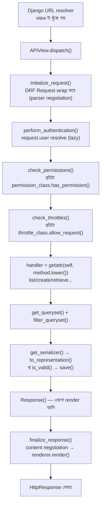

# Module 06 — Advanced DRF at Scale

> **Phase B** | পূর্বশর্ত: M05 (Django Internals)
> পরের module: M07 (PostgreSQL Internals) — Phase C শুরু

---

## ১. যে pagination bug কাউকে দেখা যাচ্ছিল না

একটা merchant dashboard-এ transaction history endpoint। ৬ মাস ধরে ঠিকঠাক চলল — DRF-এর ডিফল্ট `PageNumberPagination`, `page=1`, `page=2`... ইউজাররা page 1-2-3 দেখত, সমস্যা নেই।

একটা বড় merchant-এর transaction ২০ লক্ষ ছাড়াল। Support ticket এল — "page 500-এর পরে duplicate row দেখাচ্ছে, কিছু transaction দুইবার, কিছু একবারও না।"

কোড দেখতে সহজ ছিল:

```python
class TransactionPagination(PageNumberPagination):
    page_size = 50

class TransactionViewSet(ModelViewSet):
    queryset = Payment.objects.filter(status="succeeded").order_by("-created_at")
    pagination_class = TransactionPagination
```

`OFFSET`/`LIMIT` দিয়ে pagination। Merchant dashboard live — নতুন payment প্রতি সেকেন্ডে আসছে। ব্যবহারকারী page 1 দেখে page 2-তে গেল — কিন্তু ততক্ষণে ৫টা নতুন payment এসেছে, সব সবচেয়ে উপরে (`-created_at`)। যা page 1-এ ছিল, তার কিছু এখন page 2-তে চলে গেছে — **duplicate**। আর যা page 2-তে থাকার কথা ছিল, সেটা page 3-এ সরে গেছে — **এক transaction কখনো দেখাই যায়নি**।

এটা bug না — এটা **offset pagination-এর গাণিতিক অনিবার্য পরিণতি** যখন underlying data বদলাতে থাকে। আর `OFFSET 1000000`-এ PostgreSQL-কে **প্রথম ১০ লক্ষ row গুনে ফেলে দিতে হয়** আগে সঠিক row-এ পৌঁছানোর জন্য — তাই page 500-এ latency-ও বেড়ে গিয়েছিল।

সমাধান ছিল **cursor pagination** — এবং কেন সেটা কাজ করে, সেটাই এই module-এর §৭-এর মূল বিষয়।

---

## ২. DRF Request Lifecycle — WSGI থেকে Response পর্যন্ত



**মূল অন্তর্দৃষ্টি:** DRF-এর `Request` Django-র `HttpRequest`-কে **wrap** করে, replace করে না। `request.data` (parsed body) lazy — প্রথমবার access হলে parser negotiation চলে (`Content-Type` header দেখে JSON/form/multipart বাছে)।

```python
class Request:
    @property
    def data(self):
        if not hasattr(self, "_full_data"):
            self._parse()          # ← এখানে body parse হয়, request.body দ্বিতীয়বার পড়া অসম্ভব
        return self._full_data
```

> **Common Mistake:** middleware বা logging-এ `request.body` পড়ে ফেলার পর DRF `request.data` access করলে `RawPostDataException`। কারণ Django-র underlying stream **একবারই পড়া যায়**। সমাধান: middleware-এ `request.body` ধরে রাখুন এবং DRF-কে সেটাই ব্যবহার করতে দিন, অথবা `request._body` cache করা নিশ্চিত করুন।

---

## ৩. Serializer — আসল CPU খরচ কোথায়

### ৩.১ `to_representation` — প্রতিটা field-এ একটা function call

```python
class PaymentSerializer(serializers.ModelSerializer):
    merchant_name = serializers.CharField(source="merchant.name", read_only=True)
    amount = serializers.SerializerMethodField()

    class Meta:
        model = Payment
        fields = ["id", "amount", "status", "merchant_name", "created_at"]

    def get_amount(self, obj):
        return str(Decimal(obj.amount_minor) / 100)
```

একটা list endpoint-এ ১০০টা payment serialize করতে DRF **প্রতিটা row-এর প্রতিটা field-এর জন্য** একটা Python function call করে — `to_representation()` প্রতিটা `Field` subclass-এর। ১০০ row × ৫ field = ৫০০ call, প্রতিটাতে type check, validation logic, attribute lookup।

**`SerializerMethodField` সবচেয়ে দামি** — এটা ORM query-ও লুকিয়ে রাখতে পারে:

```python
class MerchantSerializer(serializers.ModelSerializer):
    total_today = serializers.SerializerMethodField()

    def get_total_today(self, obj):
        return obj.payments.filter(   # ⚠️ এখানে একটা নতুন query! প্রতিটা merchant-এ
            created_at__date=date.today()
        ).aggregate(Sum("amount_minor"))["amount_minor__sum"] or 0
```

এটা দেখতে নিরীহ, কিন্তু list view-তে এটা N+1 তৈরি করছে — আর M05-এ শেখা `select_related`/`prefetch_related` **এটাকে ধরে না**, কারণ এটা serializer-level query, queryset-level না। সমাধান: `annotate()` দিয়ে view-এর queryset-এই এই মান বসিয়ে দিন, serializer শুধু পড়বে।

```python
# views.py
queryset = Merchant.objects.annotate(
    total_today=Sum("payments__amount_minor",
        filter=Q(payments__created_at__date=date.today()))
)
# serializer.py — এখন কোনো query না, শুধু attribute read
total_today = serializers.IntegerField(read_only=True)
```

### ৩.২ Nested Serializer — বিপজ্জনক default

```python
class MerchantSerializer(serializers.ModelSerializer):
    recent_payments = PaymentSerializer(many=True, read_only=True, source="payments")
    # ⚠️ view-তে prefetch_related না থাকলে — প্রতিটা merchant-এ আলাদা query
```

**নিয়ম:** nested serializer ব্যবহার করলে view-এর queryset-এ **অবশ্যই** সংশ্লিষ্ট `prefetch_related`/`select_related` থাকতে হবে। DRF নিজে এটা করে দেয় না, আর কোনো warning ছাড়াই N+1 চলতে থাকে।

```python
# views.py — serializer-এর সাথে সামঞ্জস্যপূর্ণ queryset বাধ্যতামূলক
queryset = Merchant.objects.prefetch_related(
    Prefetch("payments", queryset=Payment.objects.order_by("-created_at")[:5])
)
```

### ৩.৩ Field-level নির্বাচন — payload ছোট রাখা (M31-এর সাথে সংযোগ)

M31-এ estimation দেখিয়েছিল response size cross-region latency-কে বহুগুণ করে (slow start)। DRF-এ এর সমাধান:

```python
class DynamicFieldsSerializer(serializers.ModelSerializer):
    def __init__(self, *args, fields=None, **kwargs):
        super().__init__(*args, **kwargs)
        if fields is not None:
            allowed = set(fields)
            existing = set(self.fields)
            for name in existing - allowed:
                self.fields.pop(name)

class PaymentSerializer(DynamicFieldsSerializer):
    class Meta:
        model = Payment
        fields = ["id", "amount", "status", "merchant", "psp_reference", "metadata"]

# view.py
def get_serializer(self, *args, **kwargs):
    fields = self.request.query_params.get("fields")
    if fields:
        kwargs["fields"] = fields.split(",")
    return super().get_serializer(*args, **kwargs)

# GET /payments/?fields=id,amount,status  ← dashboard-এ শুধু দরকারি field
```

---

## ৪. Generic View ও ViewSet — ভেতরের যন্ত্রপাতি

```python
class ModelViewSet(mixins.CreateModelMixin,
                    mixins.RetrieveModelMixin,
                    mixins.UpdateModelMixin,
                    mixins.DestroyModelMixin,
                    mixins.ListModelMixin,
                    GenericViewSet):
    pass
```

`ModelViewSet` আসলে পাঁচটা **mixin**-এর সমষ্টি — প্রতিটা mixin একটা HTTP method handle করে। `Router` (`DefaultRouter`) URL pattern generate করে এবং method-কে HTTP verb-এ ম্যাপ করে:

```
GET    /payments/          → list()
POST   /payments/          → create()
GET    /payments/{pk}/     → retrieve()
PUT    /payments/{pk}/     → update()
PATCH  /payments/{pk}/     → partial_update()
DELETE /payments/{pk}/     → destroy()
```

**কখন `ModelViewSet` ব্যবহার করবেন না:** যদি সব ৫টা action দরকার না হয়, `ModelViewSet` ব্যবহার করলে **অনিচ্ছাকৃতভাবে endpoint expose** হয়ে যেতে পারে যদি permission ঠিকমতো না দেন।

```python
# ❌ বিপজ্জনক — payment DELETE করা উচিত না, কিন্তু ViewSet এটা দেয়
class PaymentViewSet(ModelViewSet):
    queryset = Payment.objects.all()

# ✅ সুনির্দিষ্ট — শুধু যা দরকার
class PaymentViewSet(mixins.RetrieveModelMixin,
                      mixins.ListModelMixin,
                      GenericViewSet):
    queryset = Payment.objects.all()
    # create/update/destroy নেই — router সেই route-ই বানাবে না
```

> **Senior Tip:** "কেন `ModelViewSet` না?" — interview-এ এই প্রশ্নে বলুন: "আমি least-privilege API design পছন্দ করি — endpoint শুধু তখনই এক্সপোজ করব যখন সেটা প্রয়োজন। `ModelViewSet` সব দেয়, তারপর permission দিয়ে বন্ধ করতে হয় — এক জায়গায় ভুল হলে (`permission_classes` মিস) পুরো CRUD খুলে যায়। Explicit mixin composition দিয়ে ভুল করার সুযোগই থাকে না।"

### `get_queryset()` বনাম `queryset` attribute — request-context filtering

```python
class PaymentViewSet(ReadOnlyModelViewSet):
    serializer_class = PaymentSerializer

    def get_queryset(self):
        # ⚠️ class attribute না, method — প্রতি request নতুন queryset,
        # request.user-ভিত্তিক filtering নিরাপদে করা যায়
        return (Payment.objects
            .filter(merchant=self.request.user.merchant)   # multi-tenancy isolation!
            .select_related("merchant"))
```

**নিরাপত্তা-সংক্রান্ত কারণ:** `queryset = Payment.objects.all()` class-level attribute হিসেবে থাকলে সেটা **সব merchant-এর data** — যদি কোনো ডেভেলপার ভুলে `get_queryset()` override না করে permission-এর উপর একা ভরসা করে, তাহলে IDOR (Insecure Direct Object Reference) vulnerability তৈরি হয়। **নিয়ম: multi-tenant data-তে সবসময় `get_queryset()`-এই tenant filter করুন**, শুধু permission class-এ না।

---

## ৫. Authentication ও Permission Internals

### ৫.১ Authentication class-এর ক্রম গুরুত্বপূর্ণ

```python
class PaymentViewSet(ModelViewSet):
    authentication_classes = [JWTAuthentication, APIKeyAuthentication, SessionAuthentication]
```

DRF **প্রথম যেটা `(user, auth)` tuple ফেরত দেয়** সেটা ব্যবহার করে, বাকিগুলো চেষ্টাই করে না। যদি কোনোটাই match না করে (সবাই `None` ফেরত দেয়), `request.user = AnonymousUser`। কিন্তু কোনো authenticator যদি **credential ভুল দেখে** (`AuthenticationFailed` raise করে), তখনই সাথে সাথে ৪০১ — বাকি authenticator-দের সুযোগ দেওয়া হয় না।

```python
class APIKeyAuthentication(BaseAuthentication):
    def authenticate(self, request):
        api_key = request.headers.get("X-API-Key")
        if not api_key:
            return None                     # চেষ্টাই করেনি — পরের authenticator পাবে সুযোগ
        try:
            key_obj = APIKey.objects.select_related("merchant").get(
                key_hash=hash_key(api_key), is_active=True,
            )
        except APIKey.DoesNotExist:
            raise exceptions.AuthenticationFailed("Invalid API key")  # সাথে সাথে ৪০১
        return (key_obj.merchant, key_obj)

    def authenticate_header(self, request):
        return "X-API-Key"    # ৪০১ response-এর WWW-Authenticate header-এর জন্য
```

### ৫.২ Permission — `has_permission` বনাম `has_object_permission`

```python
class IsPaymentOwner(BasePermission):
    def has_permission(self, request, view):
        # ⚠️ list/create-এর আগে চলে — object এখনো নেই
        return request.user.is_authenticated

    def has_object_permission(self, request, view, obj):
        # ⚠️ শুধু retrieve/update/destroy-এ চলে — DRF explicitly
        # get_object() থেকে ডাকে, list-এ ডাকা হয় না!
        return obj.merchant_id == request.user.merchant_id
```

> **Critical Security Gotcha:** `has_object_permission` **`list()` action-এ কখনো চলে না।** এটা শুধু `get_object()` কল হলে চলে (retrieve/update/destroy)। তাই `list` endpoint-এ tenant isolation object-permission দিয়ে করা যাবে না — **`get_queryset()`-এই filter করতে হবে** (§৪-এ দেখানো)। এই ভুল ধারণা — "permission class দিয়ে সব security হ্যান্ডেল হচ্ছে" — একটা বাস্তব IDOR ক্লাসের উৎস।

### ৫.৩ Custom Permission — ব্যবসায়িক নিয়ম

```python
class CanRefund(BasePermission):
    message = "শুধু succeeded payment refund করা যায়।"

    def has_object_permission(self, request, view, obj):
        if view.action != "refund":
            return True
        return (obj.status == "succeeded"
                and obj.merchant_id == request.user.merchant_id
                and request.user.has_perm("payments.can_refund"))
```

---

## ৬. Throttling — আসল implementation

```python
class MerchantRateThrottle(SimpleRateThrottle):
    scope = "merchant"

    def get_cache_key(self, request, view):
        if not request.user.is_authenticated:
            return None                          # throttle না — auth স্তরে আটকাবে
        return self.cache_format % {
            "scope": self.scope,
            "ident": request.user.merchant_id,     # ⚠️ IP না — merchant ID
        }

# settings.py
REST_FRAMEWORK = {
    "DEFAULT_THROTTLE_RATES": {
        "merchant": "1000/hour",
        "anon": "20/minute",
    }
}
```

### ৫.৪ ভেতরে — এটা কীভাবে কাজ করে (fixed window, ফাঁদসহ)

```python
class SimpleRateThrottle:
    def allow_request(self, request, view):
        key = self.get_cache_key(request, view)
        history = self.cache.get(key, [])
        now = self.timer()

        # window-এর বাইরের পুরনো timestamp ফেলে দাও
        while history and history[-1] <= now - self.duration:
            history.pop()

        if len(history) >= self.num_requests:
            return False                          # ৪২৯

        history.insert(0, now)
        self.cache.set(key, history, self.duration)
        return True
```

এটা **sliding log** — প্রতিটা request-এর timestamp cache-এ list হিসেবে জমা থাকে। এটা fixed-window counter-এর চেয়ে সুনির্দিষ্ট, কিন্তু **প্রতি request-এ পুরো list read+write** — high-traffic-এ Redis-এ costly হতে পারে। M10-এ token bucket/sliding window log-এর algorithm-level তুলনা হবে; এখানে শুধু DRF integration।

> **Common Mistake:** ডিফল্ট `AnonRateThrottle`/`UserRateThrottle` IP বা user-ভিত্তিক। B2B API-তে **merchant-ভিত্তিক** throttle দরকার (একটা merchant-এর multiple API key/user মিলে একটাই quota শেয়ার করা উচিত), যেটা কাস্টম `get_cache_key` ছাড়া হয় না।

**Distributed environment-এ throttle cache Redis-ে হতেই হবে** — `LocMemCache` (per-process) দিয়ে করলে প্রতিটা pod আলাদা counter রাখবে, N pod থাকলে effective limit N× বেড়ে যাবে।

```python
REST_FRAMEWORK = {
    "DEFAULT_THROTTLE_CLASSES": ["myapp.throttles.MerchantRateThrottle"],
}
CACHES = {"default": {"BACKEND": "django_redis.cache.RedisCache", ...}}  # shared!
```

---

## ৭. Pagination — Offset বনাম Cursor (§১-এর সমাধান)

### ৭.১ Offset Pagination — কেন ভাঙে

```python
class StandardPagination(PageNumberPagination):
    page_size = 50
```

```sql
-- page=20001, page_size=50 হলে:
SELECT * FROM payment ORDER BY created_at DESC LIMIT 50 OFFSET 1000000;
```

**দুইটা আলাদা সমস্যা:**

**১. Performance।** PostgreSQL `OFFSET 1000000` মানে **প্রথম ১০ লক্ষ row স্ক্যান করে ফেলে দেওয়া**, তারপর পরের ৫০টা ফেরত দেওয়া। Index থাকলেও এই স্ক্যান এড়ানো যায় না — `EXPLAIN`-এ `Limit → Index Scan (actual rows=1000050)` দেখাবে, যদিও আপনি চেয়েছেন মাত্র ৫০টা।

**২. Correctness — এইটাই §১-এর incident।** যদি নতুন row insert হয় sort-এর প্রথম দিকে (`-created_at`, তাই নতুন row সবচেয়ে উপরে), তাহলে সব পরের row-এর **offset shift** হয়ে যায়। ফলে duplicate ও skip।

### ৭.২ Cursor Pagination — কীভাবে সমাধান করে

```python
class TransactionCursorPagination(CursorPagination):
    page_size = 50
    ordering = "-created_at"     # ⚠️ unique, monotonic column হতে হবে
    cursor_query_param = "cursor"
```

মূল ধারণা: page number-এর বদলে, **"সর্বশেষ item-এর value" cursor হিসেবে এনকোড** করা হয়। পরের request-এ `WHERE created_at < <last_seen_value>` — offset গোনা লাগে না।

```sql
-- page 1
SELECT * FROM payment ORDER BY created_at DESC LIMIT 51;   -- 50+1, পরের page আছে কি না জানতে

-- page 2 — cursor = শেষ row-এর created_at
SELECT * FROM payment
WHERE created_at < '2026-07-23T09:15:00.123456Z'
ORDER BY created_at DESC LIMIT 51;
```

**কেন এটা race-safe:** নতুন row insert হলেও (sort-এর শুরুতে), সেটা `WHERE created_at < cursor` শর্তের **বাইরে** পড়বে — cursor-এর পরের সব row অপরিবর্তিত। কোনো duplicate নেই, কোনো skip নেই।

**কেন দ্রুত:** `WHERE created_at < X ORDER BY created_at DESC LIMIT 50` — যদি `created_at`-এ index থাকে, PostgreSQL সরাসরি সঠিক জায়গা থেকে index scan শুরু করে। কোনো row "ফেলে দেওয়া" লাগে না — page 1 হোক বা page ২০,০০০, latency প্রায় একই।

```sql
CREATE INDEX idx_payment_created_at ON payment (created_at DESC);
```

### ৭.৩ সীমাবদ্ধতা — কখন cursor ব্যবহার করবেন না

| | Offset | Cursor |
|---|---|---|
| নির্দিষ্ট page-এ jump (`page=৫০`) | ✅ সম্ভব | ❌ সম্ভব না — শুধু next/prev |
| "মোট কত page" দেখানো | ✅ সহজ | ❌ costly (`COUNT(*)` লাগবে) |
| Live-changing data | ❌ duplicate/skip | ✅ সঠিক |
| গভীর page-এ performance | ❌ ধীর | ✅ ধ্রুব |
| Sort column unique+monotonic | দরকার নেই | **বাধ্যতামূলক** |

**Ordering column unique না হলে সমস্যা:** `created_at` দুইটা row-এর একই মান হতে পারে (একই millisecond)। তখন cursor ambiguous হয়ে যায় — কিছু row হারিয়ে যেতে পারে।

```python
class TransactionCursorPagination(CursorPagination):
    ordering = ("-created_at", "-id")   # ✅ tie-breaker দিয়ে সবসময় unique
```

**সিদ্ধান্ত:** admin-এর মতো ইন্টারনাল টুল যেখানে "page ৫০-এ যাও" দরকার → offset ঠিক আছে (data হাজার হাজার row-এর বেশি না হলে)। User-facing feed, transaction history, live data → **cursor**।

---

## ৮. Filtering — django-filter-এর ভেতরে

```python
class PaymentFilter(filters.FilterSet):
    min_amount = filters.NumberFilter(field_name="amount_minor", lookup_expr="gte")
    max_amount = filters.NumberFilter(field_name="amount_minor", lookup_expr="lte")
    created_after = filters.DateTimeFilter(field_name="created_at", lookup_expr="gte")
    status = filters.MultipleChoiceFilter(choices=Payment.Status.choices)

    class Meta:
        model = Payment
        fields = []   # explicit filter-গুলোই যথেষ্ট, auto-generate বন্ধ

class PaymentViewSet(ReadOnlyModelViewSet):
    filter_backends = [DjangoFilterBackend]
    filterset_class = PaymentFilter
```

**নিরাপত্তা সতর্কতা — `Meta.fields = "__all__"` কখনো না:**

```python
# ❌ বিপজ্জনক
class Meta:
    model = Payment
    fields = "__all__"    # যেকোনো field দিয়ে filter করা যাবে, এমনকি সংবেদনশীল ও
                            # unindexed field দিয়েও (DoS ঝুঁকি — full table scan trigger)
```

`fields = "__all__"` দিলে API consumer `?psp_secret_token=x` এর মতো query param দিয়ে filter করার চেষ্টা করতে পারে — কিছু না ঘটলেও, unindexed column-এ filter allow করা মানে কেউ ইচ্ছাকৃতভাবে ধীর query তৈরি করে DB-কে overload করতে পারে (M26-এ DoS pattern)।

**প্রতিটা filterable field-এর জন্য index থাকা উচিত** — না হলে filter option থাকা মানে seq scan trigger করার আমন্ত্রণ।

---

## ৯. Exception Handling — একটা সুসংগত error contract

M31-এ দেখানো error contract বাস্তবায়ন:

```python
# exceptions.py
from rest_framework.views import exception_handler as drf_exception_handler
import uuid, logging

logger = logging.getLogger("api.errors")

def custom_exception_handler(exc, context):
    response = drf_exception_handler(exc, context)
    request_id = getattr(context["request"], "id", str(uuid.uuid4()))

    if response is None:
        # DRF-এর হ্যান্ডলার এটা চেনে না — অপ্রত্যাশিত exception
        logger.exception("unhandled_exception", extra={"request_id": request_id})
        return Response(
            {"error": {"code": "internal_error", "message": "একটা অপ্রত্যাশিত সমস্যা হয়েছে।",
                       "request_id": request_id}},
            status=500,
        )

    # DRF-এর ডিফল্ট ফরম্যাট {"detail": "..."} কে আমাদের সুসংগত ফরম্যাটে রূপান্তর
    error_code = getattr(exc, "default_code", "error")
    detail = response.data.get("detail", response.data)
    response.data = {
        "error": {"code": str(error_code), "message": str(detail), "request_id": request_id}
    }
    return response

# settings.py
REST_FRAMEWORK = {"EXCEPTION_HANDLER": "myapp.exceptions.custom_exception_handler"}
```

**কাস্টম ব্যবসায়িক exception:**

```python
class InsufficientBalance(APIException):
    status_code = 402
    default_detail = "মার্চেন্টের balance অপর্যাপ্ত।"
    default_code = "insufficient_balance"

class IdempotencyConflict(APIException):
    status_code = 409
    default_detail = "একই idempotency key ভিন্ন request body-র সাথে ব্যবহৃত হয়েছে।"
    default_code = "idempotency_key_reused"
```

> **Senior Tip:** `EXCEPTION_HANDLER` কাস্টমাইজ করাটা "nice to have" না — এটাই আপনার API-র public contract-এর ভিত্তি। M31-এর error contract (`error.code`, `error.message`, `error.request_id`) ছাড়া প্রতিটা client-কে DRF-এর raw `{"detail": "..."}` format পার্স করতে হবে, যেটা error type অনুযায়ী বদলায় (validation error-এ dict of list, permission error-এ string) — client কোড ভঙ্গুর হয়।

---

## ১০. File Upload ও Streaming Response

### ১০.১ বড় file upload — memory-তে না রেখে

```python
# settings.py
FILE_UPLOAD_MAX_MEMORY_SIZE = 5 * 1024 * 1024   # 5MB-এর বেশি হলে disk-এ temp file
DATA_UPLOAD_MAX_MEMORY_SIZE = 10 * 1024 * 1024   # non-file POST data সীমা
```

**Direct-to-S3 upload — production pattern (M31-এর API contract-এর ধারাবাহিকতা):**

```python
# API server শুধু presigned URL দেয়, ফাইল নিজে কখনো স্পর্শ করে না
class UploadURLView(APIView):
    def post(self, request):
        key = f"uploads/{request.user.merchant_id}/{uuid.uuid4()}"
        presigned = s3_client.generate_presigned_post(
            Bucket=BUCKET, Key=key,
            Conditions=[["content-length-range", 0, 20_000_000]],  # 20MB সীমা
            ExpiresIn=300,
        )
        return Response({"upload": presigned, "key": key})
# Client সরাসরি S3-তে upload করে — Gunicorn worker কখনো বড় ফাইল buffer করে না
```

এটা M02-এর "external call কখনো sync worker-কে দীর্ঘ সময় আটকে রাখবে না" নীতির সরাসরি প্রয়োগ — একটা ২০ MB upload যদি Gunicorn worker দিয়ে pass-through হয়, সেই worker পুরো upload duration-এ আটকে থাকবে।

### ১০.২ Streaming Response — memory-তে সম্পূর্ণ response না রেখে

```python
from django.http import StreamingHttpResponse
import csv

class ExportView(APIView):
    def get(self, request):
        def row_generator():
            yield "id,amount,status,created_at\n"
            # .iterator() (M04/M05) — memory ধ্রুব, ১০ লক্ষ row হোক বা ১ কোটি
            for p in Payment.objects.filter(
                merchant=request.user.merchant
            ).values_list("id", "amount_minor", "status", "created_at").iterator(chunk_size=2000):
                yield f"{p[0]},{p[1]},{p[2]},{p[3]}\n"

        response = StreamingHttpResponse(row_generator(), content_type="text/csv")
        response["Content-Disposition"] = 'attachment; filename="export.csv"'
        return response
```

⚠️ **`StreamingHttpResponse`-এ DRF-এর `Response`/renderer ব্যবহার করা যায় না** (renderer পুরো content একবারে চায়)। প্লেইন Django `StreamingHttpResponse` লাগবে, এবং `Content-Length` header **সেট করবেন না** (streaming-এ আগে থেকে জানা যায় না)।

⚠️ **Nginx-এ `proxy_buffering off` লাগবে** (M02 §৮-এ কভার করা হয়েছে) — না হলে Nginx পুরো response জমা করে একবারে পাঠাবে, streaming-এর memory-সাশ্রয়ী সুবিধা নষ্ট হয়ে যাবে সার্ভার সাইডে, আর client-এর কাছে "streaming" আর থাকে না।

---

## ১১. API Versioning

| কৌশল | উদাহরণ | সুবিধা | অসুবিধা |
|---|---|---|---|
| **URL path** | `/api/v1/payments/` | সহজ, cache-friendly, browser-এ দেখা যায় | URL "impure" (RESTful purist আপত্তি করে) |
| Header | `Accept: application/vnd.api+json;version=1` | URL পরিষ্কার | Discoverability কম, curl-এ টেস্ট করা অসুবিধাজনক |
| Query param | `?version=1` | সহজ | Cache key জটিল করে |
| Namespace | আলাদা app per version | সম্পূর্ণ isolation | Code duplication ঝুঁকি |

**সুপারিশ (industry-নর্ম, Stripe/GitHub-এর মতো):** URL path versioning। কারণ — cache করা সহজ, debug করা সহজ, browser-এ সরাসরি টেস্ট করা যায়, আর client integration-এ ভুল হওয়ার সুযোগ কম।

```python
REST_FRAMEWORK = {
    "DEFAULT_VERSIONING_CLASS": "rest_framework.versioning.URLPathVersioning",
    "DEFAULT_VERSION": "v1",
    "ALLOWED_VERSIONS": ["v1", "v2"],
}

# urls.py
urlpatterns = [
    path("api/v1/", include("api.v1.urls")),
    path("api/v2/", include("api.v2.urls")),
]
```

**Breaking change-এর নিয়ম** (M31-এর "out of scope" ঘোষণার মতো, আগে থেকে স্পষ্ট থাকা জরুরি):

```
Breaking change (নতুন version লাগবে):
  - কোনো field সরানো
  - কোনো field-এর type বদলানো
  - Required field যোগ করা
  - Error code বদলানো

Non-breaking (একই version-এ ঠিক আছে):
  - Optional field যোগ করা
  - নতুন endpoint যোগ করা
  - নতুন optional query param
```

---

## ১২. Async DRF — বাস্তব সীমা

DRF-এর `APIView`-এ `async def` মেথড টেকনিক্যালি কাজ করে না সরাসরি — DRF মূলত sync-ভিত্তিক (`Response`, serializer, permission — সবই sync API)। যদি সত্যিই async view দরকার (M04/M05-এ ব্যাখ্যা করা বহু-external-call কেস), সাধারণত **plain Django async view** ব্যবহার করা হয়, DRF ছাড়া:

```python
# DRF দিয়ে না — plain async view + manual serialization
async def merchant_risk_view(request, merchant_id):
    async with httpx.AsyncClient(timeout=5) as client:
        results = await asyncio.gather(
            client.get(f"{RISK_SVC}/score/{merchant_id}"),
            client.get(f"{KYC_SVC}/status/{merchant_id}"),
        )
    return JsonResponse({"risk": results[0].json(), "kyc": results[1].json()})
```

> **Senior Tip:** "DRF-এ async view কীভাবে করবেন?" প্রশ্নে সততার সাথে বলুন: "DRF মূলত sync framework, এবং async ecosystem-এর সাথে ভালোভাবে মেলে না — serializer, permission, throttle সব sync API আশা করে। আমি সাধারণত DRF-কে standard CRUD-এর জন্য রাখি, আর যেখানে সত্যিই async দরকার (bulk external call, streaming) সেখানে plain Django async view বা আলাদা FastAPI service ব্যবহার করি।"

---

## ১৩. কখন DRF ছেড়ে অন্য কিছুতে যাবেন

| পরিস্থিতি | সিদ্ধান্ত | কারণ |
|---|---|---|
| Standard CRUD, ORM-নির্ভর business logic | **DRF-এ থাকুন** | Auth, permission, admin, migration — সব একসাথে পাওয়া যায় |
| উচ্চ-throughput, সরল read API (>১০,০০০ RPS প্রতি pod দরকার) | বিবেচনা করুন FastAPI | DRF-এর serializer overhead উল্লেখযোগ্য হয়ে ওঠে এই স্কেলে |
| ভারী async I/O (LLM proxy, webhook aggregator) | **FastAPI বা plain ASGI** | প্রকৃত async ecosystem — Pydantic, native async ORM (SQLAlchemy 2.0 async, Tortoise) |
| Internal service-to-service (RPC-style) | **gRPC** | Schema-first, বাইনারি, বহু ভাষায় client generate |
| WebSocket/realtime | **Django Channels** (M27) অথবা আলাদা service | DRF এখানে প্রাসঙ্গিকই না |
| Public GraphQL API দরকার | Graphene-Django বা Strawberry | ভিন্ন query model সম্পূর্ণ |

**সিদ্ধান্তের নিয়ম:** DRF ছাড়ার আগে প্রশ্ন করুন — সমস্যাটা কি DRF-এর, নাকি query/architecture-এর? M31-এর estimation করুন — বেশিরভাগ ক্ষেত্রে DB query অপ্টিমাইজেশন (N+1 ঠিক করা, index যোগ করা) DRF ছেড়ে দেওয়ার চেয়ে ১০০× বেশি লাভ দেয়। ভাষা/framework বদলানো শেষ অস্ত্র, প্রথম না।

---

## ১৪. Interview Section

### প্রশ্ন ১ (Senior) — "Offset pagination-এর সমস্যা কী, cursor pagination কীভাবে সমাধান করে?"

**❌ Wrong Answer**
> "Offset বড় সংখ্যায় ধীর হয়, cursor দ্রুত।"

*কেন অসম্পূর্ণ:* শুধু performance বলছে, correctness সমস্যাটা বাদ পড়ে গেছে — যেটা আসলে বেশি গুরুত্বপূর্ণ।

**🌟 Senior/Staff Answer**
> "দুইটা আলাদা সমস্যা। **Performance:** `OFFSET N` মানে PostgreSQL-কে প্রথম N row স্ক্যান করে ফেলে দিতে হয় সঠিক জায়গায় পৌঁছাতে — index থাকা সত্ত্বেও। Page যত গভীর, তত ধীর, রৈখিকভাবে।
>
> কিন্তু আরও গুরুত্বপূর্ণ সমস্যা **correctness**, যেটা প্রায়ই উপেক্ষিত হয়। যদি underlying data বদলাতে থাকে — নতুন row insert হয় sort order-এর শুরুর দিকে — তাহলে পরের সব row-এর offset shift হয়ে যায়। User page 2-তে গেলে কিছু row দুইবার দেখবে (যেগুলো shift হয়ে গেছে), কিছু কখনো দেখবেই না (যেগুলো skip হয়ে গেছে)। লাইভ transaction feed-এ এটা বাস্তব bug, শুধু theoretical না।
>
> Cursor pagination page number-এর বদলে 'শেষ দেখা item-এর value' ব্যবহার করে — `WHERE created_at < <cursor_value>`। এতে offset গোনা লাগে না (তাই দ্রুত, ধ্রুব latency), আর নতুন insert cursor-এর 'আগে' পড়ে বলে existing pagination window অক্ষত থাকে (তাই সঠিক)।
>
> **Trade-off:** cursor দিয়ে নির্দিষ্ট page-এ jump করা যায় না, শুধু next/prev। আর ordering column অবশ্যই unique+monotonic হতে হবে, নাহলে tie-breaker যোগ করতে হয় (`-created_at, -id`)। তাই admin-এর মতো জায়গায় যেখানে 'page ৫০-এ যাও' দরকার, সেখানে offset-ই রাখি — কিন্তু live, user-facing feed-এ সবসময় cursor।"

---

### প্রশ্ন ২ (Staff / Architecture) — "একটা list endpoint কিছু user-এর জন্য অন্য tenant-এর data দেখাচ্ছে। Root cause খুঁজুন।"

**🌟 Senior/Staff Answer**
> "এটা প্রায় নিশ্চিতভাবে DRF-এর একটা সুনির্দিষ্ট, well-known ফাঁদ: **`has_object_permission` `list()` action-এ কখনো চলে না।**
>
> DRF permission system দুই স্তরে কাজ করে — `has_permission` (সব request-এ, object resolve হওয়ার আগে) আর `has_object_permission` (শুধু `get_object()` কল হলে, অর্থাৎ retrieve/update/destroy-তে)। `list()` action ভেতরে `get_object()` ডাকে না — এটা সরাসরি queryset iterate করে। তাই যদি কোনো ডেভেলপার tenant isolation `has_object_permission`-এ লিখে থাকেন এই ভেবে যে এটা সব জায়গায় প্রযোজ্য, `list` endpoint সেটা সম্পূর্ণ বাইপাস করে যাবে।
>
> **আমার প্রথম চেক:** viewset-এর `get_queryset()` দেখব। যদি এটা `Payment.objects.all()` বা শুধু কিছু non-tenant filter থাকে (permission class-এর উপর ভরসা করে tenant filter না থাকে), সেটাই root cause।
>
> **সঠিক সমাধান:** tenant isolation `get_queryset()`-এর ভেতরে করতে হবে, request-context থেকে:
> ```python
> def get_queryset(self):
>     return Payment.objects.filter(merchant=self.request.user.merchant)
> ```
> এটা defense-in-depth-এর প্রথম স্তর — queryset নিজেই অন্য tenant-এর data কখনো ফেরত দেবে না, permission class ভুল থাকলেও।
>
> **প্রতিরোধ — এটা যেন আবার না ঘটে:** প্রতিটা multi-tenant viewset-এর জন্য একটা automated test থাকা উচিত — একটা tenant হিসেবে login করে অন্য tenant-এর known object ID দিয়ে GET/list করার চেষ্টা, ৪০৪/খালি result নিশ্চিত করা। এটা CI-তে থাকলে এই bug কখনো merge হতো না। এবং architecturally, আমি একটা base `TenantScopedViewSet` বানাব যেটা `get_queryset()`-এ tenant filter বাধ্যতামূলক করে — নতুন viewset লেখার সময় ভুলে যাওয়ার সুযোগ কমিয়ে দেয়।"

---

### প্রশ্ন ৩ (Scenario) — "একটা merchant list endpoint প্রতিটা merchant-এ আজকের total দেখায়। ২০টা merchant-এ ঠিক আছে, ১০ হাজারে API টাইমআউট করে।"

**🌟 Senior/Staff Answer**
> "লক্ষণটা ক্লাসিক N+1, কিন্তু সন্দেহজনক জায়গা প্রথাগত জায়গায় না। যেহেতু M05-এর `select_related`/`prefetch_related`-এর কথা মাথায় রেখেই queryset optimize করা হয়ে থাকতে পারে, আমি প্রথমে serializer দেখব।
>
> খুব সম্ভবত এখানে `SerializerMethodField` দিয়ে 'আজকের total' গণনা হচ্ছে, প্রতিটা merchant object-এ আলাদা `.filter().aggregate()` কল করে। এটা `view`-level queryset optimization-এর বাইরে ঘটে — `select_related`/`prefetch_related` এই query ধরে না, কারণ এটা serializer-এর `to_representation()`-এর ভেতরে চলে, queryset evaluation-এর পরে।
>
> ২০টা merchant-এ ২০টা অতিরিক্ত query — লক্ষ্যণীয় না। ১০ হাজারে ১০ হাজার query — টাইমআউট।
>
> **সমাধান:** এই aggregation view-level `annotate()`-এ সরাতে হবে, যাতে এটা মূল queryset-এর সাথে একটা query-তেই (`GROUP BY` বা conditional `Sum`) চলে যায়:
> ```python
> queryset = Merchant.objects.annotate(
>     total_today=Sum("payments__amount_minor",
>         filter=Q(payments__created_at__date=date.today()))
> )
> ```
> serializer তখন শুধু `total_today` field read করবে, কোনো নতুন query ছাড়াই।
>
> **এই ক্লাসের bug ধরার প্রক্রিয়া:** যেকোনো `SerializerMethodField` যেটা ORM ছুঁচ্ছে, সেটা একটা red flag হিসেবে code review-তে flag করা উচিত। আমি এটাকে একটা team convention বানাব — CI-তে `django-debug-toolbar` বা `nplusone` package দিয়ে প্রতিটা list endpoint-এর query count-এর উপর একটা assertion রাখা (M23-এ বিস্তারিত), যাতে এই ধরনের regression merge হওয়ার আগেই ধরা পড়ে, production-এ পৌঁছানোর আগে।"

---

### প্রশ্ন ৪ (Coding) — "এই throttle implementation-এর সমস্যা কী?"

```python
class BurstRateThrottle(UserRateThrottle):
    scope = "burst"
    rate = "100/minute"
```

```python
# settings.py
CACHES = {"default": {"BACKEND": "django.core.cache.backends.locmem.LocMemCache"}}
```

**🌟 Senior Answer**
> "কোড নিজে ঠিক আছে, সমস্যাটা cache backend-এ। `LocMemCache` প্রতিটা process-এর **নিজস্ব আলাদা memory**-তে থাকে — Redis-এর মতো shared না।
>
> যদি এই API ১০টা Gunicorn worker × ৫টা pod-এ চলে, তাহলে **৫০টা আলাদা counter** আছে একই user-এর জন্য, প্রতিটা independently ট্র্যাক করছে '100/minute'। কার্যকর সীমা তখন `100 × 50 = 5,000/minute` — নির্ধারিত limit-এর ৫০ গুণ। আরও খারাপ, load balancer round-robin করলে ভুল request কোন worker-এ যাবে সেটাও অনির্দিষ্ট, তাই throttle behavior **অসামঞ্জস্যপূর্ণ** — কখনো ৪২৯ দেবে, কখনো একই user একই মিনিটে ৩০০ request পার করে ফেলবে।
>
> সমাধান: `CACHES["default"]`-কে Redis-এ পরিবর্তন করা, যাতে সব worker/pod একই counter share করে:
> ```python
> CACHES = {"default": {
>     "BACKEND": "django_redis.cache.RedisCache",
>     "LOCATION": "redis://redis:6379/1",
> }}
> ```
> এই বাগটা বিশেষভাবে বিপজ্জনক কারণ এটা **local development-এ কখনো ধরা পড়ে না** — একজন developer একটা process চালায়, throttle সঠিকভাবেই কাজ করে দেখায়। এটা শুধু multi-worker/multi-pod production-এ প্রকাশ পায়, আর তখন উপসর্গটা 'rate limit কাজ করছে না' — যেটা প্রথম দর্শনে throttle logic-এর বাগ মনে হয়, আসলে infrastructure configuration সমস্যা।"

---

### প্রশ্ন ৫ (Architecture Decision) — "আমাদের public API-তে GraphQL যোগ করা উচিত, না DRF-এই থাকা উচিত?"

**🌟 Senior/Staff Answer**
> "প্রশ্নটা হলো — সমস্যাটা কী সমাধান করতে চাইছি? GraphQL সাধারণত দুইটা জিনিস সমাধান করে: (১) **over-fetching/under-fetching** — client-কে ঠিক যা দরকার তাই আনার সুযোগ দেওয়া, (২) একাধিক resource-কে **একটা request**-এ combine করা।
>
> DRF-এ প্রথমটা আমরা ইতিমধ্যে field selection দিয়ে সমাধান করেছি (`?fields=id,amount,status`), সরল আর explicit। দ্বিতীয়টা সমাধান হয় thoughtful endpoint design দিয়ে বা BFF pattern দিয়ে (M17)।
>
> GraphQL-এর প্রকৃত খরচ: (ক) N+1 এখনো ঘটে, শুধু resolver-লেভেলে — DataLoader pattern লাগবে, একই class-এর সমস্যা নতুন জায়গায়। (খ) Rate limiting জটিল হয় — একটা query-র 'cost' variable, একটা naive query দিয়ে DoS সহজ। (গ) HTTP caching ভাঙে — সব request POST-এ যায় একটা endpoint-এ, তাই CDN/browser cache কাজ করে না সহজে। (ঘ) টিমের নতুন mental model শিখতে হবে, tooling (Graphene/Strawberry) DRF-এর মতো পরিপক্ব না।
>
> **আমার প্রশ্ন হবে:** client-রা কি সত্যিই আলাদা আলাদা field combination চাইছে, নাকি আমরা অনুমান করছি? Public API-তে consumer-রা predictability আর ভালো caching বেশি মূল্য দেয় flexibility-র চেয়ে — Stripe, GitHub REST API এখনো dominant এই কারণেই।
>
> **আমার সুপারিশ:** DRF-এ থাকুন, field selection যোগ করুন। GraphQL শুধু বিবেচনা করব যদি একটা নির্দিষ্ট internal use case থাকে (যেমন একটা complex admin dashboard যেটা সত্যিই dynamic, deeply nested query চায়) — এবং তখনও সেটা একটা আলাদা, সীমিত internal GraphQL layer হবে, পুরো public API-কে migrate করার বদলে।"

---

## ১৫. হাতে-কলমে অনুশীলন

**১ — Offset-এর race condition দেখুন (২৫ মিনিট)**
`page_size=5` দিয়ে একটা endpoint বানান। Page 1 fetch করুন, তারপর নতুন row insert করুন (sort-এর শুরুতে পড়বে এমন), তারপর page 2 fetch করুন। কোন row duplicate/missing হলো নোট করুন। তারপর `CursorPagination`-এ বদলে একই পরীক্ষা করুন।

**২ — Serializer N+1 ধরা (২০ মিনিট)**
একটা `SerializerMethodField` লিখুন যা ORM query করে। `django-debug-toolbar` দিয়ে query count দেখুন list endpoint-এ। তারপর `annotate()`-এ সরিয়ে পার্থক্য দেখুন।

**৩ — Multi-tenant IDOR টেস্ট (২০ মিনিট)**
দুইটা merchant/tenant বানান। Tenant A হিসেবে login করে Tenant B-এর object ID দিয়ে `retrieve` আর `list` endpoint কল করুন। দুইটাতেই সঠিকভাবে ব্লক হচ্ছে কি না — বিশেষভাবে `list`-এ — যাচাই করুন।

**৪ — Throttle cache backend পরীক্ষা (১৫ মিনিট)**
`LocMemCache` দিয়ে দুইটা আলাদা Gunicorn worker (`--workers 2`) চালিয়ে একই user দিয়ে দ্রুত request পাঠান। মোট allowed request সংখ্যা নির্ধারিত limit-এর চেয়ে বেশি হচ্ছে কি না দেখুন। তারপর Redis backend দিয়ে আবার পরীক্ষা করুন।

---

## ১৬. মূল কথা

1. **`request.data` lazy parse হয়**, `request.body`-র সাথে conflict করতে পারে — middleware সাবধানে।
2. **`SerializerMethodField`-এ ORM query লুকিয়ে থাকতে পারে** — view-level `select_related`/`prefetch_related` এটা ধরে না। `annotate()` ব্যবহার করুন।
3. **`ModelViewSet`-এর বদলে explicit mixin composition** — least privilege, ভুলবশত endpoint expose হওয়া রোধ করে।
4. **`has_object_permission()` `list()` action-এ চলে না** — tenant isolation সবসময় `get_queryset()`-এ করুন।
5. **Offset pagination গভীর page-এ ধীর, এবং live data-তে ভুল** (duplicate/skip)। **Cursor pagination** সমাধান — unique+monotonic ordering column লাগবে।
6. **`Meta.fields = "__all__"` filterset-এ কখনো না** — unindexed field দিয়ে filter করার সুযোগ DoS ঝুঁকি তৈরি করে।
7. **Throttle cache অবশ্যই shared (Redis)** — `LocMemCache` distributed environment-এ effective limit-কে worker সংখ্যায় গুণ করে দেয়।
8. **Custom `EXCEPTION_HANDLER`** — সুসংগত error contract (`error.code`, `message`, `request_id`) API-র usability-র মূল ভিত্তি।
9. **বড় file upload সরাসরি S3-তে (presigned URL)**, Gunicorn worker দিয়ে pass-through না — M02-এর "sync worker দীর্ঘ সময় আটকাবেন না" নীতির প্রয়োগ।
10. **DRF মূলত sync framework** — ভারী async I/O দরকার হলে plain Django async view বা আলাদা FastAPI service, DRF-এর ভেতরে জোর করে async না।
11. **DRF ছাড়ার আগে query optimize করুন** — বেশিরভাগ "DRF slow" সমস্যা আসলে N+1 বা missing index।

---

## পরের Module

আজ Phase B শেষ হলো — Networking, Python internals, Django internals, DRF। এখন থেকে আমরা **Phase C — Data Layer**-এ প্রবেশ করছি, যেটা এই পুরো handbook-এর সবচেয়ে গুরুত্বপূর্ণ অংশ।

**M07 — PostgreSQL Internals।** আজকে `select_for_update`, isolation level, আর index-এর কথা বহুবার এসেছে ভাসাভাসাভাবে — M07-এ আমরা একদম ভেতরে যাব: page/tuple layout, MVCC আসলে কীভাবে কাজ করে (আজকের row lock-এর প্রকৃত ভিত্তি), B-Tree/GIN/BRIN index কখন কোনটা, VACUUM কেন লাগে, আর `EXPLAIN (ANALYZE, BUFFERS)` পড়ার সম্পূর্ণ নিয়ম — যেটা M05 আর M06-এ বারবার রেফারেন্স করা হয়েছে।
