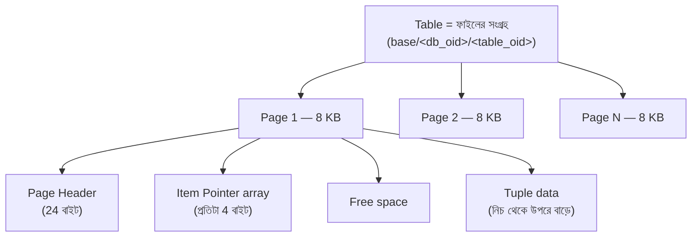
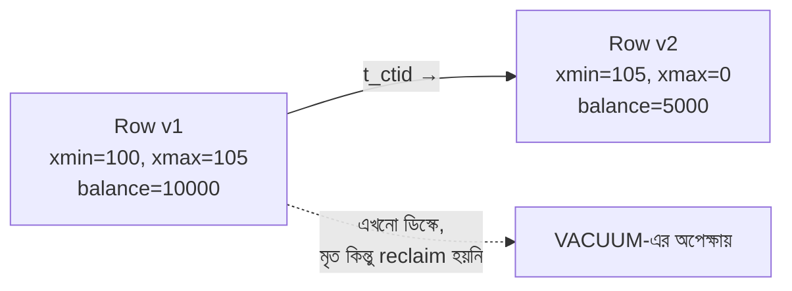

# Module 07 — PostgreSQL Internals

> **Phase C — Data Layer** | পূর্বশর্ত: M05, M06
> পরের module: M08 (Database Scaling & Operations)

---

## ১. যে টেবিলে `DELETE` করার পর ডিস্ক খালি হলো না

একটা টিম প্রতি মাসে পুরনো `webhook_delivery_log` টেবিল থেকে ৯০ দিনের বেশি পুরনো row মুছত:

```sql
DELETE FROM webhook_delivery_log WHERE created_at < now() - interval '90 days';
-- ২ কোটি row মুছল
```

`\dt+` দিয়ে টেবিলের আকার দেখল — **কোনো পরিবর্তন নেই**। ডিস্ক ব্যবহার আগের মতোই। প্রথমে মনে হলো `DELETE` কাজ করেনি, কিন্তু `SELECT COUNT(*)` দেখাল row সত্যিই কমে গেছে।

তাহলে ডিস্ক স্পেস কোথায়? উত্তরটা PostgreSQL-এর সবচেয়ে ভুল বোঝা আচরণে লুকানো: **PostgreSQL-এ `DELETE` row মুছে দেয় না — তাকে "মৃত" (dead) হিসেবে চিহ্নিত করে।** আসল space পুনরুদ্ধার হয় `VACUUM`-এর মাধ্যমে, আর `VACUUM` জায়গা **OS-কে ফেরত দেয় না** (`VACUUM FULL` ছাড়া) — শুধু টেবিলের নিজের ভেতরে পুনর্ব্যবহারের জন্য চিহ্নিত করে।

এই টিমের সমস্যা আরও গভীর ছিল — `autovacuum` তাদের টেবিলে ঠিকমতো চলছিলই না, কারণ table-level `autovacuum_vacuum_scale_factor` ডিফল্ট (২০%) একটা বিশাল টেবিলে অবাস্তব — ২ কোটি row-এর ২০% মানে ৪০ লক্ষ dead tuple জমা হওয়ার আগে autovacuum ট্রিগারই হয় না। ফলে dead tuple জমতে জমতে **bloat** — টেবিল তার প্রয়োজনের চেয়ে ৩ গুণ জায়গা নিচ্ছিল, index scan ধীর হয়ে যাচ্ছিল, আর query planner ভুল plan বাছছিল কারণ statistics stale।

এই ঘটনাটা বোঝার জন্য আপনাকে জানতে হবে PostgreSQL row **আসলে কীভাবে** স্টোর ও ডিলিট হয় — যেটা এই পুরো module-এর ভিত্তি।

---

## ২. Storage মডেল — Page থেকে Row পর্যন্ত



**প্রতিটা page ৮ KB** (ডিফল্ট, কম্পাইল-টাইম কনস্ট্যান্ট)। প্রতিটা row (**tuple**) একটা page-এর ভেতরে থাকে, item pointer (line pointer) দিয়ে reference করা হয়। একটা page-এ item pointer array উপর থেকে নিচে বাড়ে, tuple data নিচ থেকে উপরে বাড়ে — মাঝখানে free space।

### ২.১ Tuple Header — প্রতিটা row-এর লুকানো খরচ

```
প্রতিটা row-এ ২৩ বাইট fixed header (HeapTupleHeaderData):
  t_xmin       — কোন transaction এই row তৈরি করেছে
  t_xmax       — কোন transaction এই row মুছেছে/আপডেট করেছে (০ = এখনো জীবিত)
  t_ctid       — এই row-এর পরবর্তী ভার্শনের pointer (UPDATE চেইনে)
  t_infomask   — flags (null bitmap আছে কি না, ইত্যাদি)
  ...
```

**অর্থ:** একটা ছোট row (যেমন শুধু একটা integer, ৪ বাইট) আসলে ডিস্কে **২৭+ বাইট** নেয়, শুধু header-এর জন্যই। এই কারণে narrow table-এ millions row থাকলে header overhead-ই উল্লেখযোগ্য storage হয়ে যায়।

```sql
-- একটা row-এর প্রকৃত ফিজিক্যাল অবস্থান দেখুন
SELECT ctid, xmin, xmax, * FROM payment WHERE id = 42;
--  ctid   | xmin  | xmax
-- (12,5)  | 88213 |  0        ← page 12, item 5, এখনো জীবিত (xmax=0)
```

### ২.২ TOAST — বড় value কীভাবে স্টোর হয়

একটা column-এর value যদি ~২ KB-এর বেশি হয় (page-এর প্রায় ১/৪), PostgreSQL সেটা **TOAST** (The Oversized-Attribute Storage Technique) টেবিলে সরিয়ে দেয় — মূল row-এ শুধু একটা pointer থাকে।

```sql
-- একটা model-এ বড় JSONField থাকলে
CREATE TABLE payment (
    id UUID PRIMARY KEY,
    metadata JSONB    -- বড় হলে TOAST-এ চলে যাবে
);
```

**বাস্তব প্রভাব:** `metadata` column না চাইলেও `SELECT *` করলে TOAST থেকে extra fetch লাগে (out-of-line storage)। Django-তে `.defer("metadata")` বা `.only(...)` দিয়ে না আনলে অকারণে TOAST I/O হয়। M06-এর field selection নিয়ম শুধু network payload-এর জন্য না — DB I/O-র জন্যও প্রাসঙ্গিক।

---

## ৩. MVCC — Row Lock ও Isolation-এর প্রকৃত ভিত্তি

M05-এ `select_for_update` আর isolation level ব্যবহার করেছিলাম। এখন দেখব **কেন** PostgreSQL-এ এগুলো এভাবে কাজ করে।

### ৩.১ মূল ধারণা — কখনো row-এর জায়গায় overwrite হয় না

PostgreSQL **কোনো row সরাসরি overwrite করে না** UPDATE-এ। বরং:

```sql
UPDATE merchant SET balance = balance - 5000 WHERE id = 42;
```

**যা আসলে ঘটে:**
1. পুরনো row (`xmax` = current transaction ID সেট) — "মৃত হয়ে গেছে, কিন্তু এখনো ডিস্কে আছে"
2. একটা **নতুন row** তৈরি হয় (নতুন `xmin` = current transaction ID, `xmax` = 0)
3. পুরনো row-এর `t_ctid` নতুন row-কে point করে (চেইন)



**এই কারণেই:**
- `UPDATE` আসলে ভেতরে ভেতরে DELETE + INSERT-এর মতো — dead tuple রেখে যায়
- একই row বারবার UPDATE করলে **dead tuple জমতে থাকে** — VACUUM না চললে bloat
- **Read আর Write একে অপরকে block করে না** — কারণ প্রতিটা transaction তার নিজের "snapshot" অনুযায়ী সঠিক row version দেখে, ওভাররাইট হওয়া কিছু দেখতে হয় না

### ৩.২ Visibility — কে কোন version দেখে

প্রতিটা transaction-এর একটা snapshot আছে (একটা transaction ID range + in-progress transaction list)। একটা row visible কি না, সেটা নির্ধারিত হয় এভাবে:

```
row visible হবে যদি:
  xmin committed এবং snapshot-এর "before" হয়    (row তৈরি হয়ে গেছে)
  AND (xmax = 0 OR xmax uncommitted OR xmax snapshot-এর "after")  (এখনো মোছা হয়নি এই snapshot-এর দৃষ্টিতে)
```

এটাই **Read Committed** vs **Repeatable Read**-এর প্রকৃত পার্থক্য:

| Isolation | Snapshot কখন নেওয়া হয় |
|---|---|
| Read Committed | **প্রতিটা statement**-এর শুরুতে নতুন snapshot |
| Repeatable Read | **পুরো transaction**-এর শুরুতে একবার, পুরোটায় একই |

```sql
-- Read Committed-এ (ডিফল্ট)
BEGIN;
SELECT balance FROM merchant WHERE id=42;  -- snapshot #1, balance=10000
-- অন্য transaction commit করল, balance=5000 হলো
SELECT balance FROM merchant WHERE id=42;  -- snapshot #2 (নতুন statement!), balance=5000 ← বদলে গেছে!
COMMIT;

-- Repeatable Read-এ
BEGIN ISOLATION LEVEL REPEATABLE READ;
SELECT balance FROM merchant WHERE id=42;  -- snapshot #1, balance=10000
-- অন্য transaction commit করল
SELECT balance FROM merchant WHERE id=42;  -- একই snapshot #1, balance=10000 ← অপরিবর্তিত
COMMIT;
```

> **Senior Tip:** "Read Committed-এ একই transaction-এর মধ্যে দুইবার একই query চালালে ভিন্ন ফলাফল আসতে পারে কেন?" — এটা bug না, এটাই MVCC-র ডিজাইন। প্রতিটা statement নতুন snapshot নেয়। Financial reconciliation-এর মতো জায়গায় যেখানে পুরো transaction জুড়ে একই "মুহূর্তের ছবি" দরকার, সেখানে Repeatable Read বা Serializable দরকার।

### ৩.৩ Row Lock কীভাবে কাজ করে — `select_for_update`-এর ভেতরে

```sql
BEGIN;
SELECT * FROM merchant WHERE id=42 FOR UPDATE;
-- ভেতরে: এই row-এর জন্য একটা "row-level exclusive lock" নেওয়া হয়
-- অন্য কোনো transaction একই row-তে FOR UPDATE বা UPDATE করতে চাইলে
-- এই transaction commit/rollback না হওয়া পর্যন্ত ব্লক হয়ে থাকবে
```

Lock তথ্য row-এর নিজের ভেতরেই এনকোড হয় (`t_infomask`-এ), আলাদা lock table-এ না (ছোট lock-এর জন্য) — এই কারণে PostgreSQL-এ row lock অত্যন্ত efficient, লক্ষ লক্ষ row lock একসাথে ধরে রাখা সম্ভব memory বিস্ফোরণ ছাড়াই।

---

## ৪. VACUUM — কেন লাগে, কীভাবে কাজ করে

### ৪.১ কী সমস্যা সমাধান করে

```
DELETE/UPDATE → dead tuple তৈরি হয় → dead tuple ডিস্কে জায়গা নেয়,
                                       index-এ entry থেকে যায়,
                                       seq scan-এ স্ক্যান হতে থাকে (যদিও invisible)
```

`VACUUM` তিনটা কাজ করে:
1. **Dead tuple মুক্ত করে পুনর্ব্যবহারের জন্য** (page-এর free space-এ, নতুন insert-এ ব্যবহার হবে — কিন্তু OS-কে ফেরত না)
2. **Index-এ dead entry সরায়**
3. **Statistics আপডেট করে** planner-এর জন্য (`ANALYZE` অংশ)

```sql
VACUUM (VERBOSE, ANALYZE) payment;
-- Output: "removed 45000 dead row versions"
--         "1200 pages freed"
```

### ৪.২ Transaction ID Wraparound — সবচেয়ে ভয়ংকর কারণ

Transaction ID (`xid`) একটা **৩২-বিট** কাউন্টার। এটা wrap around করতে পারে — ২০০ কোটি transaction-এর পরে আবার শূন্য থেকে শুরু। এতে একটা ভয়ংকর সমস্যা: পুরনো row-এর `xmin` **ভবিষ্যতের** মনে হতে পারে (কারণ counter ঘুরে গেছে), অর্থাৎ সেই row **অদৃশ্য** হয়ে যেতে পারে — silent data loss।

VACUUM এটা প্রতিরোধ করে পুরনো row-এর `xmin`-কে একটা বিশেষ "frozen" মার্ক দিয়ে — "এই row সবসময়ের জন্য visible, xid তুলনার দরকার নেই।"

```sql
-- কতটা ঝুঁকিতে আছেন দেখুন
SELECT datname, age(datfrozenxid) FROM pg_database ORDER BY 2 DESC;
-- age ২০০ কোটির কাছাকাছি গেলে PostgreSQL forced auto-vacuum শুরু করবে,
-- এবং ২০০ কোটি ছাড়ালে DATABASE READ-ONLY হয়ে যাবে ☠️ — সম্পূর্ণ outage
```

> **Production Pitfall:** এটা এমন একটা failure mode যেটা মাসের পর মাস কোনো লক্ষণ ছাড়া তৈরি হতে থাকে, তারপর হঠাৎ **পুরো ডাটাবেস write বন্ধ** করে দেয়। এটা এড়ানোর একমাত্র উপায় `age(datfrozenxid)`-এর উপর monitoring alert রাখা (M24), সাধারণত ১০০ কোটিতে সতর্ক করা।

### ৪.৩ Autovacuum Tuning — বড় টেবিলে ডিফল্ট যথেষ্ট না

```sql
-- ডিফল্ট: dead tuple ২০% ছাড়ালে (+৫০ base) autovacuum ট্রিগার
-- ২ কোটি row-এর টেবিলে: ৪০ লক্ষ dead tuple জমা হওয়ার আগে autovacuum চলবেই না!

-- বড় টেবিলে per-table override বাধ্যতামূলক
ALTER TABLE webhook_delivery_log SET (
    autovacuum_vacuum_scale_factor = 0.01,   -- ২০% → ১%
    autovacuum_vacuum_cost_delay = 2         -- দ্রুত ভ্যাকুয়াম, কিন্তু I/O throttle সহ
);
```

**High-write টেবিলে (যেমন payment status update বারবার) আরও আক্রমণাত্মক:**

```sql
ALTER TABLE payment SET (
    autovacuum_vacuum_scale_factor = 0.005,
    autovacuum_analyze_scale_factor = 0.005,
    autovacuum_vacuum_cost_limit = 2000        -- ডিফল্ট 200-এর ১০ গুণ, দ্রুত কাজ শেষ করে
);
```

> **Senior Tip:** Interview-এ "বড় টেবিলে bloat সমস্যা" জিজ্ঞেস করলে শুধু "VACUUM চালান" বলবেন না — ব্যাখ্যা করুন **কেন autovacuum ডিফল্ট সেটিংসে বড় টেবিলে দেরি করে ট্রিগার হয়** (percentage-based threshold, absolute row count-এ না), আর `pg_stat_user_tables`-এ `n_dead_tup` দেখে প্রমাণ দেখানোর কথা বলুন।

```sql
-- Bloat নির্ণয়
SELECT relname, n_live_tup, n_dead_tup,
       round(n_dead_tup::numeric / nullif(n_live_tup + n_dead_tup, 0) * 100, 1) AS dead_pct,
       last_autovacuum
FROM pg_stat_user_tables
ORDER BY n_dead_tup DESC LIMIT 10;
```

---

## ৫. Index — কখন কোনটা

### ৫.১ B-Tree — ডিফল্ট, ৯৫% ক্ষেত্রে সঠিক

```sql
CREATE INDEX idx_payment_merchant_created ON payment (merchant_id, created_at DESC);
```

B-Tree একটা **balanced tree** — root থেকে leaf পর্যন্ত সবসময় সমান গভীরতা, তাই lookup সবসময় `O(log n)`। Leaf node-গুলো একটা linked list — range scan (`BETWEEN`, `>`, `<`, `ORDER BY`) দক্ষ, কারণ পাশাপাশি leaf-এ হাঁটা যায়।

**Composite index-এ column-এর ক্রম গুরুত্বপূর্ণ — "leftmost prefix" নিয়ম:**

```sql
CREATE INDEX idx ON payment (merchant_id, status, created_at);

-- ✅ ব্যবহার করে
WHERE merchant_id = 5
WHERE merchant_id = 5 AND status = 'succeeded'
WHERE merchant_id = 5 AND status = 'succeeded' AND created_at > '...'

-- ❌ ব্যবহার করে না (leftmost column বাদ)
WHERE status = 'succeeded'
WHERE created_at > '...'
```

Django-তে এর মানে — `Meta.indexes` লেখার সময় সবচেয়ে বেশি ফিল্টার হওয়া/সবচেয়ে বেশি selective column আগে রাখুন।

### ৫.২ Partial Index — M31-এ ব্যবহার করা কৌশল

```sql
CREATE INDEX idx_stuck_payments ON payment (created_at)
WHERE status = 'processing';
```

শুধু `processing` status-এর row-গুলো index-এ থাকে। ১৩০ বিলিয়ন row-এর টেবিলে হয়তো ১০ হাজার `processing` — index-এর আকার MB-তে, পুরো টেবিলের index হলে হতো TB-তে। **Reconciliation job, "stuck" item খোঁজা, soft-delete-এ active row খোঁজা** — এই ধরনের কাজে চমৎকার।

### ৫.৩ Covering Index — table lookup সম্পূর্ণ এড়ানো

```sql
CREATE INDEX idx_covering ON payment (merchant_id, status) INCLUDE (amount_minor, created_at);
```

`INCLUDE`-এর column গুলো index-এ থাকে কিন্তু search key না — শুধু ডেটা বহন করে। Query যদি শুধু `merchant_id`, `status`, `amount_minor`, `created_at` চায়, PostgreSQL **table-এ যাওয়ার প্রয়োজনই পড়ে না** — এটাকে বলে **index-only scan**।

```sql
EXPLAIN SELECT amount_minor FROM payment WHERE merchant_id=5 AND status='succeeded';
-- Index Only Scan using idx_covering    ← table heap access নেই, দ্রুততম সম্ভব
```

⚠️ **শর্ত:** page-টাকে "all-visible" হতে হবে (VACUUM-এর visibility map আপডেট করা থাকতে হবে) — না হলে PostgreSQL-কে এখনো heap-এ গিয়ে visibility চেক করতে হবে। এই কারণেই নিয়মিত VACUUM index-only scan-এর কার্যকারিতার জন্যও গুরুত্বপূর্ণ।

### ৫.৪ GIN — JSONB ও full-text search

```sql
-- JSONB-তে key/value দিয়ে খোঁজা
CREATE INDEX idx_metadata ON payment USING GIN (metadata);
SELECT * FROM payment WHERE metadata @> '{"campaign": "summer2026"}';

-- Full text search
CREATE INDEX idx_search ON merchant USING GIN (to_tsvector('english', name));
```

GIN (Generalized Inverted Index) প্রতিটা "উপাদান" (JSON key, শব্দ) থেকে row-এর একটা list তৈরি করে — একটা inverted index (M30-এ Elasticsearch-এর একই মূল ধারণা)। B-Tree-এর চেয়ে ধীর build/update, কিন্তু "এই value আছে কি না" প্রশ্নে অতুলনীয়।

### ৫.৫ BRIN — বিশাল, sequentially-inserted টেবিল

```sql
CREATE INDEX idx_brin_created ON payment_archive USING BRIN (created_at);
```

BRIN (Block Range Index) প্রতিটা page-range-এর জন্য শুধু **min/max value** রাখে — index-টা **কয়েক KB**, ১০ কোটি row-এর টেবিলেও। কাজ করে শুধু তখনই যখন data physically ordered (যেমন `created_at` — নতুন row সবসময় ফাইলের শেষে যোগ হয়, তাই physical order আর logical order একই)।

| Index Type | আকার (১০ কোটি row) | কখন |
|---|---|---|
| B-Tree | কয়েক GB | সাধারণ lookup, range query, সবসময় নিরাপদ ডিফল্ট |
| GIN | কয়েক GB (build ধীর) | JSONB, array, full-text |
| BRIN | কয়েক **KB** | Time-series, append-only, natural physical ordering |

> **Senior Tip:** "১০ কোটি row-এর log টেবিলে `created_at`-এ index দরকার, কিন্তু disk space সীমিত" — এখানে BRIN-এর কথা বলাটা senior signal। কিন্তু সততার সাথে সীমাবদ্ধতাও বলুন: data যদি out-of-order insert হয় (backfill, migration), BRIN-এর কার্যকারিতা ভেঙে পড়ে।

### ৫.৬ Expression Index

```sql
-- lower(email) দিয়ে case-insensitive lookup দ্রুত করা
CREATE INDEX idx_email_lower ON merchant (lower(email));
SELECT * FROM merchant WHERE lower(email) = 'test@example.com';  -- index ব্যবহার হবে

-- সাধারণ ভুল — function apply করলে normal index কাজ করে না
SELECT * FROM merchant WHERE lower(email) = '...';   -- idx_email (lower ছাড়া) ব্যবহার হবে না!
```

---

## ৬. Query Planner ও `EXPLAIN` পড়া

### ৬.১ Planner কীভাবে সিদ্ধান্ত নেয়

PostgreSQL cost-based optimizer। প্রতিটা সম্ভাব্য plan-এর একটা আনুমানিক "cost" গণনা করে (`pg_stats`-এর histogram, distinct value count, correlation-এর ভিত্তিতে), সবচেয়ে কম cost-এর plan বাছে। **এই কারণেই stale statistics ভুল plan তৈরি করে** — `ANALYZE` না চললে planner পুরনো ধারণা নিয়ে সিদ্ধান্ত নেয়।

```sql
-- Statistics কবে আপডেট হয়েছে
SELECT relname, last_analyze, last_autoanalyze FROM pg_stat_user_tables;

-- Manual trigger
ANALYZE payment;
```

### ৬.২ `EXPLAIN (ANALYZE, BUFFERS)` — সম্পূর্ণ নিয়ম

```sql
EXPLAIN (ANALYZE, BUFFERS, FORMAT TEXT)
SELECT p.id, p.amount_minor, m.name
FROM payment p JOIN merchant m ON p.merchant_id = m.id
WHERE p.status = 'succeeded' AND p.created_at > now() - interval '7 days'
ORDER BY p.created_at DESC LIMIT 50;
```

```
Limit  (cost=1245.67..1245.79 rows=50 width=48) (actual time=12.4..12.6 rows=50 loops=1)
  Buffers: shared hit=890 read=45
  ->  Sort  (cost=1245.67..1268.90 rows=9291 width=48) (actual time=12.4..12.5 rows=50 loops=1)
        Sort Key: p.created_at DESC
        Sort Method: top-N heapsort  Memory: 28kB
        Buffers: shared hit=890 read=45
        ->  Hash Join  (cost=45.50..1020.30 rows=9291 width=48) (actual time=1.2..10.8 rows=9450 loops=1)
              Hash Cond: (p.merchant_id = m.id)
              Buffers: shared hit=890 read=45
              ->  Index Scan using idx_payment_status_created on payment p
                    (cost=0.43..890.20 rows=9291 width=24)
                    (actual time=0.05..7.2 rows=9450 loops=1)
                    Index Cond: ((status = 'succeeded') AND (created_at > ...))
                    Buffers: shared hit=850 read=40
              ->  Hash  (cost=30.00..30.00 rows=1200 width=32) (actual time=1.1..1.1 rows=1200 loops=1)
                    Buffers: shared hit=40 read=5
Planning Time: 0.4 ms
Execution Time: 12.9 ms
```

**পড়ার নিয়ম — উপর থেকে না, ভেতর থেকে (সবচেয়ে indented node আগে execute হয়):**

| জিনিস | কী বোঝায় | দেখুন |
|---|---|---|
| `cost=X..Y` | planner-এর **আনুমানিক** cost (X=startup, Y=total), আসল সময় না | পরিকল্পনা তুলনার জন্য |
| `actual time=X..Y` | **প্রকৃত** সময় ms-এ, শুধু `ANALYZE` দিলে দেখা যায় | সত্যিকারের bottleneck |
| `rows=N` (estimate vs actual) | Planner কত row আশা করেছিল বনাম আসলে কত পেল | বড় পার্থক্য = stale statistics |
| `loops=N` | এই node কতবার চলেছে (nested loop-এ inner side বহুবার চলে) | actual time কে loops দিয়ে গুণ করলে মোট সময় |
| `Buffers: shared hit=X read=Y` | `hit` = cache-এ পাওয়া গেছে, `read` = ডিস্ক থেকে আনতে হয়েছে | `read` বেশি = cache miss, ধীর |
| `Seq Scan` | পুরো টেবিল স্ক্যান | ছোট টেবিলে ঠিক আছে, বড় টেবিলে alarm |
| `Index Scan` | Index দিয়ে খুঁজে row আনা | ভালো |
| `Index Only Scan` | Index-ই যথেষ্ট, table ছোঁয়নি | সেরা |
| `Sort Method: external merge Disk` | Sort করতে `work_mem` যথেষ্ট না, ডিস্কে spill | ⚠️ ধীর — `work_mem` বাড়ান বা query পাল্টান |

**সবচেয়ে গুরুত্বপূর্ণ signal — estimate বনাম actual rows-এর বিশাল পার্থক্য:**

```
Index Scan ... (cost=0.43..890.20 rows=9291 width=24) (actual ... rows=450000 loops=1)
                                        ↑                                      ↑
                                planner ভেবেছিল ৯২৯১টা                    আসলে পেয়েছে ৪.৫ লক্ষ
```

এটা ৫০× পার্থক্য — মানে statistics মারাত্মকভাবে পুরনো, অথবা query-তে এমন condition আছে যা planner ভালোভাবে estimate করতে পারে না (যেমন correlated column, custom function)। এর ফলে planner ভুল join algorithm বেছে নিতে পারে (nested loop যেখানে hash join উচিত ছিল)।

### ৬.৩ Join Algorithm — কখন কোনটা বাছে

| Algorithm | কখন সেরা | Complexity |
|---|---|---|
| **Nested Loop** | ছোট outer set, inner-এ ভালো index | Small × Index lookup |
| **Hash Join** | দুইটাই বড়, equality condition | O(n+m), কিন্তু hash table পুরো memory-তে লাগে |
| **Merge Join** | দুইটাই sorted (বা sort করা সস্তা) | O(n log n + m log m) |

```sql
-- কখন planner ভুল বাছে — যখন estimate ভুল
-- work_mem কম থাকলে hash join-এর বদলে nested loop বাছতে পারে (batch করে হলেও)
SET work_mem = '64MB';   -- session-level tuning, বড় aggregation/sort/hash-এ সাহায্য করে
```

### ৬.৪ `pg_stat_statements` — production-এ কোন query সবচেয়ে costly

```sql
CREATE EXTENSION pg_stat_statements;

SELECT
    left(query, 80) AS query,
    calls,
    round(total_exec_time::numeric, 1) AS total_ms,
    round(mean_exec_time::numeric, 2) AS avg_ms,
    rows
FROM pg_stat_statements
ORDER BY total_exec_time DESC
LIMIT 20;
```

এটা M24-এর observability-র একটা মূল ভিত্তি — শুধু "ধীর মনে হচ্ছে" না, **প্রকৃত aggregate cost** দিয়ে অপ্টিমাইজেশনের অগ্রাধিকার ঠিক করা। একটা query যেটা প্রতিবার ৫ms নেয় কিন্তু ১০ লক্ষ বার চলে, সেটা একটা query-র চেয়ে বড় সমস্যা যেটা ৫০০ms নেয় কিন্তু দিনে ১০ বার চলে।

---

## ৭. Deadlock ও Lock Contention

### ৭.১ Lock Compatibility — কে কাকে ব্লক করে

PostgreSQL-এ table-level lock-এর একটা matrix আছে — গুরুত্বপূর্ণগুলো:

| Lock | ব্লক করে | সাধারণ উৎস |
|---|---|---|
| `ROW SHARE` | `ROW EXCLUSIVE`-এর সাথে সাংঘর্ষিক না | `SELECT FOR UPDATE` |
| `ROW EXCLUSIVE` | নিজের সাথে না, কিন্তু `SHARE`-এর সাথে | `UPDATE`/`DELETE`/`INSERT` |
| `ACCESS EXCLUSIVE` | **সবকিছু ব্লক করে**, এমনকি `SELECT`ও | `ALTER TABLE`, `DROP` |

**সবচেয়ে সাধারণ production incident — migration-এ `ACCESS EXCLUSIVE`:**

```sql
-- ❌ এই একটা ALTER পুরো টেবিলে সব read/write ব্লক করে দেয়,
-- যতক্ষণ না পুরো টেবিল rewrite শেষ হয় (বড় টেবিলে মিনিট লাগতে পারে)
ALTER TABLE payment ADD COLUMN risk_score INTEGER NOT NULL DEFAULT 0;
```

M08-এ এর সমাধান (`expand-contract` pattern) বিস্তারিত থাকবে — কিন্তু এখানেই মূল কারণ বোঝা জরুরি: `NOT NULL DEFAULT` সহ column যোগ করলে PostgreSQL-কে (পুরনো ভার্শনে, ১১-এর আগে) **প্রতিটা** existing row rewrite করতে হতো। PostgreSQL 11+-এ constant default থাকলে এটা metadata-only অপারেশন (দ্রুত), কিন্তু `NOT NULL` constraint validation এখনো পুরো টেবিল স্ক্যান করে, আর পুরো সময় `ACCESS EXCLUSIVE` লক থাকে।

```sql
-- ✅ সঠিক ক্রম — expand-contract
ALTER TABLE payment ADD COLUMN risk_score INTEGER;                          -- দ্রুত, metadata-only
ALTER TABLE payment ADD CONSTRAINT risk_score_not_null
    CHECK (risk_score IS NOT NULL) NOT VALID;                               -- দ্রুত, চেক করে না এখনই
-- ব্যাকগ্রাউন্ডে ব্যাচে backfill
UPDATE payment SET risk_score = 0 WHERE risk_score IS NULL;                 -- ব্যাচে, ছোট transaction
ALTER TABLE payment VALIDATE CONSTRAINT risk_score_not_null;                -- স্ক্যান করে কিন্তু ACCESS EXCLUSIVE লাগে না শুধু ROW SHARE
```

### ৭.২ Advisory Lock — M04-এ ব্যবহার করা টুল-এর পূর্ণ প্রেক্ষাপট

```sql
SELECT pg_advisory_lock(12345);        -- session-scoped — সাবধান connection pool-এ!
SELECT pg_advisory_xact_lock(12345);   -- transaction-scoped — নিরাপদ, স্বয়ংক্রিয় release
SELECT pg_try_advisory_lock(12345);    -- non-blocking, boolean ফেরত দেয়
```

⚠️ **Session-scoped advisory lock connection pooling (PgBouncer transaction mode)-এর সাথে বিপজ্জনক** — lock একটা connection-এ নেওয়া হয়, কিন্তু pooler সেই connection অন্য client-কে দিয়ে দিতে পারে transaction শেষে, lock release না হয়েই যদি explicit `pg_advisory_unlock` কল না করা হয়। **সবসময় `pg_advisory_xact_lock` ব্যবহার করুন** যদি না খুব সুনির্দিষ্ট কারণ থাকে।

---

## ৮. Connection Pooling — PgBouncer

M02 §৬.৩-এ math দেখানো হয়েছিল — `pods × workers × threads` সহজেই কয়েকশো connection হয়ে যায়। এখন **কেন** এটা এত ব্যয়বহুল, আর PgBouncer কীভাবে সমাধান করে।

### ৮.১ কেন প্রতিটা PostgreSQL connection দামি

```
প্রতিটা connection = একটা আলাদা OS process (fork, thread না!)
  memory overhead      ≈ ৫-১০ MB প্রতি connection
  context switch খরচ    connection সংখ্যা বাড়লে scheduler overhead বাড়ে
  max_connections       ডিফল্ট ১০০, বাড়ালে RAM/CPU খরচ সরাসরি বাড়ে
```

**Little's Law প্রয়োগ:** PostgreSQL-এ CPU core সংখ্যার কাছাকাছি active connection-ই optimal থাকে (বাকিগুলো idle বা wait করছে)। ৮-core মেশিনে ৪০০ active connection মানে বেশিরভাগ সময় CPU scheduling-এই যাচ্ছে, প্রকৃত কাজে না।

### ৮.২ PgBouncer — তিনটা pooling mode

| Mode | আচরণ | কখন |
|---|---|---|
| **Session** | Client connect থেকে disconnect পর্যন্ত একটা DB connection বরাদ্দ | Prepared statement, session variable দরকার হলে |
| **Transaction** | শুধু transaction চলাকালীন DB connection বরাদ্দ, শেষে ফেরত pool-এ | **সবচেয়ে বেশি ব্যবহৃত** — সর্বোচ্চ multiplexing |
| **Statement** | প্রতি statement-এ connection বরাদ্দ | Multi-statement transaction ভাঙে, খুব কম ব্যবহৃত |

```ini
; pgbouncer.ini
[databases]
paymentdb = host=pg-primary.internal port=5432 dbname=payments

[pgbouncer]
pool_mode = transaction
max_client_conn = 2000      ; app-side — এত client connection নিতে পারবে
default_pool_size = 25      ; PostgreSQL-এর দিকে actual connection
```

```
1,600 Django connection (M02-এর হিসাব)
        ↓ PgBouncer transaction mode
              25 প্রকৃত PostgreSQL connection
```

### ৮.৩ Transaction Mode-এর সীমাবদ্ধতা — যা ভাঙে

Transaction pooling মানে **একটা client-এর পরপর দুইটা transaction ভিন্ন backend connection-এ যেতে পারে।** যা এটার সাথে সাংঘর্ষিক:

| ফিচার | কেন ভাঙে |
|---|---|
| Session-level advisory lock | Lock এক connection-এ, release অন্য connection চেষ্টা করবে |
| `SET` (session variable) | পরের transaction ভিন্ন connection-এ যাবে, variable হারিয়ে যাবে |
| **Server-side cursor** (`.iterator()`, M04/M05) | Cursor একটা নির্দিষ্ট connection-এ বাঁধা |
| Prepared statement | কিছু client library কানেকশন-লেভেল cache করে, ভাঙতে পারে |
| `LISTEN`/`NOTIFY` | Connection-bound |

```python
# settings.py — PgBouncer transaction mode ব্যবহার করলে বাধ্যতামূলক
DATABASES["default"]["DISABLE_SERVER_SIDE_CURSORS"] = True   # M04/M05-এর ধারাবাহিকতা
```

> **Senior Tip:** "PgBouncer বসানোর পর `.iterator()` কাজ করছে না" বা "advisory lock intermittently fail করছে" — এই দুইটা উপসর্গ শুনলেই সন্দেহ করুন pooling mode. এই ফাঁদটা এত সাধারণ যে এটা প্রায় একটা "known gotcha checklist" আইটেম যেকোনো PgBouncer migration-এ।

---

## ৯. Django Settings — এই module-এর সবকিছু একসাথে

```python
# settings.py
DATABASES = {
    "default": {
        "ENGINE": "django.db.backends.postgresql",
        "HOST": "pgbouncer.internal",     # সরাসরি PostgreSQL না — PgBouncer-এর মাধ্যমে
        "PORT": 6432,                      # PgBouncer-এর ডিফল্ট পোর্ট
        "CONN_MAX_AGE": 0,                 # ⚠️ PgBouncer transaction mode-এ persistent connection মানে নেই
        "DISABLE_SERVER_SIDE_CURSORS": True,
        "OPTIONS": {
            "connect_timeout": 5,
            "options": "-c statement_timeout=10000",   # ১০ সেকেন্ড — runaway query আটকায়
        },
    }
}
```

**`CONN_MAX_AGE=0` কেন এখানে সঠিক (M02-এর সাথে সাংঘর্ষিক মনে হতে পারে, কিন্তু না):** M02-এ বলা হয়েছিল সরাসরি PostgreSQL-এ connect করলে `CONN_MAX_AGE` দিয়ে reuse করা উচিত। কিন্তু PgBouncer-এর সামনে থাকলে **PgBouncer নিজেই pooling করছে** — Django-র নিজের connection reuse করার দরকার নেই, বরং প্রতি request-এ PgBouncer-কে নতুন করে যোগাযোগ করতে দিলে PgBouncer তার নিজের pool থেকে সবচেয়ে efficient allocation করতে পারে।

---

## ১০. Interview Section

### প্রশ্ন ১ (Senior) — "`DELETE FROM table` চালানোর পরও ডিস্ক স্পেস কমছে না কেন?"

**❌ Wrong Answer**
> "`VACUUM FULL` চালাতে হবে।"

*কেন অসম্পূর্ণ:* সঠিক command বলেছে, কিন্তু **কেন** সেটা বোঝায়নি — যেটা আসল প্রশ্ন।

**🌟 Senior/Staff Answer**
> "PostgreSQL MVCC ব্যবহার করে — `DELETE` row-কে ফিজিক্যালি মুছে না, শুধু `xmax` সেট করে 'মৃত' মার্ক করে। কারণ অন্য transaction যারা এই delete-এর আগে শুরু হয়েছিল, তাদের এখনো পুরনো version দেখা দরকার (snapshot isolation)। আসল space reclaim হয় `VACUUM`-এর মাধ্যমে, যেটা dead tuple মুক্ত করে পুনর্ব্যবহারের জন্য চিহ্নিত করে — **টেবিলের নিজের ভেতরে**, OS-কে ফেরত না।
>
> OS-কে ফেরত পেতে `VACUUM FULL` লাগবে, যেটা পুরো টেবিল নতুন ফাইলে rewrite করে — কিন্তু এটা `ACCESS EXCLUSIVE` লক নেয়, পুরো সময় টেবিল অগম্য। Production-এ বড় টেবিলে এটা সরাসরি চালানো বিপজ্জনক।
>
> সাধারণ `VACUUM` (autovacuum সহ) space **টেবিলের ভেতরে** ফেরত দেয় ভবিষ্যতের INSERT-এর জন্য — যেটা প্রায় সব ক্ষেত্রে যথেষ্ট, কারণ টেবিল বাড়তে থাকলে সেই জায়গা আবার ব্যবহার হয়ে যাবে। OS-level ফাঁকা জায়গা দরকার শুধু তখনই যখন টেবিল স্থায়ীভাবে ছোট রাখতে চাই।
>
> `VACUUM FULL`-এর নিরাপদ বিকল্প: `pg_repack` extension, যেটা `ACCESS EXCLUSIVE` লক ছাড়াই টেবিল rewrite করে (নতুন টেবিল বানিয়ে সুইচ করে)।"

---

### প্রশ্ন ২ (Staff / Production Incident) — "একটা migration production-এ চালানোর পর পুরো site ৩ মিনিটের জন্য down। কী হয়েছিল হতে পারে?"

**🌟 Senior/Staff Answer**
> "সবচেয়ে সম্ভাব্য কারণ — migration-এ এমন একটা `ALTER TABLE` ছিল যেটা `ACCESS EXCLUSIVE` লক নিয়েছে এবং সেটা ধরে রাখার সময় দীর্ঘ ছিল, কারণ এটা পুরো টেবিল স্ক্যান/rewrite করছিল।
>
> সাধারণ কারণ:
> ১. **`NOT NULL` constraint** যোগ করা যেটা validate করতে পুরো টেবিল স্ক্যান করে
> ২. Column-এ **নতুন index তৈরি** `CREATE INDEX` দিয়ে, `CONCURRENTLY` ছাড়া — এটা `SHARE` লক নেয়, write ব্লক করে পুরো build-এর সময়
> ৩. Column **type পরিবর্তন** যেটা পুরো টেবিল rewrite দাবি করে
> ৪. একটা বড় টেবিলে **নতুন foreign key constraint** — validation পুরো টেবিল স্ক্যান করে, আর নেওয়া লক অন্য writer-দের ব্লক করে
>
> সমস্যাটা শুধু 'লক নেওয়া' না — এটা **কতক্ষণ** লক ধরে রাখা, সেটাই আসল। ছোট টেবিলে `ACCESS EXCLUSIVE` মিলিসেকেন্ডের জন্য নেওয়া কোনো সমস্যা না। কয়েক কোটি row-এর টেবিলে সেই একই লক মিনিটের জন্য ধরে রাখতে হতে পারে, আর ততক্ষণ প্রতিটা query — এমনকি simple `SELECT`ও — queue-তে অপেক্ষা করবে।
>
> **প্রতিরোধ:**
> - `CREATE INDEX CONCURRENTLY` (write ব্লক করে না, কিন্তু দুইটা transaction লাগে, transaction-এর ভেতরে করা যায় না)
> - `NOT NULL` constraint-এ `NOT VALID` + পরে `VALIDATE CONSTRAINT` (§৭.১-এ দেখানো)
> - Migration চালানোর আগে `lock_timeout` সেট করা, যাতে লক না পেলে migration দ্রুত fail করে, indefinite ব্লক না হয়ে
> ```sql
> SET lock_timeout = '5s';
> ```
> - CI-তে migration lint tool ব্যবহার করা (`django-migration-linter`, বা `strict-migrations`) যেটা বিপজ্জনক pattern flag করে merge-এর আগেই
>
> এবং organizational দিক থেকে — বড় টেবিলে migration কখনো ব্লাইন্ডলি চালানো উচিত না; আগে `EXPLAIN`-এর মতো, migration-টা কী লক নেবে এবং টেবিলের আকারের প্রেক্ষিতে কত সময় লাগতে পারে, সেটা review করা উচিত deploy-এর আগে।"

---

### প্রশ্ন ৩ (Scenario / Debugging) — "`EXPLAIN`-এ দেখছেন estimated rows=100, actual rows=500,000। কী করবেন?"

**🌟 Senior/Staff Answer**
> "এই বিশাল পার্থক্য মানে planner-এর data distribution সম্পর্কে ধারণা ভুল — এবং এটা সরাসরি ভুল plan বাছার কারণ হতে পারে, কারণ optimizer cost estimate-এর উপর ভিত্তি করে join algorithm/scan method বাছে।
>
> **প্রথম সন্দেহ — stale statistics।** `pg_stat_user_tables`-এ `last_analyze`/`last_autoanalyze` চেক করব। যদি অনেক দিন আগে হয়ে থাকে (বিশেষত সাম্প্রতিক bulk insert/delete-এর পরে), `ANALYZE table_name` ম্যানুয়ালি চালাব।
>
> **দ্বিতীয় সন্দেহ — `default_statistics_target` কম।** ডিফল্ট ১০০ — মানে প্রতিটা column-এর জন্য মাত্র ১০০টা histogram bucket। Highly skewed data-তে (যেমন ৯০% payment একটা status-এ) এটা যথেষ্ট নাও হতে পারে।
> ```sql
> ALTER TABLE payment ALTER COLUMN status SET STATISTICS 500;
> ANALYZE payment;
> ```
>
> **তৃতীয় সন্দেহ — correlated columns।** Planner ধরে নেয় column-গুলো independent, কিন্তু বাস্তবে `status='succeeded' AND currency='BDT'` হয়তো একসাথে খুব সাধারণ (correlated), তাই আলাদা আলাদা selectivity গুণ করলে ভুল estimate আসে। PostgreSQL 10+-এ `CREATE STATISTICS` দিয়ে multi-column statistics তৈরি করা যায়:
> ```sql
> CREATE STATISTICS payment_status_currency (dependencies)
>     ON status, currency FROM payment;
> ANALYZE payment;
> ```
>
> **চতুর্থ — এটা কি একটা function-wrapped condition?** `WHERE lower(email) = '...'` -তে normal statistics কাজ করে না, expression index/statistics লাগে।
>
> Root cause খুঁজে বের করার পর এটা fix করব, শুধু query rewrite দিয়ে workaround না — কারণ একই ভুল estimate অন্য query-কেও প্রভাবিত করছে যেটা এখনো ধরা পড়েনি।"

---

### প্রশ্ন ৪ (Coding / Schema Design) — "একটা high-write টেবিলে (payment status বারবার আপডেট) bloat কীভাবে কমাবেন, design-লেভেলে?"

**🌟 Senior Answer**
> "কয়েকটা স্তরে সমাধান করব:
>
> **১. Autovacuum tuning।** ডিফল্ট threshold বড়, high-write টেবিলে খুব দেরি করে ট্রিগার হয়। `autovacuum_vacuum_scale_factor` কমিয়ে টেবিল-লেভেলে override করব (§৪.৩)।
>
> **২. HOT update সক্ষম করা।** যদি UPDATE-এ কোনো **indexed column বদলায় না**, PostgreSQL 'Heap-Only Tuple' (HOT) update করতে পারে — নতুন tuple একই page-এ থাকলে **সব index আপডেট করতে হয় না**, শুধু নতুন tuple তৈরি হয় আর pointer আপডেট হয়। এটা bloat অনেক কমায়। তাই আমি এমন index design করব যাতে ঘন ঘন বদলানো column (`status`) index-এ যতটা সম্ভব কম জড়িত থাকে, অথবা fillfactor কমিয়ে page-এ জায়গা রাখব নতুন version-এর জন্য একই page-এ:
> ```sql
> ALTER TABLE payment SET (fillfactor = 80);   -- ২০% জায়গা খালি রাখে HOT update-এর জন্য
> ```
>
> **৩. Status history আলাদা টেবিলে।** যদি payment-এ ৫ বার status বদলায় জীবনচক্রে, সেটা মূল row-কে ৫ বার rewrite করছে। বিকল্প ডিজাইন — মূল `payment` টেবিলে শুধু current status, আর একটা append-only `payment_status_history` টেবিল (INSERT-only, কোনো UPDATE না, তাই bloat নেই)। এটা audit trail-এর জন্যও ভালো (M08)।
>
> **৪. Partition করা** পুরনো, স্থিতিশীল data থেকে সাম্প্রতিক, active data আলাদা রেখে (M08) — active partition ছোট থাকে, VACUUM দ্রুত চলে।
>
> সংক্ষেপে: bloat প্রতিরোধ শুধু 'VACUUM ঘন ঘন চালানো' না — schema design দিয়েই write amplification কমানো সবচেয়ে কার্যকর।"

---

### প্রশ্ন ৫ (Architecture Decision) — "PgBouncer বসানোর পর মাঝে মাঝে 'prepared statement does not exist' error আসছে। কেন, আর সমাধান কী?"

**🌟 Senior/Staff Answer**
> "এটা transaction-mode pooling-এর একটা well-known incompatibility। কিছু client library (psycopg কিছু মোডে, বা connection pooler নিজে) prepared statement **connection-level cache** করে — client ভাবে 'আমি এই statement আগে prepare করেছি এই connection-এ, নাম দিয়ে re-execute করব'। কিন্তু transaction pooling-এ প্রতিটা transaction **ভিন্ন backend connection**-এ যেতে পারে, যেখানে সেই prepared statement কখনো prepare হয়নি।
>
> সমাধান কয়েকটা স্তরে:
> ১. **PgBouncer 1.21+-এ** built-in prepared statement support আছে (`max_prepared_statements`), যেটা এই সমস্যা অনেকটা সমাধান করে transparent proxying দিয়ে।
> ২. তা না থাকলে, Django/psycopg-এর দিকে prepared statement caching বন্ধ করা।
> ৩. অথবা — যদি সত্যিই session-level feature দরকার (prepared statement, advisory lock, `LISTEN/NOTIFY`) — সেই নির্দিষ্ট connection-এর জন্য **session mode**-এ আলাদা PgBouncer pool রাখা, বাকি সবকিছুর জন্য transaction mode।
>
> এই ধরনের bug-এর একটা সাধারণ প্যাটার্ন আছে — এগুলো **intermittent** হয় (নির্দিষ্ট connection reuse pattern-এ ধরা পড়ে), staging-এ কম traffic-এ ধরা পড়ে না, আর error message নিজে misleading (মনে হয় কোনো query bug, আসলে infrastructure layer)। যেকোনো connection pooling migration-এর আগে টিমের এই known-gotcha list রিভিউ করা উচিত — server-side cursor, advisory lock, session variable, prepared statement — এই চারটাই checklist-এ থাকা দরকার।"

---

## ১১. হাতে-কলমে অনুশীলন

**১ — MVCC নিজের চোখে দেখুন (২০ মিনিট)**
`psql` দিয়ে দুইটা session খুলুন। একটায় `BEGIN; UPDATE ... ; ` (commit করবেন না), অন্যটায় `SELECT xmin, xmax, * FROM table WHERE id=X` চালিয়ে দেখুন uncommitted change দেখা যাচ্ছে না। তারপর `SELECT ctid, xmin, xmax FROM table` দিয়ে row version দেখুন।

**২ — Bloat তৈরি ও পরিমাপ (৩০ মিনিট)**
একটা টেস্ট টেবিলে ১ লক্ষ row insert করুন, তারপর সবগুলো UPDATE করুন ৫ বার। `pg_stat_user_tables`-এ `n_dead_tup` দেখুন। `VACUUM (VERBOSE)` চালিয়ে "removed" সংখ্যা নোট করুন। টেবিলের `pg_total_relation_size` UPDATE-এর আগে ও পরে তুলনা করুন।

**৩ — `EXPLAIN` পড়ার অনুশীলন (৩০ মিনিট)**
একটা মাঝারি টেবিলে (>১০ হাজার row) index ছাড়া query চালিয়ে `EXPLAIN ANALYZE` দেখুন (`Seq Scan`)। Index যোগ করে আবার চালান (`Index Scan`)। এবার সব প্রয়োজনীয় column `INCLUDE` করে covering index বানিয়ে `Index Only Scan` অর্জন করুন।

**৪ — Lock contention পুনরুৎপাদন (২০ মিনিট)**
দুইটা `psql` session-এ — একটায় `BEGIN; SELECT * FROM table WHERE id=1 FOR UPDATE;` (commit করবেন না), অন্যটায় একই row-তে `UPDATE` চালানোর চেষ্টা করুন। দ্বিতীয়টা ব্লক হয়ে থাকবে দেখুন। প্রথম session-এ `COMMIT` করে দ্বিতীয়টা মুক্তি পেতে দেখুন।

**৫ — PgBouncer সীমাবদ্ধতা পুনরুৎপাদন (দক্ষদের জন্য, ৪৫ মিনিট)**
Docker দিয়ে PgBouncer transaction mode-এ চালিয়ে `.iterator()` দিয়ে বড় queryset পড়ার চেষ্টা করুন — error দেখুন। তারপর `DISABLE_SERVER_SIDE_CURSORS=True` দিয়ে ঠিক করুন।

---

## ১২. মূল কথা

1. **`DELETE`/`UPDATE` ফিজিক্যালি row মোছে না** — MVCC-তে নতুন version তৈরি হয়, পুরনোটা "dead" থাকে। `VACUUM` reclaim করে, কিন্তু OS-কে ফেরত দেয় না।
2. **Transaction ID wraparound** নীরবে জমতে থাকা একটা ঝুঁকি — `age(datfrozenxid)` monitor করুন।
3. **Autovacuum ডিফল্ট (২০% dead tuple) বড় টেবিলে অবাস্তব** — per-table override বাধ্যতামূলক।
4. **B-Tree ৯৫% ক্ষেত্রে সঠিক।** Partial index (filtered subset), covering index (`INCLUDE`, index-only scan), GIN (JSONB/full-text), BRIN (বিশাল, sequentially-inserted) — নির্দিষ্ট ক্ষেত্রে।
5. **Composite index-এ leftmost prefix নিয়ম** — সবচেয়ে selective/বেশি-ব্যবহৃত column আগে।
6. **`EXPLAIN (ANALYZE, BUFFERS)`-এ estimate vs actual rows-এর বড় পার্থক্য = stale statistics** — `ANALYZE` চালান, বা `default_statistics_target` বাড়ান।
7. **`ACCESS EXCLUSIVE` লক পুরো টেবিল ব্লক করে** — migration-এ `NOT VALID` + পরে `VALIDATE`, `CREATE INDEX CONCURRENTLY` দিয়ে এড়ান।
8. **Session-scoped advisory lock connection pooling-এ বিপজ্জনক** — সবসময় `pg_advisory_xact_lock`।
9. **PgBouncer transaction mode সর্বোচ্চ connection সাশ্রয় দেয়**, কিন্তু server-side cursor, session variable, advisory lock, prepared statement ভাঙতে পারে।
10. **HOT update** — indexed column না বদলালে index touch এড়িয়ে bloat কমায়। `fillfactor` কমানো সাহায্য করে high-write টেবিলে।
11. **`pg_stat_statements`** দিয়ে অগ্রাধিকার ঠিক করুন — mean time না, **total time** (calls × mean) দিয়ে অপ্টিমাইজেশনের priority সাজান।

---

## পরের Module

**M08 — Database Scaling & Operations।** আজ আমরা একটা single PostgreSQL instance-এর ভেতরে গভীরে গেলাম। পরের module-এ স্কেল করব — streaming replication ও replication lag-এর বাস্তব সমস্যা (M31-এ উল্লেখ করা read-your-writes সমস্যা), declarative partitioning (এই module-এর bloat সমস্যার একটা structural সমাধান), sharding, zero-downtime migration-এর সম্পূর্ণ playbook, backup/PITR, আর multi-tenancy design — যেখানে আজকের partial index আর row-level lock-এর ধারণাগুলো ফিরে আসবে বড় স্কেলে।
