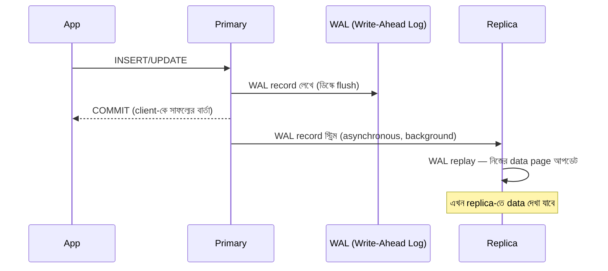
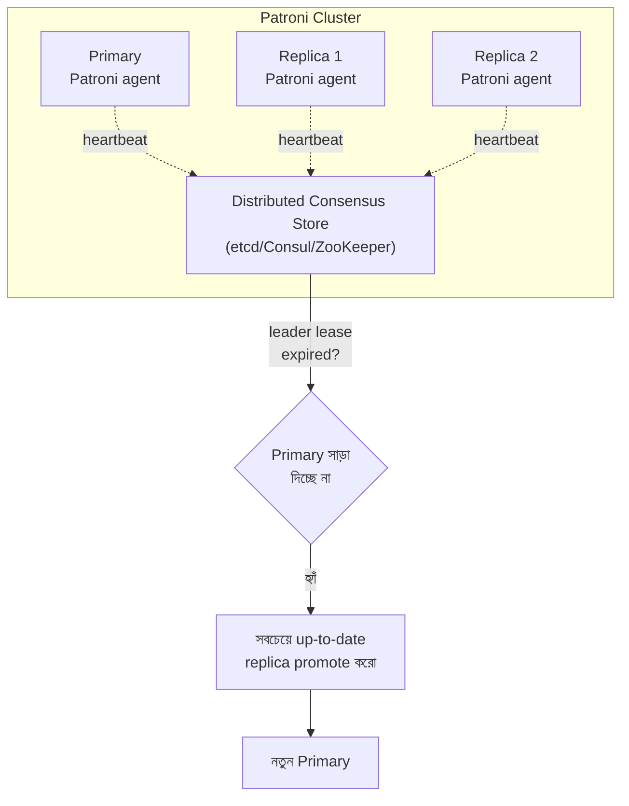
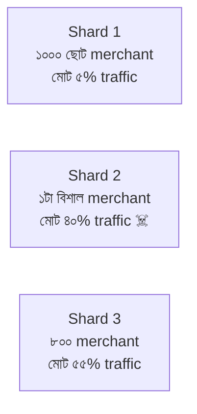
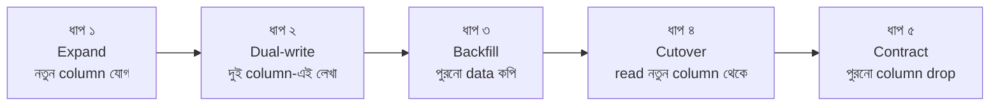
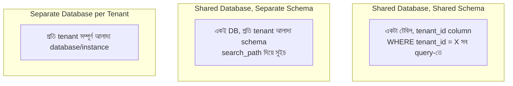

# Module 08 — Database Scaling & Operations

> **Phase C — Data Layer** | পূর্বশর্ত: M07 (PostgreSQL Internals)
> পরের module: M09 (Beyond PostgreSQL)

---

## ১. যে dashboard-এ payment "উধাও" হয়ে যাচ্ছিল

M31-এর payment API-তে read replica যোগ করার পর একটা অদ্ভুত bug report এল: merchant payment create করছে, response-এ `201 Created` পাচ্ছে, কিন্তু **সাথে সাথে** dashboard-এ গিয়ে সেই payment খুঁজে পাচ্ছে না। কয়েক সেকেন্ড পর refresh করলে দেখা যাচ্ছে।

আর্কিটেকচার ছিল ঠিক M31-এ যেভাবে আঁকা হয়েছিল:

```
Write → Primary
Read  → Read Replica (load balanced)
```

Payment create হচ্ছিল primary-তে, commit হয়ে `201` response যাচ্ছিল। কিন্তু dashboard-এর `GET /payments/` request **replica-তে** যাচ্ছিল — যেটা primary থেকে streaming replication দিয়ে data পায়, আর সেই replication-এ সাধারণত ১০-৫০ms lag থাকে, কখনো কখনো (heavy write load-এ) কয়েক সেকেন্ড।

এই সমস্যাটার নাম **read-your-writes consistency violation** — এবং এটা distributed system-এর সবচেয়ে সাধারণ, সবচেয়ে user-facing bug। এই module-এ আমরা দেখব কেন এটা হয়, আর তিনটা ভিন্ন সমাধান কোন পরিস্থিতিতে সঠিক।

---

## ২. Replication — কীভাবে কাজ করে

### ২.১ Streaming Replication — ভেতরে যা ঘটে



**মূল কথা:** PostgreSQL-এর প্রতিটা পরিবর্তন প্রথমে **WAL (Write-Ahead Log)**-এ লেখা হয় — একটা append-only log যা বলে "এই পরিবর্তনটা ঘটেছে।" Crash হলে WAL replay করে data পুনর্গঠন করা যায় (durability-র ভিত্তি)। Replica আসলে primary-র WAL stream **continuously read+replay** করে।

**Asynchronous (ডিফল্ট) বনাম Synchronous:**

```sql
-- Primary-তে postgresql.conf
synchronous_standby_names = ''              -- async (ডিফল্ট) — commit replica-র জন্য অপেক্ষা করে না
synchronous_standby_names = 'replica1'      -- sync — commit replica-র ACK-এর জন্য অপেক্ষা করে
```

| | Async | Sync |
|---|---|---|
| Commit latency | কম (replica-র অপেক্ষা নেই) | বেশি (network round trip) |
| Replication lag | সম্ভব (0-কয়েক সেকেন্ড) | কার্যত শূন্য (data replica-তে পৌঁছেছে তবেই commit) |
| Primary crash হলে data loss | সম্ভব (ack না হওয়া WAL হারাতে পারে) | না (অন্তত এক replica-তে guaranteed) |
| Throughput | বেশি | কম |

**বাস্তব সিদ্ধান্ত:** বেশিরভাগ web app **async** ব্যবহার করে — throughput-এর জন্য। FinTech-এর ledger-এর মতো জায়গায় (যেখানে primary crash-এ কোনো committed transaction হারানো অগ্রহণযোগ্য), **synchronous replication to at least one replica** বিবেচনা করা হয় — খরচ কিছু commit latency।

### ২.২ Replication Lag — মাপা ও বোঝা

```sql
-- Primary-তে
SELECT client_addr, state, sent_lsn, write_lsn, flush_lsn, replay_lsn,
       replay_lag                          -- ⚠️ এটাই আসল সংখ্যা
FROM pg_stat_replication;

-- Replica-তে
SELECT now() - pg_last_xact_replay_timestamp() AS lag;
```

**Lag কেন হয় (bounded না):**
- Network latency (M02) — cross-AZ/cross-region হলে RTT যোগ হয়
- Replica-র নিজের I/O bottleneck — replay করতে ডিস্ক write লাগে
- **Long-running query replica-তে** — PostgreSQL replica-তে replay-কে wait করাতে পারে যদি একটা query সেই data touch করছে (`hot_standby_feedback` নির্ভর করে)
- Primary-তে heavy write burst (M31-এর মাস-শেষের payment spike)

> **Senior Tip:** "Replication lag কত হওয়া উচিত?" — এই প্রশ্নের ভুল উত্তর একটা নির্দিষ্ট সংখ্যা বলা। সঠিক উত্তর: "এটা নির্ভর করে read path-এর consistency requirement-এর উপর। Dashboard analytics-এ কয়েক সেকেন্ড লাগ সহনীয়। Read-your-writes দরকার এমন জায়গায় (payment status check নিজের করা payment-এর) লাগ শূন্য হতে হবে — এবং সেটা lag কমিয়ে অর্জন করা যায় না, architecture দিয়ে সমাধান করতে হয়।"

### ২.৩ Read-Your-Writes সমাধান — তিনটা কৌশল

**কৌশল ১ — Sticky Read (session affinity)**

```python
# একটা merchant-এর নিজের সাম্প্রতিক write-এর পরের কিছুক্ষণ তাকে primary-তে পড়তে দিন
def get_db_for_read(request):
    last_write = cache.get(f"last_write:{request.user.merchant_id}")
    if last_write and (time.time() - last_write) < 5:   # ৫ সেকেন্ড window
        return "primary"
    return "replica"
```

**কৌশল ২ — Response-এ ফেরত দেওয়া object-ই ব্যবহার করা**

```python
# Create endpoint থেকে যা ফেরত দিয়েছেন, সেটাই client-side state-এ রাখুন
# পরের GET call না করেই — সবচেয়ে সহজ ও সবচেয়ে বেশি ব্যবহৃত সমাধান
def create(self, request):
    payment = create_payment(...)                 # primary-তে লেখা
    return Response(PaymentSerializer(payment).data, status=201)
    # client dashboard-এ optimistically এই object-টাই দেখাবে,
    # পরের list refresh-এ replica lag catch up করে ফেলবে ততক্ষণে
```

**কৌশল ৩ — LSN-ভিত্তিক ওয়েট (সবচেয়ে সুনির্দিষ্ট, সবচেয়ে জটিল)**

```python
# Write-এর পর LSN (Log Sequence Number) ধরে রাখা, read করার আগে replica-কে
# সেই LSN-এ পৌঁছানো পর্যন্ত অপেক্ষা করানো (PostgreSQL 10+)
with connection.cursor() as cur:
    cur.execute("SELECT pg_current_wal_lsn()")
    write_lsn = cur.fetchone()[0]

# Replica-তে read করার আগে
cur.execute("SELECT pg_last_wal_replay_lsn() >= %s", [write_lsn])
```

**সিদ্ধান্ত টেবিল:**

| পরিস্থিতি | সমাধান |
|---|---|
| Create করার পরের response-এ object দেখানো | কৌশল ২ — সবচেয়ে সহজ, বেশিরভাগ ক্ষেত্রে যথেষ্ট |
| Create-এর পর কয়েক সেকেন্ডের মধ্যে list refresh | কৌশল ১ — sticky primary read |
| Critical correctness (payment status polling) | primary-তে সরাসরি read, replica ব্যবহারই না এই path-এ |
| Analytics dashboard, রিপোর্ট | কোনো সমাধান দরকার নেই — eventual consistency গ্রহণযোগ্য |

---

## ৩. HA ও Failover — Patroni দিয়ে

### ৩.১ কেন ম্যানুয়াল failover যথেষ্ট না

Primary crash হলে কেউ manual-ভাবে replica-কে primary বানানো পর্যন্ত পুরো system **write-unavailable**। এটা মিনিটে ধরা পড়লেও (on-call human), সেই মিনিটগুলোই আপনার availability budget (M31 §৩(খ)) খেয়ে ফেলে।



**Patroni** primary-র "health" একটা distributed consensus store-এ (etcd সবচেয়ে সাধারণ) lease হিসেবে রাখে। Primary নির্দিষ্ট সময়ে lease renew না করলে (crash/network partition), Patroni স্বয়ংক্রিয়ভাবে সবচেয়ে up-to-date replica-কে promote করে।

**গুরুত্বপূর্ণ trade-off — split-brain প্রতিরোধ:**

```
সমস্যা: Primary আসলে বেঁচে আছে, কিন্তু network partition-এর কারণে
        etcd-এর সাথে যোগাযোগ করতে পারছে না।
        Patroni একে "মৃত" ভেবে replica promote করল।
        এখন দুইটা "primary" আছে — split brain, data ভিন্ন হয়ে যাবে।
```

**সমাধান — fencing:** পুরনো primary যখন আবার যোগাযোগ ফিরে পায়, Patroni তাকে বাধ্যতামূলকভাবে **demote** করে বা পুরোপুরি বন্ধ (STONITH — "Shoot The Other Node In The Head") করে দেয়, তাকে write চালিয়ে যেতে দেয় না।

```yaml
# patroni.yml — সরলীকৃত
postgresql:
  parameters:
    synchronous_commit: "on"
bootstrap:
  dcs:
    ttl: 30                    # ৩০ সেকেন্ড lease
    loop_wait: 10
    retry_timeout: 10
    maximum_lag_on_failover: 1048576   # ১ MB — এর বেশি lag থাকা replica promote হবে না
```

### ৩.২ Application-এর দিক থেকে failover সামলানো

```python
# M02 §৬.২-এর সাথে সংযোগ — DNS-ভিত্তিক failover আর application-এর প্রস্তুতি
DATABASES = {
    "default": {
        "CONN_MAX_AGE": 0,               # PgBouncer সামনে থাকলে (M07 §৯)
        "OPTIONS": {
            "connect_timeout": 5,
            "keepalives": 1,
            "keepalives_idle": 30,
            "keepalives_interval": 10,
            "keepalives_count": 3,        # ৬০ সেকেন্ডে মৃত connection ধরা পড়বে
        },
    }
}
```

Failover চলাকালীন (~৫-৩০ সেকেন্ড) সব write ব্যর্থ হবে। Application-লেভেলে এটা সামলানোর নিয়ম:

```python
from django.db import OperationalError
import time

def write_with_failover_retry(func, max_wait=30):
    start = time.time()
    delay = 0.5
    while time.time() - start < max_wait:
        try:
            return func()
        except OperationalError:
            time.sleep(delay)
            delay = min(delay * 2, 5)     # exponential backoff, ৫ সেকেন্ড ক্যাপ
    raise
```

> এইটা M16 (Resilience Patterns)-এর একটা প্রাথমিক ঝলক — retry with backoff একটা সাধারণ প্যাটার্ন যা এখানেও প্রযোজ্য।

---

## ৪. Partitioning — bloat-এর structural সমাধান (M07-এর ধারাবাহিকতা)

### ৪.১ কেন লাগে

M31-এর estimation মনে করুন — ৭ বছরে ১৩০ বিলিয়ন row। একটা টেবিলে এত row থাকলে:
- Index বিশাল হয়ে যায়, `EXPLAIN`-এ ভালো plan থাকলেও প্রতিটা lookup ধীর (deeper B-Tree)
- VACUUM পুরো টেবিল স্ক্যান করতে ঘণ্টার পর ঘণ্টা লাগতে পারে
- পুরনো data (৭ বছর আগের) প্রায় কখনো read হয় না, কিন্তু এখনো cache/memory চাপ তৈরি করে

**Partitioning সমাধান:** টেবিলটাকে ফিজিক্যালি ছোট ছোট sub-table-এ ভাগ করা, যেগুলো logically একটা টেবিলের মতো আচরণ করে।

### ৪.২ Range Partitioning — Django-তে বাস্তবায়ন

```sql
CREATE TABLE payment (
    id UUID NOT NULL,
    merchant_id BIGINT NOT NULL,
    amount_minor BIGINT NOT NULL,
    status VARCHAR(16) NOT NULL,
    created_at TIMESTAMPTZ NOT NULL,
    PRIMARY KEY (id, created_at)          -- ⚠️ partition key PK-তে থাকতেই হবে
) PARTITION BY RANGE (created_at);

CREATE TABLE payment_2026_07 PARTITION OF payment
    FOR VALUES FROM ('2026-07-01') TO ('2026-08-01');
CREATE TABLE payment_2026_08 PARTITION OF payment
    FOR VALUES FROM ('2026-08-01') TO ('2026-09-01');
```

**Query automaticaly partition-এ route হয় ("partition pruning"):**

```sql
EXPLAIN SELECT * FROM payment WHERE created_at >= '2026-07-15' AND created_at < '2026-07-20';
-- শুধু payment_2026_07 স্ক্যান হবে, বাকি partition ছোঁয়া হবে না
```

**Django-তে partition management — `django-partitioned` বা raw SQL migration:**

```python
# migrations/0042_create_payment_partition.py
from django.db import migrations

class Migration(migrations.Migration):
    operations = [
        migrations.RunSQL(
            sql="""
                CREATE TABLE payment_2026_08 PARTITION OF payment
                FOR VALUES FROM ('2026-08-01') TO ('2026-09-01');
            """,
            reverse_sql="DROP TABLE payment_2026_08;",
        ),
    ]
```

**Automation — নতুন partition আগে থেকে তৈরি রাখা (Celery Beat দিয়ে, M11):**

```python
@shared_task
def ensure_future_partitions():
    """প্রতি মাসে চলবে — সামনের ৩ মাসের partition আগে থেকে বানিয়ে রাখবে।
    এটা না করলে partition না থাকা মাসে INSERT ব্যর্থ হবে — production outage।"""
    for months_ahead in range(1, 4):
        create_monthly_partition_if_not_exists(months_ahead)
```

> **Common Mistake:** পরের মাসের partition তৈরি করতে ভুলে যাওয়া। মাস শেষ হওয়ার মুহূর্তে `INSERT INTO payment ...` ব্যর্থ হতে শুরু করে — "no partition found for row" error, ঠিক মাঝরাতে, কেউ দেখছে না এমন সময়ে। Partition creation automation-এর সাথে সাথে **partition existence-এর উপর monitoring alert** রাখা বাধ্যতামূলক।

### ৪.৩ Old Partition Archive/Drop — instant DELETE

```sql
-- একটা পুরনো partition drop করা মানে সেই মাসের ১ কোটি row মোছা,
-- কিন্তু এটা মেটাডেটা-অনলি অপারেশন — মিলিসেকেন্ডে শেষ, কোনো row-by-row DELETE না,
-- কোনো bloat তৈরি হয় না (M07-এর পুরো VACUUM সমস্যা এখানে অবান্তর)
DROP TABLE payment_2019_01;

-- অথবা আর্কাইভ করতে চাইলে — S3-তে এক্সপোর্ট করে তারপর drop
```

এটা M07-এর `DELETE`-এর bloat সমস্যার একটা **structural সমাধান** — retention policy থাকা টেবিলে (৯০ দিন, ৭ বছর) partition দিয়ে DELETE-কে DROP-এ রূপান্তর করা যায়, যেটা orders of magnitude দ্রুত ও bloat-free।

### ৪.৪ Hash Partitioning — Sharding-এর প্রস্তুতি

```sql
CREATE TABLE payment (...) PARTITION BY HASH (merchant_id);
CREATE TABLE payment_p0 PARTITION OF payment FOR VALUES WITH (modulus 4, remainder 0);
CREATE TABLE payment_p1 PARTITION OF payment FOR VALUES WITH (modulus 4, remainder 1);
-- ইত্যাদি
```

M31-এ shard key হিসেবে `merchant_id` বাছার সিদ্ধান্তটা মনে করুন — hash partitioning এই একই ধারণা, কিন্তু এখনো **একই PostgreSQL instance-এর ভেতরে**। এটা প্রকৃত sharding (আলাদা server) না, কিন্তু ভবিষ্যতে sharding-এ migrate করার একটা মধ্যবর্তী ধাপ, কারণ query pattern-টা আগে থেকেই shard-aware হয়ে যায়।

---

## ৫. Sharding — শেষ অস্ত্র (M31-এর Scaling Ladder-এর ধাপ ৮)

### ৫.১ কখন সত্যিই দরকার

Partitioning একটা instance-এর ভেতরে সাহায্য করে, কিন্তু **single primary-র write throughput সীমা** পার হলে (M31-এর estimation-এ ২,৫০০ TPS-এর মতো ceiling) sharding ছাড়া উপায় নেই — ডেটা সম্পূর্ণ **আলাদা PostgreSQL instance/server**-এ ছড়িয়ে দিতে হয়।

### ৫.২ Shard Key নির্বাচন — সবচেয়ে গুরুত্বপূর্ণ সিদ্ধান্ত

```
ভালো shard key:
  - প্রায় সব query-তে থাকে (WHERE clause-এ) — cross-shard query এড়ানো যায়
  - সমানভাবে বিতরণ করে (কোনো shard hot হয় না)
  - পরিবর্তন হয় না (row-এর shard কখনো বদলাতে হয় না)

merchant_id — M31-এর payment system-এর জন্য প্রায় সঠিক, কারণ:
  ✓ প্রতিটা query merchant-scoped
  ✓ merchant সংখ্যা অনেক, তাই বিতরণ ভালো
  ✗ কিন্তু একটা বিশাল merchant একটা shard-কে hot করে দিতে পারে (hot partition)
```

### ৫.৩ Hot Partition সমস্যা ও সমাধান



**সমাধান:**
1. **Composite key** — `merchant_id + payment_id` দিয়ে hash, যাতে একটা merchant-এর data একাধিক shard-এ ছড়িয়ে যায় (কিন্তু তখন "merchant-এর সব payment" query cross-shard হয়ে যায় — trade-off)
2. **Dedicated shard বড় merchant-এর জন্য** — outlier-দের আলাদা করে সরানো, সাধারণ shard key logic-এর ব্যতিক্রম হিসেবে একটা routing layer বজায় রেখে
3. **Directory-based sharding** — merchant_id → shard mapping একটা lookup table/service-এ রাখা (fixed hash-এর বদলে), যাতে rebalancing সহজ হয়

### ৫.৪ Cross-Shard Query — যা হারাবেন

```python
# ❌ একটা query দিয়ে সব shard-এর payment-এর sum — সম্ভব না সরাসরি
Payment.objects.aggregate(Sum("amount_minor"))

# ✅ scatter-gather — প্রতিটা shard-এ আলাদা query, application-এ merge
totals = []
for shard in ALL_SHARDS:
    totals.append(shard.objects.aggregate(Sum("amount_minor"))["amount_minor__sum"])
grand_total = sum(totals)
```

**যা হারান sharding-এ:**
- Cross-shard JOIN — নেই। Application layer-এ করতে হয়, বা denormalize করতে হয়।
- Cross-shard transaction — distributed transaction লাগে (M15-এ 2PC/Saga), অনেক জটিল ও ধীর।
- `COUNT(*)`, global unique constraint — সব multi-shard query, application-এ মার্জ করতে হয়।

> **Senior Tip:** "কবে shard করবেন?" — junior উত্তর: "যখন data অনেক বড় হয়ে যাবে।" Senior উত্তর: "Data সাইজ sharding-এর কারণ না, **write throughput** কারণ। M31-এর estimation থেকে যদি দেখি single primary-র write capacity (২-৫ হাজার TPS একটা ভালো ইনস্ট্যান্সে) ছাড়িয়ে যাচ্ছি, এবং vertical scaling (আরও বড় instance) আর সাহায্য করছে না, তখনই sharding বিবেচনা করব — কারণ sharding-এর খরচ (cross-shard query হারানো, operational জটিলতা কয়েক গুণ) বিশাল, এবং এটা করার পর ফিরে আসা প্রায় অসম্ভব।"

---

## ৬. Zero-Downtime Migration Playbook

M07 §৭.১-এ `ACCESS EXCLUSIVE` লক সমস্যা দেখানো হয়েছিল। এখন এটাকে একটা **সম্পূর্ণ প্রসেস** হিসেবে দেখব — expand-contract pattern।

### ৬.১ পুরো পাঁচ-ধাপের প্যাটার্ন

**উদাহরণ: একটা column-এর নাম বদলানো (`amount` → `amount_minor`) — এটা একটা "সহজ" কাজ মনে হয়, আসলে সবচেয়ে বিপজ্জনক migration-গুলোর একটা যদি সঠিকভাবে না করা হয়।**



```python
# ধাপ ১ — Expand: নতুন column যোগ (nullable, তাই দ্রুত, ACCESS EXCLUSIVE সংক্ষিপ্ত)
class Migration(migrations.Migration):
    operations = [
        migrations.AddField("payment", "amount_minor", models.BigIntegerField(null=True)),
    ]
```

```python
# ধাপ ২ — Dual-write: কোড deploy — এখন থেকে দুই column-এই লেখা হয়
class Payment(models.Model):
    amount = models.IntegerField()          # পুরনো — এখনো আছে
    amount_minor = models.BigIntegerField(null=True)  # নতুন

    def save(self, *args, **kwargs):
        self.amount_minor = self.amount     # sync রাখা, transition period-এ
        super().save(*args, **kwargs)
```

```python
# ধাপ ৩ — Backfill: ব্যাচে পুরনো row-গুলো আপডেট
# ⚠️ কখনো একটা বিশাল UPDATE না — ছোট ব্যাচে, primary-কে overload না করে
def backfill_amount_minor(apps, schema_editor):
    Payment = apps.get_model("payments", "Payment")
    batch_size = 5000
    qs = Payment.objects.filter(amount_minor__isnull=True).order_by("pk")
    while True:
        batch_ids = list(qs.values_list("pk", flat=True)[:batch_size])
        if not batch_ids:
            break
        Payment.objects.filter(pk__in=batch_ids).update(
            amount_minor=F("amount")
        )
        time.sleep(0.1)   # primary-কে শ্বাস নিতে দেওয়া, replication lag নিয়ন্ত্রণে রাখা
```

```python
# ধাপ ৪ — Cutover: কোড deploy — এখন read নতুন column থেকে, dual-write বন্ধ
class Payment(models.Model):
    amount_minor = models.BigIntegerField()   # এখন NOT NULL constraint যোগ করা যায় (M07 §৭.১-এর নিয়মে)
    # amount ফিল্ড এখনো database-এ আছে, কিন্তু ব্যবহার বন্ধ
```

```python
# ধাপ ৫ — Contract: এক বা দুই সপ্তাহ পর (নিশ্চিত হয়ে যে rollback লাগবে না),
# পুরনো column drop
class Migration(migrations.Migration):
    operations = [
        migrations.RemoveField("payment", "amount"),
    ]
```

**কেন এত ধাপ, সরাসরি `RENAME COLUMN` কেন না:**

```sql
ALTER TABLE payment RENAME COLUMN amount TO amount_minor;  -- দ্রুত, কিন্তু...
```

এই একলাইন migration ফাস্ট, কিন্তু **atomic deploy দাবি করে** — migration আর code deploy একই মুহূর্তে হতে হবে। বাস্তবে migration আর deploy আলাদা সময়ে ঘটে (rolling deployment-এ পুরনো ও নতুন কোড কিছুক্ষণ **একসাথে** চলে — M20-এ বিস্তারিত)। পুরনো কোড `amount` column খুঁজবে, যেটা আর নেই — সাথে সাথে সব request `500 Internal Server Error`।

> **Senior Tip:** "Zero-downtime migration মানে কি migration নিজে দ্রুত হওয়া?" — না। এর মানে **migration আর deployment-এর মধ্যে backward-compatible থাকা**। Rolling deployment-এ পুরনো ও নতুন pod একই সময়ে একই database ব্যবহার করে — migration-কে সেই উভয় ভার্শনের সাথেই কাজ করতে হবে, নাহলে deployment window-এ error rate spike হবে।

### ৬.২ দ্রুত রেফারেন্স — কোন migration নিরাপদ, কোনটা না

| Migration | নিরাপদ? | কারণ |
|---|---|---|
| Nullable column যোগ | ✅ | Backward compatible, দ্রুত |
| Column drop | ⚠️ | পুরনো কোড এখনো ব্যবহার করছে কি না নিশ্চিত হোন — expand-contract-এর শেষ ধাপ |
| Column rename | ❌ সরাসরি না | Expand-contract লাগবে |
| NOT NULL constraint যোগ | ⚠️ | `NOT VALID` + পরে `VALIDATE` (M07 §৭.১) |
| Index যোগ | ⚠️ | `CREATE INDEX CONCURRENTLY` (write ব্লক করে না) |
| টাইপ পরিবর্তন | ❌ | সাধারণত পুরো টেবিল rewrite — expand-contract |
| টেবিল drop | ⚠️ | কোনো কোড আর reference করছে না নিশ্চিত হওয়ার পর |
| Foreign key যোগ | ⚠️ | `NOT VALID` + `VALIDATE CONSTRAINT` |

---

## ৭. Multi-Tenancy Design

### ৭.১ তিনটা মডেল



| | Shared Schema | Separate Schema | Separate DB |
|---|---|---|---|
| Isolation | কম — কোডের ভুলে leak সম্ভব (M06-এর IDOR মনে করুন) | মাঝারি | সর্বোচ্চ |
| Operational জটিলতা | সবচেয়ে কম | মাঝারি | সবচেয়ে বেশি — হাজার হাজার DB চালানো কঠিন |
| Cost efficiency | সর্বোচ্চ (resource শেয়ার) | ভালো | সবচেয়ে কম (idle capacity প্রতি tenant-এ) |
| Noisy neighbor | সমস্যা — এক tenant সবাইকে প্রভাবিত করতে পারে | আংশিক সুরক্ষা | সম্পূর্ণ সুরক্ষা |
| Migration চালানো | একবার, সব tenant-এ | প্রতি schema-তে (script দিয়ে) | প্রতি DB-তে |
| কখন উপযুক্ত | B2B SaaS, অনেক ছোট tenant | মাঝারি সংখ্যক tenant, isolation দরকার | Enterprise/regulatory customer, কম সংখ্যক বড় tenant |

**বেশিরভাগ B2B SaaS/fintech-এর জন্য বাস্তব সুপারিশ:** **Shared schema** দিয়ে শুরু করুন (M06-এ দেখানো `get_queryset()` tenant filtering সহ), কারণ এটা migration/operation সবচেয়ে সহজ। যদি একটা enterprise customer regulatory কারণে সম্পূর্ণ isolation চায় (data residency, তাদের নিজস্ব encryption key), সেই **নির্দিষ্ট** customer-কে separate DB দিন — সবাইকে না।

### ৭.২ Shared Schema-তে Row-Level Security (RLS) — কোড-level filtering-এর ব্যাকআপ

M06-এ দেখানো হয়েছিল `get_queryset()` tenant filter মিস হলে data leak হয়। PostgreSQL-এর নিজস্ব **Row-Level Security** এটার একটা database-level নিরাপত্তা জাল:

```sql
ALTER TABLE payment ENABLE ROW LEVEL SECURITY;

CREATE POLICY tenant_isolation ON payment
    USING (merchant_id = current_setting('app.current_merchant_id')::bigint);
```

```python
# প্রতিটা request-এর শুরুতে (middleware-এ)
with connection.cursor() as cur:
    cur.execute("SET app.current_merchant_id = %s", [request.user.merchant_id])
# এখন এই connection-এ চলা সব query স্বয়ংক্রিয়ভাবে merchant_id ফিল্টার হবে,
# এমনকি ডেভেলপার যদি ভুলে filter দিতে ভুলে যান
```

> **Senior Tip:** RLS-কে "defense in depth" হিসেবে ভাবুন — `get_queryset()` filtering প্রধান লাইন, RLS একটা নিরাপত্তা জাল যদি প্রথমটা ব্যর্থ হয়। কিন্তু RLS-এর নিজস্ব খরচ আছে — প্রতিটা query-তে policy evaluation, আর `current_setting` সঠিকভাবে সেট না হলে (connection pooling-এর সাথে সাবধান — PgBouncer transaction mode-এ session variable সমস্যা, M07 §৮.৩) RLS নিজেই bug-এর উৎস হতে পারে। এটা compliance-critical ডেটার (payment, PII) জন্য একটা বিবেচ্য বিষয়, সব জায়গায় default না।

---

## ৮. Money, Time & Locale — schema design-এর প্রাথমিক সিদ্ধান্ত

### ৮.১ Money — M31-এ শুরু হওয়া নিয়মের সম্পূর্ণ প্রেক্ষাপট

```python
# ❌ কখনো না
amount = models.FloatField()

# ✅ সঠিক দুইটা পদ্ধতি
amount_minor = models.BigIntegerField()      # minor unit-এ integer (পয়সা/সেন্ট)
# অথবা
amount = models.DecimalField(max_digits=20, decimal_places=4)  # NUMERIC, exact
```

**কেন `Float` কখনো না:** IEEE-754 floating point binary fraction দিয়ে decimal সংখ্যা approximate করে। `0.1 + 0.2 == 0.30000000000000004`। টাকার হিসাবে এই ধরনের rounding error জমতে জমতে সত্যিকারের অমিল তৈরি করে — আর সবচেয়ে খারাপ ব্যাপার, এটা মাঝেমধ্যে ধরা পড়ে (নির্দিষ্ট কম্বিনেশনে), তাই debug করা দুঃস্বপ্ন।

**Integer minor unit বনাম Decimal — কখন কোনটা:**

| | Integer minor unit | `Decimal`/`NUMERIC` |
|---|---|---|
| Arithmetic গতি | দ্রুততম (plain integer op) | সামান্য ধীর |
| Rounding bug ঝুঁকি | নেই (division ছাড়া) | কম, কিন্তু আছে |
| Currency যেখানে minor unit অস্পষ্ট (JPY-তে কোনো decimal নেই, BHD-তে ৩ decimal) | Currency-নির্দিষ্ট multiplier লাগবে | সরাসরি কাজ করে |
| Multi-currency system | জটিল (প্রতি currency আলাদা scale factor) | সহজ |

**FinTech বাস্তবতা:** M31-এর payment example integer minor unit বেছেছিল কারণ single-currency-প্রধান আর arithmetic speed গুরুত্বপূর্ণ ছিল। Multi-currency ledger-এ (M28) `NUMERIC` বেশি প্রচলিত কারণ per-currency scale factor ম্যানেজ করা জটিল হয়ে যায়।

### ৮.২ সময় — `timestamptz` সবসময়, exception নেই

```python
# settings.py
USE_TZ = True         # Django-তে এটা কখনো False করবেন না প্রোডাকশনে

class Payment(models.Model):
    created_at = models.DateTimeField(auto_now_add=True)   # DB-তে timestamptz হিসেবে সেভ হবে
```

```sql
-- PostgreSQL-এ
created_at TIMESTAMPTZ NOT NULL DEFAULT now()   -- ✅ timezone-aware, UTC-তে স্টোর হয়
-- created_at TIMESTAMP                          -- ❌ কখনো না — timezone অস্পষ্ট
```

**কেন `TIMESTAMP` (timezone ছাড়া) বিপজ্জনক:** এটা স্টোর করে একটা "wall clock" সময়, কোনো timezone reference ছাড়া। যদি আপনার app server আর DB server ভিন্ন timezone-এ থাকে (বা DST bug), `2026-07-23 14:00:00` মানে অস্পষ্ট — কোন timezone-এ? `TIMESTAMPTZ` সবসময় UTC-তে স্টোর করে, display-এর সময় client-এর timezone-এ কনভার্ট হয় — কোনো অস্পষ্টতা নেই।

**DST (Daylight Saving Time)-এর ফাঁদ — recurring event/cron-এ:**

```python
# ❌ বিপজ্জনক — "প্রতিদিন সকাল ৯টায়" local time-ভিত্তিক হলে DST transition-এ
#    সেই দিন হয় দুইবার চলবে, নয়তো একবারও না
CELERY_BEAT_SCHEDULE = {
    "daily-report": {"schedule": crontab(hour=9, minute=0)},  # কোন timezone?
}

# ✅ স্পষ্ট timezone সহ, এবং UTC-তে চিন্তা করার অভ্যাস
CELERY_TIMEZONE = "UTC"
```

### ৮.৩ Leap Second — awareness-level

PostgreSQL/Unix timestamp leap second উপেক্ষা করে (POSIX time একটা দিনকে ঠিক ৮৬,৪০০ সেকেন্ড ধরে)। এটা ৯৯.৯৯% ব্যবহারকারীর জন্য অপ্রাসঙ্গিক, কিন্তু high-frequency trading বা precise scientific timing-এ প্রাসঙ্গিক হতে পারে — সচেতন থাকুন এমন সিস্টেমে, deep-dive না করলেও চলবে।

---

## ৯. Audit Log ও Soft Delete

### ৯.১ Audit Log — M05-এর signal সতর্কতার সরাসরি প্রয়োগ

M05-এ দেখানো হয়েছিল signal `bulk_update`/`update()`-এ ফায়ার করে না — তাই audit trail-এর জন্য signal নির্ভরযোগ্য না। সঠিক প্যাটার্ন:

```python
class AuditLog(models.Model):
    table_name = models.CharField(max_length=64)
    row_id = models.CharField(max_length=64)
    action = models.CharField(max_length=16)   # INSERT/UPDATE/DELETE
    old_values = models.JSONField(null=True)
    new_values = models.JSONField(null=True)
    changed_by = models.CharField(max_length=64, null=True)
    changed_at = models.DateTimeField(auto_now_add=True)
```

**Application-level (service function-এ explicit) — M05-এর সুপারিশ অনুযায়ী:**

```python
def update_payment_status(payment_id, new_status, actor):
    with transaction.atomic():
        payment = Payment.objects.select_for_update().get(pk=payment_id)
        old_status = payment.status
        payment.status = new_status
        payment.save()
        AuditLog.objects.create(
            table_name="payment", row_id=str(payment_id), action="UPDATE",
            old_values={"status": old_status}, new_values={"status": new_status},
            changed_by=actor,
        )
```

**Database-level (trigger-ভিত্তিক) — bypass-proof, কিন্তু কম flexible:**

```sql
CREATE OR REPLACE FUNCTION audit_trigger() RETURNS TRIGGER AS $$
BEGIN
    INSERT INTO audit_log (table_name, row_id, action, old_values, new_values, changed_at)
    VALUES (TG_TABLE_NAME, COALESCE(NEW.id, OLD.id)::text, TG_OP,
            to_jsonb(OLD), to_jsonb(NEW), now());
    RETURN COALESCE(NEW, OLD);
END;
$$ LANGUAGE plpgsql;

CREATE TRIGGER payment_audit AFTER INSERT OR UPDATE OR DELETE ON payment
    FOR EACH ROW EXECUTE FUNCTION audit_trigger();
```

**সিদ্ধান্ত:** trigger **কোনো code path বাইপাস করা যায় না** (`bulk_update`, raw SQL, admin — সব ধরা পড়ে) — M07-এর "database constraint bypass করা যায় না" নীতির সম্প্রসারণ। কিন্তু trigger প্রতিটা write-এ overhead যোগ করে এবং debug করা কঠিন (application code-এ দেখা যায় না)। **Compliance-critical টেবিলে (payment, ledger) trigger পছন্দনীয়; সাধারণ business logic-এ application-level যথেষ্ট এবং বেশি maintainable।**

### ৯.২ Soft Delete — M05-এর `base_manager` সতর্কতার পূর্ণ প্রেক্ষাপট

```python
class SoftDeleteQuerySet(models.QuerySet):
    def delete(self):
        return self.update(deleted_at=timezone.now())   # আসল DELETE না

class Payment(models.Model):
    deleted_at = models.DateTimeField(null=True, blank=True)

    objects = SoftDeleteManager.from_queryset(SoftDeleteQuerySet)()  # শুধু active
    all_objects = models.Manager()                                   # সব, deleted সহ

    class Meta:
        base_manager_name = "all_objects"   # M05 §৬-এ ব্যাখ্যা করা কারণে বাধ্যতামূলক
        indexes = [
            models.Index(fields=["merchant"], condition=Q(deleted_at__isnull=True),
                         name="idx_active_payment"),   # M07-এর partial index কৌশল
        ]
```

**Soft delete-এর real trade-off:**

| সুবিধা | খরচ |
|---|---|
| Accidental delete থেকে পুনরুদ্ধার | প্রতিটা query-তে `WHERE deleted_at IS NULL` মনে রাখতে হবে |
| Audit/compliance-এর জন্য history | Unique constraint জটিল হয় (soft-deleted row-এর সাথে নতুন row-এর conflict) |
| Foreign key relationship অক্ষত থাকে | টেবিল কখনো ছোট হয় না, VACUUM/index bloat বাড়ে |

**Unique constraint-এর ফাঁদ:**

```python
# ❌ merchant একটা email দিয়ে soft-delete করে সেই email দিয়ে আবার signup করতে পারবে না
class Meta:
    constraints = [models.UniqueConstraint(fields=["email"], name="uniq_email")]

# ✅ partial unique constraint — শুধু active row-এর মধ্যে unique
class Meta:
    constraints = [
        models.UniqueConstraint(fields=["email"], condition=Q(deleted_at__isnull=True),
                                name="uniq_active_email"),
    ]
```

> **Senior Tip:** "Soft delete না hard delete?" — এই প্রশ্নে সরাসরি একটা বেছে বলবেন না। বলুন: "নির্ভর করে regulatory requirement আর recovery প্রয়োজনের উপর। Payment/ledger-এর মতো জায়গায় soft delete (বা আসলে delete-ই না, শুধু status change, M28-এ ledger immutability) বাধ্যতামূলক — GDPR-এর 'right to be forgotten'-এর সাথে conflict করলে সেটা আলাদাভাবে handle করতে হয় (M26), pseudonymization দিয়ে। কিন্তু session/cache-এর মতো ephemeral ডেটায় soft delete-এর কোনো মানে নেই, hard delete-ই সঠিক।"

---

## ১০. Backup ও Disaster Recovery — সংক্ষিপ্ত ভিত্তি

### ১০.১ RPO ও RTO — M31-এর availability আলোচনার সম্প্রসারণ

```
RPO (Recovery Point Objective) — কত ডেটা হারানো গ্রহণযোগ্য?
  "শেষ ৫ মিনিটের ডেটা হারানো যাবে" — মানে backup/replication অন্তত প্রতি ৫ মিনিটে

RTO (Recovery Time Objective) — কত সময়ে সিস্টেম আবার চালু করা যাবে?
  "৩০ মিনিটের মধ্যে recover" — মানে backup restore + verification ৩০ মিনিটে শেষ করার সক্ষমতা
```

### ১০.২ PITR (Point-In-Time Recovery)

```
Base backup (দৈনিক, pg_basebackup) + WAL archive (ক্রমাগত)
       ↓
যেকোনো মুহূর্তে restore করা যায় — base backup থেকে শুরু করে WAL replay
করে ঠিক সেই timestamp পর্যন্ত পৌঁছানো
```

```bash
# Base backup
pg_basebackup -D /backup/base -Ft -z -P

# WAL archiving — postgresql.conf
archive_mode = on
archive_command = 'aws s3 cp %p s3://backups/wal/%f'

# Recovery — একটা নির্দিষ্ট সময়ে ফিরে যাওয়া (যেমন accidental DROP TABLE-এর আগে)
recovery_target_time = '2026-07-23 14:35:00'
```

**PITR-এর বাস্তব ব্যবহার:** কেউ ভুলে production-এ `DROP TABLE payment` চালিয়ে ফেললে (হ্যাঁ, এটা ঘটে), PITR দিয়ে ঠিক সেই ভুলের **এক সেকেন্ড আগে** ফিরে যাওয়া যায় — পুরো ডাটাবেস পুনর্গঠন করে।

> **Senior Tip:** "Backup আছে" বলা যথেষ্ট না। Interview-এ বলুন: "আমাদের backup আছে, কিন্তু আসল প্রশ্ন হলো — আমরা কি এটা নিয়মিত **restore করে টেস্ট করি**? একটা backup যেটা কখনো restore টেস্ট হয়নি, সেটা backup না, সেটা একটা অনুমান। DR drill (M25-এ বিস্তারিত) কোয়ার্টারলি করা উচিত, actual RTO মেপে দেখা উচিত documented RTO-র সাথে মেলে কি না।"

---

## ১১. Interview Section

### প্রশ্ন ১ (Senior) — "Read replica যোগ করার পর একজন user বলছে তার সাম্প্রতিক action দেখা যাচ্ছে না। কেন, এবং কীভাবে সমাধান করবেন?"

**🌟 Senior/Staff Answer**
> "এটা classic read-your-writes consistency violation। Write primary-তে গেছে এবং commit হয়ে গেছে, কিন্তু ব্যবহারকারীর পরের read replica-তে গেছে, যেখানে asynchronous streaming replication এখনো সেই পরিবর্তন replay করেনি — replication lag।
>
> এটা bug না, এটা **eventual consistency-র প্রত্যাশিত আচরণ** যা আমরা choice করেছি availability/throughput-এর জন্য (CAP theorem-এর ব্যবহারিক প্রকাশ, M15)। সমাধান নির্ভর করে ঠিক কোন UX-এ সমস্যা হচ্ছে তার উপর:
>
> যদি এটা 'create করার পর সাথে সাথে সেই object দেখা' হয়, সবচেয়ে সহজ সমাধান — create response-এই সেই object ফেরত দেওয়া, client-side সেটাকেই optimistically দেখানো, পরের list refresh না করা পর্যন্ত।
>
> যদি এটা 'write-এর পর dashboard-এ list refresh' হয়, একটা sticky-read window রাখব — merchant-এর নিজের সাম্প্রতিক write-এর কয়েক সেকেন্ড পরে তার read primary-তে রুট করা।
>
> যদি এটা সত্যিই critical correctness (payment status polling), সেই read path-এই replica ব্যবহার করব না — সরাসরি primary।
>
> **যা করব না:** synchronous replication দিয়ে lag শূন্য করার চেষ্টা — এতে প্রতিটা commit-এর latency বেড়ে যাবে সব ব্যবহারকারীর জন্য, শুধু কিছু নির্দিষ্ট UX সমস্যার জন্য পুরো সিস্টেমের throughput কমানো ভুল trade-off।"

---

### প্রশ্ন ২ (Staff / Production Incident) — "মাসের প্রথম দিন সকাল ১২:০১-এ সব payment INSERT ব্যর্থ হতে শুরু করল। কারণ কী হতে পারে?"

**🌟 Senior/Staff Answer**
> "টাইমিং একদম নির্দিষ্ট — মাস বদলানোর ঠিক মুহূর্তে। এটা প্রায় নিশ্চিতভাবে **range-partitioned টেবিলে পরের মাসের partition তৈরি করতে ভুলে যাওয়া।** PostgreSQL declarative partitioning-এ, যদি একটা row-এর জন্য কোনো matching partition না থাকে, `INSERT` সাথে সাথে ব্যর্থ হয় — 'no partition of relation found for row' error, সাইলেন্টলি না, কিন্তু ঠিক ততটাই বিপর্যয়কর কারণ এটা মাঝরাতে ঘটে যখন কেউ দেখছে না।
>
> **তাৎক্ষণিক প্রশমন:** পরের মাসের partition এখনই তৈরি করা:
> ```sql
> CREATE TABLE payment_2026_08 PARTITION OF payment
>     FOR VALUES FROM ('2026-08-01') TO ('2026-09-01');
> ```
> এটা দ্রুত (মেটাডেটা-only), সব pending INSERT সাথে সাথে সফল হতে শুরু করবে retry-তে।
>
> **Root cause:** partition creation automation (Celery Beat task) হয় চলেনি, নয়তো সামনের partition তৈরির লজিকে bug ছিল, অথবা automation-এর নিজের একটা dependency ব্যর্থ হয়েছিল নীরবে।
>
> **প্রতিরোধ, দুই স্তরে:** (১) partition creation automation সামনের ৩ মাসের জন্য এগিয়ে থাকা উচিত, শুধু ১ মাস না — কোনো একবার miss হলেও বাফার থাকবে। (২) **partition existence-এর উপর সরাসরি monitoring alert** — 'আগামী ৭ দিনের মধ্যে দরকারি পরের partition আছে কি না' এই চেক-টা automation-এর সাফল্যের উপর নির্ভর না করে independently চালানো, কারণ automation নিজেই silently ব্যর্থ হতে পারে।
>
> এই ঘটনাটা একটা ভালো উদাহরণ কেন 'automation করেছি' যথেষ্ট না — automation-এর **নিজের সাফল্য** monitor করতে হয়, নাহলে automation নিজেই একটা single point of failure হয়ে যায় যেটা invisible।"

---

### প্রশ্ন ৩ (Coding / Migration Review) — "এই migration review করুন — production-এ safe কি না।"

```python
class Migration(migrations.Migration):
    operations = [
        migrations.RenameField("payment", "amt", "amount_minor"),
        migrations.AlterField("payment", "amount_minor",
            field=models.BigIntegerField()),
    ]
```

**🌟 Senior Answer**
> "এটা production-এ **safe না**, দুইটা কারণে:
>
> **১. `RenameField` atomic deploy দাবি করে।** Rolling deployment-এ পুরনো pod (যেটা এখনো `amt` field reference করে) আর নতুন pod (যেটা `amount_minor` চায়) একই সময়ে একই database-এ চলবে migration ও deploy-এর মাঝের window-এ। পুরনো pod-এর কোড `amt` column খুঁজবে যেটা migration-এর পরে আর নেই — সব request-এ 500 error, ঠিক deploy চলাকালীন।
>
> **২. `AlterField` টাইপ-নির্ভর — যদি underlying type সত্যিই বদলায়** (যেমন `IntegerField` → `BigIntegerField`), PostgreSQL-এ এটা টেবিল rewrite দাবি করতে পারে, `ACCESS EXCLUSIVE` লক নিয়ে (M07 §৭.১)। যদি টেবিল বড় হয়, এটা মিনিটের জন্য পুরো site down করে দিতে পারে।
>
> **সঠিক পদ্ধতি — expand-contract:**
> ```
> Deploy 1 (migration + code): নতুন column amount_minor যোগ (nullable), 
>                                কোড উভয় column-এই লেখে (dual-write)
> Background job:               পুরনো row backfill (ব্যাচে, M08 §৬.১)
> Deploy 2 (code only):         কোড শুধু amount_minor থেকে read করে
> Deploy 3 (migration):         amount_minor-এ NOT NULL (NOT VALID + VALIDATE)
> Deploy 4 (migration, ১-২ সপ্তাহ পর): পুরনো amt column drop
> ```
>
> এটা বেশি ধাপ, বেশি সময় লাগে, কিন্তু প্রতিটা ধাপ **স্বাধীনভাবে নিরাপদ ও rollback-যোগ্য** — যদি deploy 1-এ কোনো সমস্যা দেখা যায়, rollback করলেও পুরনো কোড এখনো কাজ করবে কারণ `amt` column এখনো আছে এবং সিঙ্কে আছে।
>
> **CI-তে এটা ধরার উপায়:** `django-migration-linter` বা অনুরূপ টুল ব্যবহার করা যা `RenameField`, `AlterField` (টাইপ পরিবর্তনসহ), `RemoveField` — এই ধরনের migration flag করে মানুষের review-এর জন্য, স্বয়ংক্রিয় merge হওয়ার আগে।"

---

### প্রশ্ন ৪ (Architecture Decision) — "আমরা কি shared schema নাকি database-per-tenant বেছে নেব একটা নতুন B2B fintech প্রোডাক্টের জন্য?"

**🌟 Senior/Staff Answer**
> "আমার ডিফল্ট শুরু **shared schema with row-level tenant filtering**, কারণ এটা migration/operational overhead সবচেয়ে কম রাখে যখন customer সংখ্যা এখনো অনিশ্চিত। কিন্তু এখানে fintech context-টা গুরুত্বপূর্ণ — কয়েকটা প্রশ্ন করব:
>
> ১. **কোনো enterprise customer কি data residency বা dedicated infrastructure দাবি করবে (contract-এ)?** যদি হ্যাঁ, সেই নির্দিষ্ট customer-দের জন্য database-per-tenant একটা opt-in tier হিসেবে রাখা যায়, সবার জন্য default না।
> ২. **Regulatory audit-এ কি demonstrable isolation প্রমাণ করতে হবে** (PCI-DSS-এর মতো)? তাহলে RLS (§৭.২) একটা মধ্যবর্তী সমাধান — শুধু application-level filtering-এর চেয়ে শক্তিশালী প্রমাণ, database-per-tenant-এর অপারেশনাল খরচ ছাড়া।
> ৩. **Noisy neighbor ঝুঁকি কতটা বাস্তব?** যদি একটা customer-এর batch job পুরো shared DB-কে প্রভাবিত করতে পারে — resource limit/query timeout দিয়ে সেটা mitigate করা যায় সম্পূর্ণ isolation ছাড়াই।
>
> **আমার সুপারিশ:** shared schema + strict `get_queryset()` filtering (M06) + RLS as defense-in-depth (§৭.২) + প্রতিটা multi-tenant endpoint-এ automated cross-tenant leak test (M06-এর interview প্রশ্ন ২)। শুধু নির্দিষ্ট enterprise customer-দের জন্য (যাদের কাছ থেকে explicit contractual দাবি এসেছে) dedicated database অফার করব, premium pricing tier হিসেবে — যাতে সেই operational খরচ ব্যবসায়িকভাবেও justified হয়, শুধু technical caution না।"

---

## ১২. হাতে-কলমে অনুশীলন

**১ — Replication lag পরিমাপ (৩০ মিনিট, Docker দিয়ে)**
একটা primary + replica সেটআপ করুন (`docker-compose` দিয়ে সহজে করা যায়)। Primary-তে দ্রুত লিখতে থাকুন (loop-এ INSERT), সাথে সাথে replica-তে read করে দেখুন lag কত। `pg_stat_replication` থেকে `replay_lag` পড়ুন।

**২ — Partition pruning verify (২০ মিনিট)**
একটা range-partitioned টেবিল বানান ৩ মাসের partition দিয়ে। একটা নির্দিষ্ট মাসের range-এ query করে `EXPLAIN`-এ দেখুন শুধু একটা partition scan হচ্ছে (partition pruning কাজ করছে)।

**৩ — Zero-downtime migration সিমুলেট (৩০ মিনিট)**
একটা column rename করুন expand-contract pattern মেনে, প্রতিটা ধাপের মাঝে ইচ্ছাকৃতভাবে "পুরনো কোড" (আগের commit) চালিয়ে নিশ্চিত করুন এটা এখনো কাজ করছে।

**৪ — Soft delete + unique constraint ফাঁদ (২০ মিনিট)**
একটা soft-delete model বানান সাধারণ `UniqueConstraint`-সহ। একটা row soft-delete করুন, তারপর একই value দিয়ে নতুন row বানানোর চেষ্টা করুন — constraint violation দেখুন। তারপর `condition=Q(deleted_at__isnull=True)` যোগ করে ঠিক করুন।

---

## ১৩. মূল কথা

1. **Read-your-writes violation** async replication-এর প্রত্যাশিত ফল — lag কমিয়ে না, architecture দিয়ে সমাধান করুন (response object ব্যবহার, sticky read, বা সেই path-এ replica এড়ানো)।
2. **Synchronous replication data-loss প্রতিরোধ করে কিন্তু commit latency বাড়ায়** — ledger-এর মতো জায়গায় trade-off বিবেচনা করুন।
3. **Patroni fencing দিয়ে split-brain এড়ায়** — পুরনো primary ফিরে এলে জোর করে demote করা বাধ্যতামূলক।
4. **Partitioning bloat-এর structural সমাধান** — DROP partition মিলিসেকেন্ডে, DELETE row-by-row-এর VACUUM বোঝা ছাড়াই।
5. **Partition creation ভুলে যাওয়া একটা silent production outage** — automation-এর নিজের সাফল্যের উপর আলাদা monitoring লাগবে।
6. **Sharding শেষ অস্ত্র** — শুধু single-primary write throughput সীমা ছাড়ালে, আর cross-shard query/transaction হারানোর প্রস্তুতি নিয়ে।
7. **Zero-downtime migration মানে expand-contract** — migration আর deployment আলাদা সময়ে ঘটে, backward compatibility বাধ্যতামূলক পুরো transition window জুড়ে।
8. **Shared schema ডিফল্ট শুরু বিন্দু multi-tenancy-তে**, dedicated DB শুধু নির্দিষ্ট contractual/regulatory দাবিতে। RLS defense-in-depth হিসেবে।
9. **Money integer minor unit বা `Decimal`, কখনো `Float` না।** সময় সবসময় `TIMESTAMPTZ`, DST-aware cron scheduling।
10. **Audit trail signal-নির্ভর না** — `bulk_update` মিস করবে। Application-level explicit logging বা DB trigger, compliance-critical ডেটায় trigger পছন্দনীয়।
11. **Backup যেটা restore টেস্ট করা হয়নি, সেটা backup না** — RPO/RTO ডকুমেন্ট করুন এবং নিয়মিত drill করে যাচাই করুন।

---

## পরের Module

**M09 — Beyond PostgreSQL।** M07-M08 জুড়ে আমরা PostgreSQL-কে ধরে নিয়েছি সঠিক পছন্দ। পরের module-এ প্রশ্ন করব — কখন এটা সত্যিই সঠিক না। B-Tree বনাম LSM Tree-এর মৌলিক trade-off (write amplification বনাম read amplification), কখন Cassandra/ScyllaDB, কখন MongoDB (এবং কখন না), ClickHouse/TimescaleDB (M30-এর analytics-এর প্রস্তুতি), object storage, vector DB — আর সবচেয়ে গুরুত্বপূর্ণ, "polyglot persistence"-এর লুকানো operational খরচ, যেটা প্রায়ই দেখানো হয় না conference talk-এ।
