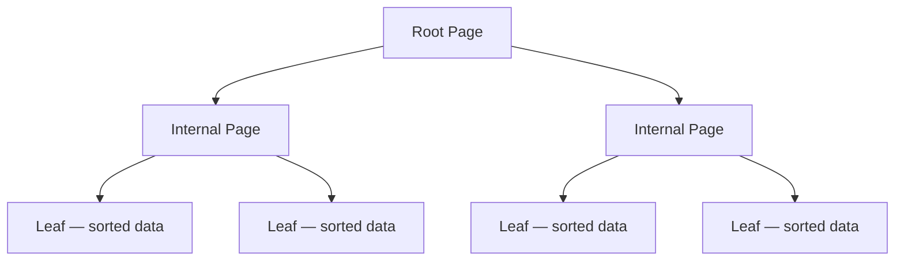
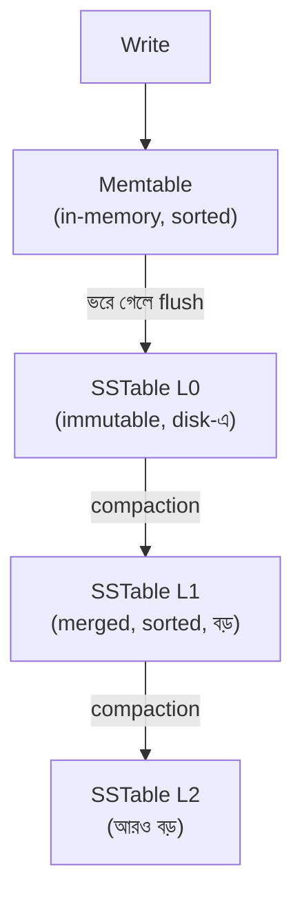
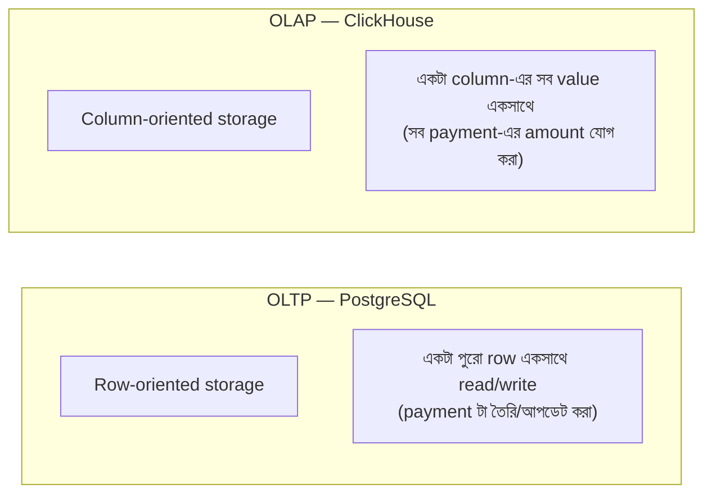
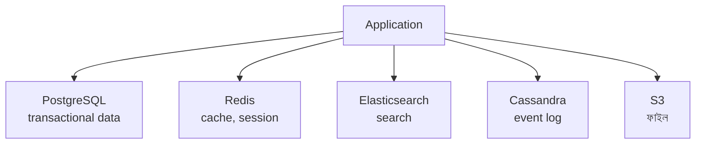

# Module 09 — Beyond PostgreSQL: কখন অন্য Datastore

> **Phase C — Data Layer** | পূর্বশর্ত: M07, M08
> পরের module: M10 (Redis Deep)

---

## ১. যে টিম MongoDB নিয়ে ফিরে এল PostgreSQL-এ

একটা টিম ২০২৩ সালে একটা নতুন payment platform শুরু করল। ডেভেলপার-রা তখন "NoSQL scales, SQL doesn't" বলে একটা conference talk দেখে এসেছিল। তারা MongoDB বেছে নিল — "schema flexibility লাগবে, payment মেটাডেটা variable structure-এর।"

আঠারো মাস পর তারা একটা পূর্ণ migration চালাল — **MongoDB থেকে PostgreSQL-এ ফিরে**। কারণ:

১. **Multi-document transaction দরকার হয়ে গেল।** Payment create করার সাথে সাথে merchant balance আপডেট, ledger entry তৈরি — এই তিনটা atomic হতে হবে। MongoDB-তে multi-document transaction আছে (৪.০+), কিন্তু performance penalty উল্লেখযোগ্য এবং তাদের access pattern-এর সাথে খাপ খায়নি — তারা কার্যত PostgreSQL-এর ACID guarantee-ই চাইছিল, শুধু ভিন্ন syntax-এ।

২. **Join-এর মতো query বারবার লাগছিল।** "প্রতিটা merchant-এর গত ৩০ দিনের payment, তাদের refund-সহ, merchant tier অনুযায়ী group করা" — MongoDB-তে এটা `$lookup` aggregation দিয়ে সম্ভব, কিন্তু PostgreSQL-এ এক লাইনের JOIN যা MongoDB-তে জটিল pipeline stage-এর সিরিজ হয়ে যাচ্ছিল, এবং ধীর।

৩. **"Schema flexibility" আসলে ব্যবহারই হয়নি।** ছয় মাস পরে দেখা গেল payment-এর structure আসলে বেশ স্থিতিশীল ছিল — যা flexible রাখার জন্য schema-less choice করা হয়েছিল, সেটা বাস্তবে দরকারই ছিল না। যেটুকু সত্যিই variable ছিল (custom metadata), সেটা PostgreSQL-এর `JSONB` column-এই handle করা যেত (M07 §৫.৪-এর GIN index দিয়ে)।

এই গল্পটার উদ্দেশ্য "MongoDB খারাপ" বলা না — MongoDB নির্দিষ্ট ওয়ার্কলোডে চমৎকার (§৩-এ দেখব)। উদ্দেশ্য হলো: **datastore নির্বাচন "কোনটা modern/scalable" দিয়ে না, "আমার access pattern কী" দিয়ে করা উচিত।** এই module সেই সিদ্ধান্ত-কাঠামো তৈরি করবে।

---

## ২. B-Tree বনাম LSM Tree — মূল স্থাপত্যগত পার্থক্য

এই একটা তুলনা বুঝলে ৮০% "কোন ডাটাবেস কখন" সিদ্ধান্ত এমনিতেই স্পষ্ট হয়ে যায়।

### ২.১ B-Tree (PostgreSQL, MySQL InnoDB) — read-optimized



**Write path:** নতুন row সরাসরি সঠিক page-এ **in-place** লেখা হয় (M07-এর tuple layout মনে করুন)। Page ভরে গেলে split হয়, tree rebalance হয়।

**Trade-off:**
- ✅ Read `O(log n)`, predictable, খুব দ্রুত (M07-এর index scan)
- ❌ Write random I/O — disk-এর যে কোনো জায়গায় page থাকতে পারে, সেখানেই লিখতে হয়
- ❌ Random write disk-এ (বিশেষত spinning disk-এ, SSD-তে কম কিন্তু এখনও প্রভাব আছে) ধীর এবং **write amplification** ঘটায় — একটা ছোট change-এর জন্য পুরো page rewrite

### ২.২ LSM Tree (Cassandra, RocksDB, ScyllaDB, LevelDB) — write-optimized



**Write path:** নতুন data প্রথমে **memtable**-এ (in-memory sorted structure) যায়, sequential-ভাবে একটা **WAL**-এ (durability-র জন্য) লেখা হয়। Memtable ভরে গেলে ডিস্কে একটা নতুন immutable **SSTable** হিসেবে flush হয় — **সবসময় sequential write**, কখনো in-place update না।

**Read path:** একটা key খুঁজতে memtable + একাধিক SSTable চেক করতে হতে পারে (নতুন থেকে পুরনো ক্রমে) — Bloom filter (M10) দিয়ে দ্রুত "এই SSTable-এ নেই" নিশ্চিত করা হয় unnecessary disk read এড়াতে।

**Compaction:** ব্যাকগ্রাউন্ডে ছোট SSTable-গুলো merge হয়ে বড় SSTable হয়, পুরনো/deleted data সরানো হয় — অনেকটা M07-এর VACUUM-এর সমতুল্য ধারণা, কিন্তু ভিন্ন mechanism।

**Trade-off:**
- ✅ Write অত্যন্ত দ্রুত — সবসময় sequential disk I/O, কখনো random write না
- ❌ Read amplification — একটা key খুঁজতে একাধিক SSTable চেক করতে হতে পারে
- ❌ Compaction একটা background CPU/I/O খরচ — "write amplification" এখানেও আছে, কিন্তু ভিন্ন জায়গায় (compaction-এ, insert-এর সময় না)
- ❌ Space amplification — একই key-র একাধিক version ডিস্কে থাকতে পারে compaction হওয়ার আগ পর্যন্ত

### ২.৩ সিদ্ধান্তে রূপান্তর

| Workload | ভালো fit | কেন |
|---|---|---|
| Read-heavy, complex query, transaction দরকার | **B-Tree (PostgreSQL)** | Read latency predictable, ACID native |
| Write-heavy, append-only, time-series | **LSM Tree (Cassandra, ClickHouse-এর MergeTree)** | Write throughput সর্বোচ্চ |
| Mixed, কিন্তু moderate scale | **B-Tree — বেশিরভাগ ক্ষেত্রে যথেষ্ট** | Complexity budget বাঁচায় |

> **Senior Tip:** "NoSQL scale করে, SQL করে না" — এই দাবিটা fundamentally ভুল framing। PostgreSQL-ও (আজকাল) LSM-based storage engine ব্যবহার করা যায় (extension দিয়ে), আর Cassandra-ও ACID transaction সীমিতভাবে সাপোর্ট করে। প্রকৃত পার্থক্য storage engine-এর write/read trade-off, "SQL বনাম NoSQL" ভাষার পার্থক্য না। এই কথাটা বলতে পারলে আপনি hype থেকে আলাদা হয়ে যান।

---

## ৩. Cassandra / ScyllaDB — কখন সত্যিই দরকার

### ৩.১ Data Model — Query-First Design

Cassandra-তে schema design **সম্পূর্ণ উল্টো** PostgreSQL থেকে। PostgreSQL-এ আপনি normalized schema বানান, তারপর যেকোনো query চালাতে পারেন (JOIN দিয়ে)। Cassandra-তে **প্রথমে query pattern ঠিক করতে হয়**, তারপর সেই query-র জন্য optimized টেবিল বানাতে হয় — প্রায়ই একই ডেটা একাধিক টেবিলে ডুপ্লিকেট থাকে (denormalization বাধ্যতামূলক, optional না)।

```sql
-- Cassandra CQL — "merchant-এর payment history" query-র জন্য optimized
CREATE TABLE payments_by_merchant (
    merchant_id UUID,
    created_at TIMESTAMP,
    payment_id UUID,
    amount_minor BIGINT,
    status TEXT,
    PRIMARY KEY (merchant_id, created_at)
) WITH CLUSTERING ORDER BY (created_at DESC);

-- একই ডেটা, ভিন্ন query-র জন্য আলাদা টেবিল (ডুপ্লিকেট, ইচ্ছাকৃত)
CREATE TABLE payments_by_status (
    status TEXT,
    created_at TIMESTAMP,
    payment_id UUID,
    merchant_id UUID,
    PRIMARY KEY (status, created_at)
);
```

**কেন এভাবে:** Cassandra-তে JOIN নেই — কারণ distributed system-এ cross-node JOIN অত্যন্ত ব্যয়বহুল (M15-এ network partition/consistency আলোচনায় ফিরে আসবে কেন)। তাই প্রতিটা query pattern-এর জন্য আলাদা, pre-joined টেবিল — write-এ বেশি কাজ (একই data একাধিক জায়গায় লিখতে হয়), কিন্তু read একটামাত্র partition-এ single-digit millisecond।

### ৩.২ Partition Key — hot partition-এর ঝুঁকি M08-এর মতোই

```
Partition key = merchant_id হলে, একটা বিশাল merchant-এর সব payment
একই node-এ (physical partition-এ) জমা হবে — hot partition, ঠিক M08 §৫.৩-এর
মতো সমস্যা, কিন্তু এখানে consequence আরও গুরুতর কারণ rebalancing জটিল।
```

**সমাধান — bucketing:**

```sql
PRIMARY KEY ((merchant_id, month_bucket), created_at)
-- merchant_id + মাস একসাথে partition key — একটা merchant-এর data
-- সময় অনুযায়ী একাধিক partition-এ ছড়িয়ে যায়, hot partition কমে
```

### ৩.৩ Consistency Level — প্রতি query-তে বেছে নেওয়া যায়

```python
# Cassandra-তে consistency level per-query configurable — PostgreSQL-এর বিপরীতে
# যেখানে পুরো transaction-এর একটাই isolation level (M07)
session.execute(query, consistency_level=ConsistencyLevel.QUORUM)
```

| Level | অর্থ | Trade-off |
|---|---|---|
| `ONE` | যেকোনো একটা replica সাড়া দিলেই যথেষ্ট | দ্রুততম, কম consistent |
| `QUORUM` | অধিকাংশ replica-র সম্মতি | ভারসাম্য |
| `ALL` | সব replica-র সম্মতি | সবচেয়ে consistent, ধীরতম, একটা replica down হলে ব্যর্থ |

এটা M15-এর CAP theorem-এর সরাসরি, ব্যবহারিক প্রকাশ — Cassandra প্রতিটা query-তে availability-consistency trade-off explicit করে দেয়, PostgreSQL-এর মতো implicit strong consistency ধরে নেয় না।

### ৩.৪ কখন সত্যিই দরকার

| সংকেত | ব্যাখ্যা |
|---|---|
| Write throughput single PostgreSQL primary-র সীমা ছাড়িয়ে গেছে (M08-এর sharding আলোচনার সমতুল্য প্রশ্ন) | LSM-based storage-এর write advantage কাজে লাগবে |
| Multi-region, প্রতিটা region-এ local write দরকার | Cassandra-র multi-master দক্ষ, PostgreSQL-এর single-primary মডেল এখানে সীমাবদ্ধ |
| Query pattern খুব সীমিত ও পূর্বনির্ধারিত (time-series, event log) | Denormalized table design কার্যকর |
| Strong cross-entity transaction দরকার নেই | ledger/payment-এর মতো core financial data-তে এটা সাধারণত সত্য না |

> **Senior Tip:** M31-এর payment system-এ Cassandra নেওয়া হয়নি কেন? কারণ payment-এর মূল প্রয়োজন ছিল ACID transaction (idempotency, balance update) — এটা PostgreSQL-এর মূল শক্তি। কিন্তু যদি সেই একই সিস্টেমে "প্রতিটা click event log করা" দরকার হতো (audit না, raw analytics event), সেটা Cassandra বা ClickHouse-এ ভালো ফিট হতো — **একই system-এর ভিন্ন অংশে ভিন্ন datastore ব্যবহার করা সম্পূর্ণ যুক্তিসঙ্গত** (§৭-এ polyglot persistence-এর সীমা নিয়ে আলোচনা)।

---

## ৪. MongoDB — কখন হ্যাঁ, কখন না (§১-এর ব্যাখ্যা)

### ৪.১ Document Model কোথায় সত্যিই জেতে

```javascript
// একটা product catalog — প্রতিটা product-এর attribute সম্পূর্ণ ভিন্ন
{
  "_id": "prod_123",
  "category": "laptop",
  "attributes": { "cpu": "i7", "ram_gb": 16, "screen_inch": 15.6 }
}
{
  "_id": "prod_456",
  "category": "shirt",
  "attributes": { "size": "M", "color": "blue", "material": "cotton" }
}
```

এখানে schema সত্যিই polymorphic — একটা relational schema-তে এটা হয় বিশাল sparse টেবিল (বেশিরভাগ column NULL), নয়তো EAV (Entity-Attribute-Value) pattern, যেটা নিজেই জটিল ও ধীর। MongoDB-এর document model এখানে স্বাভাবিক fit।

**অন্য ভালো fit:** content management (article, নানা ধরনের block), user-generated form data (dynamic field), event/log storage যেখানে schema প্রায়ই বদলায় ডেভেলপমেন্টের প্রথম দিকে।

### ৪.২ কোথায় ভুল ফিট (§১-এর ঘটনার কারণ)

| প্রয়োজন | কেন MongoDB কষ্টকর |
|---|---|
| Multi-entity ACID transaction ঘন ঘন | Multi-document transaction আছে, কিন্তু heavyweight, PostgreSQL-এর native transaction-এর মতো efficient না |
| জটিল JOIN-এর মতো query ঘন ঘন | `$lookup` aggregation কাজ করে কিন্তু SQL JOIN-এর অপ্টিমাইজেশনের ধারেকাছে না |
| Schema আসলে স্থিতিশীল | Schema flexibility-র কোনো practical লাভ নেই, শুধু validation হারানো |
| Strong consistency সব read-এ দরকার | ডিফল্ট read preference আর write concern সাবধানে বুঝতে হয়, নাহলে ভুল ধারণা তৈরি হয় |

> **Senior Tip:** "MongoDB না PostgreSQL?" প্রশ্নে সবচেয়ে ভালো উত্তর একটা প্রশ্ন দিয়ে শুরু হয়: "আপনার schema কি সত্যিই ভিন্ন ভিন্ন document-এ কাঠামোগতভাবে ভিন্ন, নাকি সব document একই কাঠামো মেনে চলে আর আমরা শুধু 'future flexibility'-র জন্য schema-less বেছে নিচ্ছি?" বেশিরভাগ ক্ষেত্রে উত্তর দ্বিতীয়টা, আর PostgreSQL-এর `JSONB` column সেই সীমিত flexibility অনেক কম খরচে দিতে পারে, ACID ও JOIN হারানো ছাড়াই।

---

## ৫. ClickHouse / TimescaleDB — Analytics ও Time-Series

### ৫.১ OLTP বনাম OLAP — মৌলিক পার্থক্য



**Row-oriented (PostgreSQL):** ডিস্কে একটা row-এর সব field পাশাপাশি থাকে। "একটা payment আনো, তার সব field সহ" — দক্ষ। "সব payment-এর amount-এর sum" — অদক্ষ, কারণ প্রতিটা row-এর অপ্রয়োজনীয় field-ও read করতে হয় (যদিও M07-এর covering index এটা আংশিক সমাধান করে)।

**Column-oriented (ClickHouse):** ডিস্কে একটা column-এর সব value পাশাপাশি থাকে। "সব payment-এর amount-এর sum" — শুধু `amount` column read করলেই হয়, বাকি field ছোঁয়াই লাগে না। এছাড়া একই টাইপের data পাশাপাশি থাকায় **compression** অনেক ভালো কাজ করে (একই column-এর সব value কাছাকাছি range-এ, তাই delta encoding কার্যকর)।

### ৫.২ কখন ClickHouse

```sql
-- এই ধরনের query ClickHouse-এ সেকেন্ডে, PostgreSQL-এ (১০০ কোটি row-এ) মিনিটে
SELECT
    toStartOfHour(created_at) AS hour,
    merchant_tier,
    count(*) AS txn_count,
    sum(amount_minor) AS total_volume
FROM payment_events
WHERE created_at >= now() - INTERVAL 30 DAY
GROUP BY hour, merchant_tier
ORDER BY hour;
```

**সিদ্ধান্ত সংকেত:** dashboard/analytics query যেগুলো "aggregate over millions of row" ধরনের, আর real-time transactional update দরকার নেই (write once, read/aggregate many)। M31-এর payment system-এ এটা fit করত merchant-facing analytics dashboard-এ (M30-এ বিস্তারিত), কিন্তু payment টেবিল নিজে না — কারণ payment টেবিলে দরকার row-level update, transaction, single-row lookup — যেগুলো OLTP-র শক্তি।

### ৫.৩ TimescaleDB — মধ্যবর্তী পথ

TimescaleDB PostgreSQL-এর **extension** — একই ডাটাবেস, কিন্তু time-series-এর জন্য automatic partitioning ("hypertable", M08-এর partitioning ধারণার automation), আর কিছু column-store optimization। **সুবিধা:** PostgreSQL ecosystem (ORM, tooling, ACID) হারাতে হয় না, ClickHouse-এর মতো সম্পূর্ণ আলাদা সিস্টেম operate করতে হয় না। **সীমাবদ্ধতা:** pure column-store-এর মতো extreme compression/aggregation speed পাওয়া যায় না।

> **সিদ্ধান্ত:** যদি time-series/analytics workload PostgreSQL-এর সাথে ঘনিষ্ঠভাবে integrated থাকতে হয় (একই query-তে transactional আর analytical data মিশ্রিত), TimescaleDB। যদি সম্পূর্ণ আলাদা, ভারী analytics pipeline (M30-এ ETL/data warehouse আলোচনা), ClickHouse বা dedicated data warehouse।

---

## ৬. Object Storage ও Vector DB — সংক্ষিপ্ত

### ৬.১ Object Storage (S3) — কখন ডাটাবেসে ফাইল রাখবেন না

```python
# ❌ কখনো না — bytea/BLOB column-এ ফাইল স্টোর করা
document = models.BinaryField()   # ১০ MB ফাইল ডাটাবেসে?

# ✅ M06 §১০.১-এ দেখানো presigned URL pattern
document_url = models.URLField()   # শুধু S3 key/URL রেফারেন্স
```

**কেন ডাটাবেসে ফাইল না:** M07-এর TOAST আলোচনা মনে করুন — বড় value backup/replication/VACUUM-কে ভারী করে তোলে। ডাটাবেস backup-এ যদি TB-র ফাইল ডেটা মিশে থাকে, প্রতিটা backup/restore অস্বাভাবিক ধীর হয়ে যায়, আর replication bandwidth ফাইল ডেটা দিয়ে ভরে যায় যেটা আসলে কখনো query-তে filter হয় না।

### ৬.২ Vector DB — awareness-level (M30-এ পূর্ণ বিস্তারিত)

Vector database (pgvector, Pinecone, Weaviate, Qdrant) similarity search-এর জন্য optimized — "এই embedding-এর কাছাকাছি অন্য কোন embedding আছে" ধরনের query, যেটা LLM/RAG application-এর ভিত্তি। এখানে শুধু recognize করার মতো একটা পয়েন্ট: **pgvector** PostgreSQL-এর একটা extension, তাই ছোট থেকে মাঝারি scale-এ existing PostgreSQL infrastructure-এ যোগ করা যায় নতুন সিস্টেম operate না করেই — অনেকটা TimescaleDB-এর মতো "extension first" চিন্তা। M30-এ RAG architecture-এ এটা সম্পূর্ণ ফিরে আসবে।

---

## ৭. Polyglot Persistence — লুকানো খরচ

### ৭.১ Conference Talk-এ যা দেখানো হয় না



দেখতে সুন্দর architecture diagram, প্রতিটা tool "সঠিক কাজের জন্য সঠিক টুল।" কিন্তু প্রতিটা নতুন datastore-এর সাথে যা লুকিয়ে থাকে:

| খরচ | ব্যাখ্যা |
|---|---|
| **Operational burden** | প্রতিটা system-এর নিজস্ব backup, monitoring, upgrade, security patch, on-call runbook |
| **Data consistency** | PostgreSQL-এ payment status বদলালে Elasticsearch-এ sync করতে হবে — CDC pipeline লাগবে (M12), আর সেটা নিজেই একটা distributed system সমস্যা (M14-এর outbox pattern) |
| **দক্ষতার বিভাজন** | টিমের প্রত্যেকের PostgreSQL + Redis + Elasticsearch + Cassandra সবকটাতে দক্ষ হওয়া কঠিন — knowledge silo তৈরি হয় |
| **Debugging জটিলতা** | একটা data inconsistency-র মূল কারণ কোন সিস্টেমে, কোন sync পয়েন্টে — খুঁজে বের করা কঠিন হয়ে যায় (M25-এ distributed debugging) |
| **Testing জটিলতা** | Integration test-এ একাধিক সিস্টেম spin up করতে হয় (M23-এ Testcontainers) |

### ৭.২ সিদ্ধান্ত-কাঠামো — নতুন datastore যোগ করার আগে

```
প্রশ্ন ১: PostgreSQL কি এই কাজটা "যথেষ্ট ভালো" করতে পারে?
  (JSONB দিয়ে flexible schema, GIN দিয়ে full-text search বেসিক লেভেলে,
   partitioning দিয়ে time-series মাঝারি স্কেলে)
  যদি হ্যাঁ → PostgreSQL-এই থাকুন, extension বিবেচনা করুন (pgvector, TimescaleDB)

প্রশ্ন ২: এই workload-এর measured bottleneck কী?
  "হয়তো স্কেল করবে না" যথেষ্ট কারণ না — M31-এর estimation করুন,
  প্রকৃত সংখ্যা PostgreSQL-এর সীমা ছাড়িয়েছে কি না যাচাই করুন

প্রশ্ন ৩: নতুন সিস্টেম operate করার টিমের সক্ষমতা আছে?
  ৫ জনের টিমে ৪টা ভিন্ন ডাটাবেস চালানো realistic কি না

প্রশ্ন ৪: consistency মেইনটেন করার প্ল্যান কী?
  CDC/outbox pattern (M14) ছাড়া "sync থাকবে" একটা আশা, প্ল্যান না
```

> **Senior Tip:** "আমাদের কি Elasticsearch যোগ করা উচিত search-এর জন্য?" — junior উত্তর: "হ্যাঁ, search-এর জন্য সেরা টুল।" Senior/Staff উত্তর: "প্রথমে PostgreSQL-এর `tsvector`/GIN-ভিত্তিক full-text search try করব (M07 §৫.৪) — এটা আমাদের বর্তমান scale-এ (কয়েক লক্ষ document) সাধারণত যথেষ্ট, আর নতুন সিস্টেম operate করার খরচ নেই। যদি সত্যিই advanced feature দরকার হয় (fuzzy matching, relevance tuning, faceted search বড় স্কেলে, M30-এ বিস্তারিত), তখন Elasticsearch যোগ করব — কিন্তু তখন CDC pipeline-এর design-ও একসাথে করব, শুধু 'sync হবে' ধরে নেব না।"

---

## ৮. একটা Payment Platform-এ Polyglot সিদ্ধান্ত — সম্পূর্ণ উদাহরণ

M31-এর payment system-কে এখন সম্পূর্ণভাবে বিবেচনা করি — কোথায় PostgreSQL-এর বাইরে যাওয়া যুক্তিসঙ্গত:

| ডেটা | Datastore | কারণ |
|---|---|---|
| Payment, merchant, ledger | **PostgreSQL** | ACID, transaction, JOIN — মূল প্রয়োজন |
| Session, rate limit counter, cache | **Redis** | Sub-millisecond, TTL native, M10-এ বিস্তারিত |
| Raw click/API access event log | **Cassandra বা ClickHouse** | Write-heavy, append-only, প্রায় কখনো update হয় না |
| Merchant-facing analytics dashboard | **ClickHouse** (PostgreSQL থেকে CDC দিয়ে sync) | Column-store aggregation |
| Merchant/transaction search (fuzzy, filter) | **PostgreSQL GIN প্রথমে**, প্রয়োজনে Elasticsearch | M07 §৫.৪ যথেষ্ট বেশিরভাগ সময় |
| Invoice PDF, KYC document | **S3** | Object storage, ডাটাবেসে না |
| Fraud detection embedding | **pgvector** (PostgreSQL extension) | ছোট স্কেলে আলাদা সিস্টেম দরকার নেই |

**লক্ষ করুন:** এমনকি একটা "polyglot" architecture-এও core transactional data-র জন্য একটাই primary datastore (PostgreSQL) থাকে, আর বাকি সবগুলো তার **satellite** — নির্দিষ্ট, সংকীর্ণ, ভালোভাবে-justified কাজের জন্য। এটা "প্রতিটা কাজের জন্য একটা নতুন ডাটাবেস" থেকে সম্পূর্ণ ভিন্ন দর্শন।

---

## ৯. Interview Section

### প্রশ্ন ১ (Senior) — "NoSQL কি SQL-এর চেয়ে বেশি scalable?"

**❌ Wrong Answer**
> "হ্যাঁ, NoSQL horizontally scale করে, SQL করে না।"

**🌟 Senior/Staff Answer**
> "এটা একটা পুরনো, এখন বেশিরভাগ ভুল framing। 'Scalability' storage engine-এর architecture থেকে আসে, 'SQL বনাম NoSQL' লেবেল থেকে না। LSM Tree-ভিত্তিক সিস্টেম (Cassandra, RocksDB, ClickHouse-এর MergeTree) write-heavy workload-এ ভালো scale করে কারণ write সবসময় sequential — কিন্তু PostgreSQL-ও sharding দিয়ে (M08) horizontally scale করা যায়, আর CockroachDB/YugabyteDB-এর মতো 'NewSQL' সিস্টেম distributed SQL দেয় ACID guarantee-সহ।
>
> প্রকৃত প্রশ্নটা হওয়া উচিত: আমার access pattern কী? Write-heavy আর simple key-based lookup হলে LSM-based সিস্টেম স্বাভাবিক fit। Complex query, transaction, join দরকার হলে relational, distributed হলেও।
>
> PostgreSQL একটা single primary-তে vertical scaling দিয়ে (M31-এর scaling ladder) বেশিরভাগ কোম্পানির কখনো পৌঁছানো না হওয়া স্কেল পর্যন্ত যেতে পারে — ২০২৬-এ একটা single instance-এ শত শত GB RAM, দশ হাজার TPS সম্ভব। 'আমাদের NoSQL লাগবে scale-এর জন্য' বলার আগে আমি M31-এর estimation করে দেখব আমরা আদৌ সেই সীমার কাছাকাছি কি না।"

---

### প্রশ্ন ২ (Staff / Architecture) — "একটা নতুন feature-এ আমরা flexible, user-defined field দরকার (custom form builder)। MongoDB নাকি PostgreSQL?"

**🌟 Senior/Staff Answer**
> "এটা এমন একটা কেস যেখানে document model সত্যিই আকর্ষণীয় মনে হয়, কিন্তু আমি প্রথমে PostgreSQL-এর `JSONB` বিবেচনা করব — কারণ এখানে সম্ভবত পুরো ডাটাবেস schema-less হওয়ার দরকার নেই, শুধু **একটা নির্দিষ্ট column** flexible হওয়া দরকার।
>
> ```python
> class FormSubmission(models.Model):
>     form = models.ForeignKey(Form, on_delete=models.CASCADE)   # relational — user, form ownership
>     submitted_at = models.DateTimeField(auto_now_add=True)
>     data = models.JSONField()    # flexible অংশ — form field যা ইউজার define করেছে
> ```
>
> এভাবে আমি core structure (কে submit করেছে, কখন, কোন form-এ) রিলেশনাল রাখি — তাই foreign key, index, transaction সবকিছু কাজ করে স্বাভাবিকভাবে — শুধু genuinely variable অংশটা JSONB-তে। GIN index দিয়ে `data`-এর ভেতরের key দিয়েও query করা যায় প্রয়োজনে।
>
> যদি পুরো ডেটা মডেল সত্যিই polymorphic হয় — যেমন একটা product catalog যেখানে প্রতিটা category-র সম্পূর্ণ ভিন্ন attribute set, আর সেগুলোর মধ্যে ঘন ঘন cross-reference/transaction দরকার নেই — তখন MongoDB-র document model প্রকৃত সুবিধা দেয়।
>
> প্রশ্নটা 'ফাইনাল অ্যানসার' MongoDB বা PostgreSQL না — প্রশ্নটা হলো flexibility কতটা **pervasive**। Localized flexibility → JSONB column। System-wide polymorphism → document DB।"

---

### প্রশ্ন ৩ (Scenario) — "আমাদের payment টেবিলে ১০ কোটি row, dashboard analytics query-তে ৮ সেকেন্ড লাগছে। ClickHouse-এ migrate করা উচিত?"

**🌟 Senior/Staff Answer**
> "ClickHouse বিবেচনা করার আগে আমি তিনটা ধাপ আগে যাচাই করব, কারণ migration একটা বড় প্রতিশ্রুতি — নতুন সিস্টেম, নতুন sync pipeline, নতুন operational খরচ।
>
> **ধাপ ১ — আসল bottleneck কী?** `EXPLAIN (ANALYZE, BUFFERS)` (M07) চালিয়ে দেখব এটা `Seq Scan` কি না, কোনো missing index কি না, statistics stale কি না। প্রায়ই '৮ সেকেন্ড ধীর analytics query' আসলে একটা missing composite index বা `Meta.ordering` জাতীয় bug (M05-এ যেমন দেখেছি), migration ছাড়াই ঠিক হয়ে যায়।
>
> **ধাপ ২ — এটা কি genuinely OLAP workload?** যদি এটা সত্যিই 'গত ৩০ দিনের সব payment aggregate over multiple dimension' ধরনের হয় আর ঘন ঘন চলে, এটা OLAP-এর সংজ্ঞার সাথে মেলে। কিন্তু যদি এটা একটা নির্দিষ্ট, well-indexed query হয় যা মাঝে মাঝে চলে, PostgreSQL-এ optimize করাই সহজ।
>
> **ধাপ ৩ — materialized view বা read replica যথেষ্ট কি না?** PostgreSQL-এর materialized view (pre-computed aggregate, periodically refresh) অনেক ক্ষেত্রে ClickHouse-এর দরকার এড়িয়ে দেয় — বিশেষত যদি real-time freshness জরুরি না হয়ে ৫-১৫ মিনিট পুরনো ডেটা গ্রহণযোগ্য।
>
> **যদি সত্যিই ClickHouse দরকার হয়** (analytics query-র সংখ্যা/জটিলতা বাড়তে থাকে, dashboard একাধিক টিম ব্যবহার করে, real-time-এর কাছাকাছি freshness দরকার): তখন আমি এটাকে PostgreSQL **প্রতিস্থাপন** না, **সম্পূরক** হিসেবে যোগ করব — payment টেবিল PostgreSQL-এই থাকবে transactional উদ্দেশ্যে, একটা CDC pipeline (M12, Debezium) ClickHouse-এ analytics copy sync করবে। এই architecture decision-এর সাথে একটা consistency lag স্বীকার করে নিতে হয় (M08-এর read-your-writes আলোচনার মতোই একটা trade-off) — dashboard কিছু মিনিট পুরনো ডেটা দেখাবে, যেটা analytics-এর জন্য সাধারণত গ্রহণযোগ্য।"

---

### প্রশ্ন ৪ (Architecture Decision) — "আমাদের টিম Cassandra ব্যবহার করতে চায় কারণ 'Netflix ব্যবহার করে'। এটা কি ঠিক যুক্তি?"

**🌟 Senior/Staff Answer**
> "এটা একটা 'cargo cult' সিদ্ধান্তের ক্লাসিক লক্ষণ — একটা বড় কোম্পানির টুল বেছে নেওয়া তাদের **কনটেক্সট** না বুঝে। Netflix Cassandra ব্যবহার করে কারণ তাদের নির্দিষ্ট প্রয়োজন: বহু region জুড়ে সবসময়-available write path (viewing history, recommendation event), বিশাল scale (লক্ষ লক্ষ concurrent stream), আর তাদের কাছে ডেডিকেটেড টিম আছে Cassandra অপারেট করার জন্য।
>
> আমাদের টিমের প্রশ্ন হওয়া উচিত সেই একই কাঠামোয়: (১) আমাদের কি multi-region, always-available write দরকার? (২) আমাদের scale কি PostgreSQL-এর single-primary সীমা ছাড়িয়েছে, পরিমাপ করে? (৩) আমাদের কি ৩-৪ জন ইঞ্জিনিয়ার আছে যারা Cassandra অপারেশনে (compaction tuning, repair, node addition) দক্ষ হতে পারবে, নাকি এটা 'এক ব্যক্তি জানে' single point of failure হয়ে যাবে?
>
> যদি এই তিনটার উত্তর সৎভাবে 'না' হয়, Cassandra নেওয়া মানে Netflix-এর operational complexity কিনে নেওয়া, Netflix-এর scale পাওয়া ছাড়াই। এটা একটা বাস্তব প্যাটার্ন — অনেক কোম্পানি একটা 'FAANG-grade' architecture বানিয়ে ফেলে যেটা তাদের actual load-এর জন্য মাত্রাতিরিক্ত, আর সেই complexity maintain করতেই তাদের engineering capacity চলে যায় product feature-এর বদলে।
>
> আমি টিমকে বলব — আসুন প্রথমে M31-এর estimation করি আমাদের actual QPS/storage/growth নিয়ে, তারপর সিদ্ধান্ত নেই। যদি সংখ্যা সত্যিই justify করে, আমি সমর্থন করব। কিন্তু 'বড় কোম্পানি ব্যবহার করে' একটা যুক্তি না, এটা একটা অনুমান।"

---

## ১০. হাতে-কলমে অনুশীলন

**১ — Write pattern তুলনা (৩০ মিনিট, conceptual)**
একটা spreadsheet বানান — আপনার বর্তমান/সাম্প্রতিক প্রজেক্টের প্রতিটা প্রধান টেবিলের জন্য: read:write ratio, transaction প্রয়োজন (হ্যাঁ/না), JOIN জটিলতা (উচ্চ/মাঝারি/নেই), schema স্থিতিশীলতা। প্রতিটার জন্য "PostgreSQL যথেষ্ট" নাকি "বিবেচনা করার মতো বিকল্প আছে" — সিদ্ধান্ত লিখুন এই module-এর কাঠামো ব্যবহার করে।

**২ — JSONB বনাম normalized (২৫ মিনিট)**
একটা model বানান যেখানে কিছু field সবসময় থাকে (relational) আর কিছু সত্যিই variable (JSONB)। GIN index দিয়ে JSONB-এর ভেতরে query করে দেখুন `EXPLAIN`-এ performance।

**৩ — Row-store বনাম column-store চিন্তা (১৫ মিনিট, conceptual)**
একটা "সব payment-এর merchant-tier অনুযায়ী মোট" query চিন্তা করুন। PostgreSQL-এ এটার `EXPLAIN` দেখুন কতগুলো page touch হচ্ছে। ভাবুন column-store হলে এটা কীভাবে আলাদা হতো (শুধু ২টা column পড়তে হতো, পুরো row না)।

---

## ১১. মূল কথা

1. **B-Tree read-optimized, LSM Tree write-optimized।** এই একটা differentiator থেকে বেশিরভাগ "কোন ডাটাবেস কখন" সিদ্ধান্ত বেরিয়ে আসে।
2. **"NoSQL scale করে, SQL করে না" ভুল framing** — scalability storage engine architecture থেকে আসে, label থেকে না।
3. **Cassandra-তে schema design query-first** — denormalization বাধ্যতামূলক, প্রতিটা query pattern-এর জন্য আলাদা টেবিল।
4. **MongoDB সত্যিকারের polymorphic data-তে জেতে**, "future flexibility"-র অনুমানে না — বেশিরভাগ ক্ষেত্রে PostgreSQL-এর `JSONB` যথেষ্ট।
5. **OLTP (row-store) বনাম OLAP (column-store)** — transactional আর analytical workload-এর জন্য মৌলিকভাবে ভিন্ন storage layout দরকার।
6. **TimescaleDB/pgvector "extension first"** — নতুন সিস্টেম operate না করেই PostgreSQL-এর ক্ষমতা বাড়ানো, ছোট-মাঝারি স্কেলে প্রায়ই যথেষ্ট।
7. **ফাইল কখনো ডাটাবেসে না** — object storage (S3), presigned URL।
8. **Polyglot persistence-এর লুকানো খরচ:** operational burden, consistency (CDC/outbox প্রয়োজন), দক্ষতার বিভাজন — conference diagram-এ এগুলো দেখানো হয় না।
9. **সিদ্ধান্তের ক্রম:** PostgreSQL যথেষ্ট কি না আগে যাচাই → measured bottleneck আছে কি না → team-এর operate করার সক্ষমতা → consistency plan আছে কি না।
10. **এমনকি polyglot architecture-এও একটা primary datastore থাকা উচিত**, বাকিগুলো নির্দিষ্ট কাজের জন্য satellite — "প্রতিটা কাজে নতুন ডাটাবেস" না।

---

## পরের Module

**M10 — Redis Deep।** আজ আমরা satellite datastore-এর তালিকায় Redis-কে "cache, session" হিসেবে রেখেছিলাম সংক্ষেপে। পরের module-এ এর ভেতরে সম্পূর্ণ ঢুকব — memory encoding, persistence (RDB/AOF), cache stampede-এর সমাধান, distributed lock ও Redlock বিতর্ক, rate limiter-এর প্রকৃত algorithm (M06-এর throttle implementation-এর ভিত্তি), আর Streams — যেটা M12 (Kafka)-এর একটা হালকা বিকল্প হিসেবে কাজ করতে পারে ছোট স্কেলে।
