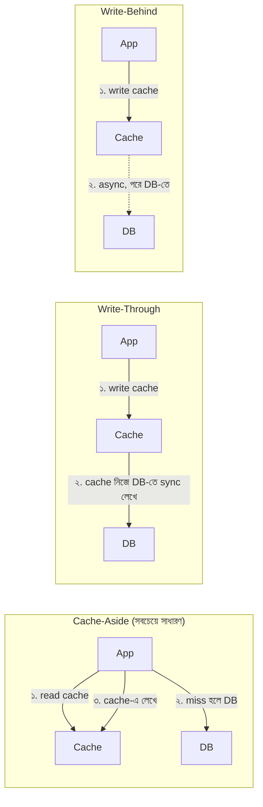

# Module 10 — Redis Deep

> **Phase C — Data Layer** | পূর্বশর্ত: M07, M09
> পরের module: M11 (Celery) — Phase D শুরু

---

## ১. যে cache পুরো Black Friday-তে DB-কে মেরে ফেলেছিল

একটা e-commerce platform-এর merchant dashboard-এ একটা "today's summary" endpoint ছিল — heavy aggregation, cache করা ছিল ৫ মিনিটের TTL দিয়ে:

```python
def get_summary(merchant_id):
    key = f"summary:{merchant_id}"
    data = cache.get(key)
    if data is None:
        data = compute_expensive_summary(merchant_id)   # ৮০০ms ভারী query
        cache.set(key, data, timeout=300)
    return data
```

Black Friday-তে একটা বড় merchant-এর dashboard-এ হাজার হাজার concurrent viewer ছিল (তাদের নিজের team, live sales দেখছিল)। ঠিক যে মুহূর্তে cache key-টা expire হলো (৫ মিনিট পূর্ণ হলো), **সেই একই মিলিসেকেন্ডে** কয়েকশো request cache miss পেল **একসাথে**। প্রতিটা request `compute_expensive_summary()` চালানো শুরু করল — কয়েকশো concurrent ৮০০ms heavy query, একই সময়ে, একই ডেটার জন্য।

DB CPU সাথে সাথে ১০০%। পুরো site-এর জন্য DB response ধীর হয়ে গেল, কারণ এই একটা merchant-এর dashboard পুরো connection pool দখল করে ফেলেছিল। এটার নাম **cache stampede** (বা "thundering herd") — এবং এটা এতটাই সাধারণ যে প্রতিটা senior backend engineer-এর এটা চেনা এবং সমাধান করার কৌশল জানা উচিত।

এই module-এ আমরা §৬-এ এই সমস্যার তিনটা সমাধান দেখব — কিন্তু তার আগে বুঝতে হবে Redis আসলে ভেতরে কীভাবে কাজ করে, কারণ প্রতিটা সমাধানের ভিত্তি Redis-এর নিজস্ব আচরণে।

---

## ২. Redis Memory Model — কেন এত দ্রুত

### ২.১ Single-Threaded Event Loop

Redis-এর মূল command processing **single-threaded** (Redis 6+ থেকে I/O-এর জন্য multi-threading আছে, কিন্তু command execution এখনো single-threaded)। এটা counterintuitive মনে হতে পারে — কিন্তু এটাই গতির রহস্য:

```
কোনো lock দরকার নেই     — একসাথে একটাই command চলে, race condition সম্ভব না
কোনো context switch নেই  — CPU cache locality ভালো থাকে
প্রতিটা operation atomic — INCR, LPUSH ইত্যাদি স্বভাবতই thread-safe
```

**Trade-off:** একটা ধীর command (যেমন `KEYS *` একটা বিশাল dataset-এ, বা একটা বড় `SORT`) **পুরো Redis instance-কে ব্লক করে** — M04-এর event loop-এ blocking call-এর ঠিক একই সমস্যা, কিন্তু এখানে stakes আরও বেশি কারণ এটা shared infrastructure, একটা request না।

```bash
# ❌ Production-এ কখনো না — O(N), পুরো dataset স্ক্যান করে, ব্লক করে
KEYS user:*

# ✅ Cursor-based, non-blocking, ছোট ছোট ব্যাচে
SCAN 0 MATCH user:* COUNT 100
```

> **Senior Tip:** "Redis production-এ ধীর হয়ে গেছে, কোনো ব্যাখ্যা নেই" — প্রথম সন্দেহ `SLOWLOG GET` চালিয়ে দেখা কোন command গুলো বেশি সময় নিচ্ছে। প্রায়ই root cause একটা developer-এর একবার চালানো `KEYS` বা একটা বিশাল `HGETALL` যা পুরো event loop-কে কয়েক মিলিসেকেন্ডের জন্য ব্লক করেছে — কিন্তু high-throughput সিস্টেমে সেই কয়েক মিলিসেকেন্ডই হাজার হাজার request-এর queueing তৈরি করে।

### ২.২ Object Encoding — মেমরি বাঁচানোর কৌশল

Redis একই data type-এর জন্য একাধিক internal encoding রাখে, ডেটার আকার অনুযায়ী automatic সুইচ করে:

```bash
127.0.0.1:6379> RPUSH small_list a b c
127.0.0.1:6379> OBJECT ENCODING small_list
"listpack"          # ছোট list — compact, array-এর মতো, RAM সাশ্রয়ী

127.0.0.1:6379> HSET small_hash a 1 b 2
127.0.0.1:6379> OBJECT ENCODING small_hash
"listpack"          # ছোট hash — একইভাবে compact

# ১২৮টার বেশি এন্ট্রি বা ৬৪ বাইটের বড় ভ্যালু হলে →
127.0.0.1:6379> OBJECT ENCODING small_hash
"hashtable"         # স্বয়ংক্রিয় switch, প্রকৃত hash table — বেশি মেমরি কিন্তু O(1) নিশ্চিত
```

| Type | ছোট data-এ encoding | বড় data-এ encoding | Threshold (ডিফল্ট) |
|---|---|---|---|
| String (ছোট integer) | `int` | — | সবসময় যদি pure integer |
| List | `listpack` | `quicklist` | ১২৮ entries / ৬৪ বাইট |
| Hash | `listpack` | `hashtable` | ১২৮ entries / ৬৪ বাইট |
| Set (integer-only) | `intset` | `hashtable` | ৫১২ entries |
| Sorted Set | `listpack` | `skiplist` | ১২৮ entries / ৬৪ বাইট |

**বাস্তব প্রভাব:** যদি আপনার data model অনেকগুলো ছোট hash ব্যবহার করে (যেমন প্রতিটা user-এর জন্য আলাদা hash, প্রতিটায় ৫-১০টা field), সেগুলো `listpack` encoding-এ থাকবে — অত্যন্ত compact। কিন্তু যদি একটা hash অসাবধানে বড় হয়ে যায় (হাজার হাজার field), এটা `hashtable`-এ switch করবে, যেটা প্রতি entry-তে অনেক বেশি overhead নেয়।

```bash
# Threshold tune করা যায় — বড় dataset-এ memory-vs-speed trade-off
CONFIG SET hash-max-listpack-entries 512
```

### ২.৩ Maxmemory ও Eviction Policy

```bash
# redis.conf
maxmemory 4gb
maxmemory-policy allkeys-lru
```

| Policy | আচরণ | কখন |
|---|---|---|
| `noeviction` | Memory ভরে গেলে write ব্যর্থ (error) | Redis-কে durable store হিসেবে ব্যবহার করলে (rate limit counter হারানো যাবে না) |
| `allkeys-lru` | সবচেয়ে কম সম্প্রতি ব্যবহৃত key মুছে ফেলে | **সাধারণ cache** — সবচেয়ে বেশি ব্যবহৃত |
| `allkeys-lfu` | সবচেয়ে কম ব্যবহৃত (frequency-based) key মুছে | Access pattern-এ hot/cold স্পষ্ট পার্থক্য থাকলে LRU-র চেয়ে ভালো |
| `volatile-lru` | শুধু TTL-সহ key-এর মধ্যে LRU eviction | Mixed use — persistent data + cache একই instance-এ |
| `volatile-ttl` | সবচেয়ে কম বাকি TTL-এর key আগে মোছে | |

> **Common Mistake:** `maxmemory-policy noeviction` (ডিফল্ট!) দিয়ে Redis-কে cache হিসেবে ব্যবহার করা। Memory ভরে গেলে **নতুন write ব্যর্থ হতে শুরু করে** — `OOM command not allowed`। এটা production outage, কারণ cache miss handle করার কোড আশা করে cache miss মানে শুধু "ডেটা নেই," কিন্তু আসলে Redis নিজেই error দিচ্ছে। Cache use case-এ সবসময় `allkeys-lru`/`allkeys-lfu`।

---

## ৩. Persistence — RDB বনাম AOF

Redis in-memory, কিন্তু restart-এ সব হারানো এড়াতে দুইটা persistence mechanism আছে — একসাথেও ব্যবহার করা যায়।

### ৩.১ RDB (Snapshot)

```bash
save 900 1        # ৯০০ সেকেন্ডে অন্তত ১টা change হলে snapshot নাও
save 300 10
save 60 10000
```

**কীভাবে কাজ করে:** Redis `fork()` করে একটা child process বানায় (Linux copy-on-write — M04-এর `gc.freeze()` আলোচনার একই মেকানিজম), child process পুরো dataset একটা বাইনারি ফাইলে ডাম্প করে, parent process request serve করতে থাকে বাধাহীনভাবে।

**Trade-off:** Snapshot-এর মাঝে data loss সম্ভব (শেষ snapshot-এর পর crash হলে সেই সময়ের ডেটা হারায়)। কিন্তু restart দ্রুত (binary ফাইল read করাই যথেষ্ট), আর fork-based হওয়ায় snapshot নেওয়ার সময় main process ব্লক হয় না (বড় dataset-এ fork নিজেই কিছুটা সময় নেয়, memory-heavy হলে page table copy খরচ আছে)।

### ৩.২ AOF (Append-Only File)

```bash
appendonly yes
appendfsync everysec    # প্রতি সেকেন্ডে fsync — durability vs performance ব্যালেন্স
```

**কীভাবে কাজ করে:** প্রতিটা write command একটা log ফাইলে append হয় (M07-এর WAL-এর ধারণার সমতুল্য)। Restart-এ পুরো log replay করে state পুনর্গঠন করা হয়।

| `appendfsync` | Durability | Performance |
|---|---|---|
| `always` | প্রতিটা write সাথে সাথে disk-এ | সবচেয়ে ধীর |
| `everysec` (ডিফল্ট) | সর্বোচ্চ ১ সেকেন্ডের ডেটা হারানোর ঝুঁকি | ভালো ব্যালেন্স |
| `no` | OS-এর উপর নির্ভর (কম নিয়ন্ত্রণ) | দ্রুততম |

### ৩.৩ কোনটা ব্যবহার করবেন

| Use Case | Persistence |
|---|---|
| **শুধু cache** (হারালে DB থেকে পুনরায় গণনা করা যায়) | কোনোটাই দরকার নেই, বা শুধু RDB (দ্রুত restart-এর জন্য) |
| Session store | RDB যথেষ্ট, কিছু session হারানো সহনীয় |
| Rate limit counter | RDB — সামান্য ভুল rate limit গ্রহণযোগ্য |
| **Job queue (Celery broker হিসেবে)** | **AOF বাধ্যতামূলক** — job হারানো মানে কাজ কখনো হবে না |
| Distributed lock state | নির্ভর করে — নিচে §৭-এ Redlock আলোচনায় |

> **Senior Tip:** "Redis কি persistent storage হিসেবে ব্যবহার করা উচিত?" — এই প্রশ্নে সততার সাথে বলুন: "Redis persistence দিতে পারে, কিন্তু এটা PostgreSQL-এর প্রতিস্থাপন না। AOF দিয়েও durability guarantee PostgreSQL-এর WAL+fsync-এর মতো শক্তিশালী না, আর Redis-এর কোনো native replication-based strong consistency নেই PostgreSQL-এর synchronous replication-এর মতো। আমি Redis ব্যবহার করি এমন ডেটার জন্য যেটা হারালে business-critical সমস্যা হয় না (cache, session, ephemeral counter), অথবা যেখানে source of truth অন্য জায়গায় আছে (M31-এর idempotency আলোচনায় Redis SETNX-এর বদলে PostgreSQL unique constraint বাছার কারণ এখানেই)।"

---

## ৪. Cache Pattern — কখন কোনটা



| Pattern | সুবিধা | ঝুঁকি | কখন |
|---|---|---|---|
| **Cache-aside** | সরল, app-এর নিয়ন্ত্রণে | Read miss-এ latency spike; stale data সম্ভব | ডিফল্ট পছন্দ, ৯০% ক্ষেত্রে |
| **Write-through** | Cache সবসময় fresh | প্রতিটা write-এ latency যোগ | Read-heavy, freshness critical |
| **Write-behind** | দ্রুততম write | Crash হলে data loss ঝুঁকি | High write volume, sামান্য loss সহনীয় |

M05 §৯-এ দেখানো Django cache framework ব্যবহার cache-aside-এর একটা প্রয়োগ — ডিফল্ট এবং বেশিরভাগ ক্ষেত্রে সঠিক পছন্দ।

---

## ৫. TTL Strategy — Fixed বনাম Jittered

```python
# ❌ সব key-র TTL একই — mass expiration একসাথে ঘটবে
cache.set(key, data, timeout=300)   # ঠিক ৫ মিনিট

# ✅ Jitter যোগ করা — expiration সময় ছড়িয়ে দেয়
import random
jitter = random.randint(-30, 30)
cache.set(key, data, timeout=300 + jitter)
```

**কেন jitter গুরুত্বপূর্ণ:** যদি হাজার হাজার key একই সময়ে (যেমন একটা batch job সবগুলো একসাথে cache করেছিল) একই TTL দিয়ে সেট হয়, তারা **সবাই একসাথে expire** হবে — এটাই §১-এর cache stampede-এর একটা variant, কিন্তু single key-র বদলে mass-scale। Jitter এই synchronized expiration ভাঙে।

---

## ৬. Cache Stampede — §১-এর সমাধান, তিনটা কৌশল

### ৬.১ কৌশল ১ — Single-Flight Lock (সবচেয়ে সাধারণ সমাধান)

```python
import time
from django.core.cache import cache

def get_summary_safe(merchant_id):
    key = f"summary:{merchant_id}"
    lock_key = f"lock:{key}"

    data = cache.get(key)
    if data is not None:
        return data

    # ⚠️ এই lock নেওয়ার চেষ্টা — শুধু একজন "জিতবে," বাকিরা অপেক্ষা করবে
    got_lock = cache.add(lock_key, "1", timeout=10)   # SETNX সমতুল্য, M31-এর idempotency-র মতো pattern

    if got_lock:
        try:
            data = compute_expensive_summary(merchant_id)
            cache.set(key, data, timeout=300)
        finally:
            cache.delete(lock_key)
        return data
    else:
        # অন্য কেউ ইতিমধ্যে গণনা করছে — অল্প অপেক্ষা করে আবার cache চেক করুন
        for _ in range(20):
            time.sleep(0.1)
            data = cache.get(key)
            if data is not None:
                return data
        # খুব বেশি সময় লাগলে fallback — নিজেই গণনা করুন (worst case)
        return compute_expensive_summary(merchant_id)
```

`cache.add()` Django-তে `SET key value NX` (Redis-এর atomic "শুধু না থাকলে সেট করো")-এর wrapper — এই atomicity-ই নিশ্চিত করে শুধু একজন "winner" হবে, race condition ছাড়াই, ঠিক M31-এর idempotency pattern-এর মতো একই মূলনীতি।

### ৬.২ কৌশল ২ — Probabilistic Early Expiration

```python
import random, math, time

def get_with_probabilistic_refresh(key, compute_fn, ttl=300, beta=1.0):
    cached = cache.get(key)
    if cached is None:
        value = compute_fn()
        cache.set(key, {"value": value, "computed_at": time.time(), "delta": 0.05}, ttl)
        return value

    value, computed_at, delta = cached["value"], cached["computed_at"], cached["delta"]
    elapsed = time.time() - computed_at

    # XFetch algorithm — TTL-এর কাছাকাছি এলে সম্ভাবনা বাড়িয়ে early refresh করার
    # সুযোগ দেয়, কিন্তু শুধু একটা request-এর জন্য (probabilistically), সবার জন্য না
    if elapsed > -delta * beta * math.log(random.random()):
        fresh_value = compute_fn()   # এই একটা request early recompute করবে
        cache.set(key, {"value": fresh_value, "computed_at": time.time(), "delta": 0.05}, ttl)
        return fresh_value

    return value
```

এই পদ্ধতিতে **কোনো lock দরকার নেই** — প্রতিটা request নিজে থেকেই সম্ভাব্যতার ভিত্তিতে সিদ্ধান্ত নেয় early refresh করবে কি না, TTL যত কাছে আসে recompute-এর সম্ভাবনা তত বাড়ে। ফলে expiration মুহূর্তের অনেক আগেই কিছু request স্বেচ্ছায় recompute করে ফেলে, তাই actual expiration-এ কখনো stampede হয় না।

### ৬.৩ কৌশল ৩ — Stale-While-Revalidate

```python
def get_stale_while_revalidate(key, compute_fn, fresh_ttl=300, stale_ttl=3600):
    cached = cache.get(key)
    if cached and cached["computed_at"] + fresh_ttl > time.time():
        return cached["value"]                       # fresh — সরাসরি ফেরত

    if cached:
        # Stale কিন্তু এখনো ব্যবহারযোগ্য — পুরনো ডেটা ফেরত দিন,
        # background-এ (Celery task, M11) recompute ট্রিগার করুন
        refresh_in_background.delay(key)
        return cached["value"]

    # কিছুই নেই — বাধ্য হয়ে synchronous compute
    value = compute_fn()
    cache.set(key, {"value": value, "computed_at": time.time()}, stale_ttl)
    return value
```

**তুলনা:**

| কৌশল | Latency impact | জটিলতা | Freshness guarantee |
|---|---|---|---|
| Single-flight lock | কিছু request অপেক্ষা করে | মাঝারি | Strong — সবসময় fresh অথবা সরাসরি অপেক্ষা |
| Probabilistic early expiry | ন্যূনতম | কম | ভালো, guaranteed না |
| Stale-while-revalidate | কখনো ব্লক হয় না | মাঝারি (background job লাগে) | Eventual — সবসময় কিছু stale window থাকে |

> **Senior Tip:** M31-এর payment system-এ কোনটা বাছবেন? Merchant dashboard summary-র মতো non-critical, high-read data-তে **stale-while-revalidate** সেরা — ব্যবহারকারী কখনো latency spike দেখবে না, সামান্য পুরনো ডেটা সহনীয়। কিন্তু balance check-এর মতো জায়গায় (যেখানে ভুল ডেটা দেখানো বিপজ্জনক) **single-flight lock**, কারণ correctness এখানে latency-র চেয়ে বেশি গুরুত্বপূর্ণ।

---

## ৭. Distributed Lock ও Redlock বিতর্ক

### ৭.১ সরল Distributed Lock

```python
import uuid

def acquire_lock(resource, ttl_ms=10000):
    token = str(uuid.uuid4())
    acquired = redis_client.set(f"lock:{resource}", token, nx=True, px=ttl_ms)
    return token if acquired else None

def release_lock(resource, token):
    # ⚠️ শুধু delete না — token যাচাই করে, নাহলে অন্য কারো lock ভুলে মুছে ফেলতে পারেন
    lua_script = """
    if redis.call("get", KEYS[1]) == ARGV[1] then
        return redis.call("del", KEYS[1])
    else
        return 0
    end
    """
    redis_client.eval(lua_script, 1, f"lock:{resource}", token)
```

**কেন Lua script দিয়ে release:** "check তারপর delete" দুইটা আলাদা network call হলে, তাদের মাঝে race condition সম্ভব — token check করার পর, delete করার আগে, lock এমনিতেই expire হয়ে অন্য কেউ নতুন lock নিতে পারে, আর আপনি সেই নতুন lock ভুলে মুছে ফেলবেন। Lua script Redis-এর ভেতরে **atomically** চলে (single-threaded event loop-এর সুবিধা, §২.১), তাই এই race সম্ভব না।

### ৭.২ Fencing Token — সবচেয়ে গুরুত্বপূর্ণ কিন্তু সবচেয়ে ভুলে যাওয়া অংশ

```
সমস্যা: Client A লক পেল। GC pause বা network delay-তে অনেকক্ষণ ব্লক হয়ে গেল।
        ততক্ষণে lock TTL expire হয়ে গেছে। Client B লক পেল এবং কাজ শুরু করল।
        Client A এখন জেগে উঠে ভাবছে "আমার কাছে এখনো লক আছে" — কাজ চালিয়ে যায়।
        এখন A আর B দুইজনই একসাথে shared resource-এ লিখছে — lock ব্যর্থ হয়ে গেল
        তার একমাত্র উদ্দেশ্য (mutual exclusion) রক্ষা করতে।
```

```python
def acquire_lock_with_fencing(resource, ttl_ms=10000):
    token = redis_client.incr(f"fencing:{resource}")   # ক্রমবর্ধমান সংখ্যা
    redis_client.set(f"lock:{resource}", token, nx=True, px=ttl_ms)
    return token

def write_with_fencing(resource, fencing_token, data):
    # ডাউনস্ট্রিম resource (যেমন PostgreSQL) নিজে fencing token যাচাই করবে
    # শুধু বড় token accept করবে — পুরনো/দেরি হওয়া client-এর write বাতিল হবে
    with transaction.atomic():
        current = SharedResource.objects.select_for_update().get(pk=resource)
        if fencing_token <= current.last_fencing_token:
            raise StaleWriteError("এই write একটা পুরনো lock-holder থেকে এসেছে")
        current.last_fencing_token = fencing_token
        current.data = data
        current.save()
```

**মূল অন্তর্দৃষ্টি:** distributed lock **নিজে থেকে** mutual exclusion guarantee দিতে পারে না যদি clock/GC/network-এ অনিশ্চয়তা থাকে (এবং distributed system-এ এগুলো সবসময় থাকে, M15)। প্রকৃত নিরাপত্তা আসে **downstream resource নিজে fencing token verify করা থেকে** — lock শুধু একটা optimization, চূড়ান্ত guarantee না।

### ৭.৩ Redlock — Antirez বনাম Kleppmann বিতর্ক

Redlock একটা algorithm যা একাধিক independent Redis instance-এ lock নিয়ে (majority quorum) সিঙ্গেল-instance failure-এর বিরুদ্ধে নিরাপত্তা দেওয়ার চেষ্টা করে।

**Antirez (Redis-এর স্রষ্টা)-এর দাবি:** Redlock যথেষ্ট নিরাপদ বেশিরভাগ practical ব্যবহারের জন্য।

**Martin Kleppmann (*Designing Data-Intensive Applications*-এর লেখক)-এর সমালোচনা:** Redlock-এর নিরাপত্তা **system clock-এর সঠিকতার উপর নির্ভর করে** (timing assumption), যেটা distributed system-এ একটা বিপজ্জনক ভিত্তি — clock drift, NTP jump, GC pause সবকিছু Redlock-এর guarantee ভাঙতে পারে বিনা সতর্কতায়। তার মূল যুক্তি: যদি correctness-এর জন্য lock দরকার হয় (শুধু efficiency-র জন্য না), Redis-ভিত্তিক কোনো সমাধান যথেষ্ট না — একটা প্রকৃত consensus algorithm (Raft/Paxos, M15) ভিত্তিক সিস্টেম (যেমন ZooKeeper, etcd) দরকার।

**ব্যবহারিক সিদ্ধান্ত:**

| প্রয়োজন | সমাধান |
|---|---|
| **Efficiency** — একই কাজ দুইবার হওয়া অপচয়, কিন্তু বিপর্যয়কর না (যেমন cache warm করা) | Redis lock (Redlock বা সরল single-instance) যথেষ্ট |
| **Correctness** — দুইবার হলে ডেটা corrupt/টাকা ভুল হয়ে যাবে | Redis lock **ছাড়াই** downstream-এ fencing token দিয়ে enforce করুন, অথবা PostgreSQL advisory lock (M07 §৭.২) ব্যবহার করুন যেখানে transaction-scoped guarantee ডাটাবেস নিজেই দেয় |

> **Senior Tip:** "Redlock ব্যবহার করবেন?" প্রশ্নে সরাসরি হ্যাঁ/না না বলে বলুন: "নির্ভর করে lock ব্যর্থ হলে কী হয় তার উপর। যদি worst case শুধু duplicate work (efficiency loss), Redlock/সরল Redis lock যথেষ্ট। যদি worst case data corruption (correctness), আমি Kleppmann-এর যুক্তি মেনে fencing token দিয়ে downstream enforce করব, অথবা PostgreSQL-এর transaction-scoped advisory lock ব্যবহার করব যেখানে সেটা সম্ভব — কারণ সেখানে ACID guarantee ইতিমধ্যে বিদ্যমান, নতুন consensus system বানাতে হয় না।"

---

## ৮. Rate Limiter — M06-এর throttle-এর algorithm ভিত্তি

M06-এ DRF-এর `SimpleRateThrottle` দেখেছিলাম — sliding log। এখন সব প্রধান algorithm তুলনা করি।

### ৮.১ Fixed Window Counter

```python
def fixed_window_allow(key, limit, window_sec):
    current_window = int(time.time() // window_sec)
    counter_key = f"rate:{key}:{current_window}"
    count = redis_client.incr(counter_key)
    if count == 1:
        redis_client.expire(counter_key, window_sec)
    return count <= limit
```

**সমস্যা — boundary burst:** window-এর শেষ মুহূর্তে N request, পরের window-এর প্রথম মুহূর্তে আরও N request — কার্যত ২N request কয়েক মিলিসেকেন্ডে গেলেও limit "মানা" হয়েছে, কারণ প্রতিটা আলাদা window-এ গণনা হয়েছে।

```
Window 1 [০-৬০s]: request আসে ৫৯.৯s-এ, ১০০টা      ← allowed
Window 2 [৬০-১২০s]: request আসে ৬০.১s-এ, ১০০টা    ← allowed
বাস্তবে ০.২ সেকেন্ডে ২০০ request গেল, "100/min" limit-এর সাথে অসামঞ্জস্যপূর্ণ
```

### ৮.২ Sliding Window Log (M06-এর DRF ডিফল্ট)

Timestamp-এর একটা তালিকা রাখে, প্রতি request-এ পুরনো timestamp সরিয়ে বাকিগুলো গোনে (M06 §৬-এ দেখানো হয়েছে)। **সবচেয়ে সুনির্দিষ্ট**, কিন্তু memory + CPU খরচ বেশি বড় limit-এ (প্রতিটা request-এর timestamp আলাদাভাবে জমা থাকে)।

### ৮.৩ Sliding Window Counter — practical ব্যালেন্স

```python
def sliding_window_counter_allow(key, limit, window_sec):
    now = time.time()
    current_window = int(now // window_sec)
    prev_window = current_window - 1
    elapsed_in_current = now - (current_window * window_sec)

    current_count = int(redis_client.get(f"rate:{key}:{current_window}") or 0)
    prev_count = int(redis_client.get(f"rate:{key}:{prev_window}") or 0)

    # আনুমানিক sliding count — আগের window-এর ওজনকৃত অংশ + বর্তমান window
    weighted_count = prev_count * (1 - elapsed_in_current / window_sec) + current_count

    if weighted_count >= limit:
        return False

    pipe = redis_client.pipeline()
    pipe.incr(f"rate:{key}:{current_window}")
    pipe.expire(f"rate:{key}:{current_window}", window_sec * 2)
    pipe.execute()
    return True
```

এটা fixed window-এর মতো সস্তা (মাত্র দুইটা counter, পুরো timestamp তালিকা না) কিন্তু boundary burst সমস্যা মোটামুটি সমাধান করে — আনুমানিক sliding হিসাব, perfect না, কিন্তু বেশিরভাগ ব্যবহারিক ক্ষেত্রে যথেষ্ট।

### ৮.৪ Token Bucket — burst allow করার জন্য

```python
def token_bucket_allow(key, capacity, refill_rate_per_sec):
    """Lua script দিয়ে atomic — race condition ছাড়া"""
    lua_script = """
    local key = KEYS[1]
    local capacity = tonumber(ARGV[1])
    local refill_rate = tonumber(ARGV[2])
    local now = tonumber(ARGV[3])

    local bucket = redis.call("HMGET", key, "tokens", "last_refill")
    local tokens = tonumber(bucket[1]) or capacity
    local last_refill = tonumber(bucket[2]) or now

    local elapsed = now - last_refill
    tokens = math.min(capacity, tokens + elapsed * refill_rate)

    if tokens >= 1 then
        tokens = tokens - 1
        redis.call("HMSET", key, "tokens", tokens, "last_refill", now)
        redis.call("EXPIRE", key, 3600)
        return 1
    else
        redis.call("HMSET", key, "tokens", tokens, "last_refill", now)
        return 0
    end
    """
    return bool(redis_client.eval(lua_script, 1, key, capacity, refill_rate_per_sec, time.time()))
```

**মূল ধারণা:** একটা "bucket"-এ token জমা হয় নির্দিষ্ট হারে (`refill_rate`), প্রতিটা request একটা token খরচ করে। Bucket খালি থাকলে request প্রত্যাখ্যাত। **Burst allow করে** — bucket ভরা থাকলে অনেকগুলো request একসাথে যেতে পারে (capacity পর্যন্ত), তারপর steady-state rate-এ সীমাবদ্ধ হয়।

### ৮.৫ কোনটা কখন

| Algorithm | Burst handling | Memory | Precision | কখন |
|---|---|---|---|---|
| Fixed window | বাজে (boundary burst) | সর্বনিম্ন | কম | দ্রুত, rough limit যথেষ্ট |
| Sliding log | কোনো burst সমস্যা নেই | সর্বোচ্চ | সর্বোচ্চ | ছোট limit, নির্ভুলতা critical (M06-এর DRF ডিফল্ট) |
| Sliding window counter | ভালো, perfect না | কম | ভালো | **বেশিরভাগ production API-র জন্য সেরা ব্যালেন্স** |
| Token bucket | **ইচ্ছাকৃতভাবে allow করে** | কম | ভালো | Burst-friendly API (client periodically batch করে) |

> **Senior Tip:** M06-এর merchant-based throttle-এ কোনটা বাছবেন — জিজ্ঞেস করুন client-এর traffic pattern কেমন। যদি merchant-এর API call সমান হারে আসে, sliding window counter যথেষ্ট। যদি merchant ব্যাচে (যেমন প্রতি ঘণ্টায় একবার ১০০টা webhook একসাথে পাঠায়) কল করে, token bucket ভালো — কারণ সেই legitimate burst pattern-কে block না করে, কিন্তু overall rate তবুও নিয়ন্ত্রণে রাখে।

---

## ৯. Bloom Filter — সম্ভাব্যতার ভিত্তিতে "নেই" নিশ্চিত করা

```python
# redis-py + RedisBloom module
redis_client.bf().add("seen_transaction_ids", "txn_abc123")
exists = redis_client.bf().exists("seen_transaction_ids", "txn_abc123")   # True
exists = redis_client.bf().exists("seen_transaction_ids", "txn_never_seen")  # প্রায় নিশ্চিতভাবে False
```

**মূল বৈশিষ্ট্য:** Bloom filter **false positive** দিতে পারে ("আছে" বলবে, কিন্তু আসলে নেই) কিন্তু **কখনো false negative না** ("নেই" বললে সেটা নিশ্চিতভাবেই সত্য)। আর এটা করে অবিশ্বাস্য কম memory-তে — লক্ষ লক্ষ item-এর জন্য মাত্র কয়েক KB, কারণ এটা প্রকৃত item স্টোর করে না, শুধু bit array-তে hash function-এর ফলাফল রাখে।

**বাস্তব ব্যবহার — M09-এর Cassandra আলোচনার সাথে সংযোগ:** LSM Tree-based সিস্টেম (§২.২, M09) প্রতিটা SSTable check করার আগে Bloom filter দিয়ে "এই SSTable-এ এই key নেই" দ্রুত নিশ্চিত করে, disk I/O এড়িয়ে।

**Payment system-এ ব্যবহার:** "এই transaction ID কি আগে দেখেছি?" (duplicate webhook detection-এর প্রথম দ্রুত চেক, M28-এ পূর্ণ প্রেক্ষাপট) — Bloom filter দিয়ে দ্রুত "না" উত্তর পাওয়া যায় বেশিরভাগ ক্ষেত্রে, PostgreSQL query ছাড়াই। শুধু "হ্যাঁ" (সম্ভাব্য duplicate) উত্তরে PostgreSQL-এ গিয়ে **নিশ্চিত** করতে হয় (M31-এর idempotency-র মূল guarantee এখনো DB-তেই থাকে — Bloom filter শুধু fast path optimization)।

---

## ১০. HyperLogLog — আনুমানিক distinct count

```python
redis_client.pfadd("unique_visitors:2026-07-23", "user_123")
redis_client.pfadd("unique_visitors:2026-07-23", "user_456")
count = redis_client.pfcount("unique_visitors:2026-07-23")   # আনুমানিক, ~০.৮১% error
```

**সমস্যা যা এটা সমাধান করে:** "আজ কতজন unique visitor" — naive সমাধান একটা Set-এ সব user ID রাখা, `SCARD` দিয়ে গোনা। লক্ষ লক্ষ visitor-এ এই Set-ই কয়েক GB মেমরি খাবে। HyperLogLog **মাত্র ১২ KB** দিয়ে যেকোনো cardinality (কয়েক বিলিয়ন পর্যন্ত) আনুমানিক গণনা করতে পারে, ~০.৮১% স্ট্যান্ডার্ড error দিয়ে।

**Trade-off:** exact count না — analytics/dashboard-এর জন্য যথেষ্ট (M30-এ analytics আলোচনায় ফিরে আসবে), কিন্তু billing-এর মতো জায়গায় (যেখানে exact count-এর উপর টাকা নির্ভর করে) ব্যবহার করা যাবে না।

---

## ১১. Redis Streams — হালকা Kafka বিকল্প (M12-এর প্রস্তুতি)

```python
# Producer
redis_client.xadd("payment_events", {"type": "created", "payment_id": "pay_123", "amount": "1500"})

# Consumer group — M12-এ Kafka consumer group-এর সাথে সরাসরি তুলনীয় ধারণা
redis_client.xgroup_create("payment_events", "webhook_workers", id="0")
messages = redis_client.xreadgroup("webhook_workers", "worker_1",
                                    {"payment_events": ">"}, count=10)
# প্রসেস করার পর acknowledge — না করলে pending list-এ থেকে যাবে
redis_client.xack("payment_events", "webhook_workers", message_id)
```

**Redis Streams বনাম Kafka — কখন কোনটা:**

| | Redis Streams | Kafka |
|---|---|---|
| Throughput | মাঝারি (single Redis instance-এর সীমায়) | অত্যন্ত উচ্চ (partition-এ distributed) |
| Persistence guarantee | AOF-নির্ভর, PostgreSQL-এর WAL-এর মতো শক্তিশালী না | Replicated, disk-based, শক্তিশালী durability |
| Operational জটিলতা | কম — যদি আগে থেকেই Redis আছে | বেশি — নতুন সিস্টেম, dedicated cluster (M12) |
| Retention | Memory-bound (trim করতে হয়) | Disk-bound, দীর্ঘমেয়াদী retention সহজ |
| কখন উপযুক্ত | ছোট-মাঝারি scale event processing, ইতিমধ্যে Redis আছে | High-throughput, multi-consumer, long retention দরকার |

> **Senior Tip:** M09-এর polyglot persistence সিদ্ধান্ত-কাঠামো এখানেও প্রযোজ্য: "আমাদের event streaming দরকার, Kafka বসাব?" প্রশ্নে প্রথমে জিজ্ঞেস করুন স্কেল কী। যদি ইতিমধ্যে Redis infrastructure আছে আর throughput moderate, Redis Streams দিয়ে নতুন operational burden ছাড়াই শুরু করা যায়। থ্রুপুট/retention প্রয়োজন Redis-এর সীমা ছাড়ালে তখন Kafka migration বিবেচনা করুন — কিন্তু "আমরা Kafka শিখতে চাই" যথেষ্ট কারণ না (M09-এর Cassandra "Netflix ব্যবহার করে" যুক্তির মতোই ফাঁদ)।

---

## ১২. Django Integration — সব একসাথে

```python
# settings.py
CACHES = {
    "default": {
        "BACKEND": "django_redis.cache.RedisCache",
        "LOCATION": "redis://redis-cache:6379/1",
        "OPTIONS": {
            "CLIENT_CLASS": "django_redis.client.DefaultClient",
            "CONNECTION_POOL_KWARGS": {"max_connections": 50},
            "IGNORE_EXCEPTIONS": True,      # ⚠️ নিচে ব্যাখ্যা
        },
    },
    "rate_limit": {   # আলাদা logical DB — cache আর rate limit আলাদা eviction policy
        "BACKEND": "django_redis.cache.RedisCache",
        "LOCATION": "redis://redis-cache:6379/2",
    },
}
```

**`IGNORE_EXCEPTIONS=True`-এর গুরুত্ব — M16-এর resilience আলোচনার প্রথম ঝলক:** Redis down হলে, এই সেটিং ছাড়া প্রতিটা `cache.get()` call একটা exception ছুঁড়বে, যেটা পুরো application-কে down করে দিতে পারে — যদিও Redis শুধু একটা **optimization** ছিল, core functionality না। `IGNORE_EXCEPTIONS=True` দিয়ে cache miss-এর মতো আচরণ করে (DB থেকে সরাসরি পড়ে), graceful degradation — M02-এর "external dependency-র failure যেন cascading না হয়" নীতির সরাসরি প্রয়োগ।

```python
# কিন্তু rate limiting-এ এটা উল্টো বিপজ্জনক হতে পারে —
# Redis down হলে rate limit "silently off" হয়ে গেলে abuse protection হারায়
CACHES["rate_limit"]["OPTIONS"]["IGNORE_EXCEPTIONS"] = False
# অথবা explicit fail-closed/fail-open সিদ্ধান্ত কোডে নিন, silent এড়িয়ে
```

> **Senior Tip:** এই দুইটা সেটিং-এর বৈসাদৃশ্য একটা গুরুত্বপূর্ণ architectural সিদ্ধান্তকে হাইলাইট করে — **fail-open বনাম fail-closed**, যা M16-এ পূর্ণভাবে আলোচিত হবে। Cache-এ fail-open ঠিক (feature degrade হয়, কিন্তু কাজ চলে)। Rate limit/security-এ fail-open বিপজ্জনক (protection হারায়)। প্রতিটা Redis dependency-তে এই সিদ্ধান্ত সচেতনভাবে নিতে হবে, ডিফল্টের উপর ভরসা না করে।

---

## ১৩. Interview Section

### প্রশ্ন ১ (Senior) — "Cache stampede কী, এবং কীভাবে প্রতিরোধ করবেন?"

**🌟 Senior/Staff Answer**
> "Cache stampede ঘটে যখন একটা জনপ্রিয় cache key expire হয়, আর একই মুহূর্তে বহু concurrent request cache miss পেয়ে **সবাই একসাথে** underlying data source-এ (সাধারণত DB) একই expensive কাজ চালিয়ে ফেলে। একটা request-এর ৮০০ms query কয়েকশো গুণ হয়ে DB-কে সাময়িকভাবে অপ্রতুল করে দেয়।
>
> তিনটা সমাধান, ভিন্ন trade-off:
> **Single-flight lock** — শুধু প্রথম request Redis-এ `SET NX` দিয়ে একটা lock নেয়, সে-ই recompute করে; বাকিরা অপেক্ষা করে ও পরে cache থেকে পড়ে। Strong consistency, কিন্তু কিছু request latency দেখবে।
> **Probabilistic early expiration** — প্রতিটা request সম্ভাব্যতার ভিত্তিতে সিদ্ধান্ত নেয় early recompute করবে কি না, TTL-এর কাছাকাছি এলে সম্ভাবনা বাড়ে। Lock দরকার নেই, latency impact নেই, কিন্তু কোনো strong guarantee নেই যে দুইটা request একসাথে recompute করবে না — শুধু সম্ভাবনা কমায়।
> **Stale-while-revalidate** — expired হলেও পুরনো ডেটা সাথে সাথে ফেরত দেওয়া হয়, background-এ refresh ট্রিগার হয়। ব্যবহারকারী কখনো latency spike দেখে না, কিন্তু সবসময় কিছুটা staleness থাকে।
>
> নির্বাচন নির্ভর করে ডেটার freshness প্রয়োজনীয়তার উপর — non-critical dashboard-এ stale-while-revalidate, correctness-critical ডেটায় single-flight lock।"

---

### প্রশ্ন ২ (Staff / Architecture) — "Redlock ব্যবহার করা উচিত কি না একটা distributed cron job-এর জন্য (যাতে একটা task দুইবার না চলে)?"

**🌟 Senior/Staff Answer**
> "প্রথমে প্রশ্ন — এই task দুইবার চললে কী ক্ষতি হয়? যদি এটা idempotent হয় (যেমন M31-এর idempotency pattern প্রয়োগ করা আছে), দুইবার চলা শুধু সামান্য অপচয়, correctness সমস্যা না। সেক্ষেত্রে সরল Redis lock (এমনকি Redlock ছাড়াই, একটা single-instance `SET NX`) যথেষ্ট।
>
> যদি task non-idempotent এবং দুইবার চললে ভুল ফলাফল হয় (যেমন একটা batch payment file দুইবার প্রসেস হলে duplicate charge), তাহলে Kleppmann-এর যুক্তি প্রযোজ্য — শুধু Redis lock (Redlock সহ) যথেষ্ট guarantee দেয় না, কারণ clock drift বা GC pause একটা worker-কে ভুলভাবে ভাবাতে পারে যে তার এখনো lock আছে।
>
> আমার বাস্তব সুপারিশ: **PostgreSQL advisory lock** (M07 §৭.২) ব্যবহার করা, যদি আমাদের ইতিমধ্যে PostgreSQL infrastructure আছে — `pg_advisory_xact_lock` transaction-scoped, তাই crash হলেও lock স্বয়ংক্রিয়ভাবে release হয়, আর এটা নতুন সিস্টেম (Redlock cluster) operate করার প্রয়োজন এড়ায়। এটা M09-এর polyglot persistence নীতির একটা সরাসরি প্রয়োগ — নতুন infrastructure যোগ করার আগে বিদ্যমান সিস্টেমে সমাধান আছে কি না দেখা।
>
> Celery-নির্দিষ্ট সমাধানও আছে — `celery beat`-এর single scheduler design প্রায়ই যথেষ্ট (M11-এ বিস্তারিত), কারণ Beat নিজেই নিশ্চিত করে একটা periodic task একবারই trigger হয়, worker সংখ্যা নির্বিশেষে।"

---

### প্রশ্ন ৩ (Coding / Debugging) — "এই rate limiter-এ সমস্যা খুঁজুন।"

```python
def is_allowed(user_id, limit=100):
    key = f"rate:{user_id}"
    count = cache.get(key, 0)
    if count >= limit:
        return False
    cache.set(key, count + 1, timeout=60)
    return True
```

**🌟 Senior Answer**
> "Classic race condition — check-then-set দুইটা আলাদা network round trip, atomic না। দুইটা concurrent request একই সময়ে `cache.get()` করলে দুইজনই একই পুরনো `count` দেখবে, দুইজনই validation পাস করবে, দুইজনই `count+1` সেট করবে — একটা increment হারিয়ে যাবে, আর high-concurrency-তে limit কার্যকরভাবে অতিক্রম করা যাবে। এটা ঠিক M05-এর `refunded_amount += amount` race condition-এর একই প্যাটার্ন, শুধু Redis-এ।
>
> সমাধান — Redis-এর atomic `INCR` ব্যবহার করা, যেটা single-threaded event loop-এর (§২.১) সুবিধায় নিজেই atomic:
> ```python
> def is_allowed(user_id, limit=100, window=60):
>     key = f"rate:{user_id}"
>     count = redis_client.incr(key)   # atomic — race সম্ভব না
>     if count == 1:
>         redis_client.expire(key, window)   # শুধু প্রথমবার TTL সেট
>     return count <= limit
> ```
> এখানেও একটা সূক্ষ্ম ফাঁদ আছে — `INCR` আর `EXPIRE` দুইটা আলাদা call, তাদের মাঝে crash হলে key TTL ছাড়াই থেকে যেতে পারে (memory leak, ছোট কিন্তু বাস্তব)। সম্পূর্ণ bulletproof সমাধানে Lua script দিয়ে দুইটা operation একসাথে atomic করা উচিত, ঠিক §৮.৪-এর token bucket implementation-এর মতো।
>
> এই bug-টা বিশেষভাবে বিপজ্জনক কারণ এটা **low traffic-এ কখনো ধরা পড়ে না** — race window এত ছোট যে concurrent request একই মিলিসেকেন্ডে আসতে হবে। এটা শুধু production-এর high-concurrency মুহূর্তে (ঠিক যখন rate limiting সবচেয়ে বেশি দরকার) প্রকাশ পায়।"

---

### প্রশ্ন ৪ (Scenario) — "Redis instance down হয়ে গেছে ৩ মিনিটের জন্য। কী কী প্রভাব পড়তে পারে, এবং কীভাবে prepare করবেন?"

**🌟 Senior/Staff Answer**
> "প্রভাব নির্ভর করে Redis কী কী কাজে ব্যবহৃত হচ্ছে তার উপর — আর এটাই দেখায় কেন একটা Redis instance-এ অনেকগুলো ভিন্ন দায়িত্ব (cache, session, rate limit, lock, Celery broker) মেশানো বিপজ্জনক, blast radius বিশাল হয়ে যায়:
>
> **Cache down হলে (fail-open কনফিগার করা থাকলে, §১২):** প্রতিটা request DB-তে সরাসরি যাবে — DB load হঠাৎ ১০× বেড়ে যেতে পারে, যেটা নিজেই একটা secondary outage তৈরি করতে পারে যদি DB সেই load-এর জন্য প্রস্তুত না থাকে (M31-এর 'cache miss-এ DB overload' পরিস্থিতি)।
>
> **Session store down হলে:** সব ব্যবহারকারী logged out — বড় UX প্রভাব, কিন্তু data corruption না।
>
> **Rate limiter down হলে (fail-open হলে):** abuse protection সাময়িকভাবে অনুপস্থিত — নিরাপত্তা ঝুঁকি, বিশেষত এই window-টা যদি কেউ লক্ষ্য করে exploit করে।
>
> **Celery broker হিসেবে Redis down হলে:** নতুন task queue করা যাবে না, running task-ও প্রভাবিত হতে পারে backend সংযোগ হারিয়ে (M11-এ বিস্তারিত)।
>
> **Distributed lock down হলে:** যেসব কাজ lock-এর উপর নির্ভরশীল, সেগুলো হয় ব্লক হয়ে যাবে, নয়তো (worse) lock ছাড়াই চলতে শুরু করবে যদি কোড ভুলভাবে lock-না-পাওয়াকে 'lock দরকার নেই' হিসেবে treat করে।
>
> **প্রস্তুতি:** (১) প্রতিটা Redis dependency-তে explicit fail-open/fail-closed সিদ্ধান্ত, ডিফল্টের উপর নির্ভর না করে। (২) Cache আর rate-limit-critical ও session-critical ব্যবহারের জন্য আলাদা Redis instance বিবেচনা করা — একটা instance-এর failure সব কিছু না নামাক। (৩) Redis Sentinel বা Cluster দিয়ে HA (M20-এ ইনফ্রা লেভেলে বিস্তারিত), single point of failure এড়ানো। (৪) DB-র উপর একটা circuit breaker/rate limiter (M16) রাখা, যাতে cache miss surge-এ DB নিজে সুরক্ষিত থাকে।"

---

## ১৪. হাতে-কলমে অনুশীলন

**১ — Cache stampede পুনরুৎপাদন (৩০ মিনিট)**
একটা expensive endpoint বানান (`time.sleep(1)` দিয়ে simulate করুন heavy query), TTL=৫ সেকেন্ড cache সহ। `hey`/`ab` দিয়ে ৫০ concurrent request পাঠান ঠিক যখন TTL expire হচ্ছে। কতগুলো "expensive" কাজ actually চলল লগ করে দেখুন। তারপর single-flight lock যোগ করে আবার পরীক্ষা করুন।

**২ — Object encoding দেখুন (১৫ মিনিট)**
`redis-cli` দিয়ে একটা ছোট hash বানান, `OBJECT ENCODING` চেক করুন। ২০০টা field যোগ করুন, আবার চেক করুন encoding বদলেছে কি না।

**৩ — Rate limiter race condition (২৫ মিনিট)**
§১৩ প্রশ্ন ৩-এর naive rate limiter নিয়ে ১০০টা thread দিয়ে সমান্তরালে কল করুন। Final count-এ কি ১০০-এর বেশি request allow হলো (race-এর কারণে)? তারপর `INCR`-ভিত্তিক সংস্করণ দিয়ে আবার পরীক্ষা করুন।

**৪ — Fencing token সিমুলেশন (২০ মিনিট)**
একটা lock acquire করুন, ইচ্ছাকৃতভাবে TTL expire হতে দিন (sleep দিয়ে), তারপর "পুরনো" client দিয়ে write করার চেষ্টা করুন fencing token-check সহ ও ছাড়া — পার্থক্য দেখুন।

---

## ১৫. মূল কথা

1. **Redis single-threaded** — এটাই গতির উৎস (কোনো lock দরকার নেই) এবং ঝুঁকির উৎস (একটা ধীর command পুরো instance ব্লক করে)। `KEYS` কখনো production-এ না, `SCAN` ব্যবহার করুন।
2. **Object encoding স্বয়ংক্রিয়ভাবে switch হয়** ডেটার আকার অনুযায়ী — ছোট collection compact, বড়টা memory বেশি নেয় কিন্তু O(1) guarantee দেয়।
3. **`maxmemory-policy` cache use case-এ `allkeys-lru`/`allkeys-lfu` হতে হবে** — ডিফল্ট `noeviction` cache-এ ব্যবহার করলে production outage।
4. **RDB দ্রুত restart কিন্তু কিছু data loss সম্ভব, AOF শক্তিশালী durability কিন্তু ধীরতর** — job queue-তে AOF বাধ্যতামূলক, pure cache-এ কোনোটাই optional।
5. **Cache stampede-এর তিনটা সমাধান** — single-flight lock (strong), probabilistic early expiry (simple), stale-while-revalidate (zero latency impact) — প্রয়োজন অনুযায়ী বাছুন।
6. **Distributed lock-এ fencing token বাধ্যতামূলক correctness-critical কাজে** — lock নিজে থেকে (Redlock সহ) mutual exclusion guarantee দিতে পারে না clock/GC uncertainty-র কারণে।
7. **Correctness দরকার হলে Redis lock-এর বদলে downstream enforcement বা PostgreSQL advisory lock** — Kleppmann-এর মূল যুক্তি।
8. **Rate limiter algorithm নির্বাচন burst tolerance-এর উপর নির্ভর করে** — sliding window counter বেশিরভাগ ক্ষেত্রে সেরা ব্যালেন্স, token bucket ইচ্ছাকৃত burst-এ।
9. **Check-then-set race Redis-এও ঘটে**, ঠিক ডাটাবেসের মতো — atomic operation (`INCR`, Lua script) ব্যবহার করুন, আলাদা get+set না।
10. **Bloom filter/HyperLogLog সম্ভাব্যতা-ভিত্তিক, exact না** — massive memory সাশ্রয়ের বিনিময়ে সামান্য error, billing-critical জায়গায় না।
11. **প্রতিটা Redis dependency-তে fail-open/fail-closed সচেতনভাবে সিদ্ধান্ত নিন** — cache-এ fail-open ঠিক, rate-limit/lock-এ প্রায়ই fail-closed দরকার।

---

## পরের Module

আজ আমরা Redis-কে cache, lock, rate limiter, এমনকি event streaming (Streams)-এর ভূমিকায় দেখলাম। এখন **Phase D — Async, Messaging & Streaming**-এ প্রবেশ করছি।

**M11 — Celery।** Worker internals (prefork বনাম gevent), broker হিসেবে Redis-এর ভূমিকা (§১২-এ যা উল্লেখ করা হয়েছে) সম্পূর্ণ প্রেক্ষাপটে, idempotent task design (M31-এর idempotency নীতির async ভার্শন), retry+backoff+jitter (M02-এর retry storm সতর্কতার সরাসরি প্রয়োগ), Beat-এর single-scheduler design (আজকের distributed lock আলোচনার একটা practical বিকল্প), আর কখন Celery ছেড়ে Kafka-তে যাওয়া উচিত।
