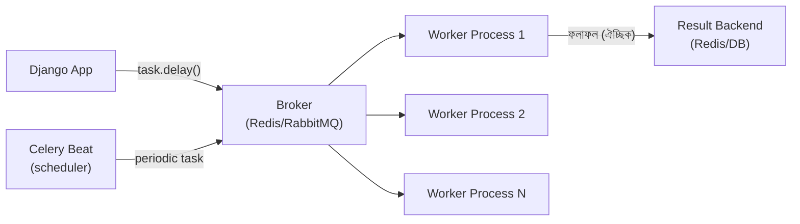

# Module 11 — Celery

> **Phase D — Async, Messaging & Streaming** | পূর্বশর্ত: M04, M10
> পরের module: M12 (Kafka Internals)

---

## ১. যে webhook টাস্ক তিনবার ডেলিভার হয়েছিল

M06 §১০-এর webhook delivery task মনে করুন। Production-এ একটা bug report এল — একজন merchant একই `payment.succeeded` webhook **তিনবার** পেয়েছে, প্রতিবার একই event ID দিয়ে।

কোড দেখতে ঠিকই মনে হচ্ছিল:

```python
@shared_task(bind=True, max_retries=8, autoretry_for=(requests.RequestException,))
def deliver_webhook(self, event_id):
    event = OutboxEvent.objects.get(id=event_id)
    resp = webhook_session.post(url, json=event.payload, timeout=(3.05, 10))
    resp.raise_for_status()
    event.mark_delivered()
```

তদন্তে যা পাওয়া গেল: worker task-টা **সফলভাবে** merchant-কে webhook পাঠিয়েছিল, merchant-এর server `200 OK` ফেরত দিয়েছিল — কিন্তু ঠিক সেই মুহূর্তে worker process **OOM-killed** হলো (memory pressure-এর কারণে, অন্য একটা ভারী task-এর জন্য)। Task তার `event.mark_delivered()` কল করার আগেই মারা গেল।

Celery-র broker (Redis) দেখল task "acknowledge" হয়নি — worker হারিয়ে গেছে ধরে নিয়ে সেটা **আবার queue-তে ফেরত** পাঠাল, অন্য worker সেটা তুলে নিল, আবার merchant-কে পাঠাল। এই একই প্যাটার্ন **তৃতীয়বার** ঘটল একটা network hiccup-এ (response আসতে দেরি হওয়ায় timeout, কিন্তু merchant আসলে পেয়ে গিয়েছিল)।

এই ঘটনাটা তিনটা মৌলিক Celery ধারণার সংযোগস্থলে দাঁড়িয়ে আছে — **acknowledgment semantics** (`acks_late`), **at-least-once delivery guarantee**, আর **idempotent task design**। এই module-এ আমরা এই তিনটাই সমাধান করব, আর কেন "exactly-once" Celery-তে (বা কোনো distributed queue সিস্টেমেই) সত্যিকারের অস্তিত্ব নেই সেটা বুঝব।

---

## ২. Celery Architecture — উঁচু স্তরের ছবি



**চারটা আলাদা উপাদান, প্রতিটার নিজস্ব দায়িত্ব:**

| উপাদান | কাজ | সাধারণ পছন্দ |
|---|---|---|
| **Broker** | Task queue রাখে, worker-কে delivery করে | Redis (M10) বা RabbitMQ (M13) |
| **Worker** | Task execute করে | Celery worker process |
| **Result Backend** | Task-এর ফলাফল/status স্টোর করে (ঐচ্ছিক) | Redis, PostgreSQL, বা None |
| **Beat** | Periodic/scheduled task trigger করে | একটাই instance চলা উচিত |

---

## ৩. Worker Internals — কোন Pool কখন

### ৩.১ চারটা worker pool type

```bash
celery -A myapp worker --pool=prefork --concurrency=8
celery -A myapp worker --pool=gevent --concurrency=1000
celery -A myapp worker --pool=threads --concurrency=20
celery -A myapp worker --pool=solo
```

| Pool | Concurrency model | GIL প্রভাব (M04) | কখন |
|---|---|---|---|
| **prefork** (ডিফল্ট) | একাধিক OS process (`fork()`) | কোনো প্রভাব নেই — প্রতিটা process নিজস্ব GIL | CPU-bound task (PDF generation, image processing, ML inference) |
| **gevent/eventlet** | Green thread, cooperative | I/O-তে GIL ছাড়া হয় (M04 §৪.২), তাই সমান্তরাল I/O কাজ করে | I/O-bound task, বহু concurrent HTTP call (যেমন webhook delivery) |
| **threads** | OS thread | M04-এর thread আলোচনার সরাসরি প্রয়োগ — I/O-তে ভালো | I/O-bound, কিন্তু gevent-এর মতো monkey-patch ঝুঁকি নেই |
| **solo** | একটাই thread, sequential | — | Debugging, testing |

**M04-এর GIL আলোচনার সরাসরি প্রয়োগ:** CPU-bound task-এ (`hash_password`, `generate_report_pdf`) prefork বাধ্যতামূলক, কারণ GIL এই কাজে ছাড়া হয় না (M04 §৪.২-এর টেবিল) — thread/gevent দিয়ে কোনো সমান্তরালতা পাবেন না, শুধু overhead যোগ হবে। I/O-bound task-এ (webhook delivery, external API call) gevent/threads দিয়ে একই মেমরিতে হাজার হাজার concurrent task চালানো সম্ভব, কারণ GIL সেখানে ছাড়া হয়।

```python
# celery.py — task-type অনুযায়ী আলাদা queue, আলাদা worker pool
app.conf.task_routes = {
    "myapp.tasks.generate_report_pdf": {"queue": "cpu_bound"},
    "myapp.tasks.deliver_webhook": {"queue": "io_bound"},
}
```

```bash
# CPU-bound queue-এর জন্য prefork worker
celery -A myapp worker -Q cpu_bound --pool=prefork --concurrency=4

# I/O-bound queue-এর জন্য gevent worker — একই সার্ভারে অনেক বেশি concurrency সম্ভব
celery -A myapp worker -Q io_bound --pool=gevent --concurrency=500
```

> **Senior Tip:** "কেন সব worker-এ একই pool ব্যবহার করবেন না?" — একটা single `--pool=gevent --concurrency=500` worker-এ CPU-bound task চালালে, সেই একটা ভারী hash operation পুরো ৫০০টা green thread-কে ব্লক করে দেবে (M04 §৬.২-এর "একটা blocking call পুরো loop মারে" নীতির সরাসরি প্রয়োগ, gevent-এও একই সমস্যা কারণ এটাও cooperative scheduling)। তাই task-type অনুযায়ী queue এবং worker pool আলাদা করা শুধু organization না, এটা একটা correctness প্রয়োজনীয়তা।

### ৩.২ gevent-এর monkey-patch ঝুঁকি

```python
# gevent worker শুরুতে monkey-patch করে — standard library-র
# socket, threading, time ইত্যাদি সব "green" ভার্সনে বদলে দেয়
from gevent import monkey
monkey.patch_all()
```

**সমস্যা:** কিছু C extension (psycopg2-এর কিছু ভার্সন, কিছু ML library) gevent-এর monkey-patching-এর সাথে সামঞ্জস্যপূর্ণ না — patch করা `socket` module ব্যবহার না করে সরাসরি OS-level blocking call করে, যেটা পুরো gevent event loop-কে ব্লক করে দেয়, নীরবে। এই bug ধরা কঠিন কারণ সবকিছু কাজ করে বলে মনে হয়, শুধু throughput আশানুরূপ হয় না।

> **Common Mistake:** gevent worker-এ `psycopg2` (sync) ব্যবহার করা patch ছাড়া হুবহু prefork-এর মতো আচরণ করবে (প্রতিটা DB query পুরো worker-কে ব্লক করবে), gevent-এর কোনো লাভ ছাড়াই। `psycopg2` কে `psycogreen` দিয়ে patch করতে হয়, অথবা `gevent`-compatible driver ব্যবহার করতে হয় প্রকৃত concurrency পেতে।

---

## ৪. Broker Semantics — Acknowledgment ও Delivery Guarantee

### ৪.১ `acks_early` বনাম `acks_late` (§১-এর incident-এর মূল কারণ)

```python
# celery.py
app.conf.task_acks_late = True    # global default
```

```python
@shared_task(acks_late=True)      # অথবা per-task override
def deliver_webhook(event_id):
    ...
```

| | `acks_early` (ডিফল্ট!) | `acks_late` |
|---|---|---|
| Ack কখন হয় | Worker task **তুলে নেওয়ার সাথে সাথে**, execute করার আগে | Task **সফলভাবে শেষ হওয়ার পরে** (বা exception raise করলে) |
| Worker crash হলে (task চলাকালীন) | Task **হারিয়ে যায়** — broker ভাবে delivered, আর retry হবে না | Task **আবার queue-তে ফেরত যায়** — retry হবে |
| ঝুঁকি | Data loss (task কখনো সম্পন্ন হয়নি, কিন্তু আর চলবে না) | **Duplicate execution** (task সম্পন্ন হয়েছিল, কিন্তু ack করার আগেই crash — আবার চলবে) |

**§১-এর ঘটনা এখন সম্পূর্ণ ব্যাখ্যাযোগ্য:** `acks_late=True` ছিল (সঠিক পছন্দ — data loss-এর চেয়ে duplicate ভালো, নিচে ব্যাখ্যা), কিন্তু task ack হওয়ার ঠিক আগে (webhook পাঠানো হয়ে গেছে, কিন্তু `mark_delivered()` এখনো চলেনি) worker OOM-killed হলো। Broker দেখল ack আসেনি, task আবার পাঠাল।

**এটাই at-least-once delivery-র মূল সংজ্ঞা: task অন্তত একবার চলবে (কখনো হারাবে না), কিন্তু একাধিকবার চলার সম্ভাবনা থেকেই যায়।** "Exactly-once" কোনো distributed queue সিস্টেমেই সত্যিকারের গ্যারান্টি না — এটা M14-এ পুনরায় গভীরভাবে আলোচিত হবে (event streaming-এর প্রেক্ষাপটে, ঠিক একই মৌলিক সীমাবদ্ধতা)।

> **Senior Tip:** "`acks_early` নাকি `acks_late` ব্যবহার করবেন?" — এই প্রশ্নের উত্তর নির্ভর করে কোনটা worse: data loss নাকি duplicate execution। বেশিরভাগ business-critical task-এ (webhook, payment processing, email) **duplicate handle করা সহজ (idempotency দিয়ে, নিচে §৫) সিলভার loss-এর চেয়ে**, তাই `acks_late=True` ডিফল্ট পছন্দ হওয়া উচিত production-এ। কিন্তু ডিফল্ট **`acks_early`** — অনেক টিম না জেনেই ভুল পাশে থাকে।

### ৪.২ Visibility Timeout (Redis broker-এ)

```python
app.conf.broker_transport_options = {"visibility_timeout": 3600}   # ১ ঘণ্টা
```

Redis broker-এ (RabbitMQ-র native ack mechanism নেই), "in-flight" task ট্র্যাক হয় একটা timeout দিয়ে — যদি একটা task `visibility_timeout`-এর মধ্যে ack না হয়, broker ধরে নেয় worker crash করেছে এবং task আবার deliver করে।

```
⚠️ ফাঁদ: visibility_timeout task-এর সম্ভাব্য সর্বোচ্চ execution time-এর চেয়ে
   কম হলে, একটা normally-running (কিন্তু ধীর) task মাঝপথে "হারিয়ে গেছে" ধরে নিয়ে
   ডুপ্লিকেট deliver হবে — worker আসলে ঠিকই কাজ করছিল!
```

**নিয়ম:** `visibility_timeout` সবসময় দীর্ঘতম task-এর expected max runtime-এর চেয়ে বেশি হতে হবে, উল্লেখযোগ্য মার্জিন সহ।

---

## ৫. Idempotent Task Design — এটাই আসল সমাধান

M31-এর payment idempotency নীতি ঠিক এখানেই Celery-তে প্রয়োগ হয়। যেহেতু at-least-once delivery মেনেই নিতে হবে (broker/worker যেভাবেই কনফিগার করুন), **task নিজেকে duplicate-safe বানানো** একমাত্র সম্পূর্ণ সমাধান।

```python
@shared_task(bind=True, acks_late=True, max_retries=8)
def deliver_webhook(self, event_id):
    event = OutboxEvent.objects.select_related("merchant").get(id=event_id)

    # ⚠️ ইতিমধ্যে delivered কি না চেক — M31-এর idempotency check-then-create-এর প্যাটার্ন
    if event.status == "delivered":
        return   # আগেই সফল হয়েছে, চুপচাপ ফিরে যাও — retry/duplicate delivery-তেও নিরাপদ

    resp = webhook_session.post(
        event.merchant.webhook_url,
        json=event.payload,
        headers={"X-Event-Id": str(event.id)},   # merchant-side deduplication-এর জন্য (M28)
        timeout=(3.05, 10),
    )
    resp.raise_for_status()

    # atomic update — race-safe এমনকি দুইটা worker একসাথে চললেও
    updated = OutboxEvent.objects.filter(
        id=event_id, status__in=["pending", "processing"]
    ).update(status="delivered", delivered_at=timezone.now())
```

**তিনটা স্তরের নিরাপত্তা:**

১. **Task-level check** — শুরুতেই `status == "delivered"` হলে কিছুই না করে ফিরে যাওয়া। এটা ৯৯% duplicate case ধরে ফেলে, দ্রুত, কোনো external call ছাড়াই।

২. **`X-Event-Id` header** — merchant-এর নিজের deduplication-এর সুযোগ দেওয়া (M28-এ payment webhook design-এ বিস্তারিত), যাতে সত্যিই duplicate webhook merchant-side-এও নিরাপদে handle হয়, আমাদের কন্ট্রোলের বাইরে network-level duplicate হলেও।

৩. **Atomic conditional update** — M05-এর `F()` expression pattern-এর মতো, `filter().update()` দিয়ে race-safe status transition। এটা M31-এর idempotency implementation-এর ঠিক একই মূলনীতি — **correctness database constraint/atomic operation-এ enforce করুন, application-level check-এ না**।

### ৫.১ Non-Idempotent কাজে কী করবেন

কিছু কাজ স্বভাবতই non-idempotent (যেমন "balance-এ ৫০ টাকা যোগ করো" — দুইবার চললে ভুল ফলাফল)। এখানে solution idempotency **key** ব্যবহার করা, M31-এর মূল প্যাটার্ন:

```python
@shared_task(bind=True, acks_late=True)
def credit_merchant_balance(self, merchant_id, amount_minor, idempotency_key):
    with transaction.atomic():
        # ইতিমধ্যে এই idempotency_key দিয়ে প্রসেস হয়েছে কি না
        if BalanceTransaction.objects.filter(idempotency_key=idempotency_key).exists():
            return   # আগেই হয়ে গেছে — নিরাপদে skip

        BalanceTransaction.objects.create(
            merchant_id=merchant_id, amount_minor=amount_minor,
            idempotency_key=idempotency_key,
        )
        Merchant.objects.filter(pk=merchant_id).update(
            balance=F("balance") + amount_minor
        )
```

`idempotency_key`-তে `UniqueConstraint` থাকলে (M31-এর pattern) — এমনকি এই check-then-create-এও race থাকলে, database constraint দ্বিতীয় insert আটকাবে।

---

## ৬. Retry, Backoff, Jitter — M02-এর retry storm সতর্কতার প্রয়োগ

### ৬.১ সরল Retry — সমস্যা

```python
# ❌ M02 §৯-এ retry storm সতর্কতা মনে করুন
@shared_task(bind=True, max_retries=8)
def deliver_webhook(self, event_id):
    try:
        resp = webhook_session.post(url, json=payload, timeout=(3.05, 10))
        resp.raise_for_status()
    except requests.RequestException as exc:
        raise self.retry(exc=exc, countdown=5)   # সবসময় ৫ সেকেন্ড — জিটার নেই
```

যদি merchant-এর server কিছুক্ষণ down থাকে, **হাজার হাজার webhook** একই ৫-সেকেন্ড interval-এ retry করবে — প্রতিটা retry attempt-এ merchant-এর server আবার overwhelm হবে ঠিক যখন সে recover করার চেষ্টা করছে, ঠিক M02-এর retry storm-এর বর্ণনার মতো।

### ৬.২ Exponential Backoff with Jitter — সঠিক সমাধান

```python
@shared_task(
    bind=True,
    autoretry_for=(requests.RequestException,),
    retry_backoff=True,          # exponential: 1s, 2s, 4s, 8s...
    retry_backoff_max=3600,      # সর্বোচ্চ ১ ঘণ্টা
    retry_jitter=True,           # ⚠️ M02-এর retry storm সমাধান — এলোমেলো বিলম্ব যোগ
    max_retries=15,
)
def deliver_webhook(self, event_id):
    event = OutboxEvent.objects.get(id=event_id)
    if event.status == "delivered":
        return
    resp = webhook_session.post(event.merchant.webhook_url, json=event.payload,
                                 timeout=(3.05, 10))
    resp.raise_for_status()
    event.mark_delivered()
```

**`retry_jitter=True` কীভাবে কাজ করে ভেতরে:** Celery প্রতিটা retry delay-তে `random.uniform(0, calculated_backoff)` প্রয়োগ করে — তাই একই মুহূর্তে fail হওয়া হাজার হাজার task একই সময়ে retry না করে ছড়িয়ে যায়, ঠিক M08 §৪.৩-এর "TTL jitter" আর M02-এর retry storm সমাধানের একই মূলনীতি প্রয়োগ।

### ৬.৩ কোন Exception Retry করবেন, কোনটা না

```python
@shared_task(bind=True, max_retries=8)
def deliver_webhook(self, event_id):
    event = OutboxEvent.objects.get(id=event_id)
    try:
        resp = webhook_session.post(event.merchant.webhook_url, json=event.payload,
                                     timeout=(3.05, 10))
        resp.raise_for_status()
    except requests.HTTPError as exc:
        status = exc.response.status_code
        if 400 <= status < 500 and status != 429:
            # ⚠️ Client error (merchant-এর URL ভুল, malformed) — retry করে লাভ নেই
            event.mark_failed(reason=f"client_error_{status}")
            return   # retry না, চুপচাপ ব্যর্থ (dead letter-এ যাবে, M13)
        raise self.retry(exc=exc)   # 5xx বা 429 — retry-যোগ্য
    except requests.ConnectionError as exc:
        raise self.retry(exc=exc)   # নেটওয়ার্ক সমস্যা — retry-যোগ্য
```

> **Common Mistake:** সব exception-কে blanket retry করা। একটা `404` (merchant-এর webhook URL ভুল কনফিগার করা) ৮ বার retry করলে ৮ বারই ব্যর্থ হবে, শুধু delay বাড়িয়ে — এটা সমস্যার সমাধান করে না, শুধু resource অপচয় করে এবং merchant-কে সমস্যাটা বুঝতে দেরি করায়। M16-এ error classification (retryable বনাম non-retryable) সম্পূর্ণ কাঠামো হিসেবে আলোচিত হবে।

---

## ৭. Chain, Group, Chord — এবং তাদের বাস্তব ঝুঁকি

### ৭.১ Chain — ধারাবাহিক

```python
from celery import chain

# প্রতিটা ধাপ আগেরটার ফলাফলের উপর নির্ভর করে
workflow = chain(
    validate_payment.s(payment_id),
    charge_psp.s(),
    update_ledger.s(),
    send_confirmation.s(),
)
workflow.apply_async()
```

**ঝুঁকি:** মাঝপথে একটা task ব্যর্থ হলে (সব retry শেষে), **পুরো chain থেমে যায়** — পরবর্তী task-গুলো কখনো চলবে না, এবং **কোনো automatic rollback নেই** আগের সফল ধাপগুলোর জন্য। যদি `charge_psp` সফল হয় কিন্তু `update_ledger` স্থায়ীভাবে ব্যর্থ হয়, আপনার কাছে একটা charged payment আছে যার ledger entry নেই — একটা inconsistent state যেটা manual intervention দাবি করে।

> **Senior Tip:** এই ঝুঁকিটাই M14-এর Saga pattern-এর মূল প্রেরণা — যদি multi-step workflow-এ প্রতিটা ধাপের ব্যর্থতায় compensating action দরকার হয় (charge হয়ে গেলে refund করা, ইত্যাদি), সরল Celery chain যথেষ্ট না, একটা explicit orchestration/state machine দরকার যা প্রতিটা ধাপের ব্যর্থতা এবং rollback path জানে।

### ৭.২ Group — সমান্তরাল

```python
from celery import group

# সব task সমান্তরালে চলে, স্বাধীনভাবে
job = group(
    send_webhook.s(merchant_id) for merchant_id in affected_merchants
)
result = job.apply_async()
```

**ঝুঁকি:** একটা group-এ ১০,০০০ task থাকলে, সবগুলো **একসাথে** queue-তে যায় — এটা M02-এর retry storm-এর মতোই একটা thundering herd তৈরি করতে পারে downstream dependency-তে (সব ১০,০০০ merchant-এর webhook endpoint একসাথে hit হবে)। M16-এ rate-limited task dispatch (batching, throttled group execution) এই সমস্যার সমাধান হিসেবে আলোচিত হবে।

### ৭.৩ Chord — সমান্তরাল + callback

```python
from celery import chord

# সব merchant-এর জন্য daily report তৈরি করো, সবগুলো শেষ হলে summary email পাঠাও
chord(
    (generate_merchant_report.s(m_id) for m_id in all_merchant_ids),
    send_summary_email.s()
).apply_async()
```

**ঝুঁকি — সবচেয়ে বেশি production-এ অবাক করা ব্যাপার:** chord-এর callback (`send_summary_email`) **শুধুমাত্র তখনই চলে যখন group-এর সব task সফল হয়**। যদি ১০,০০০-এর মধ্যে একটা task **স্থায়ীভাবে ব্যর্থ হয়** (সব retry শেষে), callback **কখনো চলবে না** — কোনো error, কোনো timeout না, শুধু চুপচাপ কিছুই হবে না। Result backend-এ chord-এর "unlock" mechanism (Redis-ভিত্তিক polling) অনির্দিষ্টকালের জন্য অপেক্ষা করতে থাকবে।

```python
# ✅ সমাধান — প্রতিটা sub-task নিজেই ব্যর্থতা handle করে, exception propagate না করে
@shared_task
def generate_merchant_report(merchant_id):
    try:
        return compute_report(merchant_id)
    except Exception as e:
        logger.error("report_generation_failed", extra={"merchant_id": merchant_id})
        return {"merchant_id": merchant_id, "error": str(e)}   # ব্যর্থতা result-এই encode
```

এভাবে প্রতিটা sub-task "সফল" হিসেবে গণ্য হয় Celery-র দৃষ্টিতে (এমনকি ব্যর্থ হলেও), শুধু তার result-এ error তথ্য থাকে — callback সবসময় চলে, এবং callback নিজে সেই error result-গুলো handle করে।

> **Senior Tip:** "Chord ব্যবহার করার সময় সবচেয়ে বড় ঝুঁকি কী?" — এই প্রশ্নে chord unlock-এর silent hang বলাটা একটা genuine senior signal, কারণ এই bug-টা শুধু production-এ (যখন কোনো একটা task সত্যিই ব্যর্থ হয়) ধরা পড়ে, dev/staging-এ (যেখানে সব কিছু সাধারণত সফল হয়) কখনো না।

---

## ৮. Celery Beat — Single Scheduler Guarantee

### ৮.১ কেন Beat আলাদা component

```python
# celery.py
app.conf.beat_schedule = {
    "ensure-future-partitions": {
        "task": "myapp.tasks.ensure_future_partitions",   # M08 §৪.২-এর সেই task
        "schedule": crontab(hour=0, minute=0, day_of_month=25),
    },
    "reconcile-stuck-payments": {
        "task": "myapp.tasks.reconcile_stuck_payments",
        "schedule": crontab(minute="*/15"),
    },
}
```

**গুরুত্বপূর্ণ:** Beat নিজে task **execute করে না** — এটা শুধু নির্দিষ্ট সময়ে task queue-তে **পাঠায়** (broker-এ)। প্রকৃত execution normal worker করে। এই বিভাজনের কারণেই Beat হালকা এবং একটাই instance যথেষ্ট।

### ৮.২ একাধিক Beat instance-এর বিপদ

```
যদি ভুলবশত দুইটা Beat instance চলে (যেমন Kubernetes-এ Deployment replicas=2
ভুলে দেওয়া, CronJob না বানিয়ে) —

প্রতিটা scheduled task দুইবার queue হবে, প্রতিটা interval-এ।
"reconcile-stuck-payments" প্রতি ১৫ মিনিটে দুইবার চলবে — যদি এই task
non-idempotent হয়, ডেটা corruption।
```

**সমাধান — Kubernetes-এ Beat কখনো replica>1 Deployment হিসেবে না চালানো**, বরং একটা single-replica Deployment (অথবা leader-election সহ কোনো mechanism)। M20-এ Kubernetes deployment pattern-এ এটা বিস্তারিত হবে।

```python
# একটা defense-in-depth — Beat একাধিক instance চললেও task নিজে duplicate-safe
@shared_task
def reconcile_stuck_payments():
    # advisory lock (M07 §৭.২) দিয়ে concurrent execution আটকানো,
    # এমনকি যদি ভুলবশত দুইটা Beat instance একই মুহূর্তে trigger করে
    with connection.cursor() as cur:
        cur.execute("SELECT pg_try_advisory_lock(98765)")
        got_lock = cur.fetchone()[0]
    if not got_lock:
        return   # অন্য instance ইতিমধ্যে চালাচ্ছে, নিরাপদে skip
    try:
        _do_reconciliation()
    finally:
        with connection.cursor() as cur:
            cur.execute("SELECT pg_advisory_unlock(98765)")
```

> **Senior Tip:** M10-এর distributed lock আলোচনার সরাসরি প্রয়োগ এখানে — এই ক্ষেত্রে lock-এর ব্যর্থতার worst case হলো duplicate reconciliation run (efficiency loss, correctness না, যদি task নিজে idempotent হয়), তাই সরল PostgreSQL advisory lock যথেষ্ট, Redlock-এর মতো জটিলতার দরকার নেই।

---

## ৯. Worker Scaling ও Memory Management

### ৯.১ `max_tasks_per_child` — M04-এর fragmentation সমাধানের Celery ভার্সন

```python
app.conf.worker_max_tasks_per_child = 1000
app.conf.worker_max_memory_per_child = 512_000   # KB — ৫০০ MB ছাড়ালে recycle
```

M04 §৩.৪-এ Gunicorn worker-এর memory fragmentation আর `max_requests` দিয়ে periodic recycle-এর কথা মনে করুন — Celery worker-এও একই সমস্যা ঘটে (long-running Python process), একই সমাধান প্রযোজ্য। `max_tasks_per_child` N টা task শেষে worker process পুনরায় শুরু করে, fragmentation জমতে না দিয়ে।

### ৯.২ Autoscaling

```bash
celery -A myapp worker --autoscale=10,3
# সর্বোচ্চ ১০, সর্বনিম্ন ৩ worker process — queue-এর load অনুযায়ী dynamic
```

**সতর্কতা:** Celery-র নিজস্ব autoscaling সাধারণত production-এ যথেষ্ট sophisticated না (M20-এ Kubernetes HPA/KEDA-ভিত্তিক autoscaling, যেটা queue depth মেট্রিক দেখে scale করে, অনেক বেশি প্রচলিত এবং নির্ভরযোগ্য)। ছোট deployment-এ Celery autoscale যথেষ্ট, বড় production-এ external autoscaler (KEDA queue-length-based) পছন্দনীয়।

### ৯.৩ Queue Priority ও Routing — M31-এর latency budget-এর প্রয়োগ

```python
app.conf.task_routes = {
    "myapp.tasks.send_otp_sms": {"queue": "critical"},        # M31: OTP < 3s
    "myapp.tasks.send_marketing_email": {"queue": "bulk"},    # M31: marketing < 5 min
}
```

```bash
# আলাদা worker pool, আলাদা concurrency, আলাদা priority — M31-এর latency
# requirement অনুযায়ী resource বরাদ্দ
celery -A myapp worker -Q critical --concurrency=50 --pool=gevent
celery -A myapp worker -Q bulk --concurrency=5 --pool=prefork
```

M31-এ estimation করা হয়েছিল "OTP critical, marketing batch" — এখানে সেটা বাস্তবায়িত হচ্ছে আলাদা queue দিয়ে, যাতে একটা marketing email backlog কখনো OTP delivery-কে দেরি না করায় (একই queue হলে এটাই ঘটত — head-of-line blocking, ঠিক M02-এর HTTP/1.1 আলোচনার মতোই মূলনীতি, ভিন্ন স্তরে)।

---

## ১০. Monitoring — Flower ও Production Observability

```python
# celery.py — প্রতিটা task-এ timing/failure track করা
from celery.signals import task_prerun, task_postrun, task_failure
import time

@task_prerun.connect
def task_start(task_id, task, **kwargs):
    cache.set(f"task_start:{task_id}", time.time(), timeout=3600)

@task_postrun.connect
def task_end(task_id, task, state, **kwargs):
    start = cache.get(f"task_start:{task_id}")
    if start:
        duration = time.time() - start
        logger.info("task_completed", extra={
            "task_name": task.name, "duration_sec": duration, "state": state,
        })

@task_failure.connect
def task_failed(task_id, exception, **kwargs):
    logger.error("task_failed", extra={"task_id": task_id}, exc_info=exception)
```

**Production-এ যা monitor করতেই হবে (M24-এ পূর্ণ বিস্তারিত):**

| Metric | কেন গুরুত্বপূর্ণ |
|---|---|
| Queue depth (pending task সংখ্যা) | বাড়তে থাকলে worker capacity অপর্যাপ্ত — M31-এর "capacity math" এখানে প্রযোজ্য |
| Task latency (queue-তে অপেক্ষার সময় + execution সময়) | Queue wait বেশি হলে scaling দরকার, execution সময় বেশি হলে task নিজে অপ্টিমাইজ দরকার |
| Retry rate | হঠাৎ বাড়লে downstream dependency (M02-এর PSP-র মতো) সমস্যায় আছে |
| Dead letter/permanently failed count | M13-এ DLQ pattern-এর সাথে সংযুক্ত মনিটরিং |
| Worker memory | Fragmentation বা leak চেক (M04) |

> **Senior Tip:** "Celery queue backing up করছে, কী করবেন?" প্রশ্নে M31-এর capacity formula প্রয়োগ করুন: "queue depth বাড়ছে মানে task আসার হার > worker processing হার। প্রথমে জিজ্ঞেস করব — এটা কি একটা temporary spike (M31-এর 'predictable spike' আলোচনা) নাকি sustained trend? Sustained হলে worker সংখ্যা বাড়ানো (M31-এর scaling ladder অনুযায়ী), অথবা task নিজে ধীর হয়ে গেছে কি না দেখা (হয়তো একটা downstream dependency slow হয়ে গেছে, M02-এর 'একটা slow dependency পুরো capacity খায়' নীতি এখানে Celery worker-এও প্রযোজ্য)।"

---

## ১১. কখন Celery ছেড়ে Kafka/অন্য কিছুতে

M09-এর polyglot persistence সিদ্ধান্ত-কাঠামো এখানেও প্রযোজ্য।

| পরিস্থিতি | সিদ্ধান্ত |
|---|---|
| Fire-and-forget background job, moderate volume | **Celery-তে থাকুন** — সবচেয়ে সহজ, Django-integration ভালো |
| Event replay দরকার (নতুন consumer পুরনো event আবার প্রসেস করবে) | **Kafka** (M12) — Celery-তে task একবার consume হলে হারিয়ে যায় (broker-নির্ভর কিছু exception ছাড়া) |
| Multiple, independent consumer একই event নিয়ে কাজ করবে | **Kafka consumer group** বা RabbitMQ fanout exchange (M13) — Celery একটা task একবারই একটা worker execute করে, broadcast না |
| Extremely high throughput (millions/sec) | **Kafka** — partition-based horizontal scaling Celery-র broker (বিশেষত Redis-based) সীমার বাইরে |
| Complex, long-running, multi-step workflow with compensation | **Temporal/Saga orchestration** (M14) — Celery chain যথেষ্ট robust না জটিল rollback-এর জন্য |
| Strict ordering guarantee দরকার (per-key) | **Kafka** (partition-এর মধ্যে ordering guarantee, M12) — Celery-তে কোনো native ordering guarantee নেই |

> M31-এর payment system-এ webhook delivery, email sending, PDF generation — এগুলো Celery-র জন্য আদর্শ (fire-and-forget, moderate volume, idempotency দিয়ে duplicate handle করা সহজ)। কিন্তু "প্রতিটা payment event Kafka-তে publish করা, একাধিক downstream consumer (analytics, fraud detection, notification) স্বাধীনভাবে সেটা consume করবে" — এটা Kafka-র কাজ, M14-এর event-driven architecture-এ এই পার্থক্য সম্পূর্ণভাবে ব্যাখ্যা হবে।

---

## ১২. Interview Section

### প্রশ্ন ১ (Senior) — "একটা Celery task দুইবার execute হলো একই input-এ। কেন হতে পারে, এবং এটা কি bug?"

**❌ Wrong Answer**
> "এটা একটা bug, `max_retries` কমিয়ে দিতে হবে।"

**🌟 Senior/Staff Answer**
> "এটা bug না — এটা **at-least-once delivery**-র প্রত্যাশিত আচরণ, যেটা Celery (এবং কার্যত সব distributed task queue) গ্যারান্টি দেয়। 'Exactly-once' প্রকৃতপক্ষে কোনো distributed queue সিস্টেমে সত্যিকারের অস্তিত্ব নেই, কারণ 'কাজ সম্পন্ন হওয়া' আর 'সম্পন্ন হওয়ার সংকেত পাঠানো (ack)' দুইটা আলাদা ঘটনা, আর তাদের মাঝে যেকোনো মুহূর্তে (network glitch, worker crash, OOM kill) failure ঘটতে পারে।
>
> `acks_late=True` কনফিগারেশনে (যেটা আমি সাধারণত production-এ পছন্দ করি, data loss এড়াতে), যদি worker task সফলভাবে সম্পন্ন করে কিন্তু ack করার আগেই crash করে, broker সেই task আবার deliver করবে। এটা একটা conscious trade-off — duplicate execution (যেটা idempotency দিয়ে সামলানো যায়) বনাম lost execution (যেটা সামলানো প্রায় অসম্ভব, কারণ কোনো signal-ই নেই যে কিছু হারিয়ে গেছে)।
>
> সঠিক response 'কম retry করানো' না — সঠিক response হলো নিশ্চিত করা task নিজে **idempotent**। প্রতিটা task-এর শুরুতে 'এই কাজ কি ইতিমধ্যে সম্পন্ন হয়েছে?' চেক থাকা উচিত, আর যেখানে multi-step state change আছে, database-level idempotency key/unique constraint দিয়ে race-safe ভাবে duplicate আটকানো উচিত — ঠিক আমরা M31-এ payment creation-এ যেভাবে করেছিলাম।"

---

### প্রশ্ন ২ (Staff / Production Incident) — "একটা Celery Beat scheduled task প্রতিদিন সঠিক সময়ে চলছে, কিন্তু মাঝেমধ্যে দুইবার চলে যাচ্ছে। ডিবাগ করুন।"

**🌟 Senior/Staff Answer**
> "সবচেয়ে সম্ভাব্য কারণ **একাধিক Beat instance** চলছে একই সময়ে। এটা সাধারণত ঘটে যখন Beat একটা Kubernetes Deployment হিসেবে deploy করা হয় `replicas > 1` দিয়ে (রোলিং deployment বা autoscaling-এর কারণে), অথবা rolling update-এর সময় পুরনো ও নতুন pod সংক্ষিপ্ত সময়ের জন্য একসাথে চলে (M08 §৬.১-এর zero-downtime deployment আলোচনার একটা variant, কিন্তু এখানে বিপজ্জনক কারণ Beat singleton হওয়া উচিত)।
>
> **প্রথম চেক:** `kubectl get pods -l app=celery-beat` — একাধিক pod চলছে কি না, বা deployment history-তে দেখা যায় কি না দুইটা রোলিং deployment overlap করেছিল।
>
> **তাৎক্ষণিক সমাধান:** নিশ্চিত করা Beat একটা single-replica Deployment, আর deployment strategy `Recreate` (rolling না), যাতে পুরনো pod সম্পূর্ণ বন্ধ না হওয়া পর্যন্ত নতুনটা শুরু না হয়।
>
> **Defense-in-depth (আমি সবসময় যোগ করি, শুধু 'সিঙ্গেল ইনস্ট্যান্স নিশ্চিত করা'-র উপর নির্ভর না করে):** task নিজেই একটা PostgreSQL advisory lock (`pg_try_advisory_lock`) দিয়ে concurrent execution আটকায় — এমন করলে even যদি ভুলবশত দুইটা Beat instance একই মুহূর্তে trigger করে, দ্বিতীয়টা lock না পেয়ে চুপচাপ skip করবে। এই সমাধানটা M10-এর distributed lock আলোচনার সরাসরি প্রয়োগ — এখানে worst case হলো duplicate skip (efficiency, correctness না), তাই সরল advisory lock যথেষ্ট, কোনো Redlock-এর জটিলতা দরকার নেই।"

---

### প্রশ্ন ৩ (Coding) — "এই chord-based workflow-এ কী সমস্যা আছে?"

```python
@shared_task
def process_merchant_batch(merchant_id):
    payments = fetch_pending_payments(merchant_id)
    for p in payments:
        charge_psp(p)   # এখানে exception হতে পারে

chord(
    (process_merchant_batch.s(m_id) for m_id in all_merchant_ids),
    finalize_batch_run.s()
).apply_async()
```

**🌟 Senior Answer**
> "দুইটা মূল সমস্যা:
>
> **১. Silent chord hang।** যদি `process_merchant_batch`-এর ভেতরে `charge_psp`-এ কোনো exception হয় যেটা retry-র পরেও persist করে (uncaught exception হিসেবে task fail করে), সেই একটা task-এর ব্যর্থতা পুরো chord-এর callback (`finalize_batch_run`) কে **কখনো চলতে দেবে না** — কোনো error notification, কোনো timeout না, শুধু চুপচাপ hang। এই আচরণ dev/staging-এ ধরা পড়বে না (সাধারণত সবকিছু সফল হয়), শুধু production-এ যখন একটা merchant-এর PSP call সত্যিই ব্যর্থ হবে তখন প্রকাশ পাবে — এবং তখন symptom হবে 'ব্যাচ রান শেষ হয়নি' যার কোনো স্পষ্ট error log নেই।
>
> **২. একটা merchant-এর ব্যর্থতা পুরো merchant-এর batch-কে প্রভাবিত করে, কিন্তু granularity ভুল জায়গায়।** `process_merchant_batch` একটা merchant-এর **সব payment** loop করে একটা task-এর ভেতরে — যদি তৃতীয় payment-এ exception হয়, প্রথম দুইটা সফল হয়েছিল কিন্তু retry-তে **আবার** প্রসেস হবে (idempotency না থাকলে duplicate charge)।
>
> **সংশোধিত ডিজাইন:**
> ```python
> @shared_task
> def charge_single_payment(payment_id):
>     # ⚠️ প্রতিটা payment নিজের task — নিজে idempotent, নিজে retry-able
>     payment = Payment.objects.get(pk=payment_id)
>     if payment.status == 'succeeded':
>         return {'payment_id': payment_id, 'status': 'already_done'}
>     try:
>         charge_psp(payment)
>         return {'payment_id': payment_id, 'status': 'success'}
>     except Exception as e:
>         # ⚠️ exception স্বাভাবিকভাবে propagate না করে result-এ encode —
>         #    chord callback সবসময় চলবে নিশ্চিত করার জন্য (§৭.৩)
>         return {'payment_id': payment_id, 'status': 'failed', 'error': str(e)}
>
> chord(
>     (charge_single_payment.s(p_id) for p_id in all_pending_payment_ids),
>     finalize_batch_run.s()
> ).apply_async()
> ```
> এখন প্রতিটা payment স্বাধীনভাবে idempotent, প্রতিটা ব্যর্থতা isolated এবং visible (silent hang না), আর `finalize_batch_run` সবসময় চলে, ফলাফলের list-এ কোনগুলো ব্যর্থ হয়েছে তার তথ্য নিয়ে — সেখান থেকে alerting/retry সিদ্ধান্ত নেওয়া যায় explicit ভাবে।"

---

### প্রশ্ন ৪ (Architecture Decision) — "আমাদের payment event একাধিক downstream system-এ পাঠাতে হবে (analytics, fraud detection, notification)। Celery task দিয়ে করব, নাকি Kafka?"

**🌟 Senior/Staff Answer**
> "এটা নির্ভর করে দুইটা জিনিসের উপর — consumer সংখ্যা/স্বাধীনতা, আর replay প্রয়োজনীয়তা।
>
> Celery task মডেল fundamentally **এক-থেকে-এক**: একটা task একটা queue-তে যায়, একটা worker সেটা তুলে execute করে। যদি তিনটা downstream system (analytics, fraud, notification) থাকে, Celery দিয়ে এটা করার উপায় হলো `.delay()` তিনবার কল করা (তিনটা আলাদা task) — যেটা কাজ করে, কিন্তু কয়েকটা সীমাবদ্ধতা তৈরি করে: (১) publisher-কে জানতে হয় ঠিক কোন তিনটা downstream আছে, নতুন consumer যোগ করতে publisher-এর কোড বদলাতে হয় — tight coupling। (২) যদি একটা নতুন consumer পুরনো event 'replay' করতে চায় (যেমন fraud detection model নতুন ভার্সন দিয়ে গত সপ্তাহের সব transaction আবার score করতে চায়), Celery-তে সেই ইতিহাস নেই — task একবার consume হয়ে গেলে হারিয়ে যায়।
>
> Kafka এই দুইটাই সমাধান করে: publisher শুধু একটা topic-এ event publish করে (`payment.succeeded`), কে consume করছে সেটা জানার দরকার নেই (loose coupling) — নতুন consumer group নিজে থেকে subscribe করতে পারে কোনো publisher-side change ছাড়াই। আর Kafka-র retention (M12) মানে event topic-এ কিছুদিন/স্থায়ীভাবে থেকে যায়, তাই replay সম্ভব।
>
> **আমার সুপারিশ:** এই নির্দিষ্ট ব্যবহারে (তিনটা independent downstream consumer, ভবিষ্যতে replay-র সম্ভাবনা), **Kafka বেশি উপযুক্ত architecturally**। কিন্তু আমি M09-এর polyglot persistence প্রশ্নগুলো জিজ্ঞেস করব প্রথমে: আমাদের কি ইতিমধ্যে Kafka infrastructure আছে? যদি না, একটা নতুন সিস্টেম operate করার খরচ (M12-এ বিস্তারিত) কি এই তিনটা consumer-এর জন্য justified? যদি scale ছোট হয় আর টিম ছোট, আমি Celery দিয়ে শুরু করতে পারি (তিনটা `.delay()` call, M31-এর outbox pattern দিয়ে reliability নিশ্চিত করে) আর যখন সত্যিই consumer সংখ্যা বাড়তে থাকে বা replay প্রয়োজন প্রকট হয়, তখন Kafka migration করব — প্রথম দিনেই সব প্রয়োজনের জন্য maximal architecture না বেছে।"

---

## ১৩. হাতে-কলমে অনুশীলন

**১ — `acks_late` পার্থক্য দেখুন (২৫ মিনিট)**
একটা task লিখুন যেটা মাঝপথে `os.kill(os.getpid(), signal.SIGKILL)` দিয়ে নিজেকে হত্যা করে (worker crash simulate করা)। `acks_early` (ডিফল্ট) আর `acks_late=True` দুইভাবে চালিয়ে দেখুন task আবার execute হয় কি না।

**২ — Idempotent task লেখা ও টেস্ট করা (৩০ মিনিট)**
§৫-এর `credit_merchant_balance` টাইপ task লিখুন, তারপর সেটা ইচ্ছাকৃতভাবে ৫ বার একই idempotency key দিয়ে কল করুন — balance ঠিক একবারই বাড়ছে কি না নিশ্চিত করুন।

**৩ — Chord hang পুনরুৎপাদন (২৫ মিনিট)**
একটা chord বানান যেখানে group-এর একটা task ইচ্ছাকৃতভাবে exception raise করে (retry ছাড়া)। Callback কখনো চলে না দেখুন। তারপর exception-কে result-এ encode করে ঠিক করুন এবং callback চলছে দেখুন।

**৪ — Retry jitter visualize করুন (২০ মিনিট)**
একটা task যেটা সবসময় fail করে, `retry_jitter=True`/`False` দুইভাবে চালিয়ে ১০০টা concurrent instance-এর retry timestamp log করুন। Jitter ছাড়া timestamp গুলো clustered, jitter সহ ছড়ানো — এটা দেখুন একটা histogram বানিয়ে।

---

## ১৪. মূল কথা

1. **CPU-bound task-এ prefork (M04-এর GIL নীতি অনুযায়ী), I/O-bound task-এ gevent/threads।** একই worker pool-এ দুই ধরনের কাজ মেশানো একটা perf antipattern।
2. **`acks_late=True` সাধারণত production-এ সঠিক পছন্দ** — duplicate execution (idempotency দিয়ে সামলানো যায়) data loss-এর চেয়ে ভালো।
3. **At-least-once delivery একটা fundamental সীমাবদ্ধতা, bug না।** Exactly-once কোনো distributed queue-তে সত্যিকারের অস্তিত্ব নেই।
4. **Idempotent task design বাধ্যতামূলক** — status check + atomic conditional update, M31-এর payment idempotency pattern-এর সরাসরি প্রয়োগ।
5. **`retry_jitter=True` retry storm প্রতিরোধ করে** — M02-এর একই মূলনীতি Celery-তে প্রয়োগ।
6. **Retryable বনাম non-retryable exception আলাদা করুন** — 4xx client error retry করলে শুধু সময় নষ্ট।
7. **Chord callback silently hang করে একটা sub-task স্থায়ীভাবে ব্যর্থ হলে** — exception result-এ encode করুন, propagate না করে।
8. **Chain-এ কোনো automatic rollback নেই** — multi-step workflow যেখানে compensation দরকার, Saga pattern (M14) লাগবে।
9. **Celery Beat singleton হতে হবে** — একাধিক instance duplicate scheduled execution তৈরি করে; advisory lock দিয়ে defense-in-depth।
10. **`max_tasks_per_child`** M04-এর Gunicorn `max_requests`-এর সমতুল্য — Python long-running process fragmentation প্রতিরোধ।
11. **Kafka-তে যান যখন:** replay দরকার, একাধিক independent consumer, extreme throughput, বা strict per-key ordering — না হলে Celery যথেষ্ট এবং সহজ।

---

## পরের Module

**M12 — Kafka Internals।** আজ আমরা বারবার Kafka-র দিকে ইঙ্গিত করেছি — replay, independent consumer, ordering guarantee, high throughput। পরের module-এ এর ভেতরে সম্পূর্ণ ঢুকব: log-structured storage (M07/M09-এর LSM Tree ধারণার সাথে সংযুক্ত), partition ও ordering guarantee-র প্রকৃত ব্যাখ্যা, consumer group rebalancing, `acks`/replication-এর সঠিক কনফিগারেশন, exactly-once semantics-এর আসল, সীমিত অর্থ (এই module-এর "exactly-once নেই" আলোচনার সরাসরি সম্প্রসারণ), আর Schema Registry দিয়ে event evolution ম্যানেজ করা।
