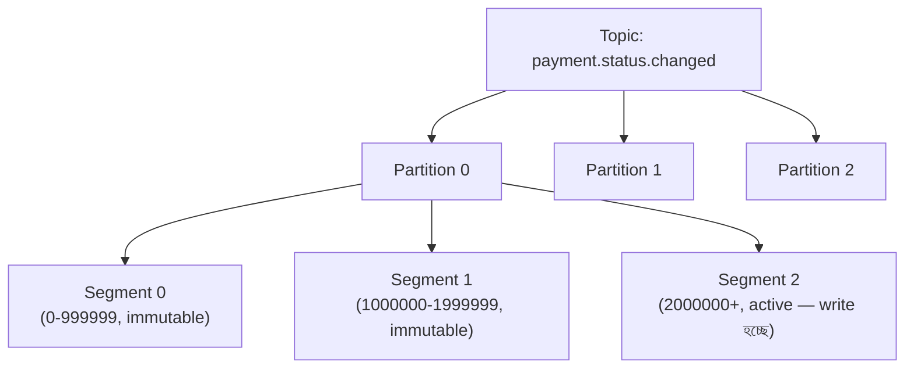
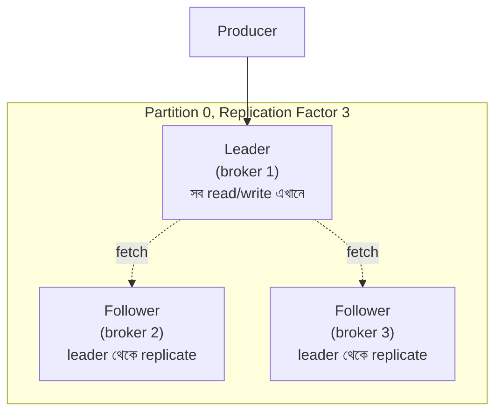
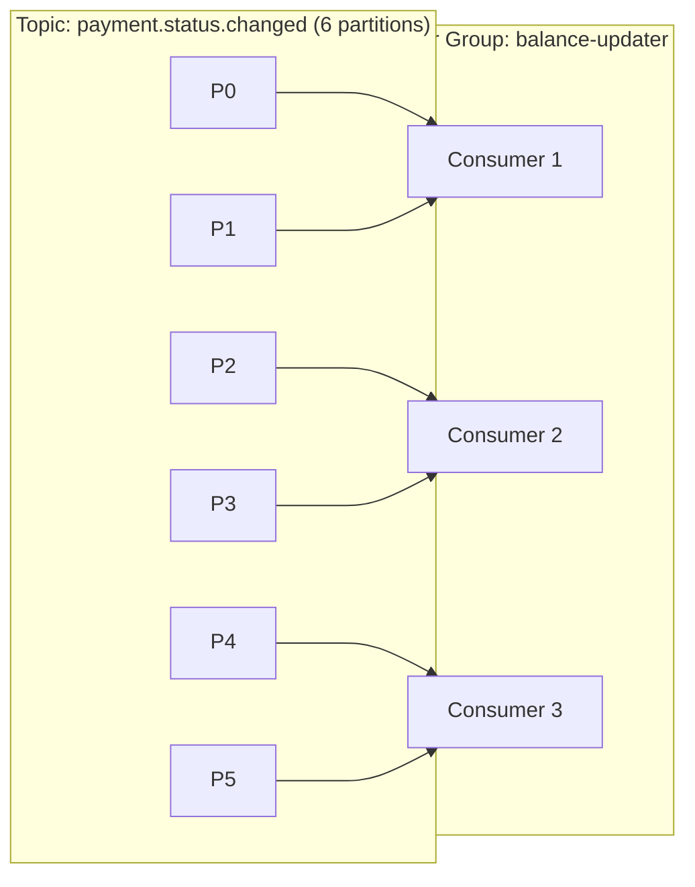

# Module 12 — Kafka Internals

> **Phase D — Async, Messaging & Streaming** | পূর্বশর্ত: M09, M11
> পরের module: M13 (RabbitMQ ও Broker Decision Matrix)

---

## ১. যে consumer group "ordering guarantee আছে" ভেবে ভুল করেছিল

M11-এর শেষে prediction ছিল — "একাধিক independent consumer, replay দরকার, strict ordering" হলে Kafka দরকার। একটা টিম ঠিক এই কারণেই payment event Kafka-তে migrate করল — `payment.status.changed` topic-এ প্রতিটা status transition (`pending` → `processing` → `succeeded`) publish হতো।

কনজিউমার সাইডে একটা balance-update service ছিল যেটা ধরে নিয়েছিল — **"Kafka ordering guarantee দেয়, তাই event গুলো ঠিক ক্রমেই আসবে।"** একদিন একটা payment-এর জন্য দেখা গেল balance ভুল আপডেট হয়েছে — `succeeded` event প্রসেস হওয়ার **পরে** `processing` event প্রসেস হয়েছে, উল্টো ক্রমে।

মূল কারণ: producer কোড প্রতিটা event পাঠানোর সময় **partition key হিসেবে event ID ব্যবহার করছিল** (প্রতিটা event-এ random UUID), `payment_id` না।

```python
# ❌ যা তারা করেছিল
producer.send("payment.status.changed", key=str(uuid.uuid4()), value=event_payload)

# ✅ যা করা উচিত ছিল
producer.send("payment.status.changed", key=str(payment_id), value=event_payload)
```

Kafka **শুধু একটা partition-এর ভেতরে** ordering guarantee দেয়, পুরো topic-জুড়ে না। Random key দেওয়ায় একই payment-এর তিনটা event তিনটা **আলাদা partition**-এ চলে যাচ্ছিল — আর আলাদা partition আলাদা consumer thread দিয়ে সমান্তরালে প্রসেস হয়, কোনো ক্রম গ্যারান্টি ছাড়াই।

এই ঘটনাটাই এই module-এর কেন্দ্রীয় ধারণা প্রতিষ্ঠা করে: **Kafka-র প্রায় প্রতিটা গ্যারান্টি partition-স্কোপড, topic-স্কোপড না।** Partition key নির্বাচন শুধু একটা performance সিদ্ধান্ত না — এটা একটা **correctness** সিদ্ধান্ত।

---

## ২. Log-Structured Storage — M09-এর LSM ধারণার সরাসরি প্রয়োগ

### ২.১ Topic, Partition, Segment



একটা **topic** একাধিক **partition**-এ ভাগ হয়। প্রতিটা partition একটা **append-only log** — M09-এর LSM Tree আলোচনার সাথে সরাসরি সাদৃশ্যপূর্ণ: write সবসময় **sequential**, কখনো in-place update না। প্রতিটা partition ফিজিক্যালি ছোট ছোট **segment** ফাইলে বিভক্ত (ডিফল্ট ১ GB), পুরনো segment immutable, শুধু সর্বশেষ (active) segment-এ write হয়।

**কেন sequential write এত গুরুত্বপূর্ণ:** M07-এর random I/O বনাম sequential I/O আলোচনা মনে করুন — sequential disk write, এমনকি spinning disk-এও, RAM-এর কাছাকাছি গতিতে চলতে পারে, কারণ disk head movement লাগে না। Kafka-র legendary throughput এই একটা design সিদ্ধান্ত থেকেই আসে।

### ২.২ Offset — position, timestamp না

```
Partition 0:
  offset 0: {event A}
  offset 1: {event B}
  offset 2: {event C}
  ...
```

প্রতিটা message-এর একটা **offset** — সেই partition-এর মধ্যে তার sequential position। Consumer তাদের "কতদূর পড়া হয়েছে" ট্র্যাক করে একটা offset number দিয়ে, timestamp দিয়ে না। এটা গুরুত্বপূর্ণ কারণ **replay** মানে হলো "offset X থেকে আবার পড়া শুরু করো" — M11-এর "Kafka-তে event history থাকে, replay সম্ভব" দাবির প্রকৃত mechanism।

### ২.৩ Retention — কতদিন data থাকে

```properties
# server.properties বা topic-level override
log.retention.hours=168        # ৭ দিন
log.retention.bytes=-1         # সীমাহীন (শুধু সময়ের ভিত্তিতে)
log.segment.bytes=1073741824   # ১ GB প্রতি segment
```

M07-এর VACUUM-এর সাথে একটা তুলনামূলক ধারণা: retention period পার হওয়া পুরনো **সম্পূর্ণ segment ফাইল delete** হয় (M08-এর partition DROP-এর মতো — instant, row-by-row না)। এটাই Kafka-কে database না বানিয়ে একটা **buffered log** বানায় — data চিরকাল থাকে না, ডিফল্ট আচরণে।

**Log Compaction — বিকল্প retention মডেল:**

```properties
log.cleanup.policy=compact
```

Compaction মানে "সময়ের ভিত্তিতে মোছা" না, বরং "**প্রতিটা key-র শুধু সর্বশেষ value রাখা**" — পুরনো, superseded value গুলো background compaction-এ সরানো হয় (M07-এর VACUUM-এর ধারণাগত সাদৃশ্য, কিন্তু ভিন্ন mechanism)। এটা ব্যবহার হয় "current state" topic-এ, যেমন `merchant.config.updated` — শুধু সর্বশেষ config গুরুত্বপূর্ণ, পুরনো ইতিহাস না।

---

## ৩. Producer Semantics — `acks` ও Durability

### ৩.১ `acks` — M08-এর synchronous replication আলোচনার Kafka ভার্সন

```python
from kafka import KafkaProducer

producer = KafkaProducer(
    bootstrap_servers=["kafka1:9092", "kafka2:9092"],
    acks="all",              # নিচে বিস্তারিত
    retries=5,
    max_in_flight_requests_per_connection=5,
)
```

| `acks` | অর্থ | Durability | Latency |
|---|---|---|---|
| `0` | Producer পাঠিয়েই ধরে নেয় সফল, কোনো wait নেই | সবচেয়ে দুর্বল — broker না পেলেও data হারাতে পারে | দ্রুততম |
| `1` | শুধু **leader** broker write নিশ্চিত করলেই যথেষ্ট | Leader crash করলে (replicate হওয়ার আগে) data হারাতে পারে | মাঝারি |
| `all` (`-1`) | সব **in-sync replica** (ISR) write নিশ্চিত করতে হবে | সবচেয়ে শক্তিশালী | ধীরতম |

এটা M08 §২.১-এর synchronous বনাম asynchronous replication trade-off-এর হুবহু প্রতিফলন — `acks=all` সেই একই কারণে ব্যবহার করা হয় যে কারণে ledger-এ synchronous replication বিবেচনা করা হয়েছিল: primary/leader crash-এ committed data হারানো অগ্রহণযোগ্য হলে।

> **Senior Tip:** "Payment event-এ কোন `acks` ব্যবহার করবেন?" — M31-এর payment idempotency নীতির সাথে সাযুজ্যপূর্ণ উত্তর: "`acks=all` — কারণ একটা payment status event হারানো মানে downstream system (ledger, notification) কখনো জানবে না payment সফল হয়েছে। এই ক্ষেত্রে latency-র সামান্য বৃদ্ধি গ্রহণযোগ্য বিনিময়, ঠিক M08-এ synchronous replication বেছে নেওয়ার একই যুক্তিতে।"

### ৩.২ Idempotent Producer — M11-এর duplicate সমস্যার Producer-side সমাধান

```python
producer = KafkaProducer(
    bootstrap_servers=[...],
    acks="all",
    enable_idempotence=True,     # ⚠️ producer-level deduplication
)
```

**সমস্যা যা এটা সমাধান করে:** যদি producer একটা message পাঠায়, broker সেটা লেখে কিন্তু ack response network-এ হারিয়ে যায়, producer টাইমআউট ধরে **retry** করে — এখন একই message দুইবার লেখা হয়ে গেছে broker-এ, ঠিক M11-এর at-least-once delivery সমস্যার producer-side সংস্করণ।

**কীভাবে সমাধান করে:** প্রতিটা producer-কে একটা unique ID (PID) দেওয়া হয়, প্রতিটা message-এ একটা sequence number থাকে। Broker দেখে যদি একই PID + sequence number আগেই এসে থাকে, সেটা **silently deduplicate** করে — producer-broker সংযোগের মধ্যে exactly-once নিশ্চিত করে, কিন্তু **শুধু এই একটা সংযোগে**, পুরো end-to-end pipeline-এ না (নিচে §৭-এ এই পার্থক্য গুরুত্বপূর্ণ)।

---

## ৪. Replication — Leader, Follower, ISR



**ISR (In-Sync Replica):** যেসব follower leader-এর সাথে "যথেষ্ট আপ-টু-ডেট" (একটা configurable lag threshold-এর মধ্যে)। `acks=all` মানে **শুধু ISR-এর মধ্যে থাকা replica-গুলোর** নিশ্চয়তা প্রয়োজন, সব replica না — যদি একটা follower অনেক পিছিয়ে যায় (network issue), সে ISR থেকে বাদ পড়ে, আর তার সাড়ার জন্য অপেক্ষা করতে হয় না।

```properties
min.insync.replicas=2    # replication factor 3 হলে, অন্তত 2টা ISR-এ থাকতে হবে acks=all সফল হতে
```

**M08-এর maximum_lag_on_failover-এর সরাসরি সমতুল্য ধারণা:** যদি leader broker crash করে, একটা ISR member-কেই নতুন leader নির্বাচিত করা হয় (কখনো একটা lagging, non-ISR replica না) — এটা M08-এর Patroni-র `maximum_lag_on_failover` সেটিং-এর একই উদ্দেশ্য পূরণ করে, ভিন্ন সিস্টেমে।

---

## ৫. Consumer Group ও Rebalancing

### ৫.১ Consumer Group কীভাবে কাজ করে



**মূল নিয়ম:** একটা consumer group-এ, প্রতিটা partition **শুধু একটা consumer** পড়বে যেকোনো মুহূর্তে (load balancing, M11-এর Celery worker-এর মতো ধারণাগতভাবে, কিন্তু partition-level assignment সহ)। যদি consumer সংখ্যা partition সংখ্যার চেয়ে বেশি হয়, বাড়তি consumer **idle** থাকবে — এটাই Kafka-তে horizontal scaling-এর ঊর্ধ্বসীমা: **partition সংখ্যাই সর্বোচ্চ parallelism নির্ধারণ করে।**

```
৬টা partition-এ সর্বোচ্চ ৬টা consumer কাজ করতে পারে সমান্তরালে।
৭ম consumer যোগ করলেও কোনো লাভ নেই — সে idle থাকবে।
```

> **Senior Tip:** "Kafka-তে কীভাবে scale করবেন?" — উত্তরে partition count-এর কথা প্রথমে বলুন: "Consumer সংখ্যা বাড়ানোর আগে partition সংখ্যা partition-এর ceiling-এ পৌঁছেছে কি না দেখব। এটাও গুরুত্বপূর্ণ যে **partition সংখ্যা পরে বাড়ানো যায়, কিন্তু কমানো যায় না** — এবং partition বাড়ালে existing key-র partition mapping বদলে যেতে পারে (hash % partition_count), যেটা ordering guarantee ভাঙতে পারে temporarily। তাই শুরুতেই expected scale-এর জন্য যথেষ্ট partition রাখা একটা গুরুত্বপূর্ণ up-front সিদ্ধান্ত, M31-এর capacity estimation-এর মতোই।"

### ৫.২ Rebalancing — কখন ঘটে, কেন বিপজ্জনক

```
Rebalancing ট্রিগার হয় যখন:
  - একটা consumer group-এ join/leave করে (deploy, crash, scale)
  - একটা consumer heartbeat মিস করে (session.timeout.ms পার হয়)
  - Topic-এ নতুন partition যোগ হয়
```

**Eager Rebalancing (পুরনো ডিফল্ট, "stop-the-world"):**

```
রিব্যালান্স শুরু → সব consumer তাদের সব partition ছেড়ে দেয় →
নতুন assignment গণনা হয় → সব consumer নতুন partition assignment পায়
                          ↑
        এই পুরো সময় (কয়েক সেকেন্ড থেকে মিনিট) কোনো consumer কিছুই পড়ে না — pipeline সম্পূর্ণ থেমে যায়
```

**Cooperative Sticky Rebalancing (আধুনিক, পছন্দনীয়):**

```
রিব্যালান্স শুরু → শুধু যেসব partition move করতে হবে সেগুলো ছাড়া হয় →
বাকি consumer তাদের existing partition-এ কাজ চালিয়ে যায় → শুধু প্রভাবিত অংশ পুনরায় assign হয়
```

```python
consumer = KafkaConsumer(
    "payment.status.changed",
    group_id="balance-updater",
    partition_assignment_strategy=[
        "org.apache.kafka.clients.consumer.CooperativeStickyAssignor"
    ],
)
```

> **Senior Tip:** "Deploy করার সময় Kafka consumer-এ latency spike হচ্ছে কেন?" — M02-এর "deploy-এ 502" আর M08-এর "rolling deployment" আলোচনার সমান্তরাল প্রশ্ন। উত্তর: "Rolling deployment-এ প্রতিটা consumer pod restart হওয়ার সময় group-এ leave/join ঘটায়, প্রতিটাই একটা rebalance ট্রিগার করে। Eager rebalancing-এ পুরো consumer group সাময়িকভাবে থেমে যায় — N pod deploy করলে N বার rebalance, প্রতিবার পুরো pipeline pause। সমাধান: cooperative sticky assignor ব্যবহার করা (partial rebalance), আর deploy strategy-তে consumer pod-গুলো একসাথে না, ধাপে ধাপে restart করা (M20-এর rolling deployment configuration-এর সাথে সংযুক্ত)।"

---

## ৬. Delivery Semantics — At-Most-Once, At-Least-Once, Exactly-Once

M11-এর "exactly-once অস্তিত্ব নেই" দাবিটা এখন Kafka-র প্রেক্ষাপটে সুনির্দিষ্টভাবে ব্যাখ্যা করা দরকার — কারণ Kafka **আসলে একটা limited exactly-once guarantee দেয়**, কিন্তু শর্তসাপেক্ষে।

### ৬.১ Consumer-side Commit Strategy

```python
# At-most-once — commit আগে, process পরে
for message in consumer:
    consumer.commit()           # ⚠️ প্রথমে commit
    process(message)            # যদি এখানে crash হয়, message হারিয়ে গেল — আর কখনো প্রসেস হবে না

# At-least-once — process আগে, commit পরে (ডিফল্ট নিরাপদ পছন্দ)
for message in consumer:
    process(message)            # যদি এখানে crash হয়, commit হয়নি
    consumer.commit()           # তাই message আবার deliver হবে — duplicate, কিন্তু loss না

# Exactly-once — শুধু নির্দিষ্ট শর্তে সম্ভব (নিচে §৬.২)
```

M11-এর `acks_late` আলোচনার সাথে হুবহু সমান্তরাল: **at-most-once = data loss ঝুঁকি, at-least-once = duplicate ঝুঁকি**, আর at-least-once সাধারণত পছন্দনীয় কারণ duplicate idempotency দিয়ে সামলানো যায়, loss প্রায় অসামলযোগ্য।

### ৬.২ Exactly-Once Semantics (EOS) — কখন সত্যিই সম্ভব

Kafka-র EOS কাজ করে **শুধুমাত্র** এই নির্দিষ্ট প্যাটার্নে: **Kafka থেকে read → প্রসেস → Kafka-তে write**, পুরোটা একটা atomic transaction হিসেবে।

```python
producer = KafkaProducer(
    bootstrap_servers=[...],
    transactional_id="balance-updater-1",   # ⚠️ প্রতিটা producer instance-এর জন্য unique
)
producer.init_transactions()

for message in consumer:
    producer.begin_transaction()
    try:
        result = process(message)
        producer.send("balance.updated", value=result)
        # consumer offset commit-ও এই transaction-এর অংশ —
        # যেন "আমি এই message পড়েছি" আর "আমি output পাঠিয়েছি" atomic হয়
        producer.send_offsets_to_transaction(
            {TopicPartition(message.topic, message.partition): message.offset + 1},
            consumer.config["group_id"],
        )
        producer.commit_transaction()
    except Exception:
        producer.abort_transaction()   # সব-বা-কিছুই না — offset commit বা output কোনোটাই হবে না
```

**কেন এই প্যাটার্নেই EOS সম্ভব:** পুরো "read-process-write" চক্রটা একটা atomic transaction-এ মোড়ানো — output message আর offset commit একসাথে সফল হয়, নাহলে দুইটাই ব্যর্থ হয়। এটা M31-এর outbox pattern-এর ধারণাগত সাদৃশ্য — **দুইটা আলাদা side-effect-কে একটা atomic unit-এ বাঁধা**, যাতে "একটা হলো, আরেকটা হলো না" অবস্থা অসম্ভব হয়।

**কেন এটা সীমিত:** যদি প্রসেসিং-এর মধ্যে **কোনো external side effect** থাকে যেটা Kafka transaction-এর অংশ না (একটা HTTP call, একটা PostgreSQL write, একটা email পাঠানো), সেই side effect-এর জন্য exactly-once guarantee **নেই**। M31-এর payment webhook delivery-তে EOS প্রযোজ্য না, কারণ webhook merchant-এর server-এ যায়, Kafka-র বাইরে — সেখানে idempotency key-ই একমাত্র সমাধান, EOS mechanism না।

> **Senior Tip:** "Kafka-তে exactly-once আছে না?" — এই প্রশ্নে সবচেয়ে নির্ভুল উত্তর: "Kafka-থেকে-Kafka পাইপলাইনে (read-process-write সব Kafka-তে), হ্যাঁ transactional producer দিয়ে exactly-once অর্জন করা যায়। কিন্তু মুহূর্তে আপনার pipeline-এ কোনো external system (database, HTTP API, file system) জড়িত হয়, সেই guarantee ভেঙে যায় — কারণ সেই external write Kafka-র transaction-এর অংশ না। বাস্তবে বেশিরভাগ real-world pipeline-এ external side effect থাকে, তাই ব্যবহারিকভাবে আমি সবসময় at-least-once + idempotent consumer design ধরে নিয়ে কাজ করি, EOS-কে একটা bonus optimization হিসেবে দেখি যেখানে প্রযোজ্য, primary guarantee হিসেবে না।"

---

## ৭. Partition Key Design — §১-এর ঘটনার সমাধান, সম্পূর্ণ কাঠামো

### ৭.১ নিয়ম

```python
# ✅ একই entity-র সব event একই partition-এ, ordering নিশ্চিত করতে
producer.send("payment.status.changed", key=str(payment_id).encode(), value=payload)
```

**Kafka partition নির্বাচন করে key-র hash দিয়ে:** `partition = hash(key) % num_partitions`। একই key সবসময় একই partition-এ যায় (যতক্ষণ partition সংখ্যা না বদলায়) — এটাই ordering guarantee-র প্রকৃত ভিত্তি।

### ৭.২ Hot Partition — M08 §৫.৩-এর সরাসরি পুনরাবৃত্তি

```
যদি একটা merchant-এর payment volume অন্য সবার চেয়ে বহুগুণ বেশি হয় (M08-এর
sharding আলোচনায় hot partition সমস্যার হুবহু Kafka সংস্করণ), তার payment_id
partition key হলে সেই partition-ই সবচেয়ে বেশি load বহন করবে, বাকি partition
কম ব্যবহৃত থাকবে — consumer-দের মধ্যে load ভারসাম্যহীন।
```

**সমাধান একই কাঠামো, M08-এ যেমন ছিল:**

```python
# Composite key — ordering-এর প্রয়োজনীয় scope রক্ষা করে (একটা payment-এর
# সব event এখনো একসাথে), কিন্তু বড় merchant-এর ভিন্ন payment ভিন্ন partition-এ
key = f"{payment_id}"   # payment-level ordering-ই যথেষ্ট, merchant-level না — hot partition কম ঝুঁকিপূর্ণ এখানে
```

> M08-এর merchant-based sharding আর এই payment-based partitioning-এর মধ্যে পার্থক্যটা লক্ষণীয়: **ordering guarantee ঠিক ততটুকু scope-এ রাখা উচিত যতটুকু প্রয়োজন, তার বেশি না।** যদি শুধু "একটা payment-এর status transition-গুলো ক্রমানুসারে আসুক" দরকার হয় (merchant-level ordering না), `payment_id` key যথেষ্ট এবং hot partition ঝুঁকি merchant_id-based key-এর চেয়ে কম।

---

## ৮. Schema Registry ও Schema Evolution

### ৮.১ কেন দরকার — M09-এর JSON বনাম binary trade-off-এর প্রয়োগ

```python
# ❌ Raw JSON — কোনো schema enforcement নেই
producer.send("payment.events", value=json.dumps(event).encode())
# একজন developer একটা field-এর নাম বদলালে বা type বদলালে,
# consumer সাইডে কোনো compile-time বা এমনকি runtime warning ছাড়াই break করবে
```

```python
# ✅ Avro + Schema Registry — schema enforced, evolution controlled
from confluent_kafka.schema_registry import SchemaRegistryClient
from confluent_kafka.schema_registry.avro import AvroSerializer

schema_registry_client = SchemaRegistryClient({"url": "http://schema-registry:8081"})
avro_serializer = AvroSerializer(schema_registry_client, payment_event_schema_str)
```

**Schema Registry** একটা কেন্দ্রীয় সার্ভিস যেখানে প্রতিটা topic-এর message schema (Avro/Protobuf) রেজিস্টার্ড থাকে, আর প্রতিটা নতুন schema version-এর **compatibility check** হয় আগের version-এর সাথে — producer/consumer কোড deploy হওয়ার আগেই।

### ৮.২ Backward বনাম Forward Compatibility

| Compatibility Type | অর্থ | নিরাপদ পরিবর্তন |
|---|---|---|
| **Backward** | নতুন schema দিয়ে লেখা data, পুরনো schema দিয়ে consumer পড়তে পারবে | Field যোগ করা (default value সহ), field মোছা |
| **Forward** | পুরনো schema দিয়ে লেখা data, নতুন schema দিয়ে consumer পড়তে পারবে | Field মোছা, field যোগ করা (default সহ) |
| **Full** | দুইটাই | সবচেয়ে নিরাপদ, সবচেয়ে বেশি সীমাবদ্ধ |

**M08-এর zero-downtime migration-এর সাথে সরাসরি সাদৃশ্য:** এই সমস্যাটা ঠিক database schema migration-এর মতোই — rolling deployment-এ পুরনো ও নতুন consumer code একসাথে চলে (M08 §৬.১-এর expand-contract-এর একই কারণ), তাই একটা schema change **backward-compatible** হতে হবে যতক্ষণ না সব consumer আপডেট হয়ে যায়।

```json
// ✅ নিরাপদ — নতুন optional field, default সহ
{
  "type": "record",
  "name": "PaymentEvent",
  "fields": [
    {"name": "payment_id", "type": "string"},
    {"name": "amount_minor", "type": "long"},
    {"name": "risk_score", "type": ["null", "int"], "default": null}
  ]
}

// ❌ Breaking — required field-এর type বদলানো, বা কোনো default ছাড়া required field যোগ
```

> **Senior Tip:** "Kafka-তে একটা event-এর structure বদলানো কীভাবে নিরাপদে করবেন?" — M08-এর migration playbook-এর সাথে সরাসরি সংযোগ করুন: "এটা M08-এর expand-contract migration-এর একই মূলনীতি, ভিন্ন layer-এ প্রয়োগ। প্রথমে schema-তে নতুন optional field যোগ করি (backward compatible), producer আপডেট করে দুই ধরনের consumer-ই handle করার মতো data পাঠাই, তারপর consumer-গুলো আপডেট করি নতুন field ব্যবহার করতে, সবশেষে (যদি প্রয়োজন হয়) পুরনো field deprecated করি — কখনো একটা single, breaking change একসাথে করি না, কারণ rolling deployment-এ পুরনো ও নতুন কোড সবসময় কিছুক্ষণ একসাথে চলে।"

---

## ৯. Dead Letter Queue Pattern

```python
def consume_with_dlq(consumer, producer, dlq_topic, max_retries=3):
    for message in consumer:
        retry_count = get_retry_count(message)   # header থেকে
        try:
            process(message)
            consumer.commit()
        except RetryableError:
            if retry_count < max_retries:
                # retry topic-এ পাঠানো (backoff সহ, M11-এর jitter নীতি প্রযোজ্য)
                producer.send(f"{message.topic}.retry", value=message.value,
                              headers=[("retry_count", str(retry_count + 1).encode())])
            else:
                producer.send(dlq_topic, value=message.value,
                              headers=[("original_topic", message.topic.encode()),
                                       ("failure_reason", b"max_retries_exceeded")])
            consumer.commit()   # মূল message-টা এখান থেকে সরিয়ে দেওয়া — pipeline block না করে
        except NonRetryableError as e:
            producer.send(dlq_topic, value=message.value,
                          headers=[("failure_reason", str(e).encode())])
            consumer.commit()
```

**M11 §৬.৩-এর retryable বনাম non-retryable exception শ্রেণীবিভাগের সরাসরি প্রয়োগ**, কিন্তু এখানে গুরুত্বপূর্ণ একটা অতিরিক্ত বিবেচনা: Kafka consumer-এ, একটা message process করতে ব্যর্থ হয়ে **commit না করলে**, সেই partition-এর **পরবর্তী সব message আটকে থাকবে** (M02-এর HTTP/1.1 head-of-line blocking-এর সরাসরি সমান্তরাল, কিন্তু partition-level-এ) — যতক্ষণ না সেই message-টা কোনোভাবে resolve হয়। তাই DLQ pattern-এ ব্যর্থ message-কে **সরিয়ে ফেলা** (DLQ topic-এ পাঠিয়ে commit করা) বাধ্যতামূলক, নাহলে একটা poison message পুরো partition-এর throughput স্থায়ীভাবে বন্ধ করে দিতে পারে।

---

## ১০. Django Integration — Producer ও Consumer

```python
# services/events.py — M31-এর outbox pattern-এর Kafka producer অংশ
from confluent_kafka import Producer

_producer = Producer({
    "bootstrap.servers": "kafka1:9092,kafka2:9092",
    "acks": "all",
    "enable.idempotence": True,
    "linger.ms": 10,          # ছোট batch delay — throughput-latency ব্যালেন্স
})

def publish_payment_event(event_type: str, payment_id: str, payload: dict):
    _producer.produce(
        topic="payment.status.changed",
        key=str(payment_id).encode(),         # §৭-এর ordering নিয়ম
        value=json.dumps(payload).encode(),
        callback=_delivery_callback,
    )
    _producer.poll(0)   # non-blocking — pending delivery callback প্রসেস করে

def _delivery_callback(err, msg):
    if err is not None:
        logger.error("kafka_delivery_failed", extra={"error": str(err)})
        # M31-এর outbox pattern: এই ব্যর্থতা relay-level retry দিয়ে সামলানো হয়,
        # কারণ event টা এখনো outbox টেবিলে আছে (delivered mark হয়নি)
```

```python
# outbox relay — M31/M14-এর outbox pattern-এর consumer অংশ (Celery Beat দিয়ে polling, বা CDC)
@shared_task
def relay_outbox_events():
    pending = OutboxEvent.objects.filter(published=False).order_by("created_at")[:500]
    for event in pending:
        publish_payment_event(event.topic, event.aggregate_id, event.payload)
        event.published = True
        event.save(update_fields=["published"])
```

**গুরুত্বপূর্ণ architectural সংযোগ:** Kafka producer নিজে atomicity guarantee দেয় না DB write-এর সাথে (M31-এর dual-write সমস্যা) — তাই outbox pattern এখনো প্রয়োজনীয়, Kafka ব্যবহার করলেও। "DB-তে লেখা হলো কিন্তু Kafka event গেল না" — এই ঝুঁকি Kafka নিজে সমাধান করে না, outbox pattern করে (M14-এ সম্পূর্ণ বিস্তারিত)।

---

## ১১. Interview Section

### প্রশ্ন ১ (Senior) — "Kafka কি ordering guarantee দেয়?"

**❌ Wrong Answer**
> "হ্যাঁ, Kafka message ordering বজায় রাখে।"

*কেন বিপজ্জনক:* এটাই §১-এর প্রোডাকশন incident-এর সরাসরি কারণ — একটা অতি-সরলীকৃত, ভুল mental model।

**🌟 Senior/Staff Answer**
> "শুধু **একটা partition-এর ভেতরে**, পুরো topic-জুড়ে না। Kafka producer একটা message-এর key hash করে partition নির্ধারণ করে — একই key সবসময় একই partition-এ যায়, তাই সেই key-র সব message ক্রমানুসারে আসবে (producer-এর পাঠানোর ক্রমে)। কিন্তু ভিন্ন partition ভিন্ন consumer thread দিয়ে সমান্তরালে প্রসেস হয় — তাদের মধ্যে কোনো ক্রম গ্যারান্টি নেই।
>
> এর ব্যবহারিক অর্থ: যদি ordering প্রয়োজনীয় কোনো entity-র জন্য (যেমন একটা payment-এর status transition), সেই entity-র ID-ই partition key হতে হবে। যদি key random হয় বা entity-নির্দিষ্ট না হয়, একই entity-র event ভিন্ন partition-এ ছড়িয়ে যাবে, আর consumer সাইডে তাদের ক্রম undefined হয়ে যাবে — এটা এমন একটা bug যেটা normal load-এ কদাচিৎ প্রকাশ পায় (কারণ বেশিরভাগ সময় events দ্রুত সিরিয়ালি প্রসেস হয়ে যায়), কিন্তু high-throughput বা consumer lag-এর সময় প্রকট হয়।"

---

### প্রশ্ন ২ (Staff / Architecture) — "আমাদের consumer group deploy-এর সময় কয়েক সেকেন্ডের জন্য কোনো message প্রসেস করে না। এটা কি সমস্যা?"

**🌟 Senior/Staff Answer**
> "এটা rebalancing — প্রতিটা consumer pod restart হওয়ার সময় group-এ leave/rejoin ঘটে, যেটা eager rebalancing strategy-তে (Kafka-র পুরনো ডিফল্ট) পুরো consumer group-কে সাময়িকভাবে থামিয়ে দেয়, নতুন partition assignment সম্পূর্ণ না হওয়া পর্যন্ত।
>
> এটা সমস্যা কি না নির্ভর করে **latency budget**-এর উপর — M31-এর latency requirement আলোচনার একই প্রশ্ন এখানে প্রযোজ্য। যদি এই consumer analytics aggregate করছে যেখানে কয়েক সেকেন্ড delay গ্রহণযোগ্য, উদ্বেগের কিছু নেই। যদি এটা real-time balance update বা fraud detection-এর মতো latency-critical path হয়, এটা সমাধান করা দরকার।
>
> **সমাধান, কার্যকারিতার ক্রমানুসারে:**
> ১. **Cooperative sticky rebalancing** ব্যবহার করা — শুধু প্রভাবিত partition move হয়, বাকি consumer কাজ চালিয়ে যায়। এটা প্রায়ই একাই সমস্যাটা যথেষ্ট কমিয়ে দেয়।
> ২. **Deploy strategy পরিবর্তন** — সব consumer pod একসাথে restart না করে একটা একটা করে (rolling), যাতে একবারে শুধু একটা rebalance trigger হয়, পুরো group একসাথে না।
> ৩. **`session.timeout.ms`/`max.poll.interval.ms` tuning** — খুব কম হলে সাময়িক slowness-কেও 'consumer মৃত' ধরে নিয়ে অপ্রয়োজনীয় rebalance trigger করতে পারে (M02-এর keep-alive timeout misconfiguration-এর সাথে ধারণাগত সাদৃশ্য — timeout খুব সংবেদনশীল হলে false positive তৈরি করে)।
>
> এই ধরনের 'deploy-এর সময় latency spike' প্যাটার্ন আসলে আমরা M02 (connection draining), M08 (rolling migration), M11 (Beat single instance) জুড়ে বারবার দেখেছি ভিন্ন layer-এ — deployment এবং distributed system-এর membership change সবসময় একটা transient disruption window তৈরি করে, আর প্রতিটা layer-এর নিজস্ব mitigation strategy আছে।"

---

### প্রশ্ন ৩ (Coding / Debugging) — "এই consumer কোডে কী সমস্যা আছে?"

```python
consumer = KafkaConsumer("payment.events", group_id="processor",
                          enable_auto_commit=True, auto_commit_interval_ms=5000)

for message in consumer:
    process_payment_event(message.value)   # ধরে নেই এটা কখনো exception ছোঁড়ে না
```

**🌟 Senior Answer**
> "দুইটা সমস্যা, একটা সূক্ষ্ম, একটা গুরুতর:
>
> **১. `enable_auto_commit=True` at-most-once ঝুঁকি তৈরি করে।** Auto-commit প্রতি ৫ সেকেন্ডে (timer-based) offset commit করে, **process সম্পন্ন হওয়া নিশ্চিত না করেই**। যদি একটা message process হওয়ার মাঝপথে (বা এমনকি process হওয়ার আগেই, যদি commit timer আগে ফায়ার করে) worker crash করে, সেই message-এর offset ইতিমধ্যে commit হয়ে থাকতে পারে — অর্থাৎ message **হারিয়ে গেল**, আর কখনো আবার প্রসেস হবে না। এটা M11-এর `acks_early` সমস্যার হুবহু consumer-side সংস্করণ।
>
> সমাধান — manual commit, process সম্পন্ন হওয়ার **পরে**:
> ```python
> consumer = KafkaConsumer("payment.events", group_id="processor",
>                          enable_auto_commit=False)
> for message in consumer:
>     process_payment_event(message.value)
>     consumer.commit()   # শুধু সফল process-এর পরে
> ```
>
> **২. কোনো exception handling নেই — 'কখনো exception ছোঁড়ে না' একটা বিপজ্জনক অনুমান।** যদি `process_payment_event` কোনো কারণে exception raise করে (downstream DB down, malformed message), পুরো consumer loop **crash করবে**, আর worker restart হলে সেই একই message আবার পড়বে, আবার crash করবে — একটা **poison message loop**, যেটা পুরো partition-কে স্থায়ীভাবে আটকে দেয় (§৯-এর head-of-line blocking সমস্যা)।
>
> সংশোধিত সংস্করণ — offset commit শুধু সফল process-এর পরে, আর ব্যর্থ message DLQ-তে পাঠিয়ে আটকে না থেকে এগিয়ে যাওয়া:
> ```python
> for message in consumer:
>     try:
>         process_payment_event(message.value)
>     except Exception as e:
>         send_to_dlq(message, reason=str(e))
>         logger.error('processing_failed', exc_info=e)
>     consumer.commit()   # সাফল্য বা DLQ — উভয় ক্ষেত্রেই এগিয়ে যাওয়া, আটকে না থাকা
> ```
> এখানে trade-off স্পষ্টভাবে বলা দরকার — এটা at-least-once থেকে সরে গিয়ে effectively duplicate-tolerant at-most-once-এর কাছাকাছি আচরণ করছে DLQ-প্রাপ্ত message-এর জন্য (retry হবে না automatically), তাই `process_payment_event` নিজে যদি M11-এর idempotency নীতি মেনে চলে, DLQ থেকে manual/automated retry পরে নিরাপদে চালানো যাবে।"

---

### প্রশ্ন ৪ (Architecture Decision) — "আমাদের ৩টা microservice একটা payment event নিয়ে কাজ করে। Kafka topic নাকি প্রতিটা service-কে সরাসরি HTTP call?"

**🌟 Senior/Staff Answer**
> "এটা M17-এর sync বনাম async communication সিদ্ধান্তের একটা প্রয়োগ, কিন্তু এখানে নির্দিষ্ট প্রশ্নগুলো জিজ্ঞেস করব:
>
> **Coupling:** HTTP call-এ payment service-কে জানতে হয় ঠিক কোন ৩টা service ডাকতে হবে, তাদের endpoint, তাদের uptime-এর উপর নির্ভরশীল হতে হয় (M16-এর circuit breaker ছাড়া, একটা downstream service down হলে পুরো payment flow আটকে যেতে পারে — M02-এর 'external call পুরো worker আটকায়' নীতির multi-service সংস্করণ)। Kafka-তে payment service শুধু publish করে, কে consume করছে জানার দরকার নেই — নতুন consumer (৪র্থ service) যোগ করতে payment service-এর কোনো কোড বদলাতে হয় না।
>
> **Delivery guarantee:** HTTP call synchronous — payment service-কে active থাকতে হবে call সফল হওয়া পর্যন্ত, retry logic নিজে লিখতে হয় প্রতিটা caller-এ (M02-এর retry/backoff/jitter নীতি প্রতিটা call site-এ ডুপ্লিকেট হয়)। Kafka-তে delivery guarantee broker-level — consumer service কিছুক্ষণ down থাকলেও, সে ফিরে এলে যেখানে ছেড়েছিল সেখান থেকে চালিয়ে যাবে (§২.২-এর offset-based tracking)।
>
> **Latency:** HTTP synchronous হলে payment response তিনটা downstream call-এর মধ্যে সবচেয়ে ধীরটার উপর নির্ভরশীল (যদি sequential হয়) বা M04-এর async gather প্যাটার্ন দরকার (যদি parallel হয়)। Kafka-তে payment response publish-এর latency-র উপর নির্ভরশীল, যেটা milliseconds — downstream processing সম্পূর্ণ decoupled।
>
> **আমার সুপারিশ:** Kafka topic। এই ব্যবহারের প্যাটার্নে (একটা event, একাধিক independent consumer, delivery guarantee ও decoupling গুরুত্বপূর্ণ) এটা M17-এর event-driven architecture-এর ক্লাসিক ফিট। তবে সততার সাথে trade-off-ও বলা দরকার: এখন যদি payment service-কে **সাথে সাথে জানতে হয়** একটা downstream call সফল হয়েছে কি না (যেমন একটা synchronous validation যেটা payment approve করার আগে দরকার), সেই নির্দিষ্ট call HTTP-ই থাকা উচিত — Kafka async, তাই request-response pattern-এর জন্য স্বাভাবিক fit না। মিশ্র approach সাধারণ: critical, synchronous validation HTTP-এ, downstream notification/processing Kafka event-এ।"

---

## ১২. হাতে-কলমে অনুশীলন

**১ — Partition ordering পুনরুৎপাদন (৩০ মিনিট, Docker দিয়ে)**
একটা local Kafka (Docker Compose) সেটআপ করুন, ৩টা partition-সহ একটা topic বানান। একটা producer লিখুন যা একই key দিয়ে ১০টা message পাঠায়, তারপর random key দিয়ে ১০টা message পাঠায়। Consumer-এ দেখুন প্রথম গ্রুপের ক্রম বজায় আছে, দ্বিতীয়টার নেই।

**২ — Rebalancing দেখুন (২৫ মিনিট)**
২টা consumer একই group-এ চালান একটা ৪-partition topic-এ। একটা consumer বন্ধ করুন, অন্যটার log-এ rebalance event দেখুন এবং partition assignment বদলাতে দেখুন।

**৩ — Poison message সিমুলেট করুন (২০ মিনিট)**
একটা consumer লিখুন যা একটা নির্দিষ্ট message-এ সবসময় exception ছোঁড়ে, exception handling ছাড়া। দেখুন consumer আটকে যায় (অথবা crash-restart loop করে)। তারপর DLQ pattern যোগ করে consumer এগিয়ে যাচ্ছে দেখুন।

**৪ — Schema evolution টেস্ট (৩০ মিনিট, Schema Registry থাকলে)**
একটা Avro schema দিয়ে producer/consumer বানান। Schema-তে একটা optional field (default সহ) যোগ করুন, পুরনো consumer কোড দিয়ে নতুন message পড়ার চেষ্টা করুন — backward compatibility নিজের চোখে দেখুন।

---

## ১৩. মূল কথা

1. **Kafka partition-এর ভেতরে ordering guarantee দেয়, topic-জুড়ে না** — partition key নির্বাচন একটা correctness সিদ্ধান্ত, শুধু performance না।
2. **Sequential write-ই Kafka-র throughput-এর উৎস** (M09-এর LSM Tree নীতির প্রয়োগ), retention-এ পুরনো segment delete (M08-এর partition DROP-এর সমতুল্য)।
3. **`acks=all` + `min.insync.replicas`** critical data-তে data loss প্রতিরোধ করে, M08-এর synchronous replication-এর একই trade-off।
4. **Consumer group-এ partition সংখ্যাই সর্বোচ্চ parallelism নির্ধারণ করে** — বেশি consumer যোগ করলে partition সংখ্যার বেশি কোনো লাভ নেই।
5. **Rebalancing pipeline সাময়িকভাবে থামায়** (eager) — cooperative sticky assignor দিয়ে কমানো যায়, deploy strategy দিয়েও প্রভাব কমানো যায়।
6. **Exactly-once শুধু Kafka-থেকে-Kafka pipeline-এ সম্ভব** (transactional producer দিয়ে) — external side effect জড়িত হলে সেই guarantee ভেঙে যায়, at-least-once + idempotency-ই ব্যবহারিক ভিত্তি।
7. **Schema evolution database migration-এর একই নিয়ম মানে** — backward compatible change, rolling deployment-এর পুরো window জুড়ে পুরনো ও নতুন কোড একসাথে কাজ করার নিশ্চয়তা সহ।
8. **Poison message DLQ ছাড়া partition-কে স্থায়ীভাবে block করতে পারে** — ব্যর্থ message সরিয়ে এগিয়ে যাওয়া বাধ্যতামূলক, retry logic-এর সাথে।
9. **Kafka নিজে dual-write সমস্যা সমাধান করে না** — outbox pattern এখনো প্রয়োজনীয় DB write আর Kafka publish-এর মধ্যে atomicity নিশ্চিত করতে।

---

## পরের Module

**M13 — RabbitMQ ও Broker Decision Matrix।** আজ আমরা Kafka-র log-based model গভীরভাবে দেখলাম। পরের module-এ RabbitMQ-র সম্পূর্ণ ভিন্ন model (exchange/queue/routing key, message-based না log-based) কভার করব, আর সবচেয়ে গুরুত্বপূর্ণ — Kafka বনাম RabbitMQ বনাম SQS বনাম Redis Streams (M10-এ শুরু হওয়া তুলনা) বনাম NATS/Pulsar-এর একটা সম্পূর্ণ decision matrix, যাতে "কোন broker কখন" প্রশ্নের একটা systematic উত্তর থাকে, শুধু পরিচিতির ভিত্তিতে না।
