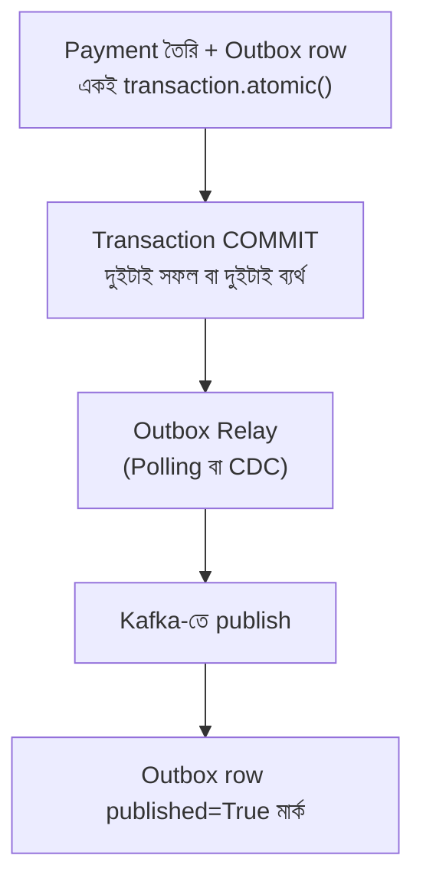
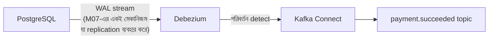
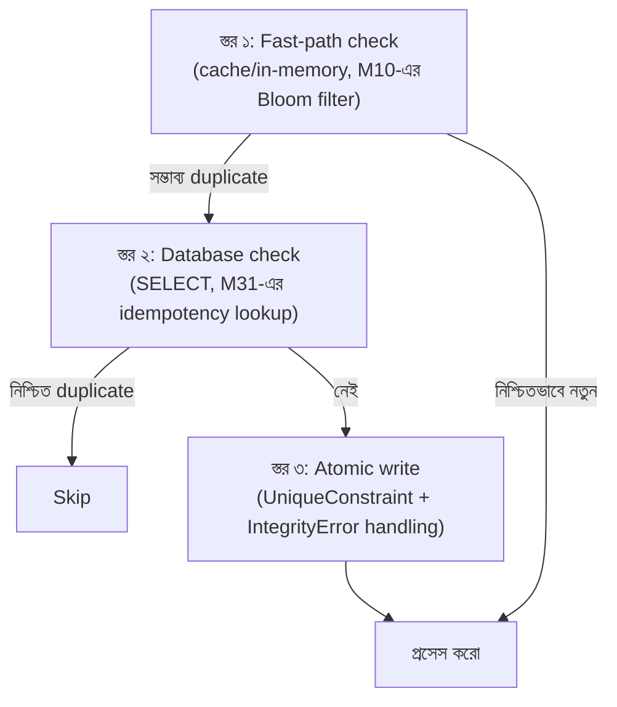
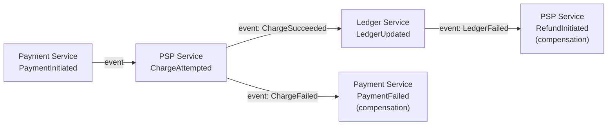
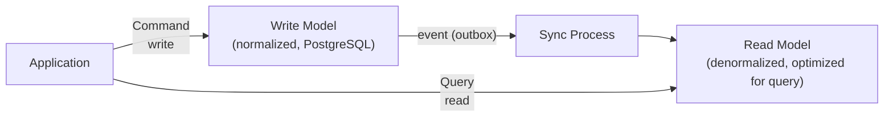

# Module 14 — Event-Driven Architecture Patterns

> **Phase D — Async, Messaging & Streaming** | পূর্বশর্ত: M11, M12, M13
> পরের module: M15 (Distributed Systems Theory) — Phase E শুরু

---

## ১. যে payment "সফল" হয়েছিল কিন্তু কেউ জানত না

M31-এর শুরু থেকে আমরা outbox pattern উল্লেখ করে আসছি — "একই transaction-এ payment row আর outbox row লেখা হয়, যাতে DB write আর event publish একসাথে সফল বা একসাথে ব্যর্থ হয়।" এখন সেই দাবির পেছনের **কেন**-টা সম্পূর্ণভাবে দেখা যাক, একটা ঘটনা দিয়ে যেটা outbox pattern ছাড়া ঠিক কী ভুল হতে পারত।

একটা আগের সংস্করণে (outbox pattern implement করার আগে), payment service কোড এরকম ছিল:

```python
def create_payment(merchant, amount_minor):
    with transaction.atomic():
        payment = Payment.objects.create(
            merchant=merchant, amount_minor=amount_minor, status="succeeded"
        )
    # transaction commit হয়ে গেছে — এখন event publish
    kafka_producer.send("payment.succeeded", value={"payment_id": str(payment.id)})
    return payment
```

দেখতে যুক্তিসঙ্গত — DB-তে লেখা, তারপর event পাঠানো। কিন্তু এই দুইটা অপারেশন **দুইটা সম্পূর্ণ ভিন্ন সিস্টেম**, কোনো shared transaction নেই তাদের মধ্যে। একদিন Kafka broker-এ একটা সংক্ষিপ্ত network partition হলো ঠিক payment commit হওয়ার পরের মুহূর্তে। `kafka_producer.send()` ব্যর্থ হলো (timeout)।

**ফলাফল:** payment টা database-এ সফলভাবে `succeeded` হিসেবে রেকর্ড হয়ে গেছে — merchant-এর টাকা কেটে গেছে, সব ঠিক আছে ডাটাবেসের দৃষ্টিতে। কিন্তু কোনো `payment.succeeded` event কখনো publish হয়নি। যেসব downstream system এই event-এর উপর নির্ভর করে (ledger entry তৈরি, merchant-কে notification, analytics) — তাদের কেউই জানল না এই payment হয়েছে। **Payment "সফল" কিন্তু কার্যকরভাবে অদৃশ্য বাকি সিস্টেমের কাছে।**

এই সমস্যাটার নাম **dual-write problem** — এবং এটা distributed system-এর সবচেয়ে সাধারণ, সবচেয়ে সূক্ষ্ম bug-এর উৎস। এই module-এ আমরা দেখব কেন এটা এড়ানো যায় না "চেষ্টা করে" (retry, try-catch দিয়ে), শুধু architectural pattern দিয়েই সমাধানযোগ্য।

---

## ২. Event, Command, Message — পরিভাষার স্পষ্টতা

এই তিনটা শব্দ প্রায়ই মিশিয়ে ব্যবহার করা হয়, কিন্তু তাদের semantic পার্থক্য architectural সিদ্ধান্তে গুরুত্বপূর্ণ:

| | সংজ্ঞা | উদাহরণ | প্রত্যাশা |
|---|---|---|---|
| **Command** | "এই কাজটা করো" — একটা নির্দিষ্ট action-এর অনুরোধ | `ChargeCard`, `CancelSubscription` | Sender জানে ঠিক কে এটা handle করবে; ব্যর্থ হতে পারে (reject) |
| **Event** | "এটা ঘটেছে" — একটা past fact-এর ঘোষণা | `PaymentSucceeded`, `SubscriptionCancelled` | Sender জানে না (বা গুরুত্ব দেয় না) কে শুনছে; ইতিমধ্যে ঘটে গেছে, প্রত্যাখ্যান করা যায় না |
| **Message** | সাধারণ পরিভাষা — command বা event, transport-এ যেটাই যাচ্ছে | (উভয়ই) | — |

**M11-এর Celery task মূলত command-এর কাছাকাছি** ("deliver this webhook") — নির্দিষ্ট, expected একটা worker করবে। **M12-এর Kafka topic-এর payment event মূলত event** ("payment succeeded") — broadcast, multiple downstream শুনতে পারে, কেউ শুনলেও না শুনলেও ঘটনা ঘটে গেছে।

এই পার্থক্যটা architecturally গুরুত্বপূর্ণ কারণ: **command ব্যর্থ হতে পারে এবং caller সেটা synchronously জানতে চায়** (M17-এর sync communication-এর natural fit), কিন্তু **event ইতিমধ্যে ঘটে যাওয়া কিছুর রেকর্ড — কেউ "না" বলতে পারে না একটা event-কে**, শুধু সেটার প্রতি react করতে পারে।

> **Senior Tip:** "আমাদের microservice-গুলো কি event না command পাঠাচ্ছে?" — এই প্রশ্নের উত্তর প্রায়ই architecture-এর একটা লুকানো সমস্যা প্রকাশ করে। যদি একটা "event" handler ব্যর্থ হলে পুরো flow rollback করার চেষ্টা করে (যেমন "PaymentSucceeded" event পেয়ে fraud-check ব্যর্থ হলে payment-কে "un-succeed" করার চেষ্টা), সেটা আসলে event না — এটা একটা command যেটা ভুলভাবে event হিসেবে মডেল করা হয়েছে। Event ইতিমধ্যে ঘটে যাওয়া fact, তাকে "reject" করা semantically ভুল — সেই ক্ষেত্রে compensating action দরকার (§৬-এ Saga), simple rejection না।

---

## ৩. Transactional Outbox Pattern — সম্পূর্ণ

### ৩.১ কেন dual-write আসলেই unsolvable "চেষ্টা করে"

```python
# ❌ Attempt 1 — event আগে পাঠানো
kafka_producer.send("payment.succeeded", value=...)
Payment.objects.create(status="succeeded")   # এটা ব্যর্থ হলে? Event ইতিমধ্যে পাঠানো হয়ে গেছে
                                               # — একটা payment "succeeded" ঘোষিত যেটা আসলে নেই

# ❌ Attempt 2 — try/except দিয়ে retry
with transaction.atomic():
    payment = Payment.objects.create(status="succeeded")
try:
    kafka_producer.send(...)
except Exception:
    kafka_producer.send(...)   # retry — কিন্তু কতবার? Process নিজেই crash হলে?
                                 # কোনো retry logic worker crash-কে কভার করতে পারে না
```

**মূল সমস্যা:** PostgreSQL transaction আর Kafka publish **দুইটা আলাদা system, দুইটা আলাদা "commit point"**। কোনো amount of try/except/retry দুইটা ভিন্ন সিস্টেমের মধ্যে atomicity তৈরি করতে পারে না, কারণ তাদের মাঝখানে সবসময় একটা window থাকে যেখানে process crash হতে পারে, network partition হতে পারে — M08-এর network partition/M15-এর distributed system uncertainty-র একই মৌলিক সীমাবদ্ধতা।

### ৩.২ Outbox Pattern — সমাধান

**মূল অন্তর্দৃষ্টি:** "DB-তে লেখা" এবং "event পাঠানো"-কে একটা **একক atomic operation**-এ রূপান্তর করা — কিন্তু সেটা করা যায় শুধু যদি event পাঠানো**ও** সেই একই database transaction-এর অংশ হয়। সমাধান: event নিজেই **প্রথমে একটা DB টেবিলে লেখা**, আসল broker-এ পাঠানো পরে, আলাদা প্রসেস দিয়ে।



```python
# models.py
class OutboxEvent(models.Model):
    id = models.UUIDField(primary_key=True, default=uuid.uuid4)
    aggregate_type = models.CharField(max_length=64)   # "payment"
    aggregate_id = models.CharField(max_length=64)      # payment.id
    event_type = models.CharField(max_length=64)        # "payment.succeeded"
    payload = models.JSONField()
    created_at = models.DateTimeField(auto_now_add=True)
    published = models.BooleanField(default=False)
    published_at = models.DateTimeField(null=True)

    class Meta:
        indexes = [
            # M07-এর partial index কৌশল — শুধু unpublished row-এর জন্য
            models.Index(fields=["created_at"], condition=models.Q(published=False),
                         name="idx_unpublished_outbox"),
        ]

# services/payments.py
def create_payment(merchant, amount_minor):
    with transaction.atomic():                          # ⚠️ একটাই transaction
        payment = Payment.objects.create(
            merchant=merchant, amount_minor=amount_minor, status="succeeded"
        )
        OutboxEvent.objects.create(
            aggregate_type="payment", aggregate_id=str(payment.id),
            event_type="payment.succeeded",
            payload={"payment_id": str(payment.id), "amount_minor": amount_minor},
        )
    # এই পয়েন্টে: হয় payment + outbox row দুইটাই DB-তে আছে, নয়তো কোনোটাই নেই
    # Kafka-র কথা এখানে একবারও উল্লেখ হয়নি — সেটা সম্পূর্ণ ভিন্ন প্রসেসের দায়িত্ব
    return payment
```

**কেন এটা কাজ করে:** এখন "payment তৈরি" আর "event রেকর্ড করা" একই PostgreSQL transaction-এর অংশ — M07-এর ACID guarantee এখানে সরাসরি প্রযোজ্য। এই transaction commit হলে, **দুইটাই** নিশ্চিতভাবে আছে ডাটাবেসে। যদি transaction rollback হয় (যেকোনো কারণে), **দুইটাই** নেই। Dual-write সমস্যা সম্পূর্ণ **eliminated**, dodge করা হয়নি — কারণ এখন আর দুইটা আলাদা সিস্টেম-জুড়ে atomicity দরকার নেই, শুধু একটা সিস্টেমে (PostgreSQL) যেটা native ACID দেয়।

### ৩.৩ Relay — Outbox থেকে Kafka-তে

```python
# tasks.py — M12 §১০-এ এই কোড আগেই দেখানো হয়েছিল, এখন সম্পূর্ণ প্রেক্ষাপটে
@shared_task
def relay_outbox_events():
    """Polling-based relay — সরল, কিন্তু latency (poll interval) আছে"""
    pending = OutboxEvent.objects.filter(published=False).order_by("created_at")[:500]
    for event in pending:
        try:
            kafka_producer.produce(
                topic=event.event_type,
                key=event.aggregate_id.encode(),   # M12 §৭-এর ordering নীতি
                value=json.dumps(event.payload).encode(),
            )
            kafka_producer.flush()   # নিশ্চিত delivery, তারপরই DB আপডেট
            event.published = True
            event.published_at = timezone.now()
            event.save(update_fields=["published", "published_at"])
        except Exception as e:
            logger.error("outbox_relay_failed", extra={"event_id": str(event.id)})
            # কিছু করতে হবে না — পরের polling cycle-এ আবার চেষ্টা হবে,
            # কারণ published এখনো False
```

**গুরুত্বপূর্ণ মনোযোগ:** relay নিজে যদি Kafka publish-এর পর কিন্তু `event.save()`-এর আগে crash করে, event **আবার** publish হবে পরের polling cycle-এ — এটা M12 §৬.২-এর at-least-once delivery-র সরাসরি প্রকাশ, এবং এই কারণেই **downstream consumer-কেও idempotent হতে হবে** (M11-এর idempotent task design নীতি এখানে event consumer-এ প্রযোজ্য)। Outbox pattern dual-write সমস্যা সমাধান করে, কিন্তু duplicate delivery সমস্যা (M12 §৬) সমাধান করে না — এই দুইটা **আলাদা সমস্যা**, ভিন্ন layer-এ।

### ৩.৪ CDC (Change Data Capture) — আরও উন্নত relay

```
Polling-based relay-র সীমাবদ্ধতা: poll interval-এর latency (কয়েক সেকেন্ড দেরি),
আর ঘন ঘন polling DB-তে অতিরিক্ত load তৈরি করে

Debezium (CDC tool) সমাধান করে: PostgreSQL-এর WAL (M07-এর Write-Ahead Log!)
সরাসরি পড়ে — outbox টেবিলে নতুন row insert হওয়ার মুহূর্তেই detect করে,
polling ছাড়াই, প্রায় real-time
```



**M07 §২.১-এর সরাসরি সংযোগ:** Debezium মূলত সেই একই WAL mechanism ব্যবহার করে যা PostgreSQL replication (M08 §২.১) ব্যবহার করে — একে বলে **logical replication**। Outbox টেবিলে row insert একটা WAL entry তৈরি করে, Debezium সেটা পড়ে, transform করে Kafka event বানায়। এটা polling-এর চেয়ে অনেক কম latency, কম DB load, কিন্তু নতুন operational dependency (Debezium + Kafka Connect cluster) — আবার M09-এর polyglot persistence trade-off প্রযোজ্য।

> **Senior Tip:** "Outbox relay polling নাকি CDC?" — "যদি latency requirement কয়েক সেকেন্ড সহনীয় (M31-এর 'marketing email < ৫ মিনিট'-এর মতো), Celery Beat polling সরল এবং যথেষ্ট, নতুন infrastructure ছাড়াই। যদি near-real-time দরকার (M31-এর 'OTP < ৩ সেকেন্ড'-এর মতো critical path), CDC বিবেচনা করব — কিন্তু তখন Debezium/Kafka Connect operate করার team capability যাচাই করব, M09-এর checklist অনুযায়ী।"

---

## ৪. Inbox Pattern — Outbox-এর consumer-side জোড়া

### ৪.১ সমস্যা যা এটা সমাধান করে

Outbox pattern নিশ্চিত করে event **নিশ্চিতভাবে পাঠানো হয়েছে**। কিন্তু consumer-side-এ M12 §৬-এর at-least-once delivery মানে **duplicate আসতেই পারে**। M11-এর idempotent task design সমাধান — কিন্তু যখন একটা consumer একটা event পেয়ে **নিজেই আরেকটা DB write করে**, সেখানে dual-write সমস্যাটা **আবার** ফিরে আসে, এইবার consumer side-এ:

```python
# ❌ Consumer-side dual-write সমস্যা
def handle_payment_succeeded(event):
    create_ledger_entry(event["payment_id"], event["amount_minor"])   # DB write ১
    consumer.commit()    # offset commit — "আমি এই event প্রসেস করেছি"
    # যদি commit-এর ঠিক পরে (বা আগে) crash হয়, দুইটার মধ্যে desync হতে পারে
```

### ৪.২ Inbox Pattern — সমাধান

```python
class InboxEvent(models.Model):
    """প্রতিটা প্রসেস করা event-এর একটা রেকর্ড — deduplication-এর জন্য"""
    event_id = models.UUIDField(primary_key=True)   # producer-এর outbox event ID
    processed_at = models.DateTimeField(auto_now_add=True)

def handle_payment_succeeded(event):
    event_id = event["event_id"]   # outbox-এ generate করা original UUID
    with transaction.atomic():
        # ⚠️ M31-এর idempotency pattern-এর হুবহু পুনরাবৃত্তি, এখানে event consumption-এ
        if InboxEvent.objects.filter(event_id=event_id).exists():
            return   # আগেই প্রসেস হয়ে গেছে — নিরাপদে skip, duplicate ledger entry এড়ানো

        LedgerEntry.objects.create(payment_id=event["payment_id"],
                                    amount_minor=event["amount_minor"])
        InboxEvent.objects.create(event_id=event_id)
    # এখন offset commit — এই পয়েন্টে যদি crash হয়, event আবার আসবে,
    # কিন্তু InboxEvent check duplicate ledger entry আটকাবে
    consumer.commit()
```

**M31/M11-এর idempotency pattern-এর প্রতিফলন, কিন্তু এখন একটা সম্পূর্ণ নাম ও প্যাটার্ন হিসেবে প্রতিষ্ঠিত:** Inbox pattern হলো Outbox-এর consumer-side counterpart — উভয় ক্ষেত্রেই মূলনীতি একই: **যে dual-write সমস্যা সমাধান করতে চাই, তাকে একটা single-system atomic operation-এ রূপান্তর করো**, ভিন্ন সিস্টেমের মধ্যে distributed transaction চেষ্টা না করে।

---

## ৫. Idempotency Key Design — সম্পূর্ণ কাঠামো

M31, M11, এবং এই module জুড়ে idempotency বারবার এসেছে ভিন্ন প্রসঙ্গে। এখন এটাকে একটা সম্পূর্ণ, সাধারণীকৃত কাঠামো হিসেবে দেখা যাক।

### ৫.১ Idempotency Key কোথা থেকে আসে

| উৎস | উদাহরণ | কে দায়িত্বশীল |
|---|---|---|
| **Client-generated** | API request-এ `Idempotency-Key` header (M31) | Client — একটা logical operation-এর জন্য একই key পুনরায় ব্যবহার করে retry-তে |
| **Producer-generated** | Outbox event-এর UUID (§৪) | Event producer — প্রতিটা logical event-এর একটা unique ID |
| **Derived/computed** | Message-এর content-এর hash | Consumer নিজেই — content deterministic হলে |
| **Natural key** | Payment gateway-র transaction reference | External system — তাদের নিজস্ব idempotent identifier |

### ৫.২ Idempotency Enforcement-এর তিনটা স্তর — কোথায় কোনটা



**M10 §৯-এর Bloom filter এখানে fast-path হিসেবে ফিরে আসে:** উচ্চ-volume system-এ, প্রতিটা duplicate check সরাসরি DB-তে গেলে DB overload হতে পারে (M31-এর estimation নীতি — QPS বিবেচনা করা)। Bloom filter দিয়ে "নিশ্চিতভাবে নতুন" case গুলো (বেশিরভাগ) দ্রুত DB touch ছাড়াই pass করা যায়, শুধু "সম্ভাব্য duplicate" case-এ DB-তে গিয়ে **নিশ্চিত** deduplication করা হয় — চূড়ান্ত correctness guarantee সবসময় DB constraint-এ থাকে (M07/M31-এর মূলনীতি), Bloom filter শুধু optimization।

> **Senior Tip:** "Idempotency কীভাবে scale করবেন millions of events-এ?" — "চূড়ান্ত guarantee সবসময় database-level constraint-এ থাকতে হবে — এটা negotiable না, M07-এর ACID guarantee-ই একমাত্র জিনিস যা প্রতিটা code path-এ কাজ করে। কিন্তু প্রতিটা check যদি সরাসরি DB-তে যায়, উচ্চ volume-এ DB-ই bottleneck হয়ে যাবে। তাই আমি একটা layered approach নেব — Redis/Bloom filter দিয়ে দ্রুত 'না' উত্তর (বেশিরভাগ ক্ষেত্রে, M10-এর pattern), DB শুধু 'হ্যাঁ সম্ভবত' case-এ, যেখানে সে চূড়ান্ত সত্য নির্ধারণ করে।"

---

## ৬. Saga Pattern — M11-এর Chain Rollback সমস্যার সমাধান

### ৬.১ সমস্যা পুনরাবৃত্তি

M11 §৭.১-এ দেখানো হয়েছিল — একটা Celery chain (`validate → charge_psp → update_ledger → send_confirmation`)-এ মাঝপথে ব্যর্থতা হলে **কোনো automatic rollback নেই**, একটা inconsistent state রেখে যায় (charged কিন্তু ledger-এ নেই)। Saga pattern এই সমস্যার একটা formal সমাধান।

### ৬.২ Choreography-based Saga — event-driven, decentralized



```python
# প্রতিটা service নিজে event শুনে react করে, কোনো central coordinator নেই
@shared_task
def handle_payment_initiated(event):
    try:
        charge_result = call_psp(event["payment_id"], event["amount_minor"])
        publish_event("charge.succeeded", {"payment_id": event["payment_id"]})
    except PSPError:
        publish_event("charge.failed", {"payment_id": event["payment_id"]})

@shared_task
def handle_charge_succeeded(event):
    try:
        create_ledger_entry(event["payment_id"])
        publish_event("ledger.updated", {"payment_id": event["payment_id"]})
    except Exception:
        # ⚠️ compensating action — charge হয়ে গেছে কিন্তু ledger ব্যর্থ, তাই refund শুরু করো
        publish_event("refund.requested", {"payment_id": event["payment_id"],
                                             "reason": "ledger_update_failed"})
```

**সুবিধা:** কোনো single point of failure/bottleneck (central coordinator নেই), প্রতিটা service স্বাধীন, M17-এর loose coupling নীতির সাথে সাযুজ্যপূর্ণ।

**অসুবিধা:** পুরো workflow-এর "state" কোথাও কেন্দ্রীয়ভাবে দৃশ্যমান না — একটা payment ঠিক কোন ধাপে আছে জানতে multiple service-এর event log একসাথে দেখতে হয় (M25-এ distributed debugging-এর challenge)। Workflow জটিল হলে (অনেক ধাপ, অনেক branching), event chain অনুসরণ করা কঠিন হয়ে যায় — "spaghetti event" সমস্যা।

### ৬.৩ Orchestration-based Saga — centralized coordinator

```python
class PaymentSagaOrchestrator:
    """একটা central state machine যা পুরো workflow-এর দায়িত্বে, প্রতিটা ধাপের
    সাফল্য/ব্যর্থতা জানে এবং compensation trigger করে"""

    def run(self, payment_id, amount_minor):
        saga_state = SagaState.objects.create(payment_id=payment_id, status="started")
        try:
            charge_result = call_psp(payment_id, amount_minor)
            saga_state.mark_step("charge", "completed")

            create_ledger_entry(payment_id, amount_minor)
            saga_state.mark_step("ledger", "completed")

            send_confirmation(payment_id)
            saga_state.mark_step("confirmation", "completed")

            saga_state.status = "completed"
        except LedgerError:
            self._compensate_charge(payment_id)   # explicit rollback logic, এক জায়গায়
            saga_state.status = "compensated"
        except Exception:
            saga_state.status = "failed"
        finally:
            saga_state.save()

    def _compensate_charge(self, payment_id):
        initiate_refund(payment_id)
```

**সুবিধা:** পুরো workflow-এর state এক জায়গায় visible (`saga_state`), compensation logic explicit এবং কেন্দ্রীভূত — debug করা সহজ, M25-এর incident response-এর জন্য অনেক ভালো ("এই payment saga-র কোন ধাপে আটকে আছে?" এক query-তে উত্তর পাওয়া যায়)।

**অসুবিধা:** orchestrator একটা central dependency — যদিও এটা single point of failure না (stateless, restart করা যায়, state DB-তে persist), এটা একটা অতিরিক্ত component যা design/maintain করতে হয়, আর service-দের মধ্যে coupling কিছুটা বাড়ে (orchestrator জানে প্রতিটা service-এর API)।

### ৬.৪ কখন কোনটা

| | Choreography | Orchestration |
|---|---|---|
| Workflow জটিলতা | কম (২-৩ ধাপ, সরল branching) | বেশি (অনেক ধাপ, জটিল conditional logic) |
| Debuggability | কঠিন (distributed event trace) | সহজ (central state) |
| Coupling | কম (service একে অপরের API জানে না) | বেশি (orchestrator সব জানে) |
| M31-এর payment flow-এ | ছোট, well-defined flow-এ ঠিক আছে | Multi-step KYC/compliance workflow-এ পছন্দনীয় |

> **Senior Tip:** M31-এর payment system-এ M11-এর chain সমস্যাটা কীভাবে ঠিক করবেন — "Payment charge → ledger update এই দুই-ধাপের flow-এ আমি choreography ব্যবহার করব, কারণ এটা সরল এবং event-driven architecture-এর (M12) সাথে স্বাভাবিকভাবে মেলে। কিন্তু M28-এর একটা full merchant onboarding flow (KYC, document verification, risk scoring, bank account verification, activation) — এতগুলো ধাপ, এত conditional branching, আমি orchestration বেছে নেব, কারণ debugging এবং visibility-র মূল্য এখানে coupling-এর খরচের চেয়ে বেশি।"

---

## ৭. CQRS — Command Query Responsibility Segregation

### ৭.১ মূল ধারণা



**মূল অন্তর্দৃষ্টি:** write path আর read path-এর প্রয়োজন প্রায়ই **সম্পূর্ণ ভিন্ন**। Write-এ দরকার normalization, constraint enforcement, transaction (M07-এর OLTP শক্তি)। Read-এ প্রায়ই দরকার denormalized, pre-joined, pre-aggregated data (M09-এর OLAP/column-store আলোচনার সাথে ধারণাগত সংযোগ)। একটা single schema **দুইটার জন্যই optimal হতে পারে না**।

**M09-এর payment platform উদাহরণের সাথে সরাসরি সংযোগ:** "Payment টেবিল PostgreSQL-এ (write model), ClickHouse-এ CDC দিয়ে sync (read model, analytics dashboard)" — এটাই কার্যত CQRS, আমরা M09-এ যা বর্ণনা করেছিলাম সেটা এই architectural pattern-এর একটা concrete প্রয়োগ ছিল, নাম না দিয়ে।

### ৭.২ Consistency Trade-off — M08-এর read-your-writes-এর আরেকটা প্রকাশ

```
Write model → Read model sync-এ সবসময় একটা lag থাকে (M08 §২.২-এর replication
lag-এর ধারণাগত সমতুল্য, এখানে CDC/event-driven sync-এ)

একই সমাধান-কাঠামো প্রযোজ্য: read-your-writes দরকার হলে সেই নির্দিষ্ট path-এ
write model থেকে সরাসরি read করা (M08 §২.৩-এর তিনটা কৌশল এখানেও প্রযোজ্য)
```

> **Senior Tip:** "CQRS ব্যবহার করা উচিত?" — M09-এর polyglot persistence প্রশ্নের কাঠামো এখানে প্রযোজ্য: "প্রথমে প্রশ্ন — read আর write-এর প্রয়োজন কি সত্যিই ভিন্ন যথেষ্ট যে একটা single schema উভয়ের জন্য বাস্তব সমস্যা তৈরি করছে (M07-এর row-store বনাম column-store-এর মতো fundamental mismatch), নাকি এটা 'CQRS ভালো practice শুনেছি' একটা অনুমান? বেশিরভাগ CRUD application-এ single schema যথেষ্ট। CQRS-এর justification আসে যখন read query pattern (heavy aggregation, multi-entity join, search) write model-এর normalized schema-তে genuinely ব্যয়বহুল হয়ে যায় — তখনই আলাদা read model-এর খরচ (sync pipeline, eventual consistency handling) worth করে।"

---

## ৮. Event Sourcing — এবং কেন বেশিরভাগ টিমের এটা দরকার নেই

### ৮.১ মূল ধারণা

```python
# ❌ সাধারণ মডেল — শুধু current state
class Payment(models.Model):
    status = models.CharField(max_length=16)   # শুধু "সর্বশেষ" state, ইতিহাস নেই

# ✅ Event Sourcing মডেল — state কখনো সরাসরি স্টোর হয় না, শুধু event-এর sequence
class PaymentEvent(models.Model):
    payment_id = models.UUIDField()
    event_type = models.CharField(max_length=32)   # "Created", "ChargeAttempted", "Succeeded"
    payload = models.JSONField()
    sequence_number = models.IntegerField()   # ordering, M12-এর offset ধারণার সমতুল্য
    created_at = models.DateTimeField(auto_now_add=True)

def get_current_state(payment_id):
    """State কখনো স্টোর হয় না — সবসময় event replay করে গণনা করা হয়"""
    events = PaymentEvent.objects.filter(payment_id=payment_id).order_by("sequence_number")
    state = {"status": "unknown"}
    for event in events:
        state = apply_event(state, event)   # প্রতিটা event state পরিবর্তন করে
    return state
```

**মূল ধারণা:** ডেটাবেসে "current state" স্টোর না করে, **প্রতিটা state change-এর event** স্টোর করা — current state সবসময় event-গুলো replay করে গণনা করা হয় (বা performance-এর জন্য periodically একটা "snapshot" cache করা)।

### ৮.২ সুবিধা — যেখানে এটা সত্যিই মূল্যবান

| সুবিধা | ব্যাখ্যা |
|---|---|
| **সম্পূর্ণ audit trail built-in** | M08 §৯.১-এর audit log আলাদা করে বানানোর দরকার নেই — event log-ই audit trail |
| **Time travel** | "গত মাসের এই সময়ে payment-এর state কী ছিল?" — সহজে answerable, শুধু সেই পর্যন্ত event replay করে |
| **নতুন read model বিনামূল্যে** | ভবিষ্যতে নতুন aggregation/view দরকার হলে, পুরনো event replay করে বানানো যায়, কোনো migration ছাড়াই |
| **Debugging** | "ঠিক কী ঘটেছিল, কোন ক্রমে" — সবসময় সম্পূর্ণ ইতিহাস আছে |

### ৮.৩ খরচ — যা conference talk-এ প্রায়ই বলা হয় না

| খরচ | ব্যাখ্যা |
|---|---|
| **জটিলতা বহুগুণ বেশি** | প্রতিটা query "current state" চাইলে event replay বা snapshot management লাগে — M07-এর সরল `SELECT status FROM payment` অনেক জটিল হয়ে যায় |
| **Schema evolution কঠিন** | পুরনো event-এর structure বদলানো যায় না (ইতিহাস অপরিবর্তনীয়), তাই event handler-কে বহু ভার্শনের event handle করতে হয় (M12 §৮-এর schema evolution-এর চেয়েও কঠিন কারণ এখানে বছরের পর বছরের পুরনো event থাকতে পারে) |
| **Query জটিলতা** | "সব payment যাদের amount > ১০০০" — normalized table-এ trivial (M07-এর index scan), event-sourced model-এ প্রতিটা payment-এর state আগে reconstruct করতে হয় (বা একটা read model/CQRS প্রয়োজন, §৭) |
| **Team learning curve** | পুরো টিমের এই paradigm-এ চিন্তা করতে শিখতে হয় — M09-এর "team capability" checklist এখানে বিশেষভাবে প্রাসঙ্গিক |
| **Snapshot প্রয়োজন বড় scale-এ** | লক্ষ লক্ষ event replay করে state বানানো ধীর — periodic snapshot (M07-এর checkpoint-এর ধারণাগত সমতুল্য) লাগে, যেটা নিজেই আরেকটা জটিলতা |

### ৮.৪ সিদ্ধান্ত-কাঠামো

```
প্রশ্ন ১: Audit trail/history কি একটা core business requirement (regulatory,
          বিতর্ক resolution-এর জন্য প্রয়োজনীয়), শুধু "nice to have" না?
  → না: সাধারণ model + M08-এর audit log টেবিল যথেষ্ট, event sourcing দরকার নেই

প্রশ্ন ২: "Time travel" (পুরনো মুহূর্তের state reconstruct) একটা বাস্তব,
          ঘন ঘন প্রয়োজনীয় ক্ষমতা, নাকি একবার হয়তো লাগবে?
  → কদাচিৎ: audit log/soft delete দিয়ে যথেষ্ট আচ্ছাদিত

প্রশ্ন ৩: টিমের কি event sourcing-এ অভিজ্ঞতা আছে, বা শেখার সময়/ইচ্ছা আছে?
  → না: জটিলতার খরচ ন্যায্য হবে না, বিশেষত deadline-চাপা প্রজেক্টে

যদি সব প্রশ্নের উত্তর event sourcing-এর পক্ষে না হয় (বেশিরভাগ ক্ষেত্রে),
সাধারণ model + audit log (M08) + outbox pattern (§৩) — একই সুবিধার
বেশিরভাগ, অনেক কম জটিলতায়।
```

> **Senior Tip:** "আমাদের payment system-এ Event Sourcing ব্যবহার করা উচিত?" — এই প্রশ্নে সততার সাথে বলুন: "M28-এর ledger নিজেই একটা append-only, immutable log — সেই অর্থে payment domain-এ 'event sourcing-এর মতো' চিন্তা ইতিমধ্যেই আছে, কারণ financial record কখনো সরাসরি overwrite করা উচিত না (double-entry accounting-এর মূলনীতি)। কিন্তু এর মানে এই না যে পুরো application-কে formal Event Sourcing architecture-এ করতে হবে। আমি M08-এর audit log pattern + append-only ledger টেবিল ব্যবহার করব সেই সুবিধাগুলোর জন্য যেগুলো আমাদের সত্যিই দরকার (audit trail, immutability), formal Event Sourcing-এর পুরো জটিলতা (event replay, snapshot management, schema versioning of historical events) ছাড়াই। এই সিদ্ধান্তটা M09-এর 'PostgreSQL যথেষ্ট কি না আগে যাচাই করুন' নীতির architectural pattern-স্তরের সংস্করণ — নতুন paradigm গ্রহণ করার আগে existing tool দিয়ে মূল প্রয়োজন মেটে কি না দেখা।"

---

## ৯. একসাথে — M31-এর Payment Flow-এ সবকিছু প্রয়োগ

```python
# services/payments.py — সম্পূর্ণ, এই module-এর সব pattern প্রয়োগ করে

def create_payment(*, merchant, payload: dict, idempotency_key: str):
    # M31-এর idempotency check — এই module-এর §৫-এর "স্তর ২" প্রয়োগ
    existing = Payment.objects.filter(merchant=merchant, idempotency_key=idempotency_key).first()
    if existing:
        return existing

    with transaction.atomic():
        payment = Payment.objects.create(
            merchant=merchant, amount_minor=payload["amount_minor"],
            status="processing", idempotency_key=idempotency_key,
        )
        # Outbox pattern (§৩) — dual-write সমস্যা এড়ানো
        OutboxEvent.objects.create(
            aggregate_type="payment", aggregate_id=str(payment.id),
            event_type="payment.created",
            payload={"payment_id": str(payment.id), "amount_minor": payment.amount_minor},
        )
    return payment

# tasks.py — outbox relay (§৩.৩) → Kafka publish (M12) →
#            choreography saga (§৬.২) — PSP charge attempt
@shared_task(bind=True, acks_late=True)   # M11-এর idempotent task design
def charge_via_psp(self, payment_id):
    payment = Payment.objects.get(pk=payment_id)
    if payment.status in ("succeeded", "failed"):
        return   # M11 §৫-এর idempotency check

    try:
        result = call_psp(payment.id, payment.amount_minor)
        payment.status = "succeeded"
        payment.save()
        publish_outbox_event("payment.succeeded", payment.id, {...})   # আবার outbox
    except PSPError:
        payment.status = "failed"
        payment.save()
        publish_outbox_event("payment.failed", payment.id, {...})

# consumer — Inbox pattern (§৪) দিয়ে ledger update, duplicate-safe
def handle_payment_succeeded(event):
    event_id = event["event_id"]
    with transaction.atomic():
        if InboxEvent.objects.filter(event_id=event_id).exists():
            return
        LedgerEntry.objects.create(payment_id=event["payment_id"], ...)
        InboxEvent.objects.create(event_id=event_id)
```

এই সম্পূর্ণ flow-টা দেখায় কীভাবে M31-এর মূল idempotency নীতি, M11-এর Celery idempotent task, M12-এর Kafka delivery semantics, আর এই module-এর Outbox/Inbox pattern — সবকিছু **একটাই মৌলিক সমস্যার (distributed system-এ atomicity নেই) বিভিন্ন স্তরে প্রয়োগ**, একটা সুসংগত architectural approach হিসেবে।

---

## ১০. Interview Section

### প্রশ্ন ১ (Senior) — "Outbox pattern কী সমস্যা সমাধান করে, এবং কেন শুধু try/except দিয়ে যথেষ্ট না?"

**🌟 Senior/Staff Answer**
> "এটা সমাধান করে dual-write সমস্যা — যখন একটা logical operation-এ দুইটা আলাদা সিস্টেমে লেখা প্রয়োজন (এখানে PostgreSQL-এ payment record, Kafka-তে event), কিন্তু কোনো সিস্টেম-জুড়ে atomicity mechanism নেই। Try/except দিয়ে retry যথেষ্ট না কারণ ব্যর্থতার mode গুলো try/except-এর নাগালের বাইরে — process নিজে crash হতে পারে DB write আর Kafka publish-এর মাঝখানে, retry logic কখনো চলারই সুযোগ পাবে না।
>
> Outbox pattern-এর সমাধান হলো সমস্যাটাকে **পুনর্গঠন** করা: দুইটা ভিন্ন সিস্টেমে atomic write করার বদলে, event-কে প্রথমে **একই সিস্টেমে** (PostgreSQL) একই transaction-এ লেখা হয় যেখানে মূল ডেটা লেখা হচ্ছে। এখন এটা আর dual-write না — এটা একটা single-system transaction, যেটা PostgreSQL native ভাবে atomic guarantee দেয়। Kafka-তে প্রকৃত publish একটা আলাদা, asynchronous প্রসেস (relay) করে, যেটা 'unpublished' outbox row-গুলো পড়ে পাঠায় — এবং সেই relay নিজে ব্যর্থ হলেও ডেটা হারায় না, কারণ outbox row DB-তেই থেকে যায়, পরের বার আবার চেষ্টা হয়।
>
> এখানে একটা গুরুত্বপূর্ণ trade-off স্বীকার করা দরকার — outbox pattern **at-least-once delivery** guarantee দেয়, exactly-once না (M12-এর একই সীমাবদ্ধতা)। Relay Kafka-তে publish করার পর কিন্তু 'published' মার্ক করার আগে crash করলে, event আবার publish হবে। তাই downstream consumer-কে অবশ্যই idempotent হতে হবে (Inbox pattern, বা M11-এর idempotent task design)।"

---

### প্রশ্ন ২ (Staff / Architecture) — "কখন Saga pattern দরকার, কখন সরল Celery chain যথেষ্ট?"

**🌟 Senior/Staff Answer**
> "মূল প্রশ্ন হলো — যদি মাঝপথে একটা ধাপ স্থায়ীভাবে ব্যর্থ হয়, **আমাদের কি আগের সফল ধাপগুলো 'undo' করার দরকার আছে?** যদি না, সরল Celery chain (M11) যথেষ্ট — ব্যর্থ হলে থামুক, monitoring alert দিক, মানুষ দেখুক।
>
> যদি হ্যাঁ — যেমন একটা payment flow-এ charge সফল হয়েছে কিন্তু ledger update স্থায়ীভাবে ব্যর্থ, আমাদের **charge-টা refund করতে হবে** নাহলে আমরা টাকা নিয়েছি কিন্তু কোনো রেকর্ড নেই — তখন formal Saga pattern দরকার, কারণ এই 'undo' logic-টা explicit ভাবে ডিজাইন করতে হয় প্রতিটা ধাপের জন্য (compensating action), আর কোনো general-purpose queue system এটা automatic ভাবে করে না।
>
> এরপর choreography বনাম orchestration সিদ্ধান্ত — আমি এটা workflow-এর জটিলতা দিয়ে বিচার করি। ২-৩ ধাপের সরল flow-এ (charge → ledger, একটা compensation path) choreography ভালো — সরল, loosely coupled, M12-এর event-driven architecture-এর সাথে স্বাভাবিক। কিন্তু M28-এর মতো একটা multi-step merchant onboarding (KYC → risk score → bank verification → activation, প্রতিটা ধাপে ভিন্ন failure/retry/compensation logic), আমি orchestration বেছে নেব — একটা central state machine যেখানে পুরো workflow-এর progress এক জায়গায় দৃশ্যমান, কারণ debugging আর operational visibility-র মূল্য তখন coupling-এর খরচের চেয়ে বেশি।
>
> এই সিদ্ধান্তটা প্রতিটা প্রজেক্টে আলাদা হতে পারে, আর একই সিস্টেমের ভিন্ন workflow-এ ভিন্ন approach ব্যবহার করাও সম্পূর্ণ যুক্তিসঙ্গত — এটা 'সবসময় একই প্যাটার্ন' প্রশ্ন না।"

---

### প্রশ্ন ৩ (Scenario / Debugging) — "একটা duplicate ledger entry পাওয়া গেছে, একই payment-এর জন্য দুইবার। Inbox pattern implement করা আছে বলে জানা যাচ্ছে। কী হতে পারে?"

**🌟 Senior/Staff Answer**
> "যেহেতু Inbox pattern implement করা 'আছে' বলে জানা যাচ্ছে, প্রথমে যাচাই করব সেটা **সঠিকভাবে** implement করা হয়েছে কি না — কয়েকটা সাধারণ ভুল বাস্তবায়ন আছে:
>
> **১. Check-then-write race (M31-এর মূল সতর্কতা)।** যদি InboxEvent check আর LedgerEntry create **একই transaction.atomic() block-এ না থাকে**, দুইটা concurrent worker (M11-এর একই event দুইবার consume হওয়া, retry বা duplicate delivery-র কারণে) একই সময়ে check করতে পারে, দুইজনই 'নেই' দেখে, দুইজনই create করে ফেলে। সমাধান — `event_id`-এ `UniqueConstraint` থাকা বাধ্যতামূলক, শুধু application-level check না, ঠিক M31-এর idempotency key-র মতো।
>
> **২. `event_id` উৎস ভুল।** যদি consumer নিজেই একটা নতুন ID generate করছে প্রতিবার (Kafka message-এর নিজস্ব offset বা producer-এর দেওয়া event UUID ব্যবহার না করে), তাহলে deduplication কাজ করবে না — প্রতিটা delivery attempt (এমনকি একই message-এর duplicate delivery-ও) একটা নতুন 'unique' ID পাবে। `event_id` অবশ্যই producer-side-এ generate হওয়া, outbox row-এর নিজস্ব ID (§৩.২), consumer-এ না।
>
> **৩. Consumer commit ক্রম ভুল।** যদি `consumer.commit()` InboxEvent create-এর **আগে** কল হয় (transaction-এর বাইরে), আর তারপর crash হয় ঠিক commit আর ledger write-এর মাঝে, সেই ক্ষেত্রে offset commit হয়ে গেছে কিন্তু ledger/inbox write হয়নি — Kafka আর সেই message পাঠাবে না (কারণ committed), কিন্তু আমরা ভাবতে পারি duplicate protection আছে যখন আসলে এই নির্দিষ্ট case-এ **data loss** ঘটেছে, duplicate না। এই ক্রম ভুল হলে উপসর্গ ভিন্ন হবে (missing entry, duplicate না) — কিন্তু এটা একটা সাধারণ implementation ভুল যা একসাথে চেক করার মতো।
>
> **আমার debugging approach:** প্রথমে `EXPLAIN`-এর মতো, actual code দেখব InboxEvent check আর write একই transaction-এ কি না, আর `event_id`-তে সত্যিই DB-level unique constraint আছে কি না (শুধু application check না) — কারণ M31 জুড়ে বারবার দেখেছি, application-level check race condition-এ ব্যর্থ হয়, database constraint হয় না।"

---

### প্রশ্ন ৪ (Architecture Decision) — "একটা senior engineer প্রস্তাব করছেন পুরো order management system Event Sourcing দিয়ে rebuild করতে, কারণ 'আমাদের সবসময় audit trail লাগে ভবিষ্যতে'। আপনার মতামত?"

**🌟 Senior/Staff Answer**
> "'ভবিষ্যতে লাগতে পারে' একটা speculative requirement, আর speculative requirement-এর জন্য architecture-এর fundamental জটিলতা কয়েকগুণ বাড়ানো একটা ঝুঁকিপূর্ণ trade-off — এটা YAGNI (You Aren't Gonna Need It) নীতির বিরুদ্ধে।
>
> আমি প্রথমে প্রশ্ন করব: audit trail-এর **actual, বর্তমান** প্রয়োজন কী? যদি এটা 'কে কখন কী বদলেছে' জানা (compliance/debugging-এর জন্য), M08-এর audit log pattern (application-level explicit logging বা DB trigger) সেটা দেয়, অনেক কম জটিলতায়। যদি এটা 'পুরনো মুহূর্তের সম্পূর্ণ system state reconstruct করা' (সত্যিকারের time-travel), সেটা একটা অনেক বিরল, নির্দিষ্ট প্রয়োজন — আমি জিজ্ঞেস করব ঠিক কোন business scenario-তে এটা genuinely দরকার, একটা concrete উদাহরণ চাইব।
>
> Event Sourcing-এর real cost অনেক — schema evolution জটিল হয়ে যায় (পুরনো event-এর structure বদলানো যায় না), সাধারণ query (M07-এর trivial `WHERE` clause) জটিল reconstruction-এ পরিণত হয় (বা CQRS read model লাগে, §৭, যেটা নিজেই আরেকটা জটিলতা), আর পুরো টিমকে এই paradigm শিখতে হবে যা onboarding সময় বাড়ায়।
>
> আমার প্রস্তাব: সাধারণ model + strong audit log (M08) + Outbox pattern (dual-write সমস্যার জন্য, যদি event publish করার দরকার হয়) দিয়ে শুরু করা — এটা audit trail-এর ৮০% ব্যবহারিক প্রয়োজন কভার করে ২০% জটিলতায়। যদি সময়ের সাথে সত্যিই স্পষ্ট হয় যে আমাদের formal Event Sourcing দরকার (কোনো specific business requirement যা audit log দিয়ে সমাধান করা যাচ্ছে না), সেটা তখন migrate করা যায় — এবং সেই migration সহজ হবে যদি আমরা এখন থেকেই append-only, immutable pattern-এ চিন্তা করি (M08-এর ledger design-এর মতো), শুধু formal Event Sourcing architecture না নিয়ে।
>
> আমি senior engineer-এর উদ্বেগ (audit trail গুরুত্বপূর্ণ) সমর্থন করি সম্পূর্ণভাবে — শুধু প্রস্তাবিত সমাধানের scope নিয়ে দ্বিমত, প্রয়োজনের চেয়ে অনেক বড়।"

---

## ১১. হাতে-কলমে অনুশীলন

**১ — Dual-write সমস্যা পুনরুৎপাদন করুন (৩০ মিনিট)**
একটা function লিখুন যেটা DB-তে write করে, তারপর (ইচ্ছাকৃতভাবে ব্যর্থ হওয়া) একটা "event publish" simulate করে — `raise Exception` দিয়ে। দেখুন DB-তে data আছে কিন্তু event নেই। তারপর outbox pattern দিয়ে rewrite করুন, একই failure simulate করে দেখুন এখন consistency বজায় আছে (transaction rollback করে, অথবা relay retry করে)।

**২ — Inbox pattern টেস্ট (২৫ মিনিট)**
একটা consumer function বানান যা একই event দুইবার পায় (duplicate delivery simulate করে)। Inbox pattern ছাড়া duplicate ledger entry দেখুন, তারপর pattern যোগ করে ঠিক করুন।

**৩ — Saga compensation ডিজাইন করুন (৩০ মিনিট, conceptual)**
একটা তিন-ধাপের workflow বেছে নিন (আপনার নিজের প্রজেক্ট থেকে বা কাল্পনিক)। প্রতিটা ধাপের জন্য compensating action কী হবে লিখুন। কোনটা choreography-তে সহজ, কোনটা orchestration দরকার — যুক্তি দিন।

**৪ — CQRS decision-কাঠামো প্রয়োগ করুন (২০ মিনিট)**
আপনার নিজের প্রজেক্টের একটা read-heavy endpoint নিন। §৭.২-এর প্রশ্ন-কাঠামো দিয়ে যাচাই করুন CQRS এখানে justified কি না, নাকি single schema যথেষ্ট।

---

## ১২. মূল কথা

1. **Dual-write সমস্যা try/except দিয়ে সমাধানযোগ্য না** — দুইটা ভিন্ন সিস্টেমের মধ্যে কোনো retry logic atomicity তৈরি করতে পারে না।
2. **Outbox pattern সমস্যাকে পুনর্গঠন করে** — dual-write-কে single-system transaction-এ রূপান্তর করে, PostgreSQL-এর native ACID ব্যবহার করে।
3. **Outbox at-least-once দেয়, exactly-once না** — downstream consumer-কে অবশ্যই idempotent হতে হবে।
4. **Inbox pattern হলো Outbox-এর consumer-side counterpart** — একই মূলনীতি: dual-write-কে single-system atomic operation-এ রূপান্তর।
5. **Idempotency enforcement তিন স্তরে** — fast-path (cache/Bloom filter), DB check, atomic write — চূড়ান্ত guarantee সবসময় database constraint-এ।
6. **Event ≠ Command** — event ইতিমধ্যে ঘটে যাওয়া fact, reject করা যায় না, শুধু compensate করা যায়।
7. **Saga পুরো workflow-এর "undo" প্রয়োজন হলে দরকার**, শুধু retry/alert যথেষ্ট না হলে।
8. **Choreography সরল কিন্তু debug করা কঠিন, orchestration জটিল কিন্তু visible** — workflow-এর জটিলতা অনুযায়ী বাছুন।
9. **CQRS তখনই justified যখন read/write pattern genuinely fundamentally ভিন্ন** — শুধু "best practice" শোনার কারণে না।
10. **Event Sourcing-এর real cost অনেক বেশি তার marketing-এর তুলনায়** — বেশিরভাগ টিমের audit log + outbox pattern যথেষ্ট, formal Event Sourcing না।

---

## পরের Module

আজ M14 দিয়ে **Phase D সম্পূর্ণ হলো** — Celery, Kafka, RabbitMQ, আর event-driven pattern। এখন আমরা **Phase E — Distributed Systems**-এ প্রবেশ করছি, যেখানে এই পুরো handbook জুড়ে বারবার ইঙ্গিত করা তাত্ত্বিক ভিত্তিগুলো (CAP theorem, network partition, consensus) সম্পূর্ণভাবে ব্যাখ্যা হবে।

**M15 — Distributed Systems Theory।** CAP theorem-এর সবচেয়ে সাধারণ ভুল ব্যাখ্যা, PACELC (যেটা বাস্তবে বেশি প্রাসঙ্গিক), FLP impossibility, Raft consensus বিস্তারিত (M08-এর Patroni আর M13-এর quorum queue যে consensus algorithm ব্যবহার করে তার প্রকৃত mechanism), quorum (R+W>N), Lamport clock ও vector clock, split-brain, distributed transaction (2PC কেন সাধারণত এড়ানো হয়) — এই সবকিছুর ভিত্তিতে যা আমরা এতদিন ব্যবহারিকভাবে প্রয়োগ করে এসেছি, এখন তার তাত্ত্বিক কাঠামো সম্পূর্ণ হবে।
