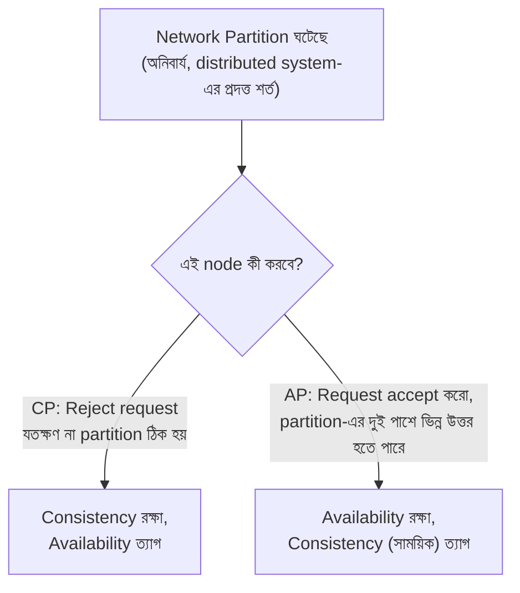
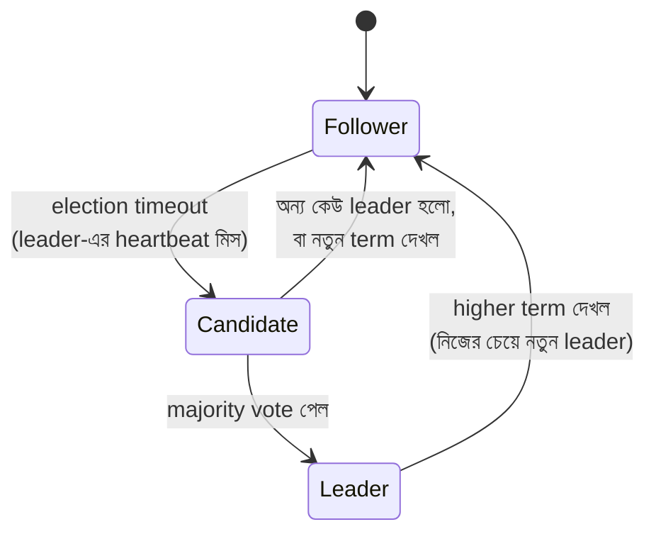
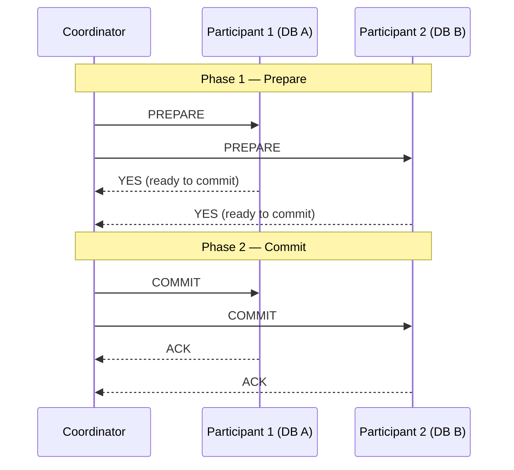

# Module 15 — Distributed Systems Theory

> **Phase E — Distributed Systems** | পূর্বশর্ত: M08, M12, M13
> পরের module: M16 (Resilience Patterns)

---

## ১. যে interview answer একজন candidate-কে বাদ দিয়ে দিয়েছিল

একটা Staff Engineer interview-এ প্রশ্ন ছিল: "CAP theorem ব্যাখ্যা করুন।"

Candidate সাবলীলভাবে উত্তর দিলেন: "CAP মানে Consistency, Availability, Partition tolerance — আপনি এই তিনটার মধ্যে যেকোনো দুইটা বেছে নিতে পারেন, তিনটা একসাথে না।" এটা প্রায় প্রতিটা textbook-এ লেখা সংজ্ঞা, আর অনেকেই এটাই সঠিক মনে করেন।

Interviewer পরের প্রশ্ন করলেন: "আমাদের সিস্টেম কি network partition tolerance 'বাদ দিতে' পারে, যদি আমরা 'CA' বেছে নিই?"

Candidate একটু থেমে বললেন — "হ্যাঁ, যদি partition tolerance দরকার না হয়, আমরা CA সিস্টেম বানাতে পারি, strong consistency আর availability দুইটাই রেখে।"

**এই উত্তরটাই ভুল, এবং এই ভুলটাই candidate-কে বাদ করে দিয়েছিল।** বাস্তবতা হলো: **কোনো distributed system (একাধিক node নিয়ে) network partition "বেছে না নেওয়ার" বিকল্প রাখে না।** Network partition ঘটবেই — network cable কাটা যায়, switch fail করে, datacenter-এর মধ্যে latency spike হয় এতটাই যে কার্যকরভাবে partition-এর মতো আচরণ করে। "CA" সিস্টেম শুধু তখনই সম্ভব যদি আপনার **একটাই node** থাকে — আর একটা node মানে distributed system-ই না।

CAP theorem-এর সঠিক ব্যাখ্যা হলো: **যখন একটা network partition ঘটে (এবং এটা ঘটবেই), আপনাকে বেছে নিতে হবে consistency নাকি availability — partition tolerance একটা "choice" না, এটা distributed system হওয়ার একটা প্রদত্ত শর্ত।**

এই module-এ আমরা এই ধরনের সূক্ষ্ম কিন্তু গুরুত্বপূর্ণ ভুল ধারণাগুলো ঠিক করব — এবং M08, M12, M13-এ যে সিদ্ধান্তগুলো ব্যবহারিকভাবে নিয়েছি (async replication, quorum queue, Kafka `acks`), তাদের তাত্ত্বিক ভিত্তি সম্পূর্ণ করব।

---

## ২. CAP Theorem — সঠিক ব্যাখ্যা

### ২.১ তিনটা property-র প্রকৃত সংজ্ঞা

| Property | সংজ্ঞা |
|---|---|
| **Consistency (C)** | প্রতিটা read সাম্প্রতিকতম write-এর ফলাফল পায় (linearizability-র কাছাকাছি একটা সংজ্ঞা) — M07-এর isolation level-এর ধারণার distributed সংস্করণ |
| **Availability (A)** | প্রতিটা request (crash না হওয়া node-এ) একটা response পায়, error না |
| **Partition tolerance (P)** | সিস্টেম কাজ করতে থাকে node-দের মধ্যে network message হারিয়ে গেলেও/দেরি হলেও |

### ২.২ সঠিক ফর্মুলেশন

```
CAP theorem বলে না "তিনটার মধ্যে দুইটা বেছে নাও।"

CAP theorem বলে: "একটা network partition ঘটলে (P অনিবার্য),
                   তখন C এবং A-এর মধ্যে একটা বেছে নিতে হবে।"
```



**M08-এর Patroni আলোচনার সরাসরি সংযোগ:** M08 §৩.১-এ Patroni-র fencing mechanism মনে করুন — primary network partition-এর কারণে etcd-এর সাথে যোগাযোগ হারালে, Patroni সেটাকে "মৃত" ধরে নিয়ে replica promote করে। এটা একটা **CP সিদ্ধান্ত** — সিস্টেম সাময়িকভাবে **unavailable** (নতুন primary promote হওয়া পর্যন্ত write বন্ধ) কিন্তু consistency রক্ষা করে (কখনো দুইটা primary একসাথে লিখতে দেয় না, fencing দিয়ে)।

**M09-এর Cassandra আলোচনার সরাসরি সংযোগ:** M09 §৩.৩-এ Cassandra-র per-query consistency level মনে করুন। `consistency_level=ONE` একটা **AP-leaning সিদ্ধান্ত** — partition-এর সময়ও (যদি অন্তত একটা replica পাওয়া যায়) request সফল হয়, কিন্তু সেই replica-র data partition-এর কারণে stale হতে পারে। `consistency_level=ALL` একটা **CP-leaning সিদ্ধান্ত** — সব replica-র সম্মতি প্রয়োজন, তাই partition-এ কিছু replica অনুপলব্ধ হলে request ব্যর্থ হয়, কিন্তু যেটা সফল হয় তা সবসময় consistent।

> **Senior Tip:** "আমাদের সিস্টেম CP নাকি AP?" — এই প্রশ্নে সবচেয়ে ভালো উত্তর একটা single answer না, বরং: "এটা প্রায়ই পুরো সিস্টেমের একটা single label না — বিভিন্ন অংশের ভিন্ন প্রয়োজন। M31-এর payment status write CP হওয়া উচিত (ভুল balance দেখানোর চেয়ে সাময়িক unavailability ভালো)। কিন্তু M31-এর merchant dashboard 'recent activity' feed AP হতে পারে (কয়েক সেকেন্ড পুরনো data দেখানো, ঠিক M08-এর read replica lag-এর মতোই একটা trade-off, সম্পূর্ণ downtime-এর চেয়ে ভালো)। একটা সিস্টেমে CP এবং AP উভয় অংশ একসাথে থাকা সম্পূর্ণ স্বাভাবিক এবং প্রায়ই সঠিক ডিজাইন।"

---

## ৩. PACELC — যেটা আসলে বেশি প্রাসঙ্গিক

### ৩.১ CAP-এর সীমাবদ্ধতা

CAP theorem শুধু **partition-এর সময়** কী হয় তা বলে। কিন্তু বাস্তব সিস্টেমের সিদ্ধান্ত বেশিরভাগ সময় **normal operation-এ** (partition না থাকা অবস্থায়) নেওয়া হয় — সেই প্রশ্নের CAP-এর কোনো উত্তর নেই।

### ৩.২ PACELC ফর্মুলেশন

```
যদি Partition ঘটে (P):
    তাহলে Availability নাকি Consistency (A বনাম C) — এটাই CAP-এর প্রশ্ন

Else (normal operation-এ, no partition):
    তাহলে Latency নাকি Consistency (L বনাম C) — এটাই CAP-এর বাদ দেওয়া অংশ
```

**M08-এর synchronous বনাম asynchronous replication ঠিক এই "Else" case-এর একটা প্রয়োগ:** normal operation-এ (কোনো partition নেই), synchronous replication বেছে নেওয়া মানে **latency-কে consistency-র জন্য বিসর্জন দেওয়া** (প্রতিটা commit replica-র ack-এর অপেক্ষা করে, ধীর কিন্তু guaranteed consistent)। Asynchronous replication মানে **consistency-কে latency-র জন্য বিসর্জন দেওয়া** (commit দ্রুত, কিন্তু replica সাময়িকভাবে stale, M08-এর read-your-writes সমস্যার মূল কারণ)।

```
PostgreSQL synchronous replication  → PC/EC (partition-এ Consistency, normal operation-এও Consistency)
PostgreSQL asynchronous replication → PA/EL (partition-এ Availability, normal operation-এ Latency অগ্রাধিকার)
Cassandra (QUORUM)                  → PA/EC (সাধারণত, tunable)
DynamoDB                            → PA/EL (ডিফল্ট eventual consistency মোডে)
```

> **Senior Tip:** PACELC জানা থাকা একটা genuine Staff-level সংকেত, কারণ বেশিরভাগ engineer CAP পর্যন্ত থামে। "শুধু partition-এর সময় trade-off আছে তা না — প্রতিদিনের normal operation-এও latency বনাম consistency-র একই ধরনের trade-off আমরা নিচ্ছি, প্রতিটা replication configuration সিদ্ধান্তে। M08-এর `synchronous_standby_names` সেটিং-টা মূলত এই PACELC trade-off-এরই একটা concrete implementation।"

---

## ৪. FLP Impossibility — কেন Consensus মৌলিকভাবে কঠিন

### ৪.১ সংক্ষিপ্ত বিবৃতি

**FLP Impossibility Result** (Fischer, Lynch, Paterson, 1985) প্রমাণ করে: **একটা সম্পূর্ণ asynchronous system-এ** (কোনো bound নেই message delay বা processing time-এর উপর), **এমনকি একটা মাত্র node ব্যর্থ হতে পারে এমন সম্ভাবনা থাকলেও, কোনো deterministic algorithm নিশ্চিতভাবে consensus-এ পৌঁছাতে পারে না** — কোনো guarantee ছাড়াই যে এটা সসীম সময়ে শেষ হবে।

**এর ব্যবহারিক অর্থ:** এটা তত্ত্বগতভাবে বলছে perfect consensus asynchronous system-এ **অসম্ভব**। কিন্তু বাস্তবে Raft/Paxos-এর মতো সিস্টেম **কাজ করে** — কীভাবে?

**উত্তর:** তারা FLP-কে "পরাজিত" করে না, তারা এর **শর্ত এড়িয়ে যায়** — timeout ব্যবহার করে (M08 §৩.১-এর Patroni-র `ttl`/`loop_wait` মনে করুন) যা কার্যকরভাবে সিস্টেমকে **partially synchronous** ধরে নেয় (একটা practical assumption যে message delay সাধারণত একটা bound-এর মধ্যে থাকে, এমনকি সেটা guaranteed না হলেও)। এই কারণেই Raft/Paxos-ভিত্তিক সিস্টেমে **কোনো theoretical guarantee নেই যে leader election সসীম সময়ে শেষ হবে** — practical ভাবে প্রায় সবসময় হয়, কিন্তু pathological network condition-এ (M08-এর split-brain আলোচনার প্রেক্ষাপটে) এটা theoretically infinite retry loop-এ যেতে পারে।

> **Senior Tip:** "FLP impossibility জানা কি ব্যবহারিকভাবে গুরুত্বপূর্ণ?" — সৎ উত্তর: "সরাসরি প্রোডাকশন কোডে না, কিন্তু এটা একটা গুরুত্বপূর্ণ intuition দেয় — কেন distributed consensus সিস্টেম (Patroni, RabbitMQ quorum queue, M08/M13) **timeout-based heuristic** ব্যবহার করে, কোনো mathematically guaranteed bound না। এটা বোঝায় কেন 'leader election-এ কতক্ষণ সময় লাগবে' প্রশ্নের কোনো hard guarantee নেই কোনো Raft-based সিস্টেমে, শুধু practical, tuned expectation (M08-এর `ttl: 30` সেটিং-এর মতো)।"

---

## ৫. Raft Consensus — M08/M13-এর প্রকৃত Mechanism

### ৫.১ কেন Raft (Paxos-এর তুলনায়)

Paxos প্রথম consensus algorithm হিসেবে প্রমাণিত ও ব্যাপকভাবে ব্যবহৃত, কিন্তু তার original formulation **কুখ্যাতভাবে বোঝা কঠিন** (এমনকি experienced distributed systems researcher-দের জন্যও)। Raft (২০১৪) একই সমস্যা সমাধান করে, কিন্তু **understandability**-কে একটা explicit design goal হিসেবে রেখে — এই কারণে আধুনিক সিস্টেম (etcd, Consul, RabbitMQ quorum queue) সাধারণত Raft ব্যবহার করে, Paxos না।

### ৫.২ তিনটা মূল অংশ



**১. Leader Election** — M08-এর Patroni ঠিক এই mechanism ব্যবহার করে (etcd-এর নিজস্ব Raft implementation দিয়ে)। প্রতিটা node একটা "election timeout" রাখে (randomized, split vote এড়াতে) — leader-এর heartbeat না পেলে node নিজেকে candidate ঘোষণা করে, ভোট চায়। Majority vote পেলে সে leader হয়।

**২. Log Replication** — leader নির্বাচিত হলে, সব write leader-এর মধ্য দিয়ে যায় (M08-এর primary-only write-এর সরাসরি মিল), leader সেটা তার log-এ যোগ করে, তারপর follower-দের কাছে replicate করে (M07/M08-এর WAL streaming-এর সাধারণীকৃত সংস্করণ)।

**৩. Safety** — একটা log entry শুধুমাত্র তখনই "committed" (safe, স্থায়ী) ধরা হয় যখন **majority** node-এ replicate হয়ে গেছে। এটাই সেই মূলনীতি যা M08 §৩.১-এর `synchronous_commit`-এর সাথে সরাসরি সংযুক্ত — majority replication নিশ্চিত করে যে leader change হলেও committed data হারাবে না (নতুন leader অবশ্যই majority-তে থাকতে হবে, আর majority মানে অন্তত একটা node-এ সেই committed entry ছিল)।

### ৫.৩ Term — কেন Split Vote/Split Brain প্রতিরোধ হয়

```
প্রতিটা election একটা "term" নম্বর দিয়ে চিহ্নিত (monotonically বাড়ে)
একটা node একটা term-এ সর্বোচ্চ একবার ভোট দিতে পারে
একটা node higher term দেখলে সাথে সাথে নিজেকে follower বানিয়ে ফেলে
```

এই "term" মেকানিজম **M08-এর fencing-এর তাত্ত্বিক ভিত্তি:** যদি পুরনো leader (network partition থেকে ফিরে এসে) এখনো নিজেকে leader মনে করে পুরনো term দিয়ে লিখতে চায়, বাকি node-রা (যারা নতুন term দেখেছে) তার request প্রত্যাখ্যান করবে — কারণ তাদের কাছে একটা higher term আছে। এটাই M08-এর "STONITH"/fencing ধারণার আসল গাণিতিক ভিত্তি — Raft নিজেই split-brain প্রতিরোধ করে term comparison দিয়ে, কোনো external mechanism ছাড়াই (যদিও PostgreSQL নিজে Raft চালায় না, Patroni সেই জন্য etcd ব্যবহার করে)।

> **Senior Tip:** "কীভাবে Raft split-brain প্রতিরোধ করে?" — "Term number-এর মাধ্যমে — প্রতিটা node সবসময় সর্বোচ্চ term-কেই বৈধ ধরে, আর একটা node একটা term-এ একবারই ভোট দিতে পারে বলে, দুইটা ভিন্ন node একই term-এ majority vote পাওয়া mathematically অসম্ভব (majority + majority সবসময় overlap করবে একটা node-এ, pigeon-hole principle, আর সেই overlapping node দুইজনকেই ভোট দিতে পারবে না)। এটাই M08-এ আমরা 'fencing' হিসেবে ব্যবহারিকভাবে দেখেছিলাম তার তাত্ত্বিক ভিত্তি।"

---

## ৬. Quorum — R + W > N

### ৬.১ সূত্র

```
N = replica সংখ্যা
W = একটা write-এর জন্য কতগুলো replica-র সম্মতি লাগবে
R = একটা read-এর জন্য কতগুলো replica-র সাড়া লাগবে

যদি R + W > N হয়, তাহলে প্রতিটা read অন্তত একটা replica ছোঁবে যেটা
সাম্প্রতিকতম write-ও পেয়েছিল — strong consistency guaranteed
```

### ৬.২ M09-এর Cassandra Consistency Level-এর গাণিতিক ভিত্তি

```
N=3 (replication factor 3)

QUORUM write (W=2) + QUORUM read (R=2):  R+W=4 > N=3  ✅ strong consistency
ONE write (W=1) + ONE read (R=1):        R+W=2 < N=3  ❌ সম্ভাব্য stale read
ALL write (W=3) + ONE read (R=1):        R+W=4 > N=3  ✅ strong (কিন্তু write ধীর)
```

M09 §৩.৩-এ আমরা Cassandra consistency level "ONE/QUORUM/ALL" দেখেছিলাম বর্ণনামূলক ভাবে — এখন এর গাণিতিক ভিত্তি স্পষ্ট: **R+W > N** সূত্রটাই নির্ধারণ করে কোন combination strong consistency দেয়। `QUORUM` উভয় read আর write-এ (`W = N/2+1`, `R = N/2+1`) সবসময় `R+W > N` নিশ্চিত করে (গাণিতিকভাবে, দুইটা majority সবসময় overlap করে — Raft-এর majority overlap নীতির একই গাণিতিক ভিত্তি, §৫.৩)।

> **Senior Tip:** "কীভাবে read আর write consistency-র মধ্যে ভারসাম্য আনবেন এমন সিস্টেমে যেখানে read অনেক বেশি (M31-এর read:write 10:1 ratio-র মতো)?" — "R+W>N নিশ্চিত রেখে, কিন্তু asymmetric ভাবে — যদি write rare কিন্তু read frequent হয়, `W=N` (সব replica নিশ্চিত করে ধীর কিন্তু বিরল write) আর `R=1` (দ্রুত, frequent read, প্রতিটা replica already up-to-date কারণ write সব জায়গায় গেছে) বেছে নিতে পারি। এটা M31-এর 'যেটা বেশিবার ঘটে সেটা optimize করো' নীতির distributed consistency সংস্করণ।"

---

## ৭. Lamport Clock ও Vector Clock — "কখন" প্রশ্নের উত্তর distributed system-এ

### ৭.১ সমস্যা — কোনো global clock নেই

M08 §৮.২-এ TIMESTAMPTZ নিয়ে আলোচনা করেছিলাম একটা single database-এ। কিন্তু **একাধিক node**-এ, প্রতিটার নিজস্ব physical clock আছে, যেগুলো কখনো perfectly synchronized না (NTP drift, M08 §৮.২-এর DST সতর্কতার মতোই একটা বাস্তবতা, কিন্তু এখানে node-দের মধ্যে)। "Event A কি Event B-র আগে ঘটেছে?" — physical timestamp দিয়ে উত্তর দেওয়া বিপজ্জনক যদি clock skew থাকে।

### ৭.২ Lamport Clock — logical ordering

```python
class LamportClock:
    def __init__(self):
        self.counter = 0

    def local_event(self):
        self.counter += 1
        return self.counter

    def send_event(self):
        self.counter += 1
        return self.counter   # এই counter message-এর সাথে পাঠানো হয়

    def receive_event(self, received_counter):
        self.counter = max(self.counter, received_counter) + 1
        return self.counter
```

**মূল ধারণা:** প্রতিটা node একটা counter রাখে। প্রতিটা local event counter বাড়ায়। একটা message পাঠানোর সময় counter attach করা হয়; receive করার সময় নিজের counter-কে `max(নিজের, পাওয়া) + 1` করা হয়। এটা একটা **partial ordering** দেয় — যদি A "happens-before" B হয় (causally সংযুক্ত), Lamport clock গ্যারান্টি দেয় `clock(A) < clock(B)`।

**সীমাবদ্ধতা:** বিপরীতটা সত্য না — `clock(A) < clock(B)` মানেই A সত্যিই B-র আগে ঘটেছে তা না (তারা সম্পূর্ণ unrelated, concurrent event হতে পারে, কিন্তু কাকতালীয়ভাবে ভিন্ন counter value পেয়েছে)।

### ৭.৩ Vector Clock — concurrent event সনাক্ত করা

```python
class VectorClock:
    def __init__(self, node_id, num_nodes):
        self.node_id = node_id
        self.clock = [0] * num_nodes

    def local_event(self):
        self.clock[self.node_id] += 1
        return list(self.clock)

    def receive_event(self, received_clock):
        self.clock = [max(a, b) for a, b in zip(self.clock, received_clock)]
        self.clock[self.node_id] += 1
        return list(self.clock)

def compare(clock_a, clock_b):
    if all(a <= b for a, b in zip(clock_a, clock_b)):
        return "A happens-before B"
    elif all(b <= a for a, b in zip(clock_a, clock_b)):
        return "B happens-before A"
    else:
        return "concurrent"   # ⚠️ neither dominates — সত্যিকারের ambiguity, conflict resolution দরকার
```

**Lamport clock-এর সীমাবদ্ধতা সমাধান করে:** vector clock-এ প্রতিটা node-এর নিজস্ব counter আলাদাভাবে ট্র্যাক করা হয় (একটা array), তাই দুইটা event সত্যিই causally সংযুক্ত নাকি **সত্যিই concurrent** (কোনো causal সম্পর্ক নেই) তা নির্ভুলভাবে নির্ণয় করা যায়।

**বাস্তব ব্যবহার — M09-এর Cassandra/DynamoDB-এর conflict resolution-এর ভিত্তি:** যখন একটা AP সিস্টেমে (§২.২) দুইটা concurrent write একই key-তে ঘটে ভিন্ন node-এ (network partition-এর কারণে), সিস্টেমকে জানতে হয় এগুলো সত্যিই conflicting (concurrent, কেউ কারো উপর নির্ভরশীল না) নাকি একটা আরেকটার ফলো-আপ। Vector clock দিয়ে "concurrent" detect হলে, সিস্টেম একটা conflict resolution strategy প্রয়োগ করে (last-write-wins, application-level merge, বা user-কে জিজ্ঞেস করা — যেমন Amazon-এর shopping cart-এর ঐতিহাসিক উদাহরণ)।

> **Senior Tip:** এই ধারণাটা abstract মনে হতে পারে, কিন্তু এর ব্যবহারিক প্রকাশ M31-এর outbox event-এর `created_at` দিয়ে ordering করার সময় সরাসরি প্রাসঙ্গিক: "যদি আমাদের multi-region deployment থাকে, প্রতিটা region-এর `created_at` timestamp সেই region-এর local clock থেকে আসছে — clock skew থাকলে region A-র event region B-র চেয়ে 'আগে' timestamp পেতে পারে even যদি বাস্তবে পরে ঘটেছে। এই কারণে M12-এর Kafka offset (logical, physical clock-নির্ভর না) timestamp-এর চেয়ে বেশি নির্ভরযোগ্য ordering guarantee, ঠিক Lamport clock-এর মতোই একটা logical counter নীতি।"

---

## ৮. Distributed Transaction — কেন 2PC সাধারণত এড়ানো হয়

### ৮.১ Two-Phase Commit (2PC) — mechanism



**মূল ধারণা:** coordinator প্রথমে সব participant-কে "prepare" করতে বলে (তারা resource lock করে, নিশ্চিত করে commit করতে পারবে, কিন্তু এখনো করে না)। সবাই "yes" বললেই coordinator "commit" নির্দেশ পাঠায়।

### ৮.২ কেন সমস্যাজনক — M14-এর dual-write সমস্যার আরেকটা কোণ

**সমস্যা ১ — Blocking।** যদি coordinator "prepare" phase-এর পরে কিন্তু "commit" নির্দেশ পাঠানোর আগে crash করে, participant-রা **অনির্দিষ্টকালের জন্য lock ধরে অপেক্ষা করে থাকে** — তারা জানে না commit করবে নাকি rollback, তাই resource release করতে পারে না। এটা M07-এর lock contention সমস্যার একটা চরম, distributed সংস্করণ।

**সমস্যা ২ — Coordinator একটা single point of failure।** যদি coordinator স্থায়ীভাবে হারিয়ে যায়, participant-রা চিরকাল আটকে থাকতে পারে (manual intervention দরকার) — M08-এর "single point of failure" আলোচনার সরাসরি প্রয়োগ, কিন্তু এখানে stakes আরও বেশি কারণ এটা lock-এর সাথে জড়িত।

**সমস্যা ৩ — Performance।** প্রতিটা transaction-এ দুইটা network round-trip (prepare + commit) প্রতিটা participant-এর সাথে, আর সবচেয়ে ধীর participant-ই পুরো transaction-এর গতি নির্ধারণ করে — M02-এর "একটা slow dependency পুরো path আটকায়" নীতির distributed transaction সংস্করণ।

### ৮.৩ যা এর বদলে ব্যবহার করা হয়

M14 §৬-এর Saga pattern **সরাসরি 2PC-র বিকল্প হিসেবে বিকশিত**:

```
2PC: সব-বা-কিছুই না, synchronous, locking, strong consistency, কিন্তু blocking-প্রবণ

Saga: প্রতিটা ধাপ আলাদাভাবে commit হয় (কোনো cross-service lock নেই),
      ব্যর্থতায় compensating action দিয়ে "undo" — eventual consistency,
      কিন্তু কখনো blocking না, কোনো single coordinator crash পুরো সিস্টেম আটকায় না
```

> **Senior Tip:** "আমাদের payment আর inventory service-এর মধ্যে একটা distributed transaction দরকার — 2PC ব্যবহার করব?" — "আমি প্রায় সবসময় Saga pattern (M14) পছন্দ করব 2PC-র বদলে microservice architecture-এ, কারণ 2PC-র blocking সমস্যা modern, highly-available সিস্টেমের সাথে fundamentally বেমানান — একটা participant সাময়িকভাবে unavailable হলে পুরো transaction system-wide আটকে যেতে পারে। 2PC এখনো প্রাসঙ্গিক যেখানে সব participant একই administrative domain-এ, স্বল্প-সময়ের transaction, আর strict এটমিসিটি সত্যিই আলোচনার বাইরে (যেমন কিছু traditional RDBMS-based XA transaction ব্যবহার এখনো আছে ব্যাংকিং legacy system-এ) — কিন্তু নতুন microservice design-এ, Saga+compensation architecturally বেশি resilient।"

---

## ৯. Gossip Protocol — সংক্ষিপ্ত, awareness-level

```
মূল ধারণা: প্রতিটা node পর্যায়ক্রমে randomly বাছা কয়েকটা other node-এর সাথে
তথ্য বিনিময় করে (gossip)। সময়ের সাথে তথ্য পুরো cluster-এ ছড়িয়ে যায় —
একটা epidemic-এর মতো propagation, কোনো central coordinator ছাড়াই।
```

**M09-এর Cassandra cluster membership এই মেকানিজম ব্যবহার করে** — কোন node up/down, কোন node-এ কোন partition আছে, এই তথ্য gossip দিয়ে ছড়ায়, একটা central "leader" (Raft-এর মতো) ছাড়াই। এটা Raft/Paxos-এর বিপরীত approach — কোনো strong consistency guarantee নেই (তথ্য ছড়াতে সময় লাগে, "eventually consistent membership view"), কিন্তু কোনো single point of failure নেই membership tracking-এ, আর অত্যন্ত scalable (হাজার হাজার node পর্যন্ত)।

> **Senior Tip:** "কখন gossip protocol, কখন Raft?" — "Raft strong consistency দেয় কিন্তু একটা bottleneck (leader) তৈরি করে এবং node সংখ্যা বাড়লে (leader-কে সব node-এর সাথে communicate করতে হয়) scale করা কঠিন হয়ে যায় — তাই এটা ছোট, critical configuration cluster-এ ব্যবহৃত হয় (M08-এর etcd, M13-এর RabbitMQ quorum queue)। Gossip eventually-consistent কিন্তু massively scalable — Cassandra-র মতো হাজার হাজার node-এর cluster membership-এ ব্যবহৃত হয়, যেখানে perfect real-time consistency অপ্রয়োজনীয়, শুধু 'সবাই শেষ পর্যন্ত জানুক' যথেষ্ট।"

---

## ১০. Interview Section

### প্রশ্ন ১ (Senior) — "CAP theorem ব্যাখ্যা করুন।"

**❌ Wrong Answer**
> "তিনটার মধ্যে দুইটা বেছে নিতে হয় — Consistency, Availability, Partition tolerance।"

*কেন বিপজ্জনক:* এই module-এর §১-এর ঘটনার মূল কারণ — এই উত্তর ইঙ্গিত দেয় partition tolerance একটা optional choice, যা fundamentally ভুল।

**🌟 Senior/Staff Answer**
> "সঠিক ফর্মুলেশন হলো — network partition একটা distributed system-এর (একাধিক node) জন্য **অনিবার্য বাস্তবতা**, কোনো ঐচ্ছিক 'বেছে নেওয়া' জিনিস না। CAP theorem প্রকৃতপক্ষে বলে: **যখন একটা partition ঘটে, তখন আপনাকে বেছে নিতে হয় consistency (partition-এর দুই পাশ ভিন্ন উত্তর দেবে না, কিন্তু কিছু request ব্যর্থ হতে পারে) নাকি availability (সব request-এর উত্তর দেওয়া হবে, কিন্তু partition-এর দুই পাশ সাময়িকভাবে ভিন্ন তথ্য দেখাতে পারে)।**
>
> এই সিদ্ধান্ত সাধারণত পুরো সিস্টেমে uniform না — বিভিন্ন data type/operation ভিন্ন প্রয়োজনীয়তা রাখে। M31-এর payment status-এর মতো critical write CP হওয়া উচিত (ভুল balance দেখানোর চেয়ে সাময়িক error ভালো), কিন্তু non-critical read (dashboard summary) AP হতে পারে (সামান্য stale data, downtime-এর চেয়ে ভালো)।
>
> এটাও গুরুত্বপূর্ণ যে CAP শুধু partition-এর সময়ের কথা বলে — normal operation-এ (কোনো partition নেই) একটা ভিন্ন trade-off আছে, latency বনাম consistency, যেটা PACELC ফর্মুলেশনে ধরা হয়। বেশিরভাগ প্রকৃত সিস্টেম ডিজাইন সিদ্ধান্ত (M08-এর sync বনাম async replication যেমন) আসলে এই দৈনন্দিন PACELC trade-off-এর প্রতিফলন, শুধু বিরল partition scenario-র না।"

---

### প্রশ্ন ২ (Staff / Architecture) — "আমাদের একটা নতুন feature-এ distributed lock দরকার একাধিক service-জুড়ে। Raft-based সমাধান (etcd) নাকি Redis lock (M10-এর Redlock আলোচনা)?"

**🌟 Senior/Staff Answer**
> "এটা নির্ভর করে ঠিক কতটা শক্তিশালী guarantee দরকার, M10 §৭.৩-এর Kleppmann-Antirez বিতর্কের একই কাঠামোয়।
>
> Raft-based সিস্টেম (etcd, Consul) একটা **formally proven consensus algorithm** ব্যবহার করে — leader election-এর safety property (§৫.৩-এর term-based majority overlap) mathematically guaranteed, clock-এর সঠিকতার উপর নির্ভর করে না (Redis lock TTL-এর মতো, যেটা wall-clock time-এর উপর নির্ভরশীল এবং তাই Kleppmann-এর সমালোচনার শিকার)। যদি এই lock-এর ব্যর্থতা সত্যিই একটা correctness-critical সমস্যা তৈরি করে (data corruption, ভুল টাকার হিসাব), আমি etcd-based lock পছন্দ করব — এটা M07-এর PostgreSQL advisory lock-এর মতোই একটা 'proper consensus/transaction-backed' সমাধান, শুধু cross-service scope-এ যেখানে PostgreSQL advisory lock প্রযোজ্য না (M07-এর lock একটা single PostgreSQL instance-এ scoped)।
>
> কিন্তু এই শক্তিশালী guarantee-র খরচ আছে — etcd একটা নতুন operational dependency (M09-এর polyglot persistence checklist প্রযোজ্য এখানেও), আর Raft-based সিস্টেমে latency বেশি (majority consensus-এর জন্য অপেক্ষা, একাধিক network round trip, §৫.২-এর log replication mechanism)।
>
> যদি lock-এর ব্যর্থতার worst case শুধু efficiency loss (duplicate work, M11-এর idempotent task-এর মতো সহজে সামলানো যায়), Redis lock যথেষ্ট এবং অনেক সরল ও দ্রুত।
>
> **আমার সুপারিশ:** যদি আমাদের ইতিমধ্যে Kubernetes আছে (এবং তাই etcd-ও, K8s নিজেই etcd ব্যবহার করে internally), আমরা হয়তো সরাসরি সেই infrastructure-এর উপর একটা lock service বানাতে পারি নতুন কিছু deploy না করেই। না হলে, correctness-critical case-এ নতুন etcd cluster deploy করা justified, কিন্তু efficiency-only case-এ সেই খরচ ন্যায্য না — Redis-ই যথেষ্ট।"

---

### প্রশ্ন ৩ (Scenario) — "আমাদের multi-region deployment-এ, দুইটা region-এর একই user profile-এ একই সময়ে ভিন্ন update এসেছে (network partition-এর কারণে)। কীভাবে resolve করবেন?"

**🌟 Senior/Staff Answer**
> "এটা একটা classic **concurrent write conflict**, AP-leaning সিস্টেমের (§২.২) একটা প্রত্যাশিত পরিণতি — যেহেতু আমরা availability বেছেছি (partition-এর সময়ও উভয় region write গ্রহণ করেছে), consistency-তে একটা সাময়িক ব্যত্যয় ঘটেছে যা এখন resolve করতে হবে।
>
> **প্রথম প্রশ্ন — এগুলো কি সত্যিই concurrent (কোনো causal সম্পর্ক নেই), নাকি একটা আরেকটার ফলো-আপ?** এটা নির্ণয় করতে vector clock (§৭.৩) বা logical version number ব্যবহার করা উচিত, শুধু physical timestamp না — কারণ clock skew থাকলে (M08 §৮.২-এর সতর্কতা, এখন multi-region প্রেক্ষাপটে) timestamp comparison ভুল সিদ্ধান্ত দিতে পারে।
>
> **যদি সত্যিই concurrent (vector clock 'concurrent' বলছে):** কয়েকটা conflict resolution strategy আছে:
> ১. **Last-write-wins (physical timestamp দিয়ে)** — সরল কিন্তু ডেটা হারানোর ঝুঁকি (একটা legitimate update silently ফেলে দেওয়া হবে)
> ২. **Field-level merge** — যদি দুইটা update ভিন্ন field স্পর্শ করে (যেমন এক region-এ email বদলেছে, আরেক region-এ phone), দুইটাই রাখা যায় merge করে
> ৩. **Application-level conflict resolution** — user-কে জানানো ('আপনার প্রোফাইল দুই জায়গায় বদলেছে, কোনটা রাখবেন?') — Amazon-এর shopping cart-এর ঐতিহাসিক approach-এর মতো
>
> **দীর্ঘমেয়াদী প্রতিরোধ:** যদি এই conflict ঘন ঘন ঘটে, আমি প্রশ্ন করব — এই ডেটার জন্য কি সত্যিই multi-region **write** দরকার, নাকি single-region write (একটা 'home region' প্রতি user-এর জন্য) + multi-region **read replica** যথেষ্ট? এটা M08-এর read-your-writes সমাধানের কাঠামোর একটা multi-region সম্প্রসারণ — conflict এড়ানোর সবচেয়ে সহজ উপায় হলো সেটা তৈরি হওয়ার সুযোগ কমানো, resolution logic জটিল করার বদলে।"

---

### প্রশ্ন ৪ (Coding / Architecture Decision) — "একটা payment আর inventory service-এর মধ্যে atomic 'charge and reserve' operation দরকার। ডিজাইন করুন।"

**🌟 Senior/Staff Answer**
> "এখানে 2PC (§৮) প্রথম impulse হতে পারে ('atomic' শব্দটা শুনে), কিন্তু আমি সেটা এড়িয়ে Saga pattern (M14 §৬) ব্যবহার করব, blocking ঝুঁকি এড়াতে।
>
> **Choreography-based Saga:**
> ```
> 1. Payment service: charge attempt → PaymentCharged event (M14-এর outbox pattern দিয়ে,
>    dual-write সমস্যা এড়িয়ে)
> 2. Inventory service: PaymentCharged event শুনে → reserve attempt
>    - সফল হলে: InventoryReserved event
>    - ব্যর্থ হলে (stock নেই): InventoryReservationFailed event
> 3. Payment service: InventoryReservationFailed শুনে → compensating action:
>    RefundInitiated
> ```
>
> **কেন এটা 2PC-র চেয়ে ভালো এই ক্ষেত্রে:** কোনো cross-service lock নেই — payment service charge করে ফেলে এবং move on করে, inventory service তার নিজের সময়ে react করে। যদি inventory service সাময়িকভাবে down থাকে, payment service **আটকে থাকে না** (2PC-তে যেমন হতো) — event queue-তে (M12) event অপেক্ষা করবে, inventory service ফিরে এলে প্রসেস হবে।
>
> **Trade-off যা স্বীকার করতে হবে:** এই approach eventual consistency-র সাথে আসে — একটা সংক্ষিপ্ত window থাকবে যেখানে payment charged কিন্তু inventory এখনো reserved না (2PC হলে এই window থাকত না, কিন্তু blocking ঝুঁকির বিনিময়ে)। যদি এই window ব্যবসায়িকভাবে অগ্রহণযোগ্য হয় (যেমন race condition-এ দুইজন শেষ item কিনে ফেলতে পারে), আমি inventory-তে একটা optimistic reservation যোগ করব charge-এর **আগে** (M05-এর `select_for_update`/`F()` expression দিয়ে atomic decrement, single-service-এর মধ্যে, তারপর payment charge, ব্যর্থ হলে compensating release) — এভাবে race window সবচেয়ে critical resource-এ (inventory count) minimize হয়, পুরো flow-কে blocking না করে।
>
> এই ডিজাইনটা M07 (single-service ACID), M14 (outbox + saga), আর এই module-এর distributed transaction avoidance নীতি — সবগুলোর একটা সংশ্লেষণ।"

---

## ১১. হাতে-কলমে অনুশীলন

**১ — CAP trade-off চিহ্নিত করুন (২০ মিনিট, conceptual)**
আপনার নিজের প্রজেক্টের ৫টা ভিন্ন ডেটা টাইপ/অপারেশন তালিকা করুন (যেমন user session, payment status, analytics count, notification, search index)। প্রতিটার জন্য সিদ্ধান্ত নিন এটা CP নাকি AP হওয়া উচিত, এবং কেন।

**২ — Lamport clock বাস্তবায়ন ও টেস্ট (৩০ মিনিট)**
§৭.২-এর `LamportClock` class ব্যবহার করে তিনটা "node" simulate করুন (তিনটা আলাদা instance) যারা একে অপরকে message পাঠায়। নিশ্চিত করুন causally সংযুক্ত event-গুলোর clock value সঠিক ক্রমে আছে।

**৩ — Vector clock দিয়ে concurrency detect করুন (৩০ মিনিট)**
§৭.৩-এর `VectorClock` ব্যবহার করে দুইটা independent node simulate করুন যারা কখনো communicate করেনি (সত্যিকারের concurrent)। `compare()` ফাংশন "concurrent" রিটার্ন করছে নিশ্চিত করুন। তারপর একটা message পাঠান তাদের মধ্যে, causal সম্পর্ক তৈরি করুন, `compare()` এখন "happens-before" রিটার্ন করছে দেখুন।

**৪ — Quorum গণনা (১৫ মিনিট)**
N=5 replica-র একটা সিস্টেমে, বিভিন্ন R/W combination-এর জন্য (`R=1,W=1`; `R=3,W=3`; `R=1,W=5`; `R=5,W=1`) হিসাব করুন কোনগুলো `R+W>N` satisfy করে, আর প্রতিটার latency/consistency trade-off কী হবে ব্যাখ্যা করুন।

---

## ১২. মূল কথা

1. **Network partition একটা "choice" না, distributed system হওয়ার প্রদত্ত শর্ত** — CAP theorem শুধু বলে partition ঘটলে C বনাম A বেছে নিতে হয়, "CA সিস্টেম" একটা ভুল ধারণা multi-node system-এ।
2. **CAP সিদ্ধান্ত সাধারণত পুরো সিস্টেমে uniform না** — বিভিন্ন data/operation ভিন্ন প্রয়োজনীয়তা রাখে (M31-এর payment status বনাম dashboard summary)।
3. **PACELC CAP-এর "normal operation" গ্যাপ পূরণ করে** — partition না থাকলেও latency বনাম consistency trade-off আছে, যেটা M08-এর sync/async replication সিদ্ধান্তে প্রতিদিন প্রয়োগ হয়।
4. **FLP impossibility ব্যাখ্যা করে কেন consensus algorithm timeout-based heuristic ব্যবহার করে** — কোনো mathematical guarantee নেই সসীম সময়ে শেষ হওয়ার, শুধু practical tuning।
5. **Raft-এর term mechanism split-brain-এর তাত্ত্বিক সমাধান** — majority overlap নিশ্চিত করে দুইটা ভিন্ন leader একই term-এ কখনো সম্ভব না, M08-এর fencing-এর গাণিতিক ভিত্তি।
6. **R+W>N একটা সাধারণ সূত্র যা কনফিগারযোগ্য consistency দেয়** — M09-এর Cassandra consistency level-এর গাণিতিক ব্যাখ্যা।
7. **Physical timestamp distributed system-এ ordering-এর জন্য অবিশ্বস্ত** — Lamport clock causal ordering দেয়, vector clock সত্যিকারের concurrency detect করে।
8. **2PC blocking এবং single-point-of-failure ঝুঁকিতে ভোগে** — modern microservice architecture-এ Saga pattern (M14) সাধারণত পছন্দনীয়, বিশেষত high-availability প্রয়োজনে।
9. **Gossip protocol massive scale-এ eventual-consistency membership দেয়** (Cassandra), Raft ছোট-scale strong-consistency configuration-এ (etcd, RabbitMQ quorum queue) — দুইটা ভিন্ন সমস্যার জন্য ভিন্ন সমাধান।

---

## পরের Module

**M16 — Resilience Patterns।** আজ আমরা distributed system-এর তাত্ত্বিক সীমাবদ্ধতা দেখলাম — partition অনিবার্য, consensus কঠিন, দূরবর্তী node-এর ব্যর্থতা সবসময় সম্ভব। পরের module-এ আমরা দেখব কীভাবে **ব্যর্থতার প্রত্যাশা নিয়েই সিস্টেম ডিজাইন করতে হয়** — timeout budget, circuit breaker (M02-এর slow dependency সমস্যার formal সমাধান), bulkhead, load shedding, backpressure, hedged request — এই module-এর তাত্ত্বিক ভিত্তির উপর দাঁড়িয়ে ব্যবহারিক resilience engineering।
