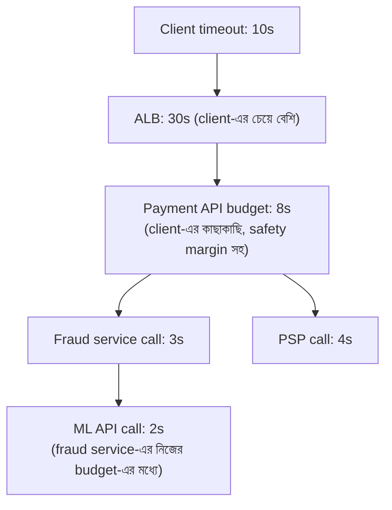
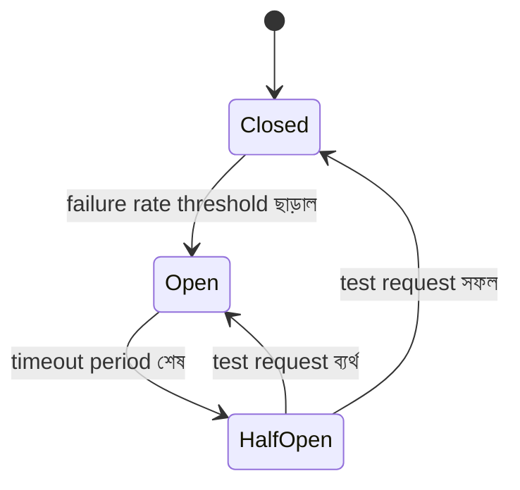

# Module 16 — Resilience Patterns

> **Phase E — Distributed Systems** | পূর্বশর্ত: M02, M11, M15
> পরের module: M17 (Service Architecture)

---

## ১. যে একটা ধীর dependency পুরো কোম্পানিকে থামিয়ে দিয়েছিল

M02 §৯-এ আমরা একটা গাণিতিক হিসাব করেছিলাম: একটা Django container-এ ১৬টা concurrent worker, response time ৫০ms থেকে ৫ সেকেন্ড হলে effective capacity ১৬ থেকে নেমে যায় প্রায় শূন্যের কাছাকাছি। এখন সেই হিসাবের একটা সম্পূর্ণ, বাস্তব ঘটনা দেখা যাক।

M31-এর payment system-এ একটা fraud-detection service ছিল — প্রতিটা payment-এর আগে একটা সিঙ্ক্রোনাস call হতো risk score আনতে। এই service নিজেই একটা third-party ML API ব্যবহার করত। একদিন সেই third-party API **ধীর হয়ে গেল** — down না, শুধু ধীর, response time ২০০ms থেকে ১৫ সেকেন্ডে।

কী ঘটল, ধাপে ধাপে:

```
১. Fraud service-এর worker-রা ML API-র জন্য অপেক্ষা করতে থাকল (M02-এর timeout-হীন call-এর মতোই ভয়ংকর, কিন্তু এখানে timeout ছিল — ১৫ সেকেন্ড)
২. Payment service-এর worker-রা fraud service-এর জন্য অপেক্ষা করতে থাকল
৩. Payment API-র সব worker কয়েক মিনিটের মধ্যে ব্যস্ত হয়ে গেল (M02-এর capacity formula: ১৬ worker × ১৫s response = capacity প্রায় শূন্য)
৪. Payment API 502/timeout দিতে শুরু করল — এমনকি সেই request-গুলোও যেগুলোর fraud check-এর দরকারই ছিল না (checkout flow-এর অন্য অংশ)
৫. Load balancer health check ব্যর্থ হতে শুরু করল (M02 §৮-এর accept queue overflow-এর সাথে মিল)
৬. Kubernetes payment pod-গুলোকে "unhealthy" মনে করে restart করতে লাগল — যেটা আরও worse করল, কারণ restart-এর সময় capacity আরও কমে যায়
৭. পুরো checkout flow ৪০ মিনিটের জন্য কার্যত অচল
```

এই পুরো ঘটনার মূল কারণ **একটা single external API-র latency spike**, কিন্তু এর প্রভাব cascading হয়ে পুরো company-র checkout flow-কে থামিয়ে দিল। এটাকে বলে **cascading failure**, আর এই module-এর প্রতিটা pattern এই একই মৌলিক সমস্যার — "একটা component-এর ব্যর্থতা যেন পুরো সিস্টেমে ছড়িয়ে না পড়ে" — বিভিন্ন কোণ থেকে সমাধান।

---

## ২. Timeout Budget ও Deadline Propagation

### ২.১ M02-এর timeout budget-এর সম্পূর্ণ কাঠামো

M02 §৯-এ আমরা একটা "timeout budget" hierarchy দেখেছিলাম উপরিভাগে। এখন এটাকে একটা সম্পূর্ণ ডিজাইন নীতি হিসেবে বিস্তৃত করি।



**মূল নীতি — deadline propagation:** প্রতিটা নিচের স্তরের timeout **অবশ্যই** উপরের স্তরের অবশিষ্ট বাজেটের মধ্যে থাকতে হবে। M31-এর incident-এ যা ভুল হয়েছিল: fraud service-এর ML API call timeout (১৫ সেকেন্ড) payment service-এর নিজস্ব response budget-এর চেয়েও বেশি ছিল — একটা "child" call-এর timeout তার "parent" call-এর timeout-কে ছাড়িয়ে যাচ্ছিল।

```python
# ❌ M31-এর incident-এর মূল কারণের কোড-স্তরের প্রতিফলন
def get_risk_score(payment_id):
    return ml_api_session.post(url, timeout=(3.05, 15))  # 15s — parent-এর budget উপেক্ষা করে

# ✅ Deadline propagation — parent-এর remaining budget child-কে জানানো
def process_payment(request):
    deadline = time.monotonic() + 8.0   # পুরো request-এর জন্য 8s বাজেট

    risk_score = get_risk_score(payment_id, deadline=deadline)
    # ... বাকি প্রসেসিং deadline-এর অবশিষ্ট অংশ ব্যবহার করে

def get_risk_score(payment_id, deadline):
    remaining = deadline - time.monotonic()
    if remaining <= 0.5:   # যথেষ্ট সময় নেই একটা meaningful call করার
        return DEFAULT_RISK_SCORE   # fallback, নিচে §৫-এ বিস্তারিত
    timeout = min(remaining - 0.3, 3.0)   # নিজের জন্য বরাদ্দ, safety margin সহ
    return ml_api_session.post(url, timeout=(3.05, timeout))
```

> **Senior Tip:** "কীভাবে nested service call-এ timeout ডিজাইন করবেন?" — "আমি deadline (একটা absolute timestamp) propagate করি, শুধু duration না। প্রতিটা স্তর জানে তার কাছে ঠিক কত সময় বাকি আছে, এবং সেই অনুযায়ী নিজের sub-call-এর বাজেট ঠিক করে। এটা M02-এর 'প্রতিটা স্তরের timeout তার নিচের স্তরের চেয়ে বেশি হতে হবে' নীতির একটা dynamic, request-aware সংস্করণ — static config-এর বদলে actual elapsed time বিবেচনা করে।"

### ২.২ gRPC/HTTP-তে Deadline Header

```python
# gRPC-তে native support আছে
import grpc
with grpc.insecure_channel(target) as channel:
    stub = FraudServiceStub(channel)
    stub.GetRiskScore(request, timeout=remaining_budget)   # deadline propagate হয় metadata-তে

# HTTP-তে manual — custom header দিয়ে
headers = {"X-Deadline": str(deadline_timestamp)}
```

M17-এ gRPC আলোচনায় এই native deadline propagation feature-টা একটা concrete কারণ হতে পারে REST-এর বদলে gRPC বেছে নেওয়ার — এটা M02-এর timeout budget নীতিকে protocol-level এ enforce করে, প্রতিটা developer-কে manually মনে রাখতে হয় না।

---

## ৩. Retry Storm — M02/M11-এর পুনরাবৃত্তি, সম্পূর্ণ সমাধান

### ৩.১ কেন retry নিজেই একটা ঝুঁকি

M02 §৯ এবং M11 §৬.২-এ আমরা retry storm উল্লেখ করেছি। এখন এর গাণিতিক প্রভাব দেখা যাক:

```
একটা downstream service সাময়িকভাবে overloaded (৫০% request timeout)
১০০ client, প্রতিটা naive retry করছে (retry factor 1, no backoff)

সময় 0: 100 request → 50 সফল, 50 timeout
সময় 1: 50 retry + নতুন 100 request = 150 request → service-এর load বেড়ে গেল,
       এখন হয়তো 70% timeout → 105 timeout
সময় 2: 105 retry + 100 নতুন = 205 request → পরিস্থিতি আরও খারাপ

→ একটা positive feedback loop যা সমস্যাকে exponentially বাড়িয়ে দেয়,
  ঠিক যখন service-এর সবচেয়ে কম load দরকার recover করার জন্য
```

এটাই M31-এর ঘটনায় একটা contributing factor ছিল — payment service-এর retry logic (fraud service call-এ) ধীর হওয়া service-কে আরও বেশি overload করছিল প্রতিটা retry-তে।

### ৩.২ সমাধান — Exponential Backoff + Jitter + Retry Budget

```python
import random

def call_with_resilient_retry(func, max_retries=3, base_delay=0.1, max_delay=5.0):
    for attempt in range(max_retries):
        try:
            return func()
        except RetryableError:
            if attempt == max_retries - 1:
                raise
            # M11 §৬.২-এর jitter নীতির সাধারণীকৃত সংস্করণ
            delay = min(base_delay * (2 ** attempt), max_delay)
            jittered_delay = random.uniform(0, delay)   # "full jitter" — AWS-এর সুপারিশকৃত pattern
            time.sleep(jittered_delay)
```

**Retry Budget — একটা অতিরিক্ত স্তর যা M11-এ উল্লেখ হয়নি:**

```python
class RetryBudget:
    """একটা service-এর সব caller মিলে retry-র জন্য একটা global বাজেট রাখে —
    একটা নির্দিষ্ট call-এর retry না, পুরো সিস্টেমের retry rate নিয়ন্ত্রণ"""

    def __init__(self, max_retry_ratio=0.1, window_sec=60):
        self.max_retry_ratio = max_retry_ratio   # মোট request-এর সর্বোচ্চ ১০% retry হতে পারে
        self.window_sec = window_sec
        self.total_requests = collections.deque()
        self.total_retries = collections.deque()

    def allow_retry(self):
        now = time.time()
        self._trim(self.total_requests, now)
        self._trim(self.total_retries, now)

        if not self.total_requests:
            return True
        current_ratio = len(self.total_retries) / len(self.total_requests)
        return current_ratio < self.max_retry_ratio   # বাজেট শেষ হলে retry বন্ধ — fail fast
```

**মূল অন্তর্দৃষ্টি:** individual retry logic (backoff+jitter) প্রতিটা caller-কে "ভদ্র" বানায়, কিন্তু **system-wide retry budget** নিশ্চিত করে যে even যদি সবাই "ভদ্র" retry করে, মোট retry traffic কখনো একটা threshold-এর বেশি না হয় — এটা M15-এর "individual node সিদ্ধান্ত" বনাম "system-wide property" পার্থক্যের একটা প্রয়োগ, resilience-এর প্রেক্ষাপটে।

---

## ৪. Circuit Breaker — M31/M02-এর সমস্যার Formal সমাধান

### ৪.১ State Machine



| State | আচরণ |
|---|---|
| **Closed** (স্বাভাবিক) | সব request downstream-এ যায়, failure count ট্র্যাক করা হয় |
| **Open** (ব্যর্থতার পর) | সব request **সাথে সাথে ব্যর্থ** (fast fail) — downstream-এ **কোনো call যায় না** |
| **Half-Open** (recovery test) | সীমিত সংখ্যক test request পাঠানো হয় — downstream recover করেছে কি না দেখতে |

### ৪.২ বাস্তবায়ন

```python
import time
from enum import Enum

class CircuitState(Enum):
    CLOSED = "closed"
    OPEN = "open"
    HALF_OPEN = "half_open"

class CircuitBreaker:
    def __init__(self, failure_threshold=5, recovery_timeout=30, half_open_max_calls=3):
        self.failure_threshold = failure_threshold
        self.recovery_timeout = recovery_timeout
        self.half_open_max_calls = half_open_max_calls
        self.state = CircuitState.CLOSED
        self.failure_count = 0
        self.last_failure_time = None
        self.half_open_calls = 0

    def call(self, func, *args, fallback=None, **kwargs):
        if self.state == CircuitState.OPEN:
            if time.time() - self.last_failure_time >= self.recovery_timeout:
                self.state = CircuitState.HALF_OPEN
                self.half_open_calls = 0
            else:
                # ⚠️ এখানেই M31-এর incident-এর সমাধান — downstream-এ call না করেই,
                # সাথে সাথে fallback/error — cascading আটকানো
                return self._handle_open(fallback)

        if self.state == CircuitState.HALF_OPEN and self.half_open_calls >= self.half_open_max_calls:
            return self._handle_open(fallback)

        try:
            if self.state == CircuitState.HALF_OPEN:
                self.half_open_calls += 1
            result = func(*args, **kwargs)
            self._on_success()
            return result
        except Exception as e:
            self._on_failure()
            if fallback is not None:
                return fallback()
            raise

    def _on_success(self):
        if self.state == CircuitState.HALF_OPEN:
            self.state = CircuitState.CLOSED   # recover সফল
        self.failure_count = 0

    def _on_failure(self):
        self.failure_count += 1
        self.last_failure_time = time.time()
        if self.failure_count >= self.failure_threshold:
            self.state = CircuitState.OPEN   # M31-এর incident-এ এই ট্রানজিশনটাই মিসিং ছিল

    def _handle_open(self, fallback):
        if fallback is not None:
            return fallback()
        raise CircuitOpenError()
```

### ৪.৩ M31-এর ঘটনায় circuit breaker কীভাবে ব্যবহার হতো

```python
fraud_circuit = CircuitBreaker(failure_threshold=5, recovery_timeout=30)

def get_risk_score(payment_id, deadline):
    def call_fraud_service():
        remaining = deadline - time.monotonic()
        return fraud_session.post(url, json={"payment_id": payment_id},
                                   timeout=min(remaining - 0.3, 3.0))

    def fallback():
        # M31-এর incident-এ এই fallback-টাই অনুপস্থিত ছিল
        logger.warning("fraud_service_circuit_open", extra={"payment_id": payment_id})
        return {"risk_score": None, "degraded": True}   # নিচে §৫-এ পূর্ণ প্রেক্ষাপট

    return fraud_circuit.call(call_fraud_service, fallback=fallback)
```

**M31-এর ঘটনায় যা ঘটত circuit breaker সহ:** প্রথম কয়েকটা fraud service call ধীর/ব্যর্থ হওয়ার পরেই (`failure_threshold=5`) circuit **Open** হয়ে যেত। তারপরের সব payment request fraud service-কে **স্পর্শই করত না** — সাথে সাথে fallback (degraded risk score) পেয়ে checkout চালিয়ে যেত। Payment API-র worker-রা fraud service-এর অপেক্ষায় আটকে থাকত না, capacity স্বাভাবিক থাকত, cascading failure ঘটত না। ৩০ সেকেন্ড পরে (recovery_timeout) সিস্টেম নিজে থেকে test করত fraud service ফিরে এসেছে কি না।

> **Senior Tip:** "Circuit breaker কোথায় বসাবেন — client-side নাকি একটা central proxy/service mesh-এ?" — "দুইটাই বৈধ, trade-off আলাদা। Application-level (এই module-এর মতো, code-এ) সরল, নতুন infrastructure লাগে না, কিন্তু প্রতিটা service-কে নিজে implement করতে হয়, consistency বজায় রাখা কঠিন বড় টিমে। Service mesh (M17-এ Istio/Linkerd) centralized configuration দেয়, সব service-এ uniform policy, কিন্তু নতুন operational complexity (M09-এর polyglot persistence checklist-এর infrastructure সংস্করণ)। ছোট-মাঝারি টিমে আমি application-level দিয়ে শুরু করি (এই module-এর pattern, বা `pybreaker` এর মতো library), বড়, বহু-টিম organization-এ service mesh-এর centralization worth করে।"

---

## ৫. Graceful Degradation — Fallback Strategy

### ৫.১ M31-এর fraud fallback-এর পূর্ণ চিন্তা

Circuit breaker "downstream-কে call করব না" সিদ্ধান্ত নেয়, কিন্তু **তারপর কী** — এটাই graceful degradation-এর প্রশ্ন। প্রতিটা fallback-এর একটা ব্যবসায়িক সিদ্ধান্ত লুকিয়ে আছে:

```python
def fallback_risk_score():
    """তিনটা বিকল্প, প্রতিটার ভিন্ন risk trade-off — একজন engineer একা এই
    সিদ্ধান্ত নেবে না, business/risk team-এর সাথে আলোচনা করে ঠিক হওয়া উচিত"""

    # বিকল্প ১ — Conservative: ধরে নাও উচ্চ ঝুঁকি, manual review-তে পাঠাও
    return {"risk_score": "high", "requires_manual_review": True}

    # বিকল্প ২ — Permissive: ধরে নাও নিম্ন ঝুঁকি, checkout চলতে দাও
    return {"risk_score": "low", "degraded_mode": True}

    # বিকল্প ৩ — Cached: শেষ known score ব্যবহার করো (যদি একই user/card আগে চেক হয়ে থাকে)
    return get_cached_risk_score(payment_id) or {"risk_score": "unknown"}
```

**M31-এর payment context-এ কোনটা সঠিক?** এটা নির্ভর করে ব্যবসায়িক priority-র উপর — **fail-open** (permissive, checkout চলতে দাও) মানে fraud service down থাকলেও revenue হারায় না, কিন্তু fraud ঝুঁকি বাড়ে। **Fail-closed** (conservative, manual review) মানে fraud ঝুঁকি কম, কিন্তু legitimate customer-রাও checkout-এ আটকে যেতে পারে একটা unrelated service-এর সমস্যায়। M10 §১২-এ আমরা এই ঠিক একই fail-open/fail-closed সিদ্ধান্ত দেখেছিলাম Redis dependency-তে — এখানে এটা একটা বড়, business-critical সিদ্ধান্ত হিসেবে ফিরে আসছে।

> **Senior Tip:** "Fraud check ব্যর্থ হলে payment block করা উচিত, নাকি চলতে দেওয়া উচিত?" — এই প্রশ্নের সঠিক senior উত্তর প্রযুক্তিগত না, এটা organizational: "এই সিদ্ধান্ত আমি একা নেব না — এটা risk/fraud team আর business stakeholder-দের একটা explicit সিদ্ধান্ত হওয়া উচিত, documented এবং periodically পুনর্বিবেচিত। আমার দায়িত্ব হলো এই সিদ্ধান্তটা **সম্ভব করা** (circuit breaker + fallback ঠিকমতো implement করে) এবং যখনই fallback path ব্যবহৃত হয় সেটা **loudly log/alert করা** (M24), যাতে degraded mode-এ কতগুলো payment গিয়েছে সেটা track এবং পরে audit করা যায়।"

### ৫.২ Partial Failure — সব-বা-কিছুই না থেকে দূরে

```python
# M04 §৬.৪-এর async gather + return_exceptions=True প্যাটার্নের সরাসরি পুনরাবৃত্তি,
# এখন resilience pattern হিসেবে formalize করা
async def get_dashboard(merchant_id):
    results = await asyncio.gather(
        get_recent_payments(merchant_id),
        get_analytics_summary(merchant_id),
        get_fraud_alerts(merchant_id),
        return_exceptions=True,
    )
    payments, analytics, alerts = results
    return {
        "payments": payments if not isinstance(payments, Exception) else [],
        "analytics": analytics if not isinstance(analytics, Exception) else None,
        "alerts": alerts if not isinstance(alerts, Exception) else [],
        "partial_failure": any(isinstance(r, Exception) for r in results),
    }
```

**মূল নীতি:** একটা multi-source aggregation-এ, একটা source-এর ব্যর্থতা যেন **পুরো response-কে** ব্যর্থ না করে — M04-এ আমরা এটা coding pattern হিসেবে দেখেছিলাম, এখন এটা resilience architecture-এর একটা সাধারণ নীতি হিসেবে recognize করছি: **partial success সম্পূর্ণ failure-এর চেয়ে সবসময় ভালো**, যতক্ষণ ব্যবহারকারীকে স্পষ্টভাবে জানানো হয় কোন অংশ অনুপস্থিত।

---

## ৬. Bulkhead Pattern — Isolation দিয়ে Blast Radius সীমিত করা

### ৬.১ জাহাজের রূপক

Bulkhead pattern-এর নাম এসেছে জাহাজের ডিজাইন থেকে — জাহাজের হাল ভাগ করা থাকে watertight compartment-এ, যাতে একটা compartment-এ জল ঢুকলেও পুরো জাহাজ না ডোবে। Software-এ একই ধারণা: **resource pool আলাদা করা যাতে একটা dependency-র সমস্যা অন্য dependency-র জন্য বরাদ্দ resource শেষ করে না ফেলে।**

### ৬.২ M31-এর ঘটনায় bulkhead অনুপস্থিত ছিল কীভাবে

```
M31-এর ঘটনায়: fraud service call payment API-র সাধারণ worker pool-ই ব্যবহার
করছিল (M02-এর Gunicorn worker) — একই worker যেটা checkout-এর বাকি সব কাজ
করে (order creation, inventory check, ইত্যাদি)। তাই fraud service-এর সমস্যা
পুরো worker pool-কে গ্রাস করে ফেলল, যদিও অন্য কাজগুলোর fraud service-এর
সাথে কোনো সম্পর্ক ছিল না।
```

**M11 §৩.১-এর queue-based bulkhead প্রয়োগ:**

```python
# ✅ আলাদা connection pool প্রতিটা downstream dependency-র জন্য
fraud_session = requests.Session()
fraud_session.mount("https://", HTTPAdapter(pool_maxsize=10))   # সীমিত — fraud service-এর
                                                                    # সমস্যা সর্বোচ্চ ১০টা connection দখল করবে

psp_session = requests.Session()
psp_session.mount("https://", HTTPAdapter(pool_maxsize=20))     # আলাদা pool, স্বাধীন

# M11 §৩.১-এর queue-based bulkhead — CPU-bound আর I/O-bound task আলাদা queue-তে,
# এখন dependency-ভিত্তিক আলাদা queue হিসেবে সম্প্রসারিত
app.conf.task_routes = {
    "myapp.tasks.call_fraud_service": {"queue": "fraud_calls"},
    "myapp.tasks.call_psp": {"queue": "psp_calls"},
}
```

```bash
# আলাদা worker pool, আলাদা concurrency — fraud service স্লো হলে PSP call-এর
# capacity প্রভাবিত হয় না
celery -A myapp worker -Q fraud_calls --concurrency=10
celery -A myapp worker -Q psp_calls --concurrency=20
```

**Kubernetes-level bulkhead — M08/M20-এর resource limit-এর সম্প্রসারণ:**

```yaml
# fraud-check service আলাদা deployment, আলাদা resource limit —
# তার নিজের সমস্যা payment-core deployment-কে স্পর্শ করবে না
resources:
  requests: {cpu: "500m", memory: "512Mi"}
  limits: {cpu: "1000m", memory: "1Gi"}
```

> **Senior Tip:** "Bulkhead আর circuit breaker-এর মধ্যে পার্থক্য কী?" — "তারা complementary, একটা আরেকটার বিকল্প না। Bulkhead **প্রতিরোধমূলক** — resource আগে থেকেই আলাদা রাখে যাতে একটা dependency-র সমস্যা অন্য dependency-র জন্য বরাদ্দ resource স্পর্শ করতেই না পারে। Circuit breaker **প্রতিক্রিয়াশীল** — একটা dependency ইতিমধ্যে সমস্যায় আছে detect করে সেটার সাথে যোগাযোগ বন্ধ করে। M31-এর ঘটনায় দুইটাই অনুপস্থিত ছিল — bulkhead থাকলে fraud service-এর সমস্যা PSP call-এর capacity স্পর্শ করত না, circuit breaker থাকলে fraud service নিজের capacity-ও দ্রুত মুক্ত করে দিত।"

---

## ৭. Load Shedding ও Backpressure

### ৭.১ Load Shedding — ইচ্ছাকৃতভাবে কিছু request প্রত্যাখ্যান করা

```python
class LoadShedder:
    """সিস্টেম overloaded হলে ইচ্ছাকৃতভাবে কম-গুরুত্বপূর্ণ request প্রত্যাখ্যান করে,
    যাতে গুরুত্বপূর্ণ request-এর জন্য capacity বেঁচে থাকে"""

    def __init__(self, max_concurrent=100):
        self.max_concurrent = max_concurrent
        self.current = 0
        self._lock = threading.Lock()

    def should_shed(self, priority="normal"):
        with self._lock:
            utilization = self.current / self.max_concurrent
            if priority == "critical":   # M31-এর payment charge-এর মতো
                return utilization > 0.95   # প্রায় পুরোপুরি ভরা হলেই শুধু shed
            else:   # M31-এর analytics dashboard-এর মতো non-critical
                return utilization > 0.7    # আগে থেকেই shed করা শুরু, critical-এর জন্য জায়গা রাখতে
```

**M31-এর latency budget আলোচনার সরাসরি সম্প্রসারণ:** M31-এ আমরা OTP (critical) বনাম marketing email (non-critical) আলাদা queue-তে রাখার কথা বলেছিলাম। Load shedding একই নীতি request-handling capacity-তে প্রয়োগ করে — সিস্টেম overloaded হলে, non-critical request আগে প্রত্যাখ্যান করা হয় (৫০৩ Service Unavailable, `Retry-After` header সহ) যাতে critical request-এর জন্য capacity বেঁচে থাকে।

```python
# middleware.py
class LoadSheddingMiddleware:
    def __init__(self, get_response):
        self.get_response = get_response
        self.shedder = LoadShedder(max_concurrent=200)

    def __call__(self, request):
        priority = "critical" if request.path.startswith("/api/v1/payments/charge") else "normal"
        if self.shedder.should_shed(priority):
            return HttpResponse(status=503, headers={"Retry-After": "5"})
        return self.get_response(request)
```

### ৭.২ Backpressure — Producer-কে ধীর হতে বাধ্য করা

```
Load shedding: consumer/server সিদ্ধান্ত নেয় "আমি এটা প্রত্যাখ্যান করব"
Backpressure: consumer producer-কে signal দেয় "ধীরে করো" — producer নিজেই
              adapt করে, কিছু বাদ না দিয়ে
```

**M12-এর Kafka consumer lag এটার একটা natural উদাহরণ:** যদি consumer ধীর হয়ে যায়, message কেবল queue-তে জমতে থাকে (M12-এর retention model)। Producer-এর কোনো পরিবর্তন লাগে না — Kafka নিজেই এই buffering দেয়। কিন্তু M13-এর RabbitMQ-তে prefetch/QoS (§৬.২) সরাসরি backpressure মেকানিজম — consumer একটা সময়ে সীমিত unacknowledged message নিতে পারে, broker সেটা মেনে চলে।

```python
# HTTP-তে backpressure — 429 + Retry-After দিয়ে client-কে ধীর হতে বলা
# (M06-এর throttle-এর সাথে সংযুক্ত, কিন্তু এখানে উদ্দেশ্য abuse-prevention না, capacity protection)
def rate_limited_view(request):
    if not rate_limiter.allow(request.user.id):
        return HttpResponse(status=429, headers={"Retry-After": "2"})
```

> **Senior Tip:** "Load shedding আর rate limiting একই জিনিস?" — "সম্পর্কিত কিন্তু উদ্দেশ্য ভিন্ন। M06-এর rate limiting **per-client fairness** নিশ্চিত করে — একটা client-কে অন্য সবার quota খেয়ে ফেলতে বাধা দেয়, সিস্টেম normal load-এও কাজ করে। Load shedding **system-wide overload protection** — শুধু তখনই activate হয় যখন সামগ্রিক capacity প্রায় শেষ, আর priority অনুযায়ী কোন request বাঁচবে সেটা ঠিক করে, per-client fairness বিবেচনা না করেই।"

---

## ৮. Hedged Request — Tail Latency-র সমাধান

### ৮.১ সমস্যা — Tail Latency

```
M31 §৬.২-এ p50 ভালো কিন্তু p99 খারাপ-এর আলোচনা মনে করুন। কখনো কখনো
p99 latency-র কারণ কোনো bug না — এটা distributed system-এর একটা
অন্তর্নিহিত বৈশিষ্ট্য (network jitter, GC pause, noisy neighbor)।
```

### ৮.২ সমাধান — Hedging

```python
async def hedged_request(func, *args, hedge_delay=0.05, **kwargs):
    """মূল request পাঠাও, কিন্তু যদি hedge_delay সময়ের মধ্যে উত্তর না আসে,
    একটা দ্বিতীয়, সমান্তরাল request পাঠাও একটা ভিন্ন backend replica-তে।
    যেটা আগে ফেরত আসে সেটাই ব্যবহার করো, অন্যটা বাতিল/উপেক্ষা করো।"""

    primary_task = asyncio.create_task(func(*args, **kwargs))
    done, pending = await asyncio.wait({primary_task}, timeout=hedge_delay)

    if primary_task in done:
        return primary_task.result()   # দ্রুত উত্তর পেয়ে গেছি, hedge লাগেনি

    # hedge_delay পার হয়ে গেছে, একটা backup request পাঠাও
    hedge_task = asyncio.create_task(func(*args, **kwargs))
    done, pending = await asyncio.wait(
        {primary_task, hedge_task}, return_when=asyncio.FIRST_COMPLETED
    )
    for task in pending:
        task.cancel()   # যেটা এখনো চলছে সেটা বাতিল করে দাও
    return list(done)[0].result()
```

**Trade-off যা explicit স্বীকার করা দরকার:** Hedging p99 latency কমায় (দ্রুততম replica-র উত্তর ব্যবহার করে), কিন্তু **প্রতিটা hedged request-এ downstream-এ বাড়তি load যোগ করে** — এই কারণেই `hedge_delay` সাবধানে বাছতে হয় (খুব কম হলে প্রায় সব request duplicate হয়ে যাবে, downstream-এর load কার্যত দ্বিগুণ)। M09-এর polyglot persistence trade-off-এর মতোই, একটা optimization-এর নিজস্ব খরচ আছে যা measured/justified হওয়া উচিত।

> **Senior Tip:** "Hedged request কখন ব্যবহার করবেন?" — "যখন p99 latency সত্যিই business-critical (M31-এর latency budget আলোচনায় "critical" শ্রেণীভুক্ত কিছু), এবং downstream-এ একাধিক equivalent replica আছে (read replica, M08-এর read scaling-এর প্রেক্ষাপটে) যাদের মধ্যে duplicate request পাঠানো সস্তা এবং নিরাপদ (idempotent, read-only অপারেশন — কখনো write-এ hedging করবেন না, M31-এর idempotency ছাড়া duplicate write বিপজ্জনক)। এটা একটা relatively উন্নত pattern — বেশিরভাগ সিস্টেমে circuit breaker + bulkhead + timeout budget ঠিকমতো implement করাই যথেষ্ট মূল্য দেয়, hedging শুধু সেই শেষ কয়েক percentile latency-র জন্য, যেখানে business justification স্পষ্ট (high-frequency trading, real-time bidding-এর মতো extreme latency-sensitive domain)।"

---

## ৯. Chaos Engineering — Resilience যাচাই করা, অনুমান না করে

### ৯.১ মূল দর্শন

```
প্রথাগত approach: resilience pattern implement করি, আশা করি এগুলো কাজ করবে
                   যখন সত্যিকারের failure ঘটবে

Chaos Engineering approach: ইচ্ছাকৃতভাবে controlled failure inject করি
                             production-এর মতো পরিবেশে (বা production-এই,
                             সাবধানে), যাচাই করি resilience pattern
                             আসলেই কাজ করে কি না — অনুমান না করে
```

### ৯.২ M31-এর ঘটনার প্রেক্ষাপটে

```python
# একটা "GameDay" exercise — নিয়ন্ত্রিতভাবে fraud service-এর latency বাড়ানো
# staging-এ (বা production-এ, সাবধানে, off-peak সময়ে), দেখা circuit breaker
# আসলেই cascading failure আটকায় কি না

# Chaos tool (যেমন Chaos Mesh, Gremlin) দিয়ে network delay inject করা
# fraud-service pod-এর সব outbound call-এ
```

```yaml
# Chaos Mesh উদাহরণ — network delay injection
apiVersion: chaos-mesh.org/v1alpha1
kind: NetworkChaos
spec:
  action: delay
  selector:
    labelSelectors:
      app: fraud-service
  delay:
    latency: "15s"   # M31-এর incident-এর latency reproduce করা
  duration: "5m"
```

**মূল প্রশ্ন যা GameDay উত্তর দেয়:** "আমাদের circuit breaker কি সত্যিই ৫টা ব্যর্থতার পর open হয়, নাকি কোডে কোনো bug আছে যা এটা আটকাচ্ছে? আমাদের bulkhead কি সত্যিই fraud service-এর connection pool আলাদা রাখে, নাকি কোথাও shared pool রয়ে গেছে?" — এগুলো এমন প্রশ্ন যেগুলোর উত্তর **শুধু কোড পড়ে নিশ্চিতভাবে দেওয়া যায় না**, বাস্তবে ঘটিয়ে দেখতে হয়।

> **Senior Tip:** "Chaos engineering কি শুধু বড় কোম্পানির (Netflix) জন্য?" — "মূল দর্শনটা সবার জন্য প্রাসঙ্গিক, স্কেল যাই হোক। ছোট টিমে এটা 'Chaos Monkey production-এ এলোমেলোভাবে ছেড়ে দেওয়া' না হতে পারে — এটা হতে পারে staging-এ একটা quarterly exercise যেখানে টিম ইচ্ছাকৃতভাবে একটা dependency বন্ধ/ধীর করে দেখে resilience pattern কাজ করছে কি না। M08-এর backup restore drill-এর ঠিক একই নীতি ('একটা backup যা restore টেস্ট করা হয়নি তা backup না') এখানে প্রযোজ্য — 'একটা circuit breaker যা কখনো trip করার পরিস্থিতিতে টেস্ট করা হয়নি, তা একটা অনুমান, guarantee না।'"

---

## ১০. একসাথে — M31-এর ঘটনার সম্পূর্ণ প্রতিরোধ

```python
# services/fraud.py — এই module-এর সব pattern একসাথে প্রয়োগ

fraud_circuit = CircuitBreaker(failure_threshold=5, recovery_timeout=30)
fraud_session = requests.Session()   # §৬-এর bulkhead — dedicated pool
fraud_session.mount("https://", HTTPAdapter(pool_maxsize=10, pool_block=True))

def get_risk_score(payment_id: str, deadline: float) -> dict:
    def call():
        remaining = deadline - time.monotonic()   # §২-এর deadline propagation
        if remaining <= 0.5:
            raise TimeoutError("insufficient budget remaining")
        return fraud_session.post(
            FRAUD_URL, json={"payment_id": payment_id},
            timeout=(3.05, min(remaining - 0.3, 3.0)),
        ).json()

    def fallback():   # §৫-এর graceful degradation, business-approved policy
        logger.warning("fraud_service_degraded", extra={"payment_id": payment_id})
        metrics.incr("fraud.fallback_used")   # M24-এর observability — degraded mode ট্র্যাক
        return {"risk_score": "unknown", "requires_manual_review": True}   # fail-closed, ব্যবসায়িক সিদ্ধান্ত

    return fraud_circuit.call(call, fallback=fallback)   # §৪-এর circuit breaker
```

এই ৩০ লাইনে timeout budget, deadline propagation, bulkhead (dedicated connection pool), circuit breaker, আর graceful degradation — সবকিছু একসাথে কাজ করছে। M31-এর ঘটনা এই কোডের সাথে ঘটলে: fraud service ধীর হওয়ার প্রথম কয়েক সেকেন্ডে circuit খুলে যেত, তারপরের সব payment request fraud service স্পর্শই করত না, payment API-র capacity অক্ষত থাকত, আর merchant-রা কোনো outage টেরই পেত না — শুধু একটা internal metric (`fraud.fallback_used`) বেড়ে যেত, যেটা on-call টিমকে alert করত সমস্যা তদন্ত করার জন্য, ব্যবহারকারীদের প্রভাবিত না করেই।

---

## ১১. Interview Section

### প্রশ্ন ১ (Senior) — "Circuit breaker আর retry-র মধ্যে সম্পর্ক কী? তারা কি একে অপরের বিকল্প?"

**🌟 Senior/Staff Answer**
> "তারা complementary, বিকল্প না — এবং ভুলভাবে একসাথে ব্যবহার করলে একে অপরকে ক্ষতিগ্রস্ত করতে পারে। Retry একটা **transient, isolated** failure-এর জন্য (একটা network packet হারিয়ে গেছে, একটা সংক্ষিপ্ত glitch) — assumption হলো পরের attempt সফল হবে। Circuit breaker একটা **persistent, systemic** failure detect করে (downstream সত্যিই সমস্যায় আছে) — এবং retry করা **বন্ধ** করে দেয়, কারণ retry করা এখন সাহায্য করছে না, শুধু downstream-কে আরও overload করছে (M02/M11-এর retry storm সমস্যা)।
>
> এদের একসাথে সঠিকভাবে ব্যবহার করা মানে: individual call-এ backoff+jitter সহ সীমিত retry (২-৩ বার), কিন্তু circuit breaker সেই পুরো call pattern-কে বাইরে থেকে monitor করছে — যদি retry-সহ call-ও বারবার ব্যর্থ হতে থাকে, circuit open হয়ে যায় এবং **retry logic-কেও bypass করে দেয়** (fast fail সরাসরি, কোনো retry attempt-ই না)। এটা M31-এর ঘটনায় গুরুত্বপূর্ণ ছিল — শুধু retry logic থাকলেও (backoff+jitter সহ) সেটা সাহায্য করত না, কারণ downstream সত্যিই ধীর ছিল, transient glitch না। Circuit breaker-ই একমাত্র pattern যা 'downstream সিস্টেমিকভাবে সমস্যায় আছে, তাকে বিরতি দাও' সিদ্ধান্ত নিতে পারে।"

---

### প্রশ্ন ২ (Staff / Architecture) — "আমাদের একটা critical payment flow-এ fraud check থাকে। Circuit breaker open হলে fraud check skip হয়ে যায়, payment approve হয়ে যায়। এটা কি সঠিক ডিজাইন?"

**🌟 Senior/Staff Answer**
> "প্রযুক্তিগতভাবে এই সিদ্ধান্তটা (§৫-এর fail-open) সঠিকভাবে implement করা যেতে পারে, কিন্তু এটা একটা **ব্যবসায়িক সিদ্ধান্ত** যা engineering team একা নেওয়া উচিত না — এবং আমি নিশ্চিত করব এটা সেভাবেই ট্রিট করা হচ্ছে।
>
> আমার প্রশ্ন হবে stakeholder-দের: fraud service unavailable থাকাকালীন **সব** payment approve হয়ে যাওয়ার ঝুঁকি (potential fraud loss) বনাম **সব** payment block হয়ে যাওয়ার ঝুঁকি (legitimate customer হারানো, revenue loss) — কোনটা ব্যবসায়িকভাবে বেশি গ্রহণযোগ্য? এটার উত্তর কোম্পানির risk tolerance, fraud rate history, customer trust-এর উপর নির্ভর করে — একটা প্রযুক্তিগত প্রশ্ন না।
>
> যদি fail-open বেছে নেওয়া হয় (business-approved), আমি নিশ্চিত করব:
> ১. **এই decision explicitly documented এবং periodically পুনর্বিবেচিত** — 'আমরা conscious এই trade-off নিয়েছি' বনাম 'আমরা ভুলে গিয়েছিলাম এটা ঘটতে পারে।'
> ২. **প্রতিটা degraded-mode payment flag করা এবং পরে audit করা** — যদি fraud service ৩০ মিনিটের জন্য down থাকে, সেই ৩০ মিনিটের সব payment পরে manual/automated retrospective fraud check-এর মধ্য দিয়ে যাওয়া উচিত, যত তাড়াতাড়ি সম্ভব fraud service ফিরে এলে।
> ৩. **Alert threshold খুবই কড়া** — fallback ব্যবহার হওয়া মানে এটা একটা urgent incident, on-call-কে সাথে সাথে জানানো উচিত, কারণ এই window-এ প্রতিটা মিনিট business risk বাড়াচ্ছে।
>
> সংক্ষেপে — resilience pattern (circuit breaker, fallback) implement করার সিদ্ধান্ত engineering-এর, কিন্তু fallback-এর **behavior** (fail-open বনাম fail-closed) একটা business decision, আর engineering-এর দায়িত্ব হলো সেই decision-কে সঠিকভাবে, দৃশ্যমানভাবে, এবং auditable ভাবে implement করা।"

---

### প্রশ্ন ৩ (Scenario / Production Incident) — "একটা bulkhead implement করা আছে (আলাদা connection pool প্রতিটা dependency-র জন্য), কিন্তু তবুও একটা downstream-এর সমস্যা পুরো worker pool শেষ করে দিল। কেন?"

**🌟 Senior/Staff Answer**
> "Bulkhead connection pool level-এ implement করা থাকলেও, যদি সেই bulkhead-এর 'ভেতরে' যথেষ্ট বড় resource allocation দেওয়া থাকে, bulkhead নিজেই পুরো worker pool শেষ করতে পারে — bulkhead সাইজ ভুল হলে এটা তার নিজের উদ্দেশ্য ব্যর্থ করে।
>
> **উদাহরণ:** যদি M02-এর মোট worker capacity ১৬ হয়, আর fraud service-এর bulkhead-এ `pool_maxsize=10` দেওয়া থাকে, তাহলে fraud service সমস্যায় পড়লে সেই ১০টা worker (মোট ১৬-এর ৬৩%!) আটকে যেতে পারে fraud service-এর জন্য অপেক্ষা করতে করতে — বাকি মাত্র ৬টা worker অন্য সব কাজের জন্য। এটা 'bulkhead আছে' কিন্তু bulkhead-এর **sizing** ভুল — M31-এর capacity math (worker × response_time = capacity) bulkhead-এর ভেতরেও প্রযোজ্য, শুধু global level-এ না।
>
> **সঠিক sizing নীতি:** কোনো single dependency-র bulkhead কখনো মোট capacity-র একটা majority হওয়া উচিত না। যদি ১৬ worker আছে, আর ৪টা downstream dependency আছে, প্রতিটার bulkhead হয়তো ২-৩ (মোট capacity-র ~১৫-২০%), বাকি capacity buffer/অন্য কাজের জন্য — এটা M31-এর 'headroom রাখা' নীতির সরাসরি প্রয়োগ।
>
> **আরেকটা সম্ভাব্য কারণ:** bulkhead শুধু connection pool-এ implement করা হয়েছে, কিন্তু worker/thread level-এ না। যদি M02-এর gthread worker ব্যবহার হচ্ছে, একটা thread fraud service-এর জন্য blocking-এ অপেক্ষা করলে সেই thread **সম্পূর্ণ** ব্যস্ত, connection pool-এর bulkhead সেটা সমাধান করে না — dedicated worker/queue বরাদ্দ (M11 §৩.১-এর queue-based routing) দরকার হতে পারে সম্পূর্ণ isolation-এর জন্য, শুধু connection pool bulkhead যথেষ্ট না worker-level isolation ছাড়া।"

---

### প্রশ্ন ৪ (Coding) — "এই circuit breaker implementation-এ কী সমস্যা আছে?"

```python
class SimpleCircuitBreaker:
    def __init__(self):
        self.failures = 0
        self.state = "closed"

    def call(self, func):
        if self.state == "open":
            raise CircuitOpenError()
        try:
            result = func()
            self.failures = 0
            return result
        except Exception:
            self.failures += 1
            if self.failures >= 5:
                self.state = "open"
            raise
```

**🌟 Senior Answer**
> "দুইটা মূল সমস্যা:
>
> **১. কোনো Half-Open state নেই — circuit চিরকালের জন্য open থেকে যাবে।** একবার `state = 'open'` হলে, এই কোডে কোনো mechanism নেই সেটা আবার `closed`-এ ফিরিয়ে আনার। বাস্তবে downstream service হয়তো ৩০ সেকেন্ড পরে recover করে ফেলেছে, কিন্তু এই circuit breaker সেটা কখনো জানবে না — সিস্টেম স্থায়ীভাবে degraded mode-এ আটকে থাকবে, downstream সুস্থ হয়ে যাওয়ার পরেও। এটা মূল circuit breaker pattern-এর (§৪.১) সবচেয়ে গুরুত্বপূর্ণ অংশ বাদ দিয়েছে — recovery testing।
>
> **২. কোনো fallback mechanism নেই — circuit open হলে caller-কে raw exception handle করতে হয়।** প্রতিটা caller-কে নিজে try/except লিখতে হবে `CircuitOpenError` ধরার জন্য এবং নিজে fallback logic implement করতে হবে — এটা graceful degradation-কে (§৫) প্রতিটা call site-এ ছড়িয়ে দেয়, কেন্দ্রীভূত করে না। M31-এর fraud fallback যেমন circuit breaker-এর একটা built-in parameter (`fallback=`) হওয়া উচিত, প্রতিটা caller-এর নিজের try/except না।
>
> সংশোধিত সংস্করণ §৪.২-এর সম্পূর্ণ implementation-এর মতো হওয়া উচিত — `recovery_timeout` দিয়ে Half-Open state-এ যাওয়া, test request দিয়ে recovery যাচাই, আর built-in fallback parameter।
>
> **একটা তৃতীয়, সূক্ষ্ম সমস্যাও উল্লেখযোগ্য:** `self.failures`/`self.state` instance variable, কোনো thread-safety নেই। M04-এর GIL আলোচনা অনুযায়ী simple attribute assignment সাধারণত atomic, কিন্তু `if self.failures >= 5: self.state = 'open'` — এই check-then-set একটা race condition হতে পারে multi-threaded worker-এ (M05-এর race condition প্যাটার্নের সমান্তরাল, ভিন্ন context-এ), যদিও এখানে worst case শুধু একটু দেরিতে circuit open হওয়া, বড় correctness সমস্যা না।"

---

## ১২. হাতে-কলমে অনুশীলন

**১ — Cascading failure পুনরুৎপাদন করুন (৩৫ মিনিট)**
একটা mock downstream service বানান যা `time.sleep()` দিয়ে ইচ্ছাকৃতভাবে ধীর করা যায়। M31-এর ঘটনা reproduce করুন — একটা limited worker pool (Gunicorn `--workers 4`) দিয়ে ধীর downstream call করুন, দেখুন কীভাবে পুরো API capacity হারায় (M02-এর capacity formula নিজের চোখে দেখুন)।

**২ — Circuit breaker যোগ করে পার্থক্য দেখুন (৩০ মিনিট)**
§৪.২-এর circuit breaker implement করে একই সমস্যায় প্রয়োগ করুন। দেখুন কীভাবে circuit open হওয়ার পর API capacity রক্ষা পায়, downstream আসলে ধীর থাকা সত্ত্বেও।

**৩ — Bulkhead sizing পরীক্ষা করুন (২৫ মিনিট)**
দুইটা downstream dependency simulate করুন, একটা bulkhead-এ ছোট pool (যথাযথ sizing), আরেকটায় বড় pool (worker pool-এর majority)। দেখুন ছোট bulkhead সহ dependency-র সমস্যা অন্য dependency-কে প্রভাবিত করে না, বড় bulkhead সহ করে।

**৪ — Load shedding priority টেস্ট (২৫ মিনিট)**
§৭.১-এর `LoadShedder` ব্যবহার করে একটা endpoint বানান যেখানে "critical" আর "normal" priority আলাদা shed threshold পায়। উচ্চ load simulate করে দেখুন critical request গুলো normal-এর চেয়ে বেশি সময় সফল থাকে।

---

## ১৩. মূল কথা

1. **Cascading failure ঘটে যখন একটা component-এর ব্যর্থতা প্রতিরোধহীনভাবে পরবর্তী component-এ ছড়িয়ে যায়** — M02-এর "একটা slow dependency পুরো capacity খায়" নীতির একটা সম্পূর্ণ, বাস্তব প্রকাশ।
2. **Deadline propagation static timeout-এর চেয়ে ভালো** — প্রতিটা স্তর জানে অবশিষ্ট বাজেট কত, সেই অনুযায়ী নিজের sub-call এর বাজেট ঠিক করে।
3. **Circuit breaker একটা systemic failure-এ retry বন্ধ করে দেয়** — retry transient failure-এর জন্য, circuit breaker persistent failure-এর জন্য, এরা complementary।
4. **Bulkhead resource আগে থেকে আলাদা রাখে, sizing ভুল হলে নিজেই ব্যর্থ হতে পারে** — কোনো single dependency-র bulkhead মোট capacity-র majority হওয়া উচিত না।
5. **Graceful degradation-এর fallback behavior একটা business decision** — fail-open বনাম fail-closed, engineering একা এই সিদ্ধান্ত নেয় না, শুধু সঠিকভাবে implement করে।
6. **Load shedding priority অনুযায়ী request প্রত্যাখ্যান করে overload-এ** — M31-এর latency budget নীতির request-handling capacity সংস্করণ।
7. **Hedged request tail latency কমায় কিন্তু downstream load বাড়ায়** — শুধু idempotent, read-only, truly latency-critical path-এ।
8. **Chaos engineering resilience pattern যাচাই করে, অনুমান করে না** — "টেস্ট না করা circuit breaker একটা অনুমান, guarantee না।"
9. **এই সব pattern একসাথে কাজ করে, একটা একা যথেষ্ট না** — M31-এর সম্পূর্ণ ঘটনা প্রতিরোধ করতে timeout budget + circuit breaker + bulkhead + graceful degradation সবগুলো একসাথে দরকার ছিল।

---

## পরের Module

**M17 — Service Architecture।** আজ আমরা ব্যর্থতা প্রতিরোধের pattern শিখলাম, কিন্তু এখনো সরাসরি প্রশ্ন করিনি — "আমাদের কি আসলেই একাধিক service দরকার?" পরের module-এ monolith বনাম microservices decision framework (কখন split করবেন **না**, যেটা প্রায়ই সবচেয়ে গুরুত্বপূর্ণ প্রশ্ন), Conway's law, modular monolith, distributed monolith anti-pattern, API Gateway, service mesh (এই module-এর circuit breaker/bulkhead কোথায় centralized হতে পারে), আর gRPC — যার native deadline propagation (§২.২) আজকের timeout budget নীতিকে protocol-level এ enforce করে।
