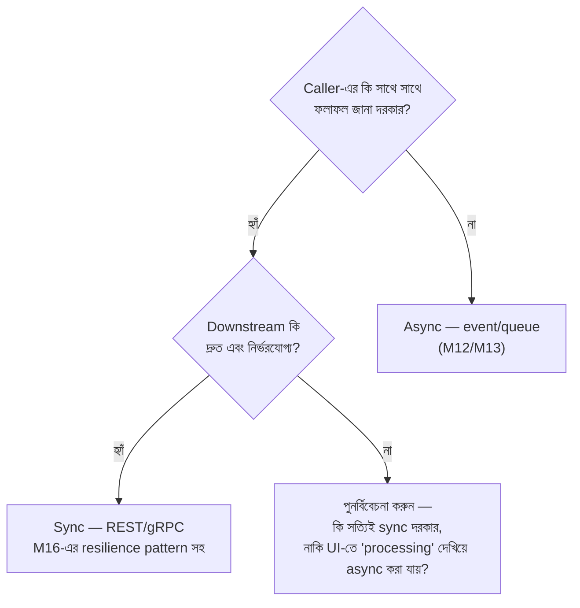
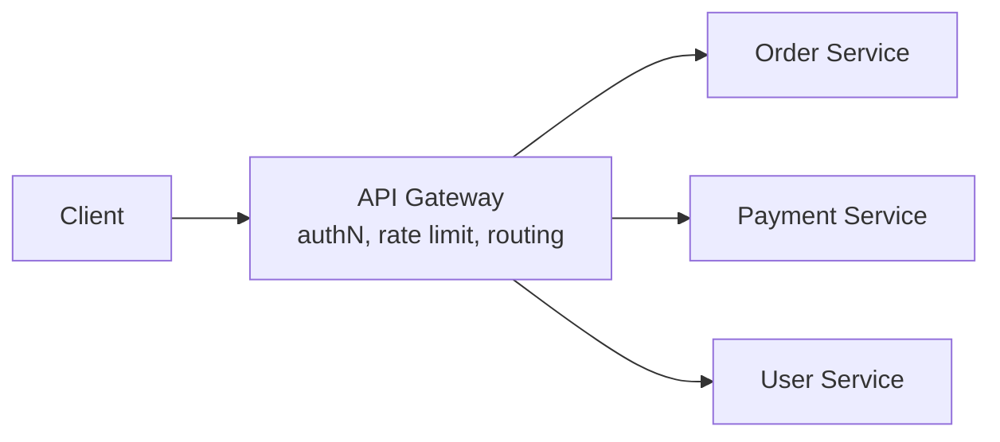
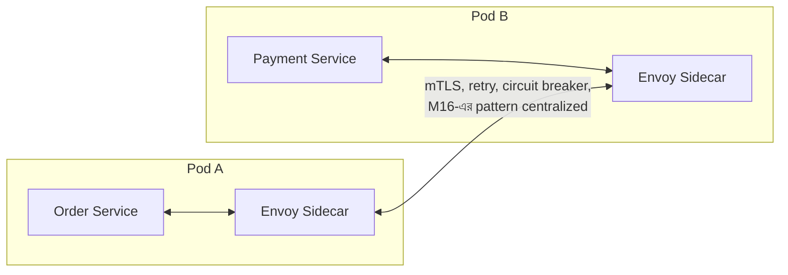

# Module 17 — Service Architecture

> **Phase E — Distributed Systems** | পূর্বশর্ত: M14, M15, M16
> পরের module: M18 (DDD & Clean Architecture)

---

## ১. যে microservices migration ৯ মাস পর monolith-এ ফিরে এল

একটা ১২ জনের ইঞ্জিনিয়ারিং টিম একটা মাঝারি-স্কেল e-commerce backend চালাত — একটা Django monolith, প্রায় ৪০০,০০০ লাইন কোড। একটা conference talk দেখে অনুপ্রাণিত হয়ে (M09-এর "Netflix ব্যবহার করে" ফাঁদের সরাসরি পুনরাবৃত্তি, কিন্তু architecture-এর স্তরে), তারা সিদ্ধান্ত নিল microservices-এ migrate করবে — ১৪টা আলাদা service-এ ভাগ করে (user, order, inventory, payment, notification, search, ...)।

৯ মাস পর, তারা migration **থামিয়ে দিল এবং আংশিকভাবে ফিরে গেল** একটা modular monolith architecture-এ। কী ভুল হয়েছিল:

**১. Distributed monolith তৈরি হয়ে গেল।** `order` service আর `inventory` service এত ঘনিষ্ঠভাবে coupled ছিল (প্রতিটা order creation-এ synchronous inventory check, M16-এর timeout budget ছাড়াই) যে তাদের **একসাথে deploy করতে হতো** প্রায় সবসময় — একটা API contract change মানে দুইটা service-ই একসাথে বদলাতে হতো। তারা microservices-এর অসুবিধা (network call, serialization overhead, M16-এর resilience জটিলতা) পেয়েছিল, কিন্তু সুবিধা (independent deployment) পায়নি।

**২. ১২ জনের টিম ১৪টা service maintain করছিল।** M09-এর polyglot persistence checklist-এর architecture সংস্করণ — প্রতিটা service-এর নিজস্ব CI/CD pipeline, নিজস্ব on-call rotation বোঝা, নিজস্ব monitoring dashboard। একটা simple feature (checkout flow-এ একটা নতুন field যোগ করা) যেটা monolith-এ একটা PR ছিল, এখন ৪টা service-এ ৪টা আলাদা PR, ৪টা আলাদা deployment, coordination overhead।

**৩. Cross-service transaction-এর জটিলতা underestimated ছিল।** M16-এ আমরা যা শিখেছি — Saga pattern প্রয়োজন হয় distributed transaction-এ, কিন্তু এই টিম সেটা properly implement করার আগেই migrate করে ফেলেছিল, ফলে data inconsistency bug নিয়মিত ঘটছিল।

**৪. সবচেয়ে গুরুত্বপূর্ণ — কোনো measured প্রয়োজন ছাড়াই স্প্লিট করা হয়েছিল।** কোনো নির্দিষ্ট scaling bottleneck ছিল না যা microservices সমাধান করত (M31-এর estimation নীতি কখনো প্রয়োগ করা হয়নি) — সিদ্ধান্তটা নেওয়া হয়েছিল "এটাই modern practice" বিশ্বাসের ভিত্তিতে।

এই module-টা এই ভুলটা এড়ানোর জন্য — একটা explicit decision framework, যা "microservices ভালো" বা "monolith পুরনো" এই ধরনের ভাসাভাসা বিশ্বাসের বদলে ব্যবহার করা যায়।

---

## ২. Monolith বনাম Microservices — সৎ Trade-off টেবিল

| | Monolith | Microservices |
|---|---|---|
| Deployment | একটা unit, সরল | Independent, কিন্তু coordination overhead |
| Development শুরুতে | দ্রুত (M31-এর payment system যেভাবে শুরু হয়েছিল) | ধীর (infrastructure setup, service boundary ডিজাইন) |
| Scaling | পুরো app scale করতে হয় (M31-এর vertical scaling সীমা পর্যন্ত ভালো কাজ করে) | Component-wise independent scaling (M08-এর sharding-এর মতো নির্বাচনী) |
| Team ownership | একটা codebase, অনেক টিম touch করে — coordination দরকার | প্রতিটা টিম নিজস্ব service-এর মালিক (Conway's Law, §৩) |
| Technology choice | একটা stack (M09-এর polyglot persistence সীমিত) | প্রতিটা service-এ ভিন্ন language/DB সম্ভব |
| Failure isolation | একটা bug পুরো app-কে প্রভাবিত করতে পারে | M16-এর bulkhead স্বাভাবিকভাবে বিদ্যমান (আলাদা process/deployment) |
| Debugging | সরল — একটা log stream, একটা stack trace | জটিল — distributed tracing দরকার (M24) |
| Transaction | Native ACID (M07) | Saga/eventual consistency (M14/M16) |
| Testing | সরল — একটা process spin up | জটিল — একাধিক service (M23-এর Testcontainers) |
| Operational overhead | কম | বেশি (M09-এর checklist প্রযোজ্য) |

**M31-এর payment system-এর সাথে সংযোগ:** পুরো এই handbook জুড়ে M31-এর payment platform-কে আমরা একটা single, cohesive system হিসেবে দেখেছি (PostgreSQL + Redis + Celery + Kafka)। এটা ইচ্ছাকৃত — এই সিস্টেমটা একটা **modular monolith**-এর ভালো উদাহরণ, যেখানে module boundary পরিষ্কার (payment, ledger, webhook delivery আলাদা Django app), কিন্তু deployment unit একটা।

---

## ৩. Conway's Law — Architecture যা Organization-কে প্রতিফলিত করে

### ৩.১ মূল বিবৃতি

> "যেকোনো organization যে সিস্টেম ডিজাইন করে, সেই ডিজাইন অনিবার্যভাবে সেই organization-এর communication structure-এর একটা কপি হবে।" — Melvin Conway, ১৯৬৭

### ৩.২ ব্যবহারিক অর্থ

```
যদি আপনার organization ৩টা টিম হয় (backend, frontend, data),
আপনার architecture স্বাভাবিকভাবে ৩টা প্রধান বিভাগে ভাগ হয়ে যাবে —
এমনকি যদি সেই বিভাজন সমস্যার domain-এর সাথে ভালোভাবে না মেলে।

Reverse Conway Maneuver: যদি আপনি একটা নির্দিষ্ট architecture চান
(যেমন M31-এর payment/ledger/notification আলাদা bounded context, M18-এ বিস্তারিত),
আপনার team structure-কেও সেই অনুযায়ী সংগঠিত করা উচিত — প্রতিটা bounded
context-এর একটা owning team, cross-cutting team না।
```

### ৩.৩ §১-এর ঘটনায় Conway's Law-এর ভূমিকা

১২ জনের টিম কোনো team-boundary পরিবর্তন ছাড়াই ১৪টা service বানিয়েছিল — মানে **service boundary organizational boundary-র সাথে মেলেনি**। ফলাফল: একজন বা দুইজন ইঞ্জিনিয়ার প্রায়ই একাধিক service জুড়ে কাজ করছিলেন (কারণ team ছোট, service অনেক), যেটা microservices-এর মূল সুবিধা (independent team ownership, independent deployment) নষ্ট করে দিয়েছিল।

> **Senior Tip:** "কতগুলো microservice আমাদের থাকা উচিত?" — এই প্রশ্নের সবচেয়ে ভালো heuristic উত্তর টেকনিক্যাল না, organizational: "সাধারণত service সংখ্যা team সংখ্যার কাছাকাছি হওয়া উচিত, তার চেয়ে বেশি না — প্রতিটা service-এর একটা clear owning team থাকা উচিত (M18-এর bounded context-এর সাথে সংযুক্ত)। যদি service সংখ্যা team সংখ্যার চেয়ে অনেক বেশি হয়, হয় service-গুলো খুব ছোট (unnecessary overhead), অথবা টিম-রা একাধিক service জুড়ে কাজ করছে (Conway's Law violation, coordination overhead ফিরে আসছে)।"

---

## ৪. কখন Split করবেন — এবং কখন করবেন না

### ৪.১ M09-এর polyglot persistence checklist-এর architecture সংস্করণ

```
প্রশ্ন ১: Monolith-এ কি একটা measured, specific সমস্যা আছে?
  - Deployment coordination সত্যিই ব্যথা দিচ্ছে (একটা টিমের ছোট change-এর জন্য
    অন্য টিমের approval/coordination লাগছে বারবার)?
  - একটা নির্দিষ্ট component-এর scaling profile বাকিদের থেকে radically ভিন্ন
    (M31-এর estimation দিয়ে measured, অনুমান না)?
  - একটা component-এর availability requirement বাকিদের থেকে ভিন্ন (M31-এর
    availability আলোচনা — payment 99.99% কিন্তু analytics 99.9% যথেষ্ট)?
  → না কোনোটাই: monolith-এ থাকুন, split করার দরকার নেই

প্রশ্ন ২: টিম কি এই coordination cost বহন করার মতো যথেষ্ট বড় এবং
          সংগঠিত (প্রতিটা নতুন service-এর owning team আছে)?
  → না: modular monolith দিয়ে boundary পান, deployment overhead ছাড়া

প্রশ্ন ৩: Split করলে যে distributed system জটিলতা আসবে (M14-এর Saga,
          M15-এর CAP trade-off, M16-এর resilience pattern), সেটা
          handle করার জন্য টিমের প্রস্তুতি/experience আছে?
  → না: এই জটিলতা প্রথমে শিখুন monolith-এর মধ্যে (M18-এর bounded
        context দিয়ে), তারপর split করুন
```

### ৪.২ Modular Monolith — উভয় জগতের সেরা অংশ

```python
# Django project structure — modular monolith
myproject/
    payments/          # আলাদা Django app, নিজস্ব models, views, tasks
        models.py
        services.py     # M31-এর service function pattern (M05)
        api.py
    ledger/
        models.py
        services.py
    notifications/
        models.py
        tasks.py

    # ⚠️ Enforcement — cross-module direct ORM query নিষিদ্ধ
```

```python
# ❌ নিষিদ্ধ — payments module সরাসরি ledger-এর model touch করছে
from ledger.models import LedgerEntry
LedgerEntry.objects.filter(...)   # tight coupling, module boundary ভেঙে যাচ্ছে

# ✅ সঠিক — শুধু ledger module-এর নিজস্ব service function দিয়ে interact
from ledger.services import get_balance
balance = get_balance(merchant_id)   # ledger module তার নিজের internal
                                        # implementation স্বাধীনভাবে বদলাতে পারে
```

**Enforcement — linter দিয়ে boundary বাধ্যতামূলক করা:**

```python
# import-linter কনফিগারেশন (setup.cfg বা pyproject.toml)
[importlinter]
root_package = myproject

[importlinter:contract:1]
name = Payments module ledger internals touch করতে পারবে না
type = forbidden
source_modules = payments
forbidden_modules = ledger.models   # শুধু ledger.services অনুমোদিত
```

**M31-এর "কখন microservice, কখন modular monolith" সিদ্ধান্তের সরাসরি প্রয়োগ:** এই কাঠামো module boundary তৈরি করে (M18-এর bounded context-এর প্রস্তুতি) কোনো network call, serialization, বা distributed transaction জটিলতা ছাড়াই। যদি ভবিষ্যতে সত্যিই একটা module-কে আলাদা service-এ extract করার প্রয়োজন হয় (measured, specific কারণে, §৪.১-এর প্রশ্নগুলোর উত্তর অনুযায়ী), এই clean boundary-র কারণে সেই migration **অনেক সহজ** — module-এর ভেতরের implementation ইতিমধ্যে isolated, শুধু service function call-কে HTTP/gRPC call-এ রূপান্তর করতে হবে।

> **Senior Tip:** "আমরা কি সরাসরি microservices দিয়ে শুরু করব একটা নতুন প্রজেক্টে, ভবিষ্যতের scale ধরে?" — "আমি এর বিরুদ্ধে পরামর্শ দেব, এমনকি যদি আমরা জানি ভবিষ্যতে scale বড় হবে। Modular monolith দিয়ে শুরু করলে বেশিরভাগ microservices-এর সুবিধা (clear boundary, independent testing) পাওয়া যায় বেশিরভাগ খরচ (distributed system জটিলতা, M16-এর resilience overhead) ছাড়াই। Module boundary যদি এখন থেকেই পরিষ্কার রাখা হয় (এই সেকশনের linter enforcement-এর মতো), ভবিষ্যতে প্রয়োজন হলে extract করা সহজ — কিন্তু প্রথম থেকেই microservices দিয়ে শুরু করে §১-এর ঘটনার মতো ভুল boundary বা অপ্রস্তুত টিম নিয়ে আটকে যাওয়ার ঝুঁকি অনেক বেশি ক্ষতিকর।"

---

## ৫. Distributed Monolith Anti-Pattern

### ৫.১ সংজ্ঞা ও চিহ্ন

**Distributed monolith** হলো এমন একটা architecture যা microservices-এর মতো দেখতে (একাধিক deployable service), কিন্তু monolith-এর মতোই tightly coupled আচরণ করে — microservices-এর সব খরচ, কোনো সুবিধা ছাড়াই।

```
চিহ্ন যা §১-এর ঘটনায় ছিল:
  ✗ Service A deploy করতে হলে Service B-ও একসাথে deploy করতে হয় প্রায়ই
  ✗ একটা API contract change মানে একাধিক service-এ synchronized change দরকার
  ✗ Service-এর মধ্যে synchronous call chain এত গভীর যে একটা request
    ৫-৬টা service touch করে (M16-এর tail latency amplification-এর
    সরাসরি সংযোগ)
  ✗ কোনো service স্বাধীনভাবে test করা যায় না, সবসময় অন্য service লাগে
    (M23-এর integration test জটিলতা বেড়ে যায়)
```

### ৫.২ কীভাবে এটা প্রতিরোধ করবেন

**M14-এর event-driven architecture এখানে সরাসরি সমাধান দেয়:**

```python
# ❌ Tight coupling — synchronous chain, distributed monolith-এর দিকে
def create_order(order_data):
    order = create_order_record(order_data)
    inventory_result = inventory_service.reserve(order.items)   # synchronous call
    if not inventory_result.success:
        raise OrderFailedError()
    payment_service.charge(order.total)   # আরেকটা synchronous call, chain বাড়ছে
    notification_service.send(order.user_id)   # আরও একটা
    return order

# ✅ Loose coupling — M14-এর outbox + event pattern
def create_order(order_data):
    with transaction.atomic():
        order = Order.objects.create(**order_data, status="pending")
        OutboxEvent.objects.create(event_type="order.created", payload={...})
    return order
    # inventory, payment, notification — প্রতিটা independently event শোনে,
    # নিজের গতিতে react করে, order service তাদের সম্পর্কে কিছু জানে না
```

**Data ownership-এর নীতি — distributed monolith-এর আরেকটা সাধারণ উৎস:**

```
❌ Shared database anti-pattern:
   order service আর inventory service একই টেবিল সরাসরি access করছে

✅ প্রতিটা service তার নিজের data-র একমাত্র মালিক:
   order service-এর নিজস্ব DB (বা schema, M08-এর multi-tenancy আলোচনার
   সমান্তরাল), inventory service তার নিজের। একে অপরের data দরকার হলে
   API call বা event দিয়ে, সরাসরি DB access না।
```

> **Senior Tip:** "Shared database কেন এত খারাপ, একটা সরল query তো সহজ?" — "সংক্ষিপ্ত মেয়াদে সহজ মনে হয়, কিন্তু এটা M18-এর bounded context নীতি ভঙ্গ করে — যদি দুইটা service একই টেবিল দেখে, তাদের মধ্যে একটা implicit schema contract তৈরি হয় যা কখনো explicitly ডকুমেন্টেড না। একটা service তার টেবিলে একটা column বদলালে, অন্য service নীরবে ভেঙে যেতে পারে, কোনো API contract violation ছাড়াই কারণ কোনো API-ই ছিল না, শুধু raw DB access। এটা distributed monolith-এর সবচেয়ে সাধারণ, সবচেয়ে সূক্ষ্ম কারণ।"

---

## ৬. Sync বনাম Async Communication — সিদ্ধান্ত কাঠামো

M12-M14-এ আমরা event-driven (async) communication-এর মেকানিক্স শিখেছি। এখন **কখন** sync, কখন async, তার সম্পূর্ণ কাঠামো।



| | Sync (REST/gRPC) | Async (Event/Queue) |
|---|---|---|
| Caller ফলাফল জানে | সাথে সাথে | পরে (polling, webhook, বা UI update) |
| Coupling | Caller downstream-এর uptime-এর উপর নির্ভরশীল (M16-এর resilience pattern ছাড়া বিপজ্জনক) | Loosely coupled, downstream সাময়িক down থাকলেও কাজ করে |
| Latency প্রভাব | Caller-এর latency-তে সরাসরি যোগ (M16-এর deadline propagation) | Caller-এর latency-তে প্রভাব নেই |
| M31-এর উদাহরণ | Payment approval check (client অপেক্ষা করছে) | Webhook delivery, email, analytics update |

**M31-এর payment flow-এ মিশ্র approach:**

```
Payment creation → sync (client-কে সাথে সাথে payment ID + status জানাতে হবে)
PSP charge → async (M14-এর outbox + event, M11-এর Celery task)
Webhook delivery → async (M06 §১০, M11)
Ledger update → async (M14-এর Inbox pattern দিয়ে consume)
Fraud check → sync কিন্তু M16-এর circuit breaker + timeout budget সহ
              (কারণ checkout flow-এর অংশ, কিন্তু downstream unreliable হতে পারে)
```

> M31 §৪-এর original architecture diagram-এ ঠিক এই মিশ্র pattern প্রয়োগ করা হয়েছিল — "PSP call কখনোই request path-এ না" নীতি আসলে এই sync/async সিদ্ধান্ত কাঠামোর একটা concrete প্রয়োগ ছিল, তখন ব্যাখ্যা ছাড়াই বলা হয়েছিল, এখন এর তাত্ত্বিক ভিত্তি সম্পূর্ণ।

---

## ৭. API Gateway ও BFF (Backend for Frontend)

### ৭.১ API Gateway



M31 §৪-এর architecture diagram-এ "API Gateway" যে layer হিসেবে ছিল (authN, rate limit, M06-এর throttle logic centralized) — এটাই সেই ধারণা এখন explicit। **মূল সুবিধা:** প্রতিটা downstream service-কে নিজে authentication/rate-limiting reimplement করতে হয় না — একটা কেন্দ্রীয় স্তরে করা হয়, M16-এর circuit breaker-ও এখানে centralized হতে পারে (M16 §৪.৩-এর "central proxy" বিকল্প)।

**ঝুঁকি — Gateway নিজেই single point of failure/bottleneck হতে পারে:**

```
যদি API Gateway নিজে horizontally scaled না হয় (M31-এর scaling ladder,
stateless design), এটা পুরো সিস্টেমের bottleneck হয়ে যেতে পারে —
M16-এর bulkhead নীতির লঙ্ঘন যদি সব traffic একটা single gateway
instance দিয়ে যায়।
```

### ৭.২ BFF — Backend for Frontend

```
সমস্যা: mobile app আর web app-এর data প্রয়োজন ভিন্ন (mobile কম data,
কম battery/bandwidth ব্যবহার করতে চায়; web richer data দেখাতে পারে)

একটা single, generic API সবার জন্য প্রায়ই কারো জন্যই optimal না
(M06-এর over-fetching সমস্যা, field selection দিয়ে আংশিক সমাধান করা হয়েছিল)
```

```python
# BFF pattern — প্রতিটা client type-এর জন্য একটা dedicated aggregation layer
# mobile_bff/views.py — শুধু প্রয়োজনীয়, compact data
class MobileDashboardView(APIView):
    def get(self, request):
        # একাধিক backend service-কে call করে, শুধু mobile-এর জন্য দরকারি
        # অংশ aggregate করে ফেরত দেয় — M06-এর field selection-এর একটা
        # dedicated, service-level সংস্করণ
        return Response({
            "balance": get_balance(request.user.merchant_id),
            "recent_count": get_recent_payment_count(request.user.merchant_id),
        })

# web_bff/views.py — richer data, dashboard-এর জন্য
class WebDashboardView(APIView):
    def get(self, request):
        return Response({
            "balance": get_balance(request.user.merchant_id),
            "recent_payments": get_recent_payments_detailed(request.user.merchant_id),
            "analytics": get_analytics_summary(request.user.merchant_id),
        })
```

> **Senior Tip:** "BFF কি duplicate code তৈরি করে না?" — "কিছুটা, হ্যাঁ — এবং এটাই একটা conscious trade-off, M06-এর GraphQL আলোচনার (M06 §১৪-এর interview প্রশ্ন ৫) মতো একই নীতি প্রয়োগ করে। BFF duplicate aggregation logic-এর বিনিময়ে প্রতিটা client-এর জন্য optimal payload আর independent evolution (mobile BFF বদলালে web BFF প্রভাবিত হয় না) দেয়। যেখানে client-দের প্রয়োজন সত্যিই ভিন্ন এবং ঘন ঘন independently বদলায়, এই duplication justified — একটা shared, generic API maintain করার জটিলতার চেয়ে প্রায়ই সহজ।"

---

## ৮. Service Discovery ও Service Mesh

### ৮.১ Service Discovery — সমস্যা যা এটা সমাধান করে

```
Microservices-এ, service-এর instance সংখ্যা এবং IP dynamically বদলায়
(M20-এর Kubernetes autoscaling, pod restart)। একটা service কীভাবে
জানবে অন্য service-কে ঠিক কোন IP-তে call করতে হবে?

সমাধান: service registry (M20-এ Kubernetes-এর নিজস্ব DNS-based
discovery, বা Consul-এর মতো dedicated tool) — প্রতিটা service
নাম দিয়ে registered, IP dynamically resolve হয়।
```

### ৮.২ Service Mesh — M16-এর centralized resilience



**মূল ধারণা:** প্রতিটা service-এর পাশে একটা "sidecar" proxy (সাধারণত Envoy) বসে, আর সব inter-service communication সেই sidecar দিয়ে যায়। M16-এর resilience pattern (retry, circuit breaker, timeout) এবং M02-এর mTLS (M02 §৪.৩) — এগুলো **application code-এ implement করতে হয় না**, sidecar centrally handle করে, uniform policy দিয়ে।

```yaml
# Istio VirtualService — M16-এর circuit breaker centrally কনফিগার করা,
# কোনো application code পরিবর্তন ছাড়াই
apiVersion: networking.istio.io/v1beta1
kind: DestinationRule
metadata:
  name: fraud-service
spec:
  host: fraud-service
  trafficPolicy:
    connectionPool:
      http:
        http1MaxPendingRequests: 10   # M16-এর bulkhead — connection pool size
    outlierDetection:
      consecutive5xxErrors: 5          # M16-এর circuit breaker threshold
      interval: 30s
      baseEjectionTime: 30s            # M16-এর recovery_timeout
```

**M16-এর মূল প্রশ্নের ("application-level নাকি centralized?") সম্পূর্ণ প্রেক্ষাপট এখন:** service mesh হলো সেই centralized বিকল্প — M31-এর `CircuitBreaker` Python class-এর বদলে, প্রতিটা service-এর sidecar একই policy uniform ভাবে enforce করে, কোনো Python code duplicate না করেই।

**খরচ — M09-এর checklist এখানেও প্রযোজ্য:**

```
Service mesh একটা উল্লেখযোগ্য operational জটিলতা যোগ করে:
  - নতুন infrastructure layer শিখতে ও operate করতে হয় (Istio/Linkerd)
  - প্রতিটা request-এ sidecar hop যোগ হয় latency-তে (M02-এর network
    overhead আলোচনার প্রয়োগ, যদিও সাধারণত সাব-মিলিসেকেন্ড)
  - Debugging আরেকটা স্তর জটিল হয় (M25-এর distributed debugging challenge বাড়ে)

কখন worth করে: বহু (১০+) service, বহু টিম, uniform policy enforcement
              গুরুত্বপূর্ণ — তখন প্রতিটা টিমের নিজে নিজে M16 বাস্তবায়ন করার
              চেয়ে কেন্দ্রীভূত করা বেশি efficient এবং consistent।

কখন overkill: ছোট-মাঝারি সংখ্যক service, ছোট টিম — application-level
              M16 pattern (Python library, যেমন এই handbook-এর CircuitBreaker
              class) যথেষ্ট, নতুন infrastructure layer-এর প্রয়োজন নেই।
```

---

## ৯. gRPC বনাম REST বনাম GraphQL — সিদ্ধান্ত

### ৯.১ M06-এর GraphQL আলোচনার সম্প্রসারণ, এখন internal service communication-এর প্রেক্ষাপটে

| | REST | gRPC | GraphQL |
|---|---|---|---|
| Serialization | JSON (text, M06-এর orjson optimization) | Protobuf (binary, compact) | JSON |
| Contract | OpenAPI (optional, M06) | `.proto` file (বাধ্যতামূলক, compile-time) | Schema (বাধ্যতামূলক) |
| Streaming | না (native) | হ্যাঁ (bidirectional streaming native) | Subscription (কম প্রচলিত) |
| Deadline propagation | Manual (M16 §২.২) | Native | Manual |
| Browser-friendly | হ্যাঁ | না (gRPC-Web proxy লাগে) | হ্যাঁ |
| সেরা fit | Public API, browser client (M06-এর সিদ্ধান্ত) | Internal service-to-service, high throughput | Client-driven flexible query (M06-এ আলোচিত, সীমিত ব্যবহার) |

**M06 §১৪-এর interview প্রশ্ন ৫-এর সরাসরি সম্প্রসারণ:** সেখানে public API-তে GraphQL-এর বিরুদ্ধে যুক্তি দেওয়া হয়েছিল caching/predictability-র কারণে। কিন্তু **internal service-to-service communication-এ** সেই যুক্তিগুলো কম প্রাসঙ্গিক (internal client-রা caching-এর উপর নির্ভর করে না একইভাবে) — সেখানে gRPC-র সুবিধা (M16-এর native deadline propagation, compact serialization, streaming) বেশি প্রাসঙ্গিক হয়ে ওঠে।

> **Senior Tip:** "কেন internal service-এ gRPC কিন্তু public API-তে REST?" — "প্রতিটা protocol-এর trade-off ভিন্ন context-এ ভিন্নভাবে ওজন করে। Public API-তে browser compatibility, debuggability (`curl` দিয়ে test করা), caching (M02-এর HTTP caching নীতি) গুরুত্বপূর্ণ — REST সেখানে জেতে। Internal service-এ, যেখানে আমরা নিজেরাই client এবং server নিয়ন্ত্রণ করি, performance (compact serialization) আর M16-এর native deadline propagation বেশি মূল্যবান, browser compatibility অপ্রাসঙ্গিক — gRPC সেখানে জেতে। এই দুইটা protocol একই architecture-এ একসাথে থাকা সম্পূর্ণ স্বাভাবিক — 'gateway REST-এ কথা বলে, internal service gRPC-তে' একটা common pattern (M06-এর M17-প্রেক্ষাপটে সম্প্রসারণ)।"

---

## ১০. Interview Section

### প্রশ্ন ১ (Senior) — "কখন monolith থেকে microservices-এ split করা উচিত?"

**❌ Wrong Answer**
> "যখন কোম্পানি বড় হয়ে যায় এবং scale করা দরকার।"

**🌟 Senior/Staff Answer**
> "'কোম্পানি বড়' একটা vague signal — আমি আরও নির্দিষ্ট criteria খুঁজি, M31-এর estimation নীতির architectural সংস্করণ হিসেবে। তিনটা প্রশ্ন করি: প্রথমত, monolith-এ কি একটা **measured** সমস্যা আছে — deployment coordination সত্যিই ব্যথা দিচ্ছে, নাকি একটা component-এর scaling profile বাকিদের থেকে radically ভিন্ন (কোনো অনুমান না, actual metrics দিয়ে)? দ্বিতীয়ত, আমাদের টিম কি এই split-কে সমর্থন করার মতো organizationally প্রস্তুত — প্রতিটা নতুন service-এর একটা clear owning team আছে (Conway's Law, M17 §৩)? তৃতীয়ত, distributed system-এর জটিলতা (Saga pattern M14, resilience engineering M16, distributed debugging M25) handle করার experience/প্রস্তুতি টিমের আছে?
>
> যদি এই তিনটার উত্তর 'হ্যাঁ' না হয়, আমি modular monolith (M17 §৪.২) দিয়ে module boundary তৈরি করব — clean separation পাওয়া যায় distributed system-এর খরচ ছাড়াই, আর ভবিষ্যতে সত্যিই দরকার হলে extract করা সহজ হয় কারণ boundary ইতিমধ্যে পরিষ্কার। আমি এমন একটা migration দেখেছি যেখানে ১২ জনের টিম ১৪টা microservice বানিয়েছিল কোনো measured প্রয়োজন ছাড়া, আর ৯ মাস পর distributed monolith-এর সব খরচ নিয়ে আংশিকভাবে ফিরে আসতে হয়েছিল — এই ধরনের decision-এ 'modern practice অনুসরণ করা' যথেষ্ট justification না।"

---

### প্রশ্ন ২ (Staff / Architecture) — "আমাদের microservices একে অপরকে অনেক synchronous call করছে, একটা request কখনো কখনো ৬টা service touch করে। এটা কি সমস্যা?"

**🌟 Senior/Staff Answer**
> "হ্যাঁ, এটা কয়েকটা কারণে গুরুতর সমস্যা, এবং আমি একে **distributed monolith**-এর একটা spectrum-এ দেখব (M17 §৫), সম্পূর্ণ পতিত না হলেও সেই দিকে যাচ্ছে।
>
> **প্রথমত, tail latency amplification (M16 §৪.২-এর নীতি)।** যদি প্রতিটা call-এর p99 ১%, ৬টা sequential call-এ p99 miss হওয়ার সম্ভাবনা ~৬% (approximately, independence ধরে নিয়ে) — অর্থাৎ প্রায় প্রতি ১৭তম request কোনো না কোনো hop-এ p99 latency ভোগ করবে। এটা M16-এর tail latency আলোচনার সরাসরি প্রয়োগ, service chain-এ।
>
> **দ্বিতীয়ত, availability compounding।** যদি প্রতিটা service ৯৯.৯% available (M31-এর availability টেবিল), ৬টা service chain-এর combined availability ≈ ৯৯.৯%^৬ ≈ ৯৯.৪% — যেটা M31-এর availability টেবিল অনুযায়ী একটা উল্লেখযোগ্যভাবে খারাপ SLA, প্রতিটা individual service ভালো হওয়া সত্ত্বেও।
>
> **তৃতীয়ত, এটাই দেখায় service boundary সম্ভবত ভুল জায়গায় আঁকা হয়েছে।** যদি ৬টা service একটা single request-এ এত ঘনিষ্ঠভাবে জড়িত, তারা সম্ভবত একটাই bounded context-এর (M18) অংশ হওয়া উচিত ছিল, কৃত্রিমভাবে বিভক্ত না।
>
> **আমার approach:** প্রথমে দেখব কোন call-গুলো সত্যিই synchronous হতে হবে (M17 §৬-এর কাঠামো) — অনেক ক্ষেত্রে event-driven (M14) দিয়ে decouple করা যায়, caller-কে আর অপেক্ষা করতে হয় না। যেগুলো সত্যিই synchronous থাকতে হবে (real-time approval দরকার), M16-এর পুরো resilience toolkit প্রয়োগ করব (deadline propagation, circuit breaker, bulkhead)। আর দীর্ঘমেয়াদে, service boundary পুনর্বিবেচনা করব — হয়তো কিছু service merge করা উচিত যদি তারা সবসময় একসাথে কাজ করে (Conway's Law-এর বিপরীত প্রয়োগ — যদি সবসময় একসাথে deploy/change করতে হয়, তারা হয়তো একটাই service হওয়া উচিত)।"

---

### প্রশ্ন ৩ (Scenario) — "একটা টিম প্রস্তাব করছে সব service-এর মধ্যে shared database ব্যবহার করতে 'সরল রাখার জন্য এবং JOIN query সহজ করার জন্য'। মতামত দিন।"

**🌟 Senior/Staff Answer**
> "আমি এর বিরুদ্ধে জোরালোভাবে পরামর্শ দেব, যদিও স্বীকার করি সংক্ষিপ্ত মেয়াদে এটা সত্যিই সহজ মনে হবে।
>
> Shared database হলো distributed monolith-এর সবচেয়ে সাধারণ, সবচেয়ে সূক্ষ্ম কারণ (M17 §৫.২)। সমস্যাটা তাৎক্ষণিক না — এটা ধীরে ধীরে প্রকাশ পায়। প্রতিটা service একে অপরের টেবিল দেখতে পারলে, তাদের মধ্যে একটা **implicit schema contract** তৈরি হয় যা কোথাও explicitly ডকুমেন্টেড না এবং কোনো versioning নেই (M12 §৮-এর explicit Schema Registry-র বিপরীত)। Service A তার টেবিলে একটা column বদলালে বা টেবিল restructure করলে, Service B নীরবে ভেঙে যেতে পারে — কোনো API contract violation দৃশ্যমান হবে না, কারণ কোনো API-ই মধ্যস্থতা করছিল না।
>
> এটা M18-এর একটা মূল নীতিও ভঙ্গ করে — প্রতিটা bounded context-এর নিজের data-র উপর সম্পূর্ণ মালিকানা থাকা উচিত, যাতে সে স্বাধীনভাবে বিবর্তিত হতে পারে। Shared database-এ এই স্বাধীনতা হারিয়ে যায়।
>
> 'JOIN সহজ করা' চাহিদার প্রকৃত সমাধান হলো M17 §৭-এর BFF pattern বা একটা dedicated aggregation layer — একটা service যেটা অন্য service-গুলোর API/event থেকে data সংগ্রহ করে, প্রয়োজনে denormalized read model বানায় (M14 §৭-এর CQRS-এর সাথে সংযুক্ত ধারণা)। এতে JOIN-এর মতো সুবিধা মেলে, কিন্তু প্রতিটা service এখনো তার নিজের data-র মালিক থাকে, কোনো implicit coupling ছাড়াই।
>
> যদি টিম এখনো এই simplicity চায়, আমার প্রস্তাব হবে — তাহলে হয়তো এই services আসলে একটাই bounded context, এবং সত্যিকারের সমাধান তাদের একটা modular monolith-এ merge করা, shared database দিয়ে microservices-এর ভান করা না।"

---

### প্রশ্ন ৪ (Coding / Architecture Decision) — "একটা checkout flow-এ order, inventory, payment তিনটা service জড়িত। কীভাবে design করবেন যাতে distributed monolith না হয়?"

**🌟 Senior/Staff Answer**
> "আমি M17 §৬-এর sync/async কাঠামো দিয়ে শুরু করব — প্রতিটা interaction-এর জন্য জিজ্ঞেস করব caller-এর সাথে সাথে ফলাফল জানা দরকার কি না।
>
> **যা genuinely synchronous থাকা উচিত:** Inventory availability check (checkout-এর সময় user-কে সাথে সাথে 'আছে/নেই' জানাতে হবে) — কিন্তু M16-এর পুরো resilience toolkit সহ (timeout budget, circuit breaker, bulkhead), কারণ এটা একটা critical path dependency।
>
> **যা async হওয়া উচিত:** Payment charge processing (M31-এর pattern — status 'processing' সাথে সাথে দেখানো, actual charge async), inventory-র চূড়ান্ত deduction (reservation আগে থেকে হয়েছে, actual deduction event-driven), notification।
>
> **ডিজাইন:**
> ```
> 1. Order service: order তৈরি (status=pending) + outbox event 'order.created'
>    (M14-এর outbox pattern, dual-write সমস্যা এড়ানো)
> 2. Inventory service: 'order.created' শুনে → SYNCHRONOUS reservation attempt
>    (কারণ এটা fast, এবং failure caller-কে সাথে সাথে জানানো ভালো UX)
>    → reservation সফল হলে 'inventory.reserved' event
>    → ব্যর্থ হলে 'inventory.unavailable' event (M14-এর compensating action-এর সূচনা)
> 3. Payment service: 'inventory.reserved' শুনে → charge attempt (M11-এর
>    idempotent Celery task)
>    → সফল: 'payment.succeeded'
>    → ব্যর্থ: 'payment.failed' → M14-এর Saga compensation → inventory release
> 4. Order service: 'payment.succeeded' শুনে → status='confirmed'
> ```
>
> **কেন এটা distributed monolith হবে না:** কোনো service সরাসরি অন্য service-এর API synchronously call করছে না (inventory availability check ছাড়া, যেটা ইচ্ছাকৃতভাবে sync রাখা হয়েছে UX-এর জন্য, M16-এর resilience সহ)। প্রতিটা service independently deploy করা যায় — order service-এর একটা field যোগ করা inventory/payment service-কে touch করে না। প্রতিটা service তার নিজের data-র মালিক (M17 §৫.২-এর নীতি)। আর distributed transaction-এর জটিলতা explicitly M14-এর Saga pattern দিয়ে handled, 'আশা করি সব ঠিক হবে' না।"

---

## ১১. হাতে-কলমে অনুশীলন

**১ — Conway's Law audit (২৫ মিনিট, conceptual)**
আপনার organization-এর team structure আর architecture (বা একটা কাল্পনিক প্রজেক্ট) তুলনা করুন। কোথায় architecture team boundary-র সাথে মেলে, কোথায় মেলে না? যেখানে মেলে না, সেটা কি সমস্যা তৈরি করছে (coordination overhead, unclear ownership)?

**২ — Modular monolith boundary ডিজাইন (৩০ মিনিট)**
আপনার নিজের প্রজেক্ট (বা M31-এর payment system) নিয়ে ৩-৪টা module-এ ভাগ করুন। প্রতিটা module-এর জন্য explicit "public interface" (service function) লিখুন যা অন্য module ব্যবহার করবে, internal implementation (models) hide করে।

**৩ — Sync/Async সিদ্ধান্ত ম্যাপিং (২০ মিনিট)**
একটা multi-step workflow বেছে নিন (checkout, user registration, বা অনুরূপ)। প্রতিটা ধাপের জন্য M17 §৬-এর কাঠামো দিয়ে সিদ্ধান্ত নিন sync নাকি async হওয়া উচিত, এবং কেন।

**৪ — Distributed monolith চিহ্ন খুঁজুন (২০ মিনিট, conceptual)**
যদি আপনার একটা multi-service প্রজেক্টে অভিজ্ঞতা থাকে, M17 §৫.১-এর checklist প্রয়োগ করুন — কোনো চিহ্ন উপস্থিত আছে কি না মূল্যায়ন করুন।

---

## ১২. মূল কথা

1. **Split করার সিদ্ধান্ত measured problem-এর ভিত্তিতে**, "modern practice" বিশ্বাসের ভিত্তিতে না — M31-এর estimation নীতির architectural প্রয়োগ।
2. **Conway's Law অনিবার্য** — architecture organization-কে প্রতিফলিত করে; service সংখ্যা team সংখ্যার কাছাকাছি রাখা একটা ভালো heuristic।
3. **Modular monolith প্রায়ই সেরা শুরুর বিন্দু** — clean boundary, কম operational overhead, ভবিষ্যতে extract করা সহজ যদি সত্যিই দরকার হয়।
4. **Distributed monolith সবচেয়ে খারাপ ফলাফল** — microservices-এর সব খরচ, কোনো সুবিধা ছাড়াই। Deep synchronous call chain আর shared database এর প্রধান লক্ষণ।
5. **Data ownership প্রতিটা service-এর নিজস্ব — shared database কখনো না** — implicit schema contract distributed monolith তৈরি করে।
6. **Sync বনাম async সিদ্ধান্ত "caller-এর সাথে সাথে ফলাফল দরকার কি না" দিয়ে নির্ধারিত** — M31-এর মিশ্র approach (payment creation sync, PSP charge async) এই নীতির concrete উদাহরণ।
7. **Tail latency এবং availability compound হয় service chain-এ** — ৬টা ৯৯.৯%-available service chain করলে combined availability উল্লেখযোগ্যভাবে খারাপ।
8. **API Gateway/BFF centralize/customize করে cross-cutting concern** — কিন্তু নিজেই bottleneck হতে পারে যদি স্কেল করা না হয়।
9. **Service mesh M16-এর resilience pattern centralize করে** — বহু service/টিমে worth করে, ছোট scale-এ application-level যথেষ্ট।
10. **gRPC internal, REST external — একই architecture-এ উভয়ই স্বাভাবিক** — প্রতিটা protocol-এর trade-off ভিন্ন context-এ ভিন্নভাবে ওজন করে।

---

## পরের Module

**M18 — DDD ও Clean Architecture।** আজ আমরা "service boundary" নিয়ে বারবার কথা বলেছি কিন্তু কখনো সুনির্দিষ্টভাবে বলিনি সেই boundary **কীভাবে** নির্ধারণ করতে হয়। পরের module-এ সেই প্রশ্নের formal উত্তর — bounded context, ubiquitous language, aggregate boundary, Entity/Value Object/Repository pattern, এবং Clean/Hexagonal/Onion architecture (যেগুলো একই ধারণার তিনটা নাম, একটা module-এ একসাথে পড়ানো হবে যাতে সময় নষ্ট না হয়) — এবং কখন এই formal DDD approach overkill, কখন এটা genuinely মূল্যবান।
