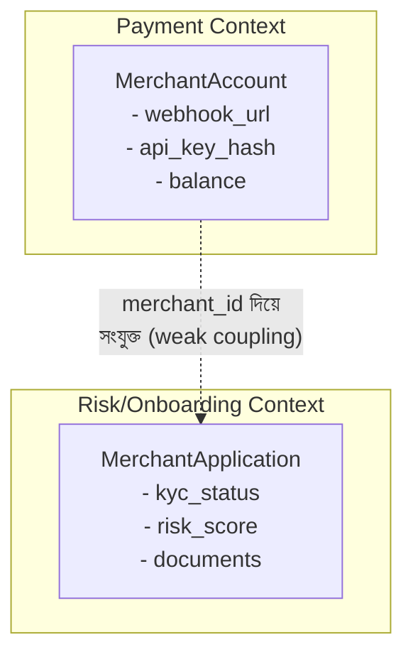
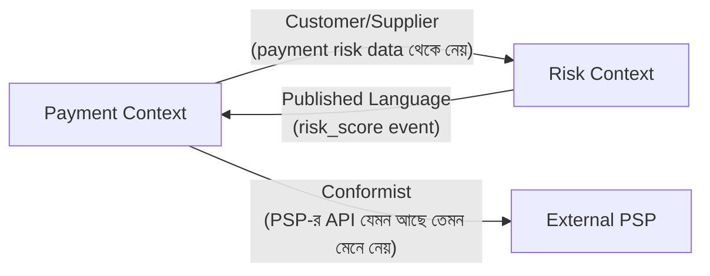
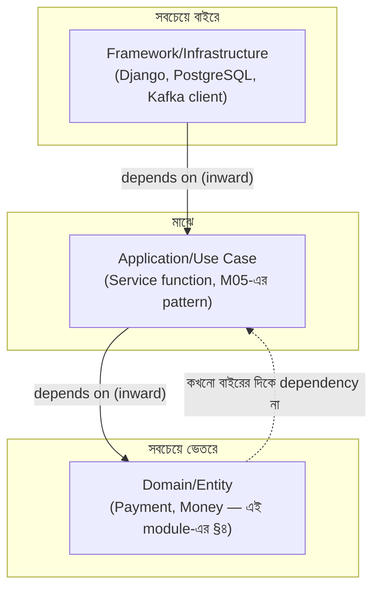

# Module 18 — DDD ও Clean Architecture

> **Phase E — Distributed Systems** | পূর্বশর্ত: M17
> পরের module: M19 (Linux, Containers & Docker) — Phase F শুরু

---

## ১. যে "Merchant" শব্দটা দুইটা ভিন্ন জিনিস বোঝাচ্ছিল

M31-এর payment platform বাড়তে বাড়তে একটা নতুন team যোগ হলো — **risk/compliance team**, যারা KYC verification আর merchant onboarding নিয়ে কাজ করত। তারা কোড লিখতে শুরু করল, existing `Merchant` model ব্যবহার করে:

```python
class Merchant(models.Model):
    name = models.CharField(max_length=255)
    email = models.EmailField()
    webhook_url = models.URLField()          # payment team-এর প্রয়োজন
    api_key_hash = models.CharField(max_length=64)  # payment team-এর প্রয়োজন
    kyc_status = models.CharField(max_length=16)     # risk team যোগ করল
    document_verified = models.BooleanField()         # risk team যোগ করল
    risk_score = models.IntegerField(null=True)        # risk team যোগ করল
    onboarding_step = models.CharField(max_length=32)  # risk team যোগ করল
```

কয়েক মাসের মধ্যে `Merchant` model-এ ৩৫টা field, দুইটা টিমের সম্পূর্ণ ভিন্ন mental model মিশে গেছে একটা class-এ। Payment team-এর কাছে "Merchant" মানে *"একটা entity যে payment গ্রহণ করে, যার একটা webhook URL আছে, যার balance আছে।"* Risk team-এর কাছে "Merchant" মানে *"একটা entity যে একটা multi-step verification process-এর মধ্য দিয়ে যাচ্ছে, যার একটা risk profile আছে, যার document আছে।"*

**একই শব্দ, দুইটা সম্পূর্ণ ভিন্ন ধারণা** — এবং সেই ভিন্নতা কোড-এ কোথাও explicit ছিল না। ফলাফল: risk team একটা migration চালাল যা `onboarding_step` বদলাল, আর payment team-এর একটা signal (M05-এর সতর্কতা!) চুপচাপ merchant-এর `is_active` flag বদলে দিল, কারণ সেই signal ধরে নিয়েছিল "onboarding শেষ = active" — কিন্তু risk team-এর নতুন multi-step flow-এ এটা সত্য ছিল না। একটা production bug যেখানে merchant-রা অসম্পূর্ণ verification নিয়েও payment নিতে শুরু করল।

এই সমস্যাটার মূল কারণ **Ubiquitous Language-এর অভাব** এবং **bounded context-এর অস্পষ্টতা** — Domain-Driven Design-এর দুইটা কেন্দ্রীয় ধারণা, যা এই module-এর বিষয়।

---

## ২. Ubiquitous Language — শব্দের precision

### ২.১ মূল ধারণা

**Ubiquitous Language** হলো একটা shared vocabulary যা domain expert (business/product লোক) এবং developer **উভয়েই** একই অর্থে ব্যবহার করে — কোড, ডকুমেন্টেশন, মিটিং, সব জায়গায় একই শব্দ, একই অর্থ।

```
❌ Ambiguous: "Merchant" — payment team-এর কাছে একরকম, risk team-এর কাছে আরেকরকম
❌ Ambiguous: "Order" — inventory team-এর কাছে "একটা reservation", billing team-এর
              কাছে "একটা invoice-এর ভিত্তি"

✅ Precise: "MerchantAccount" (payment context) বনাম "MerchantApplication"
           (risk/onboarding context) — নাম দিয়েই context স্পষ্ট
```

### ২.২ কেন এটা শুধু "naming convention" না

Ubiquitous Language-এর মূল্য কোড readability-র বাইরে যায় — এটা **প্রকৃত domain misunderstanding প্রকাশ করে**। যখন দুইটা টিম একই শব্দ ভিন্ন অর্থে ব্যবহার করে (§১-এর ঘটনা), সেটা একটা সংকেত যে তারা আসলে **দুইটা ভিন্ন ধারণা** নিয়ে কাজ করছে যেগুলো ভুলভাবে একটা single model-এ মিশে গেছে। Ubiquitous Language enforce করা (প্রতিটা context-এ স্পষ্ট, আলাদা নাম) এই বিভ্রান্তি কোড লেখার **আগেই** প্রকাশ করে, production bug হিসেবে আবিষ্কার হওয়ার বদলে।

> **Senior Tip:** "DDD-র সবচেয়ে ব্যবহারিক প্রথম পদক্ষেপ কী?" — "কোনো design pattern প্রয়োগ করা না — শুধু meeting-এ মনোযোগ দেওয়া। যদি একটা মিটিং-এ দুইজন মানুষ একই শব্দ ('Order', 'Account', 'Merchant') ব্যবহার করছে কিন্তু স্পষ্টভাবে ভিন্ন জিনিস বোঝাচ্ছে (আলোচনা confuse হয়ে যাচ্ছে, একে অপরকে ভুল বুঝছে), সেটাই সংকেত যে একটা bounded context boundary সেখানে আছে যেটা এখনো explicit করা হয়নি। §১-এর ঘটনায়, যদি প্রথম মিটিং থেকেই 'Merchant' শব্দটা নিয়ে এই স্পষ্টতা আনা হতো, সেই production bug কখনো ঘটত না।"

---

## ৩. Bounded Context — M17-এর Service Boundary-র Formal ভিত্তি

### ৩.১ সংজ্ঞা

**Bounded Context** হলো একটা explicit সীমানা যার ভেতরে একটা নির্দিষ্ট model এবং Ubiquitous Language বৈধ। একটা শব্দ (`Merchant`) একটা context-এ একটা অর্থ রাখতে পারে, আরেকটা context-এ সম্পূর্ণ ভিন্ন অর্থ — এবং এটা **সমস্যা না**, এটাই bounded context-এর মূল বিন্দু।



**§১-এর ঘটনার সমাধান:** `Merchant`-কে দুইটা আলাদা model-এ ভাগ করা, প্রতিটা তার নিজের bounded context-এ — `MerchantAccount` (payment context, payment team-এর মালিকানা) আর `MerchantApplication` (risk context, risk team-এর মালিকানা)। তারা `merchant_id` দিয়ে সংযুক্ত (একটা shared identifier, M17 §৫.২-এর data ownership নীতি অনুযায়ী কোনো shared table না), কিন্তু প্রতিটা context স্বাধীনভাবে বিবর্তিত হতে পারে।

### ৩.২ M17-এর Service Boundary-র সাথে সম্পর্ক

**এটাই সেই formal পদ্ধতি যা M17-এ আমরা প্রতিশ্রুতি দিয়েছিলাম:** M17-এ আমরা বলেছিলাম "module boundary পরিষ্কার রাখা" কিন্তু কীভাবে সেই boundary নির্ধারণ করব তা বলিনি। উত্তর: **bounded context-ই সেই boundary।** M17-এর modular monolith-এর প্রতিটা Django app **একটা bounded context** হওয়া উচিত — `payments/` app payment bounded context, `risk/` app risk bounded context। যদি ভবিষ্যতে microservice-এ split করার প্রয়োজন হয় (M17 §৪.১-এর measured কারণে), **bounded context-ই natural split point** — কারণ সেখানে already একটা clean, well-defined boundary আছে।

### ৩.৩ Context Map — Bounded Context-দের মধ্যে সম্পর্ক



| Pattern | অর্থ |
|---|---|
| **Customer/Supplier** | একটা context (customer) আরেকটার (supplier) output-এর উপর নির্ভরশীল, supplier-এর কিছুটা influence থাকে কিন্তু supplier স্বাধীন |
| **Conformist** | একটা context আরেকটার model **যেমন আছে তেমন মেনে নেয়**, কোনো influence নেই (M31-এর PSP integration — আমরা PSP-র API contract বদলাতে পারি না, মেনে নিতে হয়) |
| **Anti-Corruption Layer** | একটা context আরেকটার model-কে সরাসরি প্রবেশ করতে না দিয়ে একটা translation layer রাখে (নিচে §৭-এ বিস্তারিত) |
| **Published Language** | একটা well-documented, versioned format দিয়ে যোগাযোগ (M12-এর Schema Registry-র সাথে সরাসরি সংযোগ) |

> **Senior Tip:** "Context map ব্যবহারিকভাবে কী কাজে লাগে?" — "এটা M17-এর architecture diagram-এর একটা semantic স্তর যোগ করে — শুধু 'কোন service কার সাথে কথা বলে' না, বরং 'কোন দিকে influence/dependency যাচ্ছে এবং কী ধরনের সম্পর্ক।' M31-এর PSP integration-এ, আমরা conformist — PSP আমাদের API বদলাবে না আমাদের অনুরোধে, আমাদেরই তাদের সাথে মানিয়ে নিতে হবে (M02-এর webhook signature verification, retry logic — সবই এই conformist সম্পর্কের ফলাফল)। এই স্পষ্টতা থাকলে টিম বুঝতে পারে কোথায় flexibility আছে (internal context-দের মধ্যে) আর কোথায় নেই (external dependency-তে)।"

---

## ৪. Entity, Value Object, Aggregate

### ৪.১ Entity — identity দিয়ে সংজ্ঞায়িত

```python
class Payment:   # Entity — একটা unique identity আছে, state বদলাতে পারে
    def __init__(self, payment_id: uuid.UUID, amount_minor: int, status: str):
        self.id = payment_id   # ⚠️ identity — এটাই payment-কে "একই payment" রাখে
        self.amount_minor = amount_minor
        self.status = status    # state বদলাতে পারে (M05-এর status transition)

    def __eq__(self, other):
        return isinstance(other, Payment) and self.id == other.id
        # ⚠️ equality identity দিয়ে, attribute value দিয়ে না —
        # দুইটা Payment একই id থাকলে "একই", amount ভিন্ন হলেও
        # (যেমন একটা refund-এর পর amount বদলে গেছে, তবু এটা একই payment)
```

**M07-এর PostgreSQL row-এর ধারণাগত সংযোগ:** একটা `Payment` entity ঠিক M07-এর MVCC row versioning-এর ধারণাগত সমতুল্য — একই `id` (M07-এর primary key) রেখে state (row-এর content) সময়ের সাথে বদলাতে পারে, কিন্তু identity অপরিবর্তিত থাকে।

### ৪.২ Value Object — value দিয়ে সংজ্ঞায়িত, immutable

```python
from dataclasses import dataclass

@dataclass(frozen=True)   # M04 §১২-এর frozen dataclass-এর সরাসরি প্রয়োগ
class Money:   # Value Object — কোনো identity নেই, শুধু value
    amount_minor: int
    currency: str

    def __add__(self, other):
        if self.currency != other.currency:
            raise ValueError("মুদ্রা মিলছে না")
        return Money(self.amount_minor + other.amount_minor, self.currency)

    def __eq__(self, other):
        # ⚠️ equality value দিয়ে — দুইটা Money("1500", "BDT") সবসময় "সমান",
        # কোনো identity বিবেচনা ছাড়াই — এটাই Value Object-এর সংজ্ঞা
        return self.amount_minor == other.amount_minor and self.currency == other.currency
```

**M08 §৮.১-এর money handling নীতির natural extension:** M08-এ আমরা বলেছিলাম money integer minor unit বা Decimal-এ স্টোর করতে, কখনো raw integer/float হিসেবে ছড়িয়ে না দিতে। `Money` Value Object সেই নীতিকে একটা **type-level guarantee**-তে রূপান্তর করে — এখন কোনো ফাংশন ভুল করে দুইটা ভিন্ন currency যোগ করতে পারবে না (constructor-এই ব্যর্থ হবে), আর `amount_minor` raw int হিসেবে ছড়িয়ে থাকার বদলে সবসময় তার currency-র সাথে bundled থাকে।

```python
# ❌ raw values ছড়িয়ে আছে — currency mismatch bug সম্ভব, কোনো compile/runtime
#    সতর্কতা ছাড়াই
def calculate_total(amount1_minor: int, amount2_minor: int) -> int:
    return amount1_minor + amount2_minor   # ভিন্ন currency হলে ভুল ফলাফল, silent

# ✅ Value Object — ভুল currency যোগ করলে exception, silent bug অসম্ভব
def calculate_total(amount1: Money, amount2: Money) -> Money:
    return amount1 + amount2   # __add__-এ currency check built-in
```

### ৪.৩ Aggregate — Consistency Boundary

**সবচেয়ে গুরুত্বপূর্ণ এবং সবচেয়ে ভুল বোঝা ধারণা।**

```python
class Payment:   # Aggregate Root
    def __init__(self, payment_id, merchant_id, amount: Money):
        self.id = payment_id
        self.merchant_id = merchant_id
        self.amount = amount
        self.status = "processing"
        self._refunds: list["Refund"] = []   # ⚠️ Refund শুধু Payment-এর মাধ্যমে access

    def add_refund(self, refund_amount: Money):
        # ⚠️ Business invariant enforce করা — Aggregate-এর মূল দায়িত্ব
        total_refunded = sum((r.amount for r in self._refunds), Money(0, self.amount.currency))
        if total_refunded.amount_minor + refund_amount.amount_minor > self.amount.amount_minor:
            raise ValueError("Over-refund — M05 §১৩-এর প্রশ্ন ৪-এর race condition-এর
                                domain-level প্রতিরোধ")
        self._refunds.append(Refund(refund_amount))
        if total_refunded.amount_minor + refund_amount.amount_minor == self.amount.amount_minor:
            self.status = "refunded"

class Refund:   # শুধু Payment aggregate-এর ভেতর থেকে access করা যায়, সরাসরি না
    def __init__(self, amount: Money):
        self.amount = amount
```

**মূল নিয়ম — Aggregate Root-ই একমাত্র entry point:**

```python
# ❌ ভুল — Refund সরাসরি তৈরি/manipulate করা, Payment-এর invariant bypass করে
refund = Refund(Money(500000, "BDT"))   # কোনো over-refund check হলো না!

# ✅ সঠিক — Payment (Aggregate Root)-এর মাধ্যমে, invariant enforced
payment.add_refund(Money(500000, "BDT"))   # এখানে over-refund check হবে
```

**M05 §৮.১-এর race condition সমস্যার সাথে সরাসরি সংযোগ:** M05-এ আমরা `select_for_update()` দিয়ে database-level এ race condition আটকিয়েছিলাম। Aggregate pattern **একই সমস্যা** application/domain-level এ সমাধান করে — সব business invariant (over-refund check) একটা single class-এ কেন্দ্রীভূত, তাই কোনো code path সেটা বাইপাস করতে পারে না (M07-এর "correctness enforce করুন যেখানে বাইপাস অসম্ভব" নীতির domain-model সংস্করণ)। **Aggregate boundary সাধারণত database transaction boundary-র সাথে মেলা উচিত** — একটা `transaction.atomic()` block একটা aggregate-এর state পরিবর্তন করা উচিত, একাধিক না (M07-এর ACID guarantee-র সাথে সাযুজ্যপূর্ণ রাখতে)।

> **Senior Tip:** "Aggregate boundary কীভাবে ঠিক করবেন?" — "মূল প্রশ্ন: কোন entity-গুলোর একসাথে, atomically consistent থাকা **আবশ্যক**? Payment আর তার Refund-গুলো — হ্যাঁ, কারণ over-refund invariant একসাথে enforce করতে হয় (M05-এর race condition ঠিক এই কারণেই বিপজ্জনক ছিল)। কিন্তু Payment আর Merchant-এর সম্পূর্ণ profile — না, এগুলো আলাদা aggregate, কারণ merchant-এর নাম বদলানো payment-এর consistency-কে প্রভাবিত করে না। Aggregate যত বড় হয়, তত বেশি contention (M07-এর lock granularity নীতি) — তাই aggregate যতটা সম্ভব ছোট রাখা, কিন্তু invariant enforcement-এর জন্য যতটা প্রয়োজন ততটা বড়।"

---

## ৫. Repository, Factory, Domain Service

### ৫.১ Repository Pattern — M05-এর Manager Pattern-এর Formal নাম

```python
class PaymentRepository:
    """Domain layer-কে persistence detail থেকে আলাদা রাখে —
    domain code জানে না এটা PostgreSQL, নাকি অন্য কিছু"""

    def get_by_id(self, payment_id: uuid.UUID) -> Payment:
        row = PaymentModel.objects.select_related("merchant").get(pk=payment_id)
        return self._to_domain(row)   # ORM model → domain object রূপান্তর

    def save(self, payment: Payment) -> None:
        PaymentModel.objects.update_or_create(
            pk=payment.id,
            defaults={"status": payment.status, "amount_minor": payment.amount.amount_minor},
        )

    def _to_domain(self, row: "PaymentModel") -> Payment:
        p = Payment(row.id, row.merchant_id, Money(row.amount_minor, row.currency))
        p.status = row.status
        return p
```

**M05 §৬-এর Custom Manager/QuerySet-এর সাথে সরাসরি তুলনা:** M05-এ আমরা `PaymentManager`/`PaymentQuerySet` দেখেছিলাম — সেটা Django-নির্দিষ্ট abstraction। Repository pattern একই ধারণার **framework-agnostic** সংস্করণ — domain logic (Aggregate-এর ভেতরে) জানে না এটা Django ORM ব্যবহার করছে, নাকি অন্য কিছু। এটা বিশেষভাবে মূল্যবান testing-এ (M23-এ বিস্তারিত) — domain logic test করতে database দরকার নেই, শুধু একটা in-memory fake repository।

### ৫.২ Factory — জটিল object তৈরির যুক্তি কেন্দ্রীভূত করা

```python
class PaymentFactory:
    @staticmethod
    def create_from_api_request(merchant, request_data: dict, idempotency_key: str) -> Payment:
        # M31-এর idempotency validation, M08-এর money parsing —
        # সব creation-time business rule এক জায়গায়
        amount = Money(
            amount_minor=int(Decimal(request_data["amount"]) * 100),
            currency=request_data["currency"],
        )
        if amount.amount_minor <= 0:
            raise ValueError("Amount ধনাত্মক হতে হবে")
        return Payment(
            payment_id=uuid.uuid4(), merchant_id=merchant.id, amount=amount,
        )
```

### ৫.৩ Domain Service — যখন logic কোনো single entity-র না

```python
class RefundEligibilityService:
    """কখনো কখনো business logic একটা single Entity/Aggregate-এ ভালোভাবে
    ফিট করে না — একাধিক aggregate/external policy জড়িত থাকে"""

    def is_eligible_for_refund(self, payment: Payment, merchant: MerchantAccount) -> bool:
        if payment.status != "succeeded":
            return False
        if merchant.tier == "restricted":   # merchant-এর policy, payment-এর না
            return False
        if (timezone.now() - payment.created_at).days > 180:  # business policy
            return False
        return True
```

> **Senior Tip:** "কখন logic Entity-তে রাখবেন, কখন Domain Service-এ?" — "নিয়ম: যদি logic শুধু একটা entity-র নিজের state-এর উপর নির্ভর করে (over-refund check — শুধু Payment-এর নিজের refund history), সেটা Entity/Aggregate-এর method। যদি logic একাধিক aggregate-এর তথ্য একসাথে প্রয়োজন করে (refund eligibility — Payment এবং Merchant দুইটাই), সেটা Domain Service। এই পার্থক্যটা গুরুত্বপূর্ণ কারণ Entity-কে 'fat' (সব logic এক জায়গায় গাদাগাদি) করে ফেললে M17-এর 'God object' anti-pattern-এর domain-model সংস্করণ তৈরি হয়।"

---

## ৬. Clean = Hexagonal = Onion — একই ধারণা, তিনটা নাম

### ৬.১ কেন এই তিনটা একসাথে

Clean Architecture (Robert Martin), Hexagonal Architecture (Alistair Cockburn, "Ports and Adapters" নামেও পরিচিত), এবং Onion Architecture (Jeffrey Palermo) — তিনজন ভিন্ন লোক প্রায় একই সময়ে (২০০৫-২০১২) একই মূল সমস্যার সমাধান স্বাধীনভাবে প্রস্তাব করেছিলেন, তিনটা ভিন্ন নাম আর ভিন্ন diagram দিয়ে। **কেন্দ্রীয় ধারণা অভিন্ন:**



**একক মূলনীতি — Dependency Inversion:** নির্ভরতা সবসময় **ভেতরের দিকে** যায় — outer layer (framework, database) inner layer (domain logic)-কে চেনে, কিন্তু **কখনো উল্টো না**। Domain layer জানে না Django বলে কিছু আছে, PostgreSQL বলে কিছু আছে।

### ৬.২ তিনটা নামের পার্থক্য টেবিল

| নাম | মূল রূপক | Layer-এর নাম |
|---|---|---|
| **Clean Architecture** | Concentric circle | Entities → Use Cases → Interface Adapters → Frameworks |
| **Hexagonal (Ports & Adapters)** | একটা hexagon, port দিয়ে বাইরের সাথে যোগাযোগ | Domain → Application → Ports/Adapters |
| **Onion Architecture** | Onion layer | Domain Model → Domain Services → Application Services → Infrastructure |

**ব্যবহারিক সিদ্ধান্ত:** এই তিনটার মধ্যে কোনটা "ব্যবহার করবেন" সেটা প্রায় অপ্রাসঙ্গিক প্রশ্ন — মূলনীতি (dependency inversion, domain layer-কে framework থেকে বিচ্ছিন্ন রাখা) একই, নাম আলাদা। যেকোনো একটা নাম ব্যবহার করে একই architecture বাস্তবায়ন করা যায়।

### ৬.৩ Django-তে বাস্তবায়ন এবং ঘর্ষণ

```python
# domain/payment.py — কোনো Django import নেই, pure Python
class Payment:
    def __init__(self, payment_id, merchant_id, amount): ...
    def add_refund(self, amount): ...   # §৪.৩-এর Aggregate

# application/services.py — use case, orchestration (M05 §১৩-এর service function pattern)
def process_refund(payment_id: uuid.UUID, amount_minor: int, repo: PaymentRepository):
    payment = repo.get_by_id(payment_id)
    payment.add_refund(Money(amount_minor, payment.amount.currency))
    repo.save(payment)

# infrastructure/django_models.py — Django ORM, framework-নির্দিষ্ট
class PaymentModel(models.Model):   # M07-এর সব index/constraint নীতি এখানে প্রযোজ্য
    ...

# infrastructure/api.py — DRF view (M06), সবচেয়ে বাইরের layer
class RefundView(APIView):
    def post(self, request, payment_id):
        process_refund(payment_id, request.data["amount_minor"], PaymentRepository())
        return Response(status=200)
```

**Django-র সাথে ঘর্ষণ — সৎভাবে স্বীকার করা দরকার:** Django ORM **Active Record** pattern-এ ডিজাইন করা (M09-এ উল্লেখিত) — model class নিজেই persistence logic বহন করে (`payment.save()`)। Clean Architecture Repository pattern চায় **Data Mapper** style (domain object persistence সম্পর্কে কিছু জানে না, Repository আলাদাভাবে map করে)। এই দুইটা paradigm সরাসরি সংঘর্ষে আসে — Django-তে "pure" Clean Architecture বাস্তবায়ন করতে গেলে ORM-এর স্বাভাবিক সুবিধা (query optimization, M07 §৫-এর `select_related` ইত্যাদি) অনেকটাই হাতে করে পুনর্নির্মাণ করতে হয় Repository layer-এ।

> **Senior Tip:** "Django-তে pure Clean Architecture বাস্তবায়ন করা কি worth করে?" — "সাধারণত না, সম্পূর্ণভাবে না — এবং এটা বলাটাই একটা senior signal, কারণ dogmatic pure-architecture-প্রেমী juniorদের থেকে এটাই পার্থক্য করে। Django ORM-এর Active Record convenience (M05-এর `select_related`, M07-এর query optimization) ছেড়ে দেওয়া একটা বড় খরচ। আমি সাধারণত একটা **pragmatic hybrid** পছন্দ করি — জটিল business logic (Aggregate-এর invariant, §৪.৩-এর over-refund check) কে plain Python class-এ আলাদা রাখি (testability-র জন্য, M23), কিন্তু simple CRUD-এ Django Model সরাসরি ব্যবহার করি কোনো Repository layer ছাড়াই। Full DDD+Clean Architecture শুধু তখনই justified যখন business logic genuinely জটিল (M31-এর ledger/reconciliation-এর মতো, যেখানে invariant enforcement critical) — একটা সরল CRUD app-এ এটা অপ্রয়োজনীয় ceremony, M14-এর Event Sourcing-এর মতো একই ধরনের over-engineering ঝুঁকি।"

---

## ৭. Anti-Corruption Layer — External System-এর "নোংরামি" থেকে Domain রক্ষা

```python
# ❌ External PSP-র রেসপন্স ফরম্যাট সরাসরি domain-এ ঢুকে যাচ্ছে
def handle_psp_webhook(psp_payload: dict):
    payment.status = psp_payload["txn_state"]   # PSP-র নিজস্ব vocabulary!
    # "txn_state" কখনো "SUCCESS", কখনো "S", PSP ভার্সন-ভেদে বদলাতে পারে —
    # domain model এখন PSP-র API-র উপর tightly coupled

# ✅ Anti-Corruption Layer — translation, domain vocabulary রক্ষা
class PSPAdapter:
    """M17 §৩.২-এর Conformist সম্পর্ক থেকে domain-কে রক্ষা করার স্তর"""

    STATUS_MAP = {"SUCCESS": "succeeded", "S": "succeeded", "FAILED": "failed", "F": "failed"}

    def translate_webhook(self, psp_payload: dict) -> dict:
        return {
            "payment_id": psp_payload["merchant_reference"],
            "status": self.STATUS_MAP[psp_payload["txn_state"]],   # PSP vocabulary → domain vocabulary
        }

def handle_psp_webhook(psp_payload: dict, adapter: PSPAdapter):
    translated = adapter.translate_webhook(psp_payload)
    payment.status = translated["status"]   # domain সবসময় নিজের vocabulary দেখে
```

**M06 §১২.১-এর webhook signature verification-এর সাথে সংযোগ:** M06-এ আমরা webhook payload-এর নিরাপত্তা (signature verification) নিয়ে কথা বলেছিলাম। Anti-Corruption Layer একই সমস্যার একটা **semantic** সংস্করণ — শুধু payload নিরাপদ কি না তাই না, payload-এর **vocabulary** domain-এর নিজস্ব vocabulary-র সাথে সামঞ্জস্যপূর্ণ কি না তা নিশ্চিত করা। PSP তাদের API বদলালে (M12 §৮-এর schema evolution-এর external সংস্করণ), শুধু `PSPAdapter` বদলাতে হবে, পুরো domain model অক্ষত থাকে।

---

## ৮. কখন DDD Overkill — সৎ মূল্যায়ন

M14-এর Event Sourcing আলোচনার একই সততা এখানে প্রযোজ্য।

```
প্রশ্ন ১: Business logic কি genuinely জটিল (অনেক invariant, অনেক edge case,
          M31-এর payment/ledger-এর মতো)?
  → না: সাধারণ Django CRUD + service function (M05) যথেষ্ট, formal DDD
        অপ্রয়োজনীয় ceremony

প্রশ্ন ২: একাধিক টিম কি একই domain-এর ভিন্ন অংশ নিয়ে কাজ করছে, যেখানে
          Ubiquitous Language বিভ্রান্তি (§১-এর ঘটনার মতো) একটা বাস্তব ঝুঁকি?
  → না: bounded context-এর formal separation প্রয়োজনীয়তা কম

প্রশ্ন ৩: Domain logic কি database/framework থেকে স্বাধীনভাবে test করার
          প্রয়োজন আছে (M23-এর fast, isolated unit test)?
  → না: Django ORM সরাসরি ব্যবহার করাই সহজ এবং দ্রুত

যদি প্রশ্নগুলোর উত্তর মূলত "না" হয়, DDD-র heavyweight অংশ (Repository,
Factory, formal Aggregate boundary) এড়িয়ে যান। কিন্তু Ubiquitous
Language-এর discipline (§২) — precise, context-aware naming — প্রায়
সবসময় মূল্যবান, প্রায় বিনামূল্যে।
```

> **Senior Tip:** "আমাদের একটা ছোট CRUD app-এ DDD ব্যবহার করা উচিত?" — "সততার সাথে বলব — সম্ভবত না, পুরোপুরি না। DDD সবচেয়ে বেশি মূল্য দেয় যখন domain complexity genuinely উচ্চ (M31-এর ledger, M28-এ যা আসছে) — সেখানে Aggregate-এর invariant enforcement, bounded context-এর clarity সত্যিকারের bug প্রতিরোধ করে। একটা সরল CRUD app-এ (M31-এর `Merchant` profile update-এর মতো সরল অংশ), Repository/Factory/formal Aggregate শুধু indirection যোগ করে কোনো practical সুবিধা ছাড়াই — M14-এর Event Sourcing-এর মতোই, powerful pattern কিন্তু ভুল জায়গায় প্রয়োগ করলে খরচ শুধু বাড়ায়, মূল্য যোগ করে না। আমি DDD-র হালকা অংশ (Ubiquitous Language discipline, module boundary M17-এর সাথে সংযুক্ত) সব জায়গায় প্রয়োগ করি, কিন্তু ভারী অংশ (formal Repository pattern) শুধু genuinely জটিল domain-এ।"

---

## ৯. Interview Section

### প্রশ্ন ১ (Senior) — "Bounded Context কী, এবং এটা microservice boundary-র থেকে কীভাবে সম্পর্কিত?"

**🌟 Senior/Staff Answer**
> "Bounded Context হলো একটা explicit সীমানা যার ভেতরে একটা নির্দিষ্ট domain model এবং vocabulary বৈধ — একই শব্দ (যেমন 'Merchant') ভিন্ন context-এ ভিন্ন অর্থ রাখতে পারে, এবং এটা একটা সমস্যা না, এটাই bounded context-এর মূল উদ্দেশ্য: জটিল domain-কে ছোট, coherent অংশে ভাগ করা যেখানে প্রতিটার নিজস্ব, precise model আছে।
>
> M17-এর microservice/module boundary-র সাথে সম্পর্ক হলো — bounded context হলো সেই **domain-driven** কারণ যা service boundary-কে justify করে। M17-এ আমরা 'module boundary পরিষ্কার রাখুন' বলেছিলাম, কিন্তু bounded context সেই boundary কীভাবে **নির্ধারণ** করতে হয় তার একটা formal পদ্ধতি দেয় — Ubiquitous Language বিভ্রান্তির জায়গা খুঁজে বের করে (যেখানে একটা শব্দ দুই অর্থে ব্যবহৃত হচ্ছে), সেটাই context boundary।
>
> ব্যবহারিকভাবে, আমি bounded context-কে প্রথমে একটা **modular monolith**-এর module হিসেবে বাস্তবায়ন করি (M17 §৪.২), microservice না — কারণ bounded context-এর মূল্য (clear model, clear ownership) network call বা distributed transaction ছাড়াই পাওয়া যায়। যদি ভবিষ্যতে সত্যিই microservice split দরকার হয় (M17 §৪.১-এর measured কারণে), bounded context-ই natural extraction point, কারণ boundary ইতিমধ্যে clean।"

---

### প্রশ্ন ২ (Staff / Architecture) — "একজন junior developer জিজ্ঞেস করছেন কেন আমরা 'Clean Architecture' নাকি 'Hexagonal Architecture' ব্যবহার করব সেটা নিয়ে decide করব না। উত্তর দিন।"

**🌟 Senior/Staff Answer**
> "এটা একটা false dichotomy — Clean Architecture, Hexagonal Architecture (Ports & Adapters), আর Onion Architecture তিনটাই **একই মূল নীতির** ভিন্ন নাম এবং ভিন্ন visual metaphor: **dependency inversion** — domain/business logic layer কখনো framework/infrastructure layer-কে চেনে না, নির্ভরতা সবসময় বাইরে থেকে ভেতরে যায়।
>
> এই তিনজন লেখক প্রায় একই সময়ে (২০০৫-২০১২) স্বাধীনভাবে একই সমস্যা (business logic যেন framework-এ tightly coupled না হয়ে যায়, যাতে সেটা test করা যায়, framework বদলানো যায় প্রয়োজনে) সমাধান করার চেষ্টা করেছিলেন। তাদের diagram আলাদা (concentric circle বনাম hexagon বনাম onion layer), কিন্তু আপনি যদি একটা বাস্তবায়ন করেন — domain logic-কে Django/database থেকে আলাদা একটা layer-এ রাখেন, application service সেটাকে orchestrate করে, আর outermost layer-এ Django view/ORM থাকে — আপনি তিনটাই একসাথে 'implement' করছেন, কারণ এটা একটাই ধারণা।
>
> তাই junior developer-কে আমি বলব: নাম নিয়ে বিতর্ক না করে, প্রশ্ন করুন — 'আমাদের domain logic কি Django ছাড়া test করা যায়?' যদি উত্তর হ্যাঁ হয়, আপনি ইতিমধ্যে এই architecture pattern প্রয়োগ করছেন, নাম যাই দিন না কেন।"

---

### প্রশ্ন ৩ (Coding / Debugging) — "এই Aggregate implementation-এ কী সমস্যা আছে?"

```python
class Order:
    def __init__(self, order_id):
        self.id = order_id
        self.items = []

    def add_item(self, item):
        self.items.append(item)

# ব্যবহার
order = Order(order_id)
order.items.append(OrderItem(sku="X", qty=-5))   # সরাসরি list manipulate!
```

**🌟 Senior Answer**
> "মূল সমস্যা হলো `items` list সরাসরি public এবং mutable — এটা §৪.৩-এর Aggregate-এর মূল নীতি ভঙ্গ করে: **Aggregate Root-ই একমাত্র entry point হওয়া উচিত state পরিবর্তনের জন্য, invariant enforce করার জন্য।**
>
> `order.items.append(...)` সরাসরি কল করলে, `Order` class-এর `add_item` method-এ যেকোনো validation logic (যেমন negative quantity প্রতিরোধ, maximum item count, বা M31-এর ধরনের কোনো business rule) সম্পূর্ণ **bypass** হয়ে যায় — ঠিক M05 §৮.১-এর race condition-এর মতোই একটা invariant-bypass সমস্যা, কিন্তু এখানে concurrency-র কারণে না, শুধু encapsulation-এর অভাবে।
>
> সংশোধিত সংস্করণ:
> ```python
> class Order:
>     def __init__(self, order_id):
>         self.id = order_id
>         self._items = []   # ⚠️ underscore — internal, সরাসরি access নিরুৎসাহিত
>
>     @property
>     def items(self):
>         return tuple(self._items)   # ⚠️ read-only view — বাইরে থেকে mutate করা যাবে না
>
>     def add_item(self, item: OrderItem):
>         if item.qty <= 0:
>             raise ValueError('Quantity ধনাত্মক হতে হবে')
>         if len(self._items) >= 100:
>             raise ValueError('সর্বোচ্চ ১০০টা item')
>         self._items.append(item)
> ```
> এখন `order.items` একটা immutable tuple ফেরত দেয় — কেউ ভুলবশত `order.items.append(...)` করলে exception পাবে, আর একমাত্র বৈধ উপায় হলো `order.add_item(item)`, যেখানে সব invariant enforced হবে। এই ছোট পরিবর্তনটাই encapsulation-কে বাস্তবে কার্যকর করে তোলে, শুধু naming convention না।"

---

### প্রশ্ন ৪ (Architecture Decision) — "আমাদের payment domain-এ, `Merchant`-কে Aggregate Root বানিয়ে তার ভেতরে সব Payment রাখা উচিত (যেহেতু payment merchant-এর অংশ), নাকি Payment নিজেই একটা আলাদা Aggregate?"

**🌟 Senior/Staff Answer**
> "এটা একটা সাধারণ ভুল যা সরাসরি production performance সমস্যায় নিয়ে যায় — 'domain-এ যা conceptually সম্পর্কিত, তাকে একই Aggregate-এ রাখা।' Aggregate boundary conceptual সম্পর্কের ভিত্তিতে না, **consistency guarantee-র প্রয়োজনের** ভিত্তিতে ঠিক করা উচিত (§৪.৩-এর নীতি)।
>
> প্রশ্ন হলো: Merchant আর তার সব Payment-কে কি সত্যিই **একটা atomic transaction**-এ, একসাথে consistent থাকতে হয়? বাস্তবে না — একটা merchant-এর হাজার হাজার payment থাকতে পারে, আর একটা নতুন payment তৈরি হওয়া merchant-এর নিজের কোনো invariant ভঙ্গ করে না (merchant-এর নাম, email ইত্যাদির সাথে payment-এর কোনো সরাসরি consistency constraint নেই)।
>
> যদি `Merchant` কে Aggregate Root বানিয়ে সব Payment তার ভেতরে রাখা হয়, ব্যবহারিক পরিণতি ভয়ংকর: প্রতিটা নতুন payment তৈরিতে **পুরো Merchant aggregate load করতে হবে** (তার সব হাজার হাজার payment সহ, M07-এর N+1/বিশাল query সমস্যা), আর M05-এর `select_for_update()`-এর মতো, Aggregate-level locking মানে **একটা merchant-এর একসাথে একটাই payment create হতে পারবে** সিরিয়ালাইজড ভাবে (M07-এর row lock-এর aggregate সংস্করণ) — একটা busy merchant-এর জন্য এটা একটা মারাত্মক throughput bottleneck।
>
> সঠিক ডিজাইন: `Payment` নিজেই একটা আলাদা Aggregate Root, `merchant_id` দিয়ে শুধু **reference** করে Merchant-কে (identity দিয়ে, পুরো object দিয়ে না) — ঠিক যেমন M07-এর foreign key একটা reference, embedded object না। Merchant-এর নিজস্ব invariant (যেমন KYC status বদলানোর নিয়ম) Merchant aggregate-এ, Payment-এর invariant (over-refund check, §৪.৩) Payment aggregate-এ — দুইটা independently, concurrently পরিবর্তনযোগ্য, শুধু একটা weak reference দিয়ে সংযুক্ত।
>
> সাধারণ নিয়ম: **Aggregate ছোট রাখুন।** 'এগুলো conceptually related' যথেষ্ট কারণ না বড় aggregate বানানোর — শুধু 'এগুলোর সত্যিই atomic, একসাথে consistent থাকা প্রয়োজন' হলেই একসাথে রাখুন।"

---

## ১০. হাতে-কলমে অনুশীলন

**১ — Ubiquitous Language audit (২৫ মিনিট, conceptual)**
আপনার প্রজেক্টের ৩-৪টা core domain term (`Order`, `User`, `Account`, ইত্যাদি) তালিকা করুন। প্রতিটার জন্য, বিভিন্ন টিম/অংশ কি ভিন্ন অর্থে ব্যবহার করে? যদি হ্যাঁ, সেটা একটা লুকানো bounded context boundary কি না বিবেচনা করুন।

**২ — Aggregate boundary ডিজাইন (৩০ মিনিট)**
M31-এর payment domain থেকে ৩-৪টা entity বেছে নিন (Payment, Refund, Merchant, LedgerEntry)। প্রতিটার জোড়ার জন্য সিদ্ধান্ত নিন তারা একই Aggregate-এ থাকা উচিত নাকি আলাদা, §৪.৩-এর "সত্যিই atomic consistency দরকার কি না" প্রশ্ন দিয়ে।

**৩ — Value Object রিফ্যাক্টর (২৫ মিনিট)**
আপনার নিজের প্রজেক্টে একটা function খুঁজুন যা raw primitive (int, str) নিয়ে কাজ করে যেখানে একটা domain concept আছে (money, email, phone number)। একটা `frozen dataclass` Value Object বানিয়ে রিফ্যাক্টর করুন, validation constructor-এ যোগ করুন।

**৪ — Anti-Corruption Layer লিখুন (২০ মিনিট)**
একটা কাল্পনিক external API response (ভিন্ন field naming, ভিন্ন status vocabulary) নিন। একটা adapter class লিখুন যা এটাকে আপনার নিজের domain vocabulary-তে translate করে, আগে domain code পরিবর্তন না করেই।

---

## ১১. মূল কথা

1. **Ubiquitous Language মিটিং-এর বিভ্রান্তি প্রকাশ করে যা কোডের bug হওয়ার আগেই ধরা যায়** — একই শব্দ ভিন্ন অর্থে ব্যবহার হলে সেটা একটা লুকানো bounded context signal।
2. **Bounded Context হলো M17-এর module/service boundary নির্ধারণের formal পদ্ধতি** — একটা শব্দ ভিন্ন context-এ ভিন্ন অর্থ রাখতে পারে, এটা সমস্যা না, এটাই উদ্দেশ্য।
3. **Entity identity দিয়ে সংজ্ঞায়িত (state বদলাতে পারে), Value Object value দিয়ে (immutable)** — Money-র মতো concept Value Object হওয়া উচিত, M08-এর money handling নীতির type-level guarantee।
4. **Aggregate boundary consistency প্রয়োজনের ভিত্তিতে, conceptual সম্পর্কের ভিত্তিতে না** — বড় aggregate (Merchant-এর ভেতরে সব Payment) একটা মারাত্মক performance এবং concurrency bottleneck তৈরি করে।
5. **Aggregate Root একমাত্র entry point** — internal collection সরাসরি mutable exposed করলে invariant bypass সম্ভব হয়ে যায়, M05-এর race condition সমস্যার একটা encapsulation-স্তরের সংস্করণ।
6. **Repository pattern M05-এর Custom Manager-এর framework-agnostic সংস্করণ** — domain logic-কে persistence detail থেকে আলাদা রাখে, testing-এ (M23) মূল্যবান।
7. **Clean = Hexagonal = Onion — একই মূলনীতি (dependency inversion), তিনটা নাম** — বিতর্ক নাম নিয়ে না, বাস্তবায়ন নিয়ে হওয়া উচিত।
8. **Django ORM Active Record, Clean Architecture চায় Data Mapper** — এই ঘর্ষণ সৎভাবে স্বীকার করে pragmatic hybrid approach নেওয়া উচিত, dogmatic pure implementation না।
9. **Anti-Corruption Layer external system-এর vocabulary domain-এ প্রবেশ করতে বাধা দেয়** — M17-এর Conformist context relationship-এর ব্যবহারিক সুরক্ষা।
10. **DDD-র ভারী অংশ (Repository, formal Aggregate) শুধু genuinely জটিল domain-এ justified** — সরল CRUD-এ M05-এর সাধারণ service function pattern যথেষ্ট।

---

## পরের Module

আজ M18 দিয়ে **Phase E সম্পূর্ণ হলো** — Distributed Systems theory (M15), Resilience (M16), Service Architecture (M17), আর Domain-Driven Design (M18)। এখন আমরা **Phase F — Infrastructure ও DevOps**-এ প্রবেশ করছি।

**M19 — Linux, Containers ও Docker।** আজ পর্যন্ত আমরা application এবং architecture layer-এ ছিলাম। পরের module-এ আমরা নিচে নামব সেই layer-এ যেখানে এই সব কোড আসলে **চলে** — production Linux skill (systemd, OOM killer যা M04-এর memory আলোচনার সাথে সরাসরি সংযুক্ত), Docker image layer ও build optimization, Docker networking internals (M02-এর networking জ্ঞানের container-level প্রয়োগ), আর multi-stage build ও security hardening।
