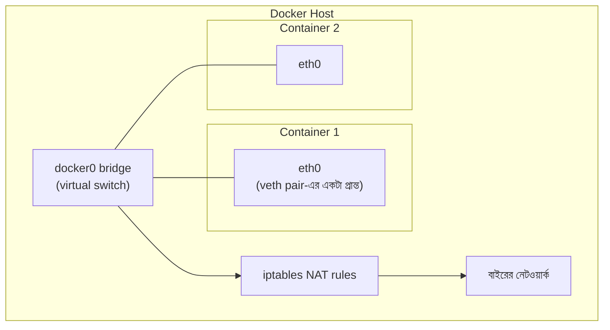

# Module 19 — Linux, Containers ও Docker

> **Phase F — Infrastructure ও DevOps** | পূর্বশর্ত: M04, M07, M16
> পরের module: M20 (Kubernetes in Production)

---

## ১. যে container-টা "মেমরি leak" করছিল, কিন্তু আসলে করছিল না

M04-এ আমরা `gc.freeze()` আর memory fragmentation নিয়ে বিস্তারিত আলোচনা করেছিলাম Gunicorn worker-এর প্রেক্ষাপটে। একটা টিম M04-এর সব সঠিক optimization প্রয়োগ করার পরও একটা নতুন সমস্যায় পড়ল — production-এ Docker container-গুলো **নিয়মিতভাবে OOMKilled** হচ্ছিল, প্রতিটা container-এর memory limit ছিল ১ GB, আর Django app নিজে (M04-এর সব fragmentation fix সহ) কখনো ৪০০ MB-র বেশি ব্যবহার করত না — অথচ `kubectl top pod` দেখাচ্ছিল memory usage ৯৫০ MB, ৯৯৯ MB, তারপর kill।

তদন্তে দেখা গেল সমস্যাটা Python বা Django-তে না — এটা ছিল **container memory accounting**-এর একটা মৌলিক ভুল বোঝাবুঝি। তাদের Dockerfile-এ:

```dockerfile
# ❌ সমস্যাযুক্ত base image ব্যবহার
FROM python:3.12
```

`python:3.12` (slim না, alpine না) base image একটা পূর্ণ Debian OS-এর সাথে আসে — কিন্তু আসল সমস্যা ছিল ভিন্ন: তাদের application container-এর ভেতরে একটা `tmpfs`-ভিত্তিক log buffer ব্যবহার করছিল (অ্যাপ্লিকেশন লাইব্রেরির একটা ডিফল্ট আচরণ), যেটা **RAM-এর মধ্যে ফাইল সিস্টেম হিসেবে গণনা হয়**, কিন্তু কোনো log rotation policy ছিল না। ধীরে ধীরে log buffer বাড়তে থাকল, container-এর মোট memory usage-এ যোগ হতে থাকল — Python heap-এ না, কিন্তু cgroup-এর memory accounting-এ **হ্যাঁ**।

এই ঘটনাটা এই module-এর কেন্দ্রীয় থিম প্রতিষ্ঠা করে: **container একটা process না, এটা একটা isolation boundary যার নিজস্ব accounting rule আছে**, এবং সেই rule না জানলে "Python memory leak" খোঁজা সময় নষ্ট — সমস্যা সম্পূর্ণ ভিন্ন layer-এ থাকতে পারে।

---

## ২. Production Linux Skill — Container-এর নিচের ভিত্তি

### ২.১ Process, Signal, এবং Graceful Shutdown — M02/M11-এর সম্পূর্ণ ভিত্তি

M02 §৭-এ আমরা `preStop: sleep 15` এবং Gunicorn `graceful_timeout` দেখেছিলাম deploy-এ 502 এড়াতে। এখন এর OS-level ভিত্তি:

```bash
# একটা প্রসেসের signal handling দেখুন
kill -l   # সব signal-এর তালিকা

# SIGTERM — "দয়া করে বন্ধ হও" (catchable, graceful shutdown-এর সুযোগ দেয়)
kill -SIGTERM <pid>

# SIGKILL — "এখনই মরো" (uncatchable, কোনো cleanup সুযোগ নেই)
kill -SIGKILL <pid>   # M11-এর OOM kill ঠিক এভাবেই ঘটে
```

```python
# gunicorn-এর signal handling — M02-এর graceful_timeout-এর নিচের মেকানিজম
import signal

def handle_sigterm(signum, frame):
    logger.info("sigterm_received, শুরু হচ্ছে graceful shutdown")
    # চলমান request শেষ করার সুযোগ, নতুন request নেওয়া বন্ধ
    stop_accepting_new_requests()

signal.signal(signal.SIGTERM, handle_sigterm)
```

**Docker/Kubernetes-এ signal propagation-এর একটা সূক্ষ্ম কিন্তু গুরুত্বপূর্ণ ফাঁদ:**

```dockerfile
# ❌ shell form — Docker SIGTERM পাঠায় shell-কে, Python process-কে না!
CMD gunicorn myapp.wsgi

# ✅ exec form — SIGTERM সরাসরি Python process পায়
CMD ["gunicorn", "myapp.wsgi"]
```

`CMD gunicorn myapp.wsgi` (shell form) আসলে `/bin/sh -c "gunicorn myapp.wsgi"` চালায় — shell PID 1 হয়ে যায়, Gunicorn একটা child process। Docker/Kubernetes SIGTERM পাঠায় PID 1-কে (shell-কে), কিন্তু shell সেটা **child process-এ forward করে না ডিফল্টে** — ফলে Gunicorn কখনো SIGTERM পায়ই না, M02-এর graceful shutdown logic কখনো ট্রিগার হয় না, আর `terminationGracePeriodSeconds` শেষ হয়ে সরাসরি SIGKILL আসে। এটাই deploy-এ 502 আর abrupt connection drop-এর একটা সাধারণ, চেনা-না-পড়া কারণ।

> **Senior Tip:** "আমাদের graceful shutdown code (M02) আছে কিন্তু deploy-এ এখনো abrupt connection drop হচ্ছে" — "প্রথম চেক করব Dockerfile-এর `CMD`/`ENTRYPOINT` shell form নাকি exec form। এই একটা bracket syntax পার্থক্য (`CMD app` বনাম `CMD ["app"]`) পুরো graceful shutdown chain-কে অকেজো করে দিতে পারে, এবং এটা এমন একটা bug যা কোড review-তে সহজে miss হয় কারণ দুইটাই 'কাজ করে' মনে হয় স্বাভাবিক অবস্থায়।"

### ২.২ `ulimit` — Resource সীমা যা M02-এর ephemeral port সমস্যার সাথে সংযুক্ত

```bash
ulimit -n          # খোলা file descriptor-এর সর্বোচ্চ সংখ্যা (ডিফল্ট প্রায়ই 1024)
ulimit -n 65536     # বাড়ানো — উচ্চ-concurrency application-এ প্রয়োজনীয়
```

**M02-এর TCP connection আলোচনার সরাসরি সংযোগ:** প্রতিটা TCP connection একটা file descriptor খরচ করে। যদি M02-এর ephemeral port exhaustion সমস্যা সমাধান করার পরও (connection pooling সঠিকভাবে) `Too many open files` error আসে, এটা `ulimit -n`-এর সীমা — উচ্চ-concurrency Gunicorn/Celery worker (M11-এর `gevent` pool, হাজার হাজার concurrent connection) এই ডিফল্ট সীমা সহজেই ছাড়িয়ে যায়।

```dockerfile
# Docker container-এর ভেতরে ulimit সেট করা
FROM python:3.12-slim
# runtime-এ: docker run --ulimit nofile=65536:65536 ...
```

### ২.৩ OOM Killer — কীভাবে সিদ্ধান্ত নেয় কাকে মারবে

```bash
cat /proc/<pid>/oom_score        # বর্তমান OOM score — বেশি স্কোর = আগে মরার সম্ভাবনা
cat /proc/<pid>/oom_score_adj    # ম্যানুয়াল adjustment (-1000 থেকে +1000)
```

**Kernel-level OOM killer** (M04-এর application-level memory আলোচনার থেকে ভিন্ন স্তর) তখন ট্রিগার হয় যখন system-wide (বা cgroup-wide, container-এর প্রেক্ষাপটে) memory শেষ হয়ে যায়। এটা একটা heuristic scoring দিয়ে সিদ্ধান্ত নেয় কোন process মারবে — সাধারণত যেটা সবচেয়ে বেশি memory ব্যবহার করছে এবং সবচেয়ে কম "গুরুত্বপূর্ণ" (`oom_score_adj` দিয়ে প্রভাবিত করা যায়)।

**Container-এর প্রেক্ষাপটে — §১-এর ঘটনার মূল প্রক্রিয়া:**

```
Kubernetes pod-এ একটা memory limit (M20-এ বিস্তারিত) → এটা একটা cgroup
memory limit হিসেবে বাস্তবায়িত হয় → cgroup-এর মধ্যে মোট memory usage
(Python heap + tmpfs + shared library + সবকিছু) limit ছাড়ালে →
kernel সেই cgroup-এর মধ্যে একটা process মারে (সাধারণত container-এর
main process, PID 1) → container "OOMKilled" status পায়
```

§১-এর ঘটনায় Python heap ৪০০ MB-ই ছিল, কিন্তু cgroup-এর **মোট** memory accounting (tmpfs log buffer সহ) ১ GB সীমা ছাড়িয়ে যাচ্ছিল — Python-এর দৃষ্টিতে কোনো leak ছিল না, কিন্তু cgroup-এর দৃষ্টিতে সীমা লঙ্ঘিত হচ্ছিল।

```bash
# Container-এর ভেতরে থেকে actual cgroup memory usage দেখা (M04-এর RSS-এর থেকে ভিন্ন, বেশি সম্পূর্ণ)
cat /sys/fs/cgroup/memory.current    # cgroup v2
cat /sys/fs/cgroup/memory.stat       # breakdown — কোথায় memory যাচ্ছে
```

> **Senior Tip:** "Container OOMKilled হচ্ছে কিন্তু application-level profiling (M04-এর `py-spy`, `memray`) কোনো leak দেখাচ্ছে না" — "এটা একটা সংকেত যে সমস্যা application heap-এর বাইরে — `cat /sys/fs/cgroup/memory.stat` দিয়ে cgroup-level breakdown দেখব: `tmpfs`, `page cache`, `kernel memory` কতটা নিচ্ছে। M04-এর profiling টুল শুধু Python heap দেখায়, কিন্তু cgroup accounting-এ **সবকিছু** ধরা পড়ে — file cache, log buffer, shared memory। এই layer পার্থক্যটা বোঝা অনেক বিভ্রান্তিকর debugging session বাঁচায়।"

### ২.৪ `systemd` ও `journald` — সংক্ষিপ্ত, Container প্রেক্ষাপটে

Container-নেটিভ deployment-এ (Kubernetes) `systemd` সরাসরি প্রাসঙ্গিক কম (container নিজে init system না), কিন্তু **node-level** সার্ভিস (kubelet, docker daemon নিজে) systemd দিয়ে পরিচালিত হয়:

```bash
systemctl status kubelet
journalctl -u kubelet -f    # node-level সমস্যা ডিবাগ করতে (M20-এ ফিরে আসবে)
```

Non-container VM deployment-এ (যেগুলো এখনো অনেক legacy/traditional infrastructure-এ আছে), Gunicorn নিজেই একটা systemd service হিসেবে চলে:

```ini
# /etc/systemd/system/gunicorn.service
[Service]
ExecStart=/path/to/gunicorn myapp.wsgi
Restart=always                    # ⚠️ crash হলে auto-restart, M16-এর resilience-এর OS-level সংস্করণ
RestartSec=3
LimitNOFILE=65536                 # §২.২-এর ulimit, systemd-এর মাধ্যমে সেট
```

---

## ৩. Docker Image — Layer, Cache, এবং Build Optimization

### ৩.১ Layer কীভাবে কাজ করে

```dockerfile
FROM python:3.12-slim          # Layer 1
COPY requirements.txt .        # Layer 2
RUN pip install -r requirements.txt --break-system-packages   # Layer 3 (M-এর pip নীতি)
COPY . .                       # Layer 4
CMD ["gunicorn", "myapp.wsgi"] # metadata, নতুন layer না
```

প্রতিটা Dockerfile instruction (`FROM`, `COPY`, `RUN`) একটা নতুন, **immutable layer** তৈরি করে — M07-এর PostgreSQL immutable tuple version-এর (MVCC) ধারণাগত সাদৃশ্য, ভিন্ন context-এ। একটা layer কখনো "modify" হয় না, নতুন layer আগেরটার উপর stack হয়।

### ৩.২ Build Cache — কেন Instruction-এর ক্রম গুরুত্বপূর্ণ

```dockerfile
# ❌ প্রতিটা code change-এ pip install পুনরায় চলবে — ধীর
FROM python:3.12-slim
COPY . .                                            # কোড বদলালেই এই layer invalid
RUN pip install -r requirements.txt --break-system-packages   # এটাও পুনরায় চলবে!

# ✅ dependency আলাদা layer-এ, শুধু requirements.txt বদলালে reinstall
FROM python:3.12-slim
COPY requirements.txt .
RUN pip install -r requirements.txt --break-system-packages    # code বদলালে এই layer cached থাকে
COPY . .                                             # শুধু এই layer পুনরায় build হয়
```

**মূল নিয়ম:** Docker layer cache প্রতিটা instruction-এর জন্য একটা hash রাখে — যদি instruction এবং তার input (আগের layer + এই instruction-এর content) অপরিবর্তিত থাকে, cached layer পুনর্ব্যবহার হয়। **যে জিনিস কম বদলায় তা আগে রাখুন**, যা বেশি বদলায় (application code) তা শেষে — M07-এর index column ordering নীতির (leftmost prefix) মতোই, ক্রম-নির্ভর optimization।

### ৩.৩ Multi-Stage Build — Production Image ছোট রাখা

```dockerfile
# Stage 1 — build dependencies (compiler, dev headers প্রয়োজন)
FROM python:3.12-slim AS builder
RUN apt-get update && apt-get install -y gcc libpq-dev
COPY requirements.txt .
RUN pip install --user -r requirements.txt --break-system-packages

# Stage 2 — শুধু runtime, builder-এর কোনো dev tool নেই
FROM python:3.12-slim
COPY --from=builder /root/.local /root/.local     # শুধু installed package, gcc না
COPY . /app
WORKDIR /app
ENV PATH=/root/.local/bin:$PATH
CMD ["gunicorn", "myapp.wsgi"]
```

**কেন গুরুত্বপূর্ণ:** `gcc`, `libpq-dev` (build-time dependency, psycopg2 compile করতে দরকার) production image-এ থাকার কোনো দরকার নেই — এগুলো image size বাড়ায় (M02-এর network transfer, deploy latency-তে প্রভাব) এবং **attack surface বাড়ায়** (M26-এ security-তে ফিরে আসবে, প্রতিটা extra binary একটা potential vulnerability)। Multi-stage build শুধু প্রয়োজনীয় artifact (installed Python package) কপি করে, build tooling ফেলে দেয়।

```bash
# Image size তুলনা — বাস্তব প্রভাব
docker images
# myapp:single-stage    1.2 GB
# myapp:multi-stage     280 MB    ← ~৪× ছোট
```

### ৩.৪ `.dockerignore` — Build Context Bloat প্রতিরোধ

```
# .dockerignore
.git
__pycache__
*.pyc
.env
node_modules
tests/
```

`.dockerignore` ছাড়া `COPY . .` পুরো directory (including `.git` history, local `.env` secret files, M04-এর `__pycache__`) Docker build context-এ পাঠায় — শুধু build ধীর হয় না (M02-এর network transfer নীতি প্রযোজ্য এখানেও, বড় build context মানে বেশি data transfer to Docker daemon), এটা **secret leak**-এর ঝুঁকিও তৈরি করে (local `.env` file ভুলবশত image layer-এ ঢুকে যাওয়া)।

---

## ৪. Non-Root User — Container Security-র প্রথম স্তর

```dockerfile
FROM python:3.12-slim
RUN groupadd -r appuser && useradd -r -g appuser appuser
COPY --chown=appuser:appuser . /app
USER appuser                    # ⚠️ এই লাইনের পরের সব instruction non-root হিসেবে চলে
WORKDIR /app
CMD ["gunicorn", "myapp.wsgi"]
```

**কেন গুরুত্বপূর্ণ:** ডিফল্টে, একটা Docker container root হিসেবে চলে (কোনো `USER` instruction না থাকলে)। যদি application-এ একটা vulnerability থাকে যা attacker-কে container-এর ভেতরে code execution দেয় (M26-এ সম্পূর্ণ বিস্তারিত, কিন্তু এখানে awareness হিসেবে), root হিসেবে চলা container-এ সেই attacker-এর অনেক বেশি ক্ষমতা থাকে — এবং কিছু container escape vulnerability (kernel-level bug) root privilege-এর উপর নির্ভর করে host-এ প্রভাব ফেলতে।

> **Senior Tip:** "Non-root user সব container-এ বাধ্যতামূলক করা উচিত?" — "হ্যাঁ, এটা M26-এর 'defense in depth' নীতির একটা সহজ, কম-খরচের প্রয়োগ — এটা একটা vulnerability-কে সম্পূর্ণ প্রতিরোধ করে না, কিন্তু একটা successful exploit-এর **blast radius কমায় (M16-এর bulkhead ধারণার security সংস্করণ)। কিছু ব্যতিক্রম আছে (port 80/443-এর মতো privileged port bind করতে root দরকার হতে পারে container-এর ভেতরে, যদিও Kubernetes-এ সাধারণত এটা এড়ানো যায় Service-level port mapping দিয়ে), কিন্তু ডিফল্ট policy সবসময় non-root হওয়া উচিত।"

---

## ৫. Docker Networking Internals

### ৫.১ Bridge Network — ডিফল্ট মেকানিজম



**মূল ধারণা:** প্রতিটা container একটা **veth pair** (virtual ethernet cable-এর দুই প্রান্ত) দিয়ে `docker0` নামের একটা virtual bridge-এর সাথে সংযুক্ত। এটা M02-এর physical network switch-এর ধারণাগত সমতুল্য, কিন্তু সম্পূর্ণ software-এ বাস্তবায়িত — একটা container থেকে আরেকটায় packet পাঠানো মানে এই virtual bridge দিয়ে route হওয়া, kernel-level এ, কোনো physical NIC ছোঁয়া ছাড়াই একই host-এর container-দের মধ্যে।

### ৫.২ Port Mapping — `iptables` NAT

```bash
docker run -p 8000:8000 myapp
```

এই command **iptables NAT rule** তৈরি করে — host-এর `8000` পোর্টে আসা traffic container-এর `8000` পোর্টে redirect হয় (M02-এর NAT ধারণার সরাসরি প্রয়োগ, cloud provider-এর VPC NAT gateway-র মতোই মূলনীতি, ভিন্ন স্কেলে)।

```bash
# Docker-এর তৈরি করা actual iptables rule দেখা
sudo iptables -t nat -L DOCKER
```

### ৫.৩ Container-থেকে-Container Communication — DNS-based Discovery

```yaml
# docker-compose.yml
services:
  web:
    build: .
    depends_on: [db, redis]
  db:
    image: postgres:16
  redis:
    image: redis:7
```

```python
# web container-এর ভেতর থেকে — service নাম দিয়েই resolve হয়
DATABASES = {"default": {"HOST": "db", ...}}   # "db" — কোনো hardcoded IP না
```

Docker Compose (এবং Kubernetes, M20-এ বিস্তারিত) একটা **internal DNS** সরবরাহ করে যেখানে service নাম দিয়ে IP resolve করা যায় — M02 §৬-এর DNS internals এখানে container networking-এর প্রেক্ষাপটে প্রয়োগ হচ্ছে। এটাই সেই মেকানিজম যা M02 §৬.১-এর `ndots:5`/Kubernetes DNS সমস্যার ভিত্তি তৈরি করে — container/pod নেটওয়ার্কে হোস্টনেম resolution সবসময় এই internal DNS দিয়ে যায়, external hostname resolve করতে গেলেই M02-এর সমস্যাগুলো প্রাসঙ্গিক হয়ে ওঠে।

> **Senior Tip:** "Container-এর মধ্যে network latency নিয়ে চিন্তা করা উচিত?" — "একই host-এর ভেতরে container-থেকে-container communication (bridge network দিয়ে) অত্যন্ত দ্রুত — physical network stack ছোঁয় না, প্রায় in-memory operation-এর কাছাকাছি। প্রকৃত latency উদ্বেগ শুরু হয় multi-host (Kubernetes cluster-এর একাধিক node) communication-এ, যেখানে M02-এর সব physical network নীতি (RTT, TCP handshake) প্রযোজ্য হয়ে ওঠে — M20-এ pod-to-pod cross-node communication-এ এটা বিস্তারিত হবে।"

---

## ৬. Volume ও Bind Mount — Persistence Beyond Container Lifecycle

```bash
# Bind mount — host-এর একটা নির্দিষ্ট path container-এ map করা (dev-এ common)
docker run -v /host/path:/app/data myapp

# Named volume — Docker-managed storage, host path সরাসরি জানার দরকার নেই (production-এ পছন্দনীয়)
docker run -v mydata:/app/data myapp
```

**মূল ধারণা:** container filesystem **ephemeral** — container বন্ধ/মুছে গেলে তার সব ভেতরের পরিবর্তন হারিয়ে যায় (M07-এর UNLOGGED table-এর ধারণাগত সাদৃশ্য, কিন্তু এখানে পুরো filesystem-এ)। Volume এই ephemeral nature-এর বাইরে data রাখার mechanism — কিন্তু M08-এর মূল নীতি এখানেও প্রযোজ্য: **stateful data (PostgreSQL data directory) কখনো container-এর ভেতরে রাখা উচিত না**, সবসময় একটা volume-এ, যাতে container recreate/redeploy হলেও data অক্ষত থাকে।

```yaml
services:
  db:
    image: postgres:16
    volumes:
      - pgdata:/var/lib/postgresql/data   # ⚠️ এই volume ছাড়া container restart-এ সব data হারাবে
volumes:
  pgdata:
```

> **Senior Tip:** "Production-এ database container চালানো কি ঠিক আছে?" — "Volume সঠিকভাবে configured থাকলে data persistence সমস্যা না, কিন্তু আমি সাধারণত production-এ managed database service (M08-এর RDS/Cloud SQL, M21-এ বিস্তারিত) পছন্দ করি self-hosted containerized PostgreSQL-এর বদলে — কারণ M08-এর সব operational জটিলতা (backup, PITR, failover, Patroni configuration) managed service নিজে handle করে। Self-hosted container database সাধারণত dev/staging environment-এর জন্য উপযুক্ত, production-এর জন্য না, যদি না টিমের নিজস্ব database operations-এ গভীর expertise থাকে।"

---

## ৭. Healthcheck — M16-এর Circuit Breaker-এর Container-level সংস্করণ

```dockerfile
HEALTHCHECK --interval=30s --timeout=3s --start-period=10s --retries=3 \
    CMD curl -f http://localhost:8000/health/ || exit 1
```

```python
# views.py — একটা ভালো healthcheck কী চেক করা উচিত
def health_check(request):
    checks = {}
    try:
        connection.cursor().execute("SELECT 1")   # DB সংযোগ যাচাই (M07)
        checks["database"] = "ok"
    except Exception:
        checks["database"] = "failed"

    try:
        cache.get("healthcheck")   # Redis সংযোগ যাচাই (M10)
        checks["cache"] = "ok"
    except Exception:
        checks["cache"] = "degraded"   # ⚠️ M10 §১২-এর fail-open নীতি —
                                          # cache down হলে pod মেরে ফেলা overreaction হতে পারে

    healthy = checks["database"] == "ok"   # শুধু critical dependency দিয়ে সিদ্ধান্ত
    return JsonResponse(checks, status=200 if healthy else 503)
```

**M10 §১২-এর fail-open/fail-closed নীতির সরাসরি প্রয়োগ healthcheck ডিজাইনে:** একটা naive healthcheck যা **সব** dependency (DB, Redis, external API) "ok" চাইবে সেটা M16-এর cascading failure-এর একটা নতুন উৎস তৈরি করতে পারে — যদি Redis সাময়িকভাবে ধীর হয় (M31-এর ঘটনার মতো), আর healthcheck সেটাকে "unhealthy" ধরে, Kubernetes সব pod restart করা শুরু করবে (M02 §৬-এর "restart আরও worse করল" প্যাটার্নের পুনরাবৃত্তি) — এমনকি যদি pod নিজে perfectly fine থাকে সব **critical** কাজের জন্য।

> **Senior Tip:** "Healthcheck-এ কোন dependency চেক করা উচিত?" — "শুধু সেগুলো যেগুলো ছাড়া pod সত্যিই কোনো traffic serve করতে পারবে না (M31-এর payment API-তে PostgreSQL — এটা ছাড়া কিছুই কাজ করবে না)। Non-critical, degradable dependency (M10-এর Redis cache, যেখানে M10 §১২-এর `IGNORE_EXCEPTIONS=True` দিয়ে fail-open আচরণ ইতিমধ্যে কোড-লেভেলে আছে) healthcheck-এ 'failed' হিসেবে গণ্য করা উচিত না — নাহলে আমরা একটা optional dependency-র সমস্যাকে জোর করে একটা mandatory outage বানিয়ে ফেলছি restart loop দিয়ে।"

---

## ৮. Resource Limit ও cgroups — §১-এর ঘটনার সম্পূর্ণ সমাধান

```yaml
# docker-compose.yml বা Kubernetes-এ resource limit
services:
  web:
    deploy:
      resources:
        limits:
          cpus: "1.0"
          memory: 1G
        reservations:
          cpus: "0.5"
          memory: 512M
```

**cgroups (control groups)** হলো Linux kernel-এর মেকানিজম যা resource limit enforce করে — Docker/Kubernetes এই একই kernel feature ব্যবহার করে (M04-এ `gc.freeze()`-এর প্রেক্ষাপটে copy-on-write আলোচনায় cgroup উল্লেখ হয়েছিল fork()-এর context-এ, এখন সম্পূর্ণ প্রেক্ষাপট)।

```bash
# CPU limit-এর প্রভাব — CPU throttling
cat /sys/fs/cgroup/cpu.stat
# nr_throttled: কতবার CPU limit ছোঁয়ায় process থ্রটল হয়েছে
# throttled_usec: মোট কত সময় থ্রটল অবস্থায় ছিল
```

**M04-এর `WEB_CONCURRENCY` সতর্কতার সম্পূর্ণ প্রেক্ষাপট:** M04 §৫.২-এ আমরা সতর্ক করেছিলাম `multiprocessing.cpu_count()` container-এর node-level CPU দেখায়, cgroup limit না। এখন এর কারণ স্পষ্ট — `cpu_count()` `/proc/cpuinfo` পড়ে (host-level তথ্য), কিন্তু cgroup limit একটা সম্পূর্ণ আলাদা mechanism (`cpu.max` file) যা kernel enforce করে কিন্তু `cpu_count()`-এ প্রতিফলিত হয় না পুরনো Python ভার্সনে। ফলাফল: একটা pod ০.৫ CPU limit নিয়ে ৬৪টা worker spawn করতে পারে (node-এর ৬৪ core দেখে), তারপর সব worker CPU-র জন্য প্রতিযোগিতা করবে যেটা আসলে ০.৫ core-এই সীমাবদ্ধ — massive throttling, `nr_throttled` আকাশছোঁয়া।

**Memory limit — §১-এর ঘটনার সম্পূর্ণ প্রেক্ষাপট:**

```
Memory limit = cgroup memory.max
এই সীমা ছাড়ালে → kernel OOM killer সেই cgroup-এর মধ্যে trigger হয়
→ যেটা measure হয় তা Python heap না, পুরো cgroup-এর সব memory usage:
  - Python process RSS
  - tmpfs (§১-এর ঘটনার আসল কারণ)
  - shared library
  - page cache (কিছু ক্ষেত্রে, cgroup v1 বনাম v2-তে accounting আলাদা)
```

> **Senior Tip:** "কীভাবে সঠিক memory limit ঠিক করবেন একটা container-এ?" — "M31-এর capacity estimation নীতি এখানে প্রয়োগ করব — শুধু 'মনে হচ্ছে যথেষ্ট' না, actual measurement দিয়ে। Load test চালিয়ে (M23-এ বিস্তারিত) `docker stats` বা cgroup `memory.current` দিয়ে peak usage মাপব, তারপর একটা safety margin (~30-50%) যোগ করব — কারণ traffic spike বা GC timing-এর কারণে momentary peak average-এর চেয়ে অনেক বেশি হতে পারে (M04-এর GC behavior)। আর `requests` (guaranteed minimum) আর `limits` (hard maximum, M20-এ পূর্ণ বিস্তারিত) আলাদা রাখা গুরুত্বপূর্ণ — খুব tight limit দিলে normal GC pause-ও OOMKill trigger করতে পারে।"

---

## ৯. Image Vulnerability Scanning — M26-এর প্রস্তুতি

```bash
# Trivy দিয়ে image scan (CI pipeline-এ, M22-এ বিস্তারিত)
trivy image myapp:latest

# আউটপুট — known CVE, severity, fixed version আছে কি না
```

**M09/M17-এর base image নির্বাচনের নিরাপত্তা প্রেক্ষাপট:** `python:3.12` (full) বনাম `python:3.12-slim` বনাম `python:3.12-alpine` — প্রতিটার আলাদা attack surface। `slim` বেশিরভাগ dev tool বাদ দেয় (§৩.৩-এর multi-stage build নীতির সাথে সংযুক্ত), `alpine` আরও ছোট কিন্তু `musl libc` ব্যবহার করে (glibc না) যেটা কখনো কখনো compiled Python package-এর সাথে compatibility সমস্যা তৈরি করে — একটা trade-off যা প্রতিটা টিমকে নিজের dependency-র ভিত্তিতে যাচাই করতে হয়।

> **Senior Tip:** এই বিষয়টা M26-এ security engineering-এ সম্পূর্ণ বিস্তারিত হবে, কিন্তু এখানে একটা early principle: "CI pipeline-এ image scanning একটা non-negotiable gate হওয়া উচিত, M22-এর 'supply chain security' নীতির অংশ — একটা vulnerable base image বা dependency দিয়ে build হওয়া image কখনো production-এ deploy হওয়া উচিত না automated scan pass না করে।"

---

## ১০. Interview Section

### প্রশ্ন ১ (Senior) — "একটা Docker container OOMKilled হচ্ছে, কিন্তু application profiling কোনো memory leak দেখাচ্ছে না। কী পরীক্ষা করবেন?"

**🌟 Senior/Staff Answer**
> "এটা একটা signal যে সমস্যা application heap-এর বাইরে — cgroup memory accounting সব ধরনের memory usage ধরে, শুধু Python heap (M04-এর profiling টুল যা দেখায়) না। আমি ধাপে ধাপে যাচাই করব:
>
> প্রথমত, `cat /sys/fs/cgroup/memory.stat` দিয়ে breakdown দেখব — কতটা `anon` (application memory, M04-এর profiling-এর সাথে মিলবে), কতটা `file` (page cache), কতটা `tmpfs`। যদি `tmpfs` বা `file` উল্লেখযোগ্যভাবে বড় হয়, সমস্যা সেখানে — একটা log buffer, একটা temp file directory যা clean হচ্ছে না, বা কোনো library যা RAM-এ ফাইল ক্যাশ করছে অসীমভাবে।
>
> দ্বিতীয়ত, container-এর ভেতরে `df -h /tmp` (বা যেকোনো tmpfs mount) দিয়ে চেক করব সেটা বাড়ছে কি না সময়ের সাথে।
>
> তৃতীয়ত, container base image আর dependency-তে কোনো known 'memory-hungry cache' behavior আছে কি না দেখব — কিছু logging library, কিছু ML framework ডিফল্টে aggressive in-memory caching করে যা container limit-এর সাথে খাপ খায় না।
>
> মূল শিক্ষা: application-level profiling (`py-spy`, `memray`, M04) এবং container-level accounting (cgroup) দুইটা **ভিন্ন layer**, ভিন্ন জিনিস মাপে। প্রথমটা 'clean' দেখানো মানে দ্বিতীয়টাও clean তা না — দুইটাই চেক করতে হয় একটা container memory সমস্যায়।"

---

### প্রশ্ন ২ (Staff / Production Incident) — "একটা deploy-এর পর, pod-গুলো graceful shutdown না করে সরাসরি sudden connection drop করছে, যদিও আমাদের কোডে proper SIGTERM handler আছে (M02-এর pattern)। কেন?"

**🌟 Senior/Staff Answer**
> "কোডে সঠিক SIGTERM handler থাকা সত্ত্বেও এই সমস্যা হলে, আমি সন্দেহ করব সিগন্যাল **কখনো handler পর্যন্ত পৌঁছাচ্ছেই না** — যেটা M19 §২.১-এর একটা সাধারণ, সূক্ষ্ম ফাঁদ: Dockerfile-এর `CMD`/`ENTRYPOINT` shell form ব্যবহার করা হয়েছে কি না।
>
> ```dockerfile
> CMD gunicorn myapp.wsgi          # shell form — সমস্যাযুক্ত
> CMD ["gunicorn", "myapp.wsgi"]   # exec form — সঠিক
> ```
>
> Shell form-এ, Docker আসলে `/bin/sh -c "gunicorn myapp.wsgi"` চালায় — shell নিজে PID 1 হয়ে যায়, Gunicorn তার child। Kubernetes/Docker SIGTERM পাঠায় PID 1-কে, কিন্তু বেশিরভাগ shell **automatically child process-এ signal forward করে না** — Gunicorn কখনো SIGTERM পায়ই না, তার M02-এর graceful shutdown logic কখনো চলে না, আর `terminationGracePeriodSeconds` শেষ হয়ে সরাসরি SIGKILL আসে যেটা কোনো cleanup ছাড়াই connection বন্ধ করে দেয়।
>
> **আমার প্রথম চেক:** Dockerfile দেখা, `CMD`/`ENTRYPOINT` exec form (JSON array syntax) কি না নিশ্চিত করা। যদি shell form থেকে থাকে, সেটাই root cause এবং fix সহজ — bracket syntax-এ পরিবর্তন।
>
> **দ্বিতীয় সম্ভাব্য কারণ (যদি প্রথমটা না হয়):** কিছু process manager বা entrypoint script (যেমন একটা bash wrapper script যা `exec` ছাড়া child চালায়) একই সমস্যা তৈরি করতে পারে। নিয়ম: PID 1-কে সবসময় আসল application process হতে হবে, অথবা একটা proper init system (`tini`, `dumb-init`) ব্যবহার করতে হবে যা signal forwarding সঠিকভাবে করে।"

---

### প্রশ্ন ৩ (Coding / Debugging) — "এই Dockerfile-এ কী কী সমস্যা আছে?"

```dockerfile
FROM python:3.12
COPY . .
RUN pip install -r requirements.txt
CMD python manage.py runserver 0.0.0.0:8000
```

**🌟 Senior Answer**
> "এই Dockerfile-এ পাঁচটা সমস্যা, গুরুত্ব অনুযায়ী:
>
> **১. `python manage.py runserver` production-এ কখনো না।** এটা Django-র development server — single-threaded, না security-hardened, না performance-optimized। Production-এ Gunicorn (M02-এর pattern) দরকার।
>
> **২. Shell form CMD — M19 §২.১-এর signal handling সমস্যা।** SIGTERM কখনো application-এ পৌঁছাবে না, graceful shutdown ভেঙে যাবে।
>
> **৩. `COPY . .` আগে, `pip install` পরে — build cache নষ্ট।** M19 §৩.২-এর নীতি অনুযায়ী, প্রতিটা code change-এ পুরো dependency reinstall হবে, build সময় অনেক বেশি লাগবে অপ্রয়োজনীয়ভাবে।
>
> **৪. Full `python:3.12` base image, `slim`/multi-stage না।** Image size অনেক বড় হবে, attack surface বেশি (M19 §৯-এর security প্রেক্ষাপট)।
>
> **৫. `USER` instruction নেই — root হিসেবে চলছে।** M19 §৪-এর security নীতি লঙ্ঘন।
>
> সংশোধিত সংস্করণ:
> ```dockerfile
> FROM python:3.12-slim AS builder
> RUN apt-get update && apt-get install -y gcc libpq-dev
> COPY requirements.txt .
> RUN pip install --user -r requirements.txt --break-system-packages
>
> FROM python:3.12-slim
> RUN groupadd -r appuser && useradd -r -g appuser appuser
> COPY --from=builder /root/.local /root/.local
> COPY --chown=appuser:appuser . /app
> USER appuser
> WORKDIR /app
> ENV PATH=/root/.local/bin:$PATH
> HEALTHCHECK --interval=30s --timeout=3s CMD curl -f http://localhost:8000/health/ || exit 1
> CMD ["gunicorn", "myapp.wsgi", "--bind", "0.0.0.0:8000"]
> ```
> এই সংস্করণে M19-এর সব pattern প্রয়োগ করা হয়েছে — multi-stage build, layer caching optimization, non-root user, exec form CMD, healthcheck, আর production-grade WSGI server।"

---

### প্রশ্ন ৪ (Architecture Decision) — "আমাদের Kubernetes pod-এ memory limit ছোট রাখব নাকি বড়? Trade-off কী?"

**🌟 Senior/Staff Answer**
> "এটা M31-এর capacity planning নীতির একটা resource-allocation সংস্করণ — সঠিক উত্তর 'ছোট' বা 'বড়' না, measured actual usage-এর ভিত্তিতে একটা informed decision, নিচের trade-off বিবেচনা করে:
>
> **খুব ছোট limit-এর ঝুঁকি:** M19 §১-এর ঘটনার মতো unexpected OOMKill, এমনকি normal GC pause বা momentary traffic spike-এ (M04-এর GC behavior, যেখানে memory ব্যবহার সাময়িকভাবে বাড়তে পারে collection-এর ঠিক আগে)। Repeated OOMKill মানে repeated pod restart, যা M16-এর ঠিক সেই cascading failure pattern তৈরি করতে পারে (restart-এর সময় capacity কমে যাওয়া) যেটা আমরা M02 এবং M16-এ দেখেছি।
>
> **খুব বড় limit-এর ঝুঁকি:** Resource waste — যদি প্রতিটা pod 4GB limit রাখে কিন্তু আসলে 500MB ব্যবহার করে, node-এর capacity অনেক কম pod ধারণ করতে পারবে বাস্তবে দরকারের চেয়ে, cost বেশি (M21-এর FinOps নীতি)। এছাড়া, যদি একটা pod-এ সত্যিই একটা memory leak থাকে, বড় limit মানে সেটা ধরা পড়তে অনেক বেশি সময় লাগবে, এবং তার আগে node-এর অন্য pod-দের memory pressure-এ ফেলতে পারে (noisy neighbor সমস্যা, যেটা M20-এ QoS class আলোচনায় সম্পূর্ণ বিস্তারিত হবে)।
>
> **আমার পদ্ধতি:** লোড টেস্ট (M23) দিয়ে actual peak memory usage measure করা, তারপর ৩০-৫০% margin যোগ করে limit ঠিক করা — অনুমান না করে। এবং `requests` (scheduling-এর জন্য guaranteed) `limits`-এর থেকে কিছুটা কম রাখা, যাতে Kubernetes efficient bin-packing করতে পারে কিন্তু কোনো pod অন্যদের starve না করে। এই সংখ্যাগুলো static না — production traffic pattern বদলালে periodic revisit করা উচিত, M25-এর capacity planning discipline-এর অংশ হিসেবে।"

---

## ১১. হাতে-কলমে অনুশীলন

**১ — Signal propagation পুনরুৎপাদন (২৫ মিনিট)**
দুইটা Dockerfile বানান — একটা shell form CMD, একটা exec form। একটা Python script চালান যা SIGTERM handler print করে। `docker stop` দিয়ে দুইটার আচরণ তুলনা করুন (`docker stop` timeout-এর আগে graceful exit হচ্ছে কি না)।

**২ — Layer caching পরিমাপ (২০ মিনিট)**
দুইটা Dockerfile লিখুন — একটা `COPY . .` আগে, একটা dependency file আলাদা layer-এ পরে। একটা ছোট code change করে দুইবার build করুন, build সময়ের পার্থক্য নোট করুন (`docker build --no-cache` প্রথমবার, তারপর cache সহ)।

**৩ — Memory limit ও OOM পুনরুৎপাদন (৩০ মিনিট)**
একটা Python script লিখুন যা ধীরে ধীরে memory বরাদ্দ করে (একটা growing list)। এটা একটা কম memory limit (যেমন `--memory=100m`) দিয়ে চালান, OOMKilled হতে দেখুন। `docker stats` দিয়ে memory ব্যবহার বাড়তে দেখুন kill হওয়ার আগে।

**৪ — Multi-stage build size তুলনা (২৫ মিনিট)**
একটা Django app-এর জন্য single-stage আর multi-stage Dockerfile বানান (compiled dependency, যেমন psycopg2 সহ)। `docker images` দিয়ে size পার্থক্য পরিমাপ করুন।

---

## ১২. মূল কথা

1. **Container একটা isolation boundary, নিজস্ব accounting rule সহ** — cgroup memory usage Python heap-এর চেয়ে বেশি জিনিস ধরে (tmpfs, page cache), তাই "no leak in profiling" মানে "no container memory problem" না।
2. **Shell form CMD signal forwarding ভেঙে দেয়** — M02-এর graceful shutdown কখনো ট্রিগার হয় না, `CMD ["app"]` (exec form) বাধ্যতামূলক।
3. **Layer cache order-sensitive** — কম-পরিবর্তনশীল instruction (dependency install) আগে, বেশি-পরিবর্তনশীল (application code) পরে।
4. **Multi-stage build production image-কে ৩-৫× ছোট করে** — build tooling (compiler, dev headers) production image-এ থাকে না।
5. **Non-root user একটা সহজ, কম-খরচের security layer** — attack-এর blast radius কমায়, সম্পূর্ণ প্রতিরোধ করে না।
6. **Container networking bridge + veth + iptables NAT দিয়ে বাস্তবায়িত** — M02-এর physical networking নীতির software সংস্করণ, একই host-এর মধ্যে অতি দ্রুত।
7. **Volume ছাড়া container filesystem ephemeral** — stateful data (database) সবসময় volume-এ, container-এর ভেতরে কখনো না।
8. **Healthcheck-এ শুধু truly-critical dependency চেক করুন** — non-critical dependency-র (M10-এর fail-open cache) সমস্যাকে জোর করে mandatory outage বানাবেন না।
9. **cgroup memory/CPU limit `cpu_count()`-এর মতো library call-এ প্রতিফলিত না হতে পারে** — M04-এর `WEB_CONCURRENCY` সতর্কতার মূল কারণ।
10. **Image vulnerability scanning CI-তে non-negotiable gate হওয়া উচিত** — M26/M22-এর supply chain security-র প্রথম স্তর।

---

## পরের Module

**M20 — Kubernetes in Production।** আজ আমরা একটা single container-এর behavior এবং internals বুঝেছি। পরের module-এ আমরা দেখব কীভাবে **হাজার হাজার** container একসাথে orchestrate হয় — Pod, Deployment, StatefulSet-এর পার্থক্য, liveness/readiness/startup probe (এই module-এর healthcheck ধারণার সম্প্রসারণ), resource requests/limits ও QoS class (এই module-এর cgroup আলোচনার cluster-level প্রয়োগ), HPA/KEDA autoscaling, আর deployment strategy (rolling/blue-green/canary) — M02/M08-এর zero-downtime deployment নীতির সম্পূর্ণ, cluster-level বাস্তবায়ন।
