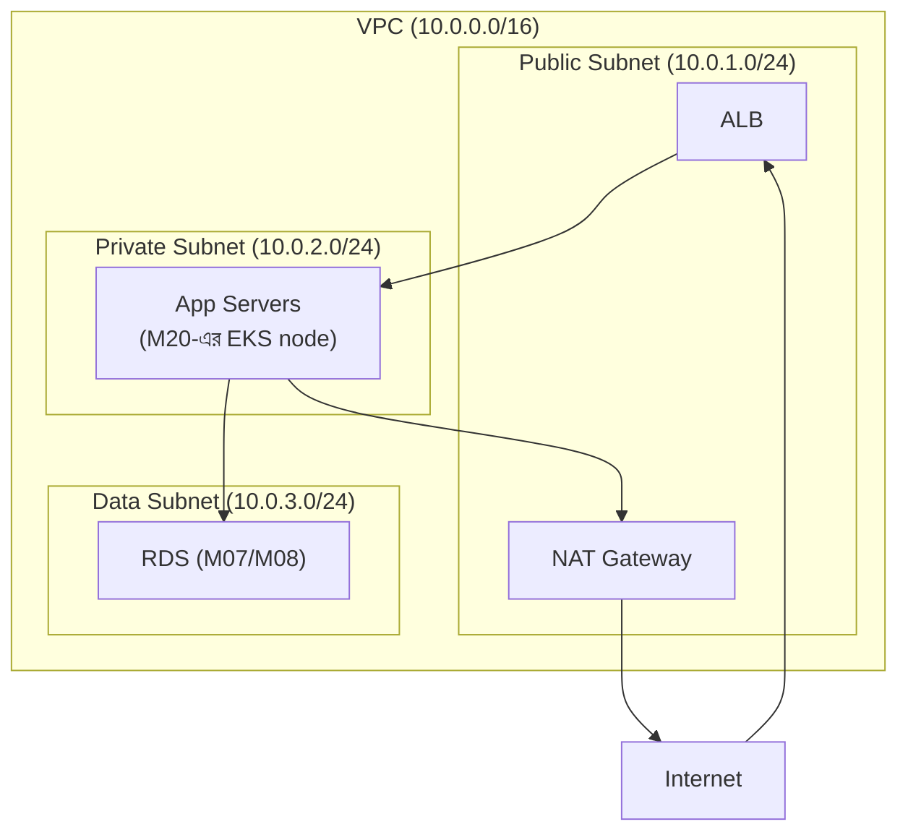

# Module 21 — Cloud ও Infrastructure as Code

> **Phase F — Infrastructure ও DevOps** | পূর্বশর্ত: M19, M20
> পরের module: M22 (CI/CD ও Delivery)

---

## ১. যে Terraform apply-টা production database মুছে ফেলেছিল

একটা টিম staging environment-এর জন্য একটা নতুন RDS instance যোগ করছিল। তাদের Terraform কোড এরকম ছিল:

```hcl
resource "aws_db_instance" "main" {
  identifier = "app-db"
  # ... বাকি কনফিগারেশন
}
```

একজন ডেভেলপার staging-এর জন্য একটা module refactor করলেন, ভুলবশত `identifier` field-এর একটা ছোট পরিবর্তন করলেন (naming convention আপডেট করতে গিয়ে)। `terraform plan` চালালেন — output-এ দেখাল **১টা resource change হবে**। তিনি দ্রুত scroll করে "1 to change" দেখে `terraform apply` চালিয়ে দিলেন, পুরো plan output মনোযোগ দিয়ে না পড়েই।

যা plan output-এ আসলে লেখা ছিল (কিন্তু তিনি খেয়াল করেননি): 

```
# aws_db_instance.main must be replaced
-/+ resource "aws_db_instance" "main" {
      ~ identifier = "app-db" -> "staging-app-db"  # forces replacement
```

**`identifier` field বদলানো Terraform-এর কাছে "নতুন resource তৈরি করে পুরনোটা destroy করো" মানে** — কারণ RDS-এ identifier একটা immutable property। "1 to change" আসলে ছিল "1 to **destroy and recreate**" — এবং এই resource-টা production database ছিল, staging না (module reuse-এর কারণে ভুল environment-এ apply হয়ে গিয়েছিল)।

`terraform apply` চালানোর কয়েক সেকেন্ডের মধ্যে production database **destroy** হতে শুরু করল, নতুন খালি database তৈরি হলো তার জায়গায়। M08-এর সব backup/PITR discipline (যদি সেগুলো সত্যিই নিয়মিত টেস্ট করা থাকত) এখানে জীবন বাঁচিয়েছিল — কিন্তু কয়েক ঘণ্টার downtime এবং একটা অত্যন্ত চাপযুক্ত recovery প্রক্রিয়ার মূল্যে।

এই ঘটনাটা IaC (Infrastructure as Code)-এর একটা মৌলিক সত্য প্রতিষ্ঠা করে: **`terraform apply` একটা কোড deploy করা না, এটা বাস্তব জগতের resource-কে ধ্বংস এবং তৈরি করার ক্ষমতা রাখে** — এবং `plan` output মনোযোগ দিয়ে না পড়া M08-এর "migration review না করে production-এ ALTER TABLE চালানো"-র চেয়েও বিপজ্জনক, কারণ এখানে rollback আরও কঠিন (data একটা destroyed resource-এর সাথে হারিয়ে যায়)।

---

## ২. AWS Core Services — M-জুড়ে যা এতদিন বিমূর্তভাবে উল্লেখ হয়েছে

### ২.১ EC2 বনাম ECS বনাম EKS — Compute-এর তিন স্তর

```
EC2: raw virtual machine — M19-এর সব container/OS জ্ঞান সরাসরি প্রযোজ্য,
     আপনি নিজে সব manage করেন (patching, scaling, orchestration)

ECS: AWS-এর নিজস্ব container orchestration — M20-এর Kubernetes ধারণার
     AWS-native, সরলীকৃত সংস্করণ (Task = Pod-এর ধারণাগত সমতুল্য,
     Service = Deployment-এর সমতুল্য)

EKS: managed Kubernetes — M20-এর সব ধারণা (Pod, Deployment, HPA)
     সরাসরি প্রযোজ্য, কিন্তু control plane AWS পরিচালনা করে
```

| | EC2 | ECS | EKS |
|---|---|---|---|
| Control plane management | আপনার দায়িত্ব | AWS পরিচালনা করে | AWS পরিচালনা করে (managed control plane) |
| Kubernetes ecosystem | প্রযোজ্য না | না | সম্পূর্ণ (M20-এর সব tool: Helm, ArgoCD) |
| Learning curve | কম (traditional VM) | মাঝারি (AWS-নির্দিষ্ট concept) | বেশি (M20-এর সম্পূর্ণ knowledge প্রয়োজন) |
| Vendor lock-in | কম | বেশি (AWS-নির্দিষ্ট API) | কম (Kubernetes portable, M09-এর polyglot নীতির infra সংস্করণ) |
| কখন উপযুক্ত | সরল, single-service workload, বা legacy | AWS-only stack, দ্রুত শুরু, Kubernetes complexity এড়াতে চাইলে | Multi-cloud portability দরকার, বা টিমের Kubernetes expertise আছে |

> **Senior Tip:** "ECS নাকি EKS?" — "এটা M09-এর polyglot persistence checklist-এর একটা compute-level সংস্করণ। ECS কম operational overhead দেয় (M20-এর pure Kubernetes complexity এড়িয়ে), কিন্তু AWS-এ lock-in করে। EKS বেশি জটিল কিন্তু M20-এর পুরো ecosystem (Helm, ArgoCD, standard tooling) এবং multi-cloud portability দেয়। আমি ছোট টিমে, AWS-committed architecture-এ ECS পছন্দ করি (M20-এর জটিলতা ছাড়াই দ্রুত শুরু), কিন্তু বড় টিমে বা multi-cloud strategy থাকলে EKS।"

### ২.২ RDS — M08-এর Managed Database সিদ্ধান্তের Concrete বাস্তবায়ন

```hcl
resource "aws_db_instance" "main" {
  identifier           = "payment-db"   # ⚠️ §১-এর ঘটনার শিক্ষা — immutable, সাবধানে
  engine               = "postgres"
  engine_version       = "16.3"
  instance_class       = "db.r6g.xlarge"
  multi_az             = true            # M08-এর synchronous replica, automatic failover
  backup_retention_period = 30           # M08-এর PITR-এর ভিত্তি
  deletion_protection  = true            # ⚠️ §১-এর ঘটনার প্রতিরোধ!
}
```

**`deletion_protection = true` — §১-এর ঘটনার সরাসরি প্রতিষেধক:** এই একটা flag production database-কে accidental `terraform destroy` বা replace-forcing change থেকে রক্ষা করে — Terraform apply করার চেষ্টা করলেও AWS নিজে refuse করবে যতক্ষণ না protection explicitly অপসারিত হয়। এটা M07-এর database constraint নীতির (application logic-এর উপর নির্ভর না করে, enforcement সবচেয়ে নিচু, বাইপাস-অসম্ভব স্তরে রাখা) infrastructure সংস্করণ।

**Multi-AZ — M08-এর সম্পূর্ণ প্রেক্ষাপট এখন concrete AWS resource-এ:** `multi_az = true` মানে AWS স্বয়ংক্রিয়ভাবে একটা synchronous standby replica ভিন্ন Availability Zone-এ রাখে এবং primary fail করলে automatic failover করে — এটাই M08 §৩-এর Patroni আলোচনার managed-service সংস্করণ, নিজে etcd/Patroni configure করার দরকার ছাড়াই।

### ২.৩ S3 — M09-এর Object Storage নীতির বাস্তবায়ন

```hcl
resource "aws_s3_bucket" "invoices" {
  bucket = "payment-platform-invoices"
}

resource "aws_s3_bucket_lifecycle_configuration" "invoices" {
  bucket = aws_s3_bucket.invoices.id
  rule {
    id     = "archive-old-invoices"
    status = "Enabled"
    transition {
      days          = 90            # M08 §৪.৩-এর tiered storage নীতির সরাসরি প্রয়োগ
      storage_class = "GLACIER"     # ঠাণ্ডা storage, সস্তা, ধীর retrieval
    }
  }
}
```

**M08 §৪.৩-এর সরাসরি বাস্তবায়ন:** M08-এ আমরা বলেছিলাম "সাম্প্রতিক ৯০ দিন hot storage-এ, পুরনো data cold storage-এ" — এই lifecycle rule ঠিক সেই policy-কে automated করে, কোনো manual intervention ছাড়াই।

### ২.৪ ALB বনাম NLB — M02-এর L7/L4 আলোচনার AWS বাস্তবায়ন

```
ALB (Application Load Balancer) = M02 §৭-এর L7 load balancer
  - HTTP header, path routing (M06-এর API versioning-এর URL path routing-এ ব্যবহৃত)
  - M31-এর API Gateway layer-এ প্রাকৃতিক fit

NLB (Network Load Balancer) = M02 §৭-এর L4 load balancer
  - অতি উচ্চ throughput, TCP-level, M12-এর Kafka-র মতো non-HTTP protocol-এ
```

**M02 §৯-এর keep-alive timeout সতর্কতার AWS-নির্দিষ্ট সংখ্যা:** ALB-র ডিফল্ট idle timeout ৬০ সেকেন্ড — M02 §৯-এর নিয়ম ("upstream keep-alive > downstream idle timeout") প্রয়োগ করলে, Gunicorn-এর `keepalive` অবশ্যই ৬০ সেকেন্ডের বেশি (M02-এ আমরা ৬৫ সেকেন্ড সুপারিশ করেছিলাম, ঠিক এই ALB ডিফল্টের প্রেক্ষাপটে)।

### ২.৫ SQS, SNS, EventBridge — M12/M13-এর Managed বিকল্প

```
SQS = M13-এর RabbitMQ queue-এর managed সংস্করণ (point-to-point)
SNS = M13-এর fanout exchange-এর managed সংস্করণ (pub/sub broadcast)
EventBridge = M14-এর event-driven architecture-এর জন্য একটা managed event bus,
              routing rule সহ (M13-এর topic exchange-এর ধারণাগত সমতুল্য)
```

**M13 §৮.১-এর decision matrix-এ যোগ করা:** "ইতিমধ্যে AWS-native, operational simplicity সবচেয়ে গুরুত্বপূর্ণ" প্রশ্নের উত্তর SQS/SNS/EventBridge — M13-এর RabbitMQ-র সব ধারণা (queue, fanout, routing) থাকে কিন্তু broker নিজে operate করতে হয় না, M09-এর managed-vs-self-hosted trade-off-এর messaging সংস্করণ।

### ২.৬ Lambda — কখন Serverless, কখন না

```python
# Lambda function — M11-এর Celery task-এর "কখনো idle না হলে বিলিং না" সংস্করণ
def handler(event, context):
    process_webhook(event["payment_id"])
```

**M31-এর latency budget আলোচনার সাথে সংযোগ — Cold Start সমস্যা:** Lambda function কিছুক্ষণ inactive থাকলে "cold" হয়ে যায় — পরের invocation-এ M04-এর Python interpreter startup + dependency import overhead (কয়েকশো ms থেকে কয়েক সেকেন্ড, dependency size-এর উপর নির্ভর করে) যোগ হয়। M31-এর "OTP < 3 সেকেন্ড" এর মতো strict latency budget-এ এটা risky, কিন্তু M11-এর "marketing email < 5 মিনিট"-এর মতো latency-tolerant async কাজে Lambda চমৎকার fit — pay-per-invocation, কোনো idle server cost নেই।

> **Senior Tip:** "কখন Lambda ব্যবহার করবেন, কখন না?" — "M09-এর checklist-এর একই কাঠামো এখানে প্রযোজ্য। Lambda জেতে event-driven, sporadic, latency-tolerant workload-এ (M11-এর webhook delivery-র মতো, S3 event trigger, scheduled batch job) — কোনো idle infrastructure cost নেই, automatic scaling। Lambda হারে sustained high-throughput, low-latency-critical workload-এ (M31-এর payment API-র মূল request path) — cold start risk, execution time limit (১৫ মিনিট), এবং M07-এর connection pooling (M07 §৮) Lambda-র ephemeral nature-এর সাথে ঘর্ষণ তৈরি করে (প্রতিটা invocation নতুন connection মানে PgBouncer-এর উপর অতিরিক্ত চাপ, M07-এর সব connection pooling নীতি এখানে জটিল হয়ে যায়)।"

### ২.৭ IAM — Least Privilege

```hcl
resource "aws_iam_policy" "payment_service" {
  policy = jsonencode({
    Statement = [{
      Effect   = "Allow"
      Action   = ["s3:GetObject", "s3:PutObject"]   # ⚠️ শুধু প্রয়োজনীয় action
      Resource = "arn:aws:s3:::payment-platform-invoices/*"  # ⚠️ শুধু নির্দিষ্ট bucket
    }]
  })
}
```

**M06 §১০.১-এর presigned URL এবং M17-এর data ownership নীতির সাথে সংযোগ:** IAM policy-তে `Resource = "*"` (সব S3 bucket) বা `Action = "s3:*"` (সব S3 action) দেওয়া M06-এর security discipline-এর সরাসরি লঙ্ঘন — এটা M26-এ security-তে "least privilege" নীতির concrete AWS বাস্তবায়ন যা এখানে প্রথম introduce হচ্ছে।

---

## ৩. VPC, Subnet, Security Group — M02-এর Networking-এর Cloud-level প্রয়োগ

### ৩.১ VPC Architecture



**মূল নীতি — M17-এর bulkhead-এর network-level প্রয়োগ:** Database এবং application server **public subnet-এ কখনো না** — শুধু ALB (যা internet traffic গ্রহণ করার জন্যই ডিজাইন করা) public subnet-এ। এই বিভাজন M16-এর bulkhead নীতির network security সংস্করণ — একটা compromised app server সরাসরি internet থেকে reachable না, আক্রমণের একটা অতিরিক্ত স্তর প্রতিরোধ (M26-এর defense-in-depth-এর প্রাথমিক প্রকাশ)।

### ৩.২ Security Group — M02-এর Firewall Rule, Stateful

```hcl
resource "aws_security_group" "app" {
  ingress {
    from_port       = 8000
    to_port         = 8000
    protocol        = "tcp"
    security_groups = [aws_security_group.alb.id]   # ⚠️ শুধু ALB থেকে, সরাসরি internet না
  }
}
```

Security Group **stateful** — একটা inbound rule allow করলে সংশ্লিষ্ট outbound response automatically allow হয় (M02-এর TCP connection-এর দুই-দিকের নেটওয়ার্ক ট্রাফিকের সাথে ধারণাগত মিল, কিন্তু firewall-level এ)। NACL (Network ACL) stateless — M02-এর raw packet filtering-এর কাছাকাছি, কম প্রচলিত, বেশি জটিল।

### ৩.৩ Multi-AZ বনাম Multi-Region — M31-এর Availability আলোচনার সম্পূর্ণ প্রেক্ষাপট

```
Multi-AZ: একই region-এর মধ্যে ভিন্ন datacenter (কয়েক ms latency, M02-এর
          "same datacenter" latency table-এর কাছাকাছি) — M31-এর 99.95%
          availability tier অর্জনের মূল mechanism

Multi-Region: ভিন্ন geographic region (M02-এর cross-region latency,
             200+ ms) — M31-এর 99.99%+ tier, disaster recovery, বা
             M15-এর data locality প্রয়োজনে
```

**M31 §৩(খ)-এর availability টেবিলের সরাসরি সংযোগ:** Multi-AZ deployment ৯৯.৯৫% availability tier অর্জনে যথেষ্ট (M08-এর Patroni + AWS Multi-AZ RDS)। Multi-region প্রয়োজন হয় শুধু ৯৯.৯৯%+ tier-এ, অথবা M15-এর data residency/latency প্রয়োজনে — কিন্তু M15-এর CAP theorem trade-off এবং M15 §৭-এর multi-region conflict resolution জটিলতা এই সিদ্ধান্তের সাথে সরাসরি আসে।

---

## ৪. CDN — M02-এর Cross-Region Latency সমস্যার সমাধান

```hcl
resource "aws_cloudfront_distribution" "static" {
  origin {
    domain_name = aws_s3_bucket.static_assets.bucket_regional_domain_name
  }
  default_cache_behavior {
    cached_methods = ["GET", "HEAD"]
    default_ttl    = 86400   # M10-এর TTL নীতির CDN সংস্করণ
  }
}
```

**M02 §৩-এর cross-region latency আলোচনার সরাসরি সমাধান:** M02-এ আমরা বলেছিলাম "cross-region latency আলোর গতি, optimize করা যায় না — architecture দিয়ে সমাধান করতে হয়।" CDN হলো সেই architectural সমাধান static content-এর জন্য — content ব্যবহারকারীর কাছাকাছি একটা edge location-এ cache করা হয় (M10-এর cache-aside pattern-এর geographically-distributed সংস্করণ), তাই প্রতিটা request origin server পর্যন্ত (M31-এর Dhaka→Virginia-এর মতো) যাওয়ার দরকার নেই।

> **Senior Tip:** "CDN কী cache করা উচিত?" — "M10-এর cache pattern নীতি এখানে প্রযোজ্য: static, rarely-changing content (JS/CSS bundle, image) CDN-এর natural fit। Dynamic, per-user content (M31-এর payment status) CDN cache করা উচিত না, কারণ M10-এর staleness ঝুঁকি এখানে severe (ভুল balance দেখানো) — CDN শুধু static asset delivery-র জন্য, application data-র জন্য না।"

---

## ৫. Terraform — State, Module, Drift

### ৫.১ State — কেন এত গুরুত্বপূর্ণ এবং বিপজ্জনক

```
Terraform state file (terraform.tfstate) হলো Terraform-এর "মনে রাখা"
বর্তমান infrastructure-এর ম্যাপিং — M07-এর WAL-এর মতো একটা source of
truth, কিন্তু infrastructure-এর জন্য।
```

```hcl
# Remote state — local file-এ state রাখা টিম-ভিত্তিক কাজে বিপজ্জনক
terraform {
  backend "s3" {
    bucket         = "terraform-state-payment-platform"
    key            = "prod/terraform.tfstate"
    dynamodb_table = "terraform-locks"   # ⚠️ M07-এর advisory lock-এর ধারণাগত সমতুল্য
  }
}
```

**M07 §৭.২-এর advisory lock নীতির সরাসরি সংযোগ:** `dynamodb_table` state locking-এর জন্য — দুইজন engineer একসাথে `terraform apply` চালালে race condition (M05-এর race condition নীতির infrastructure সংস্করণ) state file corrupt করতে পারে। DynamoDB lock নিশ্চিত করে একটা সময়ে শুধু একটা apply চলতে পারে, ঠিক M07-এর PostgreSQL advisory lock যেভাবে concurrent migration আটকায়।

### ৫.২ Drift — যখন বাস্তবতা State-এর সাথে মেলে না

```bash
terraform plan   # কখনো কখনো দেখাবে "changes" যা কেউ intentionally করেনি
```

**Drift** ঘটে যখন কেউ AWS Console-এ সরাসরি একটা resource বদলায় (Terraform bypass করে) — M14-এর "shared database anti-pattern"-এর ধারণাগত সমতুল্য কিন্তু infrastructure-এ: একটা "out-of-band" change যা source of truth-এর (Terraform state) সাথে সামঞ্জস্যহীন হয়ে যায়। M08-এর audit log নীতির infrastructure সংস্করণ — CloudTrail (AWS-এর audit log) দিয়ে কে, কখন, কী পরিবর্তন করেছে ট্র্যাক করা উচিত, drift ধরা পড়লে root cause বুঝতে।

> **Senior Tip:** "Drift কীভাবে প্রতিরোধ করবেন?" — "সাংগঠনিকভাবে — AWS Console-এ direct write access সীমিত করা (শুধু read-only, বা emergency break-glass access with audit), সব পরিবর্তন Terraform-এর মাধ্যমে বাধ্যতামূলক করা, M22-এর CI/CD pipeline-এ `terraform plan` কে PR-এর অংশ বানানো যাতে প্রতিটা পরিবর্তন review হয়। এটা M08-এর migration review discipline-এর সরাসরি infrastructure সমতুল্য — 'কেউ production-এ সরাসরি SQL চালাবে না, সব migration file-এ' নীতিটাই এখানে 'কেউ Console-এ সরাসরি resource বদলাবে না, সব Terraform-এ'।"

### ৫.৩ Module — M08-এর Reusable Migration Pattern-এর Infrastructure সংস্করণ

```hcl
# modules/rds-postgres/main.tf — reusable module
variable "environment" {}
variable "instance_class" {}

resource "aws_db_instance" "this" {
  identifier          = "${var.environment}-app-db"   # §১-এর ঘটনায় environment-prefix থাকলে ভুল হতো না
  instance_class      = var.instance_class
  deletion_protection = var.environment == "production" ? true : false
}

# environments/staging/main.tf
module "database" {
  source          = "../../modules/rds-postgres"
  environment     = "staging"
  instance_class  = "db.t3.medium"   # ছোট, সস্তা — staging-এর জন্য যথেষ্ট
}

# environments/production/main.tf
module "database" {
  source          = "../../modules/rds-postgres"
  environment     = "production"
  instance_class  = "db.r6g.xlarge"
}
```

**§১-এর ঘটনার সম্পূর্ণ প্রতিরোধ:** যদি module-এ `identifier` environment variable থেকে automatically prefix হতো (`"${var.environment}-app-db"`), staging আর production কখনো একই identifier পেত না — module refactor-এর সময় ভুল environment-এ apply হওয়ার ঝুঁকি structurally কমে যেত। এটা M18-এর bounded context নীতির infrastructure সংস্করণ — প্রতিটা environment-এর নিজস্ব, স্পষ্টভাবে আলাদা namespace।

---

## ৬. Ansible — সংক্ষিপ্ত, কখন প্রাসঙ্গিক

```yaml
# playbook.yml — configuration management, M19-এর Docker image-এর alternative/complement
- hosts: app_servers
  tasks:
    - name: Ensure PostgreSQL client installed
      apt: {name: postgresql-client, state: present}
    - name: Deploy application config
      template: {src: settings.py.j2, dest: /app/settings.py}
```

**Terraform বনাম Ansible — মূল পার্থক্য:**

```
Terraform: Infrastructure PROVISIONING — resource তৈরি/মুছে (VM, DB, network)
Ansible: Configuration MANAGEMENT — existing resource-এর ভেতরে software
         install/configure (M19-এর Docker image build-time configuration-এর
         VM-level, runtime সমতুল্য)
```

**২০২৬-এ প্রাসঙ্গিকতা:** M19-এর container-centric world-এ, Ansible-এর ঐতিহ্যবাহী ভূমিকা (VM-এ software install) অনেকটাই Docker image build (M19 §৩) দিয়ে প্রতিস্থাপিত — "container image immutable, VM-এ কিছু install করার দরকার নেই" দর্শন। Ansible এখনো প্রাসঙ্গিক legacy VM-based infrastructure-এ, বা Kubernetes node bootstrap-এর মতো "container-এর নিচের" layer configuration-এ।

---

## ৭. Cost Engineering / FinOps — M31-এর Unit Economics-এর সম্পূর্ণ কাঠামো

### ৭.১ M31-এর Cost Estimation-এর Systematic সংস্করণ

M31 §৬(গ)-এ আমরা একটা rough cost breakdown করেছিলাম। এখন সেটাকে একটা systematic discipline হিসেবে দেখা যাক।

```
Reserved Instance/Savings Plan: M20-এর predictable baseline load-এর জন্য
                                 (M31-এর "স্থির, প্রত্যাশিত traffic")
                                 → ৩০-৭২% সাশ্রয় on-demand-এর তুলনায়

Spot Instance: M20-এর non-critical, interruption-tolerant workload
               (batch job, M11-এর non-urgent Celery task)
               → ৭০-৯০% সাশ্রয়, কিন্তু M16-এর graceful degradation
                 প্রয়োজন (instance যেকোনো সময় reclaim হতে পারে,
                 M20-এর PDB-এর মতো কিন্তু বিপরীত দিকের বিবেচনা)

On-Demand: M31-এর unpredictable spike capacity, M20-এর reactive
           autoscaling-এর জন্য
```

### ৭.২ Right-Sizing — M20-এর Resource Requests-এর Cost প্রভাব

```
M20 §৪-এ আমরা বলেছিলাম "over-provisioned resource requests node
capacity নষ্ট করে।" এখন এর dollar cost:

যদি ১০০টা Pod প্রতিটা 2 vCPU request করে কিন্তু actual usage 0.5 vCPU,
node capacity প্রয়োজনের ৪× বেশি বুক করা হচ্ছে — ৪× বেশি node বিল।

VPA (M20 §৫.৩) দিয়ে actual usage measure করে right-size করা এই
অপচয় সরাসরি dollar সাশ্রয়ে রূপান্তরিত হয়, কোনো code change ছাড়াই।
```

### ৭.৩ Data Transfer Cost — M02-এর Networking-এর Hidden Cost

```
Cross-AZ data transfer: প্রতি GB চার্জ (M08-এর multi-AZ replication
                         traffic-এও প্রযোজ্য — যদিও AWS কিছু managed
                         service-এ এটা মওকুফ করে)
Cross-region data transfer: উল্লেখযোগ্যভাবে বেশি ব্যয়বহুল
NAT Gateway data processing: প্রতি GB চার্জ, উচ্চ-throughput outbound
                              traffic-এ (M02-এর external API call)
                              উল্লেখযোগ্য হয়ে উঠতে পারে
```

**M02-এর architecture সিদ্ধান্তের cost পরিণতি:** যদি M31-এর payment API আর PostgreSQL ভিন্ন AZ-তে থাকে (M08-এর multi-AZ HA-র জন্য প্রয়োজনীয়), প্রতিটা query-র data transfer-এ সামান্য cost যোগ হয় — উচ্চ-volume system-এ এটা উল্লেখযোগ্য হয়ে উঠতে পারে, একটা architecture trade-off যা শুধু latency (M02) না, dollar cost-ও বিবেচনা করা উচিত।

### ৭.৪ M31-এর Unit Economics-এর সম্পূর্ণ Loop

```
M31 §৬(গ)-এ আমরা হিসাব করেছিলাম "$11,400/mo, transaction-প্রতি $0.0000076"।
FinOps discipline-এ এই হিসাবটা একটা one-time exercise না — এটা একটা
চলমান monitoring metric (M24-এ dashboard হিসেবে বিস্তারিত):

Cost per transaction (বা per active user, per request — business
metric-এর সাথে সংযুক্ত) সময়ের সাথে ট্র্যাক করা, যাতে infrastructure
efficiency-র regression (নতুন feature যোগ হওয়ায় cost বেড়েছে কি না,
প্রত্যাশিত business growth-এর অনুপাতে) দ্রুত ধরা পড়ে।
```

> **Senior Tip:** "কীভাবে cloud cost নিয়ন্ত্রণে রাখবেন একটা দ্রুত বর্ধনশীল প্রজেক্টে?" — "M31-এর estimation discipline-কে একটা চলমান practice বানিয়ে — প্রতিটা নতুন major feature-এর জন্য একটা rough cost estimate করা deploy-এর আগে (M31-এর মূল estimation নীতির প্রয়োগ), এবং প্রতি মাসে actual cost-কে সেই estimate-এর সাথে তুলনা করা। AWS Cost Explorer/tagging discipline (প্রতিটা resource-এ team/project tag, M17-এর ownership নীতির cost-tracking সংস্করণ) দিয়ে কোন team/feature কত cost করছে সেটা visible রাখা — এই visibility ছাড়া cost optimization conversation প্রায়ই অনুমান-ভিত্তিক হয়ে যায়, M31-এর 'সংখ্যা ছাড়া কোনো সিদ্ধান্ত না' নীতির লঙ্ঘন।"

---

## ৮. GCP/Azure Mapping — সংক্ষিপ্ত রেফারেন্স

| ধারণা | AWS | GCP | Azure |
|---|---|---|---|
| VM | EC2 | Compute Engine | Virtual Machines |
| Managed Kubernetes | EKS | GKE | AKS |
| Object Storage | S3 | Cloud Storage | Blob Storage |
| Managed RDBMS | RDS | Cloud SQL | Azure Database |
| Serverless Function | Lambda | Cloud Functions | Azure Functions |
| Message Queue | SQS | Pub/Sub | Service Bus |
| CDN | CloudFront | Cloud CDN | Azure CDN |
| IaC (native) | CloudFormation | Deployment Manager | ARM/Bicep |

**M17-এর "একটা cloud ভালো জানলে বাকিটা ২ দিনে ধরা যায়" নীতি:** এই টেবিলটাই সেই দাবির প্রমাণ — প্রতিটা cloud provider মূলত একই core problem (compute, storage, network, managed service) সমাধান করে, শুধু নামকরণ এবং API surface ভিন্ন। M09-M21 জুড়ে যে architectural নীতিগুলো শেখা হয়েছে (multi-AZ, load balancing, IAM least privilege, cost engineering) — এগুলো provider-agnostic, শুধু syntax বদলায়।

---

## ৯. Interview Section

### প্রশ্ন ১ (Senior) — "`terraform plan` review করার সময় কী কী বিশেষভাবে দেখবেন?"

**🌟 Senior/Staff Answer**
> "সবচেয়ে গুরুত্বপূর্ণ signal হলো `-/+` (replace) বনাম `~` (in-place update) — এই পার্থক্যটাই §১-এর ঘটনার মূল কারণ ছিল। একটা resource 'replace' হওয়া মানে destroy + create, যেটা data loss/downtime তৈরি করতে পারে, বিশেষত stateful resource-এ (RDS, EBS volume)। আমি প্রতিটা plan output-এ 'must be replaced' phrase খুঁজি বিশেষভাবে, শুধু 'X to add, Y to change, Z to destroy' summary count পড়ে না — কারণ সেই summary 'replace' আর 'update' আলাদা করে দেখায় না clearly, শুধু detailed output-এ।
>
> দ্বিতীয়ত, `deletion_protection`/`prevent_destroy` (Terraform lifecycle block) সব critical resource-এ (production database, S3 bucket with important data) আছে কি না নিশ্চিত করব — এটা M07-এর database constraint নীতির infrastructure সংস্করণ, একটা safety net যা human error-কেও আটকায়, শুধু process discipline-এর উপর নির্ভর করে না।
>
> তৃতীয়ত, plan output-এর resource address (`aws_db_instance.main`) দেখে নিশ্চিত করব এটা সঠিক workspace/environment-এ apply হচ্ছে — module reuse-এর সময় ভুল environment-এ apply হওয়া একটা সাধারণ human error, বিশেষত যদি module-এর নিজস্ব environment-prefixing (M21 §৫.৩-এর মতো) না থাকে।
>
> আর সবচেয়ে গুরুত্বপূর্ণ প্র্যাকটিস: CI pipeline-এ `terraform plan` output PR-এ automatically post করা (M22-এ বিস্তারিত), যাতে review manual local terminal output-এর উপর নির্ভর না করে, একটা persistent, reviewable artifact হয়।"

---

### প্রশ্ন ২ (Staff / Architecture) — "আমাদের payment API একটা multi-region deployment বিবেচনা করছে ৯৯.৯৯% availability-র জন্য। কী কী বিবেচনা করবেন?"

**🌟 Senior/Staff Answer**
> "এই সিদ্ধান্তটা M31-এর availability টেবিল আর M15-এর CAP theorem trade-off-এর সংযোগস্থলে দাঁড়িয়ে, তাই আমি টেকনিক্যাল আর ব্যবসায়িক উভয় দিক থেকে দেখব।
>
> প্রথমত, প্রশ্ন করব — বর্তমান multi-AZ (M21 §৩.৩) দিয়ে কী availability tier অর্জিত হচ্ছে actually, measured downtime দিয়ে (M31-এর estimation নীতি, অনুমান না)। যদি আমরা ইতিমধ্যে ৯৯.৯৫%-এর কাছাকাছি থাকি, multi-region-এর incremental gain (৯৯.৯৫% → ৯৯.৯৯%) কি সেই বিশাল খরচ ও জটিলতা justify করে?
>
> দ্বিতীয়ত, যদি সত্যিই multi-region দরকার হয়, M15-এর CAP trade-off অবশ্যম্ভাবী হয়ে আসবে — payment-এর মতো strongly-consistent data-তে (M31-এর ledger) multi-region write conflict resolution (M15 §৭-এর vector clock, বা conflict avoidance strategy) একটা জটিল সমস্যা। আমার সুপারিশ হবে single 'writer region' রাখা (M08-এর read-your-writes সমাধানের মতো একটা asymmetric approach) — একটা region-এ সব write, বাকি region-গুলো read replica + disaster-recovery standby, পুরো active-active write architecture-এর জটিলতা এড়িয়ে।
>
> তৃতীয়ত, cost — M21 §৭.৩-এর cross-region data transfer, দ্বিগুণ infrastructure (M31-এর মূল estimation-এ যা উল্লেখ ছিল)।
>
> **আমার সুপারিশ:** যদি availability requirement সত্যিই ৯৯.৯৯%+ regulatory বা contractual কারণে (business justification, engineering পছন্দ না), single-writer-region + multi-region read replica/DR standby দিয়ে শুরু করব, পুরো active-active multi-region না — এটা M31-এর 'scaling ladder-এ নিচ থেকে উঠুন, লাফ দেবেন না' নীতির availability-tier সংস্করণ।"

---

### প্রশ্ন ৩ (Scenario / Debugging) — "একটা ব্যয়বহুল মাসিক AWS বিল দেখে অবাক হলেন — একটা নির্দিষ্ট service-এর cost গত মাসে ৩× বেড়েছে, কিন্তু traffic উল্লেখযোগ্যভাবে বাড়েনি। ডিবাগ করুন।"

**🌟 Senior/Staff Answer**
> "এটা M31-এর 'সংখ্যা দিয়ে ডিবাগ করুন' নীতির cost-optimization সংস্করণ। আমার প্রথম পদক্ষেপ AWS Cost Explorer-এ resource-level breakdown দেখা (M21 §৭.৪-এর tagging discipline যদি আগে থেকে থাকে, এখানে critical হয়ে ওঠে) — কোন নির্দিষ্ট resource/service-এ বৃদ্ধি হয়েছে।
>
> সাধারণ কারণ যা আমি চেক করব:
>
> **১. Data transfer cost spike (M21 §৭.৩)।** যদি একটা নতুন feature বেশি cross-AZ বা cross-region traffic তৈরি করছে (M02-এর architecture decision-এর অজানা পরিণতি), এটা traffic বৃদ্ধি ছাড়াই cost বাড়াতে পারে যদি data pattern বদলে যায় (যেমন একটা নতুন analytics job যা প্রতিদিন বিশাল পরিমাণ data cross-region সরায়)।
>
> **২. Resource right-sizing regression (M21 §৭.২)।** যদি একটা recent deployment resource requests/limits বদলে ফেলেছে (M20 §৪, হয়তো একটা VPA misconfiguration বা manual override), instance size upgrade হয়ে গেছে প্রয়োজন ছাড়াই।
>
> **৩. Orphaned resource।** M21 §৫.২-এর drift-এর একটা cost পরিণতি — কেউ manually একটা বড় resource তৈরি করেছিল testing-এর জন্য, delete করতে ভুলে গেছে, এবং সেটা Terraform state-এর বাইরে থাকায় সহজে চোখে পড়ছে না। EBS volume detached হয়ে থাকা, unused Elastic IP, idle RDS read replica — এগুলো common culprit।
>
> **৪. Reserved Instance/Savings Plan coverage কমে যাওয়া।** যদি একটা নতুন instance type-এ migrate করা হয়েছে কিন্তু পুরনো Reserved Instance সেই নতুন type কভার করে না, সব traffic হঠাৎ on-demand rate-এ চার্জ হতে শুরু করবে (M21 §৭.১-এর pricing model-এর mismatch)।
>
> আমার approach হবে Cost Explorer-এ সময়ের সাথে granular breakdown দেখা (কোন দিন থেকে বৃদ্ধি শুরু হলো), সেটাকে deployment history/CloudTrail (M21 §৫.২-এর audit) এর সাথে correlate করা — 'ঠিক কোন change-এর পরে cost বাড়ল' প্রশ্নের উত্তর দ্রুত root cause-এ নিয়ে যায়, শুধু resource-level breakdown দেখার চেয়ে।"

---

### প্রশ্ন ৪ (Architecture Decision) — "একটা টিম প্রস্তাব করছে সব infrastructure Lambda-based serverless-এ migrate করতে, "cost বাঁচবে এবং ops-free হবে" যুক্তিতে। মূল্যায়ন করুন।"

**🌟 Senior/Staff Answer**
> "এই দাবিটা আংশিকভাবে সত্য, প্রসঙ্গ-নির্ভর — M09-এর polyglot persistence checklist-এর একই সততা এখানে compute-এ প্রযোজ্য।
>
> **'Cost বাঁচবে' কখন সত্য:** sporadic, low-to-moderate-traffic workload-এ (M21 §২.৬-এর event-driven উদাহরণ) — pay-per-invocation মানে idle time-এ কোনো cost নেই, M20-এর "Guaranteed QoS Pod সবসময় running, সবসময় বিল হচ্ছে" মডেলের বিপরীত।
>
> **'Cost বাঁচবে' কখন মিথ্যা:** M31-এর payment API-র মতো sustained, high-throughput workload-এ। Lambda per-invocation pricing উচ্চ, ধ্রুব traffic-এ সহজেই EC2/EKS-এর reserved instance pricing-এর চেয়ে বেশি ব্যয়বহুল হয়ে যায় — এই crossover point precisely calculate করা যায় (M31-এর estimation discipline), অনুমান না করে।
>
> **'Ops-free' একটা misleading দাবি।** Lambda সার্ভার provisioning/patching থেকে মুক্তি দেয়, কিন্তু নতুন operational জটিলতা যোগ করে: cold start management (M21 §২.৬), M07-এর connection pooling-এর সাথে ঘর্ষণ (প্রতিটা invocation নতুন connection, RDS Proxy-র মতো একটা অতিরিক্ত layer লাগতে পারে), distributed tracing জটিলতা (M25-এ debugging, function-এর short lifecycle trace করা কঠিন), আর vendor lock-in (M21 §৮-এ AWS-নির্দিষ্ট API-তে গভীরভাবে coupled হওয়া)।
>
> **আমার সুপারিশ:** সম্পূর্ণ migration না, বরং **workload-অনুযায়ী সিদ্ধান্ত** (M17-এর mixed sync/async approach-এর মতো একটা mixed compute strategy) — M31-এর core payment API EKS/ECS-এ থাকুক (M21 §২.৬-এর যুক্তি অনুযায়ী), কিন্তু M11-এর sporadic background task, M12-এর event processor, বা M08-এর scheduled maintenance job (partition creation) — এগুলো Lambda-তে migrate করার জন্য চমৎকার candidate, প্রকৃত cost এবং operational সুবিধা সহ। এই selective approach 'সব এক জায়গায় থাকা সহজ' যুক্তির চেয়ে বেশি জটিল মনে হতে পারে সংক্ষিপ্তভাবে, কিন্তু প্রতিটা workload-এর জন্য সঠিক টুল ব্যবহার করা দীর্ঘমেয়াদে ভালো ROI দেয়।"

---

## ১০. হাতে-কলমে অনুশীলন

**১ — Terraform plan output পড়ার অনুশীলন (৩০ মিনিট)**
একটা সরল Terraform config বানান (একটা S3 bucket বা সাদৃশ্যপূর্ণ ছোট resource, cloud account না থাকলে LocalStack ব্যবহার করুন)। একটা "immutable" field বদলান (যেমন S3 bucket-এর নাম), `terraform plan` চালিয়ে "must be replaced" আউটপুট নিজের চোখে দেখুন।

**২ — Multi-AZ latency পরিমাপ (২০ মিনিট, conceptual অথবা actual cloud account সহ)**
যদি cloud account আছে, একই region-এর দুইটা ভিন্ন AZ-এ দুইটা instance বানিয়ে তাদের মধ্যে latency মাপুন (`ping` বা HTTP request timing)। M02-এর "same datacenter" latency নীতির সাথে তুলনা করুন।

**৩ — Cost breakdown অনুশীলন (২৫ মিনিট, conceptual)**
M31-এর payment system-এর জন্য একটা rough monthly cost breakdown করুন AWS pricing calculator ব্যবহার করে (EKS/ECS + RDS + S3 + data transfer), M31 §৬(গ)-এর numbers-এর সাথে তুলনা করুন।

**৪ — IAM least privilege অডিট (২০ মিনিট, conceptual)**
একটা কাল্পনিক service-এর জন্য (M31-এর invoice storage service) একটা IAM policy লিখুন যা শুধু প্রয়োজনীয় action/resource allow করে, `*` wildcard এড়িয়ে।

---

## ১১. মূল কথা

1. **Terraform `apply` বাস্তব resource ধ্বংস/তৈরি করতে পারে — `plan` output-এ 'must be replaced' phrase বিশেষভাবে দেখুন**, শুধু summary count না।
2. **`deletion_protection`/`prevent_destroy` critical resource-এ বাধ্যতামূলক** — M07-এর database constraint নীতির infrastructure সংস্করণ।
3. **ECS/EKS সিদ্ধান্ত M09-এর checklist অনুসরণ করে** — operational simplicity বনাম ecosystem/portability।
4. **Multi-AZ M31-এর ৯৯.৯৫% tier-এর জন্য যথেষ্ট, multi-region ৯৯.৯৯%+-এর জন্য** — কিন্তু multi-region M15-এর CAP trade-off এবং conflict resolution জটিলতা নিয়ে আসে।
5. **CDN M02-এর cross-region latency সমস্যার architectural সমাধান static content-এ** — dynamic, per-user data-তে না।
6. **Terraform state locking M07-এর advisory lock-এর সরাসরি infrastructure সমতুল্য** — concurrent apply race condition প্রতিরোধ করে।
7. **Drift প্রতিরোধ M08-এর migration discipline-এর সরাসরি সম্প্রসারণ** — সব change কোডে, কখনো manual Console change না।
8. **Cost engineering M31-এর estimation discipline-এর একটা চলমান practice** — one-time exercise না, continuous monitoring।
9. **Lambda sporadic/event-driven workload-এ জেতে, sustained high-throughput-এ হারে** — "ops-free" claim overstated, নতুন ধরনের জটিলতা (cold start, connection pooling ঘর্ষণ) নিয়ে আসে।
10. **Cloud provider-নির্বিশেষে architectural নীতি একই থাকে** — multi-AZ, least privilege, cost engineering সব প্রোভাইডারে প্রযোজ্য, শুধু নামকরণ বদলায়।

---

## পরের Module

**M22 — CI/CD ও Delivery।** আজ আমরা infrastructure কীভাবে provision হয় (Terraform) এবং কোথায় চলে (AWS) দেখলাম। পরের module-এ আমরা দেখব কীভাবে কোড এই infrastructure-এ **পৌঁছায়** — pipeline design, immutable artifact, GitHub Actions বিস্তারিত, supply chain security (M19-এর image scanning-এর CI-level সম্প্রসারণ), migration/deploy ordering (M08-এর expand-contract-এর automation), rollback strategy, আর feature flag/progressive delivery (M20-এর canary deployment-এর সম্পূর্ণ framework)।
