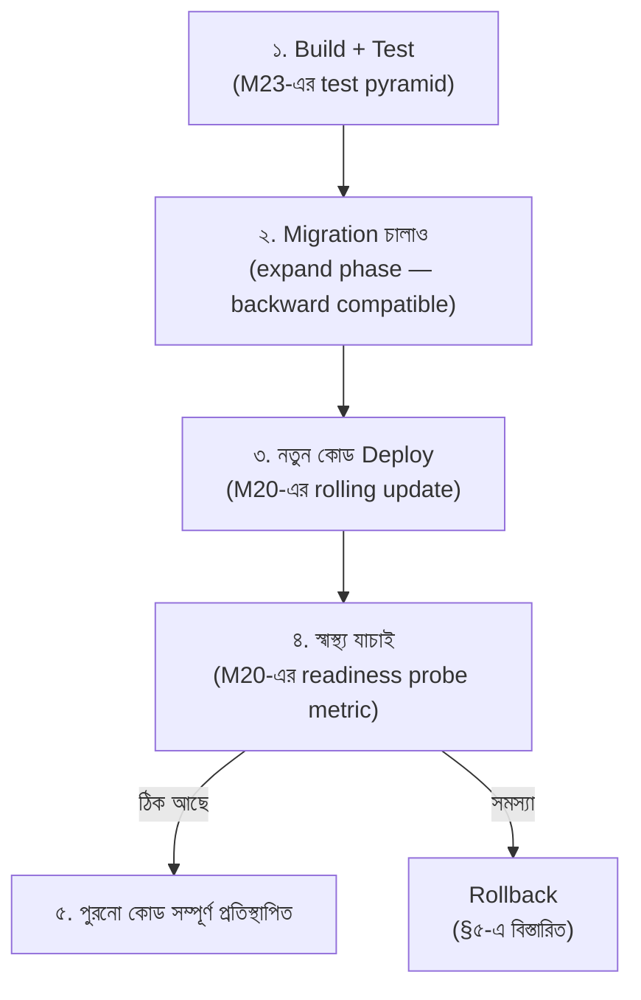

# Module 22 — CI/CD ও Delivery

> **Phase F — Infrastructure ও DevOps** | পূর্বশর্ত: M08, M19, M20, M21
> পরের module: M23 (Testing ও Quality Engineering)

---

## ১. যে deploy-টা migration আগে চালিয়ে পুরো site ভেঙে দিয়েছিল

M08 §৬-এ আমরা expand-contract migration pattern বিস্তারিত দেখেছিলাম — কীভাবে schema change আর code deploy আলাদা সময়ে ঘটে বলে migration-কে backward-compatible রাখতে হয়। একটা টিম এই নীতিটা সঠিকভাবে বুঝেছিল এবং তাদের migration-গুলো সব ঠিকমতো লেখা ছিল। কিন্তু তাদের CI/CD pipeline-এ একটা ভিন্ন সমস্যা ছিল যা সেই সব সতর্কতাকে অকেজো করে দিল।

তাদের deploy pipeline এরকম ছিল:

```yaml
# ❌ সমস্যাযুক্ত pipeline order
jobs:
  deploy:
    steps:
      - run: kubectl set image deployment/app app=myapp:${{ github.sha }}
      - run: kubectl rollout status deployment/app
      - run: python manage.py migrate   # ⚠️ migration deploy-এর পরে!
```

একটা নির্দিষ্ট migration ছিল — একটা column **rename** করা (M08 §৬.১-এর ঠিক সেই বিপজ্জনক উদাহরণ, যেটা expand-contract দিয়ে multi-step করা উচিত ছিল)। কিন্তু এই টিমের ক্ষেত্রে সমস্যাটা আরও মৌলিক ছিল — তারা migration-টা সঠিকভাবে **লিখেছিল** (expand-contract অনুসরণ করে, নতুন column আগে যোগ করে), কিন্তু deployment **pipeline order** ভুল ছিল।

Migration চলছিল **নতুন কোড deploy হওয়ার পরে**। এর মানে: নতুন কোড (যেটা নতুন column আশা করছিল) কয়েক মিনিটের জন্য **পুরনো schema-র বিরুদ্ধে** চলছিল — migration শেষ না হওয়া পর্যন্ত নতুন column আসলে ছিলই না। এই কয়েক মিনিটে **সব request 500 error** দিচ্ছিল, কারণ নতুন কোড এমন একটা column খুঁজছিল যা তখনো তৈরি হয়নি।

এই ঘটনাটা দেখায় M08-এর সঠিক migration discipline **যথেষ্ট না** যদি CI/CD pipeline-এর deploy ordering সেই discipline-কে respect না করে — এই module সেই gap পূরণ করবে।

---

## ২. Pipeline Design — M08-এর Migration Discipline-কে Pipeline-এ Enforce করা

### ২.১ সঠিক ক্রম — Expand-Contract-এর Pipeline বাস্তবায়ন



```yaml
# ✅ সঠিক ক্রম
jobs:
  deploy:
    steps:
      - run: python manage.py migrate   # ⚠️ আগে — কিন্তু M08-এর expand-contract মেনে
      - run: kubectl set image deployment/app app=myapp:${{ github.sha }}
      - run: kubectl rollout status deployment/app --timeout=300s
```

**মূল নীতি — M08 §৬.১-এর সরাসরি pipeline বাস্তবায়ন:** Migration সবসময় deploy-এর **আগে** চালানো উচিত, **এবং** migration নিজে backward-compatible হতে হবে (M08-এর expand-contract) — কারণ migration-এর পরে, deploy সম্পূর্ণ হওয়ার আগে, **পুরনো কোড এখনো নতুন schema-র বিরুদ্ধে চলবে** (M08-এর rolling deployment window)। দুইটা নিয়ম **একসাথে** প্রয়োজনীয় — একটা ছাড়া আরেকটা যথেষ্ট না, ঠিক যেমন §১-এর ঘটনায় দেখা গেছে সঠিক migration লেখা যথেষ্ট ছিল না যদি pipeline order ভুল থাকে।

### ২.২ M23-এর Test Pyramid-এর Pipeline-এ প্রয়োগ

```yaml
# .github/workflows/ci.yml
jobs:
  fast-tests:              # M23-এর pyramid-এর base — সবার আগে, দ্রুততম feedback
    steps:
      - run: pytest tests/unit/ --maxfail=1

  integration-tests:       # M23-এর মাঝের স্তর — fast-tests পাস হলেই চলে
    needs: fast-tests
    steps:
      - run: pytest tests/integration/

  e2e-tests:               # M23-এর শীর্ষ — সবচেয়ে ধীর, সবার শেষে
    needs: integration-tests
    steps:
      - run: pytest tests/e2e/
```

**M23-এর test pyramid নীতির (যা আমরা পরের module-এ বিস্তারিত দেখব) pipeline-level প্রয়োগ:** দ্রুত, সস্তা test আগে চালানো — যদি unit test fail করে, ধীর, ব্যয়বহুল integration/e2e test চালানোর কোনো মানে নেই (M31-এর "fail fast" নীতির CI সংস্করণ)। এটা developer feedback loop-কে দ্রুত রাখে — একটা সাধারণ bug কয়েক সেকেন্ডে ধরা পড়ে, কয়েক মিনিট অপেক্ষা করতে হয় না।

---

## ৩. Immutable Artifact ও Build Reproducibility

### ৩.১ মূল নীতি — একবার Build, বহুবার Deploy

```yaml
# ❌ প্রতিটা environment-এ আলাদা build — M07-এর "staging আর production ভিন্ন
#    আচরণ" সমস্যার মূল কারণ হতে পারে
jobs:
  deploy-staging:
    steps:
      - run: docker build -t myapp:staging .
  deploy-production:
    steps:
      - run: docker build -t myapp:production .   # ⚠️ ভিন্ন সময়ে build, ভিন্ন dependency version আসতে পারে

# ✅ একবার build, artifact reuse
jobs:
  build:
    steps:
      - run: docker build -t myapp:${{ github.sha }} .
      - run: docker push myapp:${{ github.sha }}
  deploy-staging:
    needs: build
    steps:
      - run: kubectl set image deployment/app app=myapp:${{ github.sha }}
  deploy-production:
    needs: [build, deploy-staging]   # staging-এ verified হওয়ার পরই production
    steps:
      - run: kubectl set image deployment/app app=myapp:${{ github.sha }}
```

**M07 §৬.২-এর "staging vs production ভিন্ন কেন?" ডিবাগিং প্রশ্নের একটা root cause প্রতিরোধ:** যদি প্রতিটা environment আলাদাভাবে build হয় (আলাদা সময়ে, `pip install` আলাদাভাবে চলে), dependency-র patch version ভিন্ন হতে পারে বিভিন্ন build-এ (যদি version pinning strict না থাকে) — এটা একটা "works in staging, fails in production" bug-এর সম্ভাব্য উৎস যা M07-এ আমরা query-optimization প্রেক্ষাপটে দেখেছিলাম, কিন্তু আসলে root cause build inconsistency-তেও থাকতে পারে। **Immutable artifact** (একটা নির্দিষ্ট Docker image tag, একবার build হয়ে সব environment-এ reuse) এই শ্রেণীর bug সম্পূর্ণভাবে দূর করে।

### ৩.২ Dependency Pinning — M19-এর Base Image নীতির সম্প্রসারণ

```
# ❌ requirements.txt
django
psycopg2

# ✅ pinned versions
django==5.0.6
psycopg2==2.9.9
```

```bash
# আরও কঠোর — hash-pinning (pip-tools দিয়ে generated)
django==5.0.6 \
    --hash=sha256:abc123...
```

**M12 §৮-এর schema evolution নীতির dependency সংস্করণ:** un-pinned dependency (`django` কোনো version ছাড়া) মানে প্রতিটা `pip install` **ভিন্ন সময়ে ভিন্ন version** আনতে পারে (নতুন release হলে) — এটা M09-এর "reproducibility" নীতির লঙ্ঘন। Hash-pinning আরও এক ধাপ এগিয়ে — এটা নিশ্চিত করে ঠিক সেই bytes install হচ্ছে যা expected, একটা compromised PyPI package (M26-এর supply-chain attack) বা mirror mismatch থেকে সুরক্ষা।

---

## ৪. Supply Chain Security — SBOM, Signing, Scanning

### ৪.১ SBOM (Software Bill of Materials)

```bash
# একটা image-এ ঠিক কী কী package আছে তার একটা সম্পূর্ণ তালিকা
syft myapp:latest -o json > sbom.json
```

**M19 §৯-এর image scanning নীতির সম্প্রসারণ:** M19-এ আমরা `trivy` দিয়ে known vulnerability scan করেছিলাম। SBOM এক ধাপ আগে যায় — এটা প্রতিটা dependency-র (transitive dependency সহ, M09-এর "আমরা যা ব্যবহার করছি তার সবটা জানি না" সমস্যার সমাধান) একটা সম্পূর্ণ inventory তৈরি করে। যখন একটা নতুন CVE (vulnerability) আবিষ্কৃত হয় ভবিষ্যতে (আজকের scan-এ ধরা না পড়েও), SBOM থাকলে দ্রুত জানা যায় "আমরা কি এই vulnerable package ব্যবহার করছি কোথাও" — একটা historical audit trail, M08-এর audit log নীতির সরবরাহ-চেইন সংস্করণ।

### ৪.২ Artifact Signing — M02-এর TLS Certificate নীতির CI সংস্করণ

```yaml
# cosign দিয়ে image sign করা
- run: cosign sign --key cosign.key myapp:${{ github.sha }}

# deploy-এর আগে verify
- run: cosign verify --key cosign.pub myapp:${{ github.sha }}
```

**মূল ধারণা:** M02-এর TLS certificate "এই server সত্যিই যে দাবি করছে সেই" প্রমাণ করে — artifact signing একই ধারণা image-এ প্রয়োগ করে: "এই image সত্যিই আমাদের CI pipeline থেকে এসেছে, কোনো tampering হয়নি পথে।" এটা একটা supply-chain attack প্রতিরোধ করে যেখানে একটা attacker registry-তে একটা malicious image push করতে পারে সঠিক নামে/tag-এ — signing verification ছাড়া deployment সেই malicious image accept করে ফেলতে পারে।

### ৪.৩ Dependabot/Automated Dependency Update

```yaml
# .github/dependabot.yml
updates:
  - package-ecosystem: "pip"
    directory: "/"
    schedule: {interval: "weekly"}
```

**M16-এর proactive vs reactive resilience-এর security সংস্করণ:** Dependabot automatically PR তৈরি করে dependency-তে security patch পাওয়া গেলে — এটা M08-এর "backup restore টেস্ট না করলে সেটা backup না" নীতির সমান্তরাল: একটা vulnerability scanning tool (M19) যা শুধু জানায় সমস্যা আছে, কিন্তু কেউ manually fix না করলে patch কখনো apply হয় না — automated update PR সেই gap পূরণ করে, human-in-the-loop review সহ (M23-এর CI test pyramid প্রতিটা dependency update-এ automatically চলবে, breaking change ধরতে)।

> **Senior Tip:** "Supply chain security কেন এত গুরুত্বপূর্ণ, শুধু আমাদের নিজের কোড secure রাখলেই কি যথেষ্ট না?" — "আধুনিক application-এ, নিজের লেখা কোড প্রায়ই মোট dependency tree-র ১-৫%। M09-এর dependency-heavy Django/DRF stack-এ, বাকি ৯৫-৯৯% হাজার হাজার third-party package (transitive dependency সহ) — যেকোনো একটাতে একটা vulnerability পুরো সিস্টেমকে ঝুঁকিতে ফেলতে পারে (২০২১-এর log4j-এর মতো ঘটনা এই ঝুঁকির একটা industry-wide উদাহরণ)। SBOM + scanning + signing + automated update — এই চারটা একসাথে M16-এর 'defense in depth' নীতির supply-chain প্রয়োগ।"

---

## ৫. Rollback Strategy — M20-এর Deployment-এর Failure Path

### ৫.১ Code Rollback — M20-এর Rolling Update Reverse

```bash
kubectl rollout undo deployment/app                    # আগের ReplicaSet-এ ফিরে যাওয়া
kubectl rollout undo deployment/app --to-revision=3     # নির্দিষ্ট revision-এ ফিরে যাওয়া
```

**M20-এর rolling update mechanism-এর সরাসরি reverse প্রয়োগ:** Kubernetes আগের ReplicaSet-এর history রাখে (ডিফল্টে সাম্প্রতিক ১০টা), `rollout undo` সেই আগের অবস্থায় দ্রুত ফিরে যায় — M31-এর incident response নীতির (§১১-এ M31-এ আমরা যা দেখেছিলাম) প্রথম পদক্ষেপ, "root cause debug করার আগে bleeding থামাও।"

### ৫.২ Migration Rollback — M08-এর Expand-Contract-এর সবচেয়ে কঠিন অংশ

```
❌ সমস্যা: code rollback সহজ (আগের image-এ ফিরে যাওয়া), কিন্তু migration
   rollback প্রায়ই সহজ না — বিশেষত যদি migration ইতিমধ্যে data
   transform করে ফেলেছে (M08 §৬.১-এর backfill phase)

M08-এর expand-contract pattern এই কারণেই multi-step — প্রতিটা ধাপ
independently rollback-যোগ্য থাকে:
  - Expand phase (nullable column যোগ) → rollback সহজ, শুধু column drop
  - Backfill phase → rollback মানে backfill বন্ধ করা, ক্ষতি নেই কারণ
    পুরনো column এখনো আছে
  - Cutover phase (কোড নতুন column পড়া শুরু করে) → এই ধাপে rollback
    করলে কোড rollback যথেষ্ট, কারণ পুরনো column এখনো সিঙ্কে আছে
  - Contract phase (পুরনো column drop) → ⚠️ এই ধাপের পরে rollback
    কঠিন — এই কারণেই M08 বলেছিল এই ধাপ ১-২ সপ্তাহ পরে করতে, যথেষ্ট
    নিশ্চিত হয়ে যে rollback লাগবে না
```

> **Senior Tip:** "কেন migration rollback এত কঠিন?" — "কারণ code rollback stateless (আগের version, নতুন request), কিন্তু migration stateful — একবার data transform হয়ে গেলে, সেই transformation 'undo' করা মানে হয় সেই data আবার পুরনো ফর্মে ফিরিয়ে আনা, যেটা যদি মাঝে নতুন data এসে থাকে (নতুন schema-তেই) জটিল হয়ে যায়। এই কারণেই M08-এর expand-contract-এর 'contract' ধাপ (পুরনো column drop) সবচেয়ে দেরিতে এবং সবচেয়ে সতর্কতার সাথে করা হয় — এটাই একমাত্র সত্যিকারের 'point of no return' পুরো migration process-এ।"

### ৫.৩ Automated Rollback — M16-এর Circuit Breaker-এর Deployment-level সংস্করণ

```yaml
# Argo Rollouts দিয়ে metric-based automated rollback (M20 §৮.৩-এর canary-র সম্প্রসারণ)
apiVersion: argoproj.io/v1alpha1
kind: Rollout
spec:
  strategy:
    canary:
      steps:
      - setWeight: 20
      - pause: {duration: 300}
      - analysis:
          templates: [{templateName: error-rate-check}]
          # ⚠️ error rate threshold ছাড়ালে automatic rollback,
          #    মানুষের হস্তক্ষেপ ছাড়াই — M16-এর circuit breaker নীতির
          #    deployment-level প্রয়োগ
```

**M16 §৪-এর circuit breaker-এর deployment-level সমতুল্য:** যেমন M16-এ একটা circuit breaker automatic ভাবে একটা failing dependency-কে বাদ দেয় (মানুষের সিদ্ধান্তের অপেক্ষা না করে), একটা automated rollback pipeline canary-তে error rate spike দেখলে **স্বয়ংক্রিয়ভাবে** rollback করে — M25-এ incident response সময় (MTTR, Mean Time To Recovery) এই automation দিয়ে নাটকীয়ভাবে কমে, কারণ 3am-এ একজন on-call engineer জেগে ওঠার আগেই সমস্যা সমাধান হয়ে যেতে পারে।

---

## ৬. Feature Flag ও Progressive Delivery

### ৬.১ M20-এর Canary Deployment-এর সম্পূরক, প্রতিস্থাপন না

```python
# feature_flags.py
def is_new_checkout_flow_enabled(user):
    return feature_flag_client.is_enabled("new-checkout-flow", user_id=user.id)

# views.py
def checkout(request):
    if is_new_checkout_flow_enabled(request.user):
        return new_checkout_flow(request)
    return legacy_checkout_flow(request)
```

**M20-এর canary deployment-এর সাথে মূল পার্থক্য:**

```
Canary deployment: infrastructure-level রোলআউট — একটা নতুন Pod version-এ
                    ট্র্যাফিকের একটা অংশ যায় (M20 §৮.৩)

Feature flag: application-level রোলআউট — একই কোড deploy করা আছে সব
              জায়গায়, কিন্তু একটা runtime flag নির্দিষ্ট করে কোন
              user/segment নতুন behavior দেখবে
```

**মূল সুবিধা যা canary দিতে পারে না:** feature flag দিয়ে **নির্দিষ্ট user segment** টার্গেট করা যায় (internal employee প্রথমে, তারপর ১% random user, তারপর একটা নির্দিষ্ট country) — canary deployment শুধু random traffic percentage বিভক্ত করে, কোনো targeting logic ছাড়া। আর সবচেয়ে গুরুত্বপূর্ণ — feature flag দিয়ে **instant rollback** সম্ভব কোনো নতুন deployment ছাড়াই, শুধু flag বন্ধ করে (M16-এর "fast fail" নীতির প্রায় তাৎক্ষণিক প্রয়োগ, deployment pipeline-এর সময় ছাড়াই)।

### ৬.২ M14-এর Saga Pattern-এর সাথে সংযোগ — Feature Flag Migration-এ

```python
# M08-এর dual-write migration phase-এ feature flag ব্যবহার
def save_payment(payment_data):
    if feature_flags.is_enabled("dual-write-amount-minor"):
        payment.amount = payment_data["amount"]
        payment.amount_minor = payment_data["amount"] * 100   # M08 §৬.১-এর dual-write phase
    else:
        payment.amount = payment_data["amount"]
```

**M08 §৬.১-এর expand-contract-এর সাথে সংযোগ:** feature flag migration-এর "dual-write" phase-কে আরও নিয়ন্ত্রিত করতে পারে — পুরো traffic-এ একসাথে dual-write চালু না করে, ধীরে ধীরে % বাড়ানো যায় (১% → ১০% → ১০০%), প্রতিটা ধাপে monitoring করে (M24-এ বিস্তারিত) কোনো unexpected সমস্যা হচ্ছে কি না।

### ৬.৩ Feature Flag Debt — একটা সৎ সতর্কতা

```
M14-এর Event Sourcing "over-engineering" সতর্কতার সমান্তরাল একটা
সতর্কতা এখানে: feature flag চিরকালের জন্য কোডে থেকে গেলে (migration
সম্পূর্ণ হওয়ার পরেও flag চেক clean up না করা), কোডবেস-এ ক্রমবর্ধমান
জটিলতা জমতে থাকে — M04-এর dead code-এর মতো, কিন্তু এখানে প্রতিটা
if/else branch একটা conditional complexity যোগ করে যা টেস্ট করতে হয়
(M23-এর test matrix বহুগুণ বেড়ে যায় প্রতিটা flag-এর সাথে)।
```

> **Senior Tip:** "Feature flag কতদিন কোডে রাখা উচিত?" — "M08-এর migration-এর 'contract phase' নীতির সরাসরি সমান্তরাল প্রয়োগ — migration সম্পূর্ণ রোলআউট হয়ে, যথেষ্ট নিশ্চিত হওয়ার পরে (সাধারণত কয়েক সপ্তাহ), flag এবং তার পুরনো code path clean up করা উচিত। আমি team practice হিসেবে প্রতিটা feature flag তৈরির সময় একটা 'expiry reminder' (calendar event বা ticket) সেট করি, যাতে flag চিরকালের জন্য 'temporarily permanent' না হয়ে যায় — এটা M14-এর over-engineering avoidance নীতির মতোই, শুধু বিপরীত দিকে: powerful tool ব্যবহার করার পর তার cleanup discipline বজায় রাখা।"

---

## ৭. Trunk-Based Development বনাম Git Flow

### ৭.১ Git Flow — জটিল, ঐতিহ্যবাহী

```
main (production) ← release branch ← develop ← feature branches
```

**সমস্যা যা M20-এর CI/CD গতির সাথে ঘর্ষণ তৈরি করে:** একাধিক long-lived branch (feature, develop, release) মানে merge conflict জমতে থাকা, আর প্রতিটা branch আলাদা সময়ে integration test পাস করা — এটা M20-এর দ্রুত, frequent deployment (M22-এর মূল উদ্দেশ্য) নীতির বিরুদ্ধে ঘর্ষণ তৈরি করে, কারণ integration বিলম্বিত হয়।

### ৭.২ Trunk-Based Development — আধুনিক পছন্দ

```
main (সবসময় deployable) ← ছোট, স্বল্পস্থায়ী feature branch (কয়েক ঘণ্টা-দিন)
```

```yaml
# CI-তে প্রতিটা PR merge হওয়ার সাথে সাথে main deploy-যোগ্য থাকতে হবে
jobs:
  on-pr:
    steps:
      - run: pytest   # M23-এর test pyramid
      - run: terraform plan   # M21-এর review discipline
```

**M17-এর "loosely coupled, independently deployable" নীতির সরাসরি সংযোগ:** Trunk-based development ছোট, ঘন ঘন merge (M22-এর CI/CD দর্শনের সাথে সাযুজ্যপূর্ণ) — feature অসম্পূর্ণ অবস্থায়ও merge হতে পারে যদি §৬-এর feature flag দিয়ে "off" রাখা যায়। এটা M14-এর incremental delivery নীতির development-workflow সংস্করণ, বড় "big bang" merge এড়িয়ে যা M08-এর বড় migration-এর মতোই ঝুঁকিপূর্ণ (অনেক change একসাথে, debug করা কঠিন যদি কিছু ভাঙে)।

> **Senior Tip:** "কেন trunk-based development modern CI/CD-এর সাথে বেশি মেলে?" — "Git Flow ডিজাইন করা হয়েছিল এমন একটা যুগে যখন deploy quarterly/monthly ছিল — long-lived branch তখন যুক্তিসঙ্গত ছিল কারণ 'release'-এর একটা স্বতন্ত্র মুহূর্ত ছিল। M22-এর 'একবার build, বহুবার deploy' এবং M20-এর ঘন ঘন rolling deployment দর্শনে, deploy একটা continuous প্রক্রিয়া, discrete event না — trunk-based development-এর 'main সবসময় deployable' নীতি এই দর্শনের সাথে natural fit। তবে trunk-based development-এর সাফল্য নির্ভর করে ভালো test coverage-এর উপর (M23) এবং feature flag discipline-এর (§৬) উপর — এই দুইটা ছাড়া 'সবসময় deployable main' একটা false promise হয়ে যায়।"

---

## ৮. Interview Section

### প্রশ্ন ১ (Senior) — "Migration deploy-এর আগে চালাবেন নাকি পরে?"

**❌ Wrong Answer**
> "পরে, কারণ নতুন কোড নতুন schema আশা করবে।"

*কেন বিপজ্জনক:* এটাই §১-এর ঘটনার মূল কারণ ছিল — এই যুক্তিটা superficially যুক্তিসঙ্গত মনে হয় কিন্তু rolling deployment window উপেক্ষা করে।

**🌟 Senior/Staff Answer**
> "সবসময় **আগে**, এবং migration নিজে backward-compatible হতে হবে (M08-এর expand-contract pattern)। কারণ M20-এর rolling deployment-এ, নতুন কোড deploy হওয়ার সময় পুরনো এবং নতুন কোড **কিছু সময়ের জন্য একসাথে** চলে (কিছু Pod পুরনো version, কিছু নতুন, `maxSurge`/`maxUnavailable`-এর উপর নির্ভর করে)। যদি migration deploy-এর **পরে** চালানো হয়, তাহলে যে সময় নতুন কোড deploy হয়ে গেছে কিন্তু migration এখনো চলেনি (বা চলছে), নতুন কোড একটা schema আশা করছে যা এখনো বিদ্যমান না — সব request 500 error।
>
> যদি migration **আগে** চালানো হয় এবং সেটা backward-compatible হয় (M08-এর expand phase, যেমন nullable column যোগ করা কোনো existing behavior না ভেঙে), তাহলে পুরনো কোড এখনো ঠিকমতো চলে নতুন schema-র বিরুদ্ধে (নতুন column-কে সে উপেক্ষা করে), আর নতুন কোড deploy হওয়ার পরে সেই column ব্যবহার করা শুরু করে — কোনো downtime window নেই।
>
> এই দুইটা নিয়ম (migration আগে, এবং backward-compatible) **একসাথে** প্রয়োজনীয় — শুধু order ঠিক করলেও migration নিজে backward-compatible না হলে (M08-এর সরাসরি rename-এর মতো) একই সমস্যা হবে, উল্টো দিক থেকে।"

---

### প্রশ্ন ২ (Staff / Architecture) — "আমাদের deploy pipeline-এ automated rollback (metric-based) সেটআপ করার প্রস্তাব করা হচ্ছে। ঝুঁকি কী?"

**🌟 Senior/Staff Answer**
> "Automated rollback M16-এর circuit breaker নীতির deployment-level প্রয়োগ, এবং সাধারণত মূল্যবান — কিন্তু কয়েকটা ঝুঁকি সতর্কতার সাথে বিবেচনা করা দরকার, M16-এর 'fallback behavior একটা business decision' নীতির সাথে সাযুজ্যপূর্ণভাবে।
>
> **১. False positive rollback।** যদি error-rate threshold খুব sensitive হয়, একটা সাময়িক, unrelated spike (M02-এর network blip, একটা downstream dependency-র transient issue যা M16-এর circuit breaker দিয়েই handled হওয়া উচিত ছিল) একটা **সঠিক** deployment-কে rollback করিয়ে দিতে পারে। এটা বিশেষভাবে বিভ্রান্তিকর কারণ পরের deploy attempt-এও একই false rollback হতে পারে, deployment velocity-কে সম্পূর্ণ থামিয়ে দিয়ে একটা unrelated সমস্যার কারণে।
>
> **২. যদি migration ইতিমধ্যে চলে গেছে (§৫.২)।** Automated code rollback দ্রুত এবং নিরাপদ, কিন্তু যদি migration-এর backfill phase ইতিমধ্যে data পরিবর্তন করে ফেলেছে, শুধু code rollback যথেষ্ট নাও হতে পারে যদি migration নিজে সঠিকভাবে backward-compatible না হয়ে থাকে। Automated rollback শুধু **code** rollback করে, migration rollback একটা সম্পূর্ণ ভিন্ন, প্রায়ই ম্যানুয়াল প্রক্রিয়া।
>
> **৩. Alert fatigue-এর বিপরীত — over-trust।** যদি automated rollback ভালোভাবে কাজ করে কিছুদিন, টিম হয়তো manual monitoring/vigilance কমিয়ে দেবে ('automation তো আছে') — কিন্তু automated system নিজে যদি কোনো ভুল metric monitor করে (M24-এর observability discipline যদি দুর্বল হয়), এটা false confidence তৈরি করতে পারে।
>
> **আমার সুপারিশ:** automated rollback চালু করুন, কিন্তু threshold conservative রাখুন প্রথমে (শুধু স্পষ্ট, বড় regression-এ trigger হবে, minor fluctuation-এ না), আর প্রতিটা automated rollback event-কে একটা mandatory postmortem trigger (M25-এ বিস্তারিত) বানান — যাতে false positive দ্রুত ধরা পড়ে এবং threshold tune হয়, শুধু automation-কে 'set and forget' না করে।"

---

### প্রশ্ন ৩ (Coding / Debugging) — "একটা deploy-এর পর একটা নির্দিষ্ট user-group-এর জন্য একটা feature ভেঙে গেছে, কিন্তু বাকি সবার জন্য ঠিক আছে। Feature flag ব্যবহার হচ্ছে। ডিবাগ করার approach কী?"

**🌟 Senior/Staff Answer**
> "প্রথম প্রশ্ন — এই bug কি feature flag-এর নিজের logic-এ (কে flag পাচ্ছে ভুলভাবে নির্ধারিত হচ্ছে), নাকি feature-এর নিজের implementation-এ (flag ঠিকমতো কাজ করছে, কিন্তু নতুন code path-এ একটা bug আছে যা শুধু নির্দিষ্ট user segment-এ প্রকাশ পাচ্ছে)?
>
> **যদি flag targeting logic-এ সমস্যা:** এটা প্রায়ই একটা data/segmentation bug — যেমন একটা user attribute (country, account tier) ভুলভাবে read হচ্ছে, বা একটা percentage rollout-এর hash function অসামঞ্জস্যপূর্ণ (একই user বিভিন্ন request-এ ভিন্ন flag state পাচ্ছে, যেটা একটা flaky bug তৈরি করে)।
>
> **যদি feature implementation-এ সমস্যা:** এটা M23-এর test coverage gap নির্দেশ করে — নতুন code path নির্দিষ্ট user segment-এর data pattern-এ টেস্ট করা হয়নি (যেমন একটা edge case যা শুধু একটা নির্দিষ্ট country-র users-এর data-তে ঘটে, M08-এর timezone/locale সতর্কতার মতো একটা bug class)।
>
> **তাৎক্ষণিক mitigation:** flag বন্ধ করে দেওয়া সেই নির্দিষ্ট segment-এর জন্য (§৬.১-এর instant rollback সুবিধা, নতুন deployment ছাড়াই) — এটাই feature flag-এর মূল মূল্য এই ধরনের পরিস্থিতিতে, M20-এর `kubectl rollout undo`-র চেয়ে দ্রুত কারণ কোনো Pod restart লাগে না।
>
> **দীর্ঘমেয়াদী fix:** root cause খুঁজে বের করে ঠিক করা, তারপর ধীরে ধীরে সেই segment-এর জন্য আবার rollout করা ছোট percentage দিয়ে (§৬.২-এর progressive rollout নীতি), সরাসরি ১০০%-এ ফিরে না গিয়ে।
>
> এই ঘটনাটা M23-এর একটা গুরুত্বপূর্ণ শিক্ষাও দেয় — যদি টেস্ট suite বিভিন্ন user segment-এর representative data দিয়ে না চলে (শুধু generic test data দিয়ে), এই ধরনের segment-নির্দিষ্ট bug CI-তে কখনো ধরা পড়বে না, শুধু production-এ feature flag rollout-এর সময়েই প্রকাশ পাবে।"

---

### প্রশ্ন ৪ (Architecture Decision) — "আমরা Git Flow ব্যবহার করছি এখনো। একটা junior developer trunk-based development-এ migrate করার প্রস্তাব দিচ্ছেন। কী বিবেচনা করবেন?"

**🌟 Senior/Staff Answer**
> "আমি প্রস্তাবটা নীতিগতভাবে সমর্থন করব (M22 §৭.২-এর যুক্তি — trunk-based development modern CI/CD দর্শনের সাথে ভালো মেলে), কিন্তু migration-টা নিজেই M08-এর মতো একটা careful, incremental প্রক্রিয়া হওয়া উচিত, একটা big-bang switch না — যেটা কিছুটা বিদ্রূপাত্মক কারণ আমরা ঠিক সেই নীতিই (incremental migration) এখানে workflow change-এ প্রয়োগ করছি যা আমরা M08-এ schema change-এ প্রয়োগ করেছিলাম।
>
> **প্রথম প্রশ্ন — টিমের প্রস্তুতি কী?** Trunk-based development সাফল্যের জন্য দুইটা জিনিস প্রয়োজন যা আমি নিশ্চিত করব আছে কি না: (১) M23-এর শক্তিশালী automated test coverage — ছোট, ঘন ঘন merge নিরাপদ শুধু যদি CI দ্রুত এবং নির্ভরযোগ্যভাবে regression ধরতে পারে, ম্যানুয়াল QA-র উপর নির্ভর না করে। (২) Feature flag discipline (§৬) — অসম্পূর্ণ feature merge করার জন্য flag ব্যবহারের সংস্কৃতি, যা অনেক টিমের জন্য একটা নতুন workflow শিখতে হবে।
>
> **যদি এই দুইটা না থাকে,** আমি সরাসরি migrate করার বিরুদ্ধে পরামর্শ দেব — trunk-based development ছাড়া safety net (weak test coverage, no feature flag discipline) মানে আসলে একটা **more risky** workflow, Git Flow-এর deliberate, staged review process হারিয়ে কোনো compensating safety যোগ না করে।
>
> **আমার সুপারিশ:** M08-এর expand-contract-এর মতোই একটা incremental migration — প্রথমে M23-এর test coverage investment (আলাদা, prerequisite কাজ), তারপর feature flag infrastructure সেটআপ (§৬), তারপর একটা pilot team/project-এ trunk-based development trial করা, তারপর সাফল্য দেখে ধীরে ধীরে বাকি টিমে সম্প্রসারণ। এটা junior developer-এর প্রস্তাবের সততা এবং দিকনির্দেশনা সম্মান করে, কিন্তু বাস্তবায়নের ক্রমটা ঝুঁকিমুক্ত করে — ঠিক যেমন আমরা M08-এ একটা ভালো schema-change ধারণাকে একটা নিরাপদ, multi-step প্রক্রিয়ায় রূপান্তর করেছিলাম, শুধু ধারণাটা ভালো বলেই সরাসরি প্রয়োগ করিনি।"

---

## ৯. হাতে-কলমে অনুশীলন

**১ — Migration ordering bug পুনরুৎপাদন করুন (৩০ মিনিট)**
একটা সরল Django app-এ একটা migration ordering bug simulate করুন — একটা model field যোগ করুন যা কোড ব্যবহার করে, কিন্তু migration চালানোর **আগে** নতুন কোড deploy করুন (local script দিয়ে simulate)। Error দেখুন, তারপর ক্রম ঠিক করে আবার চেষ্টা করুন।

**২ — Immutable artifact pipeline বানান (৩৫ মিনিট)**
একটা GitHub Actions workflow লিখুন যা একবার build করে (একটা Docker image, একটা unique tag দিয়ে), তারপর সেই একই tag দুইটা আলাদা job-এ (simulate staging/production) deploy করে।

**৩ — Feature flag দিয়ে rollback অনুশীলন (২৫ মিনিট)**
একটা সরল feature flag mechanism বানান (একটা dict বা simple config)। একটা "buggy" feature implement করুন flag-এর পেছনে। Flag off/on করে দেখুন কত দ্রুত rollback করা যায় কোনো deployment ছাড়া।

**৪ — Rollback drill (৩০ মিনিট, Kubernetes/Minikube থাকলে)**
একটা Deployment-এ দুইটা version deploy করুন (v1, তারপর v2 যেটা ইচ্ছাকৃতভাবে ভাঙা)। `kubectl rollout undo` দিয়ে rollback করুন, `kubectl rollout history` দিয়ে revision history দেখুন।

---

## ১০. মূল কথা

1. **Migration সবসময় deploy-এর আগে চালান, এবং migration নিজে backward-compatible হতে হবে** — শুধু একটা নিয়ম যথেষ্ট না, M08-এর expand-contract-এর pipeline-level প্রয়োগ।
2. **একবার build, বহুবার deploy** — প্রতিটা environment আলাদাভাবে build করলে "works in staging, fails in production" bug-এর একটা নতুন উৎস তৈরি হয়।
3. **Dependency pinning (hash-pinning সহ) reproducibility নিশ্চিত করে** এবং supply-chain attack থেকে সুরক্ষা দেয়।
4. **SBOM + scanning + signing + automated update একসাথে supply chain security-র defense-in-depth** — একটা একা যথেষ্ট না।
5. **Code rollback stateless এবং সহজ, migration rollback stateful এবং কঠিন** — এই asymmetry-ই M08-এর expand-contract-এর multi-step nature-এর মূল কারণ।
6. **Automated rollback M16-এর circuit breaker নীতির deployment সংস্করণ**, কিন্তু false-positive ঝুঁকি এবং migration rollback-এর সীমাবদ্ধতা সচেতনভাবে বিবেচনা করতে হবে।
7. **Feature flag canary deployment-এর সম্পূরক, প্রতিস্থাপন না** — targeted rollout এবং instant rollback দেয় যা infrastructure-level canary দিতে পারে না।
8. **Feature flag debt বাস্তব** — প্রতিটা flag-এর একটা explicit cleanup plan থাকা উচিত, M14-এর over-engineering সতর্কতার সমান্তরাল।
9. **Trunk-based development দ্রুত CI/CD-র সাথে ভালো মেলে**, কিন্তু শক্তিশালী test coverage (M23) এবং feature flag discipline ছাড়া এটা actually বেশি risky হয়ে যায় Git Flow-এর চেয়ে।
10. **Workflow migration নিজেই M08-এর মতো incremental হওয়া উচিত** — একটা ভালো idea (trunk-based dev) সরাসরি প্রয়োগ করার আগে prerequisite (testing, flag discipline) নিশ্চিত করা।

---

## পরের Module

**M23 — Testing ও Quality Engineering।** আজ CI pipeline-জুড়ে আমরা বারবার "test pass করলেই merge/deploy" বলেছি — কিন্তু কখনো বিস্তারিত করিনি সেই test suite **কীভাবে** ভালো হয়। পরের module-এ test pyramid, Testcontainers (M09-এর polyglot persistence-এর টেস্ট সমস্যা সমাধান করে), contract testing (M17-এর microservice-এর integration সমস্যার সমাধান), load testing (M31-এর capacity estimation-কে বাস্তবে যাচাই করা), আর flaky test-এর মূল কারণ — এই handbook-এর সবচেয়ে বড় gap পূরণ হবে এই module দিয়ে।
