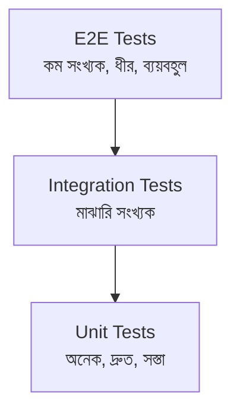
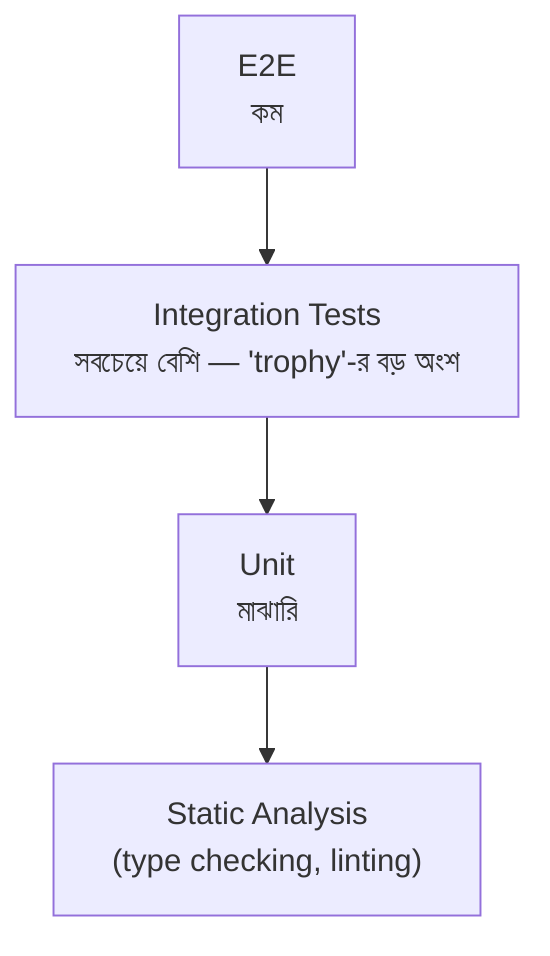

# Module 23 — Testing ও Quality Engineering

> **Phase G — Quality, Reliability ও Security** | পূর্বশর্ত: M09, M14, M17, M22
> পরের module: M24 (Observability ও Performance Engineering)

---

## ১. যে টেস্ট suite ৯৮% coverage দেখাচ্ছিল, কিন্তু একটা bug-ও ধরতে পারেনি

M31-এর payment platform-এর একটা টিম গর্বিত ছিল তাদের test coverage নিয়ে — `pytest --cov` **৯৮%** দেখাত, CI-তে সবুজ ব্যাজ, এবং টিমের নীতি ছিল "৯৫%-এর নিচে coverage গেলে merge block।" তারপরও, M31-এর refund idempotency logic-এ (M05 §১৩-এর race condition, যেটা `select_for_update()` দিয়ে সমাধান করা হয়েছিল) একটা regression production-এ পৌঁছে গেল — একই refund দুইবার প্রসেস হয়ে গেল একটা race condition-এ, ঠিক সেই bug যা আগে fix করা হয়েছিল।

কীভাবে ৯৮% coverage এই bug মিস করল? তদন্তে টেস্ট suite দেখা গেল:

```python
# ❌ এই টেস্ট "coverage" দেখায়, কিন্তু race condition কখনো test করে না
def test_process_refund():
    payment = PaymentFactory(amount_minor=10000, refunded_amount=0)
    process_refund(payment.id, amount=5000)
    payment.refresh_from_db()
    assert payment.refunded_amount == 5000
    # ✅ line coverage: select_for_update() লাইন "covered" — চলেছে
    # ❌ কিন্তু কখনো দুইটা concurrent call টেস্ট করা হয়নি
```

**Line coverage** পরিমাপ করে কোন লাইন **চলেছে**, কিন্তু বলে না কোন **scenario** (concurrent access, edge case, error path) test করা হয়েছে। `select_for_update()` লাইনটা "covered" ছিল কারণ একটা normal, sequential test সেটা চালিয়েছিল — কিন্তু race condition-এর আসল বিপদ শুধু concurrent access-এ প্রকাশ পায় (M05 §১৩-এর অনুশীলন ৩-এ যেভাবে আমরা ইচ্ছাকৃতভাবে race window বড় করেছিলাম টেস্ট করতে), যেটা এই suite-এ কখনো ছিলই না।

এই ঘটনাটা এই module-এর কেন্দ্রীয় থিম প্রতিষ্ঠা করে: **coverage percentage একটা "আমরা কী test করিনি" প্রশ্নের ভুল উত্তর দেয় — এটা measure করে code execution, correctness verification না। একটা উচ্চ coverage number নিরাপত্তার একটা false sense তৈরি করতে পারে যা প্রকৃত ঝুঁকির চেয়ে বিপজ্জনক।**

---

## ২. Test Pyramid ও Trophy — কী Test করব, কতটা

### ২.১ ঐতিহ্যবাহী Test Pyramid



**মূল নীতি — M22 §২.২-এর pipeline ordering-এর ভিত্তি:** Unit test সস্তা এবং দ্রুত (millisecond-এ চলে, কোনো external dependency ছাড়া), তাই বেশি সংখ্যায় লেখা উচিত। E2E test ধীর এবং ব্যয়বহুল (পুরো সিস্টেম spin up করতে হয়, M23 §৪-এ Testcontainers), তাই কম সংখ্যায়, শুধু critical user journey-তে।

### ২.২ Test Trophy — আধুনিক পুনর্বিবেচনা



**কেন এই পুনর্বিবেচনা M31-এর Django/DRF stack-এ প্রাসঙ্গিক:** Kent C. Dodds-এর "Testing Trophy" যুক্তি দেয় — pure unit test (সব dependency mock করা) প্রায়ই **কম ROI** দেয় কারণ তারা implementation detail টেস্ট করে, বাস্তব bug না। M31-এর payment system-এ, একটা "unit test" যা `PaymentRepository.save()`-কে mock করে **প্রকৃত database constraint** (M07-এর `UniqueConstraint`, M05-এর race condition protection) কখনো verify করে না — শুধু integration test (real/Testcontainers database সহ, §৪) সেটা করতে পারে। তাই M31-এর মতো data-intensive system-এ, integration test-এ বেশি বিনিয়োগ প্রায়ই বেশি মূল্যবান pure unit test-এর চেয়ে।

> **Senior Tip:** "Pyramid নাকি Trophy — কোনটা সঠিক?" — "এটা M09-এর polyglot persistence checklist-এর মতোই একটা context-dependent প্রশ্ন। একটা pure algorithm-heavy library-তে (M03-এর DSA-নির্ভর কোড) pyramid যুক্তিসঙ্গত — বেশিরভাগ logic pure function, unit test সস্তা এবং high-value। M31-এর মতো একটা database-heavy, ORM-নির্ভর application-এ, trophy-র integration-heavy approach বেশি বাস্তবসম্মত — কারণ আসল ঝুঁকি প্রায়ই ORM query behavior-এ (M07-এর `Meta.ordering` bug-এর মতো), business logic-এর pure algorithm অংশে না।"

---

## ৩. pytest — Fixture, Parametrize, এবং Factory Pattern

### ৩.১ Fixture — M18-এর Repository Pattern-এর Testing সংস্করণ

```python
# conftest.py
import pytest

@pytest.fixture
def merchant():
    return MerchantFactory()   # নিচে §৩.৩-এ factory_boy

@pytest.fixture
def payment(merchant):   # ⚠️ fixture composition — merchant fixture reuse
    return PaymentFactory(merchant=merchant, amount_minor=10000)

def test_refund_reduces_balance(payment):
    process_refund(payment.id, amount=5000)
    payment.refresh_from_db()
    assert payment.refunded_amount == 5000
```

**M04 §১০-এর context manager নীতির সরাসরি সংযোগ:** pytest fixture আসলে একটা generator-based context manager (M04-এর `@contextmanager` প্যাটার্ন) — `yield`-এর আগের কোড setup, পরের কোড teardown:

```python
@pytest.fixture
def payment_with_cleanup():
    payment = PaymentFactory()
    yield payment
    # teardown — M07-এর transaction rollback নীতির মতো, প্রতিটা test-এর পর clean state
    payment.delete()
```

### ৩.২ Parametrize — Edge Case-কে Explicit করা

```python
@pytest.mark.parametrize("amount,refund_amount,expected_error", [
    (10000, 15000, "Over-refund"),      # M05 §১৩-এর প্রশ্ন ৪-এর over-refund case
    (10000, -100, "Negative amount"),    # M08-এর money validation
    (10000, 0, "Zero amount"),
])
def test_refund_validation(payment, amount, refund_amount, expected_error):
    payment.amount_minor = amount
    with pytest.raises(ValueError, match=expected_error):
        process_refund(payment.id, amount=refund_amount)
```

**§১-এর ঘটনার প্রথম আংশিক সমাধান:** parametrize edge case-গুলোকে **explicit** করে — coverage percentage-এর বদলে, প্রতিটা business rule (M18-এর Aggregate invariant) একটা নির্দিষ্ট test case হিসেবে documented। কিন্তু এটা এখনো race condition ধরে না — সেটা §৫-এ।

### ৩.৩ factory_boy — M08-এর Test Data Management-এর Standard Pattern

```python
import factory

class MerchantFactory(factory.django.DjangoModelFactory):
    class Meta:
        model = Merchant
    name = factory.Faker("company")
    email = factory.Faker("email")
    tier = "standard"

class PaymentFactory(factory.django.DjangoModelFactory):
    class Meta:
        model = Payment
    merchant = factory.SubFactory(MerchantFactory)   # ⚠️ M18-এর Aggregate reference-এর মতো
    amount_minor = factory.Faker("random_int", min=100, max=1000000)
    status = "succeeded"
    idempotency_key = factory.Faker("uuid4")
```

**M18 §৫.২-এর Factory pattern-এর সরাসরি সংযোগ, testing-এর প্রেক্ষাপটে:** M18-এ আমরা domain-level Factory দেখেছিলাম (business rule সহ object creation)। `factory_boy` একই ধারণা test data-তে প্রয়োগ করে — প্রতিটা test-এ manually `Payment(merchant_id=..., amount_minor=..., ...)` না লিখে, একটা reusable, override-যোগ্য pattern:

```python
def test_high_value_payment_requires_review():
    payment = PaymentFactory(amount_minor=10_000_000)   # শুধু প্রাসঙ্গিক field override
    assert requires_manual_review(payment)
```

---

## ৪. Testcontainers — M09-এর Polyglot Persistence-এর Testing সমাধান

### ৪.১ সমস্যা যা এটা সমাধান করে

```
M09-এ আমরা দেখেছিলাম M31-এর payment system PostgreSQL + Redis + Kafka
ব্যবহার করে। কীভাবে এই পুরো stack test করবেন, প্রতিটা developer-এর
লোকাল মেশিনে এই সব manually install না করে?

❌ SQLite দিয়ে PostgreSQL-এর টেস্ট চালানো — M07-এর PostgreSQL-নির্দিষ্ট
   ফিচার (JSONB, partial index, advisory lock) SQLite-এ নেই বা ভিন্নভাবে
   আচরণ করে — test pass করলেও production-এ ভিন্ন আচরণ (M07 §৬.২-এর
   "staging vs production" সমস্যার আরেকটা রূপ)

✅ Testcontainers — টেস্ট চলাকালীন, একটা প্রকৃত PostgreSQL/Redis/Kafka
   container (M19-এর Docker জ্ঞান সরাসরি প্রযোজ্য) স্বয়ংক্রিয়ভাবে শুরু
   হয়, টেস্ট চলে, তারপর container ধ্বংস হয়
```

### ৪.২ বাস্তবায়ন

```python
# conftest.py
from testcontainers.postgres import PostgresContainer
from testcontainers.redis import RedisContainer

@pytest.fixture(scope="session")
def postgres_container():
    with PostgresContainer("postgres:16") as postgres:   # M19-এর container lifecycle
        yield postgres

@pytest.fixture(scope="session")
def django_db_setup(postgres_container):
    settings.DATABASES["default"] = {
        "ENGINE": "django.db.backends.postgresql",
        "HOST": postgres_container.get_container_host_ip(),
        "PORT": postgres_container.get_exposed_port(5432),
        # ⚠️ প্রকৃত PostgreSQL — M07-এর সব feature (JSONB, partial index,
        #    advisory lock) সঠিকভাবে test হবে
    }

@pytest.fixture(scope="session")
def redis_container():
    with RedisContainer("redis:7") as redis:   # M10-এর cache/lock behavior সঠিকভাবে test
        yield redis
```

**M22 §২.২-এর test pyramid-এর pipeline প্রয়োগে Testcontainers-এর ভূমিকা:** Testcontainers integration test স্তরে ব্যবহার হয় (unit test-এর চেয়ে ধীর, কারণ container startup সময় লাগে, কিন্তু E2E-এর চেয়ে দ্রুত কারণ পুরো application stack লাগে না) — M09-এর "PostgreSQL-নির্দিষ্ট feature সঠিকভাবে test করা" প্রয়োজনের সাথে M22-এর CI speed প্রয়োজনের একটা ভারসাম্য।

> **Senior Tip:** "Testcontainers সব টেস্টে ব্যবহার করব?" — "না — এটা M22-এর test pyramid নীতি লঙ্ঘন করবে যদি প্রতিটা ছোট unit test container startup overhead বহন করে। আমি Testcontainers শুধু integration test-এ ব্যবহার করি যেখানে database/cache-এর প্রকৃত আচরণ (M07-এর constraint, M10-এর atomic operation) verify করা প্রয়োজন। Pure business logic (M18-এর domain layer, যেমন `Payment.add_refund()`-এর invariant check, ORM ছাড়াই) plain unit test-এ, কোনো container ছাড়াই — M18-এর Clean Architecture-এর 'domain logic framework থেকে স্বাধীন' নীতির testing সুবিধা এখানে সরাসরি প্রকাশ পায়।"

---

## ৫. Concurrency Testing — §১-এর ঘটনার প্রকৃত সমাধান

```python
import threading

def test_concurrent_refund_prevents_double_processing(payment):
    """M05 §১৩-এর অনুশীলন ৩-এর pattern, এখন একটা permanent regression test হিসেবে"""
    payment.amount_minor = 10000
    payment.save()

    results = []
    barrier = threading.Barrier(2)   # ⚠️ দুইটা thread একই মুহূর্তে শুরু হতে বাধ্য করা

    def attempt_refund():
        barrier.wait()   # race window সর্বোচ্চ করা
        try:
            process_refund(payment.id, amount=8000)
            results.append("success")
        except InsufficientBalance:
            results.append("rejected")

    threads = [threading.Thread(target=attempt_refund) for _ in range(2)]
    for t in threads: t.start()
    for t in threads: t.join()

    payment.refresh_from_db()
    assert payment.refunded_amount <= 10000   # ⚠️ over-refund কখনো না, race থাকা সত্ত্বেও
    assert results.count("success") == 1       # শুধু একটা সফল হওয়া উচিত
```

**§১-এর ঘটনার সরাসরি প্রতিরোধ:** এই টেস্টটাই মূল suite-এ অনুপস্থিত ছিল — এটা `threading.Barrier` ব্যবহার করে (M04-এর threading জ্ঞান) দুইটা concurrent request-কে **জোরপূর্বক একই মুহূর্তে** race condition trigger করাতে, শুধু "hope" করার বদলে যে race randomly ধরা পড়বে। এই ধরনের টেস্ট M05-এর `select_for_update()`/atomic constraint-এর মতো correctness-critical কোডে **বাধ্যতামূলক** হওয়া উচিত, শুধু coverage percentage-এর উপর নির্ভর না করে।

> **Senior Tip:** "কীভাবে জানব কোন কোডে concurrency test দরকার?" — "M05 এবং M18-এ যেখানেই আমরা `select_for_update()`, atomic `F()` expression, বা Aggregate invariant enforcement দেখেছি — এই প্রতিটা জায়গা concurrency test-এর candidate, কারণ এই protection-গুলোর **পুরো উদ্দেশ্যই** race condition আটকানো। একটা sequential test শুধু প্রমাণ করে 'normal path কাজ করে,' কখনো প্রমাণ করে না 'protection mechanism কাজ করে' — শুধু concurrent test সেটা করতে পারে।"

---

## ৬. Mocking — কখন সাহায্য করে, কখন ক্ষতি করে

### ৬.১ Mock-এর সঠিক ব্যবহার — External System Boundary-তে

```python
# ✅ External PSP call mock করা — M18 §৭-এর Anti-Corruption Layer টেস্ট করা,
#    আসল network call ছাড়াই (M02-এর সব network unreliability এড়িয়ে টেস্টে)
def test_psp_adapter_translates_success_status(mocker):
    mock_response = mocker.Mock(json=lambda: {"txn_state": "SUCCESS", "merchant_reference": "pay_123"})
    mocker.patch("requests.Session.post", return_value=mock_response)

    adapter = PSPAdapter()
    result = adapter.translate_webhook(psp_payload)
    assert result["status"] == "succeeded"
```

**M18 §৭-এর Anti-Corruption Layer-এর টেস্টিং প্রয়োগ:** External system boundary-তে mock করা যুক্তিসঙ্গত — আমরা টেস্ট করতে চাই আমাদের **translation logic** সঠিক, PSP-র actual network behavior না (সেটা M02/M16-এর network resilience test-এর বিষয়, আলাদা)।

### ৬.২ Over-Mocking — যেখানে টেস্ট মিথ্যা আত্মবিশ্বাস দেয়

```python
# ❌ প্রতিটা layer mock করা — টেস্ট এখন কিছুই প্রকৃতভাবে verify করছে না
def test_create_payment(mocker):
    mock_repo = mocker.Mock()
    mock_repo.save.return_value = None
    mock_validator = mocker.Mock()
    mock_validator.validate.return_value = True

    service = PaymentService(repo=mock_repo, validator=mock_validator)
    service.create_payment(amount=1000)

    mock_repo.save.assert_called_once()   # ⚠️ শুধু "save() call হয়েছে" verify করছে,
                                             #    "save() সঠিকভাবে কাজ করেছে" না
```

**§১-এর ঘটনার একটা গভীর কারণ হতে পারত:** যদি `process_refund`-এর টেস্ট `select_for_update()`-কে mock করত (এটা একটা সাধারণ প্যাটার্ন যখন developer "database call ধীর, mock করে test দ্রুত করি" ভাবেন), তাহলে টেস্ট **কখনোই** প্রকৃত locking behavior verify করত না — শুধু verify করত যে function call হয়েছে। এই ধরনের টেস্ট `pass` করবে এমনকি যদি `select_for_update()` সম্পূর্ণ ভুলভাবে ব্যবহৃত হয়, কারণ mock শুধু "call হয়েছে কি না" জানে, "সঠিক আচরণ করেছে কি না" না।

> **Senior Tip:** "কীভাবে বুঝব একটা টেস্টে over-mocking হচ্ছে?" — "একটা simple heuristic: যদি আমি production code-এর একটা bug ইচ্ছাকৃতভাবে inject করি (M16-এর chaos engineering নীতির টেস্ট-লেভেল সংস্করণ — যেমন `select_for_update()` লাইন মুছে ফেলা), টেস্ট কি fail করবে? যদি টেস্ট এখনো pass করে (কারণ সেই লাইনটাই mock করা হয়েছিল), তাহলে টেস্টটা মূল্যহীন — এটা শুধু 'কোড আছে' যাচাই করছে, 'কোড সঠিক' না। এই exercise-টা (mutation testing-এর একটা manual সংস্করণ, §৯-এ automated ভার্সন) নিয়মিত করা উচিত সবচেয়ে critical business logic-এ।"

---

## ৭. Database Test Strategy — Transaction Rollback বনাম Truncate

```python
# ✅ pytest-django ডিফল্ট — প্রতিটা test একটা transaction-এ, শেষে rollback
@pytest.mark.django_db
def test_something():
    Payment.objects.create(amount_minor=1000)
    # test শেষে, transaction rollback হয় — M07-এর transaction.atomic()
    # নীতির টেস্ট-আইসোলেশন প্রয়োগ, দ্রুত কারণ কোনো actual DELETE লাগে না
```

**M07 §৩.৩-এর row-lock/transaction নীতির টেস্ট-ইনফ্রাস্ট্রাকচার প্রয়োগ:** প্রতিটা test একটা `BEGIN` দিয়ে শুরু হয়, test শেষে `ROLLBACK` — data কখনো প্রকৃতভাবে persist হয় না, তাই পরের test-এ কোনো leftover state থাকে না (M08 §৯.২-এর soft-delete unique constraint সমস্যার মতো cross-test pollution এড়ানো)। এটা `TRUNCATE`-ভিত্তিক cleanup-এর চেয়ে **দ্রুত** (M07-এর "DELETE বনাম rollback" খরচের পার্থক্যের testing সংস্করণ)।

⚠️ **সীমাবদ্ধতা যা M07 §৩.৩-এর সরাসরি সংযোগ:** transaction-rollback strategy-তে **concurrency test করা কঠিন** — যদি প্রতিটা test তার নিজস্ব transaction-এ isolated থাকে, দুইটা "concurrent" thread একই test-এর মধ্যে আসলে একই outer transaction-এর ভেতরে থাকতে পারে (M07-এর isolation level জটিলতা টেস্টেও প্রযোজ্য) — §৫-এর concurrency test-এ `pytest-django`-র `transactional_db` marker প্রয়োজন হতে পারে, যা প্রকৃত commit ব্যবহার করে (ধীর, কিন্তু সত্যিকারের concurrent access simulate করতে পারে multiple connection দিয়ে)।

```python
@pytest.mark.django_db(transaction=True)   # ⚠️ concurrency test-এ প্রয়োজনীয়
def test_concurrent_refund_prevents_double_processing(payment):
    ...   # §৫-এর টেস্ট, এখন প্রকৃত multi-connection concurrency simulate করছে
```

---

## ৮. Contract Testing — M17-এর Microservice Integration সমস্যার সমাধান

### ৮.১ সমস্যা

```
M17-এ আমরা microservice-দের মধ্যে API contract (M12 §৮-এর Schema
Registry-র মতো ধারণা, কিন্তু REST/gRPC-তে) বজায় রাখার প্রয়োজনীয়তা
আলোচনা করেছিলাম। কিন্তু কীভাবে **টেস্ট** করবেন যে দুইটা independently-
deployed service একে অপরের সাথে compatible, সম্পূর্ণ E2E environment
spin up না করে (যেটা M17-এর distributed monolith-এর মতোই একটা tight
coupling তৈরি করে টেস্ট-এ, deployment-এ না হলেও)?
```

### ৮.২ Pact — Consumer-Driven Contract Testing

```python
# Consumer side (M31-এর payment service, যেটা fraud-service-কে call করে)
def test_fraud_service_contract(pact):
    (pact
        .given("a valid payment exists")
        .upon_receiving("a risk score request")
        .with_request("POST", "/risk-score", body={"payment_id": "pay_123"})
        .will_respond_with(200, body={"risk_score": "low"}))

    with pact:
        result = fraud_client.get_risk_score("pay_123")
        assert result["risk_score"] == "low"
    # ⚠️ এই টেস্ট একটা "pact file" generate করে — fraud_service-এর
    #    কাছ থেকে ঠিক কী expected তার একটা contract
```

```python
# Provider side (fraud-service নিজে, CI pipeline-এ)
def test_verify_pact_contract():
    verifier = Verifier(provider="fraud-service", provider_base_url="http://localhost:8001")
    verifier.verify_pacts("pacts/payment-service-fraud-service.json")
    # ⚠️ fraud-service-এর actual implementation কি consumer-এর expectation
    #    পূরণ করে যাচাই করে — M12 §৮-এর schema compatibility check-এর
    #    সরাসরি সমতুল্য, কিন্তু REST API-তে
```

**M17-এর distributed monolith এড়ানোর টেস্ট-লেভেল প্রয়োগ:** Contract test নিশ্চিত করে fraud-service তার API বদলালে (breaking change), payment-service-এর CI pipeline **সাথে সাথে জানতে পারে** — সম্পূর্ণ E2E environment ছাড়াই, কারণ pact file-টাই সেই contract-এর একটা executable specification। এটা M12 §৮-এর Kafka schema evolution নীতির REST/synchronous API সংস্করণ।

> **Senior Tip:** "Contract testing কি সব microservice-এর মধ্যে দরকার?" — "M17-এর measured-need নীতি এখানেও প্রযোজ্য — শুধু সেই service pair-এ যেখানে independent deployment ঘন ঘন হয় এবং breaking change-এর ঝুঁকি বাস্তব (M17-এর Conway's Law-এর team-boundary বিবেচনায়, ভিন্ন টিমের মালিকানাধীন service-দের মধ্যে সবচেয়ে বেশি মূল্যবান)। একই টিমের মালিকানাধীন দুইটা service-এ (যেখানে একজন developer উভয় দিকই একসাথে বদলাতে পারে একটা PR-এ), contract testing-এর মূল্য কম — সেখানে M17-এর 'তারা হয়তো একটাই bounded context হওয়া উচিত ছিল' প্রশ্নটাও প্রাসঙ্গিক।"

---

## ৯. Load Testing — M31-এর Capacity Estimation-কে বাস্তবে যাচাই করা

### ৯.১ k6 দিয়ে M31-এর Estimation Verify করা

```javascript
// load-test.js — M31 §১-এর estimation (2,500 TPS peak write) verify করা
import http from 'k6/http';
import { check } from 'k6';

export const options = {
  stages: [
    { duration: '2m', target: 100 },   // ramp-up
    { duration: '5m', target: 2500 },  // M31-এর estimated peak
    { duration: '2m', target: 0 },     // ramp-down
  ],
  thresholds: {
    http_req_duration: ['p(99)<3000'],   // M31-এর latency budget — OTP <3s
    http_req_failed: ['rate<0.01'],       // ১% এর কম error rate
  },
};

export default function () {
  const res = http.post('https://api.example.com/v1/payments/', JSON.stringify({
    amount: "1500.00", currency: "BDT",
  }), { headers: { 'Idempotency-Key': `key-${__VU}-${__ITER}` } });
  check(res, { 'status is 202': (r) => r.status === 202 });
}
```

**M31 §১-এর estimation-এর সম্পূর্ণ verification loop:** M31-এ আমরা গাণিতিকভাবে estimate করেছিলাম "2,500 QPS peak write।" Load test এই সংখ্যাটাকে **বাস্তবে প্রমাণ** করে — M02-এর সব capacity math (worker × response_time), M07-এর connection pool limit, M20-এর autoscaling behavior — সবকিছু একসাথে কাজ করছে কি না তার একটা empirical test, শুধু theoretical calculation না।

### ৯.২ Load বনাম Stress বনাম Soak বনাম Spike Test

```
Load Test: প্রত্যাশিত normal/peak traffic (M31-এর estimation যাচাই)
Stress Test: ক্রমাগত traffic বাড়ানো ব্যর্থতা বিন্দু খুঁজতে
             (M31-এর "১০× হলে কী ভাঙবে" প্রশ্নের empirical উত্তর)
Soak Test: দীর্ঘ সময় ধরে moderate load (M04-এর memory fragmentation,
           M11-এর Celery worker memory leak — এই ধরনের সমস্যা শুধু
           ঘণ্টার-পর-ঘণ্টা load-এ প্রকাশ পায়, ৫-মিনিটের load test-এ না)
Spike Test: হঠাৎ traffic বৃদ্ধি (M20-এর autoscaling lag, M16-এর
            circuit breaker behavior verify করা)
```

**M04 §৩.৪/M11 §৯.১-এর সরাসরি সংযোগ:** M04-এ আমরা memory fragmentation-এর কথা বলেছিলাম, যা `max_requests` দিয়ে সমাধান করা হয়েছিল। **শুধু একটা soak test** এই সমস্যা প্রকৃতভাবে ধরতে পারে — একটা ৫-মিনিটের load test worker memory কখনো বাড়তে দেখবে না, কিন্তু একটা ৮-ঘণ্টার soak test সেটা স্পষ্টভাবে দেখাবে।

> **Senior Tip:** "কোন ধরনের load test সবচেয়ে গুরুত্বপূর্ণ?" — "নির্ভর করে কী ঝুঁকি বিবেচনা করছেন। Deploy-এর আগে প্রতিটা major release-এ load test (M31-এর estimation verify)। Quarterly stress test (M31-এর scaling ladder-এর পরের ধাপ কোথায় ভাঙবে জানতে, M16-এর chaos engineering-এর একটা প্রকার)। Soak test বিশেষভাবে গুরুত্বপূর্ণ নতুন dependency/library আপডেটের পরে (M22-এর dependency update, memory leak-এর ঝুঁকি introduce করতে পারে)। Spike test payment platform-এর মতো সিস্টেমে critical (M31-এর predictable spike, কিন্তু unpredictable viral event-ও সম্ভব)।"

---

## ১০. Flaky Test — কারণ এবং সমাধান

```
সাধারণ কারণ, M-জুড়ে আমরা যা শিখেছি তার সাথে সংযুক্ত:

১. Race condition টেস্টে নিজেই (M04-এর threading জ্ঞান প্রয়োজন সঠিক
   synchronization-এর জন্য, §৫-এর barrier ব্যবহার এলোমেলো sleep()-এর
   চেয়ে ভালো)

২. Test ordering dependency — একটা test আরেকটার state-এর উপর নির্ভর
   করছে (M07-এর transaction isolation ঠিকমতো কাজ না করলে, বা global
   state যেমন M04-এর module-level cache যা টেস্টের মধ্যে leak করে)

৩. Time-dependent assertion — M08 §৮.২-এর timezone/DST সতর্কতা
   টেস্টেও প্রযোজ্য (timezone.now() ব্যবহার করে assertion যা midnight-এর
   কাছাকাছি চললে flake করতে পারে)

৪. External dependency-র উপর নির্ভরতা টেস্টে (M02-এর network
   unreliability টেস্টেও প্রবেশ করে যদি Testcontainers/mock ব্যবহার না
   করে সরাসরি external API call করা হয়)
```

```python
# ❌ Flaky — real time নির্ভর
def test_payment_expires_after_15_minutes():
    payment = PaymentFactory(created_at=timezone.now())
    time.sleep(900)   # ⚠️ ১৫ মিনিট অপেক্ষা — ধীর এবং timing-sensitive
    assert payment.is_expired()

# ✅ Deterministic — সময় mock করা
def test_payment_expires_after_15_minutes(freezer):   # pytest-freezegun
    payment = PaymentFactory(created_at=timezone.now())
    freezer.move_to(timezone.now() + timedelta(minutes=16))
    assert payment.is_expired()
```

> **Senior Tip:** "Flaky test-কে কীভাবে handle করবেন — retry দিয়ে, নাকি ঠিক করে?" — "M11 §৬.৩-এর retryable/non-retryable শ্রেণীবিভাগের testing সমতুল্য একটা ভুল প্রলোভন এখানে আছে — 'flaky test-এ retry যোগ করে দাও, CI সবুজ থাকবে।' এটা M16-এর circuit breaker না থাকা অবস্থায় retry করার মতোই বিপজ্জনক — এটা সমস্যা **লুকায়**, সমাধান করে না। একটা flaky test প্রায় সবসময় একটা প্রকৃত bug নির্দেশ করে (race condition production কোডেও থাকতে পারে, শুধু টেস্টে প্রথম প্রকাশ পেয়েছে) অথবা একটা টেস্ট design সমস্যা (§১০-এর কারণগুলো)। আমি flaky test-কে quarantine করি (আলাদাভাবে চিহ্নিত, CI block করে না) কিন্তু **সবসময়** root cause ঠিক করার জন্য একটা ticket তৈরি করি — কখনো স্থায়ীভাবে ignore করি না।"

---

## ১১. Mutation Testing — টেস্ট-এর টেস্ট

```bash
# mutmut দিয়ে — কোডে ইচ্ছাকৃতভাবে ছোট bug ("mutation") inject করে,
# দেখে টেস্ট suite সেটা ধরে কি না
mutmut run --paths-to-mutate=payments/services.py
```

```python
# Original
if payment.refunded_amount + amount > payment.amount_minor:
    raise ValueError("Over-refund")

# Mutation (mutmut স্বয়ংক্রিয়ভাবে generate করে)
if payment.refunded_amount + amount >= payment.amount_minor:   # > কে >= করা হলো
    raise ValueError("Over-refund")
```

**§৬.২-এর "manual mutation testing" ধারণার automated সংস্করণ:** যদি টেস্ট suite এই mutation ধরতে **ব্যর্থ** হয় (mutation করা কোড দিয়েও সব টেস্ট pass করে), এটা প্রমাণ করে সেই নির্দিষ্ট boundary condition (`>` বনাম `>=`) কখনো test করা হয়নি — M31 §৫-এর parametrize-এ ঠিক এমন boundary case (`refund_amount == amount`) থাকা উচিত ছিল।

**Coverage বনাম Mutation Score-এর পার্থক্য — §১-এর ঘটনার সম্পূর্ণ ব্যাখ্যা:**

```
Line coverage: "এই লাইন চলেছে" — ৯৮% (§১-এর misleading number)
Mutation score: "এই লাইনে bug inject করলে টেস্ট ধরতে পারে" — অনেক কম
                হতে পারত যদি মাপা হতো, কারণ race condition-এর "mutation"
                (lock সরিয়ে ফেলা) কখনো টেস্ট করা হয়নি
```

> **Senior Tip:** "Mutation testing কি প্রতিটা প্রজেক্টে চালানো উচিত?" — "M22-এর CI speed নীতির সাথে trade-off আছে — mutation testing অত্যন্ত ধীর (প্রতিটা mutation-এ পুরো test suite চালাতে হয়)। আমি এটা প্রতিটা commit-এ না, বরং periodically (weekly, বা একটা critical module-এ target করে, M31-এর payment/ledger logic-এর মতো) চালাই — একটা quality audit হিসেবে, প্রতিটা PR-এর gate হিসেবে না। এটা M31-এর payment idempotency-র মতো correctness-critical code-এ সবচেয়ে বেশি মূল্য দেয়, একটা সাধারণ CRUD view-তে সেই বিনিয়োগ প্রায়ই justified না।"

---

## ১২. Staging বনাম Production Parity — M07-এর Debugging প্রশ্নের প্রতিরোধমূলক সমাধান

```
M07 §১৩-এর interview প্রশ্ন ২ মনে করুন — "একই কোড staging-এ ঠিক,
production-এ ৪০ সেকেন্ড।" মূল কারণ প্রায়ই ছিল data volume/distribution
পার্থক্য।

Test/staging parity discipline:
  - Data volume production-এর একটা representative fraction (M07-এর
    query planner statistics নির্ভর করে actual distribution-এর উপর)
  - M20-এর resource limits অনুরূপ অনুপাতে (production-এর ১/১০ scale
    হলেও, একই ধরনের constraint)
  - M21-এর same infrastructure pattern (multi-AZ না হলেও, একই
    network topology ধারণা)
```

> **Senior Tip:** "কতটা production-similar staging হওয়া উচিত?" — "M31-এর cost-benefit নীতি এখানে প্রযোজ্য — perfect parity (production-এর সমান স্কেল staging-এ) সাধারণত cost-prohibitive। আমার সুপারিশ: production-scale **data pattern** (M07-এর query plan behavior নির্ভর করে distribution-এর উপর, absolute size-এর উপর কম) replicate করা priority, পুরো data volume replicate করার চেয়ে। একটা synthetic data generator যা production-এর statistical distribution অনুকরণ করে (M07-এর `ANALYZE`-এর জন্য realistic) — কিন্তু ছোট absolute scale-এ — প্রায়ই ১০০% size parity-র চেয়ে বেশি value দেয় খরচের তুলনায়।"

---

## ১৩. Interview Section

### প্রশ্ন ১ (Senior) — "৯৮% test coverage মানে কি আমাদের কোড নিরাপদ?"

**❌ Wrong Answer**
> "হ্যাঁ, ৯৮% coverage মানে প্রায় সবকিছু test করা হয়েছে।"

**🌟 Senior/Staff Answer**
> "না, এবং এটা একটা genuinely বিপজ্জনক ভুল ধারণা যা আমি সরাসরি একটা production incident-এ দেখেছি। Coverage percentage মাপে কোন **লাইন** চলেছে টেস্টে, কোন **scenario** verify হয়েছে তা না। একটা লাইন 'covered' হতে পারে একটা সরল, happy-path test দিয়ে, কিন্তু সেই লাইনের প্রকৃত ঝুঁকি (একটা race condition, একটা boundary condition, একটা concurrent access pattern) কখনো exercise না হয়েই।
>
> M05-এর `select_for_update()`-এর মতো একটা concurrency-protection লাইন উদাহরণ — একটা sequential test সেই লাইনকে 'covered' দেখাবে, কিন্তু কখনো verify করবে না যে locking mechanism আসলে race condition আটকাচ্ছে। শুধু একটা explicit concurrent test (M23 §৫-এর `threading.Barrier` pattern) সেটা verify করতে পারে।
>
> আমি coverage percentage-কে একটা **negative signal** হিসেবে ব্যবহার করি (কম coverage মানে নিশ্চিতভাবে কিছু untested), কিন্তু কখনো একটা positive guarantee হিসেবে না (উচ্চ coverage মানে নিরাপদ, এই অনুমান বিপজ্জনক)। একটা বেশি নির্ভরযোগ্য signal হলো mutation testing score (M23 §১১) — এটা প্রমাণ করে টেস্ট আসলে bug ধরতে পারে কি না, শুধু কোড চালিয়েছে কি না তা না।"

---

### প্রশ্ন ২ (Staff / Architecture) — "আমাদের microservice-দের মধ্যে integration test চালাতে পুরো staging environment spin up করতে ২০ মিনিট লাগে, CI অনেক ধীর করে দিচ্ছে। সমাধান কী?"

**🌟 Senior/Staff Answer**
> "এই সমস্যাটা M17-এর distributed monolith anti-pattern-এর একটা testing-level প্রকাশ — যদি টেস্ট করতে পুরো সিস্টেম প্রয়োজন হয়, সেটা ইঙ্গিত দেয় service-গুলোর মধ্যে coupling খুব tight, অথবা টেস্টিং strategy ভুল স্তরে ফোকাস করছে।
>
> আমার সমাধান M23-এর test pyramid/trophy নীতির layered প্রয়োগ:
>
> **১. Contract testing (M23 §৮) দিয়ে বেশিরভাগ 'পুরো environment দরকার' integration test প্রতিস্থাপন করা।** যদি payment-service আর fraud-service-এর মধ্যে integration test-এর উদ্দেশ্য 'তারা একে অপরের সাথে সঠিকভাবে কথা বলে' verify করা, Pact contract test সেটা করে সম্পূর্ণ environment ছাড়াই — প্রতিটা service তার নিজের CI pipeline-এ independently verify হয়।
>
> **২. Testcontainers (M23 §৪) দিয়ে শুধু একটা service-এর নিজস্ব dependency (তার database, cache) spin up করা**, বাকি সব downstream service mock/stub করে (M23 §৬.১-এর সঠিক mock ব্যবহারের নীতি — external boundary-তে, internal logic-এ না)।
>
> **৩. সত্যিকারের full-stack E2E test সংখ্যা কমানো**, শুধু সবচেয়ে critical user journey-তে সীমাবদ্ধ রাখা (M23-এর pyramid-এর top — কম সংখ্যক), আর সেগুলোও যতটা সম্ভব parallelize করা, প্রতিটা PR-এ না বরং merge-to-main-এ বা nightly schedule-এ চালানো (M22-এর pipeline stage division-এর মতো, দ্রুত feedback loop-কে ধীর, ব্যাপক test থেকে আলাদা রেখে)।
>
> যদি এর পরেও একটা genuine প্রয়োজন থাকে ঘন ঘন সম্পূর্ণ E2E environment-এর, আমি M17-এর architectural প্রশ্ন উত্থাপন করব — এই ঘনিষ্ঠ testing coupling কি ইঙ্গিত দেয় এই service-গুলো ভুলভাবে বিভক্ত (আসলে একটা bounded context হওয়া উচিত ছিল, M18)?"

---

### প্রশ্ন ৩ (Coding / Debugging) — "এই test-টা মাঝেমধ্যে fail হয়, কেন এবং কীভাবে ঠিক করবেন?"

```python
def test_payment_list_ordered_by_recent():
    PaymentFactory.create_batch(5)
    response = client.get("/api/v1/payments/")
    timestamps = [p["created_at"] for p in response.json()["results"]]
    assert timestamps == sorted(timestamps, reverse=True)
```

**🌟 Senior Answer**
> "এটা সম্ভবত flaky কারণ `PaymentFactory.create_batch(5)` দ্রুত succession-এ (একই millisecond-এ, বা database-এর timestamp resolution-এর চেয়ে কাছাকাছি সময়ে) ৫টা payment তৈরি করছে — যদি দুইটা payment-এর `created_at` **exactly একই** হয় (M07-এর timestamp precision সীমা, বা M04-এর দ্রুত loop execution timestamp resolution-কে ছাড়িয়ে যাওয়া), তাদের আপেক্ষিক ক্রম database engine-এর উপর নির্ভর করে অনির্দিষ্ট হতে পারে — M06 §৭.২-এর 'cursor pagination-এ tie-breaker প্রয়োজন' নীতির সরাসরি সমান্তরাল সমস্যা, কিন্তু এখানে টেস্ট assertion-এ।
>
> এটা আসলে একটা **প্রকৃত production bug-ও নির্দেশ করতে পারে** — যদি API endpoint নিজে `-created_at` দিয়ে order করে কোনো tie-breaker (M06 §৭.৩-এর `('-created_at', '-id')` pattern) ছাড়া, production-এও একই ambiguity থাকবে high-throughput moment-এ (M31-এর মাস-শেষের payment burst-এর মতো, যেখানে অনেক payment একই সেকেন্ডে তৈরি হতে পারে)।
>
> **সমাধান, দুই স্তরে:**
> ১. **Production code ঠিক করা** — API view-এর ordering-এ tie-breaker যোগ করা (`order_by('-created_at', '-id')`), M06-এর cursor pagination নীতি অনুযায়ী।
> ২. **Test ঠিক করা** — factory-তে explicit, distinguishable timestamp দেওয়া (`created_at=timezone.now() - timedelta(seconds=i)` প্রতিটা payment-এ), randomness-এর উপর নির্ভর না করে।
>
> এই ধরনের flaky test-কে শুধু retry-mechanism দিয়ে মুখোশ পরানো (M23 §১০-এর সতর্কতা) এই আসল production bug-টা কখনো প্রকাশ করত না — flaky test আসলে একটা upstream সমস্যার একটা মূল্যবান early warning ছিল।"

---

### প্রশ্ন ৪ (Architecture Decision) — "আমাদের QA team ম্যানুয়াল regression testing করে প্রতিটা release-এ, যা ২ দিন সময় নেয়। Automation-এ বিনিয়োগ করা উচিত, নাকি manual QA-ই যথেষ্ট?"

**🌟 Senior/Staff Answer**
> "এটা M22-এর trunk-based development আলোচনার prerequisite প্রশ্নের সরাসরি সংযোগ — 'main সবসময় deployable' একটা false promise যদি এই confidence manual QA-র উপর নির্ভর করে, কারণ manual QA দ্রুত, ঘন ঘন deployment-এর সাথে scale করে না।
>
> আমার প্রশ্ন: ২ দিনের manual regression testing **কী** যাচাই করছে যা automated test করতে পারে না? সাধারণত উত্তর তিন ভাগে ভাগ হয়:
>
> **১. যা সহজে automate করা যায়** (repetitive, deterministic check — 'লগইন কাজ করে', 'checkout flow সম্পন্ন হয়') — এগুলো M23-এর E2E test suite-এ migrate করা উচিত, একটা one-time investment যা প্রতিটা future release-এ সময় বাঁচায়।
>
> **২. যা exploratory testing প্রয়োজন** (নতুন feature-এর UX quality, edge case যা কেউ এখনো ভাবেনি) — এটা genuinely manual QA-র value-add, automation দিয়ে প্রতিস্থাপনযোগ্য না। এই কাজে QA team-এর সময় বিনিয়োগ করা উচিত, repetitive regression-এ না।
>
> **৩. যা M23-এর concurrency/load testing প্রয়োজন** (§৫, §৯) — এগুলো মানুষ manually কার্যকরভাবে করতেই পারে না (একটা human ১০০টা concurrent request একসাথে পাঠাতে পারে না), তাই এই ধরনের test শুরু থেকেই automated হওয়া উচিত ছিল, manual-এর কোনো বিকল্প ছিলই না।
>
> **আমার সুপারিশ:** automation-এ বিনিয়োগ করা, কিন্তু QA team-কে সরিয়ে না দিয়ে **পুনর্বিন্যাস** করা — repetitive regression automation-এ যাক, QA team exploratory testing এবং automation maintenance-এ ফোকাস করুক (M23-এর test suite নিজেই maintain করতে হয়, একটা 'write once, never touch' জিনিস না)। এই migration একবারে না, M08-এর incremental migration নীতির মতো — সবচেয়ে high-value, low-risk regression test প্রথমে automate করা, তারপর ধীরে ধীরে coverage বাড়ানো, ২ দিনের manual process ধীরে ধীরে কমিয়ে আনা যতক্ষণ না automation confidence যথেষ্ট।"

---

## ১৪. হাতে-কলমে অনুশীলন

**১ — Coverage-এর মিথ্যা নিরাপত্তা প্রমাণ করুন (৩০ মিনিট)**
M23 §১-এর মতো একটা function লিখুন (একটা simple race-condition-prone balance update)। একটা sequential test লিখুন যা ১০০% coverage দেয়। তারপর একটা concurrent test (§৫-এর pattern) লিখুন এবং দেখুন প্রথম test pass করা সত্ত্বেও bug আছে।

**২ — Testcontainers সেটআপ করুন (৩৫ মিনিট)**
একটা Django project-এ Testcontainers দিয়ে PostgreSQL integration test সেটআপ করুন। একটা M07-এর PostgreSQL-নির্দিষ্ট feature (JSONB query, বা partial index) টেস্ট করুন যা SQLite-এ কাজ করত না।

**৩ — Mutation testing চালান (২৫ মিনিট)**
`mutmut` দিয়ে একটা ছোট module-এ mutation testing চালান। কতগুলো mutation টেস্ট suite ধরতে ব্যর্থ হলো দেখুন, সেই gap পূরণ করতে নতুন test লিখুন।

**৪ — Load test দিয়ে capacity estimation যাচাই করুন (৩০ মিনিট)**
M31-এর capacity formula ব্যবহার করে একটা সরল endpoint-এর theoretical max RPS calculate করুন। তারপর `k6`/`locust` দিয়ে actual load test চালিয়ে তুলনা করুন।

---

## ১৫. মূল কথা

1. **Line coverage percentage measure করে execution, correctness না** — উচ্চ coverage একটা misleading confidence তৈরি করতে পারে যদি critical scenario (concurrency, edge case) test না হয়।
2. **Test pyramid বনাম trophy context-dependent** — data-intensive, ORM-heavy system-এ integration-heavy approach প্রায়ই বেশি মূল্যবান pure unit test-এর চেয়ে।
3. **Testcontainers M09-এর polyglot persistence-এর testing সমস্যা সমাধান করে** — SQLite দিয়ে PostgreSQL-নির্দিষ্ট feature test করলে "works in test, fails in production" bug তৈরি হয়।
4. **Concurrency-protection code (M05-এর `select_for_update()`) explicit concurrent test প্রয়োজন** — sequential test কখনো race condition ধরতে পারে না।
5. **Over-mocking মিথ্যা আত্মবিশ্বাস তৈরি করে** — mock করা layer-এর প্রকৃত আচরণ কখনো verify হয় না, শুধু "call হয়েছে" যাচাই হয়।
6. **Transaction-rollback test isolation দ্রুত কিন্তু concurrency test-এর জন্য অপর্যাপ্ত** — `transaction=True` marker প্রকৃত multi-connection concurrency simulate করতে প্রয়োজন।
7. **Contract testing M17-এর distributed monolith-এর testing-level সমাধান** — পুরো E2E environment ছাড়াই service compatibility verify করা।
8. **Load/stress/soak/spike test ভিন্ন risk profile ধরে** — soak test-ই একমাত্র যা M04-এর memory fragmentation-এর মতো সমস্যা ধরে।
9. **Flaky test প্রায় সবসময় একটা প্রকৃত bug নির্দেশ করে** — retry দিয়ে মুখোশ পরানো M16-এর circuit-breaker-ছাড়া-retry-র মতোই বিপজ্জনক, সমস্যা লুকায়।
10. **Mutation testing coverage-এর false confidence-এর প্রকৃত সমাধান** — প্রমাণ করে টেস্ট bug ধরতে পারে কি না, শুধু কোড চালিয়েছে কি না তা না।

---

## পরের Module

**M24 — Observability ও Performance Engineering।** আজ আমরা দেখলাম কীভাবে **deploy করার আগে** সিস্টেমের correctness যাচাই করতে হয়। পরের module-এ আমরা দেখব কীভাবে **production-এ চলার সময়** সিস্টেমের health বোঝা যায় — structured logging, RED/USE method, Prometheus-এর cardinality explosion ঝুঁকি (M20-এর label-heavy metric-এর সতর্কতা), distributed tracing (M17-এর multi-service call chain-এর visibility, M23-এর contract testing যা ধরতে পারে না তা), আর continuous profiling — M04-এর `py-spy` কে production-এ সবসময় চালু রাখার practice।
