# Module 24 — Observability ও Performance Engineering

> **Phase G — Quality, Reliability ও Security** | পূর্বশর্ত: M04, M17, M23
> পরের module: M25 (Production Debugging, Incident Response ও SRE)

---

## ১. যে dashboard-এ সব সবুজ ছিল, অথচ merchant-রা checkout করতে পারছিল না

M31-এর payment platform-এ একটা incident হলো — merchant-রা support ticket-এ লিখছিল "checkout কাজ করছে না," কিন্তু on-call engineer Grafana dashboard খুলে দেখল **সব metric স্বাভাবিক**: API error rate ০.১%-এর নিচে, p99 latency ২০০ms, CPU/memory সব সবুজ, database connection pool ঠিকঠাক।

২০ মিনিট বিভ্রান্তিতে কাটার পর, root cause পাওয়া গেল: একটা নির্দিষ্ত merchant tier-এর (M17-এর BFF pattern-এ ব্যবহৃত একটা নির্দিষ্ট client type) checkout flow-এ একটা bug ছিল — কিন্তু সেই merchant tier মোট traffic-এর মাত্র ৩%। Dashboard-এর aggregate metric (M31-এর সব merchant একসাথে গড় করা p99, error rate) এই ৩%-এর সমস্যাকে সম্পূর্ণভাবে **dilute** করে দিচ্ছিল — বাকি ৯৭% traffic perfectly ঠিক ছিল, তাই aggregate number স্বাভাবিক দেখাচ্ছিল, যদিও একটা নির্দিষ্ট, ব্যবসায়িকভাবে গুরুত্বপূর্ণ segment সম্পূর্ণ ভাঙা ছিল।

এই ঘটনাটা observability-র একটা মৌলিক সত্য প্রকাশ করে: **"সব metric সবুজ" মানে "সিস্টেম স্বাস্থ্যকর" না — এটা মানে "আমরা যা মাপছি তার aggregate সবুজ।"** যদি dashboard-এর granularity (M20-এর label/dimension-এর মতো) ভুল স্তরে থাকে, একটা real, business-critical outage সম্পূর্ণ invisible থাকতে পারে ঠিক সেই dashboard-এই যেটা ডিজাইন করা হয়েছিল সেটা ধরার জন্য।

---

## ২. Structured Logging ও Correlation ID — M02-এর `X-Request-Id`-এর সম্পূর্ণ প্রেক্ষাপট

### ২.১ Unstructured বনাম Structured

```python
# ❌ Unstructured — human-readable কিন্তু machine-অপার্স করা কঠিন
logger.info(f"Payment {payment.id} succeeded for merchant {merchant.id}, amount {amount}")

# ✅ Structured — M05 §৩-এর RequestIdMiddleware-এর সম্পূর্ণ প্রয়োগ
logger.info("payment_succeeded", extra={
    "payment_id": str(payment.id),
    "merchant_id": merchant.id,
    "amount_minor": amount,
    "request_id": request.id,   # ⚠️ M05-এর middleware থেকে সরাসরি
})
```

**M05 §৩-এর middleware কোডের সম্পূর্ণ উদ্দেশ্য এখানে স্পষ্ট:** যখন log JSON হিসেবে structured, একটা log aggregation system (Elasticsearch, Loki, M09-এর inverted index ধারণা) সেটা **query করতে পারে** — "সব log যেখানে `merchant_id=42` এবং `event=payment_failed`" — যেটা free-text log-এ regex দিয়ে খুঁজতে হতো, ধীর এবং ভুল-প্রবণ।

### ২.২ Correlation ID — M17-এর Multi-Service Call Chain-এ Log সংযুক্ত করা

```python
# M02-এর RequestIdMiddleware-এর সম্প্রসারণ — service-থেকে-service propagate করা
def call_fraud_service(payment_id, request_id):
    fraud_session.post(FRAUD_URL, headers={
        "X-Request-Id": request_id,   # ⚠️ M17-এর service call chain-এ ছড়িয়ে দেওয়া
    })
```

**§১-এর ঘটনার debugging-এ এই ধারণা কীভাবে সাহায্য করত:** যদি সেই একটা affected merchant-এর একটা নির্দিষ্ট `request_id` থাকত (support ticket থেকে), on-call engineer সরাসরি সেই একটা request-এর **সম্পূর্ণ যাত্রা** (M17-এর multi-service chain জুড়ে) query করতে পারত — কোন service-এ কী ঘটেছিল, aggregate dashboard-এর dilution সমস্যা ছাড়াই। এটাই M25-এ distributed debugging-এর মূল ভিত্তি হবে।

### ২.৩ PII in Logs — M26-এর প্রস্তুতি

```python
# ❌ বিপজ্জনক — sensitive data log-এ
logger.info("payment_created", extra={"card_number": card_number, "cvv": cvv})

# ✅ শুধু non-sensitive identifier
logger.info("payment_created", extra={"payment_id": payment.id, "card_last4": card_number[-4:]})
```

**M26-এর security discipline-এর early awareness:** Log সাধারণত অনেক জায়গায় retain হয় (log aggregator, backup, third-party monitoring tool) এবং access control প্রায়ই database-এর চেয়ে দুর্বল — M08-এর "shared database anti-pattern"-এর একটা সমান্তরাল ঝুঁকি, কিন্তু এখানে logging infrastructure-এ। PII/sensitive data log-এ যাওয়া একটা compliance violation তৈরি করতে পারে যা M26-এ সম্পূর্ণ বিস্তারিত হবে।

---

## ৩. Metric Type ও RED/USE Method

### ৩.১ চার ধরনের Metric

```
Counter: শুধু বাড়ে (M31-এর payment_created_total)
Gauge: উপরে-নিচে যেতে পারে (M11-এর active_celery_workers, current queue depth)
Histogram: value-এর distribution (M31-এর latency histogram, p50/p95/p99 বের করতে)
Summary: Histogram-এর মতো, কিন্তু client-side percentile calculation (কম প্রচলিত, aggregation-এ সমস্যা)
```

```python
from prometheus_client import Counter, Histogram

payment_created_total = Counter(
    "payment_created_total", "মোট তৈরি হওয়া payment", ["merchant_tier", "currency"]
)
payment_processing_duration = Histogram(
    "payment_processing_duration_seconds", "Payment processing সময়",
    buckets=[0.1, 0.5, 1.0, 2.0, 5.0, 10.0]   # M31-এর latency budget-এর সাথে সংযুক্ত bucket
)

def create_payment(merchant, amount):
    with payment_processing_duration.time():
        payment = _create_payment_internal(merchant, amount)
    payment_created_total.labels(merchant_tier=merchant.tier, currency=payment.currency).inc()
    return payment
```

### ৩.২ RED Method — Request-driven Service-এর জন্য

```
Rate: প্রতি সেকেন্ডে কত request (M31-এর QPS estimation-এর runtime measurement)
Errors: প্রতি সেকেন্ডে কত ব্যর্থ request
Duration: request-এর latency distribution (M31-এর p50/p95/p99)
```

**M31-এর estimation-এর runtime verification:** M31 §১-এ আমরা theoretical QPS calculate করেছিলাম। RED metric সেই একই সংখ্যা **actual production traffic-এ** measure করে — M23-এর load test যেভাবে pre-deployment estimation verify করে, RED metric সেভাবে post-deployment reality track করে, একটা continuous feedback loop তৈরি করে।

### ৩.৩ USE Method — Resource-driven Infrastructure-এর জন্য

```
Utilization: resource কতটা ব্যস্ত (M19/M20-এর cgroup CPU/memory utilization)
Saturation: resource-এ কতটা queued/waiting কাজ আছে (M20-এর CPU throttling, M07-এর connection pool wait)
Errors: resource-level error (M19-এর OOMKilled count)
```

**M20 §১-এর ঘটনার সাথে সরাসরি সংযোগ:** সেই ঘটনায় শুধু Utilization (CPU %) দেখা হচ্ছিল, Saturation (M19-এর `nr_throttled`, M07-এর connection pool queue depth) monitor করা হচ্ছিল না — এই দুইটার পার্থক্যই ছিল সমস্যা মিস হওয়ার মূল কারণ। **RED সাধারণত application-level, USE সাধারণত infrastructure-level** — দুইটাই প্রয়োজন সম্পূর্ণ ছবি পেতে, শুধু একটা যথেষ্ট না।

---

## ৪. Prometheus — Cardinality Explosion, একটা গুরুত্বপূর্ণ Trap

### ৪.১ সমস্যা

```python
# ❌ বিপজ্জনক — user_id একটা label হিসেবে
payment_created_total = Counter(
    "payment_created_total", "...", ["user_id", "merchant_id"]   # ⚠️ high-cardinality label
)
```

**কেন এটা বিপজ্জনক — M07-এর index bloat-এর মতো, কিন্তু metric storage-এ:** Prometheus প্রতিটা **unique label combination**-এর জন্য একটা আলাদা time series তৈরি করে। যদি `user_id` একটা label হয় এবং আপনার ১০ লক্ষ user থাকে, Prometheus **১০ লক্ষ আলাদা time series** তৈরি করবে শুধু এই একটা metric-এর জন্য — memory usage বিস্ফোরিত হয় (M04-এর memory fragmentation-এর মতোই একটা resource exhaustion সমস্যা, কিন্তু monitoring infrastructure-এ), query ধীর হয়ে যায়, এবং চরম ক্ষেত্রে পুরো Prometheus instance crash করতে পারে — **সেই monitoring system নিজেই একটা outage তৈরি করে যেটা supposed to detect outages**।

```python
# ✅ নিরাপদ — bounded cardinality label
payment_created_total = Counter(
    "payment_created_total", "...", ["merchant_tier", "currency"]
    # merchant_tier: ৩-৪টা value (standard, premium, enterprise)
    # currency: হাতে গোনা কয়েকটা value (BDT, USD, ...)
)
```

**§১-এর ঘটনার সাথে সংযোগ — সঠিক label ব্যবহার করেও dilution সমস্যা এড়ানো যায়:** যদি `merchant_tier` label থাকত (bounded cardinality, নিরাপদ), on-call engineer সরাসরি `error_rate{merchant_tier="enterprise"}` query করতে পারত এবং সেই নির্দিষ্ট tier-এর সমস্যা সাথে সাথে দেখতে পেত — aggregate dashboard-এর dilution ছাড়াই, কোনো high-cardinality label (যেমন `user_id`) ছাড়াই।

> **Senior Tip:** "কোন field label হিসেবে ব্যবহার করব, কোনটা না?" — "M07-এর index selectivity নীতির metric সংস্করণ — একটা ভালো heuristic হলো, label-এর সম্ভাব্য value সংখ্যা **bounded এবং ছোট** হতে হবে (কয়েক dozen-এর মধ্যে), business-meaningful গ্রুপিং প্রতিনিধিত্ব করে (tier, region, status), individual entity identifier না (user_id, payment_id, IP address)। যদি একটা নির্দিষ্ট entity track করতে হয়, সেটা logging/tracing-এ যায় (§২, §৬), metric label-এ না — এই বিভাজনটাই M09-এর 'সঠিক টুল সঠিক কাজে' নীতির observability সংস্করণ।"

---

## ৫. Grafana Dashboard Design — §১-এর সমাধান

### ৫.১ Aggregate Dilution প্রতিরোধ

```promql
# ❌ শুধু overall aggregate — §১-এর ঘটনায় যা দেখানো হচ্ছিল
sum(rate(http_requests_total{status=~"5.."}[5m])) / sum(rate(http_requests_total[5m]))

# ✅ dimension-wise breakdown — dilution ছাড়া
sum(rate(http_requests_total{status=~"5.."}[5m])) by (merchant_tier)
  / sum(rate(http_requests_total[5m])) by (merchant_tier)
```

**§১-এর ঘটনার সরাসরি সমাধান:** একই query, কিন্তু `by (merchant_tier)` যোগ করলে dashboard **প্রতিটা tier আলাদাভাবে** দেখায় — যদি `enterprise` tier-এর error rate ১৫% (কিন্তু বাকি ৯৭% traffic-এর error rate ০%), overall aggregate ০.৪৫%-এর কাছাকাছি দেখাবে (dilution), কিন্তু breakdown view সাথে সাথে `enterprise` bar-টা লাল দেখাবে।

### ৫.২ Dashboard Hierarchy — M17-এর BFF/Service Layer-এর সাথে সংযুক্ত

```
Tier 1 — Executive/Business Dashboard: high-level business metric
         (M31-এর payment volume, success rate) — non-technical stakeholder-এর জন্য

Tier 2 — Service-level Dashboard: M17-এর প্রতিটা service-এর RED metric
         (payment-service, fraud-service — আলাদা dashboard, M17-এর
         service boundary-র সাথে সংগতিপূর্ণ)

Tier 3 — Infrastructure Dashboard: M20-এর pod/node-level USE metric
```

**M17-এর service architecture-এর সাথে সরাসরি সংযোগ:** dashboard hierarchy সাধারণত service boundary-কেই প্রতিফলিত করা উচিত (M17-এর Conway's Law-এর observability সংস্করণ) — প্রতিটা owning team-এর একটা dashboard যা তাদের service-এর health দেখায়, যাতে on-call engineer দ্রুত সঠিক দলের কাছে escalate করতে পারে।

---

## ৬. OpenTelemetry ও Distributed Tracing — M17-এর Call Chain-এর সম্পূর্ণ Visibility

### ৬.১ Span, Trace, এবং M16-এর Tail Latency-র Visual প্রমাণ

```python
from opentelemetry import trace

tracer = trace.get_tracer(__name__)

def process_payment(payment_id):
    with tracer.start_as_current_span("process_payment") as span:
        span.set_attribute("payment.id", payment_id)

        with tracer.start_as_current_span("fraud_check"):   # M16-এর circuit breaker call
            risk_score = get_risk_score(payment_id)

        with tracer.start_as_current_span("psp_charge"):     # M31-এর PSP call
            charge_result = call_psp(payment_id)
```



```mermaid
gantt
    dateFormat X
    axisFormat %L ms
    section Trace
    process_payment (total 850ms)     :0, 850
    fraud_check (200ms)               :50, 250
    psp_charge (550ms)                :300, 850
```

**M16 §৪.২/M17 §১০.২-এর tail latency amplification-এর সরাসরি visual প্রমাণ:** M16-এ আমরা গাণিতিকভাবে বলেছিলাম "৬টা sequential call-এ tail latency compound হয়।" একটা trace waterfall **এটা সরাসরি দেখায়** — কোন span সবচেয়ে বেশি সময় নিচ্ছে, কোনগুলো sequential (একটার পর একটা) বনাম parallel (M04-এর `asyncio.gather` ব্যবহার হয়েছে কি না তার প্রমাণ)। এটা M16-এর theoretical latency budget আলোচনাকে একটা empirical, per-request debugging tool-এ রূপান্তর করে।

### ৬.২ Sampling — সব Trace রাখা সম্ভব না

```python
# ❌ প্রতিটা request trace করা — M04-এর storage/performance overhead অনেক বেশি
# high-traffic system-এ

# ✅ Sampling strategy
from opentelemetry.sdk.trace.sampling import TraceIdRatioBased

sampler = TraceIdRatioBased(0.1)   # ১০% request trace করা

# অথবা — error-biased sampling (M25-এর incident response-এর জন্য বেশি মূল্যবান)
class ErrorBiasedSampler:
    def should_sample(self, context, trace_id, name, attributes=None, **kwargs):
        if attributes and attributes.get("error"):
            return SamplingResult(Decision.RECORD_AND_SAMPLE)   # সব error trace রাখো
        return SamplingResult(Decision.RECORD_AND_SAMPLE if random.random() < 0.01 else Decision.DROP)
```

**M09-এর polyglot persistence-এর cost trade-off-এর observability সংস্করণ:** প্রতিটা trace store করা M21-এর storage cost (M08-এর tiered storage নীতির সমান্তরাল) এবং query performance-এ প্রভাব ফেলে। একটা "error-biased" sampling strategy — সব ব্যর্থ request trace করো, সফল request-এর একটা ছোট নমুনা — M31-এর "যা বেশি গুরুত্বপূর্ণ সেটা অগ্রাধিকার দাও" নীতির observability প্রয়োগ, কারণ debugging-এর জন্য failed request trace-ই সবচেয়ে বেশি প্রয়োজনীয়।

---

## ৭. Continuous Profiling — M04-এর `py-spy`-কে সবসময় চালু রাখা

```yaml
# Pyroscope agent — production-এ continuous profiling (M04 §১৩-এর py-spy-র
# "always on" সংস্করণ, প্রতিবার manual attach করার বদলে)
apiVersion: apps/v1
kind: Deployment
spec:
  template:
    spec:
      containers:
      - name: web
        env:
        - {name: PYROSCOPE_APPLICATION_NAME, value: "payment-api"}
        - {name: PYROSCOPE_SERVER_ADDRESS, value: "http://pyroscope:4040"}
```

**M04 §১৩-এর "প্রথম কমান্ড `py-spy dump`" নীতির সম্প্রসারণ:** M04-এ আমরা বলেছিলাম "worker আটকে গেলে `py-spy dump`" — কিন্তু এটা reactive, incident ঘটার **পরে** চালাতে হয়। Continuous profiling (Pyroscope, Parca-র মতো টুল) সবসময় background-এ low-overhead sampling profiling চালায় — যাতে "গত মঙ্গলবার ৩টায় CPU spike হয়েছিল কেন?" প্রশ্নের উত্তর **retrospectively** পাওয়া যায়, ঠিক incident-এর মুহূর্তে manually attach করার দরকার ছাড়াই।

**M20-এর deploy history-র সাথে সংযোগ:** Continuous profiling data-কে deployment timeline-এর সাথে overlay করলে (M22-এর CI/CD history), একটা performance regression-কে সরাসরি একটা নির্দিষ্ট deploy-এর সাথে correlate করা যায় — "এই CPU বৃদ্ধি ঠিক deploy #487-এর পরে শুরু হয়েছে" — M07-এর `EXPLAIN`-এর query-level insight-এর একটা application-level, সময়ের-সাথে-track-করা সংস্করণ।

---

## ৮. Observability-র নিজের খরচ

```
M21-এর FinOps নীতির সরাসরি প্রয়োগ — observability infrastructure নিজে
বিনামূল্যে না:

- Log storage (§২): উচ্চ-volume system-এ TB-এর পর TB log, M08-এর
  tiered storage নীতি এখানেও প্রযোজ্য (সাম্প্রতিক log hot storage-এ,
  পুরনো log archived/compressed)
- Metric cardinality (§৪): প্রতিটা নতুন label dimension storage cost
  গুণ করে
- Trace storage (§৬.২): sampling ছাড়া দ্রুত অসহনীয় হয়ে যায়
- Query cost: Elasticsearch/Prometheus query নিজে CPU/memory খরচ করে
  (M07-এর query optimization নীতি monitoring system-এও প্রযোজ্য)
```

> **Senier Tip:** "কতটা observability যথেষ্ট?" — "M31-এর estimation discipline এখানে প্রযোজ্য — প্রতিটা নতুন metric/log field/trace-এর একটা marginal cost আছে (storage, query performance, এমনকি cognitive overhead dashboard-এ), আর একটা marginal value (এটা কি সত্যিই কোনো incident-এ সাহায্য করেছে বা করবে)। আমি periodically (M08-এর backup drill-এর মতো একটা discipline) unused dashboard/metric audit করি — যদি একটা metric ৬ মাসে কোনো incident-এ ব্যবহৃত না হয়, প্রশ্ন করি এটা এখনো প্রয়োজনীয় কি না। M14-এর over-engineering সতর্কতার observability সংস্করণ — 'আমরা সবকিছু measure করতে পারি' তার মানে না 'আমাদের সবকিছু measure করা উচিত'।"

---

## ৯. Interview Section

### প্রশ্ন ১ (Senior) — "আমাদের dashboard সব সবুজ, কিন্তু user complaint আসছে। কী ভুল হতে পারে?"

**🌟 Senior/Staff Answer**
> "এটা প্রায় সবসময় একটা **granularity mismatch** — dashboard যা measure করছে তার aggregate level ব্যবহারকারীর প্রকৃত অভিজ্ঞতার সাথে মেলে না। কয়েকটা সাধারণ কারণ:
>
> **১. Aggregate dilution (M24 §১-এর ঘটনা)।** একটা ছোট কিন্তু গুরুত্বপূর্ণ segment (নির্দিষ্ট merchant tier, নির্দিষ্ট region, নির্দিষ্ট device type) সমস্যায় আছে, কিন্তু বাকি বড় traffic ঠিক থাকায় overall aggregate সবুজ দেখাচ্ছে। সমাধান: dashboard-এ dimension-wise breakdown (`by (merchant_tier)`) যোগ করা।
>
> **২. Metric ভুল জিনিস measure করছে।** যেমন যদি আমরা server-side error rate measure করি কিন্তু সমস্যা client-side (M02-এর slow start, একটা mobile client-এ browser-specific bug) — server perfectly ঠিক আছে বলে dashboard, কিন্তু user experience খারাপ।
>
> **৩. Sampling bias।** যদি আমাদের trace/log sampling (M24 §৬.২) কোনো নির্দিষ্ট pattern পদ্ধতিগতভাবে miss করছে (যেমন শুধু error trace রাখা হচ্ছে, কিন্তু সমস্যাটা slow-but-successful request, যেটা error না কিন্তু poor UX)।
>
> **৪. Metric-এর সংজ্ঞা নিজেই ভুল।** যেমন 'success' মানে শুধু HTTP 200 ধরা হচ্ছে, কিন্তু response body-তে একটা logical error থাকতে পারে (M06-এর error contract অনুসরণ না করা কোনো legacy endpoint) যা HTTP-level এ 'সফল' দেখায় কিন্তু ব্যবহারকারীর জন্য ব্যর্থ।
>
> আমার প্রথম পদক্ষেপ হবে user complaint-এর specific detail (কোন merchant, কোন সময়, কী action) নিয়ে সেই নির্দিষ্ট slice-এ dashboard breakdown করা — শুধু 'সব সবুজ' overall view-তে না থেকে।"

---

### প্রশ্ন ২ (Staff / Production Incident) — "Prometheus নিজে হঠাৎ ধীর/unresponsive হয়ে গেছে, এবং টিম কোনো metric দেখতে পাচ্ছে না ঠিক তখনই যখন একটা প্রকৃত incident চলছে। কী হতে পারে?"

**🌟 Senior/Staff Answer**
> "এটা একটা particularly বিপজ্জনক ধরনের failure — monitoring system নিজেই ব্যর্থ হয়ে সবচেয়ে বেশি প্রয়োজনের মুহূর্তে, ঠিক M16-এর 'যা resilience দেওয়ার কথা ছিল সেটাই cascading failure-এর অংশ' প্যাটার্নের মতো।
>
> সবচেয়ে সম্ভাব্য কারণ **cardinality explosion (M24 §৪)** — একটা সাম্প্রতিক code change একটা নতুন metric label যোগ করেছে যা unbounded (একটা `user_id` বা `payment_id` label ভুলবশত যোগ হয়ে গেছে)। যদি ঠিক incident-এর সময় traffic বেড়ে গেছে (যেটা incident-এর কারণ বা লক্ষণ হতে পারে), সেই high-cardinality metric হঠাৎ বিস্ফোরিত হয়ে Prometheus-এর memory শেষ করে দিচ্ছে।
>
> **তাৎক্ষণিক action:** Prometheus-এর নিজস্ব resource usage দেখা (যদি সেটাও monitor করা থাকে একটা secondary/independent monitoring stack-এ, M16-এর bulkhead নীতির monitoring সংস্করণ — monitoring system নিজেকে monitor করার জন্য একটা আলাদা, simpler স্ট্যাক থাকা উচিত)। যদি cardinality explosion নিশ্চিত হয়, সেই নির্দিষ্ট metric সাময়িকভাবে drop করা (`metric_relabel_configs` দিয়ে) Prometheus-কে দ্রুত recover করতে সাহায্য করবে।
>
> **এই ঘটনার একটা গুরুত্বপূর্ণ organizational শিক্ষা:** যদি টিম **সম্পূর্ণভাবে** metric-based monitoring-এর উপর নির্ভরশীল ছিল কোনো fallback ছাড়া, incident response নিজেই একটা single point of failure-এর শিকার হলো। M25-এ আমরা দেখব কেন একটা robust incident response process-এ redundant signal (log, direct application check, M20-এর `kubectl` দিয়ে সরাসরি pod state দেখা) থাকা উচিত, শুধু একটা dashboard-এর উপর সম্পূর্ণ নির্ভরতা না।
>
> **দীর্ঘমেয়াদী প্রতিরোধ:** M20-এর resource limit নীতি Prometheus-এর নিজস্ব deployment-এও প্রযোজ্য (memory limit যা cardinality explosion-কে পুরো cluster প্রভাবিত করা থেকে আটকায়), আর CI-তে (M22) নতুন metric label-এ একটা automated cardinality check (নতুন high-cardinality label যোগ হলে PR-এ warning) — M19-এর image scanning gate-এর মতো একটা preventive check।"

---

### প্রশ্ন ৩ (Coding / Debugging) — "এই tracing কোডে কী সমস্যা আছে?"

```python
def process_batch(payment_ids):
    with tracer.start_as_current_span("process_batch"):
        for payment_id in payment_ids:
            process_single_payment(payment_id)   # প্রতিটাতে নিজস্ব span আছে ধরে নিই
```

**🌟 Senior Answer**
> "প্রধান সমস্যা প্রযুক্তিগত bug না, বরং একটা **design decision যা M16-এর latency amplification-কে দৃশ্যমান করে না সঠিকভাবে**। যদি `payment_ids`-এ ১০,০০০টা item থাকে, এই কোড **১০,০০০টা child span** তৈরি করবে একটা single parent-এর অধীনে — trace UI-তে এটা কার্যত unusable হয়ে যাবে (visualize করা কঠিন, M24 §৬.২-এর storage cost বিস্ফোরিত)।
>
> এছাড়া, যদি `process_single_payment` sequential ভাবে চলে (M04-এর `asyncio.gather` ছাড়া), trace waterfall ১০,০০০টা sequential span দেখাবে — যেটা M16-এর latency amplification সমস্যাটাই আছে কিন্তু trace visualization নিজেই সেটা কার্যকরভাবে দেখানোর ক্ষমতা হারিয়ে ফেলেছে অতিরিক্ত span-এর কারণে।
>
> **সংশোধিত approach — batch-level aggregation, individual span না:**
> ```python
> def process_batch(payment_ids):
>     with tracer.start_as_current_span("process_batch") as span:
>         span.set_attribute("batch.size", len(payment_ids))
>         success_count, failure_count = 0, 0
>         for payment_id in payment_ids:
>             try:
>                 process_single_payment(payment_id)   # কোনো নিজস্ব span না, শুধু metric
>                 success_count += 1
>             except Exception:
>                 failure_count += 1
>         span.set_attribute("batch.success_count", success_count)
>         span.set_attribute("batch.failure_count", failure_count)
> ```
> এখানে individual payment-level detail metric-এ যাচ্ছে (M24 §৩-এর Counter, aggregatable এবং সস্তা), শুধু batch-level summary trace-এ (readable, বহনযোগ্য cost-এ)। যদি একটা নির্দিষ্ট payment debug করতে হয়, `payment_id` একটা log field হিসেবে থাকবে (M24 §২, high-cardinality কিন্তু logging-এর জন্য উপযুক্ত টুল, trace span-এর জন্য না) — সঠিক observability signal সঠিক টুলে, M24 §৪-এর cardinality নীতির tracing সংস্করণ।"

---

### প্রশ্ন ৪ (Architecture Decision) — "আমাদের team প্রস্তাব করছে সব external dependency-র জন্য detailed metric রাখতে (প্রতিটা downstream API call-এর প্রতিটা status code, প্রতিটা endpoint আলাদাভাবে)। মূল্যায়ন করুন।"

**🌟 Senier Staff Answer**
> "এই প্রস্তাবের উদ্দেশ্য যুক্তিসঙ্গত (M16-এর resilience pattern-এর কার্যকারিতা যাচাই করতে granular visibility প্রয়োজন), কিন্তু বাস্তবায়ন M24 §৪-এর cardinality trap-এ পড়ার একটা বাস্তব ঝুঁকি রাখে।
>
> আমার প্রশ্ন: 'প্রতিটা endpoint আলাদাভাবে' মানে কি? যদি এটা একটা bounded set (M31-এর payment API-তে হয়তো ১৫-২০টা distinct endpoint), সেটা নিরাপদ — `endpoint` একটা bounded-cardinality label হিসেবে ঠিক আছে। কিন্তু যদি endpoint-এ কোনো dynamic segment থাকে (যেমন `/api/v1/merchants/{merchant_id}/...` এবং label-এ পুরো path template-এর বদলে actual URL ব্যবহার হয়), সেটা কার্যকরভাবে `merchant_id`-কে একটা label বানিয়ে ফেলবে — M24 §৪-এর ঠিক সেই বিপজ্জনক pattern, শুধু ভিন্নভাবে প্রকাশ পাচ্ছে।
>
> 'প্রতিটা status code আলাদাভাবে' একইভাবে সতর্কতা দাবি করে — HTTP status code নিজে bounded (হাতে গোনা কয়েকটা, ২০০/৪০৪/৫০০ ইত্যাদি), তাই এটা নিরাপদ, কিন্তু যদি কোনো downstream API একটা custom error code স্কিম ব্যবহার করে যা কার্যকরভাবে unbounded (M31-এর `error.code`-এর মতো কিন্তু সেটাও bounded রাখা উচিত M06-এর error contract অনুযায়ী), সতর্কতা প্রয়োজন।
>
> **আমার সুপারিশ:** M16-এর resilience pattern effectiveness measure করতে (circuit breaker state, retry count, timeout rate) — এগুলো naturally bounded metric (M16-এর `CircuitState` enum-এর মতো তিনটা মান)। Endpoint/status code granularity ঠিক আছে যদি bounded নিশ্চিত করা যায় (URL template ব্যবহার করে, actual path parameter না)। কিন্তু per-entity detail (কোন নির্দিষ্ট merchant-এর কোন নির্দিষ্ট call ব্যর্থ হয়েছে) metric-এ না, **trace/log-এ** যাওয়া উচিত (M24 §২/§৬), যেখানে high-cardinality data স্বাভাবিকভাবে fit করে, ভিন্ন storage/query characteristic নিয়ে।"

---

## ১০. হাতে-কলমে অনুশীলন

**১ — Aggregate dilution পুনরুৎপাদন করুন (২৫ মিনিট, conceptual অথবা Prometheus/Grafana সহ)**
একটা mock API বানান যেখানে একটা নির্দিষ্ট label value (৫% traffic) সবসময় error দেয়, বাকি ৯৫% সফল। একটা aggregate error-rate dashboard বানান — দেখুন এটা কতটা "healthy" দেখায়। তারপর `by (label)` breakdown যোগ করুন, পার্থক্য দেখুন।

**২ — Cardinality explosion simulate করুন (৩০ মিনিট, লোকাল Prometheus সহ)**
একটা metric বানান যেখানে একটা label-এ ইচ্ছাকৃতভাবে high-cardinality value (random UUID) দেওয়া হচ্ছে। কিছুক্ষণ চালিয়ে Prometheus-এর memory usage বাড়তে দেখুন।

**৩ — Distributed trace তৈরি করুন (৩০ মিনিট)**
একটা multi-service call chain simulate করুন (৩টা function, একটা আরেকটাকে call করে, ইচ্ছাকৃত delay সহ) OpenTelemetry দিয়ে instrument করুন। Trace waterfall দেখুন — কোন অংশ sequential, কোন অংশ parallel করা যেত।

**৪ — RED metric ডিজাইন করুন (২০ মিনিট)**
আপনার নিজের একটা endpoint-এর জন্য RED metric (Rate, Errors, Duration) সংজ্ঞায়িত করুন, প্রতিটার জন্য কোন Prometheus metric type (Counter/Histogram) ব্যবহার করবেন এবং কোন label bounded-cardinality রাখবেন লিখুন।

---

## ১১. মূল কথা

1. **"সব metric সবুজ" মানে "সিস্টেম স্বাস্থ্যকর" না** — এটা মানে "aggregate সবুজ," যা একটা ছোট কিন্তু গুরুত্বপূর্ণ segment-এর সমস্যা সম্পূর্ণ dilute করে দিতে পারে।
2. **Structured logging + correlation ID** M05-এর middleware-কে তার পূর্ণ মূল্যে ব্যবহার করে — একটা request-এর সম্পূর্ণ multi-service যাত্রা ট্র্যাক করা যায়।
3. **RED method application-level (Rate, Errors, Duration), USE method infrastructure-level (Utilization, Saturation, Errors)** — দুইটাই প্রয়োজন, M20-এর ঘটনায় শুধু Utilization দেখা Saturation মিস করিয়েছিল।
4. **Cardinality explosion monitoring system নিজেকে outage-এ ফেলতে পারে** — high-cardinality field (user_id, payment_id) কখনো metric label-এ না, log/trace-এ।
5. **Dashboard-এ dimension-wise breakdown বাধ্যতামূলক critical business segment-এ** — শুধু overall aggregate যথেষ্ট না।
6. **Distributed tracing M16-এর tail latency theory-কে empirical, visual প্রমাণে রূপান্তর করে** — waterfall দেখায় কোন call sequential (parallelize করা যেত)।
7. **Sampling প্রয়োজনীয় high-traffic system-এ, error-biased sampling সবচেয়ে ব্যবহারিক** — সব ব্যর্থ request trace, সফল request-এর নমুনা।
8. **Continuous profiling M04-এর `py-spy`-কে reactive থেকে proactive করে** — incident-এর সময় manually attach করার বদলে সবসময় background-এ চলে।
9. **Batch operation-এ প্রতিটা item-এর নিজস্ব span না** — trace UI unusable করে দেয়; batch-level summary + item-level metric ব্যবহার করুন।
10. **Observability নিজে বিনামূল্যে না** — M21-এর FinOps নীতি এখানেও প্রযোজ্য, periodic audit করে unused metric/dashboard সরিয়ে ফেলা উচিত।

---

## পরের Module

**M25 — Production Debugging, Incident Response ও SRE।** আজ আমরা দেখলাম কীভাবে সিস্টেমের health **observe** করতে হয়। পরের module-এ আমরা দেখব যখন observability data একটা প্রকৃত সমস্যা প্রকাশ করে, তখন কীভাবে **systematically respond** করতে হয় — incident command structure, severity level, blameless postmortem (M08-এর backup drill নীতির incident-response সংস্করণ), SLI/SLO/error budget-এর সম্পর্ক (M31-এর availability টেবিলকে একটা operational discipline-এ রূপান্তর করা), আর memory leak/CPU bottleneck/network issue-এর একটা systematic debugging playbook যা এই handbook-এর সব module-কে একসাথে টানবে।
