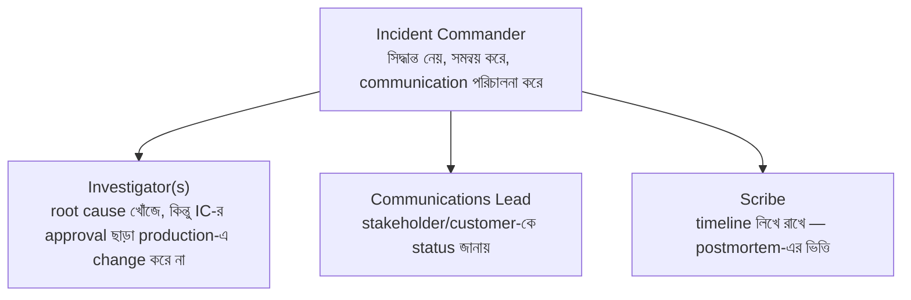

# Module 25 — Production Debugging, Incident Response ও SRE

> **Phase G — Quality, Reliability ও Security** | পূর্বশর্ত: M04, M16, M20, M24
> পরের module: M26 (Security Engineering)

---

## ১. যে incident-এ পাঁচজন ইঞ্জিনিয়ার পাঁচটা ভিন্ন জিনিস ঠিক করছিলেন

M31-এর payment platform-এ একটা বড় incident হলো — checkout flow ধীর, error rate বাড়ছে। পাঁচজন senior engineer সাথে সাথে Slack-এ জড়ো হলেন, প্রত্যেকে তাদের নিজস্ব hypothesis নিয়ে কাজ শুরু করলেন **সমান্তরালে, কোনো সমন্বয় ছাড়া**:

- একজন M07-এর query performance সন্দেহ করে database-এ `EXPLAIN ANALYZE` চালাতে লাগলেন
- একজন M20-এর resource limit সন্দেহ করে সব pod-এর resource request **বাড়িয়ে** দিলেন এবং redeploy করলেন
- একজন M16-এর circuit breaker misconfiguration সন্দেহ করে সেই কনফিগারেশন **বদলে** দিলেন
- একজন M02-এর network issue সন্দেহ করে DNS/connection pool settings টুকটাক **পরিবর্তন** করলেন
- একজন সরাসরি M20-এর কমান্ড দিয়ে কয়েকটা pod **manually restart** করলেন

৪৫ মিনিট পরে, সিস্টেম "ঠিক" হয়ে গেল — কিন্তু **কেউই জানত না কোন পরিবর্তনটা আসলে সমস্যা সমাধান করেছিল**, কারণ পাঁচটা পরিবর্তন প্রায় একসাথে ঘটেছিল। পরের সপ্তাহে ঠিক একই লক্ষণ আবার দেখা দিল — এবং এবার কেউ জানত না কোন "fix" প্রয়োগ করতে হবে, কারণ আগের incident থেকে কোনো নির্ভরযোগ্য শিক্ষা বের করা যায়নি।

এই ঘটনাটা দেখায় কেন M04-M24-এর সব technical knowledge (query optimization, resource tuning, circuit breaker, networking) **যথেষ্ট না** যদি incident response নিজে একটা **disciplined process** না হয়। এই module সেই process-টা কভার করে — কীভাবে technical expertise-কে একটা organized, learnable response-এ রূপান্তর করা যায়, বিশৃঙ্খল সমান্তরাল প্রচেষ্টার বদলে।

---

## ২. Incident Command Structure

### ২.১ ভূমিকা বিভাজন — কেন "সবাই সব কিছু করছে" কাজ করে না



**§১-এর ঘটনার সরাসরি সমাধান:** যদি একজন Incident Commander থাকত, প্রতিটা proposed change (M20-এর resource limit বাড়ানো, M16-এর circuit breaker কনফিগারেশন বদলানো) **IC-র মাধ্যমে coordinate** হতো — একটা সময়ে একটা change, প্রতিটার প্রভাব আলাদাভাবে measure করে। এটা M22-এর CI/CD-এর "একবারে একটা change deploy করো, সমস্যা হলে কোনটা কারণ বোঝা সহজ থাকে" নীতির incident-response সংস্করণ।

### ২.২ Severity Level — Response-এর মাত্রা নির্ধারণ

```
SEV1 (Critical): সম্পূর্ণ outage, বা সব ব্যবহারকারী প্রভাবিত, revenue-critical
                  path down (M31-এর payment processing সম্পূর্ণ বন্ধ)
                  → সব হাতে কাজ, IC বাধ্যতামূলক, executive notification

SEV2 (High): আংশিক outage, নির্দিষ্ট feature/segment প্রভাবিত (M24 §১-এর
             ঘটনার মতো একটা merchant tier)
             → IC recommended, on-call team focus, কিন্তু সব হাতে না

SEV3 (Medium): Degraded performance, workaround আছে, ব্যবসায়িক প্রভাব সীমিত
               → normal working hours-এ address, urgent escalation না

SEV4 (Low): Minor issue, cosmetic, বা internal tool-এ
```

**M31-এর latency budget আলোচনার সাথে সংযোগ:** severity নির্ধারণ M31-এর "critical বনাম non-critical path" শ্রেণীবিভাগের সরাসরি প্রয়োগ — payment processing down হওয়া SEV1, কিন্তু analytics dashboard ধীর হওয়া (M09-এর ClickHouse dependency) হয়তো SEV3, কারণ M31-এর latency budget নীতি অনুযায়ী সেটা non-critical।

> **Senior Tip:** "Severity কে নির্ধারণ করে?" — "প্রথম responder প্রাথমিক severity assign করে (M31-এর business-impact নীতি অনুযায়ী — কতজন প্রভাবিত, কোন critical path), কিন্তু এটা fixed না — IC-র দায়িত্ব হলো নতুন তথ্য আসার সাথে সাথে severity re-evaluate করা (upgrade বা downgrade)। একটা সাধারণ ভুল হলো severity-কে static ধরে নেওয়া — একটা SEV3 হিসেবে শুরু হওয়া issue যদি scope বাড়তে থাকে (M24-এর dimension breakdown দিয়ে ধরা পড়ে), সেটা SEV1-এ upgrade হওয়া উচিত দ্রুত, ego বা 'আমরা তো already কাজ করছি' মানসিকতায় আটকে না থেকে।"

---

## ৩. Blameless Postmortem ও RCA

### ৩.১ কেন "Blameless" — Psychological Safety-র প্রকৌশলগত মূল্য

```
❌ Blame-oriented: "কে এই migration ordering bug (M22 §১) তৈরি করেছিল?"
   → পরিণতি: মানুষ ভবিষ্যতে সমস্যা রিপোর্ট করতে দ্বিধা করে,
      cover-up করার প্রবণতা, শেখা বন্ধ হয়ে যায়

✅ Blameless: "কোন সিস্টেম/প্রক্রিয়া এই ধরনের ভুল করা সহজ করে তুলেছিল,
   এবং কীভাবে সেটা structurally আটকানো যায়?"
   → পরিণতি: M22-এর সমাধান (migration-এর আগে deploy আটকানোর
      automated pipeline check) — মানুষের ভুল প্রতিরোধ করা systemically,
      একজন ব্যক্তিকে দোষ দেওয়ার বদলে
```

**M22 §১-এর ঘটনার blameless RCA-র প্রয়োগ:** সেই migration-ordering incident-এর সঠিক postmortem প্রশ্ন হবে না "কে pipeline-টা ভুলভাবে লিখেছিল," বরং "কেন আমাদের CI/CD review process এই ordering bug ধরতে পারেনি deploy হওয়ার আগে, এবং কী automated check (M22-এর pipeline stage) এই শ্রেণীর bug ভবিষ্যতে প্রতিরোধ করবে?" — এই framing সরাসরি M22-এর সমাধানে (migration-before-deploy enforced ordering) নিয়ে যায়, একজনকে দোষারোপ করার বদলে।

### ৩.২ 5 Whys — Root Cause পর্যন্ত পৌঁছানো

```
Symptom: Checkout API 500 error দিচ্ছিল

Why 1: কেন 500 error? → Database connection timeout
Why 2: কেন connection timeout? → Connection pool (M07-এর PgBouncer) সব
       connection ব্যবহৃত ছিল
Why 3: কেন pool exhausted? → M20-এর নতুন autoscaled pod-রা প্রতিটা নতুন
       connection চাইছিল, pool size fixed ছিল
Why 4: কেন pool size autoscaling-এর সাথে সামঞ্জস্যপূর্ণ ছিল না? → কোনো
       automated coordination ছিল না HPA আর PgBouncer configuration-এর মধ্যে
Why 5: কেন এই coordination gap আগে ধরা পড়েনি? → Load test (M23-এর
       load testing discipline) কখনো autoscaling event-এর সাথে সিমুলেট
       করা হয়নি, শুধু static traffic level-এ
```

**M20 §১-এর ঘটনার সম্পূর্ণ root cause chain এখানে বিস্তারিতভাবে প্রকাশ পেল:** 5 Whys পদ্ধতি M20-এর ঘটনাকে (তিনটা layered কারণ) একটা systematic chain-এ সাজায়, শেষ পর্যন্ত পৌঁছায় একটা **process gap**-এ (M23-এর load testing autoscaling সিমুলেট করেনি) — যেটাই প্রকৃত, actionable fix, শুধু "connection pool size বাড়াও" (একটা surface-level patch) না।

### ৩.৩ Contributing Factors বনাম Root Cause — একটাই কারণ কম বলে

```
M20 §১-এর ঘটনায় একাধিক contributing factor ছিল, কোনো একটা একা "root
cause" ছিল না:
  - Readiness probe অনুপস্থিত (M20 §৩)
  - Resource requests under-provisioned (M20 §৪)
  - PgBouncer pool size fixed, autoscaling-aware না (M07/M20)

একটা ভালো postmortem একটামাত্র "root cause" খোঁজে না — এটা সব
contributing factor চিহ্নিত করে, প্রতিটার জন্য একটা action item তৈরি করে
```

> **Senior Tip:** "Postmortem-এ কতগুলো action item থাকা উচিত?" — "M14-এর over-engineering সতর্কতার postmortem সংস্করণ — খুব কম action item (শুধু 'monitoring বাড়াও') প্রায়ই সমস্যাটার গভীরে যায় না, কিন্তু খুব বেশি action item (২০+ item) কখনো সম্পূর্ণ হয় না, কারণ কোনো owner clearly accountable থাকে না। আমি প্রতিটা contributing factor-এর জন্য একটা specific, ownable, time-bound action item চাই (M22-এর 'automated pipeline check যোগ করো, deadline পরের sprint'), সাধারণ intention ('আরও সতর্ক হবো') না।"

---

## ৪. SLI, SLO, SLA, Error Budget — M31-এর Availability টেবিলের Operational Discipline

### ৪.১ সংজ্ঞা এবং সম্পর্ক

```
SLI (Service Level Indicator): actual measured metric
  (M24-এর RED metric থেকে — "গত ৩০ দিনে আমাদের p99 latency ছিল ২৮০ms")

SLO (Service Level Objective): internal target
  (M31-এর availability table থেকে — "আমরা p99 < 300ms লক্ষ্য রাখি")

SLA (Service Level Agreement): external, contractual commitment
  (সাধারণত SLO-র চেয়ে শিথিল — "আমরা customer-কে p99 < 500ms নিশ্চয়তা দিই")

Error Budget: SLO আর 100%-এর মধ্যে ফারাক
  (যদি SLO 99.9% availability, error budget = 0.1% = মাসে ~৪৩ মিনিট downtime)
```

### ৪.২ Error Budget — Feature Velocity বনাম Reliability-র মধ্যে একটা Objective Trade-off

```
M22-এর deployment velocity আর M16-এর resilience-এর মধ্যে trade-off-কে
error budget একটা measurable সিদ্ধান্তে রূপান্তর করে:

যদি error budget এই মাসে এখনো অনেক অবশিষ্ট (কম incident হয়েছে):
  → টিম দ্রুত ship করতে পারে, M22-এর trunk-based development-এর ঘন
    ঘন deploy-তে ঝুঁকি নেওয়া যুক্তিসঙ্গত

যদি error budget প্রায় শেষ (এই মাসে অনেক incident/downtime হয়েছে):
  → M16-এর conservative approach নেওয়া উচিত — নতুন feature deploy
    কমিয়ে, M23-এর test coverage/M20-এর resilience hardening-এ ফোকাস
```

**M31-এর availability টেবিলের সরাসরি operational প্রয়োগ:** M31 §৩(খ)-এ আমরা availability tier-এর একটা টেবিল দেখেছিলাম (99.9% = ৪৩ মিনিট/মাস downtime)। Error budget সেই সংখ্যাটাকে একটা **চলমান, actionable বাজেট** বানায় — "আমাদের এই মাসে আর কত downtime 'allowed' আছে, এবং সেই অনুযায়ী আমরা কতটা ঝুঁকি নিতে পারি নতুন deploy-এ।"

> **Senior Tip:** "Error budget কে কীভাবে organizational decision-এ ব্যবহার করবেন?" — "সবচেয়ে কার্যকর প্রয়োগ হলো একটা **automatic policy** তৈরি করা, ব্যক্তিগত বিচারের উপর নির্ভর না করে: 'error budget-এর ৫০%-এর কম অবশিষ্ট থাকলে, নতুন feature deploy freeze, শুধু reliability fix চলবে যতক্ষণ না budget পুনরুদ্ধার হয়।' এটা M16-এর circuit breaker নীতির organizational সংস্করণ — একটা automatic, threshold-based সিদ্ধান্ত, প্রতিটা individual deploy-এ manual debate না করে।"

---

## ৫. একটা Systematic Debugging Playbook — M-জুড়ে সবকিছু একসাথে

### ৫.১ প্রথম ৫ মিনিট — Triage, Debug না

```
১. Severity নির্ধারণ (§২.২) — কতজন প্রভাবিত, কোন critical path
২. Incident Commander declare (§২.১) যদি SEV1/SEV2
৩. M20-এর "bleeding থামাও" নীতি — rollback (M22 §৫.১) বিবেচনা করা
   ROOT CAUSE খোঁজার আগে, যদি একটা সাম্প্রতিক deploy সন্দেহজনক হয়
৪. M24-এর dashboard-এ dimension breakdown দেখা (aggregate dilution
   এড়াতে) — কারা প্রভাবিত, কোন pattern
```

### ৫.২ Symptom-থেকে-Layer ম্যাপিং — এই Handbook-এর একটা সংক্ষিপ্তসার

```
লক্ষণ: p99 latency spike, p50 স্বাভাবিক
  → M31 §৯ প্রশ্ন ২ — tail latency, contention/queueing সন্দেহ,
    resource saturation (M24-এর USE method) দেখা

লক্ষণ: সব request ধীর, CPU/memory স্বাভাবিক
  → M02-এর connection/network issue, বা M07-এর lock contention,
    py-spy dump (M04 §১৩) দিয়ে worker কোথায় আটকে আছে দেখা

লক্ষণ: Container OOMKilled, application profiling clean
  → M19 §১ — cgroup memory accounting সম্পূর্ণ ভিন্ন কিছু ধরছে
    (tmpfs, page cache), শুধু Python heap না

লক্ষণ: Deploy-এর পর latency/error spike
  → M22 §১-এর migration ordering, অথবা M20 §৩-এর readiness probe
    অনুপস্থিত, rollback প্রথম পদক্ষেপ (root cause পরে)

লক্ষণ: নির্দিষ্ট downstream dependency slow, capacity গায়েব হয়ে যাচ্ছে
  → M16-এর cascading failure — circuit breaker আছে কি না, bulkhead
    sizing সঠিক কি না (M16 §১১ প্রশ্ন ৩)

লক্ষণ: DB query হঠাৎ ধীর, কোড অপরিবর্তিত
  → M07 §১১-এর প্রশ্ন ২ — statistics stale, data volume/distribution
    বদলেছে, EXPLAIN (ANALYZE, BUFFERS) দিয়ে যাচাই

লক্ষণ: Rate limit/protection কাজ করছে না, distributed environment
  → M06 §১৪-এর প্রশ্ন ৪ — LocMemCache বনাম shared Redis backend

লক্ষণ: একটা নির্দিষ্ট segment-এর সমস্যা, dashboard সবুজ
  → M24 §১-এর aggregate dilution, dimension breakdown প্রয়োজন
```

**এই টেবিলের উদ্দেশ্য:** একটা experienced engineer-এর মাথায় যা "instinct" হিসেবে কাজ করে (একটা লক্ষণ দেখেই কোথায় দেখতে হবে বোঝা), সেটাকে একটা explicit, learnable structure-এ রূপান্তর করা — M31-এর payment system-এর প্রতিটা module জুড়ে ছড়িয়ে থাকা debugging জ্ঞানকে একটা single reference point-এ নিয়ে আসা।

### ৫.৩ py-spy/EXPLAIN/kubectl — M04/M07/M20-এর Toolkit একত্রে

```bash
# Application-level — M04 §১৩
kubectl exec -it <pod> -- py-spy dump --pid 1

# Database-level — M07 §৬.২
EXPLAIN (ANALYZE, BUFFERS) <query>;
SELECT pid, now()-query_start AS dur, wait_event_type, query
FROM pg_stat_activity WHERE state != 'idle' ORDER BY dur DESC LIMIT 20;

# Container/cluster-level — M19/M20
kubectl describe pod <pod-name>
kubectl top pod
cat /sys/fs/cgroup/memory.stat

# Network-level — M02
curl -w "@curl-format.txt" -o /dev/null -s https://api.example.com/health
ss -tan state time-wait | wc -l
```

**এই চারটা কমান্ড category-ই এই handbook-এর চারটা মূল layer-কে প্রতিনিধিত্ব করে (application, database, infrastructure, network)** — একটা systematic incident response-এ, এই ক্রমে (application → database → infrastructure → network, অথবা লক্ষণ অনুযায়ী উল্টো) চেক করলে দ্রুত সঠিক layer-এ পৌঁছানো যায়, random guess-এর বদলে।

---

## ৬. On-Call Health ও Runbook

### ৬.১ Runbook — M-জুড়ে জ্ঞানকে Actionable করা

```markdown
# Runbook: Payment API High Error Rate

## লক্ষণ
- error_rate{service="payment-api"} > 1% for 5m

## প্রথম পদক্ষেপ (৫ মিনিটের মধ্যে)
1. M24-এর dashboard-এ merchant_tier breakdown দেখুন — সব tier
   প্রভাবিত, নাকি নির্দিষ্ট একটা?
2. সাম্প্রতিক deploy আছে কি না (গত ৩০ মিনিটে)? থাকলে M22 §৫.১-এর
   rollback বিবেচনা করুন
3. M07-এর pg_stat_activity চেক করুন — DB-level সমস্যা কি না

## Escalation
- যদি ১৫ মিনিটে সমাধান না হয় → payment-team-lead-কে page করুন
- যদি SEV1 নিশ্চিত হয় → IC declare করুন (§২.১)

## সম্পর্কিত Runbook
- Database Connection Pool Exhaustion (M07 §৮)
- Circuit Breaker Investigation (M16 §৪)
```

**M08-এর "backup restore টেস্ট না করলে সেটা backup না" নীতির runbook সংস্করণ:** একটা runbook যা কখনো ব্যবহার/test হয়নি (একটা "tabletop exercise" বা প্রকৃত incident-এ) সেটা M08-এর untested backup-এর মতোই একটা অনুমান, guarantee না — নতুন on-call engineer-এর জন্য incident-এর মাঝখানে প্রথমবার runbook পড়া আদর্শ না।

### ৬.২ On-Call Health — একটা Systemic, ইঞ্জিনিয়ারিং সমস্যা

```
On-call burden বেশি হওয়া প্রায়ই একটা লক্ষণ, কারণ না — M-জুড়ে যা শেখা
হয়েছে তার প্রায়োগিক প্রয়োগ:

উচ্চ page frequency → M16-এর resilience pattern অনুপস্থিত/অপর্যাপ্ত
  (সব downstream failure মানুষকে জাগাচ্ছে, circuit breaker/fallback
  থাকলে অনেকগুলো self-heal করত)

একই ধরনের incident বারবার → M25 §৩-এর postmortem action item সম্পূর্ণ
  হয়নি, বা root cause সঠিকভাবে address হয়নি (শুধু symptom patch)

Runbook ছাড়া alert → M25 §৬.১-এর gap, প্রতিটা alert-এর একটা
  actionable runbook থাকা উচিত ("alert fired" শুধু, "কী করতে হবে" ছাড়া
  একটা incomplete alert)
```

> **Senior Tip:** "On-call burnout কীভাবে কমাবেন engineering perspective থেকে?" — "On-call rotation বাড়ানো একটা সাময়িক relief, কিন্তু প্রকৃত সমাধান M16-এর resilience investment-এ — প্রতিটা 3am page একটা signal যে কোথাও একটা automatic recovery mechanism (M16-এর circuit breaker, M20-এর automated rollback M22 §৫.৩) অনুপস্থিত। আমি on-call page frequency-কে M24-এর একটা metric হিসেবে ট্র্যাক করি এবং সেটাকে reliability engineering-এর একটা প্রাধান্যের সংকেত হিসেবে ব্যবহার করি — 'আমরা কোন page-টাকে automation দিয়ে eliminate করতে পারতাম' প্রতিটা sprint retrospective-এর একটা নিয়মিত প্রশ্ন হওয়া উচিত।"

---

## ৭. High Availability ও Fault Tolerance — সবকিছুর সংশ্লেষণ

```
M08-এর Patroni (database HA)
+ M13-এর quorum queue (message broker HA)
+ M16-এর circuit breaker/bulkhead (application-level resilience)
+ M17-এর service isolation (blast radius সীমিত)
+ M20-এর pod anti-affinity/PDB (infrastructure HA)
+ M21-এর multi-AZ (physical infrastructure redundancy)
+ M22-এর automated rollback (deployment-level self-healing)
= একটা সম্পূর্ণ, layered HA architecture
```

**এই সংশ্লেষণ M16-এর "defense in depth" নীতির চূড়ান্ত প্রকাশ:** কোনো একটা layer একা "HA" প্রদান করে না — M31-এর payment platform-এর প্রকৃত availability এই সব layer-এর সম্মিলিত ফলাফল, প্রতিটা ভিন্ন failure mode-এর বিরুদ্ধে সুরক্ষা দিচ্ছে (database crash, network partition, downstream slowdown, bad deploy, node failure, AZ outage) — এবং একটা ভালো incident response process (এই module) নিশ্চিত করে যখন এই সব layer-এর কোনো একটা তবুও ব্যর্থ হয় (কারণ কোনো সিস্টেম নিখুঁত না, M15-এর FLP impossibility-র বাস্তবতা), মানুষ দ্রুত, systematically, এবং শিক্ষার সাথে সাড়া দিতে পারে।

---

## ৮. Interview Section

### প্রশ্ন ১ (Senior) — "একটা incident-এ পাঁচজন engineer সমান্তরালে ভিন্ন ভিন্ন জিনিস debug/fix করার চেষ্টা করছেন। এটা কি ভালো, দ্রুত সমাধানের জন্য?"

**❌ Wrong Answer**
> "হ্যাঁ, বেশি মানুষ মানে দ্রুত সমাধান।"

**🌟 Senior/Staff Answer**
> "না, এটা প্রায়ই পাল্টা ফলদায়ক, এবং এটা M25-এর একটা বাস্তব ঘটনার মূল কারণ ছিল — সমন্বয়হীন সমান্তরাল প্রচেষ্টা তিনটা সমস্যা তৈরি করে। প্রথমত, একাধিক পরিবর্তন একসাথে হলে **কোনটা সমাধান করেছে বোঝা যায় না** — যদি পাঁচটা change একসাথে ঘটে আর সিস্টেম ঠিক হয়ে যায়, পরের বার একই সমস্যায় কী করতে হবে জানা যায় না, কারণ কোনো নির্ভরযোগ্য causal knowledge তৈরি হয়নি। দ্বিতীয়ত, সমান্তরাল, uncoordinated production change নিজেই **নতুন ঝুঁকি** তৈরি করতে পারে — একজনের পরিবর্তন আরেকজনের debugging-কে বিভ্রান্ত করতে পারে (M20-এর resource limit বাড়ানো ঠিক তখনই যখন অন্য একজন সেই resource-এর behavior পর্যবেক্ষণ করছিল)। তৃতীয়ত, এটা M25-এর blameless postmortem-এর ভিত্তি নষ্ট করে — একটা স্পষ্ট timeline ছাড়া, root cause analysis অসম্ভব হয়ে যায়।
>
> সঠিক approach হলো একটা Incident Commander structure (M25 §২.১) — একজন সমন্বয় করে, প্রতিটা proposed change IC-র মাধ্যমে যায়, একবারে একটা change apply হয় এবং তার প্রভাব measure করা হয় পরেরটার আগে। এটা ধীর মনে হতে পারে তাৎক্ষণিকভাবে, কিন্তু M22-এর 'একবারে একটা deploy, causally traceable' নীতির incident-response সংস্করণ — দীর্ঘমেয়াদে দ্রুততর, কারণ প্রতিটা incident থেকে প্রকৃত শিক্ষা বের করা যায়, পরের বার দ্রুত সমাধানের সুযোগ তৈরি করে।"

---

### প্রশ্ন ২ (Staff / Architecture) — "আমাদের error budget এই মাসে শেষ হয়ে গেছে (অনেক incident হয়েছে)। Product team একটা বড় feature launch করতে চাইছে সময়মতো। কী করবেন?"

**🌟 Senior/Staff Answer**
> "এটা M25-এর error budget নীতির একটা প্রকৃত পরীক্ষা — নীতিটা তখনই মূল্যবান যখন এটা একটা কঠিন, বাস্তব ব্যবসায়িক চাপের বিরুদ্ধে দাঁড়ায়, শুধু তাত্ত্বিক আলোচনায় সহজ থাকা অবস্থায় না।
>
> আমার অবস্থান হবে: error budget একটা **pre-agreed, organizational policy** হওয়া উচিত (M16-এর fail-open/fail-closed সিদ্ধান্তের মতো, engineering একা না, business-এর সাথে আগে থেকে সম্মত), তাই এই মুহূর্তে সেই নীতি প্রয়োগ করা একটা নতুন, বিতর্কিত সিদ্ধান্ত না — এটা একটা আগে থেকে সম্মত commitment মেনে চলা।
>
> কিন্তু আমি সরাসরি 'না' বলার বদলে ডেটা নিয়ে আসব: এই মাসে কতগুলো incident হয়েছে, কী কারণে (M25 §৩-এর postmortem থেকে contributing factor), আর এই নতুন feature launch যদি একই ধরনের ঝুঁকি বহন করে (M23-এর অপর্যাপ্ত test coverage সহ একটা নতুন, জটিল feature) কিনা। যদি প্রকৃত ঝুঁকি বেশি হয়, আমি একটা compromise প্রস্তাব করব — feature-টা M22-এর feature flag দিয়ে ship করা যায় কিন্তু ধীরে ধীরে rollout (§৬.২-এর progressive delivery, M20-এর canary), যাতে যদি এটা নতুন সমস্যা তৈরি করে, blast radius সীমিত থাকে এবং দ্রুত বন্ধ করা যায়, পুরো error budget আরও বেশি না খেয়ে।
>
> **যদি product team এখনো জোর দেয়**, আমি এটাকে একটা explicit, documented ব্যবসায়িক সিদ্ধান্ত বানাব (একটা risk acceptance sign-off), যাতে যদি এই launch নতুন incident তৈরি করে, সেটা একটা 'ইঞ্জিনিয়ারিং ব্যর্থতা' হিসেবে postmortem-এ না এসে একটা conscious trade-off হিসেবে দেখা হয় — M16-এর graceful degradation-এর business-decision নীতির error-budget সংস্করণ।"

---

### প্রশ্ন ৩ (Scenario / Debugging) — "M25 §৫.২-এর symptom-to-layer টেবিল ব্যবহার করে, বর্ণনা করুন কীভাবে ডিবাগ করবেন: 'p99 latency ৫ সেকেন্ড, p50 স্বাভাবিক ৫০ms, deploy সাম্প্রতিক না, CPU/memory স্বাভাবিক।'"

**🌟 Senior/Staff Answer**
> "এই combination-টা M25 §৫.২-এর নির্দিষ্ট patterns-এর সাথে মেলে — p50 ভালো কিন্তু p99 খারাপ, resource metric স্বাভাবিক, deploy সন্দেহভাজন না। এটা M31 §৯-এর তুলনামূলক প্রশ্নের সরাসরি প্রয়োগ।
>
> **আমার debugging ক্রম:**
>
> ১. **M24-এর distributed tracing** — একটা slow request-এর trace waterfall দেখব (error-biased sampling নিশ্চিত করে slow trace capture হচ্ছে)। যদি একটা নির্দিষ্ট span (M16-এর fraud service call-এর মতো) consistently ধীর p99-এ, সেটাই প্রথম সন্দেহ।
>
> ২. **M07-এর `pg_stat_activity`** — lock contention/long-running query আছে কি না, যেটা শুধু নির্দিষ্ট request pattern-এ ঘটে (M07-এর isolation-level related issue, বিশেষ row-তে contention)।
>
> ৩. **M02-এর connection pool saturation** — যদি M24-এর USE method-এর Saturation metric দেখা না গিয়ে থাকে dashboard-এ (M20 §১-এর ঘটনার মতো), এখনই সেটা explicit চেক করব — `pool.utilization`/`pool.wait_time` metric।
>
> ৪. **M04-এর `py-spy dump`** — যদি উপরের কোনোটা স্পষ্ট উত্তর না দেয়, worker-level এ কোথায় সময় যাচ্ছে সরাসরি দেখা, বিশেষত যদি এটা একটা GC pause বা lock contention-এর মতো কিছু যা metric-এ সরাসরি দেখা যায় না কিন্তু process-level এ visible।
>
> **আমার hypothesis, ক্রম অনুযায়ী সবচেয়ে সম্ভাব্য:** যেহেতু CPU/memory স্বাভাবিক এবং শুধু tail affected, এটা প্রায়ই **contention/queueing** সমস্যা — M31-এর Little's Law নীতি (concurrency fixed, কিছু request একটা limited resource-এর জন্য অপেক্ষা করছে) — connection pool, একটা specific lock, বা একটা downstream dependency যার নিজস্ব p99 আমাদের p99-এ propagate হচ্ছে (M16-এর tail latency amplification, M17 §১০-এর multi-service chain-এর একটা upstream-এ)।"

---

### প্রশ্ন ৪ (Architecture Decision) — "আমাদের একটা automated rollback system আছে (M22 §৫.৩), কিন্তু টিম জিজ্ঞেস করছে এটা কি postmortem process-কে অপ্রয়োজনীয় করে দেয় — যদি automation নিজেই সমস্যা সমাধান করে, কেন human review দরকার?"

**🌟 Senior/Staff Answer**
> "এটা একটা গুরুত্বপূর্ণ ভুল ধারণা যা M22 §৮-এর interview প্রশ্ন ২-তেও উল্লেখ করা হয়েছিল — automated rollback **symptom-level mitigation**, root cause resolution না। এই দুইটা সম্পূর্ণ ভিন্ন জিনিস, এবং একটা থাকলে আরেকটা অপ্রয়োজনীয় হয় না, বরং **postmortem-এর গুরুত্ব বেড়ে যায়**।
>
> কারণ: automated rollback দ্রুত symptom সরিয়ে দেয় (M16-এর circuit breaker-এর মতো), কিন্তু underlying issue (M22-এর একটা bad migration, বা একটা নতুন code path-এ একটা bug) **এখনো বিদ্যমান** — শুধু rollback-এর কারণে এখন invisible। যদি postmortem না করা হয়, সেই একই bug **পরের deploy attempt-এ আবার একই automated rollback trigger করবে** — এবং এটা একটা loop তৈরি করতে পারে যেখানে টিম কখনো forward progress করতে পারছে না, প্রতিটা deploy attempt automatically rollback হচ্ছে, কারণ কেউ কখনো root cause ঠিক করছে না।
>
> এছাড়া, automated rollback নিজে false positive দিতে পারে (M22 §৮-এর interview প্রশ্ন ২-এর ঝুঁকি) — একটা postmortem review প্রক্রিয়া (এমনকি একটা lightweight version, প্রতিটা automated rollback event-এর জন্য) সেই false positive দ্রুত ধরে এবং threshold tune করে।
>
> **আমার সুপারিশ:** automation আর human review-কে complementary হিসেবে দেখা, একটা replace-এর সম্পর্ক না। প্রতিটা automated rollback একটা **mandatory, lightweight postmortem trigger** করা উচিত (M25 §৩-এর সম্পূর্ণ blameless RCA process না হলেও, অন্তত একটা quick root-cause note) — এটা M08-এর 'backup আছে মানেই safe না, restore test করা লাগে' নীতির automation সংস্করণ: 'automated recovery আছে মানেই সমস্যা সমাধান হলো না, root cause address করা লাগে।'"

---

## ৯. হাতে-কলমে অনুশীলন

**১ — Incident simulation drill (৪৫ মিনিট, টিম exercise)**
একটা কাল্পনিক incident scenario লিখুন (M20 §১-এর ঘটনার মতো, multi-layer)। একজন IC নিয়োগ করুন, বাকিরা investigator/comms/scribe ভূমিকা নিয়ে roleplay করুন। M25 §৫.২-এর symptom-to-layer টেবিল ব্যবহার করে debugging path অনুসরণ করুন।

**২ — 5 Whys অনুশীলন (৩০ মিনিট)**
আপনার নিজের প্রজেক্টের একটা প্রকৃত (বা কাল্পনিক) bug/incident নিয়ে 5 Whys চালান, M25 §৩.২-এর pattern অনুসরণ করে। শেষ "why"-টা একটা process/system gap-এ পৌঁছায় কি না দেখুন, শুধু একটা code bug-এ না।

**৩ — Error budget calculation (২০ মিনিট)**
আপনার প্রজেক্টের SLO (বা M31-এর 99.9% উদাহরণ) নিয়ে, গত মাসের actual downtime দিয়ে error budget ব্যবহার হিসাব করুন — কত % অবশিষ্ট, এবং সেই অনুযায়ী deployment policy কী হওয়া উচিত।

**৪ — Runbook লিখুন (৩০ মিনিট)**
M25 §৬.১-এর template ব্যবহার করে আপনার নিজের প্রজেক্টের একটা সাধারণ alert-এর জন্য একটা runbook লিখুন — লক্ষণ, প্রথম পদক্ষেপ, escalation path, সম্পর্কিত runbook।

---

## ১০. মূল কথা

1. **সমান্তরাল, uncoordinated debugging পাল্টা ফলদায়ক** — Incident Commander structure নিশ্চিত করে একবারে একটা change, causally traceable ফলাফল।
2. **Severity dynamic, static না** — নতুন তথ্যের সাথে re-evaluate করতে হবে, upgrade/downgrade উভয় দিকে।
3. **Blameless postmortem "কে" প্রশ্ন করে না, "কোন সিস্টেম/প্রক্রিয়া" প্রশ্ন করে** — psychological safety শুধু নৈতিক ভালোত্ব না, এটা ভবিষ্যতের সমস্যা রিপোর্ট হওয়া নিশ্চিত করে।
4. **5 Whys root cause-এ পৌঁছায় (প্রায়ই একটা process gap), শুধু surface symptom-এ না।**
5. **একাধিক contributing factor সাধারণ, একটাই "root cause" খোঁজা প্রায়ই ভুল ফ্রেমিং।**
6. **Error budget M31-এর availability tier-কে একটা চলমান, actionable organizational policy-তে রূপান্তর করে** — feature velocity বনাম reliability-র মধ্যে একটা objective trade-off mechanism।
7. **Symptom-to-layer mapping (M25 §৫.২) এই handbook-এর সব module-কে একটা systematic debugging playbook-এ সংশ্লেষিত করে** — instinct-কে learnable structure-এ রূপান্তর।
8. **Runbook untested হলে একটা অনুমান, guarantee না** — M08-এর backup drill নীতির incident-response সংস্করণ।
9. **On-call burden একটা লক্ষণ, কারণ না** — উচ্চ page frequency M16-এর resilience investment-এর অভাব নির্দেশ করে, শুধু rotation বাড়ানো root cause address করে না।
10. **Automated rollback root cause resolution প্রতিস্থাপন করে না** — প্রতিটা automated recovery event এখনো একটা postmortem trigger করা উচিত, নাহলে একই bug বারবার একই automated response trigger করবে।

---

## পরের Module

**M26 — Security Engineering।** আজ আমরা দেখলাম কীভাবে সিস্টেম ব্যর্থ হয় এবং কীভাবে সাড়া দিতে হয় — কিন্তু বেশিরভাগ ফোকাস ছিল accidental failure-এ (bug, misconfiguration, resource exhaustion)। পরের module-এ আমরা **ইচ্ছাকৃত ব্যর্থতা**-র দিকে যাব — যখন কেউ সক্রিয়ভাবে সিস্টেম ভাঙার চেষ্টা করে। JWT-র প্রকৃত বিপদ, OWASP Top 10 (M06-এর webhook SSRF ঝুঁকির সম্পূর্ণ প্রেক্ষাপট সহ), secrets management (M21-এর IAM নীতির সম্প্রসারণ), আর threat modeling — এই handbook-এর সব architectural সিদ্ধান্তকে একটা adversarial দৃষ্টিকোণ থেকে পুনর্বিবেচনা করা।
