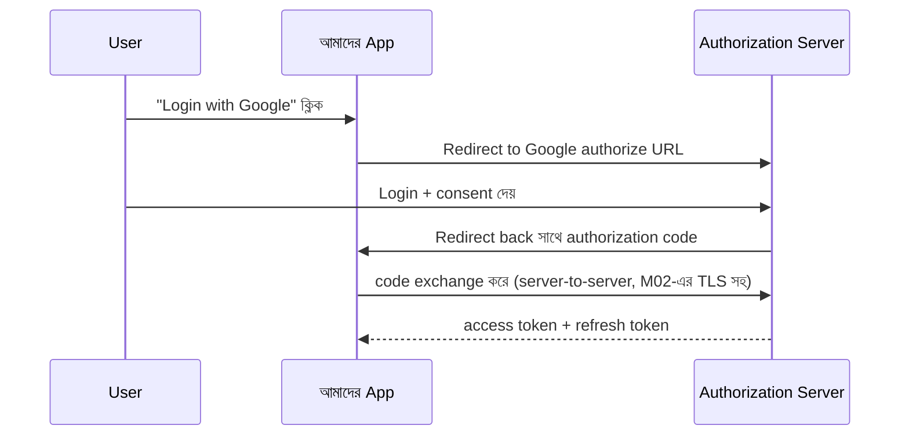

# Module 26 — Security Engineering

> **Phase G — Quality, Reliability ও Security** | পূর্বশর্ত: M06, M21, M25
> পরের module: M27 (Real-Time Systems) — Phase H শুরু

---

## ১. যে webhook endpoint-টা AWS credential leak করে দিয়েছিল

M06 §১৩-এর interview প্রশ্ন ৫-এ আমরা একটা webhook delivery function দেখেছিলাম যেখানে ছয়টা সমস্যা ছিল — timeout না থাকা, session না থাকা, SSRF ঝুঁকি, signature না থাকা, retry না থাকা, আর status code check খুব কড়া। সেই সময় আমরা SSRF ঝুঁকিটা সংক্ষেপে উল্লেখ করেছিলাম — এখন সেই ঘটনাটার একটা সম্পূর্ণ, বাস্তব পরিণতি দেখা যাক।

M31-এর payment platform-এ একটা feature ছিল — merchant নিজের webhook URL কনফিগার করতে পারত ("payment succeed হলে এই URL-এ notify করো")। একটা attacker merchant হিসেবে সাইন আপ করে তাদের webhook URL সেট করল:

```
http://169.254.169.254/latest/meta-data/iam/security-credentials/payment-service-role
```

এটা AWS-এর **instance metadata service** endpoint — EC2/ECS instance-এর ভেতর থেকে accessible, এবং কোনো authentication ছাড়াই সেই instance-এর IAM role-এর **temporary AWS credentials** ফেরত দেয়। যদি M06-এর webhook delivery function সরাসরি merchant-এর দেওয়া URL-এ request পাঠায় কোনো validation ছাড়া (M06-এর কোডে যেমন ছিল), সেই request payment-service-এর নিজস্ব network-এর ভেতর থেকে যাবে — attacker-এর browser থেকে না, বরং **আমাদের নিজস্ব সার্ভার থেকে**।

Response body (যেটা normally merchant-এর server-এ যেত) যদি merchant dashboard-এ echo হয় (কোনো লগ বা debug view-তে), attacker সরাসরি payment-service-এর IAM credential দেখতে পাবে — যা দিয়ে তারা S3 bucket (M08-এর invoice storage), RDS (M07-এর payment database) access করার চেষ্টা করতে পারে, IAM policy-র scope অনুযায়ী (M21-এর least privilege নীতি এখানে defense-এর শেষ স্তর হয়ে দাঁড়ায়)।

এই ঘটনাটা — **Server-Side Request Forgery (SSRF)** — এই module-এর একটা কেন্দ্রীয় উদাহরণ, কারণ এটা দেখায় কীভাবে M06-এর "সরল" webhook feature, M21-এর cloud infrastructure, আর M08-এর data access সব একসাথে একটা single vulnerability-তে মিলিত হতে পারে।

---

## ২. OWASP Top 10 — M-জুড়ে যা ইতিমধ্যে স্পর্শ করা হয়েছে, এখন সম্পূর্ণ

### ২.১ SSRF — §১-এর ঘটনার সমাধান

```python
import ipaddress
from urllib.parse import urlparse

# M06-এর AWS metadata endpoint সহ সব known-dangerous range
BLOCKED_NETWORKS = [
    ipaddress.ip_network("169.254.169.254/32"),   # AWS/GCP/Azure metadata
    ipaddress.ip_network("127.0.0.0/8"),            # localhost
    ipaddress.ip_network("10.0.0.0/8"),             # M21-এর private VPC range
    ipaddress.ip_network("172.16.0.0/12"),
    ipaddress.ip_network("192.168.0.0/16"),
]

def validate_webhook_url(url: str) -> str:
    parsed = urlparse(url)
    if parsed.scheme not in ("https",):   # ⚠️ শুধু HTTPS, http:// না
        raise ValueError("শুধু HTTPS webhook URL অনুমোদিত")

    # DNS resolve করে actual IP চেক করা — hostname whitelist যথেষ্ট না,
    # কারণ attacker একটা hostname বানাতে পারে যা resolve হয় 169.254.169.254-এ
    resolved_ip = socket.gethostbyname(parsed.hostname)
    ip_obj = ipaddress.ip_address(resolved_ip)

    for network in BLOCKED_NETWORKS:
        if ip_obj in network:
            raise ValueError("এই URL অনুমোদিত না")

    return url
```

**M06-এর মূল কোডের সম্পূর্ণ ফিক্স, এখন explicit:** শুধু URL-এর **hostname** whitelist করা যথেষ্ট না — DNS resolution-এর **পরে**, actual IP address চেক করতে হবে (M02 §৬-এর DNS internals-এর security প্রয়োগ), কারণ একটা attacker একটা সাধারণ দেখতে domain (`evil.com`) DNS-এ configure করতে পারে যা resolve হয় `169.254.169.254`-এ — hostname-level filtering সেটা ধরবে না।

```python
webhook_session.post(
    url, data=body,
    timeout=(3.05, 10),
    allow_redirects=False,   # ⚠️ M06-এ উল্লেখ করা হয়েছিল, এখন কারণ স্পষ্ট —
                              #    একটা "নিরাপদ" URL redirect করতে পারে একটা
                              #    বিপজ্জনক internal URL-এ, validation বাইপাস করে
)
```

### ২.২ SQL Injection — M07-এর ORM কীভাবে সুরক্ষা দেয়, এবং কোথায় দেয় না

```python
# ✅ Django ORM নিজে থেকে parameterized query ব্যবহার করে
Payment.objects.filter(merchant_id=user_input)   # নিরাপদ — ORM automatically escape করে

# ❌ Raw SQL-এ string formatting — M07 §৬.২-এর EXPLAIN debugging-এ যেমন raw SQL
#    দেখিয়েছিলাম, সেখানেও এই বিপদ প্রযোজ্য
Payment.objects.raw(f"SELECT * FROM payment WHERE merchant_id = {user_input}")   # বিপজ্জনক!

# ✅ Raw SQL হলেও parameterized
Payment.objects.raw("SELECT * FROM payment WHERE merchant_id = %s", [user_input])
```

**M07-এর query optimization আলোচনার একটা security প্রেক্ষাপট:** M07-এ আমরা `EXPLAIN`-এ raw SQL দেখেছিলাম performance debug করতে। যদি কোনো developer সেই debugging habit থেকে production code-এ raw SQL string formatting নিয়ে আসে (M07-এর index optimization-এর মতো একটা legitimate কারণে), SQL injection ঝুঁকি তৈরি হয় — Django ORM-এর automatic parameterization-এর সুরক্ষা হারিয়ে যায়।

### ২.৩ XSS — M06-এর API Response-এ কম প্রাসঙ্গিক, কিন্তু কোথায় আসে

```python
# API-only backend-এ (M31-এর DRF-based payment API) XSS ঝুঁকি সরাসরি কম,
# কারণ JSON response browser render করে না সরাসরি HTML হিসেবে

# ⚠️ কিন্তু M31-এর merchant dashboard (server-rendered অংশ থাকলে) এ ঝুঁকি ফিরে আসে
   {# ⚠️ Django ডিফল্ট — কখনো off করবেন না ব্যবহারকারীর data-তে #}
    {{ merchant.name }}   {# স্বয়ংক্রিয়ভাবে escape হয় #}


# ❌ বিপজ্জনক — mark_safe ব্যবহারকারীর input-এ
merchant_name_html = mark_safe(f"<span>{merchant.name}</span>")   # যদি merchant.name-এ
                                                                     # <script> থাকে, XSS
```

**M18-এর Anti-Corruption Layer নীতির সাথে সংযোগ:** merchant-এর দেওয়া data (M18-এর external system input-এর মতোই একটা "untrusted boundary") কখনো সরাসরি HTML-এ inject করা উচিত না — Django-র autoescape ডিফল্টে এটা করে, কিন্তু `mark_safe`/`|safe` filter দিয়ে সেই সুরক্ষা bypass করা যায়, এবং সেটা শুধু তখনই করা উচিত যখন content সত্যিই trusted (M18-এর "conformist" বনাম "anti-corruption" সিদ্ধান্তের মতো, সাবধানে নেওয়া)।

### ২.৪ CSRF — M02-এর Cookie/Session আলোচনার সম্প্রসারণ

```python
# settings.py
CSRF_COOKIE_SECURE = True       # M02-এর HTTPS নীতি
CSRF_COOKIE_HTTPONLY = False    # ⚠️ CSRF token-এর জন্য JS access প্রয়োজন হতে পারে
                                  #    (SPA-তে header-এ পাঠাতে), সাধারণ session cookie-র
                                  #    থেকে ভিন্ন প্রয়োজন
SESSION_COOKIE_SAMESITE = "Lax"  # M05 §১০.১-এ আমরা এটা দেখেছিলাম — CSRF-এর একটা স্তর
```

**M05 §১০.১-এর session cookie hardening-এর সম্পূর্ণ প্রেক্ষাপট:** CSRF attack ঘটে যখন একজন authenticated user একটা malicious site visit করে যা তাদের browser-এর automatically-sent cookie ব্যবহার করে আমাদের site-এ একটা unwanted action trigger করে। `SameSite=Lax` cookie cross-site request-এ পাঠানো বন্ধ করে (বেশিরভাগ ক্ষেত্রে) — M05-এ যে সেটিং আমরা "session hardening" হিসেবে দেখেছিলাম, সেটাই এখানে CSRF-এর প্রাথমিক প্রতিরক্ষা।

### ২.৫ IDOR — M06-এর `has_object_permission` সতর্কতার সম্পূর্ণ নাম

```
IDOR (Insecure Direct Object Reference) = M06 §৫.২-এর সেই ঘটনা —
"has_object_permission() list()-এ চলে না" — এর প্রকৃত নিরাপত্তা নাম।
```

**M06-এর interview প্রশ্ন ২-এর সম্পূর্ণ security শ্রেণীবিভাগ:** সেই ঘটনায় একজন tenant অন্য tenant-এর data দেখতে পারছিল কারণ `get_queryset()` tenant filter করছিল না। এটা IDOR-এর একটা classic উদাহরণ — object ID (URL-এ, বা query parameter-এ) সরাসরি ব্যবহার করে কোনো ownership/permission check ছাড়া। M06-এর সমাধান (সবসময় `get_queryset()`-এ filter করা, permission class-এর উপর একা ভরসা না করা) এখনো IDOR-এর সবচেয়ে সাধারণ, ব্যবহারিক প্রতিরোধ।

---

## ৩. JWT — প্রকৃত বিপদ

### ৩.১ Session বনাম JWT — M05-এর তুলনার সম্পূর্ণ প্রেক্ষাপট

M05 §১০.১-এ আমরা বলেছিলাম session cookie-তে শুধু একটা random key থাকে, actual data server-side — "JWT-র বিপরীত।" এখন সেই বিপরীততার প্রকৃত ঝুঁকি:

```
Session: server যেকোনো সময় invalidate করতে পারে (logout, ban) —
         M05-এর সেই সুবিধা

JWT: token নিজেই সব data বহন করে (self-contained), signature দিয়ে
     verified — কিন্তু একবার issued হলে, সেই token তার নিজের expiry
     পর্যন্ত বৈধ থাকে, server চাইলেও তাৎক্ষণিকভাবে বাতিল করতে পারে না
     (একটা blocklist maintain না করলে, যেটা আবার session-এর মতোই
     server-side state রাখা — JWT-র "stateless" সুবিধা হারিয়ে যায়)
```

### ৩.২ Algorithm Confusion Attack

```python
# ❌ বিপজ্জনক — client-এর পাঠানো algorithm blindly trust করা
import jwt
payload = jwt.decode(token, options={"verify_signature": False})  # শুধু দেখতে!
alg = payload.get("alg")   # attacker "none" বা RS256→HS256 confusion পাঠাতে পারে

decoded = jwt.decode(token, key, algorithms=[alg])   # ⚠️ attacker-নিয়ন্ত্রিত algorithm ব্যবহার!

# ✅ সঠিক — server নিজে algorithm নির্ধারণ করে, token থেকে কখনো নেয় না
decoded = jwt.decode(token, public_key, algorithms=["RS256"])   # ⚠️ explicit, hardcoded
```

**কেন এটা বিপজ্জনক:** যদি একটা সিস্টেম RS256 (asymmetric — public/private key pair) ব্যবহার করে কিন্তু token-এর `alg` header থেকে algorithm নেয়, একজন attacker `alg: HS256` (symmetric, একটা shared secret) পাঠাতে পারে এবং **public key-কেই HMAC secret হিসেবে ব্যবহার করে** একটা forged token সাইন করতে পারে — কারণ public key জনসাধারণের কাছে জানা (এটাই "public" key-র সংজ্ঞা)। এটা M07-এর "database constraint bypass-অসম্ভব হওয়া উচিত" নীতির সরাসরি লঙ্ঘনের একটা উদাহরণ — algorithm নির্ধারণ কখনো client-নিয়ন্ত্রিত input-এর উপর নির্ভর করা উচিত না।

### ৩.৩ Refresh Token Rotation

```python
def refresh_access_token(refresh_token):
    payload = verify_refresh_token(refresh_token)

    # ⚠️ M31-এর idempotency key pattern-এর নিরাপত্তা প্রয়োগ — প্রতিটা refresh
    #    token একবারই ব্যবহারযোগ্য, ঠিক M31-এর idempotency key-র মতো
    if RefreshToken.objects.filter(token_hash=hash_token(refresh_token), used=True).exists():
        # ⚠️ একটা ব্যবহৃত refresh token আবার ব্যবহারের চেষ্টা —
        #    সম্ভাব্য token theft, সব token revoke করো
        revoke_all_tokens_for_user(payload["user_id"])
        raise SecurityException("Refresh token reuse detected")

    new_access = generate_access_token(payload["user_id"])
    new_refresh = generate_refresh_token(payload["user_id"])
    mark_token_used(refresh_token)
    return new_access, new_refresh
```

**M31-এর idempotency pattern-এর একটা security-প্রথম প্রয়োগ, কিন্তু বিপরীত উদ্দেশ্যে:** M31-এ আমরা idempotency key **duplicate legitimate request** ঠেকাতে ব্যবহার করেছিলাম। এখানে "token reuse detection" **একই mechanism** ব্যবহার করছে কিন্তু বিপরীত সিদ্ধান্তে — একটা reused refresh token মানে token চুরি হয়ে গেছে (একজন attacker আগেই সেই token ব্যবহার করেছে), তাই legitimate user আর attacker উভয়ের token-ই revoke করা হয় safety-র জন্য।

> **Senior Tip:** "JWT নাকি session — কোনটা ব্যবহার করবেন?" — "M09-এর polyglot persistence checklist-এর authentication সংস্করণ। JWT stateless microservice-এ ভালো (M17-এর প্রতিটা service independently token verify করতে পারে, central session store-এ query না করে) — কিন্তু M31-এর payment API-র মতো জায়গায়, যেখানে instant revocation (fraud detected হলে সাথে সাথে access বন্ধ করা) গুরুত্বপূর্ণ, session (বা একটা hybrid — short-lived JWT + server-side revocation check) নিরাপদ। আমি সাধারণত short-lived JWT access token (৫-১৫ মিনিট) + server-tracked refresh token (§৩.৩-এর rotation সহ) ব্যবহার করি — এটা JWT-র stateless সুবিধা এবং session-এর revocation ক্ষমতার একটা ব্যবহারিক ভারসাম্য।"

---

## ৪. OAuth2 ও OIDC — Grant Type এবং Flow

### ৪.১ Authorization Code Flow — M31-এর Third-Party Integration-এর মূল Pattern



**M17-এর Conformist relationship-এর সরাসরি প্রয়োগ:** যখন M31-এর payment platform একটা third-party OAuth provider (Google, একটা partner bank API) ব্যবহার করে, আমরা তাদের OAuth flow **যেমন আছে তেমন মেনে নিই** — M17 §৩.৩-এর conformist pattern, ঠিক যেমন M31-এর PSP integration-এ ছিল।

### ৪.২ PKCE — Public Client-এর জন্য অতিরিক্ত সুরক্ষা

```python
# Mobile app/SPA-তে (M06-এর BFF pattern প্রাসঙ্গিক এখানে) client secret
# নিরাপদে রাখা যায় না — PKCE (Proof Key for Code Exchange) সমাধান
code_verifier = generate_random_string(128)
code_challenge = base64url(sha256(code_verifier))

# Authorization request-এ code_challenge পাঠানো
# Token exchange-এ code_verifier পাঠানো — server verify করে
# hash(code_verifier) == code_challenge কি না
```

**M02-এর client-side security limitation-এর সরাসরি সংযোগ:** M06-এ আমরা বলেছিলাম mobile client-এ কিছু জিনিস নিরাপদে রাখা যায় না (client secret এর মতো)। PKCE ঠিক এই সীমাবদ্ধতার সমাধান — client secret ছাড়াই authorization code interception attack প্রতিরোধ করে।

---

## ৫. Secrets Management — M21-এর IAM নীতির সম্প্রসারণ

### ৫.১ কখনো কোডে/Git-এ Secret না

```python
# ❌ কখনো না
DATABASE_PASSWORD = "super_secret_123"

# ✅ Environment variable, কিন্তু এটাও যথেষ্ট না বড় স্কেলে
DATABASE_PASSWORD = os.environ["DATABASE_PASSWORD"]

# ✅ Secrets manager — M21-এর Terraform state-এর মতোই একটা centralized,
#    audited source of truth secret-এর জন্য
import boto3
def get_secret(name):
    client = boto3.client("secretsmanager")
    return client.get_secret_value(SecretId=name)["SecretString"]
```

**M21 §৫-এর Terraform state management-এর সরাসরি সমান্তরাল:** ঠিক যেমন Terraform state কেন্দ্রীয়ভাবে, access-controlled ভাবে রাখা হয় (M21-এর S3 backend + DynamoDB lock), secrets-ও একটা dedicated secrets manager-এ রাখা উচিত — environment variable সহজ কিন্তু কম secure (M19-এর container-এ `docker inspect` দিয়ে environment variable দেখা যায়, secrets manager-এর runtime-fetch approach-এর তুলনায়)।

### ৫.২ Secret Rotation

```
M08-এর PostgreSQL password rotation, M21-এর AWS credential rotation —
এই সবকিছুর একটা common pattern: secret-এর একটা expiry থাকা উচিত,
আর rotation একটা automated process, manual "মনে রাখলে বদলাবো" না
(M08-এর backup-restore-test না করা অনুমানের মতোই একটা বিপজ্জনক ধারণা)
```

> **Senior Tip:** "Kubernetes Secret কি যথেষ্ট নিরাপদ?" — "M19-এর container security discipline অনুযায়ী, সততার সাথে বলব — ডিফল্ট Kubernetes Secret শুধু base64-encoded, encrypted না ডিফল্টে (etcd-তে encryption at rest সক্রিয় না থাকলে, M21-এর EKS-এ এটা explicit configure করতে হয়)। Production-grade সিস্টেমে আমি External Secrets Operator বা HashiCorp Vault ব্যবহার করি, যা M21-এর cloud-native secrets manager (AWS Secrets Manager)-এর সাথে সংযুক্ত হয়ে Kubernetes Secret-কে dynamically populate করে — secret-টা কখনো Git বা plain YAML-এ থাকে না, শুধু runtime-এ inject হয়।"

---

## ৬. PKI, TLS, mTLS, HSM — M02-এর TLS আলোচনার সম্পূর্ণ Trust Model

### ৬.১ Certificate Chain — M02 §৪-এর TLS Handshake-এর Trust ভিত্তি

```
Root CA (browser/OS-এ pre-installed, trusted)
  → Intermediate CA (Root দিয়ে signed)
    → আমাদের Server Certificate (Intermediate দিয়ে signed)
```

**M02 §৪.১-এর TLS handshake-এর "কেন" প্রশ্নের উত্তর:** যখন M02-এ আমরা TLS handshake দেখেছিলাম (`ClientHello`, `ServerHello + Certificate`), client সেই certificate-কে trust করে কারণ এটা একটা chain অনুসরণ করে যার শেষে একটা pre-trusted root CA আছে। যদি কোনো link ভাঙা থাকে (intermediate certificate missing, M02-এর "certificate chain" ধারণা), browser warning দেখায় — এটাই সেই "trust" প্রক্রিয়ার আসল মেকানিজম যা M02-এ implicit ছিল।

### ৬.২ mTLS — M02-এর Service Mesh আলোচনার সম্পূর্ণ প্রেক্ষাপট

M02 §৪.৩ এবং M17 §৮.২-এ আমরা mTLS উল্লেখ করেছিলাম service mesh-এর প্রেক্ষাপটে। এখন এর security যুক্তি:

```
সাধারণ TLS: শুধু server নিজেকে প্রমাণ করে (certificate দিয়ে)
mTLS: client-ও নিজেকে প্রমাণ করে (তার নিজস্ব certificate দিয়ে)

M17-এর internal service-to-service communication-এ mTLS মানে:
  fraud-service নিশ্চিত হতে পারে request সত্যিই payment-service থেকে
  এসেছে (কোনো compromised/rogue pod থেকে না), শুধু network-level
  access (M21-এর VPC/security group) দিয়েই না
```

### ৬.৩ HSM — Key Management-এর শেষ স্তর

```
HSM (Hardware Security Module) — একটা specialized hardware যা
cryptographic key generate/store করে এমনভাবে যে key নিজে কখনো
"বের হয় না" — শুধু sign/decrypt operation request করা যায়,
key-র actual value কখনো software layer-এ exposed হয় না
```

**M08-এর payment/ledger-এর সবচেয়ে critical key-তে প্রাসঙ্গিক:** M31-এর payment platform-এ, PSP-র সাথে communication-এ ব্যবহৃত signing key (M06-এর webhook signature-এর বিপরীত দিক — আমরা যা sign করি) HSM-এ রাখা যেতে পারে যদি regulatory প্রয়োজন থাকে (M26 §১০-এ PCI-DSS আলোচনায় ফিরে আসবে) — একটা compromised application server-ও সেই key-র value বের করতে পারবে না, শুধু "sign করো" request পাঠাতে পারবে HSM-কে।

---

## ৭. Encryption ও PII Handling

### ৭.১ Encryption at Rest বনাম in Transit

```
In Transit: M02-এর TLS — নেটওয়ার্কে data movement-এর সময়
At Rest: M07/M08-এর database-এ, M08-এর S3-তে stored data

M08-এর RDS encryption:
```

```hcl
resource "aws_db_instance" "main" {
  storage_encrypted = true   # ⚠️ M21-এর RDS config-এ, at-rest encryption
}
```

### ৭.২ Field-Level Encryption ও Tokenization — M08-এর Money Handling-এর Security সম্প্রসারণ

```python
# M08 §৮.১-এর Money Value Object-এর সাথে সাদৃশ্যপূর্ণ একটা encrypted field pattern
class EncryptedCardNumber(models.CharField):
    def get_prep_value(self, value):
        return encrypt(value, key=get_encryption_key())   # DB-তে লেখার আগে encrypt

    def from_db_value(self, value, expression, connection):
        return decrypt(value, key=get_encryption_key())   # DB থেকে পড়ার সময় decrypt
```

**Tokenization — Payment Card-এ Industry Standard:**

```
Raw card number storage-এ কখনো না রাখা — একটা payment tokenization
service (PSP নিজেই প্রায়ই এটা দেয়) card number-কে একটা "token"-এ
রূপান্তর করে, শুধু সেই token আমাদের database-এ (M08-এর Payment model-এ)
স্টোর হয় — actual card number কখনো আমাদের সিস্টেম স্পর্শ করে না
```

**M09-এর polyglot persistence নীতির security সংস্করণ:** raw sensitive data (card number, national ID) নিজে store না করে, একটা specialized, PCI-DSS-compliant tokenization service ব্যবহার করা — ঠিক M09-এর "নতুন সিস্টেম শুধু measured প্রয়োজনে" নীতির মতো, কিন্তু এখানে বিপরীত দিকে: PCI-DSS compliance-এর measured প্রয়োজন **justify করে** একটা dedicated external system ব্যবহার করা, নিজে raw card data handle করার operational/compliance বোঝা এড়াতে।

---

## ৮. RBAC ও ABAC

```python
# RBAC (Role-Based Access Control) — M06-এর DRF permission class-এর
# সরল সম্প্রসারণ
class IsAdminOrOwner(BasePermission):
    def has_object_permission(self, request, view, obj):
        return request.user.role == "admin" or obj.owner == request.user

# ABAC (Attribute-Based Access Control) — M18-এর Domain Service-এর মতো
# একটা জটিল policy evaluation
def can_approve_refund(user, payment, refund_amount):
    # একাধিক attribute একসাথে বিবেচনা — M18 §৫.৩-এর RefundEligibilityService-এর
    # সরাসরি security প্রয়োগ
    if user.role != "finance_approver":
        return False
    if refund_amount > user.approval_limit:   # attribute-based সীমা
        return False
    if payment.merchant.tier == "restricted" and user.clearance_level < 2:
        return False
    return True
```

**M18 §৫.৩-এর Domain Service-এর সরাসরি security প্রয়োগ:** ABAC policy প্রায়ই M18-এর Domain Service-এর মতোই structured হওয়া উচিত — একাধিক attribute/entity-র তথ্য একসাথে প্রয়োজন একটা সিদ্ধান্তে পৌঁছাতে, শুধু single-entity role check না।

---

## ৯. Zero Trust ও Threat Modeling (STRIDE)

### ৯.১ Zero Trust — M17-এর Network Segmentation-এর দর্শনগত ভিত্তি

```
প্রথাগত মডেল: "ভেতরে trusted, বাইরে untrusted" (M21-এর VPC/private
              subnet-এর মতো একটা perimeter security মডেল)

Zero Trust: "কোনো implicit trust না, network position নির্বিশেষে" —
            প্রতিটা request (এমনকি একই VPC-র ভেতর থেকেও) authenticate/
            authorize হতে হবে (M17-এর mTLS, M26 §৬.২)
```

**M17-এর bulkhead নীতির সম্প্রসারিত security সংস্করণ:** M21-এর VPC/subnet segmentation "perimeter" security দেয় (M17-এর bulkhead), কিন্তু zero trust এক ধাপ আরও এগিয়ে যায় — এমনকি perimeter-এর ভেতরেও, একটা compromised service অন্য service-এ automatically trust পায় না, প্রতিটা inter-service call verified হতে হয় (M26 §৬.২-এর mTLS)।

### ৯.২ STRIDE — একটা Systematic Threat Categorization

```
Spoofing: কেউ অন্য কারো identity ভান করছে (M26 §৩.২-এর JWT algorithm confusion)
Tampering: data অননুমোদিতভাবে বদলানো হচ্ছে (M06-এর webhook signature-এর অনুপস্থিতি)
Repudiation: কেউ একটা action করেছে কিন্তু অস্বীকার করছে (M08-এর audit log-এর অভাব)
Information Disclosure: sensitive data leak (M26 §১-এর SSRF ঘটনা)
Denial of Service: সিস্টেম unavailable করে দেওয়া (M16-এর resilience pattern-এর অনুপস্থিতি
                    exploit করে)
Elevation of Privilege: কম-privilege থেকে বেশি-privilege পাওয়া (M26 §১-এর IAM
                          credential leak-এর পরবর্তী ধাপ)
```

**M31-এর payment platform-এর প্রতিটা component-এ STRIDE প্রয়োগ:** একটা নতুন feature ডিজাইন করার সময় (M18-এর domain design-এর মতোই একটা structured প্রক্রিয়া), প্রতিটা STRIDE category-তে জিজ্ঞেস করা — "এই feature-এ কেউ কি spoofing করতে পারে? Tampering? ..." — M31-এর "সংখ্যা দিয়ে decision নিন" নীতির security সংস্করণ, intuition-based security review-এর বদলে একটা systematic checklist।

---

## ১০. Compliance Overview — PCI-DSS, GDPR, SOC 2

```
PCI-DSS: payment card data handle করলে বাধ্যতামূলক — M26 §৭.২-এর
         tokenization, M26 §৬.৩-এর HSM, M25-এর audit trail — এই সব
         requirement-এর একটা বড় অংশ ইতিমধ্যে "ভালো practice" হিসেবে
         আমরা কভার করেছি, PCI-DSS সেগুলোকে বাধ্যতামূলক করে তোলে

GDPR: EU user data হলে প্রাসঙ্গিক — "right to be forgotten" M08 §৯.২-এর
      soft-delete আলোচনার সাথে সরাসরি conflict করতে পারে (payment/ledger
      data delete করা যাবে না compliance কারণে, কিন্তু GDPR delete চাইতে
      পারে) — সমাধান pseudonymization (M08-এর soft delete-কে "delete"
      না করে "anonymize" করা)

SOC 2: B2B SaaS-এ প্রায়ই enterprise customer দাবি করে — M25-এর incident
       response process, M08-এর backup/DR discipline, M22-এর change
       management (M21-এর Terraform review) — এই সবকিছুর একটা audited
       প্রমাণ প্রয়োজন
```

> **Senior Tip:** "GDPR-এর 'right to be forgotten' M08-এর append-only ledger নীতির সাথে কীভাবে মেলে?" — "এটা M08 §৯.২-এর সরাসরি একটা extension — payment/ledger data নিজে (financial record, regulatory retention প্রয়োজন) delete করা যায় না, কিন্তু user-কে **identify করা** তথ্য (নাম, email) pseudonymize করা যায় — 'user_123'-এর payment record থেকে যায়, কিন্তু 'user_123 আসলে কে' সেই mapping মুছে ফেলা হয়। এটা M18-এর Value Object/Entity পার্থক্যের একটা প্রয়োগ — payment-এর 'identity' (transaction ID) থেকে যায়, শুধু personal data (একটা reference যা identity-কে human-এ map করে) সরানো হয়।"

---

## ১১. Interview Section

### প্রশ্ন ১ (Senior) — "SSRF কী, এবং কীভাবে প্রতিরোধ করবেন একটা webhook feature-এ?"

**🌟 Senior/Staff Answer**
> "SSRF ঘটে যখন একটা attacker আমাদের সার্ভারকে নিজের হয়ে একটা attacker-নিয়ন্ত্রিত বা internal-only URL-এ request পাঠাতে বাধ্য করে। একটা webhook feature (merchant যেখানে নিজের notification URL দেয়) একটা classic SSRF vector, কারণ সার্ভার নিজে সেই URL-এ HTTP request করে।
>
> সবচেয়ে বিপজ্জনক target হলো cloud metadata endpoint (`169.254.169.254`) — এটা কোনো authentication ছাড়াই instance-এর IAM credential ফেরত দেয়, যা দিয়ে একজন attacker পরবর্তীতে অন্য AWS resource (S3, RDS) access করার চেষ্টা করতে পারে।
>
> প্রতিরোধের মূল নীতি: শুধু hostname whitelist যথেষ্ট না, কারণ DNS resolution বাইপাস করা যায় (একটা attacker-নিয়ন্ত্রিত domain metadata IP-তে resolve করতে পারে)। সঠিক approach: (১) DNS resolve করে actual IP-তে চেক করা, private/link-local range block করা, (২) `allow_redirects=False` — একটা 'নিরাপদ' initial URL redirect দিয়ে internal URL-এ যেতে পারে, (৩) শুধু HTTPS অনুমোদন, (৪) network-level এ (M21-এর security group) egress traffic সীমিত করা যাতে application server নিজেই metadata endpoint access করতে না পারে, এমনকি কোডে bug থাকলেও — এটা M16-এর defense-in-depth নীতির প্রয়োগ, শুধু application-layer validation-এর উপর নির্ভর না করা।"

---

### প্রশ্ন ২ (Staff / Architecture) — "আমাদের JWT-based authentication আছে। একজন user ban করা হলে, তাদের এখনো valid JWT দিয়ে API access করতে পারার ঝুঁকি কীভাবে সামলাবেন?"

**🌟 Senior/Staff Answer**
> "এটা M26 §৩.১-এর JWT-র মূল সীমাবদ্ধতা — stateless token নিজে থেকে instant revocation দেয় না, কারণ verification শুধু signature check করে, কোনো central 'এই token কি এখনো valid' query করে না ডিফল্টে।
>
> কয়েকটা সমাধান, trade-off সহ:
>
> **১. Short expiry + refresh token।** Access token ৫-১৫ মিনিটে expire হয় — ban করা user-এর ক্ষতি সীমিত (worst case ১৫ মিনিট access), কিন্তু instant না।
>
> **২. Denylist (M26 §৩.৩-এর pattern-এর বিপরীত ব্যবহার)।** Ban হওয়া user-এর token hash একটা fast-lookup store-এ (M10-এর Redis, TTL সহ token-এর নিজস্ব expiry পর্যন্ত) রাখা, প্রতিটা request-এ চেক করা — কিন্তু এটা JWT-র 'no central state' সুবিধা আংশিকভাবে হারায়, M09-এর trade-off নীতির প্রয়োগ (stateless সুবিধা বনাম instant-revocation প্রয়োজন)।
>
> **৩. Hybrid — critical action-এ real-time check।** সব API call-এ denylist check না করে (performance cost), শুধু critical action-এ (payment charge, M31-এর মতো) — non-critical read-এ token-এর নিজস্ব expiry-র উপর নির্ভর করা, critical write-এ real-time ban-status check করা। এটা M16-এর 'সব জায়গায় সমান resilience দরকার না' নীতির security সংস্করণ।
>
> আমার সুপারিশ M31-এর payment platform-এর মতো high-stakes system-এ: short-lived access token (৫ মিনিট) + একটা lightweight Redis-based ban-check শুধু critical endpoint-এ। এটা M09-এর 'নতুন system infrastructure শুধু measured প্রয়োজনে' নীতি মেনে সবচেয়ে কম জটিলতায় সবচেয়ে critical ঝুঁকি কভার করে।"

---

### প্রশ্ন ৩ (Coding / Debugging) — "এই code review-এ কী সমস্যা খুঁজে পাবেন?"

```python
class MerchantSettingsView(APIView):
    def post(self, request):
        merchant = Merchant.objects.get(id=request.data["merchant_id"])
        merchant.webhook_url = request.data["webhook_url"]
        merchant.save()
        return Response(status=200)
```

**🌟 Senior Answer**
> "তিনটা গুরুতর সমস্যা:
>
> **১. IDOR (M26 §২.৫)।** `merchant_id` সরাসরি request body থেকে নেওয়া হচ্ছে, `request.user`-এর সাথে কোনো ownership check ছাড়াই — যেকোনো authenticated user **যেকোনো** merchant-এর webhook_url বদলে দিতে পারে, শুধু সঠিক ID অনুমান করে বা enumerate করে। এটা M06 §৫.২-এর ঠিক সেই bug যা `get_queryset()`-এ tenant filter না থাকায় ঘটেছিল, এখানে explicit ID trust করার মাধ্যমে।
>
> **২. SSRF (M26 §২.১)।** `webhook_url` কোনো validation ছাড়াই সরাসরি save হচ্ছে — এটাই M26 §১-এর ঘটনার entry point। যখন পরে কোনো code (M06-এর webhook delivery function) এই URL-এ request পাঠাবে, কোনো protection নেই।
>
> **৩. Authorization missing।** এই endpoint-এ `permission_classes` উল্লেখ নেই — এমনকি যদি DRF-এর ডিফল্ট global setting authentication require করে, `webhook_url` বদলানোর মতো একটা sensitive action-এর নিজস্ব, explicit permission check থাকা উচিত (M18 §৮-এর RBAC/ABAC নীতি, শুধু 'logged in' না, 'এই নির্দিষ্ট action করার অধিকার আছে')।
>
> সংশোধিত সংস্করণ:
> ```python
> class MerchantSettingsView(APIView):
>     def post(self, request):
>         merchant = get_object_or_404(
>             Merchant, id=request.user.merchant_id   # ⚠️ request.user থেকে, body থেকে না
>         )
>         url = validate_webhook_url(request.data['webhook_url'])   # M26 §২.১
>         merchant.webhook_url = url
>         merchant.save()
>         return Response(status=200)
> ```
> এই একটা endpoint তিনটা ভিন্ন OWASP category-র উদাহরণ একসাথে ধারণ করছিল — এটা দেখায় কেন security review একটা checklist-based systematic প্রক্রিয়া হওয়া উচিত (M26 §৯.২-এর STRIDE-এর মতো), শুধু 'দেখতে ঠিক আছে' impression-এর উপর নির্ভর না করে।"

---

### প্রশ্ন ৪ (Architecture Decision) — "আমাদের একটা নতুন feature-এ user-এর জাতীয় পরিচয়পত্র নম্বর store করতে হবে (KYC verification-এর জন্য)। কীভাবে design করবেন?"

**🌟 Senior/Staff Answer**
> "এটা M26-এর প্রায় প্রতিটা নীতির একটা সংশ্লেষণ প্রয়োজন করে, কারণ এই ডেটা extremely sensitive (PII, এবং সম্ভবত regulatory-specific handling প্রয়োজন)।
>
> **প্রথম প্রশ্ন — আমাদের কি আসলে raw ID number store করতে হবে?** M26 §৭.২-এর tokenization নীতি এখানে প্রথমে বিবেচ্য — যদি একটা third-party KYC verification service (M17-এর conformist relationship) ব্যবহার করা হয়, তারা প্রায়ই raw ID number নিজেদের সিস্টেমে রাখে এবং আমাদের শুধু একটা verification result/token ফেরত দেয় ('verified: true, reference: xyz')। এটা আমাদের নিজেদের raw sensitive data store করার বোঝা সম্পূর্ণ এড়িয়ে যায় — M09-এর 'নতুন system নেওয়ার আগে প্রয়োজন measure করুন' নীতির বিপরীত প্রয়োগ: এখানে আমরা ইচ্ছাকৃতভাবে ডেটা **না রাখার** সিদ্ধান্ত নিচ্ছি একটা external, specialized service ব্যবহার করে।
>
> **যদি আমাদের সত্যিই store করতে হয়** (কোনো business প্রয়োজনে যা third-party token দিয়ে সমাধান হয় না):
> ১. **Field-level encryption (M26 §৭.২)** — database dump/backup access পেলেও raw value দেখা যাবে না।
> ২. **Access control সবচেয়ে সংকীর্ণ (M18-এর RBAC/ABAC)** — শুধু নির্দিষ্ট role (compliance team) এই field decrypt করতে পারবে, সাধারণ customer-support access-এও না।
> ৩. **Audit log প্রতিটা access-এ (M08 §৯.১, M25-এর incident response-এর ভিত্তি)** — কে, কখন, কেন এই field দেখেছে, একটা tamper-evident log-এ।
> ৪. **Encryption at rest (M26 §৭.১)** database-level এও, field-level এর উপরে আরেকটা স্তর হিসেবে।
> ৫. **Data residency বিবেচনা (M08-এর multi-region আলোচনা)** — কিছু জুরিসডিকশনে এই ধরনের ডেটা দেশের বাইরে যেতে পারে না, যা M21-এর multi-region architecture decision-কে প্রভাবিত করে।
>
> **আমার সুপারিশ:** M17-এর 'measured প্রয়োজন' নীতি অনুযায়ী প্রথমে third-party tokenization বিবেচনা করা, শুধু স্পষ্ট business justification থাকলেই নিজে raw data store করা — এবং করলে, উপরের পাঁচটা স্তর একসাথে, M16-এর defense-in-depth নীতির সরাসরি প্রয়োগ হিসেবে, একটা একা যথেষ্ট না।"

---

## ১২. হাতে-কলমে অনুশীলন

**১ — SSRF পুনরুৎপাদন ও প্রতিরোধ (৩০ মিনিট)**
একটা সরল webhook endpoint বানান কোনো validation ছাড়া। একটা internal URL (`http://localhost:PORT/internal-secret`) দিয়ে দেখুন request সফল হয়। তারপর M26 §২.১-এর `validate_webhook_url` যোগ করে block হতে দেখুন।

**২ — JWT algorithm confusion পরীক্ষা করুন (২৫ মিনিট)**
একটা RS256-signed JWT বানান। `algorithms` parameter-এ token-এর `alg` header থেকে dynamically নেওয়া একটা "vulnerable" decode function লিখুন, দেখুন কীভাবে exploit করা যায় (conceptually, বা একটা library দিয়ে যদি নিরাপদে করা যায়)।

**৩ — IDOR audit করুন (২৫ মিনিট)**
আপনার নিজের প্রজেক্টের ৩-৪টা endpoint দেখুন যেখানে একটা object ID URL/body-তে আসে। প্রতিটাতে যাচাই করুন `request.user`-এর সাথে ownership check আছে কি না।

**৪ — STRIDE threat model করুন (৩০ মিনিট, conceptual)**
M31-এর payment creation flow নিয়ে STRIDE-এর প্রতিটা category-তে সম্ভাব্য threat তালিকা করুন এবং প্রতিটার জন্য existing mitigation (এই handbook থেকে) চিহ্নিত করুন।

---

## ১৩. মূল কথা

1. **SSRF-এ শুধু hostname whitelist যথেষ্ট না** — DNS resolution-এর পরে actual IP চেক করতে হবে, এবং network-level egress control একটা defense-in-depth স্তর।
2. **JWT algorithm নির্ধারণ কখনো client-নিয়ন্ত্রিত token header থেকে না** — server নিজে explicit algorithm hardcode করবে।
3. **JWT stateless সুবিধা এবং instant-revocation প্রয়োজনের মধ্যে trade-off আছে** — short expiry + selective denylist একটা ব্যবহারিক ভারসাম্য।
4. **IDOR সবচেয়ে সাধারণ, সবচেয়ে সহজে প্রতিরোধযোগ্য vulnerability** — সবসময় `request.user` থেকে ownership derive করুন, body/URL-এর ID trust না করে।
5. **SQL injection Django ORM-এ সাধারণত প্রতিরোধিত, কিন্তু raw SQL-এ string formatting এখনো ঝুঁকি** — সবসময় parameterized।
6. **Secrets কখনো কোডে/Git-এ, environment variable-ও যথেষ্ট না বড় স্কেলে** — dedicated secrets manager, rotation সহ।
7. **mTLS internal service-to-service trust প্রতিষ্ঠা করে**, শুধু network-level access control না — zero trust-এর একটা concrete প্রয়োগ।
8. **Tokenization sensitive data (card number) নিজে store না করার সবচেয়ে ভালো সমাধান** — third-party specialized service-কে সেই compliance বোঝা দেওয়া।
9. **STRIDE একটা systematic threat-modeling checklist** — intuition-based security review-এর বদলে প্রতিটা category explicitly বিবেচনা করা।
10. **GDPR-এর "right to be forgotten" এবং financial record retention conflict-এর সমাধান pseudonymization** — data delete না করে identity-mapping মুছে ফেলা।

---

## পরের Module

আজ M26 দিয়ে **Phase G সম্পূর্ণ হলো** — Testing (M23), Observability (M24), Incident Response (M25), Security (M26)। এখন আমরা **Phase H — Domain Specializations**-এ প্রবেশ করছি।

**M27 — Real-Time Systems।** আজ পর্যন্ত আমরা মূলত request-response এবং async event-driven pattern দেখেছি (M06, M12, M14)। পরের module-এ আমরা দেখব **persistent connection**-এর জগত — WebSocket বনাম SSE বনাম long polling, Django Channels-এর architecture এবং সীমাবদ্ধতা (M02-এর connection scaling সমস্যার একটা নতুন মাত্রা), presence system, আর fan-out pattern (M12-এর Kafka fan-out ধারণার real-time সংস্করণ) — chat, notification, এবং live price feed-এর মতো ব্যবহারিক case study দিয়ে।
