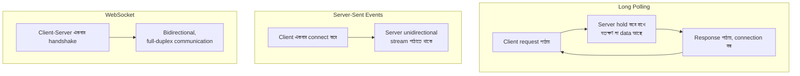

# Module 27 — Real-Time Systems

> **Phase H — Domain Specializations** | পূর্বশর্ত: M02, M10, M12, M20
> পরের module: M28 (FinTech ও Ledger Systems)

---

## ১. যে chat feature ১০,০০০ concurrent user-এ পুরো cluster ডুবিয়ে দিয়েছিল

M31-এর payment platform-এ একটা নতুন feature যোগ হলো — merchant support chat, যেখানে merchant real-time-এ support agent-এর সাথে কথা বলতে পারত। প্রথম কয়েক সপ্তাহ, কয়েকশো concurrent user-এ সব ঠিকঠাক চলল। একটা marketing push-এর পর concurrent chat user ১০,০০০ ছাড়াল একদিন — এবং পুরো Kubernetes cluster **অস্থির** হয়ে গেল, শুধু chat feature না, পুরো payment API-ও প্রভাবিত হলো।

তদন্তে তিনটা layered সমস্যা পাওয়া গেল, প্রতিটা এই handbook-এর আগের module-গুলোর সাথে সরাসরি সংযুক্ত:

**প্রথমত,** Django Channels ASGI worker deploy করা হয়েছিল **সাধারণ payment API worker-এর একই Deployment-এ** — M16-এর bulkhead নীতির স্পষ্ট লঙ্ঘন। প্রতিটা WebSocket connection একটা worker "slot" দখল করে রাখে যতক্ষণ connection খোলা থাকে (M04-এর sync worker-এর মতো, কিন্তু এখানে ইচ্ছাকৃতভাবে দীর্ঘস্থায়ী)। ১০,০০০ concurrent chat connection মানে ১০,০০০ worker slot দীর্ঘক্ষণ ব্যস্ত — payment API request-গুলো সেই একই resource pool-এর জন্য প্রতিযোগিতা করছিল, M02 §৯-এর capacity formula-র চরম প্রকাশ।

**দ্বিতীয়ত,** connection-এর জন্য কোনো **sticky session** ব্যবস্থা ছিল না — M20-এর load balancer round-robin ভাবে WebSocket connection ছড়িয়ে দিচ্ছিল, কিন্তু Channels-এর presence tracking (কে online, কে কোন room-এ) একটা shared Redis-এ (M10) নির্ভরশীল ছিল যেটা নিজে সেই throughput-এর জন্য size করা ছিল না।

**তৃতীয়ত,** message broadcast-এ একটা **naive fan-out** ব্যবহার হচ্ছিল — প্রতিটা message পাঠানোর সময় সব connected client-কে সরাসরি iterate করে পাঠানো হচ্ছিল, M12-এর efficient pub/sub pattern ব্যবহার না করে।

এই ঘটনাটা প্রমাণ করে কেন real-time system-এর সাথে কাজ করা M02-এর সব networking জ্ঞান, M04-এর concurrency model, M16-এর isolation নীতি, আর M20-এর resource management-এর একটা সম্পূর্ণ নতুন প্রয়োগ দাবি করে — request-response-এর সরল মডেলের বাইরে।

---

## ২. WebSocket বনাম SSE বনাম Long Polling — সিদ্ধান্ত কাঠামো

### ২.১ তিনটা পদ্ধতির মৌলিক পার্থক্য



| | Long Polling | SSE | WebSocket |
|---|---|---|---|
| Direction | Request-response (repeated) | Server → Client only | Bidirectional |
| Protocol | HTTP (M02-এর সব HTTP semantics) | HTTP (M02-এর keep-alive-এর উপর নির্ভর) | নিজস্ব protocol (HTTP দিয়ে upgrade) |
| Browser support | সর্বজনীন | ভালো (IE বাদে) | সর্বজনীন আধুনিক browser-এ |
| Reconnect handling | Client-এর দায়িত্ব, প্রতি request-এ নতুন | **Native, automatic** (browser built-in) | Client-এর দায়িত্ব (§৭-এ বিস্তারিত) |
| Proxy/firewall compatibility | চমৎকার (M02-এর সাধারণ HTTP) | ভালো | কখনো কখনো সমস্যা (corporate proxy WebSocket block করতে পারে) |
| Server resource cost | মাঝারি (M02 §৮-এর connection churn) | কম-মাঝারি | সবচেয়ে বেশি (M27 §১-এর ঘটনা) |

### ২.২ সিদ্ধান্ত-গাছ — M09-এর Polyglot Persistence Checklist-এর Real-time সংস্করণ

```
প্রশ্ন ১: Client-কে কি server-এ data পাঠাতে হবে real-time-এ
          (bidirectional), নাকি শুধু receive করতে হবে?
  শুধু receive (M31-এর payment status update, notification) → SSE বিবেচনা করুন
  Bidirectional (chat, collaborative editing) → WebSocket প্রয়োজন

প্রশ্ন ২: Update-এর frequency কেমন — সেকেন্ডে অনেকবার, নাকি মিনিটে
          কয়েকবার?
  কম frequency (M31-এর payment status, ঘণ্টায় কয়েকবার) → long polling
          যথেষ্ট, WebSocket-এর জটিলতা অপ্রয়োজনীয়
  উচ্চ frequency (live price feed, M27 §৯.৩) → WebSocket/SSE

প্রশ্ন ৩: Connection scale কত বড় হবে (M27 §১-এর ঘটনার capacity প্রশ্ন)?
  ছোট (কয়েকশো concurrent) → যেকোনো পদ্ধতি ঠিকঠাক কাজ করবে
  বড় (হাজার হাজার+) → M27 §৩-এর connection scaling architecture
          আবশ্যিকভাবে প্রয়োজন, পদ্ধতি নির্বিশেষে
```

> **Senior Tip:** "SSE-এর বদলে সবসময় WebSocket ব্যবহার করা কি নিরাপদ পছন্দ?" — "না, এটা M14-এর over-engineering সতর্কতার real-time সংস্করণ। M31-এর payment status notification (merchant dashboard-এ 'payment succeeded' দেখানো) unidirectional — merchant কখনো সার্ভারে কিছু push করার দরকার নেই এই context-এ। SSE এখানে সম্পূর্ণ যথেষ্ট, এবং এর automatic reconnection (browser built-in, M27 §৭-এর সব manual reconnect logic যা WebSocket-এ লিখতে হয় তা এখানে বিনামূল্যে), সরল implementation, এবং M02-এর সাধারণ HTTP infrastructure (proxy, load balancer) সবকিছুর সাথে compatible হওয়া — এগুলো WebSocket-এর bidirectional ক্ষমতার চেয়ে বেশি মূল্যবান যখন সেই ক্ষমতা আদৌ প্রয়োজন নেই।"

---

## ৩. Django Channels — Architecture ও সীমাবদ্ধতা

### ৩.১ ASGI, Consumer, এবং Channel Layer

```python
# consumers.py
from channels.generic.websocket import AsyncWebsocketConsumer
import json

class ChatConsumer(AsyncWebsocketConsumer):
    async def connect(self):
        self.room_name = self.scope["url_route"]["kwargs"]["room_name"]
        self.room_group = f"chat_{self.room_name}"

        # M12-এর consumer group ধারণার সমতুল্য — একটা "room"-এ join করা
        await self.channel_layer.group_add(self.room_group, self.channel_name)
        await self.accept()

    async def disconnect(self, close_code):
        await self.channel_layer.group_discard(self.room_group, self.channel_name)

    async def receive(self, text_data):
        message = json.loads(text_data)
        # M12-এর producer-এর মতো — broadcast করার জন্য group-এ পাঠানো
        await self.channel_layer.group_send(self.room_group, {
            "type": "chat_message", "message": message["text"],
        })

    async def chat_message(self, event):   # group_send-এর "type" এই method-এ route হয়
        await self.send(text_data=json.dumps({"message": event["message"]}))
```

**M04 §৪-এর asyncio জ্ঞানের সরাসরি প্রয়োগ:** Channels ASGI-ভিত্তিক (M05 §২-এর ASGI/WSGI পার্থক্য মনে করুন) — প্রতিটা WebSocket connection একটা asyncio coroutine হিসেবে চলে, M04-এর event loop-এর "একটা blocking call পুরো loop আটকায়" নীতি এখানে **বিশেষভাবে গুরুত্বপূর্ণ**, কারণ একটা connection-এ blocking code হাজার হাজার অন্য connection-কে প্রভাবিত করতে পারে।

### ৩.২ Channel Layer — M10-এর Redis-এর একটা নির্দিষ্ট প্রয়োগ

```python
# settings.py
CHANNEL_LAYERS = {
    "default": {
        "BACKEND": "channels_redis.core.RedisChannelLayer",
        "CONFIG": {"hosts": [("redis-channels", 6379)]},
    },
}
```

**M10-এর Redis Pub/Sub-এর সরাসরি বাস্তবায়ন:** Channel layer আসলে M10-এ আমরা যা উল্লেখ করেছিলাম — Redis Pub/Sub ব্যবহার করে multiple ASGI worker/pod-এর মধ্যে message route করা। যখন `group_send` কল হয়, এটা Redis-এ publish হয়, আর প্রতিটা worker (যেখানে সেই group-এর কোনো member connection আছে) সেটা receive করে নিজের local connection-এ forward করে। **এই layer-টাই M27 §১-এর ঘটনার তৃতীয় কারণ ছিল** — যদি এই Redis instance নিজে যথেষ্ট capacity-তে size করা না থাকে (M10-এর Redis sizing নীতি), এটা পুরো real-time system-এর bottleneck হয়ে যায়।

⚠️ **M10 §২.৩-এর সতর্কতার সরাসরি প্রয়োগ:** Redis Pub/Sub-এ **কোনো delivery guarantee নেই** — যদি একটা worker সাময়িকভাবে disconnected থাকে (M20-এর pod restart-এর সময়), সেই সময়ের message হারিয়ে যায়, M10-এর "Pub/Sub delivery guarantee নেই" নীতির real-time সংস্করণ। §৬-এ এর সমাধান।

### ৩.৩ Django Channels-এর প্রকৃত সীমাবদ্ধতা

```
১. Single Redis channel layer bottleneck হতে পারে (M27 §১-এর ঘটনা) —
   M10-এর Redis Cluster প্রয়োজন হতে পারে extreme scale-এ

২. ASGI worker resource-heavy — M27 §১-এর "একই Deployment-এ বসানো"
   ভুলের মূল প্রযুক্তিগত কারণ, প্রতিটা connection একটা coroutine যা
   memory এবং scheduler overhead রাখে (M04-এর asyncio internals)

৩. Horizontal scaling জটিল — M20-এর সাধারণ stateless HPA সরাসরি কাজ
   করে না ভালোভাবে, কারণ connection "sticky" (একটা client একটা
   নির্দিষ্ট worker-এ bound থাকে যতক্ষণ connection খোলা), §৪-এ বিস্তারিত
```

> **Senior Tip:** "Django Channels কি production-scale real-time-এর জন্য যথেষ্ট?" — "M09-এর polyglot persistence checklist এখানেও প্রযোজ্য — ছোট-মাঝারি scale-এ (কয়েক হাজার concurrent connection) হ্যাঁ, বিশেষত যদি টিম ইতিমধ্যে Django-তে বিনিয়োগ করা এবং নতুন stack শিখতে না চায়। কিন্তু extreme scale-এ (লক্ষ লক্ষ concurrent connection, M31-এর payment platform-এর একটা bank-এর সব user-এর live notification-এর মতো), dedicated real-time infrastructure (Socket.io+Node.js, বা managed service যেমন Pusher/Ably, M21-এর managed-vs-self-hosted trade-off) প্রায়ই বেশি উপযুক্ত — কারণ Python-এর asyncio (M04) C10K+ connection-এ Node.js/Erlang-এর মতো efficient না মূলত ভিন্ন runtime design-এর কারণে।"

---

## ৪. Connection Scaling — M27 §১-এর ঘটনার সম্পূর্ণ সমাধান

### ৪.১ Bulkhead — Real-Time Workload আলাদা করা

```yaml
# ✅ M16-এর bulkhead নীতির সরাসরি প্রয়োগ — সম্পূর্ণ আলাদা Deployment
apiVersion: apps/v1
kind: Deployment
metadata: {name: chat-service}   # ⚠️ payment-api Deployment-এর সম্পূর্ণ আলাদা
spec:
  replicas: 10
  template:
    spec:
      containers:
      - name: chat
        resources:
          requests: {cpu: "500m", memory: "1Gi"}   # M20-এর WebSocket connection-এর
                                                       # memory overhead বিবেচনা করে
```

**M27 §১-এর প্রথম কারণের সরাসরি সমাধান:** chat/real-time workload সম্পূর্ণ আলাদা Deployment-এ, আলাদা resource pool-এ — একটা connection storm chat-এ কখনো payment API-র capacity স্পর্শ করবে না। এটা M16 §৬-এর bulkhead নীতির সবচেয়ে concrete, high-stakes প্রয়োগগুলোর একটা।

### ৪.২ Sticky Session — Load Balancer-এ

```yaml
# Nginx ingress annotation — M02 §৭-এর load balancer আলোচনার real-time প্রয়োগ
nginx.ingress.kubernetes.io/affinity: "cookie"
nginx.ingress.kubernetes.io/session-cookie-name: "chat-affinity"
```

**M02 §৭-এর L4/L7 load balancer আলোচনার সম্প্রসারণ:** সাধারণ HTTP request-response-এ (M31-এর payment API) প্রতিটা request independently যেকোনো pod-এ যেতে পারে (stateless, M17-এর নীতি)। কিন্তু WebSocket connection দীর্ঘস্থায়ী — একটা client একবার একটা pod-এ connect হলে, সেই connection-এর জীবনকাল জুড়ে **সেই একই pod-এ** থাকতে হবে (কারণ connection state সেই pod-এর memory-তেই আছে) — sticky session এটা নিশ্চিত করে।

⚠️ **Trade-off যা M20-এর deployment strategy-কে প্রভাবিত করে:** sticky session মানে M20-এর rolling update জটিল হয়ে যায় — একটা pod terminate হলে, সেই pod-এর সব WebSocket connection **drop** হয় (M02 §৭-এর graceful connection draining প্রযোজ্য, কিন্তু WebSocket-এ "draining" মানে existing connection-কে চালিয়ে যেতে দেওয়া, নতুন connection না নেওয়া, তারপর client-দের reconnect করতে বলা — §৭-এ বিস্তারিত)।

### ৪.৩ Horizontal Scaling-এর প্রকৃত সীমা

```
M31-এর estimation নীতি এখানে প্রয়োগ:

একটা pod কতগুলো concurrent WebSocket connection ধরে রাখতে পারে?
  = memory limit / per-connection memory overhead
  (M04-এর asyncio coroutine overhead + Channels-এর নিজস্ব state)

যদি per-connection overhead ~50KB (typical Channels/asyncio),
1GB pod memory limit-এ ≈ ২০,০০০ connection theoretical max
(safety margin সহ, বাস্তবে ৫,০০০-১০,০০০ practical)

M27 §১-এর ১০,০০০ connection-এ একটা pod-ই যথেষ্ট capacity ছিল
theoretical-ভাবে, কিন্তু shared resource pool-এর কারণে ব্যর্থ হয়েছিল
```

> **Senior Tip:** "কীভাবে real-time system-এর capacity estimate করবেন?" — "M31 §১-এর capacity math-এর সরাসরি প্রয়োগ, কিন্তু 'RPS' এর বদলে 'concurrent connection': `max_connections_per_pod = memory_limit / per_connection_overhead`, তারপর `total_pods_needed = expected_concurrent_users / max_connections_per_pod`, একটা safety margin সহ। এবং critically — এই হিসাব **শুধু connection ধরে রাখার cost**, message throughput (§৫-এর fan-out cost) একটা আলাদা, প্রায়ই বেশি গুরুত্বপূর্ণ constraint।"

---

## ৫. Fan-out Pattern — M27 §১-এর তৃতীয় কারণের সমাধান

### ৫.১ Fan-out on Write বনাম Fan-out on Read

```
Fan-out on Write: message আসার সাথে সাথে সব recipient-এর কাছে
                   সরাসরি push করা (M27 §১-এর naive approach-এর
                   সঠিক সংস্করণ, M12-এর group_send ব্যবহার করে)

Fan-out on Read: message store করা, প্রতিটা client নিজের গতিতে
                  poll/fetch করে (M31-এর payment status-এর মতো —
                  M06-এর pagination pattern real-time-এ প্রয়োগ)
```

**M12-এর Kafka partition-এর ধারণাগত সমান্তরাল:** একটা chat room বড় হলে (হাজার হাজার member, M17-এর সাধারণ B2B chat-এর চেয়ে অনেক বড়, একটা "celebrity" broadcast-এর মতো), fan-out-on-write প্রতিটা message-এ হাজার হাজার push তৈরি করে — এটাই M12 §৭.২-এর hot partition সমস্যার real-time সংস্করণ। সমাধান M12-এর একই নীতি — hybrid approach।

### ৫.২ Hybrid Fan-out — M31-এর Payment System-এর Notification-এ প্রয়োগ

```python
def notify_payment_status(payment):
    subscriber_count = get_room_subscriber_count(f"merchant_{payment.merchant_id}")

    if subscriber_count < 100:   # সাধারণ merchant — সরাসরি push, M27 §৩-এর Channels
        channel_layer.group_send(f"merchant_{payment.merchant_id}", {
            "type": "payment_update", "payment_id": str(payment.id),
        })
    else:   # বিশাল enterprise merchant (একাধিক dashboard session) —
             # M06-এর pagination pattern, client periodically poll করে
        cache.set(f"latest_payment:{payment.merchant_id}", payment.id, timeout=300)
```

**M12 §৭.২-এর hot partition সমাধানের সরাসরি সমান্তরাল:** এটা M12-এর "সাধারণ merchant push, বিশাল merchant-এর জন্য ভিন্ন pattern" কৌশলের real-time সংস্করণ — যদিও এখানে dedicated shard-এর বদলে fan-out strategy নিজেই adaptive।

---

## ৬. Ordering ও Delivery Guarantee — M12/M14-এর নীতির Real-Time প্রয়োগ

### ৬.১ Redis Pub/Sub-এর দুর্বলতা, M14-এর Outbox দিয়ে সমাধান

```python
# M14-এর Outbox pattern-এর real-time সংস্করণ — message প্রথমে persist,
# তারপর broadcast (M27 §৩.২-এর "delivery guarantee নেই" সমস্যার সমাধান)
def send_chat_message(room_id, sender_id, text):
    with transaction.atomic():
        message = ChatMessage.objects.create(
            room_id=room_id, sender_id=sender_id, text=text
        )   # ⚠️ M14-এর outbox নীতি — durable storage আগে
    # তারপর broadcast — যদি broadcast ব্যর্থ হয় (worker down), message
    # এখনো database-এ আছে, client reconnect করলে missed message fetch করতে পারে (§৭)
    async_to_sync(channel_layer.group_send)(f"chat_{room_id}", {
        "type": "chat_message", "message_id": str(message.id), "text": text,
    })
```

**M14 §৩-এর outbox pattern-এর সরাসরি প্রয়োগ, ভিন্ন domain-এ:** এখানে "downstream system" হলো WebSocket broadcast (Kafka-র বদলে), কিন্তু মূলনীতি অভিন্ন — durable storage (database) প্রথমে, ephemeral delivery (pub/sub broadcast) পরে, যাতে broadcast ব্যর্থ হলেও data হারায় না, শুধু delivery delayed হয় (client reconnect-এ recover করতে পারে)।

### ৬.২ Ordering — M12 §১-এর Partition Key নীতির প্রয়োগ

```python
# M12 §১-এর payment_id partition key নীতির সরাসরি সমান্তরাল
class ChatMessage(models.Model):
    room = models.ForeignKey(ChatRoom, on_delete=models.CASCADE)
    sequence_number = models.BigIntegerField()   # ⚠️ M12-এর Kafka offset-এর
                                                    #    ধারণাগত সমতুল্য
    class Meta:
        constraints = [
            models.UniqueConstraint(fields=["room", "sequence_number"],
                                    name="uniq_room_sequence")
        ]
```

**M12 §১-এর ঘটনার সমাধানের সরাসরি প্রয়োগ:** একটা room-এর সব message ঠিক ক্রমে দেখানো নিশ্চিত করতে, প্রতিটা message-এর একটা room-scoped sequence number (M12-এর offset-এর মতো) — client message-গুলো `sequence_number` দিয়ে sort করে দেখায়, network delivery order-এর উপর নির্ভর না করে (M12-এর "physical delivery order guarantee করে না, logical ordering দরকার" নীতি)।

---

## ৭. Presence System ও Mobile Reconnect

### ৭.১ Presence — M10-এর TTL নীতির প্রয়োগ

```python
async def connect(self):
    await self.accept()
    # M10-এর TTL pattern — heartbeat ছাড়া presence স্বয়ংক্রিয়ভাবে expire
    await redis_client.setex(f"presence:{self.user_id}", 30, "online")

async def heartbeat(self):
    # ⚠️ প্রতি ২০ সেকেন্ডে client পাঠায়, TTL কে ৩০ সেকেন্ডে রিফ্রেশ করে
    await redis_client.expire(f"presence:{self.user_id}", 30)

async def disconnect(self, close_code):
    await redis_client.delete(f"presence:{self.user_id}")
```

**M10 §৩.৩-এর TTL discipline-এর সরাসরি প্রয়োগ:** "কে online" একটা natural TTL-based problem — M10-এর cache expiry নীতির মতোই, presence "expire" হওয়া উচিত যদি heartbeat না আসে (network disconnect, app crash-এর signal), M02-এর TCP keep-alive-এর application-level সংস্করণ।

### ৭.২ Mobile Reconnect ও Missed Message Recovery

```python
# Client reconnect করার সময়, শেষ দেখা sequence_number পাঠায়
async def connect(self):
    await self.accept()
    last_seen_seq = self.scope["query_string"]   # client থেকে আসা last-seen state

    # M06 §৭.২-এর cursor pagination নীতির সরাসরি প্রয়োগ — missed message fetch
    missed_messages = ChatMessage.objects.filter(
        room_id=self.room_id, sequence_number__gt=last_seen_seq
    ).order_by("sequence_number")[:100]

    for msg in missed_messages:
        await self.send(text_data=json.dumps({"message": msg.text}))
```

**M06 §৭.২-এর cursor pagination-এর সরাসরি প্রয়োগ, real-time reconnection-এ:** Mobile network অবিশ্বস্ত (M02-এর network reliability আলোচনা, mobile context-এ আরও প্রকট) — connection ঘন ঘন drop/reconnect হয়। M06-এর cursor pagination নীতি (`WHERE sequence_number > cursor`) এখানে "reconnect-এর পর missed message fetch করা"-র সমাধান — offset-based approach ব্যবহার করলে M06 §৭.১-এর ঠিক সেই duplicate/skip সমস্যা হতো যদি নতুন message আসতে থাকে reconnection window-এ।

> **Senior Tip:** "Reconnect logic-এ exponential backoff দরকার কেন?" — "M11 §৬.২/M16 §৩-এর retry storm নীতির client-side প্রয়োগ। যদি সার্ভার সাময়িকভাবে overload হয় (M27 §১-এর ঘটনার মতো) এবং সব client একই মুহূর্তে disconnect হয়, প্রতিটা client যদি সাথে সাথে reconnect করার চেষ্টা করে, এটা একটা reconnection storm তৈরি করে যা সার্ভারকে recover করতে বাধা দেয় — M16-এর ঠিক সেই cascading failure amplification, শুধু client-side-এ ঘটছে।"

---

## ৮. Backpressure — M16-এর Resilience-এর Real-Time প্রয়োগ

```python
class ChatConsumer(AsyncWebsocketConsumer):
    async def chat_message(self, event):
        # ⚠️ M16-এর load shedding নীতি — slow client-এর জন্য পুরো broadcast
        #    আটকে রাখা যাবে না
        try:
            await asyncio.wait_for(
                self.send(text_data=json.dumps(event)), timeout=1.0
            )
        except asyncio.TimeoutError:
            # slow client — M16-এর graceful degradation, connection বন্ধ করে
            # দেওয়া বরং broadcast-কে ব্লক না করা
            await self.close(code=4000)
```

**M16 §৭.২-এর backpressure নীতির সরাসরি প্রয়োগ:** যদি একটা client ধীর (slow mobile network), তার জন্য একটা `send()` call দীর্ঘক্ষণ block করতে পারে (M04-এর asyncio-তে একটা blocking-এর-কাছাকাছি situation) — যদি এটা handle না করা হয়, একটা slow client পুরো broadcast loop-কে ধীর করে দিতে পারে অন্য সব client-এর জন্য, M16-এর "একটা slow dependency পুরো capacity খায়" নীতির connection-level সংস্করণ।

---

## ৯. Case Study — তিনটা ভিন্ন Real-Time প্যাটার্ন

### ৯.১ Chat — Bidirectional, Ordered, Persistent

```
WebSocket (bidirectional প্রয়োজন) + M27 §৬.২-এর sequence number
(ordering) + M27 §৬.১-এর outbox pattern (persistence, missed message
recovery) + M27 §৪-এর dedicated bulkhead deployment
```

### ৯.২ Notification — Unidirectional, Best-Effort

```
SSE বা এমনকি polling (M06-এর "critical path বনাম non-critical" নীতি
অনুযায়ী — একটা notification কয়েক সেকেন্ড দেরি হলে সাধারণত গ্রহণযোগ্য,
M31-এর latency budget আলোচনার প্রয়োগ) + M14-এর outbox pattern (কিন্তু
strict ordering প্রয়োজন নেই, শুধু eventual delivery)
```

### ৯.৩ Live Price Feed — উচ্চ-Frequency, Latest-Value-Only

```python
# ⚠️ price feed-এ historical message গুরুত্বপূর্ণ না — শুধু latest value
async def price_update(self, event):
    # M10-এর cache-aside pattern-এর মতো — শুধু সর্বশেষ মান matter করে,
    # M27 §৬.১-এর outbox/persistence এখানে অপ্রয়োজনীয় (M14-এর
    # over-engineering সতর্কতা প্রযোজ্য — সব real-time data-তে
    # persistence প্রয়োজন নেই)
    await self.send(text_data=json.dumps({"price": event["price"]}))
```

**M14-এর "সব pattern সব জায়গায় প্রয়োজন না" নীতির সরাসরি প্রয়োগ:** Live price feed-এ M27 §৬.১-এর outbox pattern **প্রয়োজন নেই** — একটা মিস হওয়া price update গুরুত্বপূর্ণ না (পরের update-ই সর্বশেষ সত্য), শুধু সবচেয়ে সাম্প্রতিক মান client-এর কাছে পৌঁছানো গুরুত্বপূর্ণ। এই তিনটা case study পাশাপাশি দেখায় কেন "real-time" একটা single pattern না — M27-এর প্রতিটা কৌশল **নির্বাচনীভাবে** প্রয়োগ করা উচিত, actual requirement অনুযায়ী।

---

## ১০. Interview Section

### প্রশ্ন ১ (Senior) — "WebSocket ব্যবহার করার সিদ্ধান্ত কীভাবে নেবেন SSE-র বদলে?"

**🌟 Senior/Staff Answer**
> "প্রথম এবং সবচেয়ে গুরুত্বপূর্ণ প্রশ্ন — client-কে কি সত্যিই সার্ভারে real-time data push করতে হবে, নাকি শুধু receive করতে হবে? SSE unidirectional, WebSocket bidirectional — যদি ব্যবহার case শুধু 'সার্ভার থেকে client-এ update' (M31-এর payment status, notification), SSE প্রায় সবসময় ভালো পছন্দ, কারণ এটার automatic browser-level reconnection আছে (WebSocket-এ সেটা manually implement করতে হয়, M27 §৭.২-এর reconnect logic), সরল implementation, এবং standard HTTP infrastructure-এর সাথে সম্পূর্ণ compatible (কিছু corporate proxy WebSocket block করে, SSE করে না)।
>
> শুধু যখন সত্যিকারের bidirectional communication প্রয়োজন (chat, collaborative editing, gaming) WebSocket-এর জটিলতা justified। এটা M14-এর over-engineering সতর্কতার একটা direct প্রয়োগ — 'WebSocket বেশি শক্তিশালী' বলে সবজায়গায় ব্যবহার করা ভুল, কারণ শক্তি জটিলতার সাথে আসে (M27-এর connection scaling, sticky session, presence tracking) যা শুধু bidirectional প্রয়োজন হলেই worth করে।"

---

### প্রশ্ন ২ (Staff / Production Incident) — "Chat feature deploy করার পর payment API-ও ধীর হয়ে গেছে, যদিও দুইটা আলাদা codebase। কেন?"

**🌟 Senior/Staff Answer**
> "এটা প্রায় নিশ্চিতভাবে একটা **shared resource contention** সমস্যা, M16-এর bulkhead নীতির লঙ্ঘন — M27 §১-এর ঘটনার হুবহু প্যাটার্ন। যদি chat consumer আর payment API একই Kubernetes Deployment-এ (বা একই worker pool-এ) চলে, WebSocket connection-এর দীর্ঘস্থায়ী nature (M02-এর normal HTTP request-এর বিপরীত, যেটা millisecond-এ শেষ হয়) worker slot-কে দীর্ঘক্ষণ ব্যস্ত রাখে — M02 §৯-এর capacity formula অনুযায়ী, এই 'ব্যস্ত' worker সংখ্যা বাড়লে payment API-র জন্য available capacity কমে যায়, যদিও কোড সম্পূর্ণ আলাদা।
>
> **আমার প্রথম চেক:** `kubectl get pods` দিয়ে দেখব chat আর payment একই Deployment/pod-এ কি না। যদি হ্যাঁ, এটাই root cause — সমাধান M27 §৪.১-এর মতো সম্পূর্ণ আলাদা Deployment, আলাদা resource pool।
>
> **যদি ইতিমধ্যে আলাদা Deployment,** পরের সন্দেহ M27 §৩.২-এর shared Redis channel layer — যদি payment API-ও একই Redis instance ব্যবহার করে (M10-এর cache, বা M11-এর Celery broker), chat-এর high-volume pub/sub traffic সেই shared Redis-এর capacity খেয়ে ফেলতে পারে, M16-এর bulkhead নীতি এখানেও প্রযোজ্য একটা ভিন্ন স্তরে — Redis instance নিজেও আলাদা হওয়া উচিত real-time workload-এর জন্য, M09-এর 'একই infrastructure component একাধিক critical workload-এ শেয়ার করা বিপজ্জনক' নীতির প্রয়োগ।
>
> এই ধরনের 'unrelated codebase একে অপরকে প্রভাবিত করছে' লক্ষণ প্রায় সবসময় একটা shared infrastructure layer নির্দেশ করে — M16-এর 'blast radius সীমিত রাখা' নীতির সরাসরি ব্যর্থতা যেখানেই এটা ঘটে।"

---

### প্রশ্ন ৩ (Coding / Debugging) — "এই presence tracking কোডে কী সমস্যা আছে?"

```python
async def connect(self):
    await self.accept()
    online_users.add(self.user_id)   # module-level set

async def disconnect(self, close_code):
    online_users.discard(self.user_id)
```

**🌟 Senior Answer**
> "এই কোডে দুইটা গুরুতর সমস্যা, উভয়ই এই handbook-এর আগের module-এর নীতির সরাসরি লঙ্ঘন:
>
> **১. Module-level Python set — M04/M20-এর multi-worker/multi-pod সমস্যা।** `online_users` একটা in-memory Python set, যেটা শুধু **একটা** worker process-এর মধ্যে বিদ্যমান। যদি M20-এর Deployment-এ একাধিক pod থাকে (যেটা প্রায় সবসময় থাকবে production-এ), প্রতিটা pod-এর নিজস্ব আলাদা `online_users` set — একজন user pod A-তে connected থাকতে পারে, কিন্তু pod B-তে 'offline' দেখাবে। এটা M06 §৬-এর `LocMemCache` throttle bug-এর হুবহু presence-tracking সংস্করণ — distributed environment-এ shared state প্রয়োজন (M10-এর Redis), local process state যথেষ্ট না।
>
> **২. কোনো TTL/heartbeat নেই — disconnect ঠিকমতো detect না হলে stale presence।** যদি একটা connection অস্বাভাবিকভাবে বন্ধ হয় (network crash, app force-close, `disconnect()` কখনো clean call না হয়ে), সেই user চিরকালের জন্য 'online' দেখাবে — M10 §৩.৩-এর TTL discipline ছাড়া presence tracking নির্ভরযোগ্য না।
>
> **সংশোধিত সংস্করণ — M27 §৭.১-এর pattern:**
> ```python
> async def connect(self):
>     await self.accept()
>     await redis_client.setex(f'presence:{self.user_id}', 30, 'online')
>
> async def heartbeat(self):   # client periodic ping পাঠায়
>     await redis_client.expire(f'presence:{self.user_id}', 30)
>
> async def disconnect(self, close_code):
>     await redis_client.delete(f'presence:{self.user_id}')
> ```
> এখানে Redis (shared, multi-pod-consistent) TTL-সহ ব্যবহার হচ্ছে — presence স্বয়ংক্রিয়ভাবে expire হয় heartbeat না এলে, এবং সব pod একই source of truth দেখে।"

---

### প্রশ্ন ৪ (Architecture Decision) — "আমাদের payment platform-এ merchant-দের real-time balance update দেখানো দরকার (প্রতিটা transaction-এ)। কীভাবে design করবেন?"

**🌟 Senior/Staff Answer**
> "এটা M27 §২.২-এর সিদ্ধান্ত-কাঠামোর একটা সরাসরি প্রয়োগ, এবং আমার প্রথম প্রশ্ন হবে ঠিক কতটা 'real-time' প্রয়োজন — M31-এর latency budget নীতি।
>
> যদি এটা একটা merchant dashboard যেখানে balance দেখানো হচ্ছে (merchant সক্রিয়ভাবে দেখছে), SSE যথেষ্ট — unidirectional (merchant balance-এ কিছু push করে না), moderate frequency (transaction-এর হার সাধারণত সেকেন্ডে অনেকবার না, M31-এর একটা বড় merchant-এও)।
>
> **ডিজাইন:**
> ```
> Transaction ঘটে → M14-এর outbox pattern (payment.succeeded event,
>                    M31-এর মূল architecture থেকে ইতিমধ্যে বিদ্যমান)
>                  → একটা lightweight consumer যা SSE stream-এ push করে
>                    merchant-এর active connection-এ (যদি আছে)
> ```
>
> **এখানে একটা গুরুত্বপূর্ণ architectural সিদ্ধান্ত — persistence প্রয়োজন কি না (M27 §৬.১ বনাম §৯.৩)।** Balance update-এ, আমি মনে করি এটা price-feed-এর কাছাকাছি (M27 §৯.৩) — merchant যদি সাময়িকভাবে disconnected থাকে, তাদের প্রতিটা intermediate balance change জানার দরকার নেই, শুধু **সর্বশেষ, সঠিক balance** দরকার reconnect করার পর। তাই full missed-message-recovery (M27 §৭.২-এর chat pattern) এখানে over-engineering — reconnect করলে merchant simply একটা fresh balance query করবে (M31-এর payment API-র normal REST endpoint দিয়ে), তারপর SSE stream আবার শুরু হবে সেখান থেকে।
>
> **Scale বিবেচনা (M27 §৪.৩-এর capacity math):** M31-এর payment platform-এ সম্ভবত হাজার হাজার merchant একই সময়ে dashboard খোলা রাখতে পারে — কিন্তু এটা chat-এর ১০,০০০ concurrent-এর মতোই, তাই M27 §৪.১-এর bulkhead নীতি এখানেও প্রযোজ্য — এই SSE service সম্পূর্ণ আলাদা Deployment-এ, payment API-র core transaction-processing capacity থেকে সম্পূর্ণ isolated, M27 §১-এর ঘটনা পুনরাবৃত্তি না হতে দেওয়ার জন্য।"

---

## ১১. হাতে-কলমে অনুশীলন

**১ — Django Channels দিয়ে একটা সরল chat বানান (৪৫ মিনিট)**
Docker দিয়ে Redis channel layer সহ একটা minimal chat consumer বানান, দুইটা browser tab দিয়ে message পাঠান। তারপর M27 §৬.২-এর sequence number যোগ করুন এবং ordering যাচাই করুন দ্রুত পরপর message পাঠিয়ে।

**২ — Bulkhead-এর প্রভাব পরীক্ষা করুন (৩৫ মিনিট, Kubernetes/Minikube সহ)**
একই Deployment-এ chat consumer আর একটা সাধারণ API endpoint চালান। Chat-এ heavy load দিন (অনেক concurrent connection), API-র response time-এ প্রভাব দেখুন। তারপর আলাদা Deployment-এ সরিয়ে পার্থক্য দেখুন।

**৩ — Missed message recovery টেস্ট করুন (৩০ মিনিট)**
একটা chat consumer বানান M27 §৭.২-এর reconnect pattern সহ। একটা client disconnect করুন (browser tab বন্ধ), অন্য client থেকে কয়েকটা message পাঠান, তারপর প্রথম client reconnect করে missed message পাচ্ছে কি না দেখুন।

**৪ — SSE বনাম WebSocket তুলনা করুন (২৫ মিনিট)**
একই "live counter" feature দুইভাবে implement করুন — SSE এবং WebSocket দিয়ে। Code complexity, reconnection behavior (network disconnect simulate করে) তুলনা করুন।

---

## ১২. মূল কথা

1. **Bidirectional প্রয়োজন না হলে SSE/long polling WebSocket-এর চেয়ে ভালো** — automatic reconnection, সরল implementation, standard HTTP compatibility।
2. **Real-time workload কখনো সাধারণ API-র সাথে একই resource pool শেয়ার করবেন না** — M16-এর bulkhead নীতি এখানে বিশেষভাবে critical কারণ connection দীর্ঘস্থায়ী।
3. **Channel layer (Redis Pub/Sub) delivery guarantee দেয় না** — M14-এর outbox pattern প্রয়োজন যদি message loss অগ্রহণযোগ্য হয়।
4. **Sticky session WebSocket-এ প্রয়োজনীয়**, কিন্তু deployment strategy (rolling update)-কে জটিল করে — connection draining আলাদাভাবে ডিজাইন করতে হয়।
5. **Presence tracking shared store (Redis) এবং TTL-ভিত্তিক হতে হবে** — in-memory local state multi-pod environment-এ ভুল ফলাফল দেয়।
6. **Fan-out strategy connection সংখ্যা অনুযায়ী adaptive হতে পারে** — hot room/celebrity broadcast-এ M12-এর hot partition সমাধানের মতো কৌশল প্রয়োজন।
7. **Ordering-এ sequence number ব্যবহার করুন, network delivery order-এর উপর নির্ভর করবেন না** — M12-এর Kafka offset ধারণার direct প্রয়োগ।
8. **Mobile reconnect-এ cursor-based missed message fetch, backoff সহ** — M06-এর pagination এবং M16-এর retry storm নীতি একসাথে প্রয়োগ।
9. **সব real-time data-তে persistence/ordering প্রয়োজন না** — live price feed শুধু latest value চায়, chat পূর্ণ history চায়; সঠিক pattern নির্বাচন করুন প্রয়োজন অনুযায়ী।
10. **Backpressure handling বাধ্যতামূলক** — একটা slow client-এর জন্য পুরো broadcast loop আটকে থাকা উচিত না।

---

## পরের Module

**M28 — FinTech ও Ledger Systems।** আজ আমরা real-time communication দেখলাম। পরের module-এ আমরা M31-এর payment platform-এর সবচেয়ে core, correctness-critical অংশে ফিরে যাব — double-entry ledger design (M18-এর Aggregate/Value Object নীতির financial domain-এ পূর্ণ প্রয়োগ), payment gateway integration-এর সম্পূর্ণ webhook lifecycle (M26-এর SSRF/signature verification-এর সম্পূর্ণ প্রেক্ষাপট), reconciliation (M25-এর incident response নীতির financial-audit সংস্করণ), আর settlement — এই handbook-এর সবচেয়ে ঘনীভূত, সব module-কে একত্রিত করা domain।
