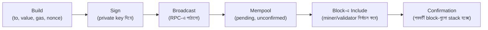
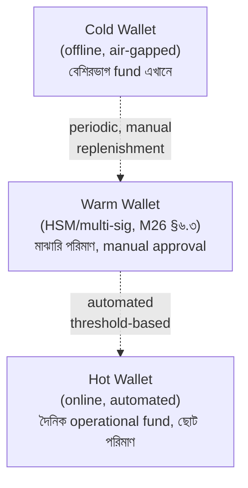

# Module 29 — Blockchain Backend

> **Phase H — Domain Specializations** | পূর্বশর্ত: M15, M26, M28
> পরের module: M30 (Search, Analytics ও AI Integration)

---

## ১. যে দুইটা transaction একসাথে পাঠানো একটা wallet-কে চিরদিনের জন্য আটকে দিয়েছিল

M31-এর payment platform একটা নতুন feature চালু করল — crypto payout, merchant-দের USDT (একটা stablecoin) দিয়ে পেমেন্ট করার সুবিধা। একটা withdrawal batch process দুইটা payout একসাথে trigger করল একই hot wallet থেকে, প্রায় একই মিলিসেকেন্ডে — M11-এর Celery-র মতোই দুইটা worker সমান্তরালে কাজ করছিল।

দুইটা transaction-ই সফলভাবে build এবং sign হলো, কিন্তু উভয়ই **একই nonce** ব্যবহার করেছিল — `nonce=47`। Blockchain-এর নিয়ম অনুযায়ী, একটা account থেকে প্রতিটা transaction-এর একটা sequential, unique nonce থাকতে হবে (M12-এর Kafka offset-এর ধারণাগত সমতুল্য — ordering-এর একমাত্র উৎস)। প্রথম transaction (`nonce=47`) network-এ broadcast হয়ে confirm হলো। দ্বিতীয় transaction (একই `nonce=47`) network দ্বারা **প্রত্যাখ্যাত** হলো — "nonce too low" error, কারণ blockchain ইতিমধ্যে জানত account-এর পরবর্তী প্রত্যাশিত nonce এখন `48`।

সমস্যাটা এখানেই থামেনি। Worker code (M11-এর retry logic ছাড়াই লেখা) দ্বিতীয় transaction-টাকে "ব্যর্থ" মার্ক করল এবং **একই nonce (47) দিয়ে আবার চেষ্টা করল** — যেটা আবার প্রত্যাখ্যাত হলো। এই retry loop-এ কখনো নতুন nonce fetch করা হয়নি (M11 §৬.৩-এর "retryable বনাম non-retryable error" শ্রেণীবিভাগের সরাসরি লঙ্ঘন — "nonce too low" একটা non-retryable error যা নতুন nonce দাবি করে, একই request-এর blind retry না)।

আরও খারাপ — merchant-এর payout-এর জন্য অপেক্ষা করছিল, আর wallet-এর "pending nonce" ৪৮-এ আটকে ছিল যতক্ষণ না manual intervention এসে সঠিক nonce দিয়ে একটা নতুন transaction পাঠাল। এই ঘটনাটা দেখায় blockchain integration কেন M11-এর idempotency জ্ঞান, M28-এর ledger discipline, আর একটা সম্পূর্ণ নতুন ধারণা (**nonce management**) একসাথে দাবি করে — এই module সেই সংশ্লেষণ।

---

## ২. Node ও RPC Infrastructure — M17-এর External Integration নীতির Blockchain সংস্করণ

### ২.১ Self-Hosted বনাম Managed — M09/M21-এর Checklist-এর প্রয়োগ

```
Self-hosted node (Geth, Erigon): M08-এর self-hosted database-এর মতো
  একই trade-off — সম্পূর্ণ নিয়ন্ত্রণ, কিন্তু operational বোঝা (sync
  time, storage — একটা full Ethereum node কয়েকশো GB, M19-এর storage
  planning প্রয়োজন)

Managed RPC provider (Alchemy, Infura, QuickNode): M21-এর RDS-এর মতোই
  একটা managed service — node operate করার জটিলতা সরিয়ে দেয়, কিন্তু
  M17-এর Conformist relationship তৈরি করে (তাদের rate limit, uptime
  SLA-র উপর নির্ভরশীল)
```

**M09-এর polyglot persistence checklist-এর সরাসরি প্রয়োগ:** বেশিরভাগ প্রজেক্ট (এমনকি M31-এর payment platform-এর মতো established system) নিজস্ব blockchain node চালানোর justification পায় না — একটা full node sync/maintain করা M09-এর "measured প্রয়োজন" test-এ ব্যর্থ হয় যদি না আপনার throughput/latency প্রয়োজন সত্যিই extreme, বা compliance কারণে নিজস্ব infrastructure প্রয়োজন।

### ২.২ JSON-RPC — M02-এর HTTP জ্ঞানের একটা নির্দিষ্ট প্রোটোকল প্রয়োগ

```python
import requests

def get_balance(address):
    response = requests.post(RPC_URL, json={
        "jsonrpc": "2.0", "method": "eth_getBalance",
        "params": [address, "latest"], "id": 1,
    }, timeout=(3.05, 10))   # ⚠️ M02-এর timeout নীতি এখানেও বাধ্যতামূলক
    return int(response.json()["result"], 16)   # hex string থেকে integer
```

**M02-এর সব HTTP resilience নীতি সরাসরি প্রযোজ্য:** JSON-RPC শুধু HTTP-এর উপর একটা নির্দিষ্ট request/response format — M02-এর timeout, M16-এর retry/circuit breaker, M11-এর connection pooling সবকিছু এখানে অপরিবর্তিতভাবে প্রযোজ্য। একটা RPC provider সাময়িকভাবে ধীর/down হলে, M16-এর সব resilience pattern (bulkhead, circuit breaker) প্রয়োজন — বিশেষত যদি একাধিক provider ব্যবহার করা হয় failover-এর জন্য (M17-এর multi-provider redundancy)।

---

## ৩. EVM ও Gas Model

### ৩.১ Gas — একটা Computational Metering System

```
Gas = প্রতিটা EVM operation-এর "খরচ" — M31-এর capacity planning-এর
      একটা blockchain-নির্দিষ্ট সংস্করণ, কিন্তু এখানে "খরচ" আক্ষরিক
      অর্থে টাকা (gas price × gas used = transaction fee)

Gas limit: একটা transaction সর্বোচ্চ কতটা gas ব্যবহার করতে পারে
           (M20-এর resource limit-এর blockchain সমতুল্য — একটা upper
           bound, অতিক্রম করলে transaction "out of gas" ব্যর্থ হয়)
```

### ৩.২ EIP-1559 — Gas Pricing-এর আধুনিক মডেল

```python
def estimate_gas_price(w3):
    latest_block = w3.eth.get_block("latest")
    base_fee = latest_block["baseFeePerGas"]   # ⚠️ network দ্বারা নির্ধারিত,
                                                  # M31-এর capacity-based
                                                  # dynamic pricing-এর মতো
    priority_fee = w3.eth.max_priority_fee   # "tip" — miner-কে prioritize
                                                # করার জন্য উৎসাহ (M11-এর
                                                # priority queue ধারণার
                                                # blockchain সংস্করণ)
    max_fee = base_fee * 2 + priority_fee   # সাধারণ margin, base fee
                                              # ওঠানামা করতে পারে block-এ block-এ
    return {"maxFeePerGas": max_fee, "maxPriorityFeePerGas": priority_fee}
```

**M11 §৯.৩-এর priority queue নীতির সরাসরি blockchain সমতুল্য:** EIP-1559-এর `priority_fee` M11-এর Celery task priority-র ধারণাগতভাবে অভিন্ন — বেশি "tip" মানে transaction দ্রুত process হওয়ার (block-এ include হওয়ার) সম্ভাবনা বেশি, ঠিক যেমন M11-এর উচ্চ-priority task দ্রুত worker পায়। পার্থক্য: এখানে priority "কিনতে" হয় সরাসরি টাকা দিয়ে, একটা market-based mechanism, application-level queue configuration না।

---

## ৪. Transaction Lifecycle ও Nonce Management — §১-এর ঘটনার সম্পূর্ণ সমাধান

### ৪.১ সম্পূর্ণ Lifecycle



### ৪.২ Nonce Management — §১-এর ঘটনার Root Cause এবং সমাধান

```python
# ❌ §১-এর ঘটনার মূল কারণ — race condition-প্রবণ nonce fetching
def send_transaction(to, value):
    nonce = w3.eth.get_transaction_count(WALLET_ADDRESS, "pending")   # ⚠️ race!
    tx = build_transaction(to, value, nonce)
    return broadcast(sign(tx))

# ✅ M05 §৮.১-এর select_for_update()-এর blockchain সমতুল্য — একটা
#    centralized, locked nonce tracker
class NonceManager:
    def __init__(self, wallet_address):
        self.wallet_address = wallet_address

    def get_next_nonce(self):
        with transaction.atomic():   # M07-এর ACID guarantee, ব্লকচেইনের
                                       # বাইরে, আমাদের নিজস্ব ডাটাবেসে
            tracker = NonceTracker.objects.select_for_update().get(
                wallet_address=self.wallet_address
            )   # ⚠️ M05-এর row lock — দুইটা concurrent request একই
                #    nonce কখনো পাবে না
            nonce = tracker.next_nonce
            tracker.next_nonce += 1
            tracker.save()
        return nonce
```

**M05 §৮.১-এর race condition সমাধানের প্রায় হুবহু প্রয়োগ, নতুন domain-এ:** §১-এর ঘটনা ঘটেছিল কারণ `w3.eth.get_transaction_count(address, "pending")` নিজে থেকে atomic না — দুইটা concurrent call একই "pending" nonce দেখতে পারে, ঠিক M05-এর `refunded_amount` read-modify-write race-এর মতো। সমাধান একই মূলনীতি — **correctness আমাদের নিজস্ব controlled database-এ enforce করুন** (M07-এর ACID guarantee ব্যবহার করে), blockchain node নিজে থেকে যেটা দেয় (একটা "pending count" query) তার উপর নির্ভর না করে।

### ৪.৩ Stuck Transaction ও Replacement — M16-এর Timeout/Retry-র Blockchain সংস্করণ

```python
def replace_stuck_transaction(original_tx_hash, wallet_nonce):
    """একটা transaction 'stuck' হয় যখন gas price খুব কম ছিল, miner-রা
    এটা include করতে আগ্রহী না — M16-এর timeout ধারণার blockchain সংস্করণ,
    কিন্তু এখানে 'timeout' নেই, transaction চিরকাল pending থাকতে পারে"""

    # ⚠️ M16-এর retry নীতি, কিন্তু এখানে "retry" মানে একই nonce দিয়ে
    #    একটা নতুন, উচ্চতর gas price-এর transaction পাঠানো — একই
    #    nonce ব্যবহার করলে নতুন transaction পুরনোটাকে "replace" করে
    #    (blockchain rule: একই nonce-এর সর্বোচ্চ gas price-এর transaction জেতে)
    new_gas_price = get_current_gas_price() * 1.15   # ⚠️ কমপক্ষে ১০-১৫% বেশি,
                                                        # network rule অনুযায়ী
    replacement_tx = build_transaction(
        to=original_to, value=original_value,
        nonce=wallet_nonce,   # ⚠️ same nonce — এটাই "replacement"-এর চাবিকাঠি
        gas_price=new_gas_price,
    )
    return broadcast(sign(replacement_tx))
```

**M16-এর retry pattern-এর একটা সম্পূর্ণ ভিন্ন mechanism, একই উদ্দেশ্য:** সাধারণ HTTP retry-তে (M16 §৩) একটা নতুন request পাঠানো হয় স্বাধীনভাবে। Blockchain-এ, "retry" আসলে **replacement** — একই nonce ব্যবহার করে একটা higher-fee transaction পাঠানো, যা network rule অনুযায়ী পুরনো pending transaction-কে বাতিল করে দেয়। এই পার্থক্যটা বোঝা critical — যদি কেউ একটা নতুন nonce দিয়ে "retry" করে (ভুলভাবে), দুইটা transaction-ই eventually confirm হয়ে যেতে পারে (M28-এর double-charge-এর সমতুল্য একটা blockchain বিপর্যয়)।

> **Senior Tip:** "§১-এর ঘটনায় exact fix কী হতো?" — "দুইটা স্তরে: প্রথমত, M29 §৪.২-এর `NonceManager` ব্যবহার করে race condition-ই এড়ানো (root cause fix)। দ্বিতীয়ত, defense-in-depth হিসেবে, `nonce too low` error-কে M11 §৬.৩-এর non-retryable শ্রেণীতে রাখা এবং সেই ক্ষেত্রে blind retry না করে, `NonceManager` থেকে একটা fresh nonce নিয়ে transaction rebuild করা — M11-এর error classification নীতির blockchain-নির্দিষ্ট প্রয়োগ।"

---

## ৫. Reorg Handling ও Confirmation Depth — M15-এর Consensus তত্ত্বের ব্যবহারিক প্রয়োগ

### ৫.১ Reorg কী, এবং কেন এটা M15-এর Theory-র সরাসরি ফলাফল

```
M15 §৫-এর Raft consensus আলোচনা মনে করুন — একটা "leader" নির্বাচিত হয়
majority vote দিয়ে। Public blockchain-এ (Ethereum, Bitcoin), consensus
আরও probabilistic — দুইজন miner/validator প্রায় একই সময়ে একটা block
propose করতে পারে, network সাময়িকভাবে বিভক্ত হয় (কে কোন chain দেখছে),
এবং পরবর্তী block যেই chain-এ যোগ হয় সেটাই "জেতে" — এটাকে "reorg"
(reorganization) বলে যদি আগে-observed chain বাতিল হয়ে যায়
```

```python
def is_transaction_finalized(tx_hash, required_confirmations=12):
    """M15-এর probabilistic consensus নীতির ব্যবহারিক প্রয়োগ — একটা
    transaction কখনো ১০০% নিশ্চিত না, শুধু confirmation বাড়ার সাথে
    reorg-এর সম্ভাবনা exponentially কমে"""
    receipt = w3.eth.get_transaction_receipt(tx_hash)
    if receipt is None:
        return False   # এখনো pending
    current_block = w3.eth.block_number
    confirmations = current_block - receipt["blockNumber"]
    return confirmations >= required_confirmations
```

**M15-এর FLP impossibility নীতির সরাসরি ব্যবহারিক পরিণতি:** M15 §৪-এ আমরা দেখেছিলাম distributed consensus মৌলিকভাবে কঠিন, কোনো mathematical guarantee নেই সসীম সময়ে "নিশ্চিত" হওয়ার। Blockchain confirmation depth এই তত্ত্বের একটা practical heuristic প্রয়োগ — "১২ confirmation" মানে না "১০০% নিশ্চিত," মানে "reorg-এর সম্ভাবনা এত কম যে ব্যবহারিকভাবে গ্রহণযোগ্য।"

**M31/M28-এর payment finality-র সাথে সরাসরি সংযোগ:** M28-এর payment "succeeded" status একবার set হলে সাধারণত ফিরে আসে না (কিছু compensating flow ছাড়া)। Blockchain deposit-এ, **নিম্ন confirmation-এ "succeeded" মার্ক করা একটা critical bug ঝুঁকি** — যদি reorg হয় এবং transaction বাতিল হয়ে যায়, আমরা একটা deposit যা আসলে ঘটেইনি তার জন্য credit দিয়ে ফেলতে পারি। M28-এর ledger integrity নীতি এখানে blockchain-নির্দিষ্ট একটা extra সতর্কতা দাবি করে — **কখনো ০ confirmation-এ balance credit করবেন না।**

---

## ৬. Event Listening ও Blockchain Indexing — M12-এর Event Streaming-এর একটা সমান্তরাল জগৎ

### ৬.১ Log Filter — M12-এর Consumer-এর একটা Blockchain সংস্করণ

```python
def listen_for_deposits(contract_address, from_block):
    """M12 §৫-এর Kafka consumer group ধারণার সমতুল্য, কিন্তু blockchain
    log filter দিয়ে — 'Transfer' event শোনা একটা নির্দিষ্ট contract থেকে"""
    event_filter = w3.eth.filter({
        "address": contract_address, "fromBlock": from_block,
        "topics": [TRANSFER_EVENT_SIGNATURE],   # ⚠️ M12-এর topic ধারণার
                                                   # সমান্তরাল, কিন্তু এখানে
                                                   # একটা keccak256 hash
    })
    for event in event_filter.get_new_entries():
        process_deposit_event(event)
```

**M12-এর at-least-once delivery নীতির blockchain সংস্করণ, কিন্তু reorg-এর কারণে জটিলতর:** M12-এ আমরা at-least-once/exactly-once নিয়ে আলোচনা করেছিলাম broker-level এ। Blockchain event listening-এ একটা অতিরিক্ত জটিলতা — একটা event যা "দেখা গেছে" (একটা block-এ include) সেটা **reorg-এর কারণে অদৃশ্য হয়ে যেতে পারে** (M29 §৫)। তাই M14-এর Inbox pattern (idempotent event processing) যথেষ্ট না — একটা "event reversal" mechanism-ও প্রয়োজন যদি reorg ধরা পড়ে।

### ৬.২ The Graph বনাম Custom Indexer — M09-এর Build-বনাম-Buy সিদ্ধান্তের প্রয়োগ

```
The Graph (managed/decentralized indexing protocol): M21-এর managed
  service নীতির blockchain সংস্করণ — জটিল query capability (M07-এর
  SQL-এর মতো একটা GraphQL interface blockchain data-তে), কিন্তু নতুন
  subgraph deploy/maintain করার শেখার খরচ

Custom indexer: M09-এর "নিজস্ব সিস্টেম operate করার team capability
  আছে কি না" checklist সরাসরি প্রযোজ্য — সাধারণত M12-এর event
  listening + M07-এর PostgreSQL-এ store করা, নিজস্ব query capability
  build করা
```

> **Senior Tip:** "কখন custom indexer বানাবেন, কখন The Graph ব্যবহার করবেন?" — "M09-এর polyglot persistence checklist-এর blockchain সংস্করণ। যদি আমাদের প্রয়োজন সরল (M31-এর payment platform-এ শুধু 'আমাদের deposit address-এ কোনো transfer এসেছে কি না' জানা), একটা custom indexer (M12-এর event listening + M07-এর PostgreSQL) যথেষ্ট এবং আমাদের existing infrastructure-এর সাথে ভালো মেলে। যদি আমাদের জটিল, ad-hoc query capability প্রয়োজন (একটা DeFi analytics platform-এর মতো, বহু ধরনের contract, বহু ধরনের aggregation), The Graph-এর বিনিয়োগ justified — কারণ সেই query flexibility নিজে build করা M09-এর 'নতুন capability-র জন্য নতুন system' নীতির একটা ন্যায্যতাপ্রাপ্ত প্রয়োগ।"

---

## ৭. Wallet Management — M26-এর Key Management-এর সম্পূর্ণ Blockchain প্রয়োগ

### ৭.১ Custodial বনাম Non-Custodial — একটা মৌলিক Trust সিদ্ধান্ত

```
Custodial: আমরা user-দের private key নিজেরা রাখি এবং পরিচালনা করি
           (M26-এর key management দায়িত্ব সম্পূর্ণভাবে আমাদের)

Non-custodial: user নিজের key রাখে (M26-এর "PII-এর মতো, কখনো আমরা
                store করি না" নীতির চূড়ান্ত প্রয়োগ — আমরা সবচেয়ে
                sensitive secret আদৌ কখনো স্পর্শই করি না)
```

**M26-এর "নেই ডেটা মানে সবচেয়ে নিরাপদ ডেটা" নীতির চূড়ান্ত প্রয়োগ:** M26 §৭.২-এ আমরা tokenization নিয়ে বলেছিলাম — raw card number নিজে store না করে একটা third-party-কে সেই বোঝা দেওয়া। Non-custodial wallet একই দর্শনের চূড়ান্ত রূপ — private key **কখনোই** আমাদের সিস্টেম স্পর্শ করে না, তাই একটা breach-এও সেটা compromise হতে পারে না। কিন্তু M31-এর payment platform-এর মতো একটা business-এ (যেখানে merchant-দের জন্য automated payout করতে হয়), custodial model প্রায়ই প্রয়োজনীয় — যা M26-এর key management-কে সর্বোচ্চ গুরুত্বে নিয়ে আসে।

### ৭.২ HD Wallet — BIP-32/39/44

```python
from bip_utils import Bip39SeedGenerator, Bip44, Bip44Coins

def generate_deposit_address(user_id: int):
    """M08-এর multi-tenancy নীতির blockchain সংস্করণ — প্রতিটা user-এর
    একটা নিজস্ব, deterministically derived address, কিন্তু সব একটাই
    master seed থেকে (M18-এর Aggregate root-এর মতো একটা single source)"""
    bip44_wallet = Bip44.FromSeed(master_seed, Bip44Coins.ETHEREUM)
    account = bip44_wallet.Purpose().Coin().Account(0)
    address = account.Change(0).AddressIndex(user_id).PublicKey().ToAddress()
    return address   # ⚠️ user_id থেকে deterministically derived — same
                       #    user_id সবসময় একই address দেয়, কোনো storage
                       #    ছাড়াই address-to-user mapping পুনর্গঠন করা যায়
```

**M08-এর multi-tenancy isolation নীতির একটা elegant blockchain সংস্করণ:** HD (Hierarchical Deterministic) wallet-এ, একটা single master seed থেকে **অসীম সংখ্যক** child address deterministically derive করা যায় (BIP-32 standard) — M08-এর "প্রতিটা tenant-এর isolated data" নীতির মতো, কিন্তু এখানে প্রতিটা user-এর একটা isolated deposit address, সবগুলো একটা single, সুরক্ষিত seed থেকে derive করা। মূল সুবিধা: শুধু **একটা** seed backup/secure করতে হয় (M26 §৬.৩-এর HSM-এ), হাজার হাজার আলাদা private key না।

### ৭.৩ Key Management — Hot, Warm, Cold Wallet Architecture



**M16-এর bulkhead নীতির সরাসরি, উচ্চ-stakes blockchain প্রয়োগ:** এই তিন-স্তরের architecture M16-এর "blast radius সীমিত করা" নীতির চূড়ান্ত প্রয়োগ — একটা hot wallet compromise হলে (M26-এর সব security effort সত্ত্বেও, "assume breach" মানসিকতা), ক্ষতি **সীমিত** থাকে শুধু hot wallet-এর ছোট balance-এ, cold wallet-এর বেশিরভাগ fund সম্পূর্ণ অক্ষত থাকে (physically disconnected, M26 §৬.৩-এর HSM-এর একটা চূড়ান্ত রূপ)।

```python
def process_withdrawal_request(withdrawal):
    """M25-এর severity-based escalation নীতির প্রয়োগ threshold অনুযায়ী"""
    if withdrawal.amount_usd < 1000:
        return auto_approve_and_send(withdrawal, wallet_tier="hot")
    elif withdrawal.amount_usd < 50000:
        return queue_for_manual_approval(withdrawal, wallet_tier="warm")  # M25-এর
                                                                              # human-in-loop
    else:
        return queue_for_multi_sig_approval(withdrawal, wallet_tier="cold")  # M17-এর
                                                                                 # multi-party
                                                                                 # authorization Saga
```

**M25-এর severity classification নীতির একটা financial-risk প্রয়োগ:** withdrawal amount-ভিত্তিক approval tier M25 §২.২-এর severity level-এর সরাসরি সমান্তরাল — ছোট amount automated (M16-এর normal-operation resilience), বড় amount মানুষের approval দাবি করে (M25-এর IC-level decision-making), সবচেয়ে বড় amount multi-party sign-off (M17-এর orchestrated Saga, একাধিক independent approver)।

### ৭.৪ Deposit Detection ও Sweeping

```python
@shared_task(bind=True, acks_late=True)   # M11-এর idempotent task design
def sweep_deposit_address(self, address, user_id):
    """M08-এর 'সব fund একটা central account-এ consolidate করা' নীতি —
    প্রতিটা user-এর deposit address থেকে periodically main hot/warm
    wallet-এ টাকা সরানো, M18-এর Aggregate boundary-র মতো একটা
    consolidation pattern"""
    balance = get_balance(address)
    if balance > SWEEP_THRESHOLD:
        tx_hash = send_transaction(
            from_address=address, to_address=MAIN_WALLET,
            value=balance - estimated_gas_cost(),   # ⚠️ gas cost বিয়োগ করা আবশ্যক
        )
        # M28 §২-এর double-entry ledger — deposit credit করা user-এর
        # internal balance-এ, actual blockchain fund sweep-এর সাথে
        # সংযুক্ত কিন্তু আলাদা
        LedgerTransactionFactory.create_transfer(
            from_account=blockchain_deposits_account,
            to_account=user.internal_balance_account,
            amount=Money(balance, "USDT"), description=f"Deposit sweep: {tx_hash}",
        )
```

**M28-এর ledger discipline-এর blockchain-integration সংশ্লেষণ:** এটা M28 §২-এর double-entry ledger-এর একটা সরাসরি প্রয়োগ, কিন্তু "external system" এখন blockchain নিজেই — user-এর blockchain deposit address-এ আসা fund একটা internal ledger entry-তে রূপান্তরিত হয় (M18-এর Anti-Corruption Layer-এর blockchain সংস্করণ, on-chain reality-কে internal accounting-এ translate করা)।

---

## ৮. Bitcoin UTXO Model — একটা সংক্ষিপ্ত, Contrasting দৃষ্টিভঙ্গি

```
Ethereum (Account-based): M07-এর একটা সাধারণ balance column-এর মতো —
  প্রতিটা address-এর একটা balance, transaction সরাসরি সেই balance
  পরিবর্তন করে

Bitcoin (UTXO — Unspent Transaction Output): M28-এর double-entry
  ledger-এর একটা চরম রূপ — কোনো "balance" আসলে সরাসরি store হয় না,
  শুধু "unspent output" (আগের transaction-এর ফলাফল)। একটা নতুন
  transaction পুরনো UTXO "খরচ" করে, নতুন UTXO তৈরি করে
```

**M28-এর ledger নীতির একটা চরম, blockchain-native রূপ:** Bitcoin-এর UTXO model আসলে M28 §২-এর double-entry ledger-এরই একটা extreme version — "balance" ধারণাটাই নেই, শুধু transaction history-র একটা immutable chain, ঠিক M28-এর "cached balance শুধু optimization, actual truth history" নীতির মতো, কিন্তু এখানে কোনো cache-ই নেই ডিফল্টে — প্রতিটা wallet software নিজেই সব relevant UTXO scan করে "balance" গণনা করে।

---

## ৯. Layer 2, Rollup, Bridge — সংক্ষিপ্ত

```
L2/Rollup (Polygon, Arbitrum, Optimism): M20-এর horizontal scaling
  নীতির blockchain সংস্করণ — মূল chain (L1)-এর throughput সীমা এড়াতে,
  transaction batch করে periodically L1-এ "settle" করা (M08-এর batch
  processing নীতির সমান্তরাল)

Bridge: দুইটা ভিন্ন blockchain-এর মধ্যে asset transfer — M17-এর
  cross-service communication-এর সবচেয়ে ঝুঁকিপূর্ণ blockchain সংস্করণ,
  কারণ bridge-এ historically সবচেয়ে বেশি বড় hack হয়েছে (M26-এর
  attack-surface নীতি — একটা bridge দুইটা সম্পূর্ণ ভিন্ন trust
  model-এর সংযোগস্থল)
```

> **Senior Tip:** "Bridge কেন এত ঝুঁকিপূর্ণ?" — "M17-এর distributed monolith/tight-coupling নীতির একটা বিপরীত সমস্যা — bridge দুইটা independent, ভিন্ন consensus mechanism-এর blockchain-কে সংযুক্ত করে, কিন্তু সেই সংযোগ নিজে একটা তৃতীয়, প্রায়ই কেন্দ্রীভূত system (multi-sig বা একটা federation) দিয়ে পরিচালিত — M16-এর 'একটা single point of failure পুরো সিস্টেমকে ঝুঁকিতে ফেলে' নীতির চূড়ান্ত প্রকাশ, বিলিয়ন ডলারের fund একটা comparatively কম-decentralized component-এ কেন্দ্রীভূত হয়ে যায়।"

---

## ১০. Solana ও MEV — Awareness-Level

```
Solana: account model Ethereum-এর থেকে ভিন্ন (M09-এর polyglot
  persistence-এর ধারণাগত সমান্তরাল — একই সমস্যা, ভিন্ন architecture) —
  অনেক দ্রুত, কিন্তু ভিন্ন programming model (Rust-based program,
  Ethereum-এর Solidity-র বিপরীত)

MEV (Maximal Extractable Value): M15-এর ordering guarantee-র অভাবের
  একটা "attack"-এ রূপান্তর — miner/validator transaction-এর ক্রম
  নিয়ন্ত্রণ করতে পারে (কারা আগে block-এ যায়), যা M12 §১-এর ordering
  ধারণার একটা adversarial সংস্করণ তৈরি করে (front-running)
```

---

## ১১. Interview Section

### প্রশ্ন ১ (Senior) — "কেন একটা blockchain deposit-এ শুধু ১ confirmation দেখে balance credit করা বিপজ্জনক?"

**🌟 Senior/Staff Answer**
> "এটা M15-এর probabilistic consensus তত্ত্বের সরাসরি ব্যবহারিক পরিণতি। Public blockchain-এ, একটা block 'confirmed' হওয়া মানে না এটা permanently, mathematically নিশ্চিত — এটা মানে বর্তমান network state অনুযায়ী এই chain-টাই 'জিতেছে,' কিন্তু একটা reorg (M29 §৫) সেই state বদলে দিতে পারে যদি একটা competing chain দীর্ঘতর হয়ে যায়।
>
> Confirmation depth যত বাড়ে, reorg-এর সম্ভাবনা exponentially কমে (network-এর hash power/stake যত বেশি সেই chain-এর পক্ষে জমা হয়েছে)। কিন্তু ১ confirmation-এ এই সম্ভাবনা এখনো উল্লেখযোগ্য — একটা attacker যথেষ্ট resource নিয়ে একটা সাম্প্রতিক block reorg করতে পারে (double-spend attack-এর ক্লাসিক mechanism)।
>
> যদি আমরা ১ confirmation-এ balance credit করি এবং সেই transaction পরে reorg হয়ে বাতিল হয়ে যায়, আমরা এমন fund credit করে ফেলেছি যা আসলে কখনো আমাদের wallet-এ পৌঁছায়নি — M28-এর ledger integrity নীতির একটা সরাসরি লঙ্ঘন, যেখানে ledger-এর প্রতিটা entry একটা প্রকৃত, verified event প্রতিনিধিত্ব করা উচিত। সঠিক practice হলো asset-এর মূল্য অনুযায়ী confirmation threshold সেট করা (M25-এর severity-based approval-এর মতো একটা tiered approach) — ছোট amount কম confirmation, বড় amount বেশি confirmation, exchange/high-value platform সাধারণত ১২-৩৫+ confirmation দাবি করে Ethereum-এ।"

---

### প্রশ্ন ২ (Staff / Production Incident) — "আমাদের withdrawal system-এ একই nonce ব্যবহার করে দুইটা transaction একসাথে পাঠানো হয়েছিল, একটা wallet কয়েক ঘণ্টার জন্য আটকে গেছে। Root cause এবং সমাধান কী?"

**🌟 Senior/Staff Answer**
> "এটা M29 §১-এর ঘটনার হুবহু প্যাটার্ন, এবং এটা M05 §৮.১-এর race condition নীতির একটা blockchain-নির্দিষ্ট প্রয়োগ। Root cause হলো nonce fetch করা এবং transaction broadcast করার মধ্যে একটা 'check-then-act' race condition — দুইটা concurrent worker (M11-এর Celery-র মতো) একই মুহূর্তে RPC provider থেকে 'পরবর্তী nonce' জিজ্ঞেস করলে, উভয়েই একই উত্তর পেতে পারে যদি প্রথম transaction তখনো broadcast/confirmed না হয়ে থাকে।
>
> **তাৎক্ষণিক mitigation:** wallet-এর current on-chain nonce query করে (M29 §৪.২-এর `get_transaction_count`), সঠিক nonce দিয়ে stuck transaction-টা manually replace করা (M29 §৪.৩-এর higher-gas replacement pattern)।
>
> **Root cause fix — M05-এর সমাধানের সরাসরি প্রয়োগ:** nonce assignment-কে আমাদের **নিজস্ব, controlled database**-এ move করা, একটা `select_for_update()`-protected `NonceTracker` টেবিলে (M29 §৪.২)। Blockchain node নিজে থেকে 'safe nonce query' guarantee দেয় না concurrent access-এ — এটাই মূল ভুল ধারণা ছিল, ঠিক M07-এর 'application-level check যথেষ্ট না, database constraint প্রয়োজন' নীতির মতো, কিন্তু এখানে blockchain-কে 'database' হিসেবে trust করাটাই ভুল ছিল।
>
> **Defense-in-depth:** M11 §৬.৩-এর error classification নীতি প্রয়োগ করে, 'nonce too low' error-কে explicitly non-retryable (একই request-এ) হিসেবে চিহ্নিত করা এবং automatically একটা fresh nonce দিয়ে rebuild trigger করা, blind retry-র বদলে।
>
> **প্রতিরোধমূলক monitoring:** M24-এর observability নীতি প্রয়োগ করে, wallet-এর 'pending nonce gap' (on-chain confirmed nonce বনাম আমাদের tracker-এর next_nonce-এর পার্থক্য) একটা metric হিসেবে track করা — একটা persistent gap মানে একটা stuck transaction, M20-এর ঘটনার মতো একটা early-warning signal।"

---

### প্রশ্ন ৩ (Coding / Architecture) — "একটা crypto exchange-এর জন্য deposit detection সিস্টেম ডিজাইন করুন যা কখনো একটা deposit miss করবে না, এমনকি node downtime হলেও।"

**🌟 Senior/Staff Answer**
> "এটা M12-এর Kafka consumer-এর 'কখনো message miss করা যাবে না' নীতির একটা blockchain সংস্করণ, কিন্তু node downtime একটা অতিরিক্ত জটিলতা যোগ করে যা M12-এ সরাসরি ছিল না।
>
> **ডিজাইন — M12 §২.২-এর offset-tracking নীতির প্রয়োগ:**
> ```python
> class BlockScanProgress(models.Model):
>     last_scanned_block = models.BigIntegerField()   # ⚠️ M12-এর consumer
>                                                         # offset-এর সরাসরি সমতুল্য
>
> @shared_task
> def scan_for_deposits():
>     progress = BlockScanProgress.objects.select_for_update().get()   # M05-এর
>                                                                          # single-writer lock
>     current_block = w3.eth.block_number
>     safe_block = current_block - REORG_SAFETY_MARGIN   # M29 §৫-এর
>                                                            # confirmation depth
>
>     for block_num in range(progress.last_scanned_block + 1, safe_block + 1):
>         events = get_transfer_events(block_num)
>         for event in events:
>             process_deposit_event.delay(event)   # M11-এর idempotent task
>         progress.last_scanned_block = block_num
>         progress.save()   # ⚠️ প্রতিটা block-এর পরে checkpoint —
>                             # crash হলে শুধু সেই একটা block আবার scan হবে
> ```
>
> **মূল ডিজাইন সিদ্ধান্ত:**
> ১. **Block-by-block checkpointing (M12-এর offset commit-এর মতো)** — node downtime বা worker crash হলে, `last_scanned_block` থেকে resume করা যায়, কোনো gap ছাড়াই।
> ২. **`REORG_SAFETY_MARGIN` (M29 §৫)** — শুধু 'safe' (reorg-প্রতিরোধী) block scan করা, একটা deposit-কে 'দেখা গেছে' মার্ক করার আগে যথেষ্ট confirmation নিশ্চিত করা।
> ৩. **M11-এর idempotent event processing** — যদি একই block দুইবার scan হয় (worker restart-এর প্রান্তবর্তী ক্ষেত্রে), duplicate deposit credit প্রতিরোধ করতে `transaction_hash`-এ একটা `UniqueConstraint` (M31-এর idempotency key pattern)।
> ৪. **Multiple RPC provider (M16-এর bulkhead/redundancy)** — একটা provider down হলে automatic failover, M17-এর multi-provider pattern।
> ৫. **Alerting যদি scan lag বাড়তে থাকে (M24-এর observability)** — `current_block - last_scanned_block` একটা monitored metric, বাড়তে থাকলে node/worker সমস্যা নির্দেশ করে।
>
> এই ডিজাইন M08-এর 'একটা backup untested হলে সেটা অনুমান' নীতির মতোই — একটা deposit-detection system যা কখনো node-downtime scenario simulate করে টেস্ট করা হয়নি, সেটাও একটা অনুমান, guarantee না।"

---

### প্রশ্ন ৪ (Architecture Decision) — "আমরা কি custodial নাকি non-custodial wallet model বেছে নেব একটা নতুন crypto payment feature-এ?"

**🌟 Senior/Staff Answer**
> "এই সিদ্ধান্তটা M26-এর 'নেই ডেটা মানে সবচেয়ে নিরাপদ ডেটা' নীতি এবং ব্যবসায়িক UX প্রয়োজনের মধ্যে একটা fundamental trade-off, M16-এর fail-open/fail-closed-এর মতো একটা business-first সিদ্ধান্ত যা engineering শুধু সঠিকভাবে বাস্তবায়ন করে।
>
> **Non-custodial-এর পক্ষে:** M26-এর security surface সবচেয়ে ছোট — আমরা private key কখনো স্পর্শ করি না, তাই সেই attack vector সম্পূর্ণ অনুপস্থিত (M29 §৭.১)। Regulatory বোঝাও কম অনেক জুরিসডিকশনে (আমরা 'fund custody করছি না' একটা ভিন্ন legal শ্রেণী)।
>
> **Custodial-এর পক্ষে:** M31-এর merchant payout-এর মতো automated, business-driven transaction করতে হলে, non-custodial ব্যবহারিকভাবে অসম্ভব — merchant প্রতিটা payout-এ নিজে sign করতে পারবে না। M28-এর automated settlement/reconciliation-এর পুরো model custodial control দাবি করে।
>
> **আমার সুপারিশ, M31-এর প্রেক্ষাপটে:** একটা hybrid — user-facing deposit non-custodial নীতিতে ডিজাইন করা যায় যতটা সম্ভব (M29 §৭.২-এর HD wallet দিয়ে unique deposit address, কিন্তু sweep হওয়ার পর সেই fund আমাদের custodial system-এ চলে আসে), আর automated payout/settlement একটা সম্পূর্ণ custodial model-এ, কিন্তু M29 §৭.৩-এর তিন-স্তরের hot/warm/cold architecture দিয়ে ঝুঁকি সীমিত করে — M16-এর defense-in-depth নীতির সর্বোচ্চ প্রয়োগ, কারণ এখানে ব্যর্থতার cost সরাসরি এবং irreversibly আর্থিক।
>
> এবং critically — এই সিদ্ধান্তটা compliance/legal team-এর সাথে করা উচিত ইঞ্জিনিয়ারিং-এর একা না, কারণ custodial status-এর regulatory পরিণতি (money transmitter license, ইত্যাদি) M31-এর পুরো business model-কে প্রভাবিত করতে পারে।"

---

## ১২. হাতে-কলমে অনুশীলন

**১ — Nonce race condition পুনরুৎপাদন করুন (৩৫ মিনিট, testnet সহ)**
একটা Ethereum testnet (Sepolia) ব্যবহার করে, দুইটা concurrent script লিখুন যা একই wallet থেকে transaction পাঠানোর চেষ্টা করে naive nonce fetching দিয়ে। M29 §১-এর ঘটনা নিজের চোখে দেখুন, তারপর `NonceManager` pattern দিয়ে ঠিক করুন।

**২ — HD wallet address derivation implement করুন (৩০ মিনিট)**
`bip_utils` দিয়ে একটা master seed থেকে ১০টা user-এর জন্য deterministic address generate করুন। একই user_id দিয়ে আবার generate করে একই address পাচ্ছেন কি না নিশ্চিত করুন।

**৩ — Block-by-block checkpoint scanner বানান (৪০ মিনিট, testnet সহ)**
M29 §১১-এর প্রশ্ন ৩-এর deposit scanner pattern implement করুন। ইচ্ছাকৃতভাবে worker মাঝপথে বন্ধ করুন, restart করে দেখুন সঠিক block থেকে resume করছে কি না, কোনো gap ছাড়া।

**৪ — Confirmation depth trade-off বিশ্লেষণ করুন (২০ মিনিট, conceptual)**
M31-এর payment platform-এ একটা crypto deposit feature-এর জন্য, বিভিন্ন transaction size-এ (১০ USD, ১,০০০ USD, ১০০,০০০ USD) কত confirmation প্রয়োজন হবে যুক্তিসহ লিখুন, M25-এর severity-based approval নীতি অনুসরণ করে।

---

## ১৩. মূল কথা

1. **RPC infrastructure M17-এর external integration নীতির একটা প্রয়োগ** — managed provider সাধারণত node self-host করার চেয়ে ভালো, যতক্ষণ না measured প্রয়োজন অন্যথা বলে।
2. **Nonce management একটা race-condition-প্রবণ সমস্যা যা M05-এর `select_for_update()` নীতি দাবি করে** — blockchain node নিজে থেকে concurrent-safe nonce guarantee দেয় না।
3. **Stuck transaction "replace" হয়, "retry" না** — একই nonce, উচ্চতর gas price, M16-এর retry pattern-এর একটা সম্পূর্ণ ভিন্ন mechanism।
4. **Confirmation depth M15-এর probabilistic consensus তত্ত্বের ব্যবহারিক প্রয়োগ** — কখনো ১০০% নিশ্চিত না, শুধু asset value-অনুযায়ী গ্রহণযোগ্য ঝুঁকিতে নামানো।
5. **Blockchain event listening M12-এর consumer offset নীতির প্রয়োগ**, কিন্তু reorg-এর কারণে একটা extra স্তরের জটিলতা সহ — "দেখা" event অদৃশ্য হয়ে যেতে পারে।
6. **HD wallet single-seed থেকে multi-tenant address derivation** — M08-এর multi-tenancy isolation নীতির একটা elegant blockchain সংস্করণ।
7. **Hot/warm/cold wallet architecture M16-এর bulkhead/blast-radius নীতির সর্বোচ্চ-stakes প্রয়োগ।**
8. **Custodial বনাম non-custodial একটা business/legal সিদ্ধান্ত**, শুধু technical না — M26-এর "no data is safest data" নীতি বনাম operational প্রয়োজনের trade-off।
9. **UTXO model M28-এর double-entry ledger-এর একটা চরম, native রূপ** — কোনো cached balance ডিফল্টে, শুধু transaction history।
10. **Bridge সবচেয়ে ঝুঁকিপূর্ণ component** কারণ এটা দুইটা ভিন্ন trust model-কে একটা তৃতীয়, প্রায়ই কম-decentralized mechanism দিয়ে সংযুক্ত করে।

---

## পরের Module

**M30 — Search, Analytics ও AI Integration।** আজ আমরা blockchain-এর trustless, decentralized জগৎ দেখলাম। পরের module-এ আমরা ফিরে আসব traditional infrastructure-এ, কিন্তু একটা নতুন দিকে — search (M07-এর GIN index-এর সম্প্রসারণ, Elasticsearch-এর inverted index), analytics (M09-এর ClickHouse-এর সম্পূর্ণ প্রেক্ষাপট), আর সবচেয়ে সাম্প্রতিক সংযোজন — LLM/RAG integration, embedding, vector search — যেখানে M09-এর pgvector আলোচনা সম্পূর্ণ বিস্তারিত হবে, আর এই handbook-এর প্রায় প্রতিটা নীতি (caching, rate limiting, cost engineering) একটা সম্পূর্ণ নতুন, দ্রুত-বিকাশমান domain-এ প্রয়োগ হবে।
