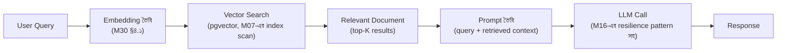

# Module 30 — Search, Analytics ও AI Integration

> **Phase H — Domain Specializations** | পূর্বশর্ত: M07, M09, M10, M16
> পরের module: M32 (৮টা System Design Archetype) — Phase I শুরু

---

## ১. যে LLM feature-টা একরাতে $৪০,০০০ খরচ করে ফেলেছিল

M31-এর payment platform-এ একটা নতুন feature যোগ হলো — merchant support-এর জন্য একটা AI chatbot, প্রতিটা merchant প্রশ্ন করলে একটা LLM (M06-এর external API-র মতোই একটা dependency, কিন্তু per-token pricing সহ) উত্তর দিত। প্রথম সপ্তাহ সব ঠিক চলল। তারপর একটা bug — একটা retry loop (M11 §৬.৩-এর "non-retryable error-কে retryable ভাবা" ভুলের সরাসরি পুনরাবৃত্তি) একটা malformed request-এ **প্রতিটা retry-তে পুরো conversation history পুনরায় LLM-এ পাঠাচ্ছিল**, এবং প্রতিটা retry ব্যর্থ হয়ে আবার retry trigger করছিল।

একরাতে, এই bug-টা প্রায় ৫০,০০০ বার trigger হলো (M16-এর retry storm-এর একটা concrete, ব্যয়বহুল রূপ), প্রতিবার হাজার হাজার token খরচ করে (conversation history ক্রমাগত বড় হচ্ছিল, প্রতিটা retry-তে আরও বেশি context)। সকালে টিম দেখল billing dashboard-এ **$৪০,০০০**-এর একটা bill — M31-এর "সংখ্যা দিয়ে সিদ্ধান্ত নিন" নীতির একটা করুণ বিপরীত উদাহরণ, কারণ কেউ কখনো এই ধরনের cost explosion-এর সম্ভাবনা estimate করেনি বা কোনো budget alert (M21-এর FinOps নীতি) সেট করেনি।

এই ঘটনাটা দেখায় LLM integration একটা সম্পূর্ণ নতুন risk category নিয়ে আসে যা M16-এর resilience pattern এবং M21-এর cost engineering-এর একটা বিশেষভাবে জরুরি, দ্রুত-escalating প্রয়োগ দাবি করে — একটা সাধারণ API call ব্যর্থ হলে সাধারণত শুধু error দেয়, কিন্তু একটা LLM call ব্যর্থ retry loop-এ **সরাসরি টাকা পোড়ায়**, প্রতি সেকেন্ডে exponentially।

---

## ২. Full-Text Search — M07-এর GIN Index-এর সম্পূর্ণ প্রসঙ্গ

### ২.১ Inverted Index — M09-এর LSM Tree আলোচনার একটা সমান্তরাল ডেটা স্ট্রাকচার

```
Forward index (সাধারণ database row): document_id → content
Inverted index (search engine): word → [document_id গুলো যেখানে সেই word আছে]

M07 §৫.৪-এর GIN index এই একই ধারণা PostgreSQL-এর ভেতরে বাস্তবায়ন করে —
"এই শব্দ কোথায় আছে" প্রশ্নের দ্রুত উত্তর, পুরো টেবিল স্ক্যান না করে
```

### ২.২ PostgreSQL Full-Text Search — M07-এর সীমা কোথায়

```python
# PostgreSQL GIN index দিয়ে — M07 §৫.৪-এ যা উল্লেখ করা হয়েছিল
class Merchant(models.Model):
    name = models.CharField(max_length=255)
    search_vector = SearchVectorField(null=True)

    class Meta:
        indexes = [GinIndex(fields=["search_vector"])]

Merchant.objects.annotate(
    search=SearchVector("name")
).filter(search=SearchQuery("acme corp"))
```

**M09-এর polyglot persistence checklist-এর সরাসরি প্রয়োগ, এখানে search domain-এ:** PostgreSQL-এর built-in full-text search কয়েক লক্ষ document পর্যন্ত ভালো কাজ করে (M09-এর "PostgreSQL যথেষ্ট কি না আগে যাচাই করুন" নীতি) — কিন্তু এটাতে নেই: **fuzzy matching** (typo tolerance, "merchnt" → "merchant"), **relevance tuning** (কোন field বেশি গুরুত্বপূর্ণ, M31-এর business-priority নীতির search সংস্করণ), আর **faceted search** (multi-dimensional filter + count একসাথে) বড় স্কেলে দক্ষভাবে।

### ২.৩ Elasticsearch — কখন M09-এর Checklist সেটা Justify করে

```
প্রশ্ন ১: Fuzzy matching/typo tolerance সত্যিই ব্যবসায়িকভাবে গুরুত্বপূর্ণ?
প্রশ্ন ২: Document সংখ্যা M07-এর GIN index-এর ব্যবহারিক সীমা ছাড়িয়েছে
          (measured, অনুমান না — M31-এর estimation নীতি)?
প্রশ্ন ৩: টিমের একটা নতুন সিস্টেম operate করার capacity আছে (M09-এর
          checklist-এর তৃতীয় প্রশ্ন)?

যদি সব "হ্যাঁ" — Elasticsearch যোগ করুন, কিন্তু M12-এর CDC pipeline
(Debezium, M14 §৩.৪) দিয়ে PostgreSQL থেকে sync করা, M14-এর outbox
pattern প্রয়োগ করে dual-write সমস্যা এড়িয়ে
```

**M14-এর outbox pattern-এর সরাসরি প্রয়োগ, search-এর প্রেক্ষাপটে:** PostgreSQL-এ merchant data আপডেট হলে, Elasticsearch index-এও সেটা reflect হতে হবে — এটা একটা classic dual-write সমস্যা (M14 §১-এর ঘটনার সরাসরি সমান্তরাল, শুধু Kafka-র বদলে search index)। M14-এর outbox+CDC pattern এখানে সমান প্রযোজ্য।

---

## ৩. OLTP বনাম OLAP — M09-এর ClickHouse আলোচনার সম্পূর্ণ ETL প্রেক্ষাপট

### ৩.১ Data Warehouse ও ETL/ELT

```
ETL (Extract-Transform-Load): data extract করে, transform করে
  (aggregate, clean), তারপর warehouse-এ load — M08-এর batch processing
  নীতির সাথে সংযুক্ত

ELT (Extract-Load-Transform): raw data আগে load করে, transform পরে
  warehouse-এর নিজস্ব compute ব্যবহার করে (M09-এর ClickHouse-এর
  column-store power কাজে লাগানো, transform আগে থেকে না করে)
```

**M09 §৫-এর ClickHouse আলোচনার সম্পূর্ণ operational প্রেক্ষাপট:** M09-এ আমরা বলেছিলাম "PostgreSQL থেকে ClickHouse-এ CDC দিয়ে sync।" এই CDC pipeline-ই আসলে একটা ETL/ELT process — M14-এর outbox pattern দিয়ে change capture করে, একটা transformation layer (M08-এর data cleaning নীতি) দিয়ে দরকার হলে reshape করে, তারপর M09-এর column-store-এ load করা।

> **Senior Tip:** "ETL নাকি ELT?" — "M09-এর polyglot persistence trade-off-এর একটা নির্দিষ্ট সংস্করণ। ELT আধুনিক data warehouse-এ (ClickHouse, BigQuery) বেশি প্রচলিত কারণ তাদের compute power transformation-এর জন্য যথেষ্ট শক্তিশালী, এবং raw data রাখা future flexibility দেয় (M14-এর Event Sourcing-এর মতো একটা 'পরে নতুন query বানানো যাবে' সুবিধা, কিন্তু analytics-এর জন্য, ledger-এর জন্য না)। ETL তখনও প্রাসঙ্গিক যখন sensitive data transform-এর সময়ই anonymize/mask করা প্রয়োজন (M26-এর PII handling নীতি) — raw sensitive data warehouse-এ কখনো load না করে।"

---

## ৪. Vector Search ও pgvector — M09-এর Extension-First নীতির সম্পূর্ণ প্রসঙ্গ

### ৪.১ Embedding — একটা নতুন ধরনের "Index"

```python
import openai

def get_embedding(text: str) -> list[float]:
    response = openai.embeddings.create(model="text-embedding-3-small", input=text)
    return response.data[0].embedding   # ⚠️ একটা ১৫৩৬-dimension vector,
                                          # text-এর "semantic meaning" ধারণ করে

# pgvector দিয়ে — M09 §৬.২-এর "extension first" নীতির সম্পূর্ণ প্রয়োগ
class SupportTicket(models.Model):
    content = models.TextField()
    embedding = VectorField(dimensions=1536)   # pgvector extension

# Similarity search — M07-এর index scan-এর একটা নতুন ধরনের প্রয়োগ
SupportTicket.objects.annotate(
    distance=CosineDistance("embedding", query_embedding)
).order_by("distance")[:5]   # সবচেয়ে কাছাকাছি ৫টা ticket
```

**M09 §৬.২-এর সরাসরি সম্প্রসারণ:** M09-এ আমরা pgvector-কে "extension first" চিন্তার একটা উদাহরণ হিসেবে উল্লেখ করেছিলাম — একটা নতুন dedicated vector database (Pinecone, Weaviate) না নিয়ে, বিদ্যমান PostgreSQL-এ vector capability যোগ করা। এই একই M07-এর index scan নীতি (nearest-neighbor search-এ HNSW/IVFFlat index ব্যবহার করে, M07-এর B-Tree-র মতোই একটা approximate nearest neighbor algorithm) এখানে vector similarity-তে প্রযোজ্য।

### ৪.২ RAG (Retrieval-Augmented Generation) — একটা সম্পূর্ণ Architecture



```python
def answer_merchant_question(question: str, merchant_id: int) -> str:
    query_embedding = get_embedding(question)

    # M07-এর index scan — শুধু এই merchant-এর নিজস্ব ticket-এ সীমাবদ্ধ,
    # M08-এর multi-tenancy isolation নীতি এখানেও প্রযোজ্য
    relevant_docs = SupportTicket.objects.filter(merchant_id=merchant_id).annotate(
        distance=CosineDistance("embedding", query_embedding)
    ).order_by("distance")[:3]

    context = "\n".join(doc.content for doc in relevant_docs)
    prompt = f"Context:\n{context}\n\nQuestion: {question}\nAnswer based on context:"

    return call_llm_with_resilience(prompt)   # নিচে §৬-এ
```

**M08-এর multi-tenancy isolation নীতির সরাসরি প্রয়োগ, নতুন domain-এ:** এই RAG pipeline-এ যদি `merchant_id` filter miss হয় (M06 §৫.২-এর সেই ঠিক ঘটনা — `get_queryset()`-এ tenant filter না থাকা), একটা merchant অন্য merchant-এর confidential support ticket content LLM response-এ পেয়ে যেতে পারে — এটা M06-এর IDOR-এরই একটা নতুন, AI-context সংস্করণ, কিন্তু এখানে পরিণতি আরও গুরুতর কারণ leak হওয়া data একটা natural-language response-এ মিশে যায়, ধরা পড়া কঠিন।

---

## ৫. Prompt/Response Caching — M10-এর Cache Pattern-এর LLM প্রয়োগ

```python
def call_llm_cached(prompt: str) -> str:
    cache_key = f"llm_response:{hashlib.sha256(prompt.encode()).hexdigest()}"

    cached = cache.get(cache_key)   # M10-এর cache-aside pattern
    if cached:
        return cached

    response = call_llm_with_resilience(prompt)
    cache.set(cache_key, response, timeout=3600)   # M10-এর TTL নীতি
    return response
```

**M10-এর cache-aside pattern-এর একটা বিশেষভাবে উচ্চ-ROI প্রয়োগ:** LLM call M10-এর সাধারণ database query-র চেয়ে **অনেক বেশি ব্যয়বহুল** (both latency এবং টাকা), তাই caching-এর ROI এখানে M10-এর সাধারণ প্রয়োগের চেয়ে বহুগুণ বেশি। M30 §১-এর ঘটনায়, যদি একটা caching layer থাকত (এবং retry logic cache miss-কে respect করত), সেই ৫০,০০০ duplicate call-এর অনেকগুলো cache hit হয়ে যেত, ক্ষতি সীমিত করত।

---

## ৬. LLM Gateway ও Resilience — M16-এর সম্পূর্ণ Toolkit-এর AI প্রয়োগ

### ৬.১ M30 §১-এর ঘটনার সম্পূর্ণ সমাধান

```python
llm_circuit = CircuitBreaker(failure_threshold=5, recovery_timeout=30)   # M16 §৪
llm_retry_budget = RetryBudget(max_retry_ratio=0.05)   # M16 §৩.২ — cost-aware বাজেট

def call_llm_with_resilience(prompt: str, max_tokens=500) -> str:
    # ⚠️ M30 §১-এর ঘটনার মূল প্রতিরোধ — conversation history-র token
    #    count আগেই বাজেট-চেক করা
    token_count = estimate_tokens(prompt)
    if token_count > MAX_ALLOWED_TOKENS:
        raise ValueError(f"Prompt খুব বড় ({token_count} tokens) — M16-এর
                            timeout budget নীতির token সংস্করণ")

    def call():
        return openai.chat.completions.create(
            model="gpt-4o-mini", messages=[{"role": "user", "content": prompt}],
            max_tokens=max_tokens,   # ⚠️ M20-এর resource limit নীতির token সংস্করণ —
                                       # response আকারের একটা hard ceiling
            timeout=10,   # M02-এর timeout নীতি
        )

    def fallback():
        return "দুঃখিত, এই মুহূর্তে সহায়তা পাওয়া যাচ্ছে না। মানুষ agent-এর সাথে কথা বলুন।"

    if not llm_retry_budget.allow_retry():   # M16 §৩.২-এর retry budget,
                                                # এখানে cost-explosion প্রতিরোধ করছে
        return fallback()
    return llm_circuit.call(call, fallback=fallback)
```

**M16-এর সম্পূর্ণ resilience toolkit-এর একটা synthesized প্রয়োগ, cost-awareness যোগ করে:** M16-এ timeout budget ছিল latency-focused; এখানে একটা **token budget** (equivalent, কিন্তু dollar-cost-focused) যোগ হয়েছে। M16-এর retry budget (M16 §৩.২) এখানে বিশেষভাবে গুরুত্বপূর্ণ, কারণ একটা naive retry loop-এর cost consequence M16-এর সাধারণ HTTP retry-র চেয়ে exponentially বেশি ভয়ংকর।

### ৬.২ Streaming Response — M06 §১১-এর Streaming নীতির LLM প্রয়োগ

```python
def stream_llm_response(prompt: str):
    """M06 §১১-এর StreamingHttpResponse নীতির সরাসরি প্রয়োগ — LLM response
    token-by-token আসে, ব্যবহারকারীকে পুরো response-এর জন্য অপেক্ষা
    করানো (M31-এর latency budget নীতি) এড়াতে"""
    def generate():
        stream = openai.chat.completions.create(
            model="gpt-4o-mini", messages=[{"role": "user", "content": prompt}],
            stream=True,
        )
        for chunk in stream:
            if chunk.choices[0].delta.content:
                yield chunk.choices[0].delta.content

    return StreamingHttpResponse(generate(), content_type="text/event-stream")
```

**M06 §১১-এর M02-এর Nginx buffering সতর্কতা এখানেও প্রযোজ্য:** M02 §৮-এর `proxy_buffering off` সতর্কতা LLM streaming response-এও বাধ্যতামূলক — না হলে Nginx পুরো LLM response জমা করে একবারে পাঠাবে, "streaming" UX সম্পূর্ণ নষ্ট হয়ে যাবে, ব্যবহারকারী পুরো generation শেষ হওয়া পর্যন্ত কিছুই দেখবে না।

---

## ৭. Cost ও Latency Control — M21-এর FinOps-এর AI-নির্দিষ্ট সম্প্রসারণ

### ৭.১ Token Cost Monitoring — M30 §১-এর ঘটনার Preventive Solution

```python
@shared_task
def check_llm_spend_alert():
    """M24-এর dashboard/alerting নীতির cost-specific প্রয়োগ —
    M30 §১-এর ঘটনায় এই check-টাই অনুপস্থিত ছিল"""
    today_spend = LLMUsageLog.objects.filter(
        created_at__date=timezone.now().date()
    ).aggregate(total=Sum("cost_usd"))["total"] or 0

    if today_spend > DAILY_BUDGET_THRESHOLD:
        # M25-এর severity classification — cost explosion একটা SEV2
        create_incident(severity="SEV2", message=f"LLM spend ${today_spend} threshold ছাড়িয়েছে")
        disable_llm_feature_flag()   # M22 §৬-এর feature flag instant-kill switch
```

**M22 §৬.১-এর feature flag-এর একটা emergency use case:** M30 §১-এর ঘটনায় সবচেয়ে দ্রুত mitigation হতো একটা feature flag দিয়ে LLM feature সাথে সাথে বন্ধ করা (M22-এর "instant rollback কোনো deployment ছাড়া" সুবিধা) — এই automated check সেটা মানুষের হস্তক্ষেপ ছাড়াই করে, M16-এর circuit breaker নীতির cost-domain প্রয়োগ।

### ৭.২ Model Selection — একটা Latency-Cost-Quality Trade-off

```
M09-এর polyglot persistence trade-off নীতির AI সংস্করণ:

ছোট, দ্রুত model (gpt-4o-mini): কম cost, কম latency, simpler task-এ যথেষ্ট
বড়, ধীর model (gpt-4o, o1): বেশি cost, বেশি latency, জটিল reasoning প্রয়োজনে

M31-এর latency budget নীতির প্রয়োগ: OTP-এর মতো critical, real-time
path-এ কখনো একটা ধীর, ব্যয়বহুল model ব্যবহার করা উচিত না যদি একটা
সরল classification task হয় (M31-এর "সঠিক টুল সঠিক কাজে" নীতি)
```

---

## ৮. Interview Section

### প্রশ্ন ১ (Senior) — "একটা LLM-integrated feature-এ সবচেয়ে বড় নতুন operational ঝুঁকি কী যা traditional API integration-এ নেই?"

**🌟 Senior/Staff Answer**
> "সবচেয়ে গুরুত্বপূর্ণ পার্থক্য হলো **cost volatility-র মাত্রা**। একটা traditional API-তে (M06-এর webhook, M02-এর external call), একটা retry loop bug latency/error rate সমস্যা তৈরি করে — bad, কিন্তু bounded এবং সাধারণত দ্রুত ধরা পড়ে। একটা LLM API-তে, একই bug-টা **সরাসরি এবং দ্রুত টাকা পোড়ায়** — M30 §১-এর ঘটনায় একরাতে $৪০,০০০, কারণ প্রতিটা retry শুধু একটা failed request না, একটা **billed** request, এবং conversation history-র মতো growing context থাকলে প্রতিটা retry আগেরটার চেয়ে বেশি ব্যয়বহুল।
>
> M16-এর সব resilience pattern (circuit breaker, retry budget, timeout) এখানে প্রযোজ্য, কিন্তু আমি একটা অতিরিক্ত স্তর যোগ করি যা traditional API-তে সাধারণত প্রয়োজন হয় না — একটা **explicit token/cost budget**, M21-এর FinOps নীতির real-time, per-request প্রয়োগ। প্রতিটা LLM call-এর আগে token count estimate করা এবং একটা hard ceiling থাকা, আর একটা daily/hourly spend monitor যা threshold ছাড়ালে automatically feature বন্ধ করে দেয় (M22-এর feature flag emergency kill-switch), মানুষের react করার অপেক্ষা না করে — কারণ মানুষ react করার আগেই হাজার হাজার ডলার চলে যেতে পারে।"

---

### প্রশ্ন ২ (Staff / Architecture) — "আমাদের RAG system একটা merchant-এর confidential data অন্য merchant-এর প্রশ্নের উত্তরে leak করেছে। Root cause এবং fix কী?"

**🌟 Senior/Staff Answer**
> "এটা M06 §৫.২-এর IDOR bug-এরই একটা নতুন, বেশি বিপজ্জনক প্রকাশ — root cause প্রায় নিশ্চিতভাবে vector search query-তে tenant isolation filter অনুপস্থিত, ঠিক M06-এর `get_queryset()` bug-এর মতো।
>
> M30 §৪.২-এর RAG pipeline-এ, যদি `SupportTicket.objects.filter(merchant_id=merchant_id)` -এর tenant filter কোনোভাবে bypass হয় (হয়তো একটা shared, cross-tenant embedding index ব্যবহার করা হচ্ছে কোনো isolation ছাড়া), vector similarity search **যেকোনো** merchant-এর সবচেয়ে relevant document খুঁজে বের করবে, শুধু query করা merchant-এর না — আর সেই leaked content সরাসরি LLM prompt-এ চলে যায়, তারপর natural-language response-এ, যেখানে এটা একটা 'normal-looking' answer-এর ভেতরে লুকিয়ে থাকে, M06-এর সাধারণ IDOR bug-এর মতো সরাসরি visible না (একটা API response-এ ভুল object আসাটা obvious, কিন্তু একটা AI response-এ leaked info মিশে থাকাটা subtle)।
>
> **তাৎক্ষণিক mitigation:** M22 §৬-এর feature flag দিয়ে RAG feature বন্ধ করা যতক্ষণ না fix verified।
>
> **Fix:** M08-এর multi-tenancy defense-in-depth নীতি এখানে সবচেয়ে গুরুত্বপূর্ণ — শুধু application-level filter না, M08 §৭.২-এর Row-Level Security (RLS) বিবেচনা করা vector table-এও, যাতে একটা code bug-ও cross-tenant leak তৈরি করতে না পারে database-level enforcement ছাড়া।
>
> **প্রতিরোধ, দীর্ঘমেয়াদী:** M23-এর multi-tenant isolation automated test (M06 §১৫-এর অনুশীলন ৩-এর pattern) RAG pipeline-এও থাকা উচিত — একটা automated test যা explicitly verify করে merchant A-এর query কখনো merchant B-এর data retrieve করে না, প্রতিটা deploy-এর আগে চলে।"

---

### প্রশ্ন ৩ (Coding / Debugging) — "M30 §১-এর ঘটনার কোড দেখুন — কীভাবে এটা ঘটতে পেরেছিল বলুন এবং fix করুন।"

```python
def get_support_response(merchant_id, message, conversation_history):
    try:
        full_context = conversation_history + [{"role": "user", "content": message}]
        response = openai.chat.completions.create(model="gpt-4o", messages=full_context)
        return response.choices[0].message.content
    except Exception:
        return get_support_response(merchant_id, message, conversation_history)   # retry
```

**🌟 Senior Answer**
> "এই কোডে M30 §১-এর ঘটনার সব উপাদান একসাথে আছে:
>
> **১. Blanket exception catch + unconditional retry — M11 §৬.৩-এর error classification-এর সম্পূর্ণ অনুপস্থিতি।** যেকোনো exception (এমনকি একটা non-retryable validation error) সাথে সাথে recursive retry trigger করছে, কোনো condition ছাড়াই।
>
> **২. `conversation_history` ক্রমবর্ধমান — প্রতিটা retry-তে growing cost।** যদি এই function একটা wrapper-এ call হয় যা history-তে message append করতে থাকে (bug-টা এখানে সরাসরি দেখানো হয়নি, কিন্তু M30 §১-এর ঘটনায় এটাই ছিল), প্রতিটা recursive retry পুরনো, ইতিমধ্যে-ব্যর্থ history-সহ একটা larger prompt পাঠাচ্ছে।
>
> **৩. কোনো retry limit নেই — recursive call অসীম হতে পারে।** M16-এর `max_retries` ধারণা সম্পূর্ণ অনুপস্থিত।
>
> **৪. কোনো cost/token budget check নেই (M30 §৬.১)।**
>
> **সংশোধিত সংস্করণ:**
> ```python
> @shared_task(bind=True, max_retries=3, autoretry_for=(requests.Timeout,))  # M11 §৬.৩
> def get_support_response(self, merchant_id, message, conversation_history):
>     full_context = conversation_history + [{'role': 'user', 'content': message}]
>     token_count = estimate_tokens(full_context)
>     if token_count > MAX_ALLOWED_TOKENS:   # M30 §৬.১
>         return 'Conversation খুব দীর্ঘ হয়ে গেছে, নতুন করে শুরু করুন।'
>
>     try:
>         response = openai.chat.completions.create(
>             model='gpt-4o-mini', messages=full_context,
>             max_tokens=500, timeout=10,
>         )
>         return response.choices[0].message.content
>     except openai.BadRequestError:   # ⚠️ non-retryable — malformed request
>         logger.error('llm_bad_request', extra={'merchant_id': merchant_id})
>         return 'দুঃখিত, একটা সমস্যা হয়েছে।'   # retry না
>     except openai.RateLimitError:   # retryable
>         raise self.retry(countdown=5)
> ```
> এখানে exception type অনুযায়ী আলাদা handling (M11-এর retryable/non-retryable), token budget check (M30 §৬.১), Celery-র built-in retry limit (recursive call না) — এই একসাথে M30 §১-এর ঘটনার প্রতিটা contributing factor address করে।"

---

### প্রশ্ন ৪ (Architecture Decision) — "আমাদের একটা নতুন feature-এ, LLM ব্যবহার করে merchant transaction data থেকে automated insight generate করতে চাই। কীভাবে ডিজাইন করবেন যাতে M30 §১-এর ঘটনা আর repeat না হয়?"

**🌟 Senior/Staff Answer**
> "আমি M09-এর polyglot persistence checklist এবং M16-এর resilience toolkit-এর একটা সংশ্লেষণ প্রয়োগ করব, cost-awareness-কে একটা first-class design constraint হিসেবে ধরে, afterthought না।
>
> **প্রথম প্রশ্ন — এটা কি সত্যিই real-time LLM call প্রয়োজন করে?** M31-এর latency budget নীতি অনুযায়ী, যদি এই insight daily/weekly summary হয় (M31-এর 'marketing email < 5 মিনিট'-এর মতো non-critical), আমি এটাকে একটা **batch process** (M11-এর Celery Beat, M08-এর scheduled maintenance-এর মতো) হিসেবে ডিজাইন করব, প্রতিটা user request-এ real-time call না — এটা M30 §১-এর ধরনের ঘটনার blast radius স্বাভাবিকভাবেই সীমিত করে (batch job-এর নিজস্ব rate limit থাকবে, user-triggered infinite loop-এর ঝুঁকি নেই)।
>
> **ডিজাইন:**
> ১. **M30 §৬.১-এর সম্পূর্ণ resilience toolkit** — circuit breaker, retry budget, token budget, timeout — সব একসাথে, একটা shared `call_llm_with_resilience` wrapper-এ যাতে প্রতিটা নতুন LLM feature স্বয়ংক্রিয়ভাবে এই সুরক্ষা পায়, প্রতিটা developer আলাদাভাবে মনে রাখতে না হয়ে (M18-এর reusable pattern নীতি)।
>
> ২. **M24-এর real-time cost monitoring**, একটা dashboard-এ (M24 §৩-এর RED metric-এর cost সংস্করণ — 'Rate' এখানে 'token/hour', 'Errors' হলো bad-request rate) এবং M30 §৭.১-এর automated threshold-based kill switch।
>
> ৩. **M23-এর load/stress testing এই feature-এ নির্দিষ্টভাবে** — একটা deliberate stress test যা simulate করে 'যদি একটা bug ১০০০ বার retry trigger করে, cost কত হবে এবং কত দ্রুত আমাদের alert থামাবে সেটা' — M16-এর chaos engineering নীতির cost-domain প্রয়োগ, deploy করার আগে।
>
> ৪. **M08-এর multi-tenancy isolation ভেরিফাই করা** vector search/RAG অংশে, যদি প্রযোজ্য হয় (M30 §১১-এর প্রশ্ন ২-এর সতর্কতা)।
>
> এই সবকিছু একসাথে — batch-first design, layered resilience, proactive cost monitoring, deliberate stress testing — M30 §১-এর ঘটনাটাকে শুধু 'ঠিক করা' না, একই শ্রেণীর ভবিষ্যৎ ঘটনা structurally অসম্ভব করে তোলা, M22-এর blameless postmortem নীতির (M25) 'সিস্টেম যেন এই ভুল করা কঠিন করে তোলে' দর্শনের সরাসরি প্রয়োগ।"

---

## ৯. হাতে-কলমে অনুশীলন

**১ — Cost explosion পুনরুৎপাদন করুন (৩০ মিনিট, conceptual/mock LLM API দিয়ে)**
একটা mock LLM call function বানান যা token count অনুযায়ী cost হিসাব করে। M30 §১-এর ঘটনার মতো একটা growing-context retry loop simulate করুন (আসল API call ছাড়া), cost কত দ্রুত বাড়ে দেখুন।

**২ — pgvector দিয়ে similarity search implement করুন (৩৫ মিনিট)**
একটা ছোট dataset-এ embedding generate করুন (একটা open-source embedding model বা mock vector দিয়ে), pgvector দিয়ে nearest-neighbor query চালান।

**৩ — LLM resilience wrapper বানান (৩০ মিনিট)**
M30 §৬.১-এর pattern implement করুন — circuit breaker, token budget check, fallback। ইচ্ছাকৃতভাবে ব্যর্থ হওয়া একটা mock LLM call দিয়ে টেস্ট করুন।

**৪ — Multi-tenant RAG isolation টেস্ট করুন (২৫ মিনিট)**
দুইটা merchant-এর জন্য আলাদা support ticket embedding তৈরি করুন। একটা merchant-এর query অন্য merchant-এর data retrieve করছে না নিশ্চিত করতে একটা automated test লিখুন (M06-এর multi-tenant test pattern-এর প্রয়োগ)।

---

## ১০. মূল কথা

1. **LLM integration cost volatility একটা নতুন, দ্রুত-escalating ঝুঁকি** — traditional API-র retry bug latency সমস্যা তৈরি করে, LLM retry bug সরাসরি এবং exponentially টাকা পোড়ায়।
2. **PostgreSQL GIN full-text search বেশিরভাগ ক্ষেত্রে যথেষ্ট** — Elasticsearch শুধু measured প্রয়োজনে (fuzzy matching, scale, faceted search)।
3. **pgvector M09-এর "extension first" নীতির সম্পূর্ণ প্রয়োগ** — ছোট-মাঝারি স্কেলে dedicated vector DB-র প্রয়োজন নেই।
4. **RAG pipeline-এ multi-tenancy isolation M06/M08-এর IDOR নীতির একটা বিশেষভাবে বিপজ্জনক প্রয়োগ** — leak natural-language response-এ মিশে থাকে, detect করা কঠিন।
5. **Prompt/response caching M10-এর সাধারণ cache-aside pattern-এর একটা বিশেষভাবে উচ্চ-ROI প্রয়োগ** — LLM call ব্যয়বহুল, cache hit-এর মূল্য অনেক বেশি।
6. **Token/cost budget M16-এর timeout budget-এর একটা dollar-cost সমতুল্য** — প্রতিটা LLM call-এর আগে explicit ceiling।
7. **Retry budget বিশেষভাবে critical LLM-এ** — একটা naive retry loop সরাসরি, দ্রুত হাজার হাজার ডলার খরচ করতে পারে।
8. **Automated cost monitoring + kill switch (feature flag) মানুষের react করার চেয়ে দ্রুত হতে হবে** — cost explosion মিনিটে ঘটতে পারে, ঘণ্টায় না।
9. **Streaming response-এ M02-এর Nginx buffering সতর্কতা সরাসরি প্রযোজ্য** — না হলে "streaming" UX সম্পূর্ণ নষ্ট হয়।
10. **Model selection একটা latency-cost-quality trade-off** — সরল task-এ ছোট/দ্রুত/সস্তা model, জটিল reasoning-এ বড় model, "সবজায়গায় সবচেয়ে শক্তিশালী model" একটা ব্যয়বহুল ভুল।

---

## পরের Module

আজ M30 দিয়ে **Phase H সম্পূর্ণ হলো** — Real-Time Systems (M27), FinTech (M28), Blockchain (M29), Search/AI (M30)। এখন আমরা **Phase I — System Design ও Career**-এ প্রবেশ করছি, এই handbook-এর চূড়ান্ত সংশ্লেষণ।

**M32 — ৮টা System Design Archetype।** M31 (এই handbook-এর প্রথম module)-এ আমরা system design-এর **methodology** শিখেছিলাম — কীভাবে চিন্তা করতে হয়, কোন ক্রমে। এখন আমরা সেই methodology-কে ৮টা concrete archetype-এ প্রয়োগ করব (Social Feed, Realtime Messaging, Video Streaming, Geo-Dispatch, Payments/Ledger, Order Matching, Inventory/Reservation, Distributed File Storage) — প্রতিটাতে M02-M30-এর সব knowledge একসাথে টেনে এনে, একটা সম্পূর্ণ design walkthrough হিসেবে।
