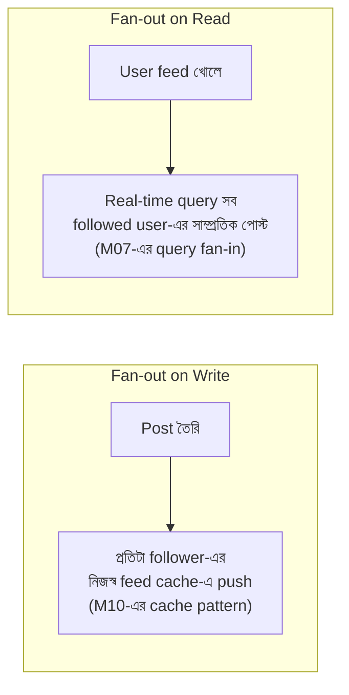
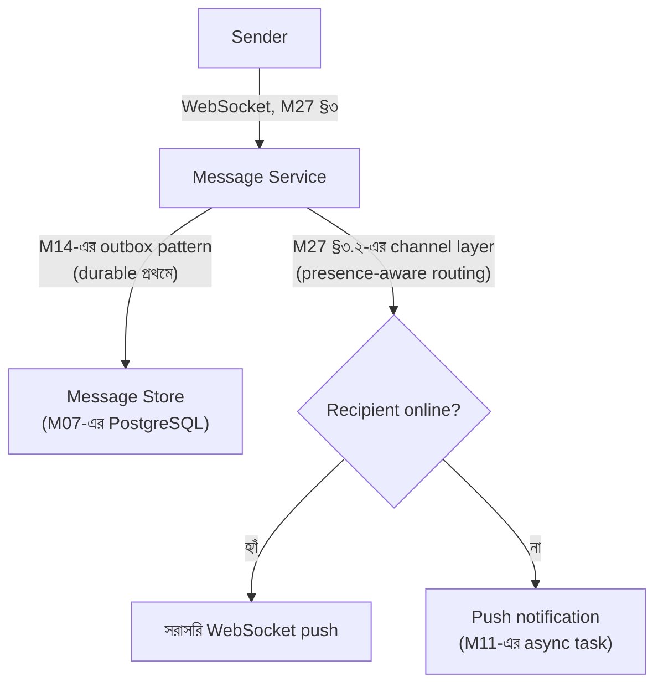
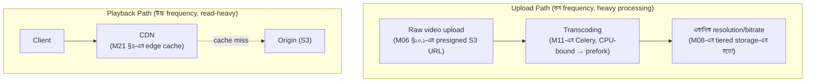
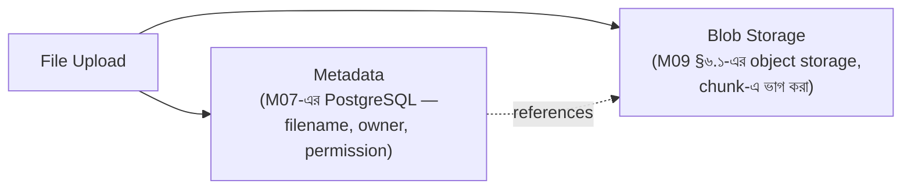

# Module 32 — ৮টা System Design Archetype

> **Phase I — System Design ও Career** | পূর্বশর্ত: সম্পূর্ণ M02–M31
> পরের module: M33 (Engineering Excellence ও Career Growth)

---

## ভূমিকা — কেন ৮টা, ১৮টা না

M31 §৪-এর blueprint-এ ব্যাখ্যা করা হয়েছিল কেন ১৮টা জনপ্রিয় system design প্রশ্ন (Uber, WhatsApp, Netflix, ...) আসলে ৮টা **archetype**-এ পড়ে — একটা archetype ভালো বুঝলে তার সব variant আপনি নিজেই design করতে পারবেন। এই module প্রতিটা archetype-কে M31-এর ৬-ধাপ methodology (Clarify → Estimate → API → Data Model → High-Level Design → Deep Dive) দিয়ে walkthrough করে, কিন্তু **শুধু সেই অংশগুলোতে গভীরে যায় যেখানে archetype-টা সত্যিই অনন্য** — বাকি সবকিছু M02-M30-এর সংশ্লিষ্ট module-কে reference করে।

প্রতিটা archetype-এর শেষে একটা "মূল sentence" আছে — যদি ইন্টারভিউতে শুধু একটা কথা বলার সময় থাকে, এটাই বলবেন।

---

## Archetype ১ — Social Feed ও Fan-out (Instagram, Twitter, Facebook Feed)

### Requirement ও Estimation
```
১০ কোটি DAU, প্রতিজন গড়ে ১০০ জনকে follow করে, দিনে ৫০টা পোস্ট দেখে
Celebrity-দের কোটি কোটি follower থাকতে পারে (M12 §৭.২-এর hot partition
সমস্যার সামাজিক-নেটওয়ার্ক সংস্করণ)

Write QPS (নতুন পোস্ট): মাঝারি
Read QPS (feed দেখা): write-এর তুলনায় ১০০-১০০০× বেশি (M31-এর read:write
ratio নীতি)
```

### মূল স্থাপত্য সিদ্ধান্ত — Fan-out on Write বনাম Read



এটাই M27 §৫.১-এ আমরা যে ধারণা দেখেছিলাম তার কেন্দ্রীয়, সবচেয়ে বড় স্কেলে প্রয়োগ। **Hybrid সমাধান** (M12 §৭.২-এর hot partition সমাধানের সরাসরি প্রয়োগ): সাধারণ user-এর পোস্ট fan-out-on-write (M10-এর Redis-এ প্রতিটা follower-এর feed list-এ push, দ্রুত read), কিন্তু celebrity (কোটি follower) পোস্ট fan-out-on-read (write-time-এ কোটি push করা অসম্ভব — M20-এর capacity math অনুযায়ী)। Client-side এই দুইটা merge করে (celebrity-দের পোস্ট আলাদাভাবে query করে fan-out feed-এর সাথে মিশিয়ে দেখানো)।

### Data Model ও Deep Dive
Feed cache নিজেই M10-এর একটা Redis sorted set (score = timestamp) — M06 §৭-এর cursor pagination নীতি প্রয়োগ করে feed scroll করা, offset pagination না (M31-এর payment history-র মতো একই duplicate/skip ঝুঁকি এড়াতে)।

**Failure mode:** M10 §১২-এর fail-open নীতি — Redis feed cache down হলে, fan-out-on-read fallback (M16-এর graceful degradation), ধীর কিন্তু কার্যকরী।

> **মূল sentence:** "Feed system-এর কেন্দ্রীয় সমস্যা write-time বনাম read-time fan-out trade-off, আর celebrity account-এর জন্য hybrid approach — bulk-এর জন্য fast write-time push, outlier-এর জন্য read-time query, ঠিক M12-এর hot partition সমাধানের মতো।"

---

## Archetype ২ — Realtime Messaging (WhatsApp)

এই archetype **M27-এর প্রায় সম্পূর্ণ module-এর সরাসরি প্রয়োগ** — নতুন কিছু বলার দরকার নেই, শুধু M27-এর টুকরোগুলো একসাথে জোড়া লাগানো:



**যা নতুন এই archetype-এ:** **End-to-end encryption** — M26-এর encryption নীতির একটা বিশেষ প্রয়োগ যেখানে **সার্ভার নিজেও** message content দেখতে পারে না (M26-এর "কখনো data store না করা" নীতির চরম রূপ, M29-এর non-custodial wallet দর্শনের সাথে সাদৃশ্যপূর্ণ — key শুধু client-এ, সার্ভারে কখনো plaintext না)। Message routing/delivery metadata (কে কাকে কখন পাঠাল) এখনো সার্ভার জানে, কিন্তু content না।

**Read receipt/typing indicator:** M27 §৭.১-এর presence pattern-এর সরাসরি সম্প্রসারণ — TTL-ভিত্তিক ephemeral state, M08-এর permanent message store থেকে সম্পূর্ণ আলাদা persistence tier।

> **মূল sentence:** "WhatsApp মূলত M27-এর real-time architecture, কিন্তু end-to-end encryption যোগ করে — এর মানে সার্ভার শুধু encrypted blob route করে, কখনো content দেখে না, যা M26-এর 'sensitive data store না করা' নীতির সবচেয়ে কঠোর প্রয়োগ।"

---

## Archetype ৩ — Video Streaming ও CDN (YouTube, Netflix)

### মূল স্থাপত্য — Upload বনাম Playback সম্পূর্ণ আলাদা Path



**M09 §৬.১-এর object storage নীতির চরম প্রয়োগ:** video file কখনো database-এ না, সবসময় S3/object storage — এবং M08 §৪.৩-এর tiered storage এখানে "resolution tier" হিসেবে প্রকাশ পায় (adaptive bitrate streaming, network condition অনুযায়ী client ভিন্ন quality request করে)।

**M21 §৪-এর CDN নীতির সবচেয়ে বড় স্কেলের প্রয়োগ:** M02-এর cross-region latency সমস্যা এখানে সবচেয়ে critical — একটা video file বারবার origin থেকে serve করা M21-এর data transfer cost এবং M02-এর latency উভয়ই বিপর্যয়কর করে তুলবে, CDN ছাড়া এই architecture কার্যত অসম্ভব।

**Deep dive — Transcoding queue:** M11-এর CPU-bound task routing (prefork pool) সরাসরি প্রযোজ্য — video transcoding GIL-bound না কারণ এটা mostly C library (ffmpeg) call, কিন্তু M11-এর queue isolation (M27 §৪.১-এর bulkhead নীতি) এখনো গুরুত্বপূর্ণ, transcoding-এর ভারী resource ব্যবহার সাধারণ API traffic থেকে আলাদা রাখতে।

> **মূল sentence:** "Video streaming-এর মূল architectural insight হলো upload (rare, write-heavy, CPU-heavy) আর playback (frequent, read-heavy) সম্পূর্ণ ভিন্ন optimization প্রোফাইল চায় — CDN playback-কে solve করে, dedicated transcoding pipeline upload-কে, দুইটা কখনো একই resource pool শেয়ার করা উচিত না (M16-এর bulkhead)।"

---

## Archetype ৪ — Geo-Dispatch ও Matching (Uber, Food Delivery, Ride Sharing)

### নতুন উপাদান — Geospatial Indexing

```python
# M07-এর B-Tree index geospatial query-তে সরাসরি কাজ করে না —
# একটা নতুন index type প্রয়োজন
# PostGIS (PostgreSQL extension) — M09-এর "extension first" নীতির
# geospatial প্রয়োগ
Driver.objects.filter(
    location__distance_lte=(user_location, D(km=5))
).annotate(distance=Distance("location", user_location)).order_by("distance")
```

**Geohash — M03-এর DSA-নির্ভর কোড-এর একটা concrete প্রয়োগ:** lat/long-কে একটা string prefix-এ রূপান্তর করে (M07-এর B-Tree prefix matching-এর সাথে compatible করে), কাছাকাছি অবস্থান একই/সাদৃশ্যপূর্ণ prefix পায় — M07-এর leftmost-prefix index নীতির geospatial সংস্করণ।

### Real-time Location Update — M27-এর WebSocket-এর একটা উচ্চ-Frequency প্রয়োগ

```
Driver location প্রতি কয়েক সেকেন্ডে update হয় — M27 §৯.৩-এর "live price
feed" pattern-এর সরাসরি সমতুল্য: শুধু latest location matter করে,
history persistence প্রয়োজন নেই (M14-এর over-engineering সতর্কতা)
```

### Matching Algorithm — একটা Domain-Specific Optimization Problem

Nearest available driver খোঁজা, কিন্তু শুধু distance না — M18-এর Domain Service নীতির প্রয়োগ (একাধিক factor: driver rating, ETA, surge pricing অঞ্চল)। এটা M28-এর risk engine-এর মতোই একটা multi-attribute decision function।

**Failure mode — M16-এর ঘটনার একটা geo-specific সংস্করণ:** যদি matching service ধীর হয় (M16 §১-এর ঘটনার মতো), পুরো booking flow আটকে যেতে পারে — M16-এর timeout budget + fallback (কম-optimal কিন্তু দ্রুত match) এখানে ব্যবসায়িকভাবে critical, কারণ ব্যবহারকারী "loading" স্ক্রিনে অপেক্ষা করতে থাকবে।

> **মূল sentence:** "Geo-dispatch-এর মূল challenge হলো geospatial index (PostGIS/geohash) দিয়ে efficient proximity search আর high-frequency, ephemeral location update (M27-এর price-feed pattern) — matching নিজে একটা multi-attribute optimization যা M16-এর latency budget-এর মধ্যে সম্পন্ন করতে হয়, ব্যবহারকারী active অপেক্ষা করছে।"

---

## Archetype ৫ — Payments ও Ledger (Stripe, Banking Core)

এই archetype **M28-এর সম্পূর্ণ module**-এর সরাসরি প্রয়োগ, এবং M31-এর payment platform এই পুরো handbook-এর running example। এখানে পুনরাবৃত্তি না করে, শুধু সেই decision-গুলো যা "system design interview"-তে specifically expected:

```
Estimation (M31 §৭): merchant-প্রতি TPS, storage growth, partition
                       প্রয়োজন (M08 §৪)
API (M31 §২): idempotency key বাধ্যতামূলক, 202 Accepted (async),
              opaque ID
Data model (M31 §৩, M28 §২): double-entry ledger, money-as-integer
Architecture (M31 §৪): outbox pattern, PSP call async, circuit breaker
Deep dive (M31 §৫, M28 §৩): idempotency across three layers
```

> **মূল sentence:** "Payment system design-এ সবচেয়ে গুরুত্বপূর্ণ interview signal হলো idempotency (client-facing key + internal task + PSP-facing key, M28 §৩) এবং double-entry ledger (M28 §২) নিয়ে প্রথমে কথা বলা, তারপর scaling — কারণ এই domain-এ correctness scale-এর চেয়ে আগে আসে।"

---

## Archetype ৬ — Order Matching Engine (Binance, Stock Exchange)

### এখানে যা সম্পূর্ণ ভিন্ন — Extreme Low Latency, Single-Threaded Core

```
M31-এর payment system 200-500ms latency-তে ঠিক আছে (M31-এর OTP <3s
budget)। Order matching engine microsecond-level latency চায় —
M04-এর GIL/Python discussion এখানে বিপরীত দিকে যায়: matching core
সম্ভবত Python-এ না, C++/Rust/Java-তে (M31 §১৪-এর "সঠিক ভাষা সঠিক কাজে"
নীতির সবচেয়ে স্পষ্ট ব্যতিক্রম)
```

### Order Book — একটা In-Memory Data Structure, M09-এর LSM/B-Tree বিতর্কের বাইরে

Order book সাধারণত সম্পূর্ণ **in-memory** (M10-এর Redis speed-এর ধারণাও এখানে যথেষ্ট ধীর) — একটা sorted structure (price-time priority) যা matching engine সরাসরি manage করে, কোনো database round-trip প্রতিটা order-এ না। **Persistence async** (M14-এর outbox pattern প্রয়োগ — matching decision নেওয়ার পরে, ledger update async ভাবে হয়, M31-এর "external call transaction-এর বাইরে" নীতির একটা চরম সংস্করণ যেখানে এমনকি database write-ও matching hot path-এর বাইরে)।

### Single Writer per Symbol — M12 §১-এর Partition Key নীতির সবচেয়ে কঠোর প্রয়োগ

```
প্রতিটা trading pair (BTC/USDT) একটা single-threaded matching process-এ
— M12-এর partition key নীতি ("একই key-র সব event একই partition-এ,
ordering guarantee") এখানে architectural বাধ্যবাধকতা: order matching-এ
ordering ভুল হলে সরাসরি আর্থিক ক্ষতি (M28-এর correctness-first নীতি)
```

> **মূল sentence:** "Order matching engine-এর মূল constraint হলো extreme, deterministic low latency এবং perfect ordering per-symbol — এই দুইটা মিলে প্রায়ই M31-এর সাধারণ Python/Django stack-কে অনুপযুক্ত করে তোলে matching core-এর জন্য, যদিও বাকি সিস্টেম (API, ledger, M31-এর payment stack) Django-তেই থাকতে পারে।"

---

## Archetype ৭ — Inventory ও Reservation (Ticket Booking, Airline, E-commerce Checkout)

### মূল সমস্যা — M05 §৮.১-এর Race Condition-এর সবচেয়ে High-Stakes সংস্করণ

```python
# ✅ M05-এর select_for_update() + M31-এর overselling-প্রতিরোধ নীতি,
# কিন্তু এখানে "over-refund"-এর বদলে "overselling" ঝুঁকি
def reserve_seat(flight_id, seat_id, user_id):
    with transaction.atomic():
        seat = Seat.objects.select_for_update().get(flight_id=flight_id, id=seat_id)
        if seat.status != "available":
            raise SeatUnavailableError()   # M18-এর Aggregate invariant
        seat.status = "reserved"
        seat.reserved_by = user_id
        seat.reserved_until = timezone.now() + timedelta(minutes=10)   # M10-এর TTL নীতি
        seat.save()
```

**M10-এর TTL নীতির একটা critical প্রয়োগ — Reservation Expiry:** একটা "reserved but not paid" seat চিরকাল আটকে থাকতে পারে না — M10-এর cache TTL ধারণা এখানে database-level এ প্রয়োগ (একটা Celery Beat task, M11-এর pattern, periodically expired reservation release করে, M08-এর partition maintenance task-এর মতো)।

**High-contention hot item — M12 §৭.২-এর hot partition সমস্যার একটা inventory সংস্করণ:** একটা extremely popular concert-এর টিকিট (সব একই সময়ে চেষ্টা করছে) M07-এর row lock-এ massive contention তৈরি করে। সমাধান M10-এর distributed approach — একটা Redis-based counter (M10 §৮-এর atomic `INCR`) দিয়ে "available count" দ্রুত track করা, শুধু সফল reservation-এই database-এ যাওয়া।

> **মূল sentence:** "Inventory/reservation system-এর মূল challenge হলো overselling প্রতিরোধ (M05-এর select_for_update()) আর reservation expiry (M10-এর TTL pattern) — hot item-এ (viral product, popular concert) M12-এর hot partition সমাধানের ধারণা প্রয়োজন হয়, direct database lock এড়িয়ে একটা fast, atomic counter দিয়ে।"

---

## Archetype ৮ — Distributed File Storage (Google Drive, S3-like)

### মূল স্থাপত্য — Metadata বনাম Blob সম্পূর্ণ আলাদা Storage



**M09 §৬.১-এর নীতির সবচেয়ে pure প্রয়োগ:** কখনো raw file bytes database-এ না — শুধু metadata (M07-এর সাধারণ relational data) আর blob storage-এ একটা reference। বড় file chunk-এ ভাগ করা (M08-এর partitioning ধারণার storage সংস্করণ) — deduplication সুবিধা দেয় (একই chunk একাধিক file-এ শেয়ার হতে পারে, content-addressable storage, M07-এর hash index-এর সাথে সাদৃশ্যপূর্ণ)।

### Sharing ও Permission — M18-এর RBAC/ABAC-এর একটা File-System প্রয়োগ

```
M26 §৮-এর ABAC নীতির সরাসরি প্রয়োগ: "কে এই file access করতে পারে"
একাধিক attribute (owner, shared-with list, organization membership,
public/private) — M18-এর Domain Service pattern precisely এখানে fit করে
```

### Sync Conflict Resolution — M15-এর Vector Clock-এর একটা Concrete, User-Facing প্রয়োগ

```
দুইজন ব্যবহারকারী offline-এ একই file edit করে, পরে sync করে —
M15 §৭.৩-এর vector clock ধারণা এখানে সরাসরি প্রয়োজন: এই দুই edit
কি causally সংযুক্ত (একজন আরেকজনের change দেখেছে) নাকি সত্যিই
concurrent (conflict, user-কে জানাতে হবে "conflict version" হিসেবে,
M15-এর Amazon shopping cart উদাহরণের মতো)
```

> **মূল sentence:** "Distributed file storage-এর মূল architectural সিদ্ধান্ত হলো metadata/blob separation (M09-এর object storage নীতি), এবং সবচেয়ে interesting deep-dive হলো conflict resolution multi-device sync-এ — এখানে M15-এর vector clock তত্ত্ব একটা abstract distributed-systems ধারণা থেকে সরাসরি user-facing feature ('conflicted copy') হয়ে ওঠে।"

---

## সংশ্লেষণ — প্রতিটা Archetype একই Toolbox থেকে আসে

```
এই ৮টা archetype সম্পূর্ণ ভিন্ন দেখতে, কিন্তু প্রতিটার সমাধান M02-M30-এর
একই মৌলিক টুলবক্স থেকে এসেছে, শুধু ভিন্ন combination-এ:

  M07-এর row lock          → refund (M05), reservation (Archetype ৭)
  M10-এর TTL                → cache, reservation expiry, presence (M27)
  M12-এর partition/ordering → payment event, hot inventory, matching engine
  M14-এর outbox pattern     → payment, chat, order matching persistence
  M16-এর circuit breaker    → payment PSP call, matching engine risk check
  M18-এর Aggregate invariant → refund, seat reservation, order book
  M09-এর extension-first    → search (M30), geo (PostGIS), vector (pgvector)
```

**এটাই system design interview-এর সবচেয়ে গুরুত্বপূর্ণ meta-skill:** একটা নতুন, অপরিচিত প্রশ্ন পেলে, এটাকে এই ৮টা archetype-এর একটার (বা একাধিকের সংমিশ্রণের) সাথে মেলানো, তারপর সেই archetype-এর জন্য এই handbook-এর সংশ্লিষ্ট module-এর সমাধান প্রয়োগ করা — নতুন করে চিন্তা করা না, বরং **প্যাটার্ন-ম্যাচিং।**

---

## Interview Section — Archetype নির্বাচন ও সংমিশ্রণ

### প্রশ্ন ১ (Staff) — "Design a food delivery platform (Uber Eats-এর মতো)।"

**🌟 Senior/Staff Answer**
> "এটা আসলে **তিনটা archetype-এর সংমিশ্রণ**, এবং সেটা প্রথমে চিহ্নিত করা গুরুত্বপূর্ণ। রেস্টুরেন্ট থেকে delivery person-এর কাছে assignment হলো **Archetype ৪ (Geo-Dispatch)** — nearest available driver খোঁজা। Order placement এবং payment হলো **Archetype ৫ (Payments/Ledger)** — M31-এর পুরো payment architecture সরাসরি প্রযোজ্য। Menu/inventory management (একটা item 'sold out' হওয়া) হলো **Archetype ৭ (Inventory/Reservation)**, যদিও কম contention-critical restaurant booking-এর তুলনায়।
>
> আমি ইন্টারভিউতে এই তিনটা component আলাদা করে চিহ্নিত করব প্রথমে, তারপর জিজ্ঞেস করব কোনটাতে গভীরে যেতে হবে — কারণ ৪৫ মিনিটে তিনটাই সমান গভীরতায় কভার করা অসম্ভব (M31 §৩-এর সময় বণ্টন নীতি)।"

### প্রশ্ন ২ (Senior) — "একটা নতুন, অপরিচিত system design প্রশ্ন পেলে কীভাবে দ্রুত approach ঠিক করবেন?"

**🌟 Senior/Staff Answer**
> "প্রথমে M31 §০-এর clarifying question দিয়ে core operation বুঝি — এই সিস্টেমের মূল read/write pattern কী। তারপর M32-এর ৮টা archetype-এর সাথে mental match করি: 'উচ্চ read:write ratio, personalized content' → feed archetype। 'Persistent bidirectional connection' → messaging। 'Location-based matching' → geo-dispatch। ইত্যাদি।
>
> এই pattern-matching approach-টাই একটা নতুন প্রশ্নকে immediately tractable বানায় — আমি জানি এই archetype-এ কোন ধরনের trade-off গুরুত্বপূর্ণ হবে (fan-out? ordering? contention?), তাই M31-এর estimation এবং data model ধাপে সেই নির্দিষ্ট প্রশ্নগুলো জিজ্ঞেস করতে পারি প্রথম থেকেই, generic প্রশ্ন না করে।"

---

## হাতে-কলমে অনুশীলন

**১ — একটা নতুন system design করুন archetype ম্যাপিং দিয়ে (৪৫ মিনিট)**
একটা "Airbnb" design করুন। প্রথমে চিহ্নিত করুন এটা কোন archetype-গুলোর সংমিশ্রণ (search/discovery, booking/reservation, payment)। প্রতিটা অংশের জন্য M32-এর সংশ্লিষ্ট archetype-এর সমাধান প্রয়োগ করুন।

**২ — একটা archetype-এর deep dive করুন (৪০ মিনিট)**
M32-এর ৮টার একটা বেছে নিয়ে, M31-এর সম্পূর্ণ ৬-ধাপ methodology দিয়ে সম্পূর্ণভাবে design করুন — clarify, estimate, API, data model, architecture, deep dive — নিজের হাতে লিখে।

---

## মূল কথা

1. **১৮টা জনপ্রিয় system design প্রশ্ন ৮টা archetype-এ পড়ে** — একটা archetype ভালো বুঝলে তার সব variant design করা যায়।
2. **প্রতিটা archetype-এর সমাধান M02-M30-এর একই টুলবক্স থেকে আসে**, শুধু ভিন্ন সংমিশ্রণে — নতুন জ্ঞান না, প্যাটার্ন-প্রয়োগ।
3. **Fan-out on write বনাম read** (Feed) — M12-এর hot partition সমাধানের সামাজিক-নেটওয়ার্ক সংস্করণ।
4. **End-to-end encryption** (Messaging) — M26-এর "sensitive data store না করা" নীতির চরম রূপ।
5. **Upload বনাম playback path সম্পূর্ণ আলাদা** (Video) — M16-এর bulkhead নীতি।
6. **Geospatial index + ephemeral location** (Geo-dispatch) — M07-এর index নীতি + M27-এর price-feed pattern।
7. **Idempotency + double-entry ledger** (Payments) — M28-এর সম্পূর্ণ module।
8. **Extreme low latency প্রায়ই Python-এর বাইরে নিয়ে যায়** (Matching engine) — সঠিক ভাষা সঠিক কাজে নীতির ব্যতিক্রম-প্রমাণকারী উদাহরণ।
9. **Overselling প্রতিরোধ + reservation TTL** (Inventory) — M05-এর race condition + M10-এর TTL।
10. **Metadata/blob separation + vector clock conflict resolution** (File storage) — M09-এর object storage + M15-এর distributed systems theory-র সবচেয়ে concrete, user-facing প্রয়োগ।
11. **একটা বাস্তব প্রশ্ন প্রায়ই একাধিক archetype-এর সংমিশ্রণ** (food delivery = geo-dispatch + payments + inventory) — প্রথমে সেই সংমিশ্রণ চিহ্নিত করা, তারপর সময় বণ্টন করা।

---

## পরের Module

**M33 — Engineering Excellence ও Career Growth।** এই handbook-এর শেষ module। আজ পর্যন্ত আমরা সম্পূর্ণভাবে **technical** content কভার করেছি। শেষ module-এ আমরা code review discipline, RFC/ADR writing, mentoring, stakeholder communication, আর সবচেয়ে গুরুত্বপূর্ণ — Senior বনাম Staff বনাম Principal engineer-এর মধ্যে concrete পার্থক্য, যা এই পুরো handbook জুড়ে প্রতিটা "Senior Tip" এবং "Staff Answer"-এ implicit ছিল, এখন explicit করা হবে।
