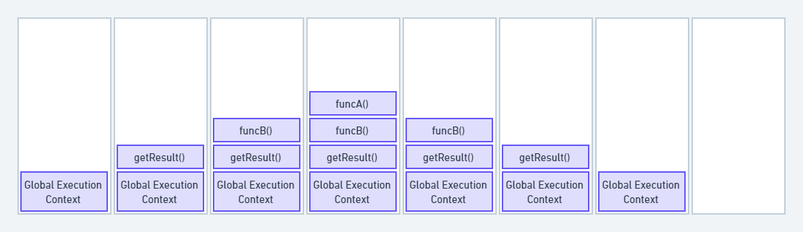

# JS Execution Context
When the JS engine scans a file, it makes an environment called the execution context. That handle the transformations exection of the code
## Types of Context
* Global: This context created when JS first starts run
* Function: when the functions is called.

## Phases of the Context
* Createion: Allocate memory for variable & functions
* Execution: Execute code line by line from top to bottom.

## Each of the phase has 2 parts
* Memory
* Code


## Call Stack
To keep the all tracking of contexts including global & function. It use LIFO structure.

```javascript
    function funcA(m,n) {
        return m * n;
    }

    function funcB(m,n) {
        return funcA(m,n);
    }

    function getResult(num1, num2) {
        return funcB(num1, num2)
    }

    var res = getResult(5,6);

    console.log(res); // 30
```




The call stack has its own fixed size depending on the system or browser. If the number of contexts exceeds the limit, then a stack overflow error will occur. This happens with a recursive function that has no base condition.