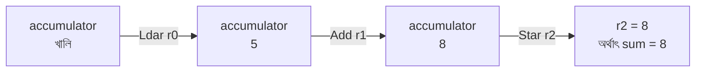
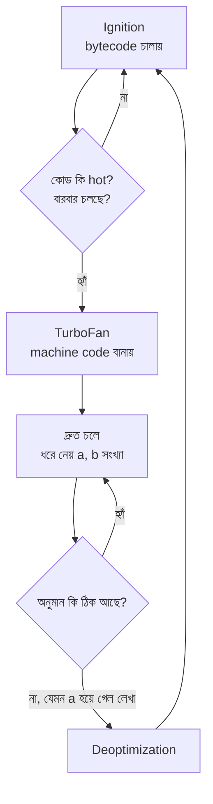
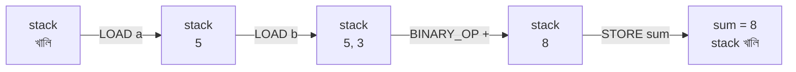
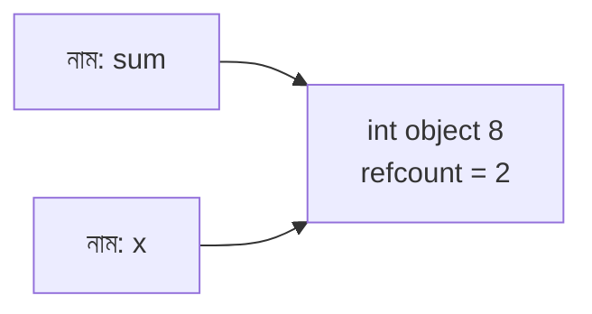
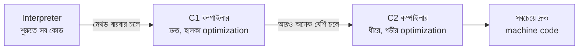
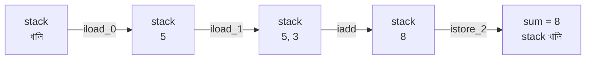
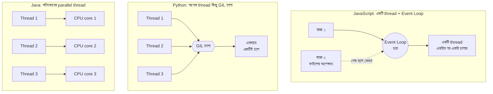

# JavaScript vs Python vs Java: পর্দার আড়ালে কোড কীভাবে চলে

এই লেখায় তিনটি জনপ্রিয় ভাষা (JavaScript, Python, Java) আপনার লেখা কোড কীভাবে চালায়, সেটা সহজ ভাষায় বোঝানো হয়েছে। প্রতিটি কঠিন শব্দ প্রথমবার আসার সময়ই ব্যাখ্যা করা হয়েছে, আর শেষে একটা শব্দ-তালিকা (Glossary) আছে।

উদাহরণ হিসেবে সব জায়গায় একই ছোট কাজ ধরা হয়েছে: দুটো সংখ্যা যোগ করা (`a = 5`, `b = 3`, `sum = a + b`)।

> ছবিগুলো `Mermaid` নামের টেক্সট-ভিত্তিক ডায়াগ্রাম দিয়ে আঁকা। GitHub, VS Code (Markdown Preview), Obsidian ও বেশিরভাগ আধুনিক Markdown ভিউয়ারে এগুলো ছবি হয়ে দেখা যায়। আপনার ভিউয়ারে ছবি না এলে ডায়াগ্রামের কোড দেখা যাবে, তবে মূল বিষয়গুলো নিচের লেখা ও টেক্সট-চিত্রে আছে।

---

## ১. আগে একটা মূল প্রশ্ন: কোড সরাসরি চলে না কেন?

কম্পিউটারের CPU শুধু `Machine code` বোঝে। Machine code হলো 0 আর 1 দিয়ে লেখা নির্দেশ, যা সরাসরি CPU চালাতে পারে। মানুষ 0 আর 1 দিয়ে কোড লেখে না। মানুষ লেখে `sum = a + b` এর মতো পড়ার উপযোগী কোড, যাকে বলে `Source code` (সোর্স কোড, মানে আপনার লেখা মূল কোড)।

তাই source code থেকে machine code পর্যন্ত যেতে মাঝখানে কিছু রূপান্তর লাগে। তিনটি ভাষা এই রূপান্তর তিনটি আলাদা পথে করে। মূল পার্থক্য সেখানেই।

---

## ২. তিনটি মূল ধারণা: Compiler, Interpreter, JIT

| ধারণা | মানে | সহজ উপমা |
|---|---|---|
| `Compiler` (কম্পাইলার) | পুরো কোড আগে থেকে অন্য রূপে বদলে ফেলে, তারপর চালানো হয় | পুরো বই আগে অনুবাদ করে ছাপিয়ে নেওয়া |
| `Interpreter` (ইন্টারপ্রেটার) | কোড একটার পর একটা লাইন পড়ে সাথে সাথে চালায় | মঞ্চে বসে একজন দোভাষী বক্তার প্রতিটি বাক্য সাথে সাথে অনুবাদ করছেন |
| `JIT` (Just-In-Time compiler) | প্রোগ্রাম চলার সময়েই বারবার চলা অংশ বেছে নিয়ে সেটাকে দ্রুত machine code বানায় | দোভাষী দেখলেন একটা বাক্য বারবার আসছে, তাই সেটার অনুবাদ মুখস্থ করে রাখলেন |

আরেকটি জরুরি শব্দ `Bytecode` (বাইটকোড)। এটা source code আর machine code-এর মাঝামাঝি একটা সহজ ভাষা। এটা কোনো নির্দিষ্ট CPU-র জন্য নয়, বরং একটা `Virtual Machine` (ভার্চুয়াল মেশিন, মানে সফটওয়্যারের ভেতরে বানানো কাল্পনিক কম্পিউটার) এটা বোঝে।

তিন ভাষাই bytecode ব্যবহার করে। পার্থক্য হলো bytecode কে কীভাবে চালানো হয় আর কখন machine code বানানো হয়।

---

## ৩. তিন ভাষার পাইপলাইন এক নজরে

`Pipeline` (পাইপলাইন) মানে ধাপে ধাপে সাজানো কাজের ধারা, যেখানে এক ধাপের ফল পরের ধাপে যায়।

```mermaid
flowchart TB
  subgraph JS["JavaScript (V8 ইঞ্জিন)"]
    direction LR
    J1["সোর্স কোড"] --> J2["Parser"] --> J3["AST"] --> J4["Ignition<br/>bytecode চালায়"] --> J5["TurboFan JIT<br/>hot কোডে"] --> J6["Machine code"]
  end
  subgraph PY["Python (CPython)"]
    direction LR
    P1["সোর্স কোড"] --> P2["Parser"] --> P3["AST"] --> P4["Compiler"] --> P5["Bytecode<br/>.pyc"] --> P6["PVM<br/>bytecode চালায়<br/>সাধারণত JIT নেই"]
  end
  subgraph JV["Java (JVM)"]
    direction LR
    V1["সোর্স কোড<br/>.java"] --> V2["javac<br/>compile"] --> V3["Bytecode<br/>.class"] --> V4["ClassLoader<br/>+ Verifier"] --> V5["Interpreter"] --> V6["JIT<br/>C1 ও C2"] --> V7["Machine code"]
  end
```



টেক্সট সংস্করণ (যদি ছবি না দেখা যায়):

```
JavaScript (V8 ইঞ্জিন):
  সোর্স কোড → Parser → AST → Ignition (bytecode চালায়) → TurboFan (JIT) → machine code
                                       ↑ ঘন ঘন চলা অংশ hot হলে ↑

Python (CPython):
  সোর্স কোড → Parser → AST → Compiler → bytecode (.pyc) → PVM (bytecode চালায়)
                                                        (সাধারণত JIT নেই)

Java (JVM, HotSpot):
  সোর্স কোড (.java) → javac (কম্পাইলার) → bytecode (.class)
        → JVM: ClassLoader → Verifier → Interpreter → JIT (C1, C2) → machine code
```

লক্ষ্য করুন Java-তে আলাদা একটা `javac` ধাপ আছে, যা প্রোগ্রাম চালানোর আগেই আলাদাভাবে চালাতে হয়। JavaScript ও Python-এ compile করার কাজটা প্রোগ্রাম চালু হওয়ার সময় ভেতরে ভেতরে নিজে থেকেই হয়ে যায়।

---

## ৪. JavaScript: ধাপে ধাপে

JavaScript-এর জনপ্রিয় ইঞ্জিন `V8` (Chrome ব্রাউজার আর `Node.js`-এ ব্যবহৃত)। `Engine` (ইঞ্জিন) হলো সেই প্রোগ্রাম, যা JavaScript কোড পড়ে চালায়।

### ধাপগুলো

1. **সোর্স কোড:** আপনি লেখেন `let sum = a + b;`।
2. **Parser → AST:** `Parser` কোডকে ছোট ছোট টুকরো (`Token`) করে ভাগ করে: `let`, `sum`, `=`, `a`, `+`, `b`। তারপর সেগুলো দিয়ে একটা `AST` (Abstract Syntax Tree, মানে কোডের গাছের মতো কাঠামো) বানায়। গাছের মূলে "যোগ", তার দুই ডালে `a` আর `b`।
3. **Bytecode তৈরি:** V8-এর `Ignition` নামের অংশ গাছটাকে bytecode বানায়।
4. **চালানো:** Ignition (এটা একটা interpreter) bytecode একটা একটা করে চালায়।
5. **JIT:** কোনো অংশ বারবার চললে সেটাকে `hot code` (গরম কোড, মানে ঘন ঘন চলা অংশ) বলে। V8-এর `TurboFan` নামের JIT সেই অংশকে সরাসরি machine code বানিয়ে ফেলে।

> টীকা: বাস্তবে V8-এ Ignition আর TurboFan-এর মাঝখানে আরও কিছু স্তর (যেমন Sparkplug, Maglev) আছে। বোঝার সুবিধার জন্য এখানে বাদ রাখা হয়েছে।

### যোগের উদাহরণ

Ignition-এর bytecode এরকম দেখায়:

```
Ldar r0      ← r0 থেকে মান তুলে accumulator-এ রাখো   (accumulator = 5)
Add  r1      ← accumulator-এর সাথে r1 যোগ করো          (accumulator = 5 + 3 = 8)
Star r2      ← accumulator-এর মান r2-তে রেখে দাও        (sum = 8)
```

- `Register` হলো CPU-র ভেতরের খুব দ্রুত ছোট জায়গা, যেখানে মান রাখা যায়।
- `Accumulator` হলো একটা বিশেষ register, যেখানে হিসাবের মাঝের ফলাফল জমা থাকে।
- যে মেশিন এভাবে register দিয়ে কাজ করে, তাকে `Register-based` মেশিন বলে।

accumulator-এর মান কীভাবে বদলায়:



### TurboFan-এর "অনুমান" ও Deoptimization

`a` আর `b` যদি বারবার সংখ্যা হিসেবেই আসে, TurboFan ধরে নেয় ভবিষ্যতেও সংখ্যাই আসবে। তখন সে সরাসরি `ADD` নামের machine code লিখে ফেলে। কিন্তু একবার যদি `a` হঠাৎ লেখা (string) হয়ে যায়, অনুমান ভুল প্রমাণিত হয়। তখন ইঞ্জিন `Deoptimization` করে, মানে ওই অংশ ফেলে দিয়ে আবার ধীর কিন্তু নিরাপদ bytecode-এ ফিরে যায়।

এই আসা-যাওয়ার ছবি:



### একসাথে অনেক কাজ: Event Loop

JavaScript চলে একটি `Thread`-এ। Thread মানে একটা কাজের ধারা, যেটা এক সময়ে এক লাইন কোড চালাতে পারে। একটা thread হলেও JavaScript ফাইল পড়া বা নেটওয়ার্ক রিকোয়েস্টের মতো অপেক্ষার কাজে আটকে থাকে না। কাজটা পাশে রেখে পরের কাজ ধরে। এই ব্যবস্থার নাম `Event Loop`, যা একটা চক্র, যা বারবার দেখে "কোনো অপেক্ষার কাজ শেষ হলো কি না?", শেষ হলে তার পরের অংশ চালায়। একই প্রোগ্রামে বাস্তবেই একাধিক thread চাইলে `Worker` ব্যবহার করতে হয়।

### মেমরি পরিষ্কার

`Garbage Collector` (আবর্জনা সংগ্রাহক) নামের একটা স্বয়ংক্রিয় ঝাড়ুদার সময়ে সময়ে দেখে কোন ডাটা আর কেউ ব্যবহার করছে না, তারপর সেগুলো মুছে ফেলে।

---

## ৫. Python: ধাপে ধাপে

সবচেয়ে বেশি ব্যবহৃত Python সংস্করণের নাম `CPython` (C ভাষায় লেখা Python-এর মূল সংস্করণ)। আমরা এখানে সেটার কথাই বলছি।

### ধাপগুলো

1. **সোর্স কোড:** আপনি লেখেন `sum = a + b`।
2. **Parser → AST:** JavaScript-এর মতোই কোড ভেঙে একটা গাছ বানানো হয়।
3. **Compiler → Bytecode:** `Compiler` গাছটাকে bytecode বানায়। এই bytecode `.pyc` ফাইলে জমা থাকে, তাই পরের বার আবার compile করতে হয় না।
4. **চালানো:** `PVM` (Python Virtual Machine) bytecode একটার পর একটা চালায়।
5. **JIT:** সাধারণ CPython-এ JIT নেই। ফলে একই কোড বারবার চললেও প্রতিবার bytecode ধরে ধরেই চালাতে হয়।

### যোগের উদাহরণ

```
LOAD_NAME  a       ← a-এর মান তুলে stack-এ রাখো
LOAD_NAME  b       ← b-এর মান তুলে stack-এ রাখো
BINARY_OP  +       ← ওপরের দুটো তুলে যোগ করো, ফল রাখো
STORE_NAME sum     ← ফল তুলে sum নামে জমা দাও
```

(ফাংশনের ভেতরে `LOAD_NAME` এর জায়গায় `LOAD_FAST` ব্যবহার হয়, যেটা আরও দ্রুত।)

Python-এর PVM একটা `Stack-based` মেশিন। `Stack` হলো থালার স্তূপের মতো জায়গা, যেখানে যা সবার শেষে রাখা হয় সেটাই সবার আগে তোলা হয়। যোগের সময় stack-এর অবস্থা:

```
শুরু:              []
LOAD a এর পর:      [5]
LOAD b এর পর:      [5, 3]
BINARY_OP + এর পর: [8]        ← 5 আর 3 তুলে যোগ করে 8 রাখা হলো
STORE sum এর পর:   []         ← 8 এখন sum নামে জমা
```

একই জিনিস ছবিতে:



### Python-এ সংখ্যা মানে Object

Python-এ প্রতিটি সংখ্যা একটা `Object` (মেমরিতে তথ্য ও ধরনসহ একটা প্যাকেট)। `5 + 3` করার সময় Python সংখ্যাগুলোর ধরন দেখে ঠিক করে যোগ কীভাবে হবে, তারপর `8` নামের একটা নতুন int object বানায়। `sum` হলো সেই object-এর একটা নাম (ট্যাগ)। এই বাড়তি কাজের কারণে সরল হিসাবে Python তুলনামূলক ধীর। (ছোট সংখ্যা, -5 থেকে 256, আগে থেকেই তৈরি থাকে, নতুন বানাতে হয় না।)

নাম আর object-এর সম্পর্ক। ধরুন `sum = 8` লেখার পর `x = sum`-ও লিখলেন। তাহলে দুটো নামই একই object ধরে আছে:



`x` মুছে দিলে refcount হবে 1, `sum`-ও মুছলে 0, তখন object মুছে যাবে।

### একসাথে অনেক কাজ: GIL

`GIL` (Global Interpreter Lock) একটা তালা। এর কারণে সাধারণ CPython-এ একবারে একটাই thread Python কোড চালাতে পারে। ফলে ভারী গণনার কাজে একাধিক thread দিয়ে গতি বাড়ানো যায় না। সমাধান হিসেবে `multiprocessing` (একাধিক আলাদা প্রসেস চালানো) ব্যবহার করা হয়। নতুন Python সংস্করণগুলোতে GIL ছাড়া চালানোর (free-threaded) এবং পরীক্ষামূলক JIT-এর কাজ এগোচ্ছে। তবে এগুলো সাধারণ ডিফল্ট আচরণ নয়, তাই ব্যবহারের আগে নিজের সংস্করণের ডকুমেন্টেশন দেখে নেবেন।

### মেমরি পরিষ্কার

- `Reference counting`: প্রতিটি object কতগুলো নাম ধরে আছে তা গোনা হয়। গণনা 0 হলেই object মুছে যায়।
- তবে দুটো object পরস্পরকে ধরে থাকলে (`Circular reference`, মানে চক্রাকার সম্পর্ক) গণনা কখনো 0 হয় না। এই অবস্থা সামলাতে Python-এ আলাদা একটা cyclic garbage collector আছে।

---

## ৬. Java: ধাপে ধাপে

Java-র নিজস্ব ইঞ্জিন `JVM` (Java Virtual Machine)। সবচেয়ে প্রচলিত সংস্করণের নাম `HotSpot`।

Java-র সবচেয়ে বড় পার্থক্য: এটা আগে compile করে, তারপর চালায়। আর এটা `Statically typed`, মানে প্রতিটি ভ্যারিয়েবলের ধরন (সংখ্যা, লেখা ইত্যাদি) কোডেই আগে থেকে লিখে দিতে হয় (`int a = 5;`)। ধরনে ভুল থাকলে প্রোগ্রাম চালানোর আগেই compile-এর সময় ধরা পড়ে।

### ধাপগুলো

1. **সোর্স কোড:** আপনি `.java` ফাইলে লেখেন `int sum = a + b;`।
2. **javac (compile):** `javac` নামের কম্পাইলার আগে থেকেই পুরো কোডকে `.class` ফাইলে bytecode বানিয়ে ফেলে। এখানেই ধরনের ভুলও ধরা পড়ে।
3. **ClassLoader:** প্রোগ্রাম চালালে `ClassLoader` নামের অংশ দরকারি `.class` ফাইলগুলো JVM-এর মেমরিতে তুলে আনে।
4. **Bytecode Verifier:** `Verifier` (যাচাইকারী) bytecode নিরাপদ কি না পরীক্ষা করে, যেমন কোনো নিয়মবহির্ভূত কাজ করছে কি না।
5. **Interpreter:** শুরুতে JVM-এর interpreter bytecode একটা একটা করে চালায়।
6. **JIT (C1 ও C2):** JVM লক্ষ্য রাখে কোন মেথড বারবার চলছে। প্রথমে দ্রুত কিন্তু হালকা optimization করা `C1` কম্পাইলার সেটাকে machine code বানায়। আরও বেশি চললে ধীরে কিন্তু গভীর optimization করা `C2` কম্পাইলার আরও ভালো machine code বানায়। এই স্তরে স্তরে উন্নতির পদ্ধতিকে `Tiered compilation` বলে।



### যোগের উদাহরণ

```java
static int add(int a, int b) {
    int sum = a + b;
    return sum;
}
```

`javac` যে bytecode বানায় (`javap` নামের টুল দিয়ে দেখা যায়):

```
iload_0     ← প্রথম ভ্যারিয়েবল a তুলে stack-এ রাখো
iload_1     ← দ্বিতীয় ভ্যারিয়েবল b তুলে stack-এ রাখো
iadd        ← ওপরের দুটো int যোগ করো
istore_2    ← ফল sum-এ জমা দাও
iload_2
ireturn     ← sum ফেরত দাও
```

এখানে `i` অক্ষরটা মানে `int`। ধরন আগে থেকেই জানা, তাই এমন নির্দিষ্ট নির্দেশ (`iadd`) আছে। Python-এর মতো "এটা কোন ধরনের সংখ্যা?" চালানোর সময় খুঁজতে হয় না। আরও বড় ব্যাপার: Java-র `int` একটা `Primitive` (আদিম) ধরন, মানে সরাসরি একটা সংখ্যা, Python-এর মতো আলাদা object নয়। JIT সেটাকে সরাসরি CPU-র একটা `ADD` নির্দেশে বদলে ফেলে।

Java-র bytecode Python-এর মতোই `Stack-based`, যেখানে JavaScript-এর Ignition register-based। stack-এর অবস্থা:



### একসাথে অনেক কাজ

Java-তে সত্যিকারের একাধিক thread একসাথে আলাদা CPU core-এ চলতে পারে। GIL-এর মতো কোনো সীমাবদ্ধতা নেই। নতুন সংস্করণে `Virtual thread` নামে খুব হালকা thread-ও আছে, যা হাজার হাজার একসাথে চালানো সহজ করে।

### মেমরি পরিষ্কার

Java-র Garbage Collector খুব উন্নত। কোন ডাটা কতদিন টিকে আছে সে অনুযায়ী মেমরিকে ভাগ করে (`Generational`, মানে বয়স অনুযায়ী ভাগ)। ডিফল্ট collector-এর নাম `G1`, আরও কম বিরতির জন্য `ZGC` ইত্যাদি আছে।

---

## ৭. পাশাপাশি তুলনা

আগে দেখে নিন একসাথে অনেক কাজ সামলানোর তিন ভাষার তিন পদ্ধতি:



এবার টেবিলে তুলনা:

| বিষয় | JavaScript | Python | Java |
|---|---|---|---|
| ইঞ্জিন / রানটাইম | V8 (Node.js, Chrome) | CPython | JVM (HotSpot) |
| Compile কখন | চালানোর সময় ভেতরে ভেতরে | চালানোর সময় ভেতরে ভেতরে | আগে আলাদা ধাপে (`javac`) |
| Bytecode-এর ধরন | Register-based | Stack-based | Stack-based |
| JIT | আছে (TurboFan) | সাধারণত নেই | আছে (C1, C2) |
| ধরন (Typing) | Dynamic | Dynamic | Static |
| সংখ্যা | Number (ইঞ্জিন ভেতরে অপ্টিমাইজ করে) | সবসময় object | `int` primitive, সরাসরি মান |
| একসাথে কাজ | Event Loop (একক thread) | GIL, তাই multiprocessing | সত্যিকারের multi-threading |
| মেমরি পরিষ্কার | Garbage Collector | Reference counting + cyclic GC | Garbage Collector (G1, ZGC) |
| শুরু হতে সময় | কম | খুব কম | বেশি (JVM warm-up) |
| দীর্ঘ চলায় গতি | ভালো | তুলনামূলক ধীর | খুব ভালো |

`Dynamic typing` মানে ভ্যারিয়েবলের ধরন প্রোগ্রাম চলার সময় ঠিক হয়, আগে বলে দিতে হয় না। `Static typing` মানে ধরন আগে থেকেই লিখতে হয় এবং compile-এর সময় যাচাই হয়।

`Warm-up` মানে JVM চালু হওয়ার পর কিছু সময় লাগে কোন কোড hot তা চিনতে ও JIT দিয়ে সেগুলো দ্রুত করতে। তাই খুব ছোট প্রোগ্রামে Java ধীর লাগতে পারে, কিন্তু অনেকক্ষণ চলা প্রোগ্রামে অনেক এগিয়ে যায়।

---

## ৮. কোন ভাষা কখন ভালো

| ব্যবহার | সাধারণত যে ভাষা মানায় | কারণ |
|---|---|---|
| ওয়েবসাইটের ব্রাউজারের অংশ | JavaScript | ব্রাউজার শুধু JavaScript বোঝে |
| দ্রুত সাড়া দেওয়া ওয়েব সার্ভার, API | JavaScript (Node.js), Java | Event Loop বা শক্তিশালী threading |
| ডাটা সায়েন্স, AI, স্ক্রিপ্ট | Python | সহজ লেখা, বিশাল লাইব্রেরি |
| বড় ব্যাংকিং বা এন্টারপ্রাইজ সিস্টেম | Java | Static typing, স্থিতিশীলতা, ভালো গতি |
| অ্যান্ড্রয়েড অ্যাপ | Java (এবং Kotlin) | Android-এর ঐতিহ্যবাহী ভাষা |

মনে রাখবেন, "সেরা ভাষা" বলে কিছু নেই। কাজ, টিম আর লাইব্রেরির ওপর নির্বাচন নির্ভর করে। বাস্তবে Python-এর ভারী গণনার কাজ অনেক সময় C ভাষায় লেখা লাইব্রেরি (যেমন NumPy) দিয়ে করানো হয়, তাই ধীর হওয়ার সমস্যা অনেকটা কমে যায়।

---

## ৯. সংক্ষেপে মনে রাখার কথা

- তিন ভাষাই source code কে আগে bytecode-এ বদলায়, তারপর সেটা চালায়।
- JavaScript আর Java চালানোর সময় বারবার চলা অংশকে JIT দিয়ে machine code বানিয়ে ফেলে, তাই দ্রুত। সাধারণ Python এটা করে না।
- Java আগে compile করে ধরনের ভুল ধরে, JavaScript ও Python চলার সময় ধরন দেখে।
- একসাথে অনেক কাজে: JavaScript Event Loop, Python GIL-এর সীমার মধ্যে, Java সত্যিকারের multi-threading।
- মেমরি পরিষ্কার সবাই স্বয়ংক্রিয়ভাবে করে, তবে Python মূলত গণনার পদ্ধতিতে, বাকি দুটো ঝাড়ুদার পদ্ধতিতে।

---

## শব্দ-তালিকা (Glossary)

| শব্দ | মানে |
|---|---|
| Source code | মানুষের লেখা মূল কোড |
| Machine code | 0 ও 1 দিয়ে লেখা নির্দেশ, যা CPU সরাসরি বোঝে |
| Compiler | কোডকে অন্য রূপে বদলানো প্রোগ্রাম |
| Interpreter | কোড লাইন ধরে ধরে চালানো প্রোগ্রাম |
| JIT | চলার সময়ই দ্রুত machine code বানানো কম্পাইলার |
| Bytecode | source code আর machine code-এর মাঝামাঝি সহজ ভাষা |
| Virtual Machine (VM) | সফটওয়্যারের ভেতরে বানানো কাল্পনিক কম্পিউটার, যা bytecode চালায় |
| Engine | কোড পড়ে চালানোর মূল প্রোগ্রাম (যেমন V8) |
| Token | কোডের ছোট টুকরো (`let`, `sum`, `+` ইত্যাদি) |
| Parser | কোডকে token ও গাছের কাঠামোতে ভাঙার অংশ |
| AST | Abstract Syntax Tree, কোডের গাছের মতো কাঠামো |
| Register | CPU-র ভেতরের খুব দ্রুত ছোট জায়গা |
| Accumulator | মাঝের হিসাবের ফল রাখার বিশেষ register |
| Stack | থালার স্তূপের মতো জায়গা, যা শেষে রাখা তা আগে তোলা হয় |
| Hot code | বারবার চলা কোডের অংশ |
| Deoptimization | ভুল অনুমান ধরা পড়লে দ্রুত কোড ফেলে ধীর নিরাপদ কোডে ফেরা |
| Thread | একটা কাজের ধারা |
| Event Loop | অপেক্ষার কাজ পাশে রেখে বারবার পরের কাজ ধরার চক্র |
| GIL | Python-এর তালা, যার কারণে একবারে একটাই thread কোড চালায় |
| Garbage Collector | আর ব্যবহার না হওয়া ডাটা মুছে ফেলা স্বয়ংক্রিয় ঝাড়ুদার |
| Reference counting | কতজন একটা object ধরে আছে তা গুনে, 0 হলে মুছে ফেলা |
| Circular reference | দুটো object পরস্পরকে ধরে থাকা |
| Object | মেমরিতে তথ্য ও ধরনসহ একটা প্যাকেট |
| Primitive | সরাসরি মান রাখা সরল ধরন (যেমন Java-র `int`) |
| Dynamic typing | ভ্যারিয়েবলের ধরন চলার সময় ঠিক হয় |
| Static typing | ধরন আগে লিখতে হয়, compile-এর সময় যাচাই হয় |
| ClassLoader | Java-র `.class` ফাইল মেমরিতে তোলার অংশ |
| Warm-up | JIT-এর hot কোড চিনে দ্রুত করতে যে সময় লাগে |